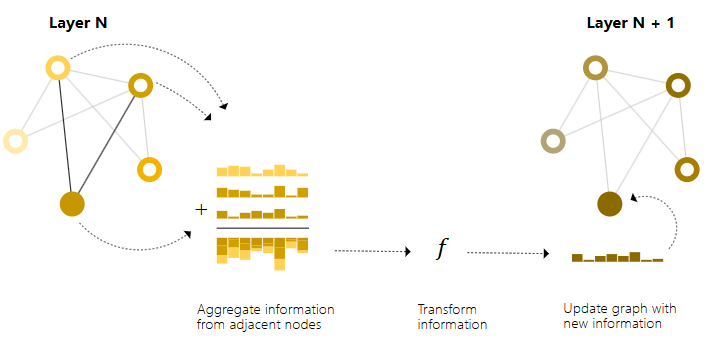
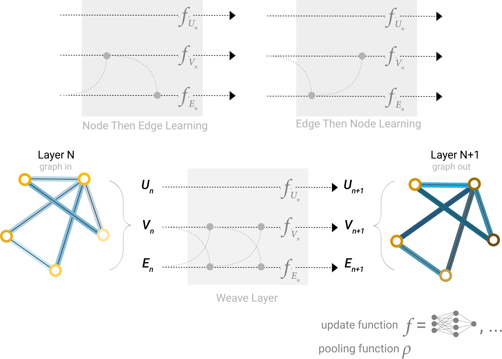
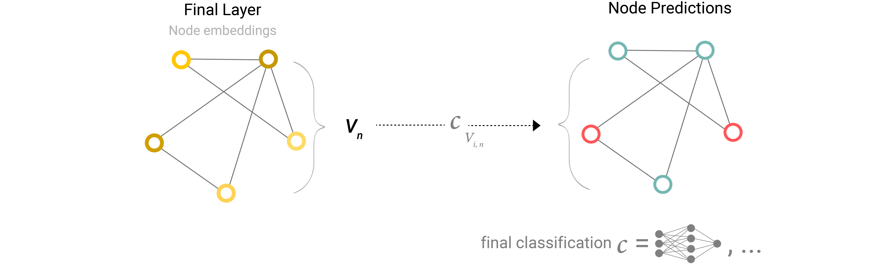
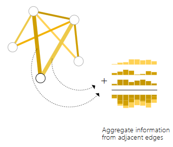
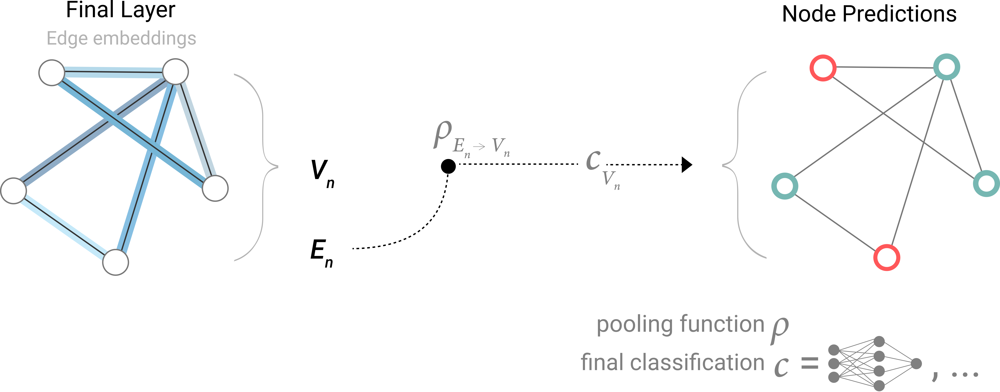

[A Gentle Introduction to Graph Neural Networks](https://distill.pub/2021/gnn-intro/)

图（有向图与无向图）：实体（node）之间的关系（edge）。

+ 节点：节点特性、邻居数量等。
+ 关系：边的密度、边的权重等。
+ 全局：节点数量、最长路径等。

图的表示：

+ 邻接矩阵（Adjacency Matrix）：用于表示图中节点之间的关系，对于n个节点的简单图，有邻接矩阵$A\in R^{n\times n}$
  + 交换矩阵的行或列不改变图。
+ 度矩阵（Degree Matrix）：节点的度表示与该节点相连的边的个数，记作 $d(v)$。
  + 对于n个节点的简单图 $G=(V, E)$，其度矩阵 $D$ 为$D_{ii}=d(v)$，也是一个对角矩阵。
+ 

图的任务：

1. 图层面的任务：对图进行分类等。
2. 节点层面的任务：对节点进行分类等。
3. 关系层面的任务：预测关系等。

图神经网络：对图上所有的属性（节点、边、全局）进行可以优化的可以保持图的对称信息的变换，且不会改变图的连接性。

GNN：

+ 对节点、边、全局的属性单独进行变换。
  + 
+ 使用信息传递
  + 利用相邻节点的信息一起进行变换。
    + 
    + 
  + 利用边的信息来更新节点的信息；利用节点的信息来更新边的信息（以下为更新的三种方式）：
    + 
  + 全局的信息传递：
    + 一个方法是使用一个抽象的全局节点和所有的节点和边相连。
      + 

对结果进行输出：

1. 直接将信息通过网络，得到结果：
   1. 
2. 使用相邻的节点信息与自身节点信息通过网络，得到结果：
   1. 
3. 如果只有边信息，尝试预测节点信息：
   1. 
4. 

图的其他类型：

1. 多重图：包含有向边和无向边的图。
2. 嵌套图（超节点图）：一个节点代表一个图。
3. 超图：一条边可以连接到多个节点。

GNN的采样和批处理

1. 随机节点采样：先随机抽取一定数量的节点作为节点集，接着添加与该节点集距离为 k 的相邻节点及其边，每个邻域可视为一个单独的图，GNN 可在这些子图批次上进行训练，同时通过掩码损失仅考虑节点集，因为相邻节点邻域不完全。
2. 随机游走采样：先随机选择一个起始节点，然后扩展其邻域至距离 k，再从扩展集中选取其他节点，当达到一定数量的节点、边或子图时停止操作。
3. 扩散采样：从一个根节点开始，根据一定规则（如基于节点重要性或随机概率）扩散到相邻节点，选取访问到的节点和边构建子图，同样在满足一定条件时停止操作。

GNN的不同的汇聚操作：

