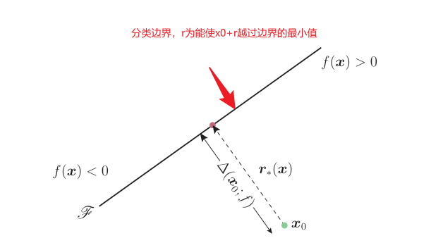
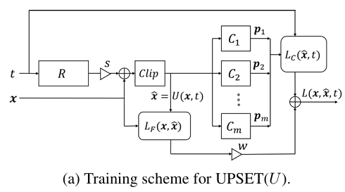
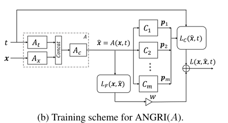

[Threat of Adversarial Attacks on Deep Learning in Computer Vision: A Survey

[https://zhuanlan.zhihu.com/p/621188598](https://arxiv.org/abs/1801.00553)

# 对抗攻击的12种攻击方法

## 对分类网络的攻击

| 方法               | 黑/白盒 | 定向/非定向 | 特定/通用 | 扰动范数                            | 学习方式 | 简介                                                         |
| ------------------ | ------- | ----------- | --------- | ----------------------------------- | -------- | ------------------------------------------------------------ |
| L-BFGS             | 白盒    | 定向        | 特定      | $\ell_{\infty}$                     | 一步     | 使用L-BFGS算法来最小化对抗样本与原始样本之间的距离，同时确保模型对样本的分类发生变化 |
| FGSM               | 白盒    | 定向        | 特定      | $\ell_{\infty}$                     | 一步     | 通过沿着损失函数梯度的方向施加一步扰动来快速生成对抗样本     |
| BIM & ILCM         | 白盒    | 非定向      | 特定      | $\ell_{\infty}$                     | 迭代     | 基于FGSM的迭代版本，通过多次迭代逐步增加扰动以提高对抗样本的成功率 |
| JSMA               | 白盒    | 定向        | 特定      | $\ell_0$                            | 迭代     | 利用输入特征相对于输出的变化敏感性来选择并修改少量关键像素点，以误导模型 |
| One-pixel          | 黑盒    | 非定向      | 特定      | $\ell_0$                            | 迭代     | 仅通过改变图像中的一个或少数几个像素点来产生对抗样本         |
| C&W attacks        | 白盒    | 定向        | 特定      | $\ell_0$, $\ell_2$, $\ell_{\infty}$ | 迭代     | 能够针对多种范数约束生成难以察觉的对抗样本                   |
| DeepFool           | 白盒    | 非定向      | 特定      | $\ell_2$, $\ell_{\infty}$           | 迭代     | 通过迭代地计算模型决策边界的最近点来生成对抗样本             |
| Uni. perturbations | 白盒    | 非定向      | 通用      | $\ell_2$, $\ell_{\infty}$           | 迭代     | 寻找通用的扰动，可以应用于不同的干净样本上，使得它们都被误分类 |
| UPSET              | 黑盒    | 定向        | 通用      | $\ell_{\infty}$                     | 迭代     | 一种黑盒攻击方法，能够在物理世界中生成对抗样本，并且这些样本对于不同模型具有一定的通用性 |
| ANGRI              | 黑盒    | 定向        | 特定      | $\ell_{\infty}$                     | 迭代     | 通过随机初始化结合梯度信息来生成对抗样本，是一种黑盒定向攻击方法，特别适用于不知道模型内部结构的情况 |
| Houdini            | 黑盒    | 定向        | 特定      | $\ell_2$, $\ell_{\infty}$           | 迭代     | 通过生成特定于任务损失函数的对抗样本实现对抗攻击，除了图像分类网络，该算法还可以用于欺骗语音识别网络。 |
| ATNs               | 白盒    | 定向        | 特定      | $\ell_{\infty}$                     | 迭代     | 通过训练一个神经网络来学习如何将正常样本转换为对抗样本       |

### Box-constrained L-BFGS

寻找最小的损失函数添加项，使得神经网络做出误分类，将问题转化成凸优化过程。

目标函数：$ \min⁡ c⋅\Vert\delta\Vert_2+L(I_c+\delta), s.t. I_c+\delta∈[0,1]^m$

1. $I_c$表示原始图像
2. $\delta$表示对原始图像$I_c$的扰动
3. $c$是一个正则化参数，用于平衡扰动大小和损失函数之间的关系
4. $\Vert\delta\Vert_2$是$\delta$的$L_2$范数，即$\sum_{i=1}^{m} \delta_i^2$
5. $L(I_c+\delta)$为扰动后图像上的损失
6. $I_c+\delta \left[0,1\right]^m\in $确保扰动后的图像仍然在合法的像素值范围内

过程：

1. 目标函数的梯度计算：
   - 需要计算 $F(\delta)$ 对 $\delta$ 的梯度：$ ∇_{\delta}F(δ)=c⋅∇_{\delta}\Vertδ\Vert_2+∇_{\delta} L(I_c+\delta)$.
   - $L(I_c + \delta)$ 通常通过反向传播计算分类器的梯度。
2. Box 投影操作：
   - L-BFGS 会生成一系列候选扰动 $\delta^{(k)}$。
   - 如果 $\delta^{(k)}$ 超出边界，则使用投影操作将其投影回约束范围： $\delta^{(k)} = \min(\max(\delta^{(k)}, -I_c), 1 - I_c)$
3. 优化迭代：
   - 使用 L-BFGS 算法迭代更新 $\delta^{(k)}$，直到目标函数 $F(\delta)$ 收敛。
   - 停止条件包括：
     - 损失函数 $F(\delta)$ 不再显著变化。
     - $\delta^{(k)}$ 导致分类器的输出达到目标类别。
4. 动态调整正则化参数 $c$
   1. 开始用初始值 $c$，运行L-BFGS优化。
   2. 检查优化后的扰动 $\delta$ 是否能满足分类器的目标结果（即，$I_c + \delta$ 的预测为目标类别 $y_t$）。
      1. 如果成功，减小 $c$，进一步最小化扰动。
      2. 如果失败，增大 $c$，允许更大的扰动。
   3. 重复二分搜索，直到找到最小的 $c > 0$。

#### 代码实现

```python
import numpy as np
from scipy.optimize import minimize

# 损失函数的封装
def objective_function(delta, I_c, c, target_label, classifier):
    perturbed_image = I_c + delta
    # 分类器的损失 (如交叉熵损失)
    loss = classifier.loss(perturbed_image, target_label)
    # 正则项
    regularization = c * np.linalg.norm(delta, ord=2)
    return loss + regularization

# 梯度计算
def gradient(delta, I_c, c, target_label, classifier):
    perturbed_image = I_c + delta
    # 计算损失的梯度
    loss_grad = classifier.loss_gradient(perturbed_image, target_label)
    # 正则项的梯度
    regularization_grad = 2 * c * delta
    return loss_grad + regularization_grad

# 投影操作
def project(delta, I_c):
    return np.clip(delta, -I_c, 1 - I_c)

# 优化流程
def box_constrained_l_bfgs(I_c, target_label, classifier, c_init, c_min, c_max, tol):
    c = c_init
    while c_max - c_min > tol:
        # 优化问题定义
        result = minimize(
            fun=objective_function,
            x0=np.zeros_like(I_c),  # 初始扰动
            args=(I_c, c, target_label, classifier),
            jac=gradient,
            bounds=[(-I_c[i], 1 - I_c[i]) for i in range(I_c.size)],
            method='L-BFGS-B'
        )
        delta = result.x.reshape(I_c.shape)
        # 检查分类器结果
        if classifier.predict(I_c + delta) == target_label:
            c_max = c  # 减小正则化参数
        else:
            c_min = c  # 增大正则化参数
        c = (c_min + c_max) / 2
    return delta
```


###  Fast Gradient Sign Method (FGSM)

通过用识别概率最小的类别（目标类别）代替对抗扰动中的类别变量，再将原始图像减去该扰动，原始图像就变成了对抗样本，并能输出目标类别。

给定一个原始图像$I_c$ 和一个小的标量值$\epsilon$，FGSM 生成扰动的过程：$\delta = \epsilon \cdot \mathrm{sign}(\nabla_{I_c } L(I_c,y))$

1. $\nabla_{I_c } J(I_c,y)$是损失函数$L$对输入图像$I_c$与目标标签$y$的梯度
2. $\mathrm{sign}(\cdot)$函数将梯度中的每个元素转换为其符号（正、负或零）
   1. 符号函数只改变了每个像素的正负方向，而不改变其绝对值
3. $\epsilon$用于控制扰动的大小

两种攻击目标：

1. 非目标攻击 (Untargeted Attack)
   1. 目标: 让模型的输出偏离原始预测结果，达到错误分类
   2. 实现: 在非目标攻击中，计算损失使用的是模型正常预测的标签，并且扰动沿着**损失增加的方向**（即梯度的正方向）施加
   3. 解释: 这里是加梯度，因为增加梯度方向的扰动会让模型对正确类别的置信度降低，从而更容易错误分类
2. 目标攻击 (Targeted Attack)
   1. 目标: 让模型的输出变为目标类别（攻击者指定的类别）
   2. 实现: 在目标攻击中，计算损失使用的是目标标签，并且扰动沿着**损失减少的方向**（即梯度的反方向）施加
   3. 解释: 这里是减梯度，因为减少损失意味着引导模型的预测结果朝目标类别靠近

#### 代码实现

```python
import torch
import torch.nn.functional as F

def fgsm_attack(model, input_image, target_label, epsilon):
    """
    Args:
        model (torch.nn.Module): 用于分类的模型。
        input_image (torch.Tensor): 输入的原始图像 (batch_size, channels, height, width)，
                                    值通常在 [0, 1]。
        target_label (torch.Tensor): 目标类别的标签 (batch_size,)。
        epsilon (float): 控制扰动大小的参数。
    
    Returns:
        torch.Tensor: 添加扰动后的对抗样本。
    """
    # 确保输入图像需要梯度计算
    input_image.requires_grad = True
    # 将图像传递给模型，计算损失
    output = model(input_image)  # 模型预测 logits
    loss = F.cross_entropy(output, target_label)  # 使用交叉熵损失函数
    # 计算输入图像的梯度
    model.zero_grad()  # 清除先前的梯度
    loss.backward()    # 反向传播计算梯度
    # 生成扰动：计算梯度的符号，然后乘以 epsilon
    grad_sign = input_image.grad.data.sign()
    perturbation = epsilon * grad_sign
    # 添加扰动生成对抗样本
    adversarial_image = input_image + perturbation
    # 确保对抗样本仍然在合法像素范围 [0, 1]
    adversarial_image = torch.clamp(adversarial_image, 0, 1)
    return adversarial_image
```


### Basic & Least-Likely-Class Iterative Methods

#### Basic Iterative Method (BIM)

迭代地采取多个小步骤，同时在每个步骤后调整方向。

$I_{\rho}^{i+1} = \mathrm{Clip}_{\epsilon}\left\{I_{\rho}^{i} + \alpha \mathrm{sign}(\nabla L(\theta, I_{\rho}^{i},y))\right\}$

1. $I_{\rho}^{i}$表示第$i$轮迭代后的对抗样本
2. $y$为正常预测的标签

#### Iterative Least-likely Class Method (ILCM)

$I_{\rho}^{i+1} = \mathrm{Clip}_{\epsilon}\left\{I_{\rho}^{i} - \alpha \mathrm{sign}(\nabla L(\theta, I_{\rho}^{i},y_{target}))\right\}$

从而改变对抗样本的分类为目标标签

### Jacobian-based Saliency Map Attack (JSMA)

利用网络输出层关于输入图像的梯度信息来构建一个显著性图(saliency map)。

这个显著性图用来指示哪些像素点的变化最有可能导致模型将图像分类为攻击者指定的目标类别，而非原始类别。

通过选择最能有效欺骗网络的像素并对其进行更改，重复这个过程，直到改变对抗性图像中允许的最大像素数或者欺骗成功。

#### 计算saliency map过程

1. 首先明确攻击的目标类别$t$和原始（正确）类别$y$。
2. 对于给定的输入图像$X$，计算模型输出对输入图像每个像素的偏导数，即形成雅可比矩阵$J$。雅可比矩阵的每一项$J_{ij}$表示第$i$个输出节点相对于第$j$个输入像素的变化率。
   1. 如果模型有$n$个输出节点（例如分类问题中的类别数量），而输入图像有$m$个像素，则雅可比矩阵$J$的维度为$n×m$。
3. 为了构造显著性图，需要定义一个函数来衡量改变特定像素对目标类别的预测概率的影响。通常采用的是以下两种形式之一：
   - 直接使用雅可比矩阵中对应于目标类别和当前像素的元素。
   - 使用一种组合形式，比如考虑同时增加目标类别$t$的概率和减少原始类别$y$的概率，这可以通过计算$J_{tj}−J_{yj}$来实现
4. 根据上述度量方法，为每个像素分配一个值，形成显著性图。
   1. 显著性图上的每一个值反映了修改该像素后可能对目标类别预测概率增益的大小。
   2. 较大的正值表示修改该像素有助于将图像分类为目标类别；
   3. 较小或负值则意味着修改该像素可能不利于达到目的。
5. 在实际操作时，还需要考虑一些额外的约束条件，比如确保修改后的像素值仍在合理范围内，以及避免选择那些已经修改过的像素等。

#### 代码实现

```python
import torch
import torch.nn as nn
import numpy as np
from PIL import Image
import matplotlib.pyplot as plt

def compute_jacobian(model, image):
    """
    参数:
        model: PyTorch模型
        image: 输入图像 (Variable)
    """
    # 设置图像为变量并跟踪梯度
    if not isinstance(image, torch.Tensor):
        image = torch.tensor(image, requires_grad=True, dtype=torch.float32)
    else:
        image.requires_grad_(True)
    # 获取输出层张量
    output = model(image.unsqueeze(0))  # 增加batch维度
    num_classes = output.size(1)
    jacobian = torch.zeros((num_classes, *image.shape))
    for i in range(num_classes):
        # 清空梯度
        model.zero_grad()
        # 只针对第i个类别的输出计算梯度
        grad_output = torch.zeros_like(output)
        grad_output[0, i] = 1  # 假设batch size为1
        # 计算梯度
        output.backward(gradient=grad_output, retain_graph=True)
        # 将梯度复制到雅可比矩阵
        jacobian[i] = image.grad.data.clone()
    return jacobian.numpy()

def compute_saliency_map(jacobian, target_class, original_class):
    """
    参数:
        jacobian: 雅可比矩阵
        target_class: 目标类别索引
        original_class: 原始类别索引
    """
    # 计算目标类别的梯度
    target_gradient = jacobian[target_class]
    # 计算原始类别的梯度
    original_gradient = jacobian[original_class]
    # 计算显著性图
    saliency_map = target_gradient - original_gradient
    # 确保正值
    saliency_map = np.maximum(saliency_map, 0)
    return saliency_map

def jsma_attack(model, image, target_class, original_class, max_perturbed_pixels=50):
    """
    参数:
        model: PyTorch模型
        image: 输入图像 (numpy array)
        target_class: 目标类别索引
        original_class: 原始类别索引
        max_perturbed_pixels: 最多允许修改的像素数量
    """
    adversarial_image = image.copy()
    perturbed_pixels = 0
    while perturbed_pixels < max_perturbed_pixels:
        # 计算当前对抗样本的雅可比矩阵
        jacobian = compute_jacobian(model, torch.tensor(adversarial_image))
        # 计算显著性图
        saliency_map = compute_saliency_map(jacobian, target_class, original_class)
        # 找到显著性图中最大值的位置
        max_index = np.unravel_index(np.argmax(saliency_map), saliency_map.shape)
        # 修改该位置的像素值
        # 这里简单地增加一个小扰动，实际应用中可能需要更复杂的策略
        delta = 0.01  # 小扰动大小
        adversarial_image[max_index] += delta
        # 检查是否已经成功欺骗了模型
        with torch.no_grad():
            output = model(torch.tensor(adversarial_image).unsqueeze(0))
            predicted_class = torch.argmax(output, dim=1).item()
        if predicted_class == target_class:
            print(f"Attack succeeded after modifying {perturbed_pixels + 1} pixels.")
            break
        perturbed_pixels += 1
    return adversarial_image

# 加载你的模型
model = ...  # 这里加载你的模型
model.eval()  # 设置模型为评估模式
# 准备输入图像
image_path = 'path_to_your_image.jpg'
image = Image.open(image_path).convert('RGB')
image = np.array(image, dtype=np.float32) / 255.0  # 归一化
image = image.transpose(2, 0, 1)  # 转换为C, H, W格式
# 设置目标类别和原始类别
target_class = ...  # 目标类别索引
original_class = ...  # 原始类别索引
# 执行JSMA攻击
adversarial_image = jsma_attack(model, image, target_class, original_class)
```

### One Pixel Attack

通过修改图像中的单个像素来欺骗深度学习分类器。

具体使用了差分进化（Differential Evolution）算法来寻找能够最大化改变分类器输出的像素位置和颜色值。

**这种攻击方法只需要知道目标模型对输入图像的预测概率，而不需要了解模型内部的工作机制，因此是一种黑盒攻击方法。**

过程：

1. 首先，对于一个干净的图像$I_c$，创建一组 400 个向量，每个向量包含五个元素（xy 坐标和 RGB 颜色值），表示一个候选像素的位置和颜色。
2. 随机修改这些向量以生成新的“子代”向量。
   1. 每个子代向量与它的父代竞争，以决定谁会在下一次迭代中存活下来。
   2. 这里的适应度函数是基于神经网络对修改后的图像进行分类时的置信度——目标是找到一个像素更改，使得网络对错误类别的置信度最高。
3. 经过多轮迭代后，最终保留下来的子代向量被用来修改原始图像中的相应像素。这个修改后的图像就是对抗样本。

### Carlini and Wagner Attacks (C&W)

[C&W attack - 知乎](https://zhuanlan.zhihu.com/p/259727988)

[基于优化的攻击——CW](https://www.cnblogs.com/tangweijqxx/p/10627360.html)

C&W 攻击能够绕过防御蒸馏（defensive distillation，通过训练过程中的温度参数调整来平滑模型输出分布的技术，用于提高模型抵抗对抗样本的能力）。

C&W 攻击展示了对抗样本的迁移性，即在一个未加固的模型上生成的对抗样本可以在另一个加固后的模型上同样有效。

1. C&W攻击寻找对抗样本的问题定义：$\mathrm{minimize}D(x, x+\delta),\ s.t.\ C(x+\delta)=t, (x+\delta) \in \left[0,1\right]^n$
2. 使问题易被梯度算法求解：
   1. 将$C(x+\delta)=t$约束变为等价的objection function，与$D(x, x+\delta)$一起优化
      1. 建立$f$，使得$C(x+\delta)=t$成立当且仅当$f(x+\delta) \leq 0$
      2. 问题定义：$\mathrm{minimize}(\Vert\delta\Vert_p + c\cdot f(x+\delta)), s.t. (x+\delta) \in \left[0,1\right]^n$
   2. 将$(x+\delta) \in \left[0,1\right]^n$约束在生成对抗扰动$\delta$中实现
      1. 作者提出了三种基于距离度量的攻击：$\ell_0, \ell_2, \ell_\infty$
      2. 不去更新$\delta$，而是更新$w_i$
      3. $\ell_2$攻击：
         1. $\delta_i = \frac{1}{2}(\tanh(w_i)+1)-x_i \in [0,1]$
            1. $-1 \leq \tanh(w_i) \leq 1$
         2. 问题定义：$\mathrm{minimize}(\Vert \frac{1}{2}(\tanh(w_i)+1)-x_i\Vert_p + c\cdot f(\frac{1}{2}(\tanh(w_i)+1))$

通过以上问题定义，使用梯度下降等方法进行训练，得到合适的$w_i$，即可生成对抗样本$\frac{1}{2}(\tanh(w_i)+1)+1$

### DeepFool

#### 论文笔记

[DeepFool: a simple and accurate method to fool deep neural networks](https://arxiv.org/pdf/1511.04599)

##### 问题定义

对于给定的分类器，将对抗性扰动定义为最小扰动$r$，该扰动足以改变估计的标签$\hat{k}(x)$：

$\begin{equation}
    \Delta(x;\hat{k}) := min_r \|r\|_2\ subject\ to\ \hat{k}(x+r) \neq \hat{k}(x)
\end{equation}$，其中$x$是图像，$\hat{k}(x)$是估计的标签。

定义$\Delta(x;\hat{k})$为在$x$上$\hat{k}$的鲁棒性，即找到一个向量$r$，使得$\Vert r\Vert_2$最小，并且$\hat{k}(x+r) \neq \hat{k}(x)$。

分类器$\hat{k}$的鲁棒性定义为：$\rho_{adv}(\hat{k}) = E_x \frac{\Delta(x;\hat{k})}{\|x\|_2}$，对于给定的分类器$\hat{k}$，计算每个输入$x$所需的最小扰动大小$\Delta(x;\hat{k})$以改变其分类结果，然后将这个值除以$x$的$L_2$范数以归一化，最后对所有这样的比值求平均。

得到的结果反映了分类器在面对对抗性攻击时的整体鲁棒性水平——平均来说，需要多大的相对扰动才能让分类器出错。

较高的$\rho_{adv}(\hat{k})$值意味着分类器更鲁棒，因为需要更大的相对扰动才能使其犯错；

相反，较低的值表明分类器更容易受到对抗性攻击的影响。

##### 二分类器中的DeepFool

多类分类器可以视为二分类器的集合。

这里假设$\hat{k}(x) = \mathrm{sign}(f(x))$，其中$f$是任意标量值图像分类函数$f : R^n \to R$，定义分类边界*为 $f(x) = 0$。*

我们首先分析仿射分类器 $f(x) = w^Tx + b$ 的情况，然后推广通用算法，该算法可用于任何可微分的二分类器 $f$。

在分类器$f$是仿射的情况下，很容易看出 $f$ 在点 $x_0$ 的鲁棒性 $\Delta(x_0; f)$ 等于从 $x_0$ 到分离仿射平面的距离 $F = \{x : w^Tx + b = 0\}$。

改变分类器决策的最小扰动对应于 $x_0$ 在 F 上的正交投影。



可得出 $r_*(x_0) := \arg \min_{r} \|r\|_2\ \text{subject to } \mathrm{sign}(f(x_0 + r)) \neq \mathrm{sign}(f(x_0))$

由于$f(x)=w^Tx+b$，该式子存在解析解：$r_*(x_0) := -\frac{f(x_0)}{\|w\|^2} w$

现在假设$f$是一个通用的二可微分类器，采用一个迭代过程来估计鲁棒性$\Delta(x_0;f)$。

具体来说，在每次迭代中，$f$围绕当前点$x_i$​线性化，线性化分类器的最小扰动计算为$\arg \min_{r_i} \|r_i\|_2 \quad \text{subject to } f(x_i) + \nabla f(x_i)^Tr_i = 0$

> $\mathrm{sign}(f(x_0 + r)) \neq \mathrm{sign}(f(x_0))$，用泰勒展开来近似$f$在$x_i$附近的值$f(x_i+r_i) \approx f(x_i) + \nabla f(x_i)^Tr_i$，可以转化为$f(x_i) + \nabla f(x_i)^Tr_i = 0$

算法伪代码：

> **Algorithm 1** DeepFool for Binary Classifiers 
>
> 1. **Input:** Image $ \mathbf{x} $, classifier $ f $. 
> 2. **Output:** Perturbation $ \hat{\mathbf{r}} $. 
> 3. Initialization:  $\mathbf{x}_0 \leftarrow \mathbf{x}$,  $i \leftarrow 0$. 
> 4. **While** $ \text{sign}(f(\mathbf{x}_i)) = \text{sign}(f(\mathbf{x}_0)) $ **do**
>    1. $\mathbf{r}_i \leftarrow -\frac{f(\mathbf{x}_i)}{\lVert \nabla f(\mathbf{x}_i) \rVert_2^2} \nabla f(\mathbf{x}_i)$
>    2. $\mathbf{x}_{i+1} \leftarrow \mathbf{x}_i + \mathbf{r}_i$
>    3.  $i \leftarrow i + 1$
> 5. **end while**
> 6. **return** $\hat{\mathbf{r}} = \sum_i \mathbf{r}_i.$

##### 多类分类器中的DeepFool

分类器具有$c$个输出，其中$c$是类的数量。

因此，可以将分类器定义为：$f:R_n \to R_c$，并通过以下映射完成分类： $\hat{k}(\boldsymbol{x}) = \underset{k}{\text{arg max}} ~ f_k(\boldsymbol{x})$，$f_k(x)$是与第$k$个类相对应的$f(x)$的输出。

###### 仿射分类器

假设$f(x)$为仿射分类器$f(x) = W^Tx+b$，则最小扰动为：
$$
\underset{\boldsymbol{r}}{\operatorname{arg}\,\operatorname{min}} \left \| \boldsymbol{r} \right \|_2 \\
s.t.\; \exists k: \boldsymbol{w}_{k}^\top(\boldsymbol{x}_0+\boldsymbol{r}) + b_k \geq \boldsymbol{w}_{\hat{k}(\boldsymbol{x}_0)}^\top(\boldsymbol{x}_0+\boldsymbol{r}) + b_{\hat{k}(\boldsymbol{x}_0)}
$$
其中，$\boldsymbol{w}_k$ 是$W$的第$k$列。

在几何上，上述问题对应于 $\boldsymbol{x}_0$ 与凸多面体P的**补数**之间的距离的计算：$P = \bigcap_{k=1}^{c} \{ \boldsymbol{x}: f_{\hat{k}(\boldsymbol{x}_0)}(\boldsymbol{x}) \geq f_k(\boldsymbol{x}) \}$，即$P$是所有满足条件 $f_k(x) \geq f(x)$的点$x$构成的集合的交集，其中$k$遍历所有类别$1$到$c$。

将$\hat{l}(x_0)$定义为$P$边界的最近超平面：$\hat{l}(x_0) = \underset{k \neq \hat{k}(x_0)} {\arg \min} \frac{|f_k(x_0) - f_{\hat{k}(x_0)}(x_0)|}{||w_k - w_{\hat{k}(x_0)}||_2}$，

即求离$x_0$最近的超平面，可以使$f_{\hat{k}(\boldsymbol{x}_0)}(\boldsymbol{x}) \leq f_k(\boldsymbol{x})\ s.t. k \neq \hat{k}(x_0)$

一旦确定了最近的超平面$\hat{l}(x_0)$，就可以计算最小扰动$r_*(x_0)$。

这个扰动是将$x_0$投影到最近的超平面上的向量，具体公式如下：
$$
r_*(x_0) = \frac{|f_{\hat{l}(x_0)}(x_0) - f_{\hat{k}(x_0)}(x_0)|}{||w_{\hat{l}(x_0)} - w_{\hat{k}(x_0)}||_2} (w_{\hat{l}(x_0)} - w_{\hat{k}(x_0)})
$$

###### 通用分类器

对于一般的非线性分类器，描述分类器输出标签$\hat{k}(x_0)$的空间区域的集合$P$不再是多面体。

在二分类情况下遵循解释的迭代线性化过程，我们在迭代$i$处通过多面体$\widetilde{P}_i$近似集合$P$
$$
\widetilde{P}_i = \bigcap_{k=1}^{c} \left\{ \mathbf{x} : f_k(\mathbf{x}_i) - f_{\hat{k}(\mathbf{x}_0)}(\mathbf{x}_i) + \nabla f_k(\mathbf{x}_i)^{\top} \mathbf{x} - \nabla f_{\hat{k}(\mathbf{x}_0)}(\mathbf{x}_i)^{\top} \mathbf{x} \leq 0 \right\}
$$

$f_k(\mathbf{x}_i) - f_{\hat{k}(\mathbf{x}_0)}(\mathbf{x}_i)$衡量的是在点$x_i$上，分类器对类别$k$的输出与对原始输入$x_0$预测类别的输出之差。

$\nabla f_k(\mathbf{x}_i)^{\top} \mathbf{x} - \nabla f_{\hat{k}(\mathbf{x}_0)}(\mathbf{x}_i)^{\top} \mathbf{x}$是关于新点$x$的线性项，利用了分类器在点$x_i$上对类别$k$和原始预测类别的梯度，提供了局部变化率的信息，因此这个线性项描述了当在$x_i$周围移动时，分类器对这两个类别输出的变化情况。

> **Algorithm 2** DeepFool for Multi-Class Classifiers
>
> 1. **Input:** Image $ \mathbf{x} $, classifier $ f $.
> 2. **Output:** Perturbation $ \hat{\mathbf{r}} $.
> 3. Initialization: $\mathbf{x}_0 \leftarrow \mathbf{x}$, $i \leftarrow 0$.
> 4. **While** $ \hat{k}(\mathbf{x}_i) = \hat{k}(\mathbf{x}_0) $ **do**
>    1. **For** $k \neq \hat{k}(\mathbf{x}_0)$ **do** 
>       1. $\mathbf{w}'_k \leftarrow \nabla f_k(\mathbf{x}_i) - \nabla f_{\hat{k}(\mathbf{x}_0)}(\mathbf{x}_i)$
>       2. $f'_k \leftarrow f_k(\mathbf{x}_i) - f_{\hat{k}(\mathbf{x}_0)}(\mathbf{x}_i)$
>    2. **End For**
>    3. $\hat{l} \leftarrow \arg\min_{k \neq \hat{k}(\mathbf{x}_0)} \frac{|f'_{k}|}{\|\mathbf{w}'_{k}\|_2}$ （选择最有可能将当前预测类别变为其他类别的扰动方向）
>    4. $\mathbf{r}_i \leftarrow \frac{|f'_{\hat{l}}|}{\|\mathbf{w}'_{\hat{l}}\|^2_2} \mathbf{w}'_{\hat{l}}$
>    5. $\mathbf{x}_{i+1} \leftarrow \mathbf{x}_i + \mathbf{r}_i$
>    6. $i \leftarrow i + 1$
> 5. **end while**
> 6. **return** $\hat{\mathbf{r}} = \sum_i \mathbf{r}_i$

1. $f'_{k}$代表第$k$类相对于当前预测类别的分数差。
2. $\mathbf{w}'_{k}$是一个梯度差异向量，表示从当前预测类别到第$k$类的决策边界的方向。
3. $\frac{|f'_{k}|}{\|\mathbf{w}'_{k}\|_2}$衡量了要使当前预测类别变为第$k$类所需的距离。
   1. 绝对值$|f'_{k}|$确保无论$f'_{k}$是正还是负，都只考虑距离的大小。
   2. 除以${\|\mathbf{w}'_{\hat{l}}\|^2_2}$则是对方向进行标准化，使其不受梯度长度的影响。


#### 代码实现

[对抗样本之DeepFool原理&coding](https://blog.csdn.net/weixin_41466575/article/details/118978636?spm=1001.2014.3001.5502)👈在其代码上进行注释

```python
import numpy as np
from torch.autograd import Variable
import torch as torch
import copy

def deepfool(image, net, num_classes=10, overshoot=0.02, max_iter=100):
    is_cuda = torch.cuda.is_available()
    if is_cuda:
        image = image.cuda()
        net = net.cuda
    # 获取原始输入的分类信息
    f_image = net.forward(Variable(image[None, :, :, :], requires_grad=True)).data.cpu().numpy().flatten()
    # flatten展为一维的，argsort从小到大分类的索引，[::-1]改为从大到小分类的索引
    I = (np.array(f_image)).flatten().argsort()[::-1]
    # I为模型输出的所有类别的可信度的索引（从大到小）
    I = I[0:num_classes]
    # label为模型正常预测的类别
    label = I[0]
    
    input_shape = image.cpu().numpy().shape
    pert_image = copy.deepcopy(image)
    w = np.zeros(input_shape)
    r_tot = np.zeros(input_shape)

    loop_i = 0

    x = Variable(pert_image[None, :], requires_grad=True)
    fs = net.forward(x)
    # 按照索引将fs进行排列
    fs_list = [fs[0,I[k]] for k in range(num_classes)]
    k_i = label

    while k_i == label and loop_i < max_iter:
        pert = np.inf
        # 获取f_{k(x0)}(x)的梯度
        fs[0, I[0]].backward(retain_graph=True)
        grad_orig = x.grad.data.cpu().numpy().copy()
		# 遍历除正常预测所有类别
        for k in range(1, num_classes):
            if x.grad is not None:
            	x.grad.zero_()
            # 获取当前遍历到的类别的f_{k}(x)的梯度
            fs[0, I[k]].backward(retain_graph=True)
            cur_grad = x.grad.data.cpu().numpy().copy()
            # 更新w_k和f_k
            w_k = cur_grad - grad_orig
            f_k = (fs[0, I[k]] - fs[0, I[0]]).data.cpu().numpy()
			# 计算该类别的
            pert_k = abs(f_k)/np.linalg.norm(w_k.flatten())
            # 相当于进行hat l = arg min(...)操作
            if pert_k < pert:
                pert = pert_k
                w = w_k
        # compute r_i and r_tot
        # Added 1e-4 for numerical stability
        r_i =  (pert+1e-4) * w / np.linalg.norm(w)
        x_i = np.float32(r_tot + r_i)

        # 生成对抗样本
        if is_cuda:
            pert_image = image + (1+overshoot)*torch.from_numpy(x_i).cuda()
        else:
            pert_image = image + (1+overshoot)*torch.from_numpy(x_i)
		# 获取新的分类预测
        x = Variable(pert_image, requires_grad=True)
        fs = net.forward(x)
        k_i = np.argmax(fs.data.cpu().numpy().flatten())

        loop_i += 1
    
    x_i = (1+overshoot) * x_i
    return x_i, loop_i, label, k_i, pert_image


# 这几个变量主要用于之后的测试以及可视化
adver_example_by_FOOL = torch.zeros((batch_size,1,28,28)).to(device)
adver_target = torch.zeros(batch_size).to(device)
clean_example = torch.zeros((batch_size,1,28,28)).to(device)
clean_target = torch.zeros(batch_size).to(device)
# 从test_loader中选取1000个干净样本，使用deepfool来生成对抗样本
for i,(data,target) in enumerate(test_loader):
	if i >= adver_nums/batch_size :
		break
	if i == 0:
    	clean_example = data
    else:
        clean_example = torch.cat((clean_example,data),dim = 0)
    cur_adver_example_by_FOOL = torch.zeros_like(data).to(device)
    for j in range(batch_size):
        r_rot,loop_i,label,k_i,pert_image = deepfool(data[j],simple_model)
        cur_adver_example_by_FOOL[j] = pert_image
  	# 使用对抗样本攻击VGG模型
    pred = simple_model(cur_adver_example_by_FOOL).max(1)[1]
	# print (simple_model(cur_adver_example_by_FOOL).max(1)[1])
    if i == 0:
        adver_example_by_FOOL = cur_adver_example_by_FOOL
        clean_target = target
        adver_target = pred
    else:
        adver_example_by_FOOL = torch.cat((adver_example_by_FOOL , cur_adver_example_by_FOOL), dim = 0)
        clean_target = torch.cat((clean_target,target),dim = 0)
        adver_target = torch.cat((adver_target,pred),dim = 0)

print (adver_example_by_FOOL.shape)
print (adver_target.shape)
print (clean_example.shape)
print (clean_target.shape)
```

### Universal Adversarial Perturbations

Universal Adversarial Perturbations能生成**对任何图像实现攻击**的扰动。

#### 论文笔记

[Universal Adversarial Perturbations](https://ieeexplore.ieee.org/document/8099500)

为了求解一个通用扰动 $v$ ，使得：
$$
\hat{k}(x + v) \neq \hat{k}(x) \text{ for "most" } x \sim \mu
$$
$\mu$ 代表图像的数据分布， $\hat{k}(x)$ 是对应输入 $x$ 网络输出的预测结果，附加的约束条件为：
$$
\|v\|_p \leq \xi \\
\mathbb{P}_{x \sim \mu} \left( \hat{k}(x + v) \neq \hat{k}(x) \right) \geq 1 - \delta
$$
$\xi$ 代表了扰动向量的量级， $\delta$ 定量了希望欺骗的比例。

在每次迭代中，计算将当前扰动点$x_i + v$发送到分类器决策边界的最小扰动$\Delta v_i$，并将其汇总到通用扰动的当前实例$v$。

如果当前的通用扰动 $ v $ 不能欺骗数据点 $ x_i $，可以通过解决以下优化问题来寻求具有最小范数的额外扰动 $ \Delta v_i $ 来欺骗数据点 $ x_i $：
$$
\Delta v_i \gets \arg \min_r \|r\|_2 \text{ s.t. } \hat{k}(x_i + v + r) \neq \hat{k}(x_i).
$$
同时为了保证 $ \|v\|_p < \xi $，更新后的扰动会被投影，如下：

$$
\mathcal{P}_{p,\xi}(v) = \arg \min_{v'} \|v - v'\|_2 \text{ subject to } \|v'\|_p \leq \xi.
$$
$v' = v + \Delta v_i$是指在优化过程中调整后的扰动向量。

这个投影操作寻找最接近原始扰动$v$的新向量$v'$，同时保证$v'$的$L_p$范数不超过$\xi$。

- 如果$v$的$L_p$范数已经小于或等于$\xi$，则投影操作不会改变$v$。
- 如果$v$的$L_p$范数大于$\xi$，则需要找到一个最接近$v$且其$L_p$范数不超过$\xi$的向量$v'$。

伪代码：

> **Algorithm 1 Computation of Universal Perturbations** 
>
> 1. **Input:** Data points $X$, classifier $\hat{k}$, desired $\ell_p$ norm of the perturbation $\xi$, desired accuracy on perturbed samples $\delta$. 
> 2. **Output:** Universal perturbation vector $v$. 
> 3. Initialize $v \leftarrow 0$. 
> 4. **while** $\operatorname{Err}(X_v) > 1-\delta$ **do**
>    1. **For** each data point $x_i \in X$ **do** 
>       1. **If** $\hat{k}(x_i + v) = \hat{k}(x_i)$ **then**
>          1. Compute the minimal perturbation that sends $x_i + v$ to the decision boundary:$\Delta v_i \leftarrow \arg \min_{r} \|r\|_2 \text{ s.t. } \hat{k}(x_i + v + r) \neq \hat{k}(x_i).$
>          2. Update the perturbation: $v \leftarrow \mathcal{P}_{p,\xi}(v + \Delta v_i)$
>       2. **End if** 
>    2. **End for**
> 5. **end while**

#### 代码实现

截自👉[LTS4/universal](https://github.com/LTS4/universal)

+ 寻找最小扰动使用的DeepFool方法

```python
import numpy as np
from deepfool import deepfool

def proj_lp(v, xi, p):
    if p == 2:
        v = v * min(1, xi/np.linalg.norm(v.flatten(1)))
        # v = v / np.linalg.norm(v.flatten(1)) * xi
    elif p == np.inf:
        v = np.sign(v) * np.minimum(abs(v), xi)
    else:
         raise ValueError('Values of p different from 2 and Inf are currently not supported...')
    return v

def universal_perturbation(dataset, f, grads, delta=0.2, max_iter_uni = np.inf, xi=10, p=np.inf, num_classes=10, overshoot=0.02, max_iter_df=10):
    ...
    while fooling_rate < 1-delta and itr < max_iter_uni:
        # Shuffle the dataset
        np.random.shuffle(dataset)

        print ('Starting pass number ', itr)

        # Go through the data set and compute the perturbation increments sequentially
        for k in range(0, num_images):
            cur_img = dataset[k:(k+1), :, :, :]

            if int(np.argmax(np.array(f(cur_img)).flatten())) == int(np.argmax(np.array(f(cur_img+v)).flatten())):
                print('>> k = ', k, ', pass #', itr)

                # Compute adversarial perturbation
                dr,iter,_,_ = deepfool(cur_img + v, f, grads, num_classes=num_classes, overshoot=overshoot, max_iter=max_iter_df)

                # Make sure it converged...
                if iter < max_iter_df-1:
                    v = v + dr

                    # Project on l_p ball
                    v = proj_lp(v, xi, p)

    ...
```

### UPSET、ANGRI

[1707.01159](https://arxiv.org/pdf/1707.01159)

UPSET的$R$和ANGRI的$A_t, A_x, A_c$的具体实现可以看论文，对于不同的数据集，有些许不一样。

#### UPSET: Universal Perturbations for Steering to Exact Targets

在一个包含 n 个类别的设置中，UPSET 的目标是生成 n 个**通用扰动**$r_j\ (j \in \left\{1, 2, ...., n\right\}$)，当$r_j$被添加到不属于类别 j 的任何图像时，分类器会将结果图像判定为属于类别 j。

UPSET利用一个残差生成网络$R$，它接收目标类别$t$作为输入，并输出一个与输入图像$X$维度相同的扰动$r_t = R(t)$。

对抗图像通过以下公式生成：$\hat{x} = U(x, t)=\max(\min(s \times R(t) + x, 1), -1)$

+ 缩放因子$s$设置为$2$时，确保了$s \times R(t)$可以将输入空间$[-1, 1]$中的任何值转换为$[-1, 1]$内的任何值。
  + 但可以选择较低的$s$值，限制每个像素的最大可能残差值
+ 在添加扰动后，输出值被裁剪回$[-1, 1]$区间，以保证生成有效的图像。

流程如下：



#### ANGRI: Antagonistic Network for Generating Rogue Images for targeted fooling of deep neural networks

ANGRI 的目标是给定一个输入图像$x$和一个目标类别$t$，将图像转换为一个新的图像$\hat{x}$，使得分类器错误地将其识别为目标类别$t$。

ANGRI 通过一个生成网络$A$来实现这一目标，该网络接收原始图像和目标类别作为输入，并输出对抗图像$\hat{x} = A(x,t)$。

* 由三个主要部分组成：$A_t, A_x, A_c$
* $A_t$是基于目标类别的网络，它接收目标类别信息并生成一个中间表示。
* $A_x$是基于输入图像的网络，它接收输入图像并生成另一个中间表示。
* $A_c$是组合网络，它将$A_t,A_x$的输出合并，进一步处理以生成最终的对抗图像$\hat{x}$。

流程如下：



#### 损失函数

UPSET和ANGRI使用的同一个损失函数。

损失函数$L$结合了分类损失$L_C$和保真度损失$L_F$，定义如下： 
$$
L(\mathbf{x}, \tilde{\mathbf{x}}, t) &=& L_C(\tilde{\mathbf{x}}, t) + L_F(\mathbf{x}, \tilde{\mathbf{x}}) \\
&=& -\sum_{i=1}^{m} log(C_i(\tilde{\mathbf{x}})[t]) + w \left\| \tilde{\mathbf{x}} - \mathbf{x} \right\|^k_k,
$$

- $L_C$是分类损失，具体定义为分类器对对抗图像$\hat{x}$预测目标类别$t$的负对数概率。
  - $C_i(\hat{x})$表示第$i$个预训练分类器对对抗图像$\hat{x}$的输出分类概率分布，而$C_i(\hat{x})[t]$则是该分布中目标类别$t$的概率。
- $L_F$是保真度损失，用来衡量生成的对抗图像$\hat{x}$与原始图像$x$之间的差异，通常使用$L_2$范数（即$k=2$）。
  - $w$是一个权重参数，用于平衡分类损失和保真度损失之间的关系。

### Houdini

[ Houdini: Fooling Deep Structured Prediction Models](https://arxiv.org/abs/1707.05373)

**损失函数Houdini**是一种灵活的方法，旨在直接根据任务损失生成对抗性样本，而不仅仅是依赖于分类任务中常用的替代损失函数。它能够处理那些任务损失为组合且不可微的问题，比如语音识别、姿态估计以及语义分割等。

#### 论文笔记

在一个神经网络模型$g_\theta$中，任务损失函数为$\ell(\cdot)$，并且假设对于任何目标$y$，任务损失$\ell(y,y) = 0$。

对于一个样本$(x,y)$，网络给出的得分为$g_\theta(x, y)$，并且网络的解码器会预测出得分最高的目标：$\hat{y} = y_{\theta}(x) = \underset{y \in Y}{\arg \max}\ g_{\theta}(x, y)$

关于找到一个对抗样本$\tilde{x}$，在选定的 p 范数和噪声参数$\epsilon$的任务损失$\ell(\cdot)$方面欺骗模型$g_\theta$的问题，可归结为求解：
$$
\tilde{x} = \underset{\tilde{x} : \|\tilde{x} - x\|_p \leq \epsilon}{\arg \max} \ell(y_\theta(\tilde{x}), y)
$$
以上提到的任务损失$\ell(\cdot)$经常是组合性的，难以优化，因此通常用一个可微分的代理损失函数代替，记作$\hat{\ell}(y_\theta(\tilde{x}),y)$

本篇论文提出的Houdini的代理损失函数，其定义如下：
$$
\bar{\ell}_H(\theta, x, y) = P_{\gamma \sim N(0,1)} \left[ g_\theta(x, y) - g_\theta(x, \hat{y}) < \gamma \right] \cdot \ell(\hat{y}, y)
$$
Houdini损失是由两个部分组成的乘积:

* 随机边际概率，即实际目标 $g_\theta(x, y)$ 和预测目标 $g_\theta(x, \hat{y})$ 之间的得分差小于从标准正态分布采样的值 $\gamma$ 的概率。
  * 这反映了模型对其预测的信心。
* 任务损失 $\ell(\hat{y}, y)$，它独立于模型。

当模型对预测目标 $\hat{y}$ 的置信度无限增加时，$g_\theta(x, y) - g_\theta(x, \hat{y})$越来越小，Houdini损失收敛到任务损失。

具体来说：当$P_{\gamma \sim N(0,1)} (g_\theta(x, y) - g_\theta(x, \hat{y})\ \textless\ \gamma)$接近于1时，$\bar{\ell}_H(\theta, x, y) = \ell(\hat{y}, y)$。

当模型对自己的预测非常自信时，Houdini损失就能准确地反映任务损失，这是因为此时Houdini损失中的随机边距部分不再起作用，整个损失函数直接由任务损失决定。

在前面的问题$\tilde{x} = \underset{\tilde{x} : \|\tilde{x} - x\|_p \leq \epsilon}{\arg \max} \ell(y_\theta(\tilde{x}), y)$中，使用Houdini损失函数替代$\ell(\cdot)$，并且使用一阶近似的方法。

> 若$\ell(\cdot)$是可微的，则可用一种基于泰勒展开的方法来计算扰动$\delta_x$
> $$
> \tilde{x} = \underset{\tilde{x} : \|\tilde{x} - x\|_p \leq \epsilon}{\arg \max} (\nabla_x\ell(g_\theta(x), y))^T\ (\tilde{x} - x)
> $$

该方法需要计算Houdini损失函数关于输入$x$的梯度，通过链式法则，可以将梯度分解为两部分：
$$
\nabla_x \left[ \bar{\ell}_H(\theta, x, y) \right] = \frac{\partial \bar{\ell}_H(\theta, x, y)}{\partial g_\theta(x, y)} \frac{\partial g_\theta(x, y)}{\partial x}
$$
这里的关键点在于，只需要计算Houdini损失函数关于网络输出$g_\theta(x, y)$的导数，其余部分可以通过反向传播获得。

具体步骤如下：

1. 计算Houdini损失函数关于网络输出的导数：$\nabla_g \left[ \mathbb{P}_{\gamma \sim \mathcal{N}(0,1)} \left[ g_\theta(x, y) - g_\theta(x, \hat{y}) < \gamma \right] \cdot \ell(y, \hat{y}) \right]$
2. 具体计算：$\nabla_g \left[ \mathbb{P}_{\gamma \sim \mathcal{N}(0,1)} \left[ g_\theta(x, y) - g_\theta(x, \hat{y}) < \gamma \right] \cdot \ell(y, \hat{y}) \right] = \nabla_g \left[ \frac{1}{\sqrt{2\pi}} \int_{-\infty}^{\infty} e^{-v^2/2} dv\ \cdot\ \ell(y, \hat{y}) \right]$
3. 简化表达式：$\nabla_g \left[ \bar{\ell}_H(\hat{y}, y) \right] = \begin{cases} 
   -C \cdot e^{-|\delta g(y, \hat{y})|^2/2}\ \cdot\  \ell(y, \hat{y}), & g = g_\theta(x, y) \\
   C \cdot e^{-|\delta g(y, \hat{y})|^2/2}\ \cdot\  \ell(y, \hat{y}), & g = g_\theta(x, \hat{y}) \\
   0, & \text{otherwise}
   \end{cases}$
   1. $C = \frac{1}{\sqrt{2\pi}}$
   2. $\delta g(y, \hat{y}) = g_\theta(x, y) - g_\theta(x, \hat{y})$
   3. 当$g = g_\theta(x,y)$，即网络对真实标签$y$的输出时，梯度为负。
   4. 当$g=g_\theta(x,\hat{y})$，即网络对预测标签$\hat{y}$的输出时，梯度为正。
   5. 其他情况下，梯度为零。


### Adversarial Transformation Networks (ATNs)

通过多个前向神经网络来生成对抗样本，可用于攻击一个或多个网络。

该算法通过最小化一个联合损失函数来生成对抗样本，该损失函数有两个部分：

1. 第一部分使对抗样本和原始图像保持相似；
2. 第二部分使对抗样本被错误分类。
