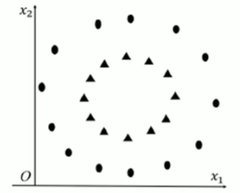
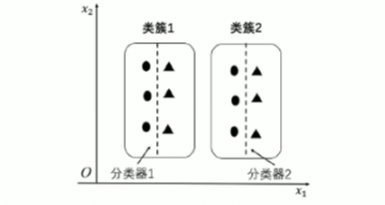
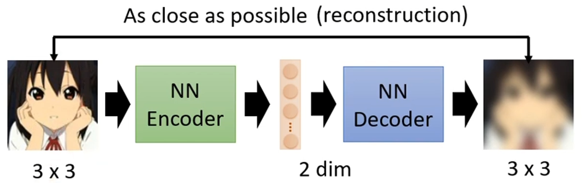
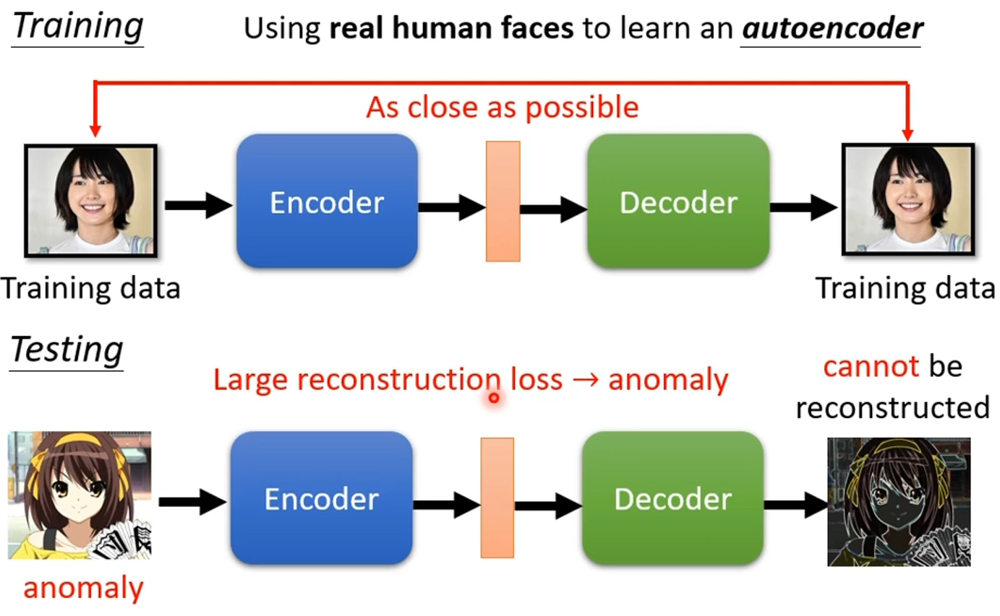

无监督学习是一种无标签数据的机器学习方法。它通过训练数据中的内在特性和分布模式，挖掘数据的潜在结构或规律。

无监督学习的目标不是预测输出，而是发现数据的隐藏结构，例如分组、模式或特征降维。

Kmeans算法

1. 随机选择 $k$ 个质心

Kmeans算法对于特征维度过大的数据，欧氏距离不适用。

特征维度过多会导致每个点的欧氏距离相近。

选择的质心不同会导致聚类结果不同。

存在多个局部最小值，导致结果不同。

1. 通过多次进行聚类，来选择loss最小的一次。
2. 使用kmeans++（找出来的质心是唯一的，没有随机性）

数据量过大，使用随机抽样一部分聚类，得到中心点后，算全部数据的类别。

对于异常点，导致质心变化较大，可使用中位数等方法来防止。

去除噪声：先计算质心，将远离质心的点去除，再计算一次质心。

各维度的归一化，放置某一特征数量级过大起到主导作用，从而使各个维度的特征都参与进来。

K 越多（类簇越多）， Loss 越小。存在拐点 $k$ ，最合适。

如何寻找类簇数量：

1. 先设一个大一点的 K，进行学习，然后把数据量小的类簇取消，比如有 x 个，则类簇数量为 K - x。
2. 先设一个小一点的 K，进行学习，然后把数据量大的类簇在聚一次类，比如有 Kx 个，则类簇数量为 K + Kx。

对于以下的数据，无法使用kmeans解决，需要进行特征转换，比如转化为点对圆心的距离

先聚类，在分类：

区分三角形和圆形，先聚类为两个类簇，再单独为两个类簇分别训练一个分类器。

## PCA（主成分分析，Principle Component Analysis）

用途：降维中最常用的一种手段。

目标：提取最有价值的信息（基于方差）。

1. 在整个数据空间中找到一个坐标轴（方向），使得数据在这个坐标轴上的投影（投影=坐标值）的方差达到最大，那么这个方向就是我们新的坐标系的第一个轴。
2. 再找一个方差次大的，而且与第一个轴垂直的方向（不限制垂直次大方向会和最大方向无限接近），作为新坐标系的第二个轴。
3. 依此类推，直到找出了K个，然后把原来的数据用这新的坐标系进行表示（也就是进行投影），就得到了降维后的数据。

优点：

+ 减少维度：通过降维，减少特征数量，降低计算复杂度，节省存储空间。
+ 提高效率：在数据集非常大的情况下，PCA可以帮助提高计算速度。
+ 去噪：PCA可以去除不重要的成分（如噪声），保留最重要的信息。

缺点：

+ 线性假设：PCA假设数据的主成分是线性组合的，对于非线性数据，PCA的效果可能不理想。
+ 可解释性差：由于主成分是原始特征的线性组合，有时很难解释每个主成分的实际意义。
+ 数据标准化需求：PCA对数据的尺度敏感，因此需要先进行标准化处理，否则某些特征的影响可能会被放大或忽视。

### AutoEncoder

 

假设图片为 $3×3$ 的矩阵，通过 Encoder，生成更小维度的矩阵 $1×2$。

成功的原因：并不是所有的 $3×3$ 的矩阵都是图片，输入的变化其实是有限的。

找出有限的变化，就可以用更小维度的向量进行表示。

1. De-noising Auto-encoder
2.  Anomaly Detection
   1. 使用正常的数据去训练一个autoencoder
   2. 