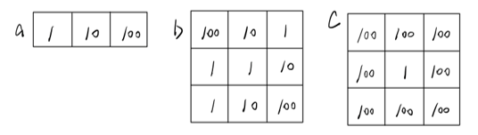
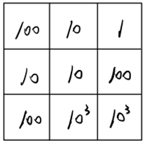
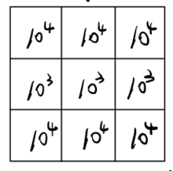
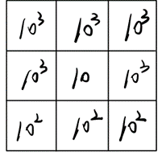

# 前言

以下只是碰到问题的解决方法，顺便对学习到的算法记录一些笔记，并非彻底地讲解动态规划算法

# 问题叙述

以下代码只是对问题的一个简要的描述，实际上十六个数组的元素都不为0。

```python
a = [0] * 16
b, c, d, e, f, g, h, i, j, k, l, m, n, o, p = [[0] * 16] * 16, [[0] * 16] * 16, [[0] * 16] * 16, [[0] * 16] * 16, 
									[[0] * 16] * 16, [[0] * 16] * 16, [[0] * 16] * 16, [[0] * 16] * 16, 
									[[0] * 16] * 16, [[0] * 16] * 16, [[0] * 16] * 16, [[0] * 16] * 16, 
									[[0] * 16] * 16, [[0] * 16] * 16, [[0] * 16] * 16, 
arrays = [b, c, d, e, f, g, h, i, j, k, l, m, n, o, p]
result = 1
index_r = randon.randomint(0, 15)
result *= a[index_r]
for i in range(15):
	index_c = randon.randomint(0, 15)
	result *= arrays[i][index_r][index_c]
	index_r = index_c

print(result)
```

可以看出，这段代码通过十六次的随机选择生成一个result，现在需要将这个result最小化，即求出result的最小值。

# 解决过程

对于一个不懂算法的人，第一想法肯定是穷举，但复杂度为$16^16$，明显无法解决。

第二个想法是贪心算法，即每一次选择就选择最小的那一个数，但这无法达到全局最优解。

最后的方法就是动态规划了。

## 动态规划算法思想

> A * "1+1+1+1+1+1+1+1 =？" *
>
> A : "上面等式的值是多少"
> B : *计算* "8!"
>
> A *在上面等式的左边写上 "1+" *
> A : "此时等式的值为多少"
> B : *quickly* "9!"
> A : "你怎么这么快就知道答案了"
> A : "只要在8的基础上加1就行了"
> A : "所以你不用重新计算因为你记住了第一个等式的值为8!
>
> 动态规划算法也可以说是 '记住求过的解来节省时间'"

简单来说，动态规划其实就是，给定一个问题，我们把它拆成一个个子问题，直到子问题可以直接解决。然后呢，把子问题答案保存起来，以减少重复计算。再根据子问题答案反推，得出原问题解的一种方法。

对于斐波拉契数列，求F(n)时，使用动态规划算法有两种方式：①自顶向下的备忘录法；②自底向上。

自顶向下的备忘录法就是每次计算出F(a) (a < n)时，记录下F(a)，如此就不需要每次计算F(b)，F(b+1)时重复计算F(b)和F(b-1)了。

自底向上的方法就是从F(1)出发，以此计算F(2)、F(3)、F(4)……如此，一直计算到F(n)。

## 解决问题

那对于上面的问题应该怎么解决呢？

先简化一下问题，现在面对的是一个1×3的数组和两个3×3的数组：



选中a的一个元素，与b中对应的元素相乘，得到结果result1：（按照规则：a中的列要对应b中的行）



显然，到b为止，最小值为10。

选中result1的一个元素，与c中对应的元素相乘，得到结果result2：（按照规则：result1中的列要对应c中的行，因为result1的每一个元素的位置与相乘的b的元素的位置相同）。先考虑result1\[i\]\[0\]×c\[0\]\[i\]:



因为result\[i\]\[0\]中result[1][0]是最小的，因此对于result1\[i\]\[0\]×c[0][i]的每一列来说，最小值都是第二行的值。

而当还要往后计算d时，result1的位置信息是无用的，只需要知道得到该结果所相乘的c的元素的位置信息。

因此，只需知道result1\[1\]\[0\]×c\[0\]\[i\]。

即：使用result的每一列的最小值乘以下一个数组的对应行的每一个元素，得到下一个result数组。



运用类似的思想去更新result数组，这个result数组其实就是每一层的dp，dp的最后一层的最小值就是我们所要求最小值。

### 代码

```python
# step是所有16×16的二维数组，step0是1×16的一维数组
n = len(step)
dp = [[[0 for _ in range(16)] for _ in range(16)] for _ in range(15)]
# prev的目的：获取最小值的每一轮选择
prev = [[[None for _ in range(16)] for _ in range(16)] for _ in range(15)]

for i in range(16):
    for j in range(16):
        dp[0][i][j] = step0[i] * step1[i][j]

for n in range(1, 15):
    for i in range(16):
        min_val_col = 100
        row_of_min_val = None
        for m in range(16):
            # 遍历第n-1层的dp第i列的最小值
            if dp[n-1][m][i] < min_val_col:
                min_val_col = dp[n-1][m][i]
                row_of_min_val = m
        for j in range(16):
            # 第n个表完全与第n-1个表有关， 可以与第n-2个表有关、但可以看作无关
            dp[n][i][j] = min_val_col * step[n][i][j]
            prev[n][i][j] = row_of_min_val
            # pre记录了第n层[i][j]位置来自于第n-1层的哪一行，由于第n-1层的列决定了第n层的行，因此又可以通过i来确定第n-1层的列

min_val_ans = 100
min_i = None
min_j = None
for i in range(16):
    for j in range(16):
        if min_val_ans > dp[14][i][j]:
            min_val_ans = dp[14][i][j]
            min_i = i
            min_j = j

path = [(14, min_i, min_j)]
for n in range(14, 0, -1):
    i, j = path[-1][1], path[-1][2]
    m = prev[n][i][j]  
    # m是第n层来自于第n-1层的那一行
    path.append((n-1, m, i))
path.reverse()
```

