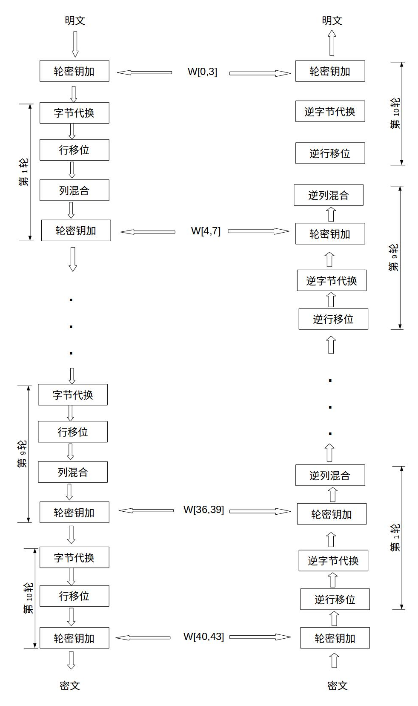
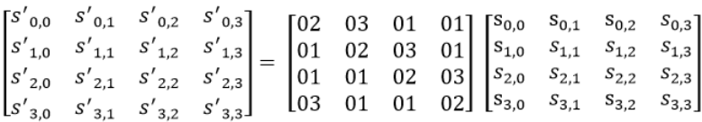
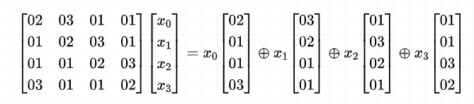
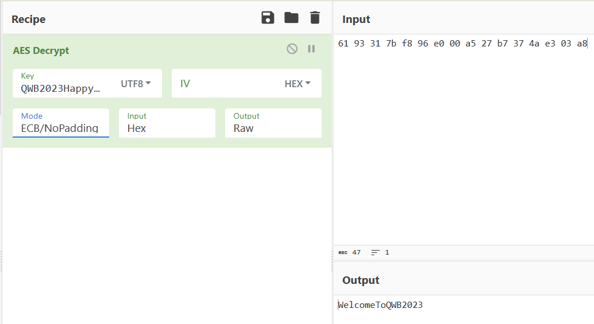

学一下，在此仅作记录。

参考：

👉[AES白盒加密解读与实现（Chow方案）](https://blog.csdn.net/qq_37638441/article/details/128968233)

👉[【密码学】一文读懂白盒AES(Chow方案)(一)](https://developer.aliyun.com/article/952800)


# 白盒AES

## AES加密流程

首先看一下AES的加密流程：



其伪代码如下：

```
state ← plaintext
AddRoundKey(state, k0)
for r = 1 ... 9
    SubBytes(state)
    ShiftRows(state)
    MixColumns(state)
    AddRoundKey(state, kr)
SubBytes(state)
ShiftRows(state)
AddRoundKey(state, k10)
ciphertext ← state
```

## 基于表实现的AES实现

基于表实现的AES的思路：将大部分的运算通过查表实现。

通过预先生成的表来进行加密。

### 调整AES流程

1. $$AddRoundKey(state,k_0)$$ 放入循环，$$AddRoundKey(state,k_9)$$ 移出循环
2. `ShiftRow` 是线性变换，`SubBytes` 是映射变换，可以调换位置而不影响结果
3. 在轮密钥也进行行移位的情况下，`AddRoundKey`和`ShiftRow`调换位置且结果不变

改变后，AES加密流程伪代码如下：

```
state ← plaintext
for r = 1 ... 9
    ShiftRows(state)
    AddRoundKey(state, k_{r-1})
    SubBytes(state)
    MixColumns(state)
ShiftRows(state)
AddRoundKey(state, k_9)
SubBytes(state)
AddRoundKey(state, k_{10})
ciphertext ← state
```

### 生成表

#### T Boxs

看 `AddRoundKey` 和 `SubBytes` 两个过程：
$$
AddRoundKey(x, \hat{k_{i-1}}[i]) = x \oplus \hat{k_{i-1}}[i]\\
SubBytes(x) = Sbox(x)
$$
可以合并为一个过程：
$$
{T_i}^r(x)= S(x \oplus \hat{k_{r-1}}[i]) (i=0...15, r=1...9)\\
{T_i}^{10}(x)= S(x \oplus \hat{k_{9}}[i])\oplus k_{10}[i] (i=0...15)
$$
可以看出 Tbox 是一个 `10*16*256` 的表，即可将这两个过程的基于表的实现：

```C
void add_round_key(u8 state[16], u32 expandedKey[4]) {
    for (int i = 0; i < 4; i++)
        for (int j = 0; j < 4; j++)
            state[i * 4 + j] ^= (expandedKey[i] >> (24 - 8 * j)) & 0xFF;
}

void getTbox(u32 expandedKey[44], u8 tbox[10][16][256]) {
    for (int i = 0; i < 10; i++) {
        for (int x = 0; x < 256; x++) {
            u8 state[16] = {x};
            memset(state, x, 16);
            add_round_shiftkey(state, expandedKey + 4 * i);
            subByte(state);
            if (i == 9)
                add_round_key(state, expandedKey + 40);
            for (int z = 0; z < 16; z++)
                tbox[i][z][x] = state[z];
        }
    }
}
```

#### Tyi Tables

在 `MixColumns` 中，实际可以看作这么一个过程：



对 `16 Byte` 的矩阵的列进行操作：


$$
MixColumns:T_{y_0}(x) \oplus T_{y_1}(x) \oplus Ty_{y_2}(x) \oplus Ty_{y_3}(x)
$$

这里遍历的 `i` 为可能的输入。

`table[x][y][z]` 为：第 `4 * x + z ` 的输入为`y` 时的输出（正常 `MixColumns` 加密输入 16 个字节的数据）。

```C
u8 gmul(u8 ap, u8 bp) {
    u8 p = 0, a = ap, b = bp;
    while (a != 0 && b != 0) {
        if (b & 1 != 0) p ^= a;
        if ((a & 0x80) != 0)
            a = (a << 1) ^ 0x1b;
        else
            a <<= 1;
        b >>= 1;
    }
    return p & 0xFF;
}

void getTyiTable(u8 table[4][256][4]) {
    for (int i = 0; i < 256; i++)
    {
        table[0][i][0] = gmul(i, 0x02);
        table[0][i][1] = gmul(i, 0x03);
        table[0][i][2] = i;
        table[0][i][3] = i;
        table[1][i][0] = i;
        table[1][i][1] = gmul(i, 0x02);
        table[1][i][2] = gmul(i, 0x03);
        table[1][i][3] = i;
        table[2][i][0] = i;
        table[2][i][1] = i;
        table[2][i][2] = gmul(i, 0x02);
        table[2][i][3] = gmul(i, 0x03);
        table[3][i][0] = gmul(i, 0x03);
        table[3][i][1] = i;
        table[3][i][2] = i;
        table[3][i][3] = gmul(i, 0x02);
    }
}
```

#### Xor Table

这里的 `Xor table` 和 `Tyi_tables `是一起的，一起组成 `MixColumns` 的过程。

```C
void getXorTable(u8 table[16][16]) {
    for (int i = 0; i < 16; i++)
        for (int j = 0; j < 16; j++)
            table[i][j] = i ^ j;
}
```

#### 合并Tboxs和Tyi_tables

将两个查表操作合在一起：

```C
void getTyiBox(u8 tbox[10][16][256], u32 tyibox[9][16][256]) {
    u8 tyitable[4][256][4] = {0};
    getTyiTable(tyitable);
    for (int r = 0; r < 9; r++)
        for (int x = 0; x < 256; x++)
            for (int j = 0; j < 4; j++)
                for (int i = 0; i < 4; i++) {
                    u32 v0 = tyitable[0][tbox[r][j * 4 + i][x]][i];
                    u32 v1 = tyitable[1][tbox[r][j * 4 + i][x]][i];
                    u32 v2 = tyitable[2][tbox[r][j * 4 + i][x]][i];
                    u32 v3 = tyitable[3][tbox[r][j * 4 + i][x]][i];
                    tyibox[r][j * 4 + i][x] = (v0 << 24) | (v1 << 16) | (v2 << 8) | v3;
                }
}
```

#### 总实现

```C

void aes_encrypt_by_table(u8 input[16], u8 key[16]) {
    u32 a, b, c, d, aa, bb, cc, dd;
    u8 result[16] = {0};
    u8 tbox[10][16][256] = {0}, xortable[16][16] = {0};
    u32 expandedKey[44] = {0}, tyibox[9][16][256] = {0};
    expandKey(key, expandedKey);
    getTbox(expandedKey, tbox);
    getTyiBox(tbox, tyibox);
    getXorTable(xortable);


    for (int i = 0; i < 9; i++)
    {
        shiftRows(input);
        for (int j = 0; j < 4; j++)
        {
            a = tyibox[i][4 * j + 0][input[4 * j + 0]];
			b = tyibox[i][4 * j + 1][input[4 * j + 1]];
			c = tyibox[i][4 * j + 2][input[4 * j + 2]];
			d = tyibox[i][4 * j + 3][input[4 * j + 3]];
            aa = xortable[(a >> 28) & 0xf][(b >> 28) & 0xf];
            bb = xortable[(c >> 28) & 0xf][(d >> 28) & 0xf];
            cc = xortable[(a >> 24) & 0xf][(b >> 24) & 0xf];
            dd = xortable[(c >> 24) & 0xf][(d >> 24) & 0xf];
			input[4 * j + 0] = ((aa ^ bb) << 4) | (cc ^ dd);
            aa = xortable[(a >> 20) & 0xf][(b >> 20) & 0xf];
            bb = xortable[(c >> 20) & 0xf][(d >> 20) & 0xf];
            cc = xortable[(a >> 16) & 0xf][(b >> 16) & 0xf];
            dd = xortable[(c >> 16) & 0xf][(d >> 16) & 0xf];
			input[4 * j + 1] = ((aa ^ bb) << 4) | (cc ^ dd);
            aa = xortable[(a >> 12) & 0xf][(b >> 12) & 0xf];
            bb = xortable[(c >> 12) & 0xf][(d >> 12) & 0xf];
            cc = xortable[(a >> 8) & 0xf][(b >> 8) & 0xf];
            dd = xortable[(c >> 8) & 0xf][(d >> 8) & 0xf];
			input[4 * j + 2] = ((aa ^ bb) << 4) | (cc ^ dd);
            aa = xortable[(a >> 4) & 0xf][(b >> 4) & 0xf];
            bb = xortable[(c >> 4) & 0xf][(d >> 4) & 0xf];
            cc = xortable[a & 0xf][b & 0xf];
            dd = xortable[c & 0xf][d & 0xf];
			input[4 * j + 3] = ((aa ^ bb) << 4) | (cc ^ dd);
        }
    }
    shiftRows(input);
    for (int j = 0; j < 16; j++)
    {
        input[j] = tbox[9][j][input[j]];
    }
}
```

## 完整代码

```C
#include <stdio.h>
#include <string.h>
typedef unsigned char u8;
typedef unsigned int u32;

static u8 SBOX[16][16] = {
    {0x63, 0x7C, 0x77, 0x7B, 0xF2, 0x6B, 0x6F, 0xC5, 0x30, 0x01, 0x67, 0x2B, 0xFE, 0xD7, 0xAB, 0x76},
    {0xCA, 0x82, 0xC9, 0x7D, 0xFA, 0x59, 0x47, 0xF0, 0xAD, 0xD4, 0xA2, 0xAF, 0x9C, 0xA4, 0x72, 0xC0},
    {0xB7, 0xFD, 0x93, 0x26, 0x36, 0x3F, 0xF7, 0xCC, 0x34, 0xA5, 0xE5, 0xF1, 0x71, 0xD8, 0x31, 0x15},
    {0x04, 0xC7, 0x23, 0xC3, 0x18, 0x96, 0x05, 0x9A, 0x07, 0x12, 0x80, 0xE2, 0xEB, 0x27, 0xB2, 0x75},
    {0x09, 0x83, 0x2C, 0x1A, 0x1B, 0x6E, 0x5A, 0xA0, 0x52, 0x3B, 0xD6, 0xB3, 0x29, 0xE3, 0x2F, 0x84},
    {0x53, 0xD1, 0x00, 0xED, 0x20, 0xFC, 0xB1, 0x5B, 0x6A, 0xCB, 0xBE, 0x39, 0x4A, 0x4C, 0x58, 0xCF},
    {0xD0, 0xEF, 0xAA, 0xFB, 0x43, 0x4D, 0x33, 0x85, 0x45, 0xF9, 0x02, 0x7F, 0x50, 0x3C, 0x9F, 0xA8},
    {0x51, 0xA3, 0x40, 0x8F, 0x92, 0x9D, 0x38, 0xF5, 0xBC, 0xB6, 0xDA, 0x21, 0x10, 0xFF, 0xF3, 0xD2},
    {0xCD, 0x0C, 0x13, 0xEC, 0x5F, 0x97, 0x44, 0x17, 0xC4, 0xA7, 0x7E, 0x3D, 0x64, 0x5D, 0x19, 0x73},
    {0x60, 0x81, 0x4F, 0xDC, 0x22, 0x2A, 0x90, 0x88, 0x46, 0xEE, 0xB8, 0x14, 0xDE, 0x5E, 0x0B, 0xDB},
    {0xE0, 0x32, 0x3A, 0x0A, 0x49, 0x06, 0x24, 0x5C, 0xC2, 0xD3, 0xAC, 0x62, 0x91, 0x95, 0xE4, 0x79},
    {0xE7, 0xC8, 0x37, 0x6D, 0x8D, 0xD5, 0x4E, 0xA9, 0x6C, 0x56, 0xF4, 0xEA, 0x65, 0x7A, 0xAE, 0x08},
    {0xBA, 0x78, 0x25, 0x2E, 0x1C, 0xA6, 0xB4, 0xC6, 0xE8, 0xDD, 0x74, 0x1F, 0x4B, 0xBD, 0x8B, 0x8A},
    {0x70, 0x3E, 0xB5, 0x66, 0x48, 0x03, 0xF6, 0x0E, 0x61, 0x35, 0x57, 0xB9, 0x86, 0xC1, 0x1D, 0x9E},
    {0xE1, 0xF8, 0x98, 0x11, 0x69, 0xD9, 0x8E, 0x94, 0x9B, 0x1E, 0x87, 0xE9, 0xCE, 0x55, 0x28, 0xDF},
    {0x8C, 0xA1, 0x89, 0x0D, 0xBF, 0xE6, 0x42, 0x68, 0x41, 0x99, 0x2D, 0x0F, 0xB0, 0x54, 0xBB, 0x16}
};

void expandKey(u8 key[16], u32 expandedKey[44]) {
    static u32 rcon[] = {
        0x01000000, 0x02000000, 0x04000000, 0x08000000, 0x10000000, 
        0x20000000, 0x40000000, 0x80000000, 0x1B000000, 0x36000000
    };
    for (int i = 0; i < 4; i++) {
        expandedKey[i] = (key[4 * i] << 24) | (key[4 * i + 1] << 16) | (key[4 * i + 2] << 8) | key[4 * i + 3];
    }
    for (int i = 4; i < 44; i++) {
        u32 temp = expandedKey[i - 1];
        if (i % 4 == 0) {
            temp = (temp << 8) | (temp >> 24);
            temp = SBOX[(temp >> 28) & 0xF][(temp >> 24) & 0xF] << 24 |
                   SBOX[(temp >> 20) & 0xF][(temp >> 16) & 0xF] << 16 |
                   SBOX[(temp >> 12) & 0xF][(temp >> 8) & 0xF] << 8 |
                   SBOX[(temp >> 4) & 0xF][temp & 0xF];
            temp ^= rcon[i / 4 - 1];
        }
        expandedKey[i] = expandedKey[i - 4] ^ temp;
    }
}

u8 gmul(u8 ap, u8 bp) {
    u8 p = 0, a = ap, b = bp;
    while (a != 0 && b != 0) {
        if (b & 1 != 0) p ^= a;
        if ((a & 0x80) != 0)
            a = (a << 1) ^ 0x1b;
        else
            a <<= 1;
        b >>= 1;
    }
    return p & 0xFF;
}

u8 subByte(u8 byte[16]) {
    for (int i = 0; i < 4; i++)
        for (int j = 0; j < 4; j++)
            byte[i * 4 + j] = SBOX[byte[i * 4 + j] >> 4][byte[i * 4 + j] & 0xF];
}

void shiftRows(u8 state[16]) {
    u8 tmp = state[1];
    state[1] = state[5];
    state[5] = state[9];
    state[9] = state[13];
    state[13] = tmp;

    tmp = state[2];
    state[2] = state[10];
    state[10] = tmp;
    tmp = state[6];
    state[6] = state[14];
    state[14] = tmp;

    tmp = state[15];
    state[15] = state[11];
    state[11] = state[7];
    state[7] = state[3];
    state[3] = tmp;
}

void add_round_shiftkey(u8 state[16], u32 expandedKey[4]) {
    for (int i = 0; i < 4; i++)
        for (int j = 0; j < 4; j++)
            state[i * 4 + j] ^= (expandedKey[(j + i) % 4] >> (24 - 8 * j)) & 0xFF;
}

void add_round_key(u8 state[16], u32 expandedKey[4]) {
    for (int i = 0; i < 4; i++)
        for (int j = 0; j < 4; j++)
            state[i * 4 + j] ^= (expandedKey[i] >> (24 - 8 * j)) & 0xFF;
}

void getTbox(u32 expandedKey[44], u8 tbox[10][16][256]) {
    for (int i = 0; i < 10; i++) {
        for (int x = 0; x < 256; x++) {
            u8 state[16] = {x};
            memset(state, x, 16);
            add_round_shiftkey(state, expandedKey + 4 * i);
            subByte(state);
            if (i == 9)
                add_round_key(state, expandedKey + 40);
            for (int z = 0; z < 16; z++)
                tbox[i][z][x] = state[z];
        }
    }
}

void getXorTable(u8 table[16][16]) {
    for (int i = 0; i < 16; i++)
        for (int j = 0; j < 16; j++)
            table[i][j] = i ^ j;
}

void getTyiTable(u8 table[4][256][4]) {
    for (int i = 0; i < 256; i++)
    {
        table[0][i][0] = gmul(i, 0x02);
        table[0][i][1] = gmul(i, 0x03);
        table[0][i][2] = i;
        table[0][i][3] = i;
        table[1][i][0] = i;
        table[1][i][1] = gmul(i, 0x02);
        table[1][i][2] = gmul(i, 0x03);
        table[1][i][3] = i;
        table[2][i][0] = i;
        table[2][i][1] = i;
        table[2][i][2] = gmul(i, 0x02);
        table[2][i][3] = gmul(i, 0x03);
        table[3][i][0] = gmul(i, 0x03);
        table[3][i][1] = i;
        table[3][i][2] = i;
        table[3][i][3] = gmul(i, 0x02);
    }
}

void getTyiBox(u8 tbox[10][16][256], u32 tyibox[9][16][256]) {
    u8 tyitable[4][256][4] = {0};
    getTyiTable(tyitable);
    for (int r = 0; r < 9; r++)
        for (int x = 0; x < 256; x++)
            for (int j = 0; j < 4; j++)
                for (int i = 0; i < 4; i++) {
                    u32 v0 = tyitable[0][tbox[r][j * 4 + i][x]][i];
                    u32 v1 = tyitable[1][tbox[r][j * 4 + i][x]][i];
                    u32 v2 = tyitable[2][tbox[r][j * 4 + i][x]][i];
                    u32 v3 = tyitable[3][tbox[r][j * 4 + i][x]][i];
                    tyibox[r][j * 4 + i][x] = (v0 << 24) | (v1 << 16) | (v2 << 8) | v3;
                }
}


void aes_encrypt_by_table(u8 input[16], u8 key[16]) {
    u32 a, b, c, d, aa, bb, cc, dd;
    u8 result[16] = {0};
    u8 tbox[10][16][256] = {0}, xortable[16][16] = {0};
    u32 expandedKey[44] = {0}, tyibox[9][16][256] = {0};
    expandKey(key, expandedKey);
    getTbox(expandedKey, tbox);
    getTyiBox(tbox, tyibox);
    getXorTable(xortable);


    for (int i = 0; i < 9; i++)
    {
        shiftRows(input);
        for (int j = 0; j < 4; j++)
        {
            a = tyibox[i][4 * j + 0][input[4 * j + 0]];
			b = tyibox[i][4 * j + 1][input[4 * j + 1]];
			c = tyibox[i][4 * j + 2][input[4 * j + 2]];
			d = tyibox[i][4 * j + 3][input[4 * j + 3]];
            aa = xortable[(a >> 28) & 0xf][(b >> 28) & 0xf];
            bb = xortable[(c >> 28) & 0xf][(d >> 28) & 0xf];
            cc = xortable[(a >> 24) & 0xf][(b >> 24) & 0xf];
            dd = xortable[(c >> 24) & 0xf][(d >> 24) & 0xf];
			input[4 * j + 0] = ((aa ^ bb) << 4) | (cc ^ dd);
            aa = xortable[(a >> 20) & 0xf][(b >> 20) & 0xf];
            bb = xortable[(c >> 20) & 0xf][(d >> 20) & 0xf];
            cc = xortable[(a >> 16) & 0xf][(b >> 16) & 0xf];
            dd = xortable[(c >> 16) & 0xf][(d >> 16) & 0xf];
			input[4 * j + 1] = ((aa ^ bb) << 4) | (cc ^ dd);
            aa = xortable[(a >> 12) & 0xf][(b >> 12) & 0xf];
            bb = xortable[(c >> 12) & 0xf][(d >> 12) & 0xf];
            cc = xortable[(a >> 8) & 0xf][(b >> 8) & 0xf];
            dd = xortable[(c >> 8) & 0xf][(d >> 8) & 0xf];
			input[4 * j + 2] = ((aa ^ bb) << 4) | (cc ^ dd);
            aa = xortable[(a >> 4) & 0xf][(b >> 4) & 0xf];
            bb = xortable[(c >> 4) & 0xf][(d >> 4) & 0xf];
            cc = xortable[a & 0xf][b & 0xf];
            dd = xortable[c & 0xf][d & 0xf];
			input[4 * j + 3] = ((aa ^ bb) << 4) | (cc ^ dd);
        }
    }
    shiftRows(input);
    for (int j = 0; j < 16; j++)
    {
        input[j] = tbox[9][j][input[j]];
    }
}
```

# 例题

这里通过两道例题来深刻认识白盒AES。

## 强网杯 dot

通过更改第十轮的输入的一个字节（每一次不同位置，16个位置），得到16个密文结果（与正确结果会有四个字节的不同）

分别改十六次，每次位置不同

```C#
public static void AAA(byte[] aaa, byte[] bbb)
{
    for (int i = 0; i < 9; i++)
    {
        Program.GGG(aaa);  // 第十轮时在这里更改一个字节的密文
        for (int j = 0; j < 4; j++)
        {
            uint num = Program.v11[i, 4 * j, (int)aaa[4 * j]];
            uint num2 = Program.v11[i, 4 * j + 1, (int)aaa[4 * j + 1]];
            uint num3 = Program.v11[i, 4 * j + 2, (int)aaa[4 * j + 2]];
            uint num4 = Program.v11[i, 4 * j + 3, (int)aaa[4 * j + 3]];
            uint num5 = 
                (uint)Program.v12[i, 24 * j, (int)(num >> 28 & 15U), (int)(num2 >> 28 & 15U)];
            uint num6 = (uint)Program.v12[i, 24 * j + 1, (int)(num3 >> 28 & 15U), (int)(num4 >> 28 & 15U)];
            uint num7 = (uint)Program.v12[i, 24 * j + 2, (int)(num >> 24 & 15U), (int)(num2 >> 24 & 15U)];
            uint num8 = (uint)Program.v12[i, 24 * j + 3, (int)(num3 >> 24 & 15U), (int)(num4 >> 24 & 15U)];
            aaa[4 * j] = (byte)((int)Program.v12[i, 24 * j + 4, (int)num5, (int)num6] << 4 | (int)Program.v12[i, 24 * j + 5, (int)num7, (int)num8]);
            num5 = (uint)Program.v12[i, 24 * j + 6, (int)(num >> 20 & 15U), (int)(num2 >> 20 & 15U)];
            num6 = (uint)Program.v12[i, 24 * j + 7, (int)(num3 >> 20 & 15U), (int)(num4 >> 20 & 15U)];
            num7 = (uint)Program.v12[i, 24 * j + 8, (int)(num >> 16 & 15U), (int)(num2 >> 16 & 15U)];
            num8 = (uint)Program.v12[i, 24 * j + 9, (int)(num3 >> 16 & 15U), (int)(num4 >> 16 & 15U)];
            aaa[4 * j + 1] = (byte)((int)Program.v12[i, 24 * j + 10, (int)num5, (int)num6] << 4 | (int)Program.v12[i, 24 * j + 11, (int)num7, (int)num8]);
            num5 = (uint)Program.v12[i, 24 * j + 12, (int)(num >> 12 & 15U), (int)(num2 >> 12 & 15U)];
            num6 = (uint)Program.v12[i, 24 * j + 13, (int)(num3 >> 12 & 15U), (int)(num4 >> 12 & 15U)];
            num7 = (uint)Program.v12[i, 24 * j + 14, (int)(num >> 8 & 15U), (int)(num2 >> 8 & 15U)];
            num8 = (uint)Program.v12[i, 24 * j + 15, (int)(num3 >> 8 & 15U), (int)(num4 >> 8 & 15U)];
            aaa[4 * j + 2] = (byte)((int)Program.v12[i, 24 * j + 16, (int)num5, (int)num6] << 4 | (int)Program.v12[i, 24 * j + 17, (int)num7, (int)num8]);
            num5 = (uint)Program.v12[i, 24 * j + 18, (int)(num >> 4 & 15U), (int)(num2 >> 4 & 15U)];
            num6 = (uint)Program.v12[i, 24 * j + 19, (int)(num3 >> 4 & 15U), (int)(num4 >> 4 & 15U)];
            num7 = (uint)Program.v12[i, 24 * j + 20, (int)(num & 15U), (int)(num2 & 15U)];
            num8 = (uint)Program.v12[i, 24 * j + 21, (int)(num3 & 15U), (int)(num4 & 15U)];
            aaa[4 * j + 3] = (byte)((int)Program.v12[i, 24 * j + 22, (int)num5, (int)num6] << 4 | (int)Program.v12[i, 24 * j + 23, (int)num7, (int)num8]);
            num = Program.v13[i, 4 * j, (int)aaa[4 * j]];
            num2 = Program.v13[i, 4 * j + 1, (int)aaa[4 * j + 1]];
            num3 = Program.v13[i, 4 * j + 2, (int)aaa[4 * j + 2]];
            num4 = Program.v13[i, 4 * j + 3, (int)aaa[4 * j + 3]];
            num5 = (uint)Program.v12[i, 24 * j, (int)(num >> 28 & 15U), (int)(num2 >> 28 & 15U)];
            num6 = (uint)Program.v12[i, 24 * j + 1, (int)(num3 >> 28 & 15U), (int)(num4 >> 28 & 15U)];
            num7 = (uint)Program.v12[i, 24 * j + 2, (int)(num >> 24 & 15U), (int)(num2 >> 24 & 15U)];
            num8 = (uint)Program.v12[i, 24 * j + 3, (int)(num3 >> 24 & 15U), (int)(num4 >> 24 & 15U)];
            aaa[4 * j] = (byte)((int)Program.v12[i, 24 * j + 4, (int)num5, (int)num6] << 4 | (int)Program.v12[i, 24 * j + 5, (int)num7, (int)num8]);
            num5 = (uint)Program.v12[i, 24 * j + 6, (int)(num >> 20 & 15U), (int)(num2 >> 20 & 15U)];
            num6 = (uint)Program.v12[i, 24 * j + 7, (int)(num3 >> 20 & 15U), (int)(num4 >> 20 & 15U)];
            num7 = (uint)Program.v12[i, 24 * j + 8, (int)(num >> 16 & 15U), (int)(num2 >> 16 & 15U)];
            num8 = (uint)Program.v12[i, 24 * j + 9, (int)(num3 >> 16 & 15U), (int)(num4 >> 16 & 15U)];
            aaa[4 * j + 1] = (byte)((int)Program.v12[i, 24 * j + 10, (int)num5, (int)num6] << 4 | (int)Program.v12[i, 24 * j + 11, (int)num7, (int)num8]);
            num5 = (uint)Program.v12[i, 24 * j + 12, (int)(num >> 12 & 15U), (int)(num2 >> 12 & 15U)];
            num6 = (uint)Program.v12[i, 24 * j + 13, (int)(num3 >> 12 & 15U), (int)(num4 >> 12 & 15U)];
            num7 = (uint)Program.v12[i, 24 * j + 14, (int)(num >> 8 & 15U), (int)(num2 >> 8 & 15U)];
            num8 = (uint)Program.v12[i, 24 * j + 15, (int)(num3 >> 8 & 15U), (int)(num4 >> 8 & 15U)];
            aaa[4 * j + 2] = (byte)((int)Program.v12[i, 24 * j + 16, (int)num5, (int)num6] << 4 | (int)Program.v12[i, 24 * j + 17, (int)num7, (int)num8]);
            num5 = (uint)Program.v12[i, 24 * j + 18, (int)(num >> 4 & 15U), (int)(num2 >> 4 & 15U)];
            num6 = (uint)Program.v12[i, 24 * j + 19, (int)(num3 >> 4 & 15U), (int)(num4 >> 4 & 15U)];
            num7 = (uint)Program.v12[i, 24 * j + 20, (int)(num & 15U), (int)(num2 & 15U)];
            num8 = (uint)Program.v12[i, 24 * j + 21, (int)(num3 & 15U), (int)(num4 & 15U)];
            aaa[4 * j + 3] = (byte)((int)Program.v12[i, 24 * j + 22, (int)num5, (int)num6] << 4 | (int)Program.v12[i, 24 * j + 23, (int)num7, (int)num8]);
        }
    }
    Program.GGG(aaa);
    for (int k = 0; k < 16; k++)
    {
        aaa[k] = Program.v14[9, k, (int)aaa[k]];
    }
    for (int l = 0; l < 16; l++)
    {
        bbb[l] = aaa[l];  // 获取结果
    }
}
```

使用`phoenixAES`推导出第十轮的密钥：

```Python
p = 'abcdefghijklmn12'
c  = '809d8b75d9097398e20afe0e6da11e55'
c0 = 'e49d8b75d9097388e20a6d0e6d5c1e55'
c1 = '809d8b2ad909a498e2bcfe0ed7a11e55'
c2 = '809d2b75d9ed7398ea0afe0e6da11ed0'
c3 = '80318b757c097398e20afe4e6da1e855'
c4 = '809c8b7565097398e20afe786da13055'
c5 = 'd99d8b75d9097348e20a0d0e6daf1e55'
c6 = '809d8bb2d909e498e229fe0e35a11e55'
c7 = '809d7c75d9d07398550afe0e6da11ea7'
c8 = '809d3b75d9a17398990afe0e6da11e30'
c9 = '80e88b7546097398e20afe526da1b755'
c10 = 'ff9d8b75d90973e9e20ab50e6d061e55'
c11 = '809d8b4ad909f098e260fe0ee9a11e55'
c12 = '809d8b44d909e498e200fe0ed9a11e55'
c13 = '809d8475d9ce73982b0afe0e6da11ee0'
c14 = '80a38b750e097398e20afe546da18255'
c15 = 'af9d8b75d90973cde20a230e6d861e55'
content = f'''
{c}\n{c0}\n{c1}\n{c2}\n{c3}\n{c4}\n{c5}\n{c6}\n{c7}\n{c8}\n{c9}\n{c10}\n{c11}\n{c12}\n{c13}\n{c14}\n{c15}
'''
with open('tracefile', 'wb') as f:
    f.write(content.encode('utf-8'))

import phoenixAES
phoenixAES.crack_file('./tracefile', verbose=0)
# Last round key #N found:
# EA9F6BE2DF5C358495648BEAB9FCFF81
```

使用[SideChannelMarvels/Stark](https://github.com/SideChannelMarvels/Stark)解出原始密钥：

```shell
> .\aes_keyschedule.exe EA9F6BE2DF5C358495648BEAB9FCFF81 10
K00: 51574232303233486170707947616D65
K01: BF6B0F928F593CDAEE294CA3A94821C6
K02: EF96BB4160CF879B8EE6CB3827AEEAFE
K03: 0F11008D6FDE8716E1384C2EC696A6D0
K04: 97357039F8EBF72F19D3BB01DF451DD1
K05: E9914EA7117AB98808A90289D7EC1F58
K06: 075124A9162B9D211E829FA8C96E80F0
K07: D89CA874CEB73555D035AAFD195B2A0D
K08: 61797FA0AFCE4AF57FFBE00866A0CA05
K09: 9A0D149335C35E664A38BE6E2C98746B
K10: EA9F6BE2DF5C358495648BEAB9FCFF81
```

得到密钥：`QWB2023HappyGame`

由此解得明文：



## 巅峰极客 m1_read

白盒AES + 异或0x66：

```C
__int8 __fastcall sub_140004BF0(__m128i *a1, __m128i *a2)
{
    v2 = &a1->m128i_i8[2];
    v3 = 0i64;
    v4 = 0i64;
    v5 = a1;
    do
    {
        shiftRows(v5);
        v6 = v2;
        v22 = 4i64;
        do
        {
            v7 = dword_1400A6000[v4 + (unsigned __int8)*(v6 - 2)];
            v8 = dword_1400A6400[v4 + (unsigned __int8)*(v6 - 1)];
            v9 = dword_1400A6800[v4 + (unsigned __int8)*v6];
            v10 = dword_1400A6C00[v4 + (unsigned __int8)v6[1]];
            v11 = (unsigned __int8)(byte_1400F2000[16 * v3
                                                   + 1280
                                                   + 16
                                                   * byte_1400F2000[16 * v3 + 512 + 16 * (HIBYTE(v7) & 0xF) + (HIBYTE(v8) & 0xF)]
                                                   + byte_1400F2000[16 * v3
                                                                    + 768
                                                                    + 16 * (HIBYTE(v9) & 0xF)
                                                                    + (HIBYTE(v10) & 0xF)]] | (16
                                                                                               * byte_1400F2000[16 * v3 + 1024 + 16 * byte_1400F2000[16 * v3 + 16 * ((unsigned __int64)v7 >> 28) + ((unsigned __int64)v8 >> 28)] + byte_1400F2000[16 * v3 + 256 + 16 * ((unsigned __int64)v9 >> 28) + ((unsigned __int64)v10 >> 28)]]));
            *(v6 - 2) = v11;
            v12 = (unsigned __int8)(byte_1400F2000[16 * v3
                                                   + 2816
                                                   + 16
                                                   * byte_1400F2000[16 * v3
                                                                    + 2048
                                                                    + 16 * (HIWORD(v7) & 0xF)
                                                                    + (HIWORD(v8) & 0xF)]
                                                   + byte_1400F2000[16 * v3
                                                                    + 2304
                                                                    + 16 * (HIWORD(v9) & 0xF)
                                                                    + (HIWORD(v10) & 0xF)]] | (16
                                                                                               * byte_1400F2000[16 * v3 + 2560 + 16 * byte_1400F2000[16 * v3 + 1536 + 16 * ((v7 >> 20) & 0xF) + ((v8 >> 20) & 0xF)] + byte_1400F2000[16 * v3 + 1792 + 16 * ((v9 >> 20) & 0xF) + ((v10 >> 20) & 0xF)]]));
            *(v6 - 1) = v12;
            v13 = (unsigned __int8)(byte_1400F2000[16 * v3
                                                   + 4352
                                                   + 16
                                                   * byte_1400F2000[16 * v3 + 3584 + 16 * ((v7 >> 8) & 0xF) + ((v8 >> 8) & 0xF)]
                                                   + byte_1400F2000[16 * v3 + 3840 + 16 * ((v9 >> 8) & 0xF) + ((v10 >> 8) & 0xF)]] | (16 * byte_1400F2000[16 * v3 + 4096 + 16 * byte_1400F2000[16 * v3 + 3072 + 16 * ((unsigned __int16)v7 >> 12) + ((unsigned __int16)v8 >> 12)] + byte_1400F2000[16 * v3 + 3328 + 16 * ((unsigned __int16)v9 >> 12) + ((unsigned __int16)v10 >> 12)]]));
            *v6 = v13;
            v14 = (unsigned __int8)(byte_1400F3500[16 * v3
                                                   + 512
                                                   + 16
                                                   * (unsigned __int8)byte_1400F3400[16 * v3 + 16 * (v7 & 0xF) + (v8 & 0xF)]
                                                   + byte_1400F3500[16 * v3 + 16 * (v9 & 0xF) + (v10 & 0xF)]] | (16 * byte_1400F3500[16 * v3 + 256 + 16 * byte_1400F2000[16 * v3 + 4608 + 16 * ((unsigned __int8)v7 >> 4) + ((unsigned __int8)v8 >> 4)] + byte_1400F2000[16 * v3 + 4864 + 16 * ((unsigned __int8)v9 >> 4) + ((unsigned __int8)v10 >> 4)]]));
            v6[1] = v14;
            v15 = dword_1400CA000[v4 + v11];
            LODWORD(v11) = dword_1400CA400[v4 + v12];
            LODWORD(v12) = dword_1400CA800[v4 + v13];
            LODWORD(v13) = dword_1400CAC00[v4 + v14];
            *(v6 - 2) = byte_1400F2000[16 * v3
                                       + 1280
                                       + 16 * byte_1400F2000[16 * v3 + 512 + 16 * (HIBYTE(v15) & 0xF) + (BYTE3(v11) & 0xF)]
                                       + byte_1400F2000[16 * v3 + 768 + 16 * (BYTE3(v12) & 0xF) + (BYTE3(v13) & 0xF)]] | (16 * byte_1400F2000[16 * v3 + 1024 + 16 * byte_1400F2000[16 * v3 + 16 * ((unsigned __int64)v15 >> 28) + ((unsigned __int64)(unsigned int)v11 >> 28)] + byte_1400F2000[16 * v3 + 256 + 16 * ((unsigned __int64)(unsigned int)v12 >> 28) + ((unsigned __int64)(unsigned int)v13 >> 28)]]);
            *(v6 - 1) = byte_1400F2000[16 * v3
                                       + 2816
                                       + 16 * byte_1400F2000[16 * v3 + 2048 + 16 * (HIWORD(v15) & 0xF) + (WORD1(v11) & 0xF)]
                                       + byte_1400F2000[16 * v3 + 2304 + 16 * (WORD1(v12) & 0xF) + (WORD1(v13) & 0xF)]] | (16 * byte_1400F2000[16 * v3 + 2560 + 16 * byte_1400F2000[16 * v3 + 1536 + 16 * ((v15 >> 20) & 0xF) + (((unsigned int)v11 >> 20) & 0xF)] + byte_1400F2000[16 * v3 + 1792 + 16 * (((unsigned int)v12 >> 20) & 0xF) + (((unsigned int)v13 >> 20) & 0xF)]]);
            *v6 = byte_1400F2000[16 * v3
                                 + 4352
                                 + 16
                                 * byte_1400F2000[16 * v3 + 3584 + 16 * ((v15 >> 8) & 0xF) + (((unsigned int)v11 >> 8) & 0xF)]
                                 + byte_1400F2000[16 * v3
                                                  + 3840
                                                  + 16 * (((unsigned int)v12 >> 8) & 0xF)
                                                  + (((unsigned int)v13 >> 8) & 0xF)]] | (16
                                                                                          * byte_1400F2000[16 * v3
                                                                                                           + 4096
                                                                                                           + 16
                                                                                                           * byte_1400F2000[16 * v3 + 3072 + 16 * ((unsigned __int16)v15 >> 12) + ((unsigned __int16)v11 >> 12)]
                                                                                                           + byte_1400F2000[16 * v3 + 3328 + 16 * ((unsigned __int16)v12 >> 12) + ((unsigned __int16)v13 >> 12)]]);
            v6[1] = byte_1400F3500[16 * v3
                                   + 512
                                   + 16 * (unsigned __int8)byte_1400F3400[16 * v3 + 16 * (v15 & 0xF) + (v11 & 0xF)]
                                   + byte_1400F3500[16 * v3 + 16 * (v12 & 0xF) + (v13 & 0xF)]] | (16
                                                                                                  * byte_1400F3500[16 * v3 + 256 + 16 * byte_1400F2000[16 * v3 + 4608 + 16 * ((unsigned __int8)v15 >> 4) + ((unsigned __int8)v11 >> 4)] + byte_1400F2000[16 * v3 + 4864 + 16 * ((unsigned __int8)v12 >> 4) + ((unsigned __int8)v13 >> 4)]]);
            v4 += 1024i64;
            v6 += 4;
            v3 += 384i64;
            --v22;
        }
        while ( v22 );
        v5 = a1;
        v2 = &a1->m128i_i8[2];
    }
    while ( v4 < 36864 );
    shiftRows(a1);
    a1->m128i_i8[0] = byte_1400A4000[a1->m128i_u8[0]];
    a1->m128i_i8[1] = byte_1400A4000[a1->m128i_u8[1] + 256];
    a1->m128i_i8[2] = byte_1400A4000[a1->m128i_u8[2] + 512];
    a1->m128i_i8[3] = byte_1400A4000[a1->m128i_u8[3] + 768];
    a1->m128i_i8[4] = byte_1400A4000[a1->m128i_u8[4] + 1024];
    a1->m128i_i8[5] = byte_1400A4000[a1->m128i_u8[5] + 1280];
    a1->m128i_i8[6] = byte_1400A4000[a1->m128i_u8[6] + 1536];
    a1->m128i_i8[7] = byte_1400A4000[a1->m128i_u8[7] + 1792];
    a1->m128i_i8[8] = byte_1400A4000[a1->m128i_u8[8] + 2048];
    a1->m128i_i8[9] = byte_1400A4000[a1->m128i_u8[9] + 2304];
    a1->m128i_i8[10] = byte_1400A4000[a1->m128i_u8[10] + 2560];
    a1->m128i_i8[11] = byte_1400A4000[a1->m128i_u8[11] + 2816];
    a1->m128i_i8[12] = byte_1400A4000[a1->m128i_u8[12] + 3072];
    a1->m128i_i8[13] = byte_1400A4000[a1->m128i_u8[13] + 3328];
    a1->m128i_i8[14] = byte_1400A4000[a1->m128i_u8[14] + 3584];
    a1->m128i_i8[15] = byte_1400A4000[a1->m128i_u8[15] + 3840];
    result = (char)a2;
    if ( a2 > (__m128i *)((char *)&a1->m128i_u64[1] + 7) || (__m128i *)((char *)&a2->m128i_u64[1] + 7) < a1 )
    {
        *a2 = _mm_xor_si128(_mm_load_si128((const __m128i *)&xmmword_140008A40), _mm_loadu_si128(a1));
    }
    else
    {
        v17 = 16i64;
        v18 = a2;
        do
        {
            v19 = v18->m128i_i8[(char *)a1 - (char *)a2];
            v18 = (__m128i *)((char *)v18 + 1);
            result = v19 ^ 0x66;
            v18[-1].m128i_i8[15] = result;
            --v17;
        }
        while ( v17 );
    }
    return result;
}
```

网上师傅使用frida来调用函数获取数据的，学一下：

```Python
import frida
import sys

session = frida.attach("m1_read.exe")

script = session.create_script("""
  var baseAddr = Module.findBaseAddress("m1_read.exe");
  var whiteAES = new NativeFunction(baseAddr.add(0x4BF0), 'pointer', ['pointer', 'pointer'])
  var count = 9;
  Interceptor.attach(baseAddr.add(0x4C2C), {
      onEnter: function(args) {
          count++;
          if(count == 9) {
              // 在第十轮的输入[0:16]中随机修改其中一个字节
              this.context.rdi.add(Math.floor(Math.random() * 16)).writeU8(Math.floor(Math.random() * 256));
          } 
      },
      onLeave: (retval) => {

      }
  })


  for (let index = 0; index < 32; index++) {
      var l = Memory.allocAnsiString("1234567890abcdef");
      var b = Memory.alloc(16);
      whiteAES(l, b);
      // console.log(b.readByteArray(16));
      console.log(Array.from(new Uint8Array(b.readByteArray(16))).map(byte => byte.toString(16).padStart(2, '0')).join(''));
      count = 0;
  }
                               """)
script.load()
```

这里获得的数据是被异或过的，因此使用phoenixAES之前要异或回来：

```Python

data = '''
ca429fdc6bfa9b5e540c8f14b03bae88
ca429f3d6bfaf55e54138f144d3bae88
ca42acdc6bdd9b5ef90c8f14b03bae92
ca429fdc6bfa9b5e540c8f14b03bae88
af429fdc6bfa9b08540c7f14b0aeae88
cac39fdc15fa9b5e540c8f22b03b4d88
ca429fa06bfa7e5e54e68f143b3bae88
ca429f656bfa355e545f8f148c3bae88
a9429fdc6bfa9be4540c1914b0bbae88
ca7b9fdcbafa9b5e540c8f5cb03b6988
fc429fdc6bfa9b21540c7114b02dae88
ca429fdc6bfa9b5e540c8f14b03bae88
ca4245dc6b3a9b5e3e0c8f14b03baeb9
ca42fadc6b7f9b5e680c8f14b03baed2
ca429fdc6bfa9b5e540c8f14b03bae88
45429fdc6bfa9b23540c2614b040ae88
ca42ebdc6b019b5e380c8f14b03bae52
ca429fdc6bfa9b5e540c8f14b03bae88
caf39fdc8dfa9b5e540c8f84b03b2188
caa49fdc8cfa9b5e540c8f2bb03b1b88
ca429f686bfa315e54e58f14173bae88
ca42cddc6bcb9b5ec70c8f14b03bae40
ca429fdc6bfa9b5e540c8f14b03bae88
ca429f556bfad15e54238f140d3bae88
ca42addc6b509b5e430c8f14b03bae1e
ca42fcdc6bd89b5e8d0c8f14b03baeb3
ca1c9fdc17fa9b5e540c8f1bb03bfb88
ca4293dc6b7b9b5ea20c8f14b03bae6d
ca429ff06bfacb5e54d98f14d33bae88
ca429ff76bfa445e54998f14c13bae88
ca429fcf6bfa975e54fc8f14503bae88
cad39fdce0fa9b5e540c8f6eb03b9288
'''

data = data.split('\n')[1:-1]
for i in range(len(data)):
    data[i] = bytes.fromhex(data[i])
raw_data = [''] * 32
for i in range(32):
    for j in range(16):
        raw_data[i] += "%02x" % (0x66 ^ data[i][j])
data = ''.join([i + '\n' for i in raw_data])[:-1]

import phoenixAES
with open('tracefile', 'wb') as f:
    f.write(data.encode('utf-8'))
phoenixAES.crack_file('tracefile', verbose=0)
# Last round key #N found:
# B4EF5BCB3E92E21123E951CF6F8F188E
```

再使用`aes_keyschedule`获取最初的密钥：`00000000000000000000000000000000`

```shell
> .\aes_keyschedule.exe B4EF5BCB3E92E21123E951CF6F8F188E 10
K00: 00000000000000000000000000000000
K01: 62636363626363636263636362636363
K02: 9B9898C9F9FBFBAA9B9898C9F9FBFBAA
K03: 90973450696CCFFAF2F457330B0FAC99
K04: EE06DA7B876A1581759E42B27E91EE2B
K05: 7F2E2B88F8443E098DDA7CBBF34B9290
K06: EC614B851425758C99FF09376AB49BA7
K07: 217517873550620BACAF6B3CC61BF09B
K08: 0EF903333BA9613897060A04511DFA9F
K09: B1D4D8E28A7DB9DA1D7BB3DE4C664941
K10: B4EF5BCB3E92E21123E951CF6F8F188E
```

最后AES解密：

```Python
with open('out.bin', 'rb') as f:
    data = f.read()

with open('out_xor.bin', 'wb') as f:
    f.write(bytes([i ^ 0x66 for i in data]))

from Crypto.Cipher import AES
c = "6D FE 18 93 BF 2B B0 1F 3F 4A 2B 49 CB B2 8D EF"
c = "".join(c.split(' '))
c = bytes.fromhex(c)
key = bytes.fromhex("00000000000000000000000000000000")
cipher = AES.new(key, AES.MODE_ECB)
print(cipher.decrypt(c))
# b'cddc8d28dabb4ea9'
```

