## blade

[网上师傅的wp](https://hexrotor.github.io/2023/09/10/hitcon-2023-blade-wp)

### 程序逻辑

执行以下程序，是有以下逻辑的：

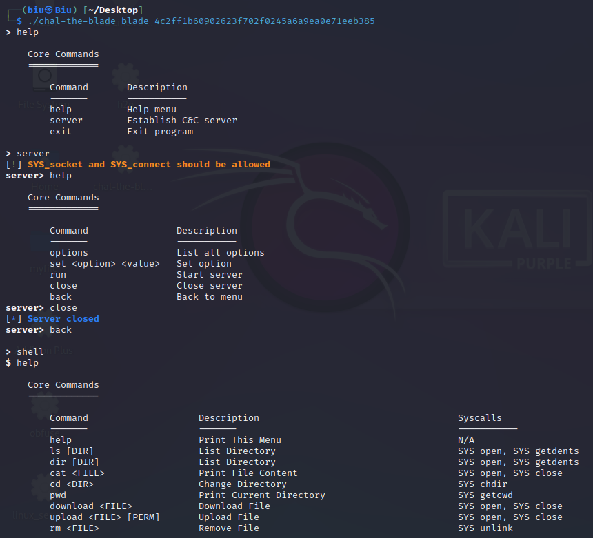

由师傅的wp关注程序的这个main函数：`seccomp_shell::main::hef7e76ec97275895()`：

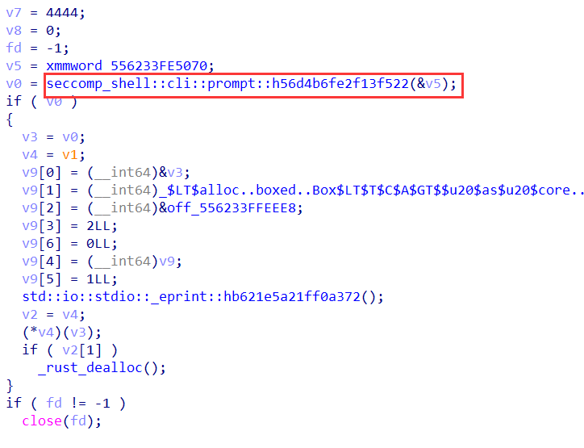

关注下`seccomp_shell::cli::prompt::h56d4b6fe2f13f522(&v5)`，其中有`switch`去判断是否`server`还是`shell`：

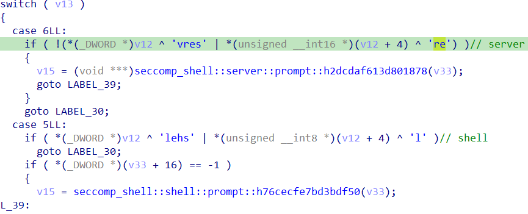

进入`seccomp_shell::shell::prompt::h76cecfe7bd3bdf50(v33)`，其中有刚才打印出来的字符串：

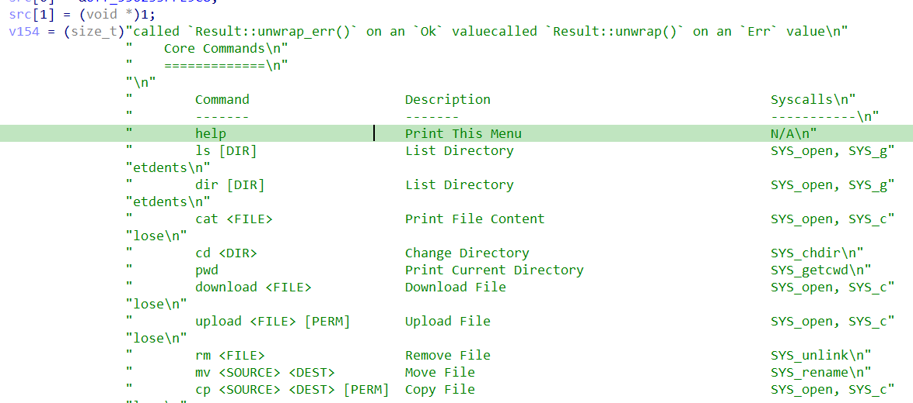

再往下走，有`switch`，应该是根据字符串长度再判别是啥命令：

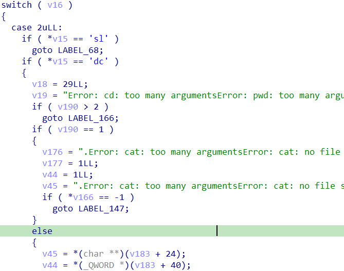

其中有`case`为`flag`，其中有`verify、fail、success`三个函数：


进入`seccomp_shell::shell::verify::h898bf5fa26dafbab`有判别参数是否为`0x64`，应该是字符串长度：

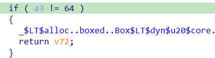

之后进入一个大循环，大循环中有几个小循环，是根据`dest`的值打乱`input`的顺序，一共有八个：

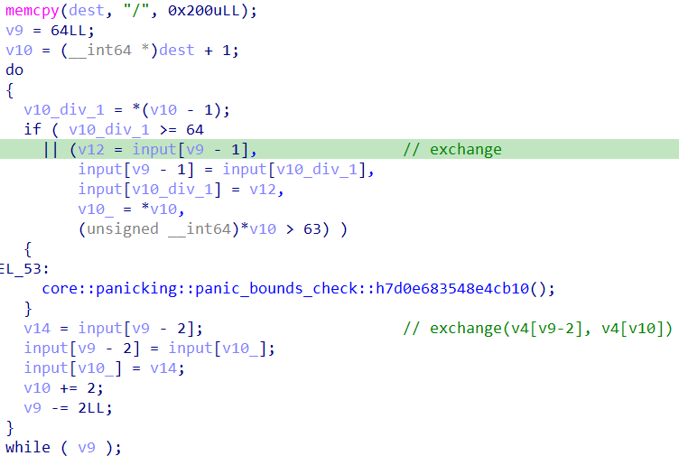

打乱`input`之后，对`input`进行如下的加密：

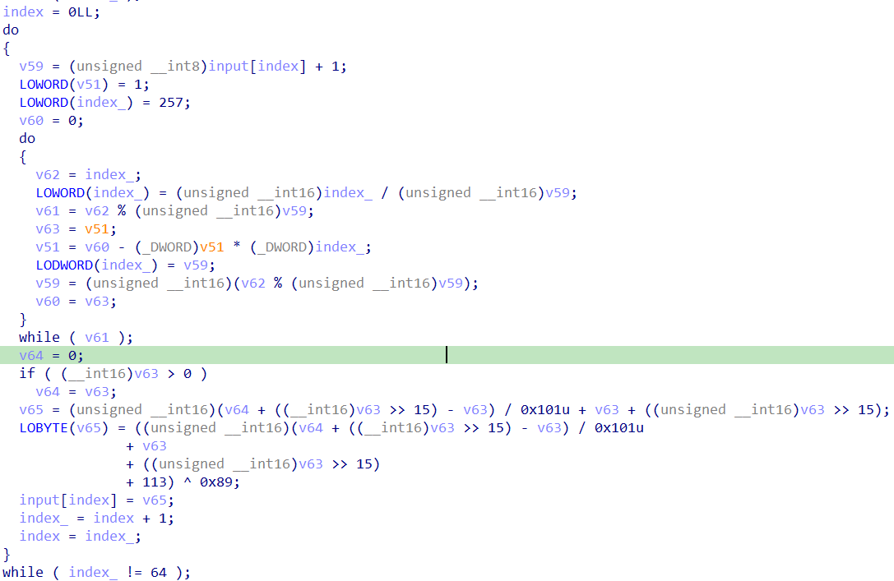

之后大循环这样子执行256轮，然后结束。

对最后的比较结果赋值，以及更改：

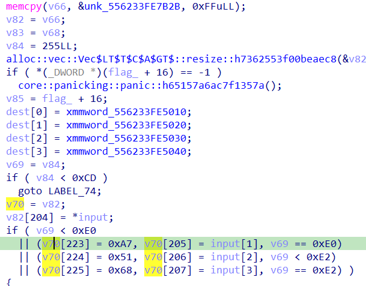

`unk_556233FE7B2B`部分其实是字节码：

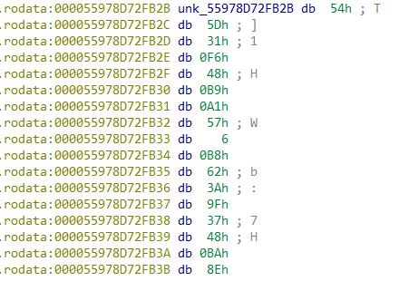

反编译可得到：

```assembly
.rodata:000055978D72FB2B loc_55978D72FB2B:                       ; DATA XREF: seccomp_shell::shell::verify::h898bf5fa26dafbab+44D↑o
.rodata:000055978D72FB2B push    rsp
.rodata:000055978D72FB2C pop     rbp
.rodata:000055978D72FB2D xor     esi, esi
.rodata:000055978D72FB2F mov     rcx, 379F3A62B80657A1h
.rodata:000055978D72FB39 mov     rdx, 37F7494DD66F358Eh
.rodata:000055978D72FB43 xor     rcx, rdx
.rodata:000055978D72FB46 push    rcx
.rodata:000055978D72FB47 push    rsp
.rodata:000055978D72FB48 pop     rdi
.rodata:000055978D72FB49 push    2
.rodata:000055978D72FB4B pop     rax
.rodata:000055978D72FB4C cdq
.rodata:000055978D72FB4D syscall                                 ; LINUX - sys_open
.rodata:000055978D72FB4F xchg    rax, rdi
.rodata:000055978D72FB51 xor     eax, eax
.rodata:000055978D72FB53 push    rax
.rodata:000055978D72FB54 push    rsp
.rodata:000055978D72FB55 pop     rsi
.rodata:000055978D72FB56 push    4
.rodata:000055978D72FB58 pop     rdx
.rodata:000055978D72FB59 syscall                                 ; LINUX - sys_read
.rodata:000055978D72FB5B pop     r12
.rodata:000055978D72FB5D push    3
.rodata:000055978D72FB5F pop     rax
.rodata:000055978D72FB60 syscall                                 ; LINUX - sys_close
.rodata:000055978D72FB62 xor     esi, esi
.rodata:000055978D72FB64 mov     rcx, 0AAC06463C36F3B3Bh
.rodata:000055978D72FB6E mov     rdx, 0AAC06463C30B4C48h
.rodata:000055978D72FB78 xor     rcx, rdx
.rodata:000055978D72FB7B push    rcx
.rodata:000055978D72FB7C mov     rcx, 7DA9F8D67582578Ch
.rodata:000055978D72FB86 mov     rdx, 0EC888F916F632A3h
.rodata:000055978D72FB90 xor     rcx, rdx
.rodata:000055978D72FB93 push    rcx
.rodata:000055978D72FB94 push    rsp
.rodata:000055978D72FB95 pop     rdi
.rodata:000055978D72FB96 push    2
.rodata:000055978D72FB98 pop     rax
.rodata:000055978D72FB99 cdq
.rodata:000055978D72FB9A syscall                                 ; LINUX - sys_open
.rodata:000055978D72FB9C xchg    rax, rdi
.rodata:000055978D72FB9E xor     eax, eax
.rodata:000055978D72FBA0 push    rax
.rodata:000055978D72FBA1 push    rsp
.rodata:000055978D72FBA2 pop     rsi
.rodata:000055978D72FBA3 push    4
.rodata:000055978D72FBA5 pop     rdx
.rodata:000055978D72FBA6 syscall                                 ; LINUX - sys_read
.rodata:000055978D72FBA8 pop     r13
.rodata:000055978D72FBAA push    3
.rodata:000055978D72FBAC pop     rax
.rodata:000055978D72FBAD syscall                                 ; LINUX - sys_close
.rodata:000055978D72FBAF xor     esi, esi
.rodata:000055978D72FBB1 push    6Fh ; 'o'
.rodata:000055978D72FBB3 mov     rcx, 77D9F62D0C06E559h
.rodata:000055978D72FBBD mov     rdx, 5BC8C027A638176h
.rodata:000055978D72FBC7 xor     rcx, rdx
.rodata:000055978D72FBCA push    rcx
.rodata:000055978D72FBCB push    rsp
.rodata:000055978D72FBCC pop     rdi
.rodata:000055978D72FBCD push    2
.rodata:000055978D72FBCF pop     rax
.rodata:000055978D72FBD0 cdq
.rodata:000055978D72FBD1 syscall                                 ; LINUX - sys_open
.rodata:000055978D72FBD3 xchg    rax, rdi
.rodata:000055978D72FBD5 xor     eax, eax
.rodata:000055978D72FBD7 push    rax
.rodata:000055978D72FBD8 push    rsp
.rodata:000055978D72FBD9 pop     rsi
.rodata:000055978D72FBDA push    4
.rodata:000055978D72FBDC pop     rdx
.rodata:000055978D72FBDD syscall                                 ; LINUX - sys_read
.rodata:000055978D72FBDF pop     rax
.rodata:000055978D72FBE0 not     rax
.rodata:000055978D72FBE3 shr     rax, 1Dh
.rodata:000055978D72FBE7 cqo
.rodata:000055978D72FBE9 push    29h ; ')'
.rodata:000055978D72FBEB pop     rcx
.rodata:000055978D72FBEC div     rcx
.rodata:000055978D72FBEF xchg    rax, r14
.rodata:000055978D72FBF1 push    3
.rodata:000055978D72FBF3 pop     rax
.rodata:000055978D72FBF4 syscall                                 ; LINUX - sys_close
.rodata:000055978D72FBF6 mov     eax, 0DEADBEEFh
.rodata:000055978D72FBFB add     eax, r12d
.rodata:000055978D72FBFE xor     eax, r13d
.rodata:000055978D72FC01 ror     eax, 0Bh
.rodata:000055978D72FC04 not     eax
.rodata:000055978D72FC06 xor     eax, r14d
.rodata:000055978D72FC09 cmp     eax, 0DEADBEEFh
.rodata:000055978D72FC0E jnz     short loc_55978D72FC15
.rodata:000055978D72FC0E
.rodata:000055978D72FC10 push    1
.rodata:000055978D72FC12 pop     rax
.rodata:000055978D72FC13 jmp     short loc_55978D72FC18
.rodata:000055978D72FC13
.rodata:000055978D72FC15 ; ---------------------------------------------------------------------------
.rodata:000055978D72FC15
.rodata:000055978D72FC15 loc_55978D72FC15:                       ; CODE XREF: .rodata:000055978D72FC0E↑j
.rodata:000055978D72FC15 xor     rax, rax
.rodata:000055978D72FC15
.rodata:000055978D72FC18
.rodata:000055978D72FC18 loc_55978D72FC18:                       ; CODE XREF: .rodata:000055978D72FC13↑j
.rodata:000055978D72FC18 push    rax
.rodata:000055978D72FC19 push    rbx
.rodata:000055978D72FC1A pop     rdi
.rodata:000055978D72FC1B push    rsp
.rodata:000055978D72FC1C pop     rsi
.rodata:000055978D72FC1D push    8
.rodata:000055978D72FC1F pop     rdx
.rodata:000055978D72FC20 push    1
.rodata:000055978D72FC22 pop     rax
.rodata:000055978D72FC23 syscall                                 ; LINUX - sys_write
.rodata:000055978D72FC25 push    rbp
.rodata:000055978D72FC26 pop     rsp
.rodata:000055978D72FC27 jmp     r15
.rodata:000055978D72FC27
```

但要注意，程序运行过程中会对字节码进行更改：

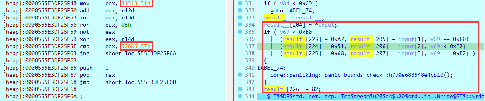

因此逻辑应该是分别去`dest`和`input`的四个字符到字节码的红框中的位置，然后执行字节码进行比较。

`dest`的部分：

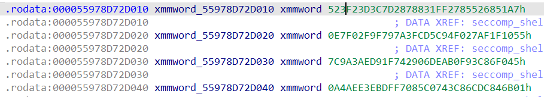

### exp

对于大循环中，对输入的顺序更改，可以使用输入输出表来解决；对输入的加密，由于是字节的加密，也可以使用输入输出表来解决。

更改顺序的输入输出表：可以输入base64的字符串，来获取转换一次后的字符串结果。

字节加密的输入输出表：可以将`0x0-0xff`分为四组分别输入一次，得到结果。

比较的部分的操作基本都在图中，需要到r12、r13、r14三个寄存器的值，可以执行一遍字节码，得到结果（也可以弄懂字节码自己推结果）：

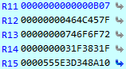

最后脚本：

```python
import struct
import numpy as np


def de_cmp(x):
    r12 = 0x0000000464C457F
    r13 = 0x0000000746F6F72
    r14 = 0x000000031F3831F

    x = np.uint32(x)
    x = np.uint32(x ^ r14)
    x = np.uint32(~x)
    x = np.uint32((x << 11) | (x >> (32 - 11)))
    x = np.uint32(x ^ r13)
    x = np.uint32(x - r12)
    x = np.int32(x)
    return [x & 0xff, (x & 0xff00) >> 8, (x & 0xff0000) >> 16, (x & 0xff000000) >> 24]

def decrypt(data: list, table: dict):
    tmp = []
    for i in data:
        tmp.append(table.index(i))
    return tmp


def reverse_order(data: list, table: list):
    tmp = []
    for i in range(64):
        tmp.append(data[table[i]])
    return tmp


old = "ABCDEFGHIJKLMNOPQRSTUVWXYZabcdefghijklmnopqrstuvwxyz0123456789+/"
trans = "rP5V+azMm8xwY1SGnHtb/OcZyvDpRgN6kd3q9LKE4QTfXhB0UuoCs2JiejFl7AIW"
reverse_table = []
for i in old:
    reverse_table.append(trans.find(i))
enc_table = [
    0xFB, 0x7B, 0x4E, 0xBB, 0x51, 0x15, 0x8D, 0xDB, 0xB0, 0xAC,
    0xA5, 0x8E, 0xAA, 0xB2, 0x60, 0xEB, 0x63, 0x5C, 0xDE, 0x42,
    0x2B, 0xC6, 0xA6, 0x35, 0x30, 0x43, 0xD6, 0x5F, 0xBD, 0x24,
    0xB1, 0xE3, 0x8C, 0xA7, 0xD5, 0x2A, 0x7C, 0x6D, 0x8B, 0x17,
    0x9D, 0x83, 0xFE, 0x69, 0x10, 0x59, 0xA9, 0x9E, 0x0F, 0x1C,
    0x66, 0x97, 0x5B, 0x61, 0xED, 0xAD, 0xE0, 0xDA, 0x27, 0x06,
    0x25, 0xDC, 0x5E, 0xE7,
    0x41, 0x32, 0xD2, 0xD9, 0x8F, 0xEE, 0xAF, 0x03, 0x93, 0x3A,
    0x00, 0xA2, 0xE1, 0xB3, 0xEC, 0x81, 0x9F, 0xCA, 0x58, 0xB7,
    0x79, 0xFD, 0x3B, 0xA0, 0x02, 0x0C, 0xCB, 0xA8, 0x80, 0xC0,
    0x16, 0x4D, 0x2F, 0x75, 0x71, 0x0A, 0x04, 0x39, 0xFF, 0xC1,
    0x9C, 0xAB, 0xEF, 0xA4, 0xD8, 0xE2, 0x14, 0xC2, 0x6C, 0x64,
    0x1E, 0x6B, 0x7E, 0x99, 0x2E, 0x09, 0x0B, 0x86, 0x74, 0x6A,
    0xC4, 0x2D, 0x4F, 0xF9,
    0xFA, 0x94, 0xB6, 0x1F, 0x89, 0x6F, 0x5D, 0xE8, 0xEA, 0xB5,
    0x5A, 0x65, 0x88, 0xC5, 0x7F, 0x77, 0x11, 0xCF, 0xF1, 0x1B,
    0x3F, 0xF4, 0x48, 0x47, 0x12, 0xE4, 0xBA, 0xDF, 0xE9, 0x62,
    0x6E, 0xB4, 0x96, 0xCD, 0x13, 0x53, 0x4B, 0x28, 0xD7, 0xD1,
    0x33, 0xB8, 0xE6, 0x7A, 0x2C, 0x9B, 0x29, 0x44, 0x52, 0xF7,
    0x20, 0xF2, 0x31, 0xD3, 0xB9, 0x40, 0xD0, 0x34, 0xF5, 0x54,
    0x1A, 0x01, 0xA1, 0x92,
    0xFC, 0x85, 0x07, 0xBE, 0xDD, 0xBC, 0x19, 0xF3, 0x36, 0xF6,
    0x72, 0x98, 0x4C, 0x7D, 0xC7, 0xD4, 0x45, 0x4A, 0x9A, 0xC3,
    0x8A, 0xE5, 0x50, 0x46, 0xCC, 0x68, 0x76, 0x67, 0xC9, 0x0E,
    0x3C, 0x57, 0xF0, 0x22, 0xBF, 0x26, 0x84, 0x0D, 0x90, 0xA3,
    0xAE, 0x3D, 0x1D, 0xC8, 0x91, 0x05, 0x87, 0x70, 0x08, 0x73,
    0x21, 0x49, 0x55, 0x3E, 0x37, 0x23, 0x18, 0x56, 0xCE, 0x82,
    0x38, 0x95, 0x78, 0xF8
]
result = [
    0xA7, 0x51, 0x68, 0x52, 0x85, 0x27, 0xFF, 0x31, 0x88, 0x87,
    0xD2, 0xC7, 0xD3, 0x23, 0x3F, 0x52, 0x55, 0x10, 0x1F, 0xAF,
    0x27, 0xF0, 0x94, 0x5C, 0xCD, 0x3F, 0x7A, 0x79, 0x9F, 0x2F,
    0xF0, 0xE7, 0x45, 0xF0, 0x86, 0x3C, 0xF9, 0xB0, 0xEA, 0x6D,
    0x90, 0x42, 0xF7, 0x91, 0xED, 0x3A, 0x9A, 0x7C, 0x01, 0x6B,
    0x84, 0xDC, 0x6C, 0xC8, 0x43, 0x07, 0x5C, 0x08, 0xF7, 0xDF,
    0xEB, 0xE3, 0xAE, 0xA4
]
result = struct.unpack("<16I", bytes(result))

tmp = []
for i in result:
    tmp += de_cmp(i)
for i in range(256):
    tmp = decrypt(tmp, enc_table)
    tmp = reverse_order(tmp, reverse_table)
print(''.join(chr(i) for i in tmp))
```

## lessequalmore

👉 [网上师傅的wp](https://phot0n.com/2023/09/11/HITCONCTF-2023/)

### 程序逻辑

程序逻辑是虚拟机，输入然后验证。

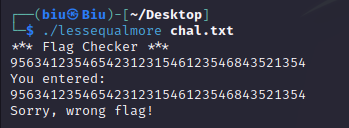

用python实现虚拟机：

```python
import sys
import numpy as np

with open('chal.txt', 'r') as f:
    data = f.read().split()
    data = [int(x) for x in data]


class VM():
    def __init__(self, opcode) -> None:
        self.opcode = opcode
        self.eip = 0
        self.input_num = 0
        self.flag_5436 = 0

    def getinput(self):
        t = sys.stdin.read(1)
        if t != '%':
            num = np.int64(ord(t))
            return ~num
        else:
            t = sys.stdin.read(1)
            if t == 'x':
                try:
                    num = sys.stdin.readline()
                    num = int(num, 16)
                    num = np.int64(num)
                    return ~num
                except:
                    print('please input a hex number')
                    exit(0)
            elif 37 <= ord(t) <= 57:
                try:
                    num = t + sys.stdin.readline()
                    num = int(num, 10)
                    print(num)
                    num = np.int64(num)
                    return ~num
                except:
                    print('please input a dec number')
                    exit(0)
            else:
                num = np.int64(ord(t))
                return ~num
    
    def run(self):
        while self.eip >= 0:
            if self.eip == 5436:
                self.flag_5436 += 1
                if self.flag_5436 == 3:
                    with open('check_begin_opcode.txt', 'w') as f:
                        f.write(str(self.opcode))
                    break

            arg1, arg2 = self.opcode[self.eip], self.opcode[self.eip + 1]
            if arg1 < 0 and arg2 >= 0:
                # num = -int(input())
                if self.input_num < 64:
                    num = -(self.input_num % 26 + ord('a'))
                    print("get input", (self.input_num % 26 + ord('a')))
                    self.input_num += 1
                else:
                    num = -10

                print(f"{self.eip}:\tcode[{arg2}] = code[{arg2}]:{self.opcode[arg2]} - input:{num} = {self.opcode[arg2] - num}")
                self.opcode[arg2] -= num

            elif arg1 >= 0 and arg2 >= 0:
                print(f"{self.eip}:\tcode[{arg2}] = code[{arg2}]:{self.opcode[arg2]} - code[{arg1}]:{self.opcode[arg1]} = {self.opcode[arg2] - self.opcode[arg1]}")
                self.opcode[arg2] -= self.opcode[arg1]

            elif arg1 >= 0 and arg2 < 0:
                print(f"{self.eip}:\tOutput: code[{arg1}]:{chr(self.opcode[arg1])}")
                print(chr(self.opcode[arg1]), end='')

            else:
                num = -int(input())
                print(chr(num), end='')


            if self.opcode[arg2] <= 0:
                if self.opcode[self.eip + 2] != self.eip + 3:
                    print(f"code[{arg2}]:{self.opcode[arg2]} <= 0, jmp to code[{self.eip + 2}]:{self.opcode[self.eip + 2]}")
                self.eip = self.opcode[self.eip + 2]
            else:
                self.eip += 3
            

if __name__ == '__main__':
    vm = VM(data)
    vm.run()
```

根据输出的信息，可以知道输入被放到了`opcode[16:]`的地方，长度放在了`opcode[4]`，`4375, 4376, 4394, 4561, 4562, 4580`这几个地方放了最后一位输出的位置。

根据程序逻辑，输出之后会再次输出回车符，程序一共输出了四次回车符（`eip = 5433`）:

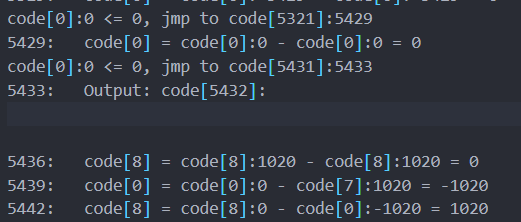

第三次回车符之后就是开始检查输入了，因此可以不用管前面的部分，上面的代码尝试当程序第三次执行完输出之后，即到`eip=5436`时，将`opcode` `dump`出来。

`dump`出来后，直接让虚拟机从`5436`开始执行：

```python
import sys
import sympy

with open('cd.txt', 'r') as f:
    data = eval(f.read())
print(data[7])
length = 64
data[4] = length
for i in [4375, 4376, 4394]:
    data[i] = 16+length-1
for i in [4561, 4562, 4580]:
    data[i] = 16+length
x0, x1, x2, x3, x4, x5, x6, x7, x8, x9, x10, x11, x12, x13, x14, x15, x16, \
    x17, x18, x19, x20, x21, x22, x23, x24, x25, x26, x27, x28, x29, x30, x31, x32, \
    x33, x34, x35, x36, x37, x38, x39, x40, x41, x42, x43, x44, x45, x46, x47, x48, \
    x49, x50, x51, x52, x53, x54, x55, x56, x57, x58, x59, x60, x61, x62, x63 = sympy.symbols(
        'x0:64', integer=True, positive=True, domain=sympy.Interval(0, 256)
    )
data[16] = x0
data[17] = x1
data[18] = x2
data[19] = x3
data[20] = x4
data[21] = x5
data[22] = x6
data[23] = x7
data[24] = x8
data[25] = x9
data[26] = x10
data[27] = x11
data[28] = x12
data[29] = x13
data[30] = x14
data[31] = x15
data[32] = x16
data[33] = x17
data[34] = x18
data[35] = x19
data[36] = x20
data[37] = x21
data[38] = x22
data[39] = x23
data[40] = x24
data[41] = x25
data[42] = x26
data[43] = x27
data[44] = x28
data[45] = x29
data[46] = x30
data[47] = x31
data[48] = x32
data[49] = x33
data[50] = x34
data[51] = x35
data[52] = x36
data[53] = x37
data[54] = x38
data[55] = x39
data[56] = x40
data[57] = x41
data[58] = x42
data[59] = x43
data[60] = x44
data[61] = x45
data[62] = x46
data[63] = x47
data[64] = x48
data[65] = x49
data[66] = x50
data[67] = x51
data[68] = x52
data[69] = x53
data[70] = x54
data[71] = x55
data[72] = x56
data[73] = x57
data[74] = x58
data[75] = x59
data[76] = x60
data[77] = x61
data[78] = x62
data[79] = x63


class VM():
    def __init__(self, opcode) -> None:
        self.opcode = opcode
        self.eip = 5436
        self.input_num = 0
        self.index = 0

    def run(self):
        while self.eip >= 0:
            arg1, arg2 = self.opcode[self.eip], self.opcode[self.eip + 1]
            
            if(type(arg1)==sympy.core.add.Add):
                varname = f"y{self.index}"
                vars()[varname] = sympy.symbols(varname,integer=True,positive=True)
                num = vars()[varname]
                self.index += 1
            else:
                if arg1 < 0:
                    print("input", end=": ")
                    num = -int(input()) # 基本不会走到这里了
                else:
                    num = self.opcode[arg1]
                
            if arg2 < 0:
                print(chr(num), end='')
            else:
                print(f"{self.eip}:\tcode[{arg2}] = code[{arg2}]:{self.opcode[arg2]} - code[{arg1}]:{self.opcode[arg1]} = {self.opcode[arg2] - self.opcode[arg1]}")
                self.opcode[arg2] -= num
                self.opcode[arg2] = sympy.sympify(self.opcode[arg2])

            bore = self.opcode[arg2] <= 0
            if(type(bore)==sympy.core.relational.LessThan):
                ans_max_set = {}
                ans_min_set = {}
                sym = bore.free_symbols
                while(sym != set()):
                    tmp = sym.pop()
                    ans_max_set[tmp]=256
                    ans_min_set[tmp]=0
                if(bore.subs(ans_max_set)  or bore.subs(ans_min_set)):
                    if self.opcode[self.eip + 2] != self.eip + 3:
                        print(f"code[{arg2}]:{self.opcode[arg2]} <= 0, jmp to code[{self.eip + 2}]:{self.opcode[self.eip + 2]}")
                
                    self.eip = self.opcode[self.eip+2]
                else:
                    self.eip += 3
            else:
                if self.opcode[arg2] <= 0:
                    if self.opcode[self.eip + 2] != self.eip + 3:
                        print(f"code[{arg2}]:{self.opcode[arg2]} <= 0, jmp to code[{self.eip + 2}]:{self.opcode[self.eip + 2]}")
                
                    self.eip = self.opcode[self.eip + 2]
                else:
                    self.eip += 3
        for i in range(len(self.opcode)):
            print(f"{i} ->{self.opcode[i]}")


if __name__ == '__main__':
    vm = VM(data)
    vm.run()
```

可以使用`sympy`，让输入是符号，以便在过程的表达式中好看点，在执行之前，将输入放到opcode中。

在输出的信息中，跟踪`x0`走，可以发现其逐渐变成了多项式：


原本存放`x0`的地方`opcode[16]`存放了多项式：

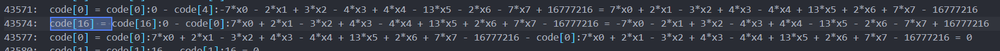

跟踪这个多项式的最后结果，其和一个大数进行了减法，猜测是比较：


最后，虚拟机结束后，输出opcode的结果，存放输入的地方都变成了多项式：

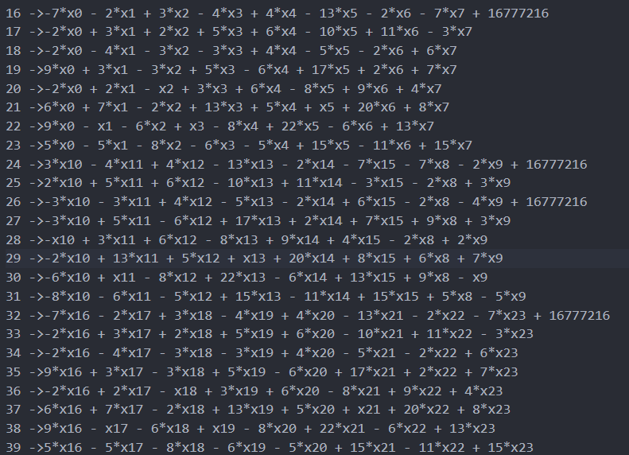

比较的结果可以在下面找到：

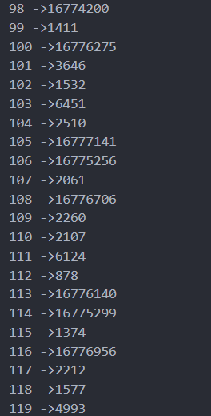

以上可以列成等式，但能看出部分等式，左右相差较大，观察其他式子，可以补充个`16777216`。

### exp

```python
from z3 import *

x0 = Int('x0')
x1 = Int('x1')
x2 = Int('x2')
x3 = Int('x3')
x4 = Int('x4')
x5 = Int('x5')
x6 = Int('x6')
x7 = Int('x7')
x8 = Int('x8')
x9 = Int('x9')
x10 = Int('x10')
x11 = Int('x11')
x12 = Int('x12')
x13 = Int('x13')
x14 = Int('x14')
x15 = Int('x15')
x16 = Int('x16')
x17 = Int('x17')
x18 = Int('x18')
x19 = Int('x19')
x20 = Int('x20')
x21 = Int('x21')
x22 = Int('x22')
x23 = Int('x23')
x24 = Int('x24')
x25 = Int('x25')
x26 = Int('x26')
x27 = Int('x27')
x28 = Int('x28')
x29 = Int('x29')
x30 = Int('x30')
x31 = Int('x31')
x32 = Int('x32')
x33 = Int('x33')
x34 = Int('x34')
x35 = Int('x35')
x36 = Int('x36')
x37 = Int('x37')
x38 = Int('x38')
x39 = Int('x39')
x40 = Int('x40')
x41 = Int('x41')
x42 = Int('x42')
x43 = Int('x43')
x44 = Int('x44')
x45 = Int('x45')
x46 = Int('x46')
x47 = Int('x47')
x48 = Int('x48')
x49 = Int('x49')
x50 = Int('x50')
x51 = Int('x51')
x52 = Int('x52')
x53 = Int('x53')
x54 = Int('x54')
x55 = Int('x55')
x56 = Int('x56')
x57 = Int('x57')
x58 = Int('x58')
x59 = Int('x59')
x60 = Int('x60')
x61 = Int('x61')
x62 = Int('x62')
x63 = Int('x63')
solver = Solver()
solver.add(16774200 == -7 * x0 - 2 * x1 + 3 * x2 - 4 * x3 + 4 * x4 - 13 * x5 - 2 * x6 - 7 * x7 + 16777216)
solver.add(1411 == -2 * x0 + 3 * x1 + 2 * x2 + 5 * x3 + 6 * x4 - 10 * x5 + 11 * x6 - 3 * x7)
solver.add(16776275 == -2 * x0 - 4 * x1 - 3 * x2 - 3 * x3 + 4 * x4 - 5 * x5 - 2 * x6 + 6 * x7 + 16777216)
solver.add(3646 == 9 * x0 + 3 * x1 - 3 * x2 + 5 * x3 - 6 * x4 + 17 * x5 + 2 * x6 + 7 * x7)
solver.add(1532 == -2 * x0 + 2 * x1 - x2 + 3 * x3 + 6 * x4 - 8 * x5 + 9 * x6 + 4 * x7)
solver.add(6451 == 6 * x0 + 7 * x1 - 2 * x2 + 13 * x3 + 5 * x4 + x5 + 20 * x6 + 8 * x7)
solver.add(2510 == 9 * x0 - x1 - 6 * x2 + x3 - 8 * x4 + 22 * x5 - 6 * x6 + 13 * x7)
solver.add(16777141 == 5 * x0 - 5 * x1 - 8 * x2 - 6 * x3 - 5 * x4 + 15 * x5 - 11 * x6 + 15 * x7 + 16777216)
solver.add(16775256 == 3 * x10 - 4 * x11 + 4 * x12 - 13 * x13 - 2 * x14 - 7 * x15 - 7 * x8 - 2 * x9 + 16777216)
solver.add(2061 == 2 * x10 + 5 * x11 + 6 * x12 - 10 * x13 + 11 * x14 - 3 * x15 - 2 * x8 + 3 * x9)
solver.add(16776706 == -3 * x10 - 3 * x11 + 4 * x12 - 5 * x13 - 2 * x14 + 6 * x15 - 2 * x8 - 4 * x9 + 16777216)
solver.add(2260 == -3 * x10 + 5 * x11 - 6 * x12 + 17 * x13 + 2 * x14 + 7 * x15 + 9 * x8 + 3 * x9)
solver.add(2107 == -x10 + 3 * x11 + 6 * x12 - 8 * x13 + 9 * x14 + 4 * x15 - 2 * x8 + 2 * x9)
solver.add(6124 == -2 * x10 + 13 * x11 + 5 * x12 + x13 + 20 * x14 + 8 * x15 + 6 * x8 + 7 * x9)
solver.add(878 == -6 * x10 + x11 - 8 * x12 + 22 * x13 - 6 * x14 + 13 * x15 + 9 * x8 - x9)
solver.add(16776140 == -8 * x10 - 6 * x11 - 5 * x12 + 15 * x13 - 11 * x14 + 15 * x15 + 5 * x8 - 5 * x9 + 16777216)
solver.add(16775299 == -7 * x16 - 2 * x17 + 3 * x18 - 4 * x19 + 4 * x20 - 13 * x21 - 2 * x22 - 7 * x23 + 16777216)
solver.add(1374 == -2 * x16 + 3 * x17 + 2 * x18 + 5 * x19 + 6 * x20 - 10 * x21 + 11 * x22 - 3 * x23)
solver.add(16776956 == -2 * x16 - 4 * x17 - 3 * x18 - 3 * x19 + 4 * x20 - 5 * x21 - 2 * x22 + 6 * x23 + 16777216)
solver.add(2212 == 9 * x16 + 3 * x17 - 3 * x18 + 5 * x19 - 6 * x20 + 17 * x21 + 2 * x22 + 7 * x23)
solver.add(1577 == -2 * x16 + 2 * x17 - x18 + 3 * x19 + 6 * x20 - 8 * x21 + 9 * x22 + 4 * x23)
solver.add(4993 == 6 * x16 + 7 * x17 - 2 * x18 + 13 * x19 + 5 * x20 + x21 + 20 * x22 + 8 * x23)
solver.add(1351 == 9 * x16 - x17 - 6 * x18 + x19 - 8 * x20 + 22 * x21 - 6 * x22 + 13 * x23)
solver.add(16777040 == 5 * x16 - 5 * x17 - 8 * x18 - 6 * x19 - 5 * x20 + 15 * x21 - 11 * x22 + 15 * x23 + 16777216)
solver.add(16774665 == -7 * x24 - 2 * x25 + 3 * x26 - 4 * x27 + 4 * x28 - 13 * x29 - 2 * x30 - 7 * x31 + 16777216)
solver.add(1498 == -2 * x24 + 3 * x25 + 2 * x26 + 5 * x27 + 6 * x28 - 10 * x29 + 11 * x30 - 3 * x31)
solver.add(16776379 == -2 * x24 - 4 * x25 - 3 * x26 - 3 * x27 + 4 * x28 - 5 * x29 - 2 * x30 + 6 * x31 + 16777216)
solver.add(3062 == 9 * x24 + 3 * x25 - 3 * x26 + 5 * x27 - 6 * x28 + 17 * x29 + 2 * x30 + 7 * x31)
solver.add(1593 == -2 * x24 + 2 * x25 - x26 + 3 * x27 + 6 * x28 - 8 * x29 + 9 * x30 + 4 * x31)
solver.add(5966 == 6 * x24 + 7 * x25 - 2 * x26 + 13 * x27 + 5 * x28 + x29 + 20 * x30 + 8 * x31)
solver.add(1924 == 9 * x24 - x25 - 6 * x26 + x27 - 8 * x28 + 22 * x29 - 6 * x30 + 13 * x31)
solver.add(16776815 == 5 * x24 - 5 * x25 - 8 * x26 - 6 * x27 - 5 * x28 + 15 * x29 - 11 * x30 + 15 * x31 + 16777216)
solver.add(16774318 == -7 * x32 - 2 * x33 + 3 * x34 - 4 * x35 + 4 * x36 - 13 * x37 - 2 * x38 - 7 * x39 + 16777216)
solver.add(851 == -2 * x32 + 3 * x33 + 2 * x34 + 5 * x35 + 6 * x36 - 10 * x37 + 11 * x38 - 3 * x39)
solver.add(16775763 == -2 * x32 - 4 * x33 - 3 * x34 - 3 * x35 + 4 * x36 - 5 * x37 - 2 * x38 + 6 * x39 + 16777216)
solver.add(3663 == 9 * x32 + 3 * x33 - 3 * x34 + 5 * x35 - 6 * x36 + 17 * x37 + 2 * x38 + 7 * x39)
solver.add(711 == -2 * x32 + 2 * x33 - x34 + 3 * x35 + 6 * x36 - 8 * x37 + 9 * x38 + 4 * x39)
solver.add(5193 == 6 * x32 + 7 * x33 - 2 * x34 + 13 * x35 + 5 * x36 + x37 + 20 * x38 + 8 * x39)
solver.add(2591 == 9 * x32 - x33 - 6 * x34 + x35 - 8 * x36 + 22 * x37 - 6 * x38 + 13 * x39)
solver.add(16777069 == 5 * x32 - 5 * x33 - 8 * x34 - 6 * x35 - 5 * x36 + 15 * x37 - 11 * x38 + 15 * x39 + 16777216)
solver.add(16774005 == -7 * x40 - 2 * x41 + 3 * x42 - 4 * x43 + 4 * x44 - 13 * x45 - 2 * x46 - 7 * x47 + 16777216)
solver.add(1189 == -2 * x40 + 3 * x41 + 2 * x42 + 5 * x43 + 6 * x44 - 10 * x45 + 11 * x46 - 3 * x47)
solver.add(16776283 == -2 * x40 - 4 * x41 - 3 * x42 - 3 * x43 + 4 * x44 - 5 * x45 - 2 * x46 + 6 * x47 + 16777216)
solver.add(3892 == 9 * x40 + 3 * x41 - 3 * x42 + 5 * x43 - 6 * x44 + 17 * x45 + 2 * x46 + 7 * x47)
solver.add(1372 == -2 * x40 + 2 * x41 - x42 + 3 * x43 + 6 * x44 - 8 * x45 + 9 * x46 + 4 * x47)
solver.add(6362 == 6 * x40 + 7 * x41 - 2 * x42 + 13 * x43 + 5 * x44 + x45 + 20 * x46 + 8 * x47)
solver.add(2910 == 9 * x40 - x41 - 6 * x42 + x43 - 8 * x44 + 22 * x45 - 6 * x46 + 13 * x47)
solver.add(307 == 5 * x40 - 5 * x41 - 8 * x42 - 6 * x43 - 5 * x44 + 15 * x45 - 11 * x46 + 15 * x47)
solver.add(16775169 == -7 * x48 - 2 * x49 + 3 * x50 - 4 * x51 + 4 * x52 - 13 * x53 - 2 * x54 - 7 * x55 + 16777216)
solver.add(1031 == -2 * x48 + 3 * x49 + 2 * x50 + 5 * x51 + 6 * x52 - 10 * x53 + 11 * x54 - 3 * x55)
solver.add(16776798 == -2 * x48 - 4 * x49 - 3 * x50 - 3 * x51 + 4 * x52 - 5 * x53 - 2 * x54 + 6 * x55 + 16777216)
solver.add(2426 == 9 * x48 + 3 * x49 - 3 * x50 + 5 * x51 - 6 * x52 + 17 * x53 + 2 * x54 + 7 * x55)
solver.add(1171 == -2 * x48 + 2 * x49 - x50 + 3 * x51 + 6 * x52 - 8 * x53 + 9 * x54 + 4 * x55)
solver.add(4570 == 6 * x48 + 7 * x49 - 2 * x50 + 13 * x51 + 5 * x52 + x53 + 20 * x54 + 8 * x55)
solver.add(1728 == 9 * x48 - x49 - 6 * x50 + x51 - 8 * x52 + 22 * x53 - 6 * x54 + 13 * x55)
solver.add(33 == 5 * x48 - 5 * x49 - 8 * x50 - 6 * x51 - 5 * x52 + 15 * x53 - 11 * x54 + 15 * x55)
solver.add(16775201 == -7 * x56 - 2 * x57 + 3 * x58 - 4 * x59 + 4 * x60 - 13 * x61 - 2 * x62 - 7 * x63 + 16777216)
solver.add(819 == -2 * x56 + 3 * x57 + 2 * x58 + 5 * x59 + 6 * x60 - 10 * x61 + 11 * x62 - 3 * x63)
solver.add(16776898 == -2 * x56 - 4 * x57 - 3 * x58 - 3 * x59 + 4 * x60 - 5 * x61 - 2 * x62 + 6 * x63 + 16777216)
solver.add(2370 == 9 * x56 + 3 * x57 - 3 * x58 + 5 * x59 - 6 * x60 + 17 * x61 + 2 * x62 + 7 * x63)
solver.add(1132 == -2 * x56 + 2 * x57 - x58 + 3 * x59 + 6 * x60 - 8 * x61 + 9 * x62 + 4 * x63)
solver.add(4255 == 6 * x56 + 7 * x57 - 2 * x58 + 13 * x59 + 5 * x60 + x61 + 20 * x62 + 8 * x63)
solver.add(1900 == 9 * x56 - x57 - 6 * x58 + x59 - 8 * x60 + 22 * x61 - 6 * x62 + 13 * x63)
solver.add(347 == 5 * x56 - 5 * x57 - 8 * x58 - 6 * x59 - 5 * x60 + 15 * x61 - 11 * x62 + 15 * x63)
flag = []
ans = ""
if solver.check() == sat:
    m = solver.model()
    flag.append(m[x0])
    flag.append(m[x1])
    flag.append(m[x2])
    flag.append(m[x3])
    flag.append(m[x4])
    flag.append(m[x5])
    flag.append(m[x6])
    flag.append(m[x7])
    flag.append(m[x8])
    flag.append(m[x9])
    flag.append(m[x10])
    flag.append(m[x11])
    flag.append(m[x12])
    flag.append(m[x13])
    flag.append(m[x14])
    flag.append(m[x15])
    flag.append(m[x16])
    flag.append(m[x17])
    flag.append(m[x18])
    flag.append(m[x19])
    flag.append(m[x20])
    flag.append(m[x21])
    flag.append(m[x22])
    flag.append(m[x23])
    flag.append(m[x24])
    flag.append(m[x25])
    flag.append(m[x26])
    flag.append(m[x27])
    flag.append(m[x28])
    flag.append(m[x29])
    flag.append(m[x30])
    flag.append(m[x31])
    flag.append(m[x32])
    flag.append(m[x33])
    flag.append(m[x34])
    flag.append(m[x35])
    flag.append(m[x36])
    flag.append(m[x37])
    flag.append(m[x38])
    flag.append(m[x39])
    flag.append(m[x40])
    flag.append(m[x41])
    flag.append(m[x42])
    flag.append(m[x43])
    flag.append(m[x44])
    flag.append(m[x45])
    flag.append(m[x46])
    flag.append(m[x47])
    flag.append(m[x48])
    flag.append(m[x49])
    flag.append(m[x50])
    flag.append(m[x51])
    flag.append(m[x52])
    flag.append(m[x53])
    flag.append(m[x54])
    flag.append(m[x55])
    flag.append(m[x56])
    flag.append(m[x57])
    flag.append(m[x58])
    flag.append(m[x59])
    flag.append(m[x60])
    flag.append(m[x61])
    flag.append(m[x62])
    flag.append(m[x63])
    print(flag)
    for i in flag:
        ans += chr(i.as_long())
    print(ans)
```

## CrazyArcade

根据这位师傅的思路来做👉[hitcon2023/rev_crazyarcade](https://github.com/mmm-team/public-writeups/tree/ab897bfac361a4a985dbe6219652499056c74ebe/hitcon2023/rev_crazyarcade)

> ... it uses a driver to read and write memory in the driver via `DeviceIoControl`.
>
> ```
> read ioctl handler bytes into handler_bytes
> 
> write magic 0x25 bytes into driver+0x3000
> 
> for i in range(0x1337):
>  (driver+0x3000)[i%0x25] ^= (i&0xff) ^ handler_bytes[i%0x584]
> ```

关注`DeviceIoControl`的调用，来到`sub_7FF6F6CD6070`，大概是初始化部分：

```C
__int64 sub_7FF6F6CD6070()
{
    __int64 OutBuffer[3]; // [rsp+70h] [rbp-90h] BYREF
    int v35; // [rsp+88h] [rbp-78h]
    __int128 v36; // [rsp+8Ch] [rbp-74h]
    int v37; // [rsp+9Ch] [rbp-64h]
    
    __int64 InBuffer[3]; // [rsp+A0h] [rbp-60h] BYREF
    int v39; // [rsp+B8h] [rbp-48h]
    int v40; // [rsp+BCh] [rbp-44h]
    __int128 v41; // [rsp+C0h] [rbp-40h]

    wcscpy(Source, L"\\CrazyArcade.sys");
    GetCurrentDirectoryW(0x115u, Buffer);
    wcsncat_s(Buffer, 0x115ui64, Source, 0x11ui64);
    if ( (unsigned int)sub_7FF6F6CD4BD0(v1, v0, Buffer) == 5 ) // 开启CrazyArcade服务啥的
    {
        MessageBoxW(0i64, L"Please run with Administrator\n", L"error", 0);
        ExitProcess(0);
    }
    hDevice = 0i64;
    base_address_CrazyArcade = 0i64;
    FileW = CreateFileW(L"\\\\.\\RTCore64", 0xC0000000, 0, 0i64, 3u, 0, 0i64);
    if ( FileW == (HANDLE)-1i64 )
    {
        MessageBoxW(0i64, L"Failed to get driver handle.", L"error", 0);
        ExitProcess(0);
    }
    hDevice = FileW;
    v3 = ((__int64 (*)(void))return_base_address_CrazyArcade)();
    base_address_CrazyArcade = v3;
    if ( !hDevice || !v3 )
    {
        MessageBoxW(0i64, L"Wrong driver info\n", L"error", 0);
        ExitProcess(0);
    }
    
    v4 = 0x584i64;
    qword_7FF6F6CE6248 = (__int64)operator new(0x584ui64);
    v5 = 0i64;
    v6 = 0i64;
    do
    {
        OutBuffer[1] = v6 + base_address_CrazyArcade + 0x1450;
        OutBuffer[0] = 0i64;
        OutBuffer[2] = 0i64;
        v36 = 0i64;
        v37 = 0;
        v35 = 1;
        DeviceIoControl(hDevice, 0x80002048, OutBuffer, 0x30u, OutBuffer, 0x30u, &BytesReturned, 0i64);
        ++v5;
        ++v6;
        *(_BYTE *)(v5 + qword_7FF6F6CE6248 - 1) = v36;
        --v4;
    }
    while ( v4 );
    
    v27[0] = 0x7F198AB7;
    v7 = v27;
    v27[1] = 0xF0812D54;
    v8 = 0i64;
    v27[2] = 0xC9CADDB8;
    v9 = 37i64;
    v27[3] = 841204691;
    v28 = 0x2EC95302AB8141BAi64;
    v29 = 0xD295EDABAD207ED6ui64;
    v30 = 0x922AE7B6;
    v31 = 62;
    do
    {
        v10 = *(unsigned __int8 *)v7;
        InBuffer[1] = v8 + base_address_CrazyArcade + 0x3000;
        v40 = v10;
        InBuffer[0] = 0i64;
        InBuffer[2] = 0i64;
        v41 = 0i64;
        v39 = 1;
        DeviceIoControl(hDevice, 0x8000204C, InBuffer, 0x30u, InBuffer, 0x30u, &v33, 0i64);
        ++v8;
        v7 = (int *)((char *)v7 + 1);
        --v9;
    }
    while ( v9 );
    boom_times = 0;
	...
}
```

`DeviceIoControl`的另一处调用：可以发现WP中的加密逻辑

```C
int __fastcall sub_7FF6F6CD30A0(__int64 a1)
{
    int *v2; // rax
    unsigned int boom_times; // ecx
    DWORD lpBytesReturned[2]; // [rsp+40h] [rbp-88h] BYREF
    DWORD BytesReturned; // [rsp+48h] [rbp-80h] BYREF
    __int64 OutBuffer[3]; // [rsp+50h] [rbp-78h] BYREF
    int v8; // [rsp+68h] [rbp-60h]
    __int128 v9; // [rsp+6Ch] [rbp-5Ch]
    int v10; // [rsp+7Ch] [rbp-4Ch]
    __int64 InBuffer[3]; // [rsp+80h] [rbp-48h] BYREF
    int v12; // [rsp+98h] [rbp-30h]
    int v13; // [rsp+9Ch] [rbp-2Ch]
    __int128 v14; // [rsp+A0h] [rbp-28h]

    sub_7FF6F6CD3850(a1, lpBytesReturned);
    v2 = dword_7FF6F6CE62E0;
    if ( dword_7FF6F6CE62E0[15 * lpBytesReturned[1] + lpBytesReturned[0]] == 5 )
    {
        if ( byte_7FF6F6CE4038 )
            LODWORD(v2) = Mix_PlayChannel(1i64, qword_7FF6F6CE62D0);
        boom_times = ::boom_times;
        *(_BYTE *)(a1 + 20) = 1;
        if ( boom_times < 0x1337 )
        {
            v8 = 1;
            OutBuffer[0] = 0i64;
            v9 = 0i64;
            OutBuffer[2] = 0i64;
            v10 = 0;
            OutBuffer[1] = base_address_CrazyArcade + 0x3000 + boom_times % 0x25;
            DeviceIoControl(hDevice, 0x80002048, OutBuffer, 0x30u, OutBuffer, 0x30u, &BytesReturned, 0i64);
            v14 = 0i64;
            InBuffer[0] = 0i64;
            InBuffer[2] = 0i64;
            v12 = 1;
            InBuffer[1] = ::boom_times % 0x25u + base_address_CrazyArcade + 0x3000;
            v13 = (unsigned __int8)(::boom_times ^ v9) ^ *(unsigned __int8 *)(::boom_times % 0x584u + qword_7FF6F6CE6248);
            LODWORD(v2) = DeviceIoControl(hDevice, 0x8000204C, InBuffer, 0x30u, InBuffer, 0x30u, lpBytesReturned, 0i64);
            ++::boom_times;
        }
    }
    return (int)v2;
}
```

`CrazyArcade.sys`的部分逻辑，为`CrazyArcade`的驱动操作，以下的`case`的为根据控制代码来进行（只贴了两个用到了的）。

```C
__int64 __fastcall sub_11450(__int64 a1, IRP *a2){
    a2->IoStatus.Status = 0;
    a2->IoStatus.Information = 0i64;
    CurrentStackLocation = a2->Tail.Overlay.CurrentStackLocation;
    p_Type = (int *)&a2->AssociatedIrp.MasterIrp->Type;
    Options = CurrentStackLocation->Parameters.Create.Options;
    v6 = CurrentStackLocation->Parameters.Read.Length;
	if ( CurrentStackLocation->MajorFunction == 14 )
  	{
    	switch ( CurrentStackLocation->Parameters.Read.ByteOffset.LowPart )
    	{
         	case 0x80002048:
                if ( (_DWORD)Options == 48 )
                {
                    v7 = *((_QWORD *)p_Type + 1);
                    if ( v7 )
                    {
                        switch ( p_Type[6] )
                        {
                            case 1:
                                p_Type[7] = *(unsigned __int8 *)((unsigned int)p_Type[5] + v7);
                                break;
                            case 2:
                                p_Type[7] = *(unsigned __int16 *)((unsigned int)p_Type[5] + v7);
                                break;
                            case 4:
                                p_Type[7] = *(_DWORD *)((unsigned int)p_Type[5] + v7);
                                break;
                        }
                        a2->IoStatus.Status = 0;
                        a2->IoStatus.Information = 48i64;
                    }
                    else
                    {
                        a2->IoStatus.Status = 0xC000000D;
                    }
                }
                else
                {
                  	a2->IoStatus.Status = 0xC000000D;
                }
                break;
            case 0x8000204C:
                if ( (_DWORD)Options == 48 )
                {
                    v8 = *((_QWORD *)p_Type + 1); // p_Type[2]
                    if ( v8 )
                    {
                        switch ( p_Type[6] )
                        {
                            case 1:
                                *(_BYTE *)((unsigned int)p_Type[5] + v8) = *((_BYTE *)p_Type + 28);
                                break;
                            case 2:
                                *(_WORD *)((unsigned int)p_Type[5] + v8) = *((_WORD *)p_Type + 14);
                                break;
                            case 4:
                                *(_DWORD *)((unsigned int)p_Type[5] + v8) = p_Type[7];
                                break;
                        }
                        a2->IoStatus.Status = 0;
                        a2->IoStatus.Information = 48i64;
                    }
                    else
                    {
                        a2->IoStatus.Status = -1073741670;
                    }
                }
                else
                {
                    a2->IoStatus.Status = -1073741811;
                }
                break;
        }
  	}
    Status = a2->IoStatus.Status;
    IofCompleteRequest(a2, 0);
}
```

根据`CrazyArcade.sys`中的代码，加上GPT可以判断`0x8000204C`是写数据，`0x80002048`是读数据。

那么在`sub_7FF6F6CD6070`中就是初始化数据了。

调试`sub_7FF6F6CD30A0`发现当经过`DeviceIoContorl`后，`v9`发生了变化，猜测该数据就是读出来的数据。

`v9`在OutBuffer的四个字节之后，而下方计算的值`v13`在`InBuffer`在四个字节之后，猜测`v13`就是写回去的数据。

并且`OutBuffer[1], InBuffer[1]`是读写驱动内存的数据的位置。

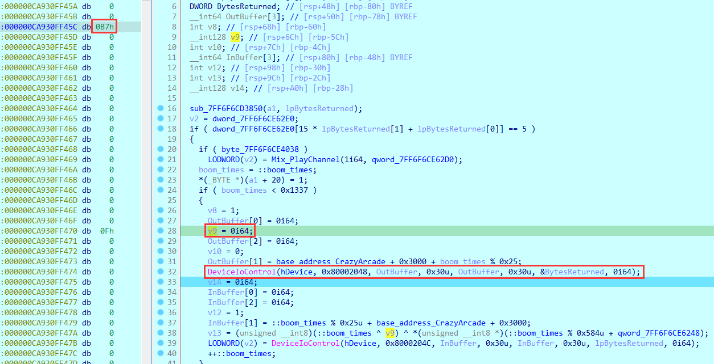

因此，在`sub_7FF6F6CD6070`就是初始化数据赋值的部分：

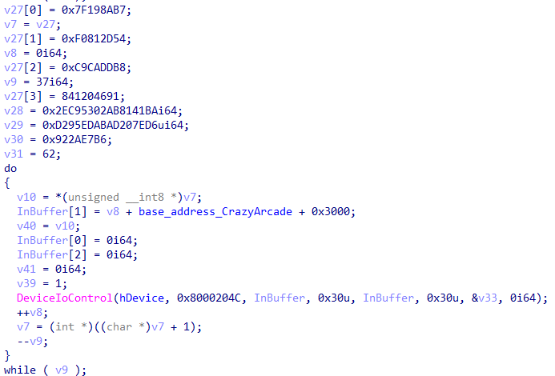

以上就可以求flag了，中间的数据可以直接dump出来。


```Python
import struct

with open('handler_bytes', 'rb') as f:
    handler_bytes = f.read()
handler_array = list(handler_bytes)
data = [
    0x7F198AB7, 0x0F0812D54, 0x0C9CADDB8, 0x3223C3D3, 0x0AB8141BA, 
    0x2EC95302, 0x0AD207ED6, 0x0D295EDAB, 0x922AE7B6, 0x3E
]
d = b''
for i in range(len(data) - 1):
    d += struct.pack('<I', data[i])
d += struct.pack('<B', data[-1])
d = list(d)
for i in range(0x1337):
    d[i % len(d)] ^= (i & 0xff) ^ handler_array[i % len(handler_array)]
print(''.join(map(chr, d)))
# hitcon{cr4zy_arc4de_wi7h_vuln_dr1ver}
```