## eeeeerte

### 安装易语言反编译模块

更改ida.cfg文件，使其可显示中文字符：

> NameChars =
>      "$?@"           // asm specific character
>      "_0123456789"
>      "ABCDEFGHIJKLMNOPQRSTUVWXYZ"
>      "abcdefghijklmnopqrstuvwxyz",
>      // This would enable common Chinese characters in identifiers:
>      Culture_CJK_Unified_Ideographs,
>      CURRENT_CULTURE;

更改ida64.dll和ida.dll，使其可在反编译代码中显示中文字符：（nop掉该语句）


### 主逻辑

由参数名，来进行逆向，对点击数判断的地方下断点。


#### 加密函数

第一个点击数判断，是一个加密函数，需要输入key，然后加密其给出的数据。


encrypt函数先将fake_flag分为几组四个字的数组，进行SKIPJACK解密：

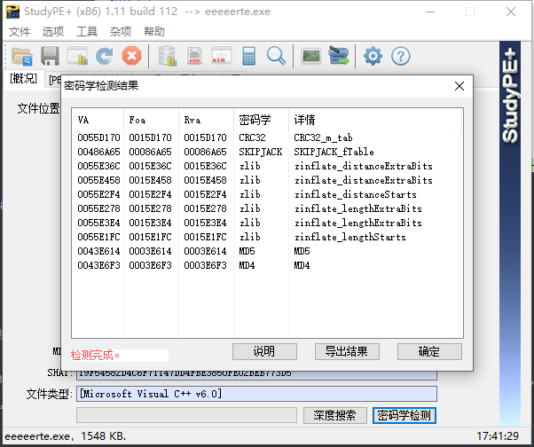

具体加密逻辑，通过调试可知：

```python
import base64
def enc(f, k, d):
    for i in range(32):
        if 0 <= i < 8 or 16 <= i < 24:
            temp = [f[1], f[0]]
            for j in range(4 * i, 4 * i + 4):
                t = k[j % 10] ^ temp[j & 1]
                temp[(j + 1) & 1] = temp[(j + 1) & 1] ^ d[t]
            f[7] ^= (i + 1)
            f = f[6:8] + f[0:6]
            f[3], f[2] = temp[0], temp[1]
            f[0] ^= f[2]
            f[1] ^= f[3]
        else:
            temp = [f[1], f[0]]
            tp = temp
            for j in range(4 * i, 4 * i + 4):
                t = k[j % 10] ^ temp[j & 1]
                temp[(j + 1) & 1] = temp[(j + 1) & 1] ^ d[t]
            f = f[6:8] + [temp[1], temp[0]] + [f[2] ^ f[0], f[3] ^ f[1] ^ (i + 1)] + f[4:6]
    return f
if __name__ == '__main__':
    fake_flag = [0x66, 0x6C, 0x61, 0x67, 0x7B, 0x4D, 0x69, 0x73, 0x64, 0x69, 0x72, 0x65, 0x63, 0x74, 0x69, 0x6F, 0x6E,
                 0x3F, 0x4D, 0x79, 0x73, 0x74, 0x65, 0x72, 0x69, 0x6F, 0x75, 0x73, 0x4A, 0x61, 0x63, 0x6B, 0x3F, 0x46,
                 0x41, 0x41, 0x41, 0x4B, 0x45, 0x7D]
    key = [ord(i) for i in "1234567890"]
    data = [0xA3, 0xD7, 0x09, 0x83, 0xF8, 0x48, 0xF6, 0xF4, 0xB3 ...]
    a = []
    for i in range(len(fake_flag) // 8):
        a += enc(fake_flag[i * 8:i * 8 + 8], key, data)
    result = base64.b64encode(bytearray(a))
    print(result)
```

#### 提供了密文

第二个点击数判断，直接该判断即可获取密文：

`[0, 210, 114, 206, 231, 30, 77, 164, 142, 14, 221, 165, 158, 132, 69, 180, 38, 41, 54, 87, 225, 45, 192, 204, 188, 253, 143, 85, 21, 169, 162, 191, 234, 150, 35, 74, 100, 173, 175, 176]`

#### 画密钥

第三个点击数判断，获取密钥。

##### 方法一

出题师傅说的，在`CreateWindowExA`下断点，更改其长和宽的参数。

```C
HWND CreateWindowExW(
  [in]           DWORD     dwExStyle,
  [in, optional] LPCWSTR   lpClassName,
  [in, optional] LPCWSTR   lpWindowName,
  [in]           DWORD     dwStyle,
  [in]           int       X,
  [in]           int       Y,
  [in]           int       nWidth,
  [in]           int       nHeight,
  [in, optional] HWND      hWndParent,
  [in, optional] HMENU     hMenu,
  [in, optional] HINSTANCE hInstance,
  [in, optional] LPVOID    lpParam
);
```

`CreateWindowExA`一共被调用了四次，大概试一试，知道第四个是有关画密钥的窗口。


将其都改为0，即可。

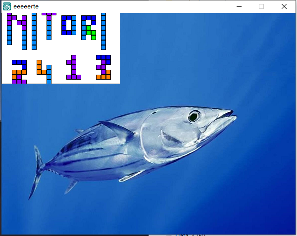

##### 方法二

根据参数，自行画图：

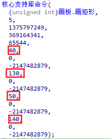

### exp

```python
import base64
def dec(f, k, d):
    for i in range(31, -1, -1):
        if 0 <= i < 8 or 16 <= i < 24:
            temp = [f[3], f[2]]
            for j in range(4 * i + 3, 4 * i - 1, -1):
                t = k[j % 10] ^ temp[j & 1]
                temp[(j + 1) & 1] ^= d[t]
            new_f = [temp[1], temp[0]] + f[4:6] + f[6:8] + [f[2] ^ f[0], f[3] ^ f[1] ^ (i + 1)]
            f = new_f
        else:
            temp = [f[3], f[2]]
            for j in range(4 * i + 3, 4 * i - 1, -1):
                t = k[j % 10] ^ temp[j & 1]
                temp[(j + 1) & 1] ^= d[t]
            new_f = [temp[1], temp[0]] + [f[4] ^ temp[1], f[5] ^ temp[0] ^ (i + 1)] + f[6:8] + f[0:2]
            f = new_f
    return f

if __name__ == '__main__':
    data = [0xA3, 0xD7, 0x09, 0x83, 0xF8, 0x48, 0xF6, 0xF4, 0xB3, 0x21, 0x15, 0x78, 0x99, 0xB1, 0xAF, 0xF9, 0xE7, 0x2D,
            0x4D, 0x8A, 0xCE, 0x4C, 0xCA, 0x2E, 0x52, 0x95, 0xD9, 0x1E, 0x4E, 0x38, 0x44, 0x28, 0x0A, 0xDF, 0x02, 0xA0,
            0x17, 0xF1, 0x60, 0x68, 0x12, 0xB7, 0x7A, 0xC3, 0xE9, 0xFA, 0x3D, 0x53, 0x96, 0x84, 0x6B, 0xBA, 0xF2, 0x63,
            0x9A, 0x19, 0x7C, 0xAE, 0xE5, 0xF5, 0xF7, 0x16, 0x6A, 0xA2, 0x39, 0xB6, 0x7B, 0x0F, 0xC1, 0x93, 0x81, 0x1B,
            0xEE, 0xB4, 0x1A, 0xEA, 0xD0, 0x91, 0x2F, 0xB8, 0x55, 0xB9, 0xDA, 0x85, 0x3F, 0x41, 0xBF, 0xE0, 0x5A, 0x58,
            0x80, 0x5F, 0x66, 0x0B, 0xD8, 0x90, 0x35, 0xD5, 0xC0, 0xA7, 0x33, 0x06, 0x65, 0x69, 0x45, 0x00, 0x94, 0x56,
            0x6D, 0x98, 0x9B, 0x76, 0x97, 0xFC, 0xB2, 0xC2, 0xB0, 0xFE, 0xDB, 0x20, 0xE1, 0xEB, 0xD6, 0xE4, 0xDD, 0x47,
            0x4A, 0x1D, 0x42, 0xED, 0x9E, 0x6E, 0x49, 0x3C, 0xCD, 0x43, 0x27, 0xD2, 0x07, 0xD4, 0xDE, 0xC7, 0x67, 0x18,
            0x89, 0xCB, 0x30, 0x1F, 0x8D, 0xC6, 0x8F, 0xAA, 0xC8, 0x74, 0xDC, 0xC9, 0x5D, 0x5C, 0x31, 0xA4, 0x70, 0x88,
            0x61, 0x2C, 0x9F, 0x0D, 0x2B, 0x87, 0x50, 0x82, 0x54, 0x64, 0x26, 0x7D, 0x03, 0x40, 0x34, 0x4B, 0x1C, 0x73,
            0xD1, 0xC4, 0xFD, 0x3B, 0xCC, 0xFB, 0x7F, 0xAB, 0xE6, 0x3E, 0x5B, 0xA5, 0xAD, 0x04, 0x23, 0x9C, 0x14, 0x51,
            0x22, 0xF0, 0x29, 0x79, 0x71, 0x7E, 0xFF, 0x8C, 0x0E, 0xE2, 0x0C, 0xEF, 0xBC, 0x72, 0x75, 0x6F, 0x37, 0xA1,
            0xEC, 0xD3, 0x8E, 0x62, 0x8B, 0x86, 0x10, 0xE8, 0x08, 0x77, 0x11, 0xBE, 0x92, 0x4F, 0x24, 0xC5, 0x32, 0x36,
            0x9D, 0xCF, 0xF3, 0xA6, 0xBB, 0xAC, 0x5E, 0x6C, 0xA9, 0x13, 0x57, 0x25, 0xB5, 0xE3, 0xBD, 0xA8, 0x3A, 0x01,
            0x05, 0x59, 0x2A, 0x46, 0xAB, 0xAB, 0xAB, 0xAB, 0xAB, 0xAB, 0xAB]
    # 解密
    secret = 'xmxO93Sn8YjfoWqaFS6poLf6n1q7bWrIyXbLAdcSjygWfs/jAVc4leFrTDZYdFoL'
    secret = base64.b64decode(secret)
    secret = list(secret)
    key = [ord(i) for i in "NITORI2413"]
    flag = []
    for i in range(len(secret) // 8):
        flag += dec(secret[i * 8:i * 8 + 8], key, data)
    print(bytearray(flag))
    # NepCTF{3456789TQKA2,Jack_was_skipped_by_EPL}
```


## 九龙拉棺

跟着[出题师傅的wp](https://m1n9yu3.github.io/2023/08/14/NepCTF2023-%E4%B9%9D%E9%BE%99%E6%8B%89%E6%A3%BAwp)走的。

UPX壳，直接脱壳。

### 文件映射对象

创建文件映射对象，存储输入的字符串，使之后创建的进程可以获取输入。

此操作先于main执行。


### 反调试

1. 每个线程都或多或少执行了一个反调试的函数。

2. 检测调式寄存器Dr7是否为正常值。

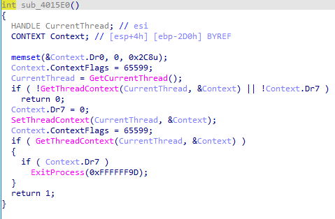

3. 子进程中也有反调试：`NtCurrentPeb()->BeingDebugged`

### 八个线程

main中启动了八个线程。


每个进程依靠全局变量`CriticalLevel`来控制执行顺序，`CriticalLevel`初始值为0。

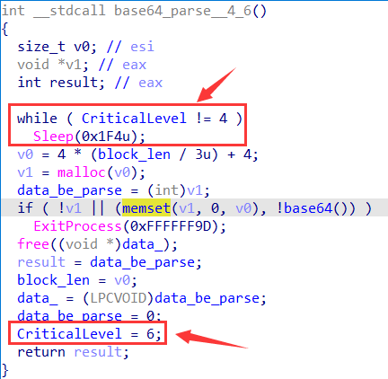

main中获取完输入，将其写入文件映射对象中，然后将`CriticalLevel`置为1，等待其他线程。

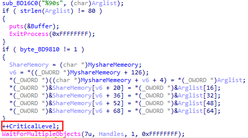

#### 第一个线程：Rc4解密

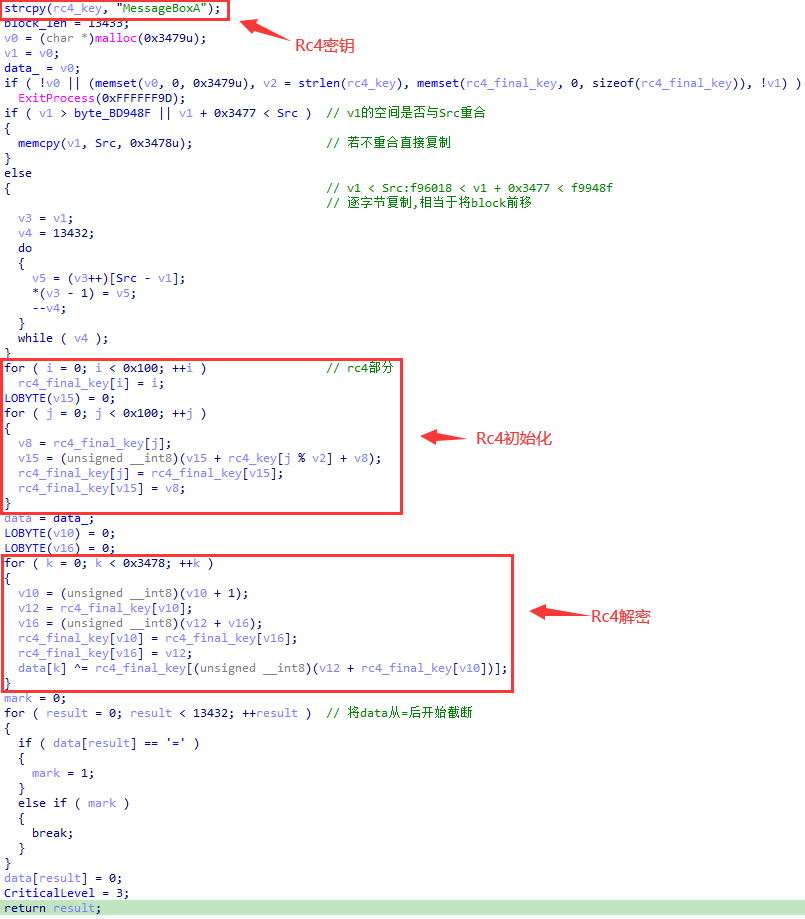

#### 第二个线程：base32解析

主要依靠base32表和字符串看出是base32，前面更新数据长度的部分也可以联想到base32（但有点疑惑为什么是除五乘八）。

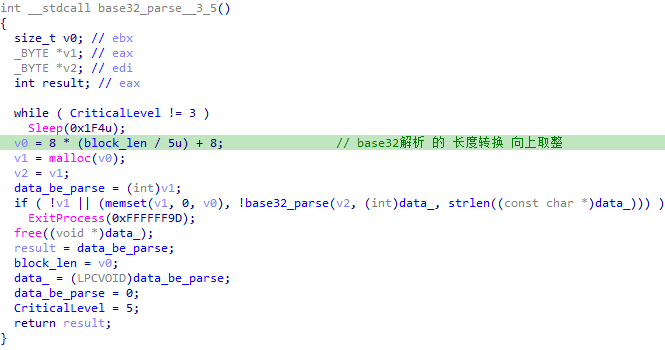

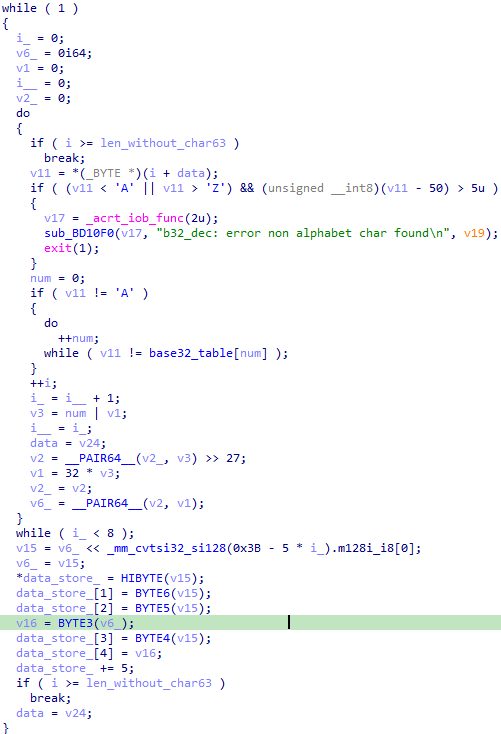

#### 第三个线程：base58

主要转化式子可以辨认。

也可以依靠长度变化来辨别。


#### 第四个线程：base64


#### 第五个线程：StartAddress

前面四个线程处理的数据得到的是一个可执行文件数据，本线程就是将其写入exe，并执行。

具体细节还得再搞搞。

#### 第六个线程：tea、compare

明显的tea和比较：

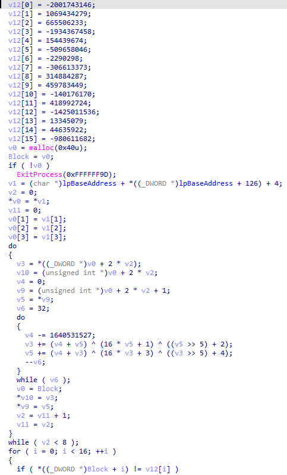

这里解密tea可得到一部分的输入数据：NepCTF{c9cdnwdi3iu41m0pv3x7kllzu8pdq6mt9n2nwjdp6kat8ent4dhn5r158

#### 第七个线程：最终结果


注意到`MyshareMemory`的位置在主程序中一直只存放了输入，且输入的位置为`MyshareMemoroy+随机数的位置`，因此判断成功的条件在子程序中写入。

#### 第八个线程：反调试

> - 1个线程用于反调试
>   - 反调试动态读取.text(第一个段)并通过累加的方式，不断读取对比的方式，来实现反调试。如果程序一开始就存在断点，则该反调试无效，若在调试中突然增加int3断点，则该程序直接退出。

##### 获取text段地址

+ ModuleHandle = GetModuleHandleW(0)  获取exe基地址：0x100000

+ 0x100000 + 0x3C：AddressOfNewExeHeader（0xF8）

+ 0x100000 + AddressOfNewExeHeader：NtHeader

+ NtHeader + 0x14：SizeOfOptionalHeader（0xE0）

+ NtHeader + SizeOfOptionnalHeader + 0x28：SectionHeader[0]（即`.text`段）->Misc->SizeofRawData

+ ModuleHandleW + AddressOfNewHeader + SizeOfOptionnalHeader：DelayLoadImportDescriptors

+ ModuleHandleW + DelayLoadImportDescriptors + 0x24：VirtualAddress（0x101000）此时指向了.text`段

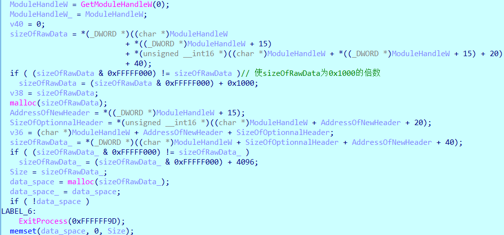

##### 压缩数据，形成一个整数（类似校验码）

对text段的数据生成校验码。

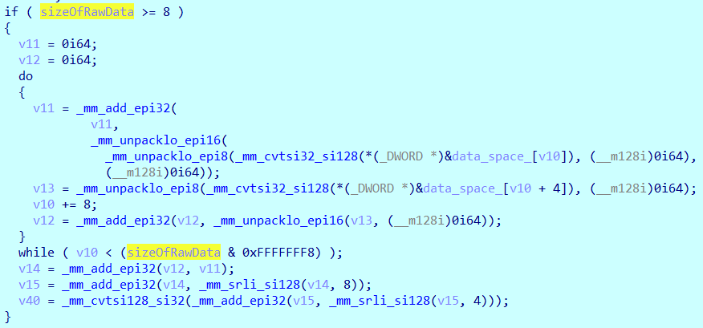

 ##### 循环比对

生成校验码后，线程进入死循环，不断重复生成校验码，并与之前的校验码进行比对。

如果不同，则意味着text段被修改了，可能是在程序中下了int3断点导致，就结束。

### 子进程

看着wp里的变量命名大概看懂了。

#### FindFunction

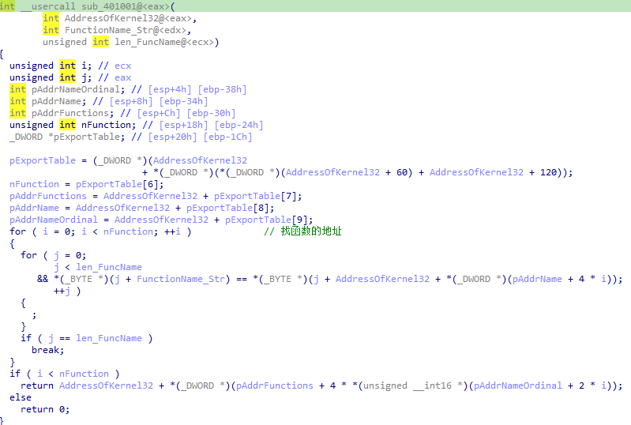

#### tea

类似的一个tea解密函数，直接解密可得：iu41m0pv3x7kllzu8pdq6mt9n2nwjdp6kat8ent4dhn5r158iz2f0cmr0u7yxyq}，与之前的明文结合一下就是flag了。

#### main

通过获取kernel32的地址，来获取所需函数的地址

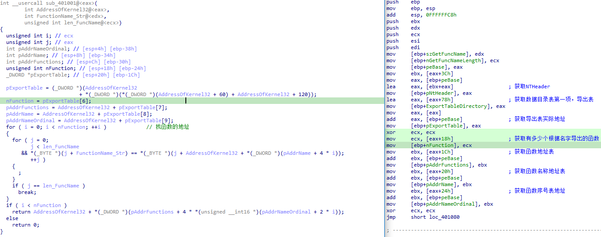

子进程通过文件映射对象获取`MyshareMemory`然后将其中的输入进去与tea函数解密比对，

最后，比对成功，将成功条件写入`MyshareMemory`中。


