## RightBack

### 反编译pyc

用pycdas看一下pyc字节码，主要是这里的字节码导致无法正确反编译：

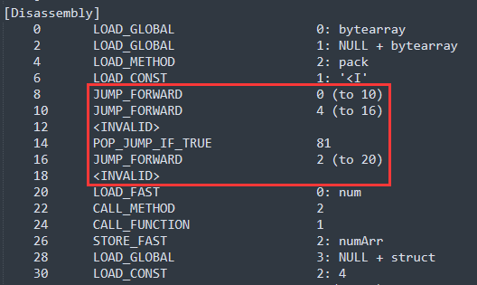

把所有这样的部分都patch掉（直接更改那部分代码的二进制数据）：

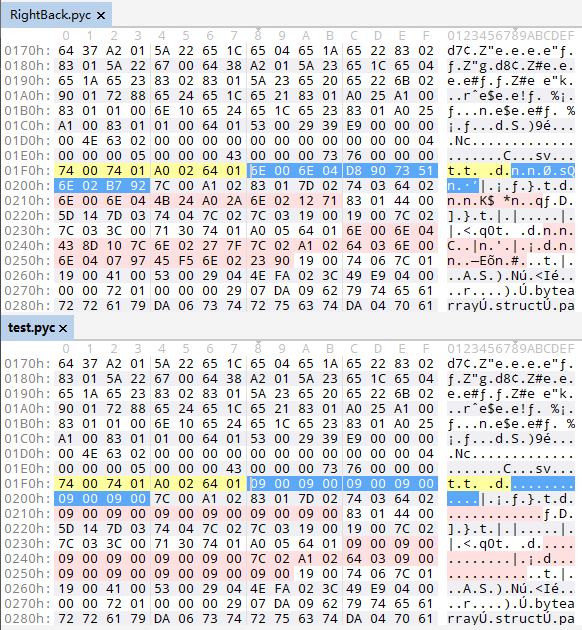

获取字节码的二进制数据：

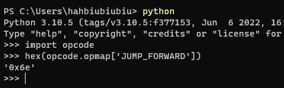

用pycdc获取反编译：

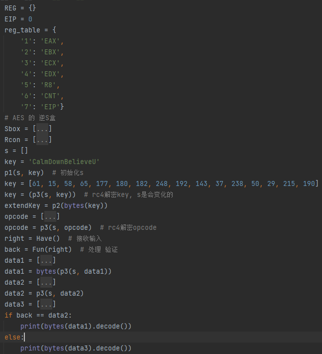

### 分析逻辑

1. p1：RC4密钥初始化；
2. p3：RC4解密；
3. p2：类似AES的密钥初始化；
4. Have：获取输入；
5. 执行虚拟机，验证。

执行以下获取opcode、extendKey。

模拟执行一下：

```python
def F1(part1, part2):
    global REG
    REG = {'EAX': part1, 'EBX': part2, 'ECX': 0, 'EDX': 0, 'R8': 0, 'CNT': 0, 'EIP': 0}


# 根据v1的值来更改v2（值由v3决定）
def F2(v1, v2, v3):
    print(opcode[REG['EIP']], end=' : ')
    if v1 == 1:
        print(f'{reg_table[str(v2)]} = extendKey[{reg_table[str(v3)]}]:{extendKey[REG[reg_table[str(v3)]]]}')
        REG[reg_table[str(v2)]] = extendKey[REG[reg_table[str(v3)]]]
    elif v1 == 2:
        print(f'{reg_table[str(v2)]} = {reg_table[str(v3)]}')
        REG[reg_table[str(v2)]] = REG[reg_table[str(v3)]]
    elif v1 == 3:
        print(f'{reg_table[str(v2)]} = {str(v3)}')
        REG[reg_table[str(v2)]] = v3
    REG['EIP'] += 4


# 根据v1的值使 v2 加上 由v3决定的值
def F3(v1, v2, v3):
    print(opcode[REG['EIP']], end=' : ')
    if v1 == 1:
        print(f'{reg_table[str(v2)]} += extendKey[{reg_table[str(v3)]}]:{extendKey[REG[reg_table[str(v3)]]]}')
        REG[reg_table[str(v2)]] = REG[reg_table[str(v2)]] + extendKey[REG[reg_table[str(v3)]]] & 0xFFFFFFFF
    elif v1 == 2:
        print(f'{reg_table[str(v2)]} += {reg_table[str(v3)]}')
        REG[reg_table[str(v2)]] = REG[reg_table[str(v2)]] + REG[reg_table[str(v3)]] & 0xFFFFFFFF
    elif v1 == 3:
        print(f'{reg_table[str(v2)]} += {str(v3)}')
        REG[reg_table[str(v2)]] = REG[reg_table[str(v2)]] + v3 & 0xFFFFFFFF
    REG['EIP'] += 4


def F4(v1, v2):
    print(opcode[REG['EIP']], end=' : ')
    print(f'{reg_table[str(v1)]} ^= {reg_table[str(v2)]}:{REG[reg_table[str(v2)]]}')
    REG[reg_table[str(v1)]] ^= REG[reg_table[str(v2)]]
    REG['EIP'] += 3


def F5(v1, v2):
    print(opcode[REG['EIP']], end=' : ')
    print(f'{reg_table[str(v1)]} &= {v2}')
    REG[reg_table[str(v1)]] &= v2
    REG['EIP'] += 3


# 根据v1的值使 v2 减去 由v3决定的值
def F6(v1, v2, v3):
    print(opcode[REG['EIP']], end=' : ')
    if v1 == 1:
        print(f'{reg_table[str(v2)]} -= extendKey[{reg_table[str(v3)]}]:{extendKey[REG[reg_table[str(v3)]]]}')
        REG[reg_table[str(v2)]] -= extendKey[v3]
    elif v1 == 2:
        print(f'{reg_table[str(v2)]} -= {reg_table[str(v3)]}')
        REG[reg_table[str(v2)]] -= REG[reg_table[str(v3)]]
    elif v1 == 3:
        print(f'{reg_table[str(v2)]} -= {str(v3)}')
        REG[reg_table[str(v2)]] -= v3
    REG['EIP'] += 4


def F7(v1, v2):
    print(opcode[REG['EIP']], end=' : ')
    print(f'{reg_table[str(v1)]} |= {reg_table[str(v2)]}')
    REG[reg_table[str(v1)]] |= REG[reg_table[str(v2)]]
    REG['EIP'] += 3


def F8(v1, v2):
    print(opcode[REG['EIP']], end=' : ')
    print(f'{reg_table[str(v1)]} >>= {reg_table[str(v2)]}')
    REG[reg_table[str(v1)]] = REG[reg_table[str(v1)]] >> REG[reg_table[str(v2)]] & 0xFFFFFFFF
    REG['EIP'] += 3


def F9(v1, v2):
    print(opcode[REG['EIP']], end=' : ')
    print(f'{reg_table[str(v1)]} <<= {reg_table[str(v2)]}')
    REG[reg_table[str(v1)]] = REG[reg_table[str(v1)]] << REG[reg_table[str(v2)]] & 0xFFFFFFFF
    REG['EIP'] += 3


def FA(v1, v2, v3):
    print(opcode[REG['EIP']], end=' : ')
    if v1 == 1:
        print(f'{reg_table[str(v2)]} *= extendKey[{reg_table[str(v3)]}]:{extendKey[REG[reg_table[str(v3)]]]}')
        REG[reg_table[str(v2)]] *= extendKey[v3]
    elif v1 == 2:
        print(f'{reg_table[str(v2)]} *= {reg_table[str(v3)]}')
        REG[reg_table[str(v2)]] *= REG[reg_table[str(v3)]]
    elif v1 == 3:
        print(f'{reg_table[str(v2)]} *= {str(v3)}')
        REG[reg_table[str(v2)]] *= v3
    REG['EIP'] += 4


def FB():
    print(opcode[REG['EIP']], end=' : ')
    print(REG['CNT'], 'test CNT')
    REG['R8'] = REG['CNT'] == 21
    REG['EIP'] += 1


def WC():
    print(opcode[REG['EIP']], end=' : ')
    if not REG['R8']:
        REG['EIP'] = 16
        print("R8:", REG['R8'])
        print('eip = 16')
    else:
        print("R8:", REG['R8'], 'go')
        REG['EIP'] += 1
        print()


opcode = [
    80, 3, 3, 0,
    29, 1, 1, 3,
    80, 3, 3, 1,
    29, 1, 2, 3,
    29, 3, 6, 1,
    113, 1, 2,
    80, 2, 3, 1,
    80, 2, 5, 2,
    114, 2, 31,
    41, 1, 2,
    80, 3, 4, 32,
    150, 2, 4, 2,
    116, 3, 4,
    87, 1, 3,
    80, 2, 2, 6,
    220, 3, 2, 2,
    80, 1, 3, 2,
    29, 2, 1, 3,
    80, 2, 2, 5,
    113, 2, 1,
    80, 2, 3, 2,
    80, 2, 4, 1,
    114, 4, 31,
    41, 2, 4,
    80, 3, 5, 32,
    150, 2, 5, 4,
    116, 3, 5,
    87, 2, 3,
    80, 2, 3, 6,
    220, 3, 3, 2,
    29, 3, 3, 1,
    80, 1, 4, 3,
    29, 2, 2, 4,
    7, 153, 255]
EIP = 0
extendKey = [1835819331, 1853321028, 1768711490, 1432712805, 2177920767, 4020699579, 2261476601, 3551400604, 711874531, 3318306392, 1124217505, 2427199549, 3099853672, 2098025776, 1041196945, 2929936300, 246748610, 1941455090, 1303848803, 3809763535, 1395557789, 546751855, 1830937100, 2385871555, 2516030638, 3043054017, 3628118989, 1450520846, 1825094265, 3651791800, 32069749, 1469868411, 919887482, 4017993154, 4002737591, 3104343244, 4134211933, 420914335, 4152510760, 1317719524, 1990496755, 1873950060, 2553314372, 3602559392]
reg_table = {
        '1': 'EAX',
        '2': 'EBX',
        '3': 'ECX',
        '4': 'EDX',
        '5': 'R8',
        '6': 'CNT',
        '7': 'EIP'}
REG = {}
while EIP < len(opcode):
    F1(0x31323334, 0x35363738)
    while 1:
        EIP = REG['EIP']
        if opcode[EIP] == 80:
            # 根据v1的值来更改v2（值由v3决定）
            F2(opcode[EIP + 1], opcode[EIP + 2], opcode[EIP + 3])
            continue
        if opcode[EIP] == 29:
            # 根据v1的值使 v2 加上 由v3决定的值
            F3(opcode[EIP + 1], opcode[EIP + 2], opcode[EIP + 3])
            continue
        if opcode[EIP] == 113:
            # 异或
            F4(opcode[EIP + 1], opcode[EIP + 2])
            continue
        if opcode[EIP] == 114:
            # 相与
            F5(opcode[EIP + 1], opcode[EIP + 2])
            continue
        if opcode[EIP] == 150:
            # 根据v1的值使 v2 减去 由v3决定的值
            F6(opcode[EIP + 1], opcode[EIP + 2], opcode[EIP + 3])
            continue
        if opcode[EIP] == 87:
            # 相或
            F7(opcode[EIP + 1], opcode[EIP + 2])
            continue
        if opcode[EIP] == 116:
            # 右移
            F8(opcode[EIP + 1], opcode[EIP + 2])
            continue
        if opcode[EIP] == 41:
            # 左移
            F9(opcode[EIP + 1], opcode[EIP + 2])
            continue
        if opcode[EIP] == 220:
            # 根据v1的值使 v2 乘上 由v3决定的值
            FA(opcode[EIP + 1], opcode[EIP + 2], opcode[EIP + 3])
            continue
        if opcode[EIP] == 7:
            # 检测CNt == 21，结果在R8
            FB()
            continue
        if opcode[EIP] == 153:
            # 根据R8 判断是要跳去地址16
            WC()
            continue
```

得到验证逻辑：

```
eax = input[0] + extendKey[0]
ebx = input[1] + extendKey[1]
while CNT != 21 
	CNT += 1
	r8 = ebx
	temp = eax ^ ebx
	# 交换temp前后位
	ebx = ebx & 31
	ebx = temp << ebx | temp >> (32 - ebx)
	eax += extendKey[CNT * 2]
	ebx = r8
	temp = eax ^ ebx
	edx = eax & 31
	ebx = temp << edx | temp >> (32 - edx)
	ebx += extendKey[CNT * 2 + 1]
```

### exp

```python
import struct
result = [4, 58, 242, 54, 86, 177, 154, 252, 247, 30, 33, 220, 219, 143, 142, 148, 77, 52, 231, 157, 156, 82, 12, 110, 251, 250, 213, 253, 50, 249, 120, 44, 187, 190, 57, 193, 217, 133, 117, 182, 40, 248, 204, 120, 164, 228, 133, 146, 14, 189, 114, 197, 175, 135, 145, 42, 139, 241, 239, 150, 22, 96, 209, 18]
extendKey = [1835819331, 1853321028, 1768711490, 1432712805, 2177920767, 4020699579, 2261476601, 3551400604, 711874531, 3318306392, 1124217505, 2427199549, 3099853672, 2098025776, 1041196945, 2929936300, 246748610, 1941455090, 1303848803, 3809763535, 1395557789, 546751855, 1830937100, 2385871555, 2516030638, 3043054017, 3628118989, 1450520846, 1825094265, 3651791800, 32069749, 1469868411, 919887482, 4017993154, 4002737591, 3104343244, 4134211933, 420914335, 4152510760, 1317719524, 1990496755, 1873950060, 2553314372, 3602559392]
flag = bytes()
for j in range(0, 64, 8):
    part1 = struct.unpack('>I', bytes(result[j + 0:j + 4]))[0]
    part2 = struct.unpack('>I', bytes(result[j + 4:j + 8]))[0]
    for i in range(21, 0, -1):
        part2 = (part2 - extendKey[i * 2 + 1]) & 0xFFFFFFFF
        num = part1 & 31
        temp = ((part2 >> num) & 0xFFFFFFFF) | ((part2 << (32 - num)) & 0xFFFFFFFF)
        part2 = temp ^ part1

        part1 = (part1 - extendKey[i * 2]) & 0xFFFFFFFF
        num = part2 & 31
        temp = ((part1 >> num) & 0xFFFFFFFF) | ((part1 << (32 - num)) & 0xFFFFFFFF)
        part1 = temp ^ part2
    part1 = (part1 - extendKey[0]) & 0xFFFFFFFF
    part2 = (part2 - extendKey[1]) & 0xFFFFFFFF
    if j != 0:
        part1 ^= struct.unpack('>I', bytes(result[j - 8:j - 4]))[0]
        part2 ^= struct.unpack('>I', bytes(result[j - 4:j]))[0]
    flag += struct.pack('>I', part1) + struct.pack('>I', part2)
print(flag)
# b'WMCTF{G00dEv3ning!Y0uAreAwes0m3!!RightBackFromB1ackM1rr0r!WOW!!}'
```

### 其他师傅的patch脚本

PZ师傅是将花指令删除，并且更改了代码段中跳转指令的参数，使其逻辑正确。

```python
import struct


def sliceCode(code):
    code_attribute = []
    for i in range(len(code)):
        # 检测到0x73开头的部分，即代码段部分
        if code[i] == 0x73:
            # 获取代码段长度
            size = int(struct.unpack("<I", bytes(code[i + 1:i + 5]))[0])
            try:
                num = 3 + i
                # 代码段一般以 53 00 结尾（即 RETURN_VALUE），此时检测是否倒数第二个位置为53
                if code[size + num] == 0x53:
                    # 添加代码段起始位置和长度
                    code_attribute.append({
                        'index': i + 5,
                        'len': size
                    })
            except:
                pass
    code_list = []
    for i in range(len(code_attribute)):
        # 添加代码段数据
        code_list.append(code[code_attribute[i]['index']: code_attribute[i]['index'] + code_attribute[i]['len']])
    return code_attribute, code_list


def repairJump(code):
    flower_target = [0x6E, 0x0]  # 花指令开头的两个字节
    relative_jump_list = [0x6E, 0x78, 0x5D]  # 相对跳转指令 字节码
    # JUMP_FORWARD 0x6e
    absolute_jump_list = [0x6F, 0x70, 0x71, 0x72, 0x73, 0x77]  # 绝对跳转指令 字节码
    # JUMP_IF_FALSE_OR_POP 0x6f
    # JUMP_IF_TRUE_OR_POP 0x70
    # JUMP_ABSOLUTE 0x71
    # POP_JUMP_IF_FALSE 0x72
    # POP_JUMP_IF_TRUE 0x73
    # RERAISE 0x77

    for i in range(len(code)):
        if code[i] in relative_jump_list:
            cnt = 0
            # 跳转位置
            jmp_range = code[i + 1] + i + 2
            if jmp_range > len(code):
                continue
            for j in range(i + 2, jmp_range):
                # 检测是否是无效的跳转指令
                if code[j] == flower_target[0] and code[j + 1] == flower_target[1] and j % 2 == 0:
                    cnt += 1
            # 由于本题的花指令为12个字节，因此需要消除后并减去12
            code[i + 1] -= cnt * 12
        elif code[i] in absolute_jump_list:
            cnt = 0
            # 跳转位置
            jmp_range = code[i + 1]
            if jmp_range > len(code):
                continue
            for j in range(jmp_range):
                # 检测是否是无效的跳转指令
                if code[j] == flower_target[0] and code[j + 1] == flower_target[1] and j % 2 == 0:
                    cnt += 1
            code[i + 1] -= cnt * 12

    return code


def removeFlower(code):
    org_code = b''
    flowerTarget = [0x6E, 0x0]
    flower_index = []
    # 检测无用跳转位置
    for i in range(len(code)):
        if code[i] == flowerTarget[0] and code[i + 1] == flowerTarget[1] and i % 2 == 0:
            flower_index.append(i)

    try:
        # 去掉花指令，并拼接正确指令
        org_code += bytes(code[:flower_index[0]])
        for i in range(1, len(flower_index)):
            org_code += bytes(code[flower_index[i - 1] + 12:flower_index[i]])
        else:
            org_code += bytes(code[flower_index[i] + 12:])
    except:
        org_code = bytes(code)

    return org_code


def main():
    filename = "obf_RightBack.pyc"
    f = list(open(filename, "rb").read())

    code_attribute, code_list = sliceCode(f)
    file = b''
    for i in range(len(code_attribute)):
        if len(code_list[i]) <= 0x100:
            code_list[i] = repairJump(code_list[i])
            code_list[i] = removeFlower(code_list[i])
        if i == 0:
            # 拼接更改后的代码段：前面的数据 + 更改后的代码段长度 + 更改后的代码段
            file += bytes(f[:code_attribute[i]['index'] - 4]) + struct.pack('<I', len(code_list[i])) + bytes(
                code_list[i])
        else:
            file += bytes(
                f[code_attribute[i - 1]['index'] + code_attribute[i - 1]['len']:code_attribute[i]['index'] - 4]
            ) + struct.pack('<I', len(code_list[i])) + bytes(code_list[i])
    else:
        file += bytes(f[code_attribute[i]['index'] + code_attribute[i]['len']:])

    filename = 'rev_' + filename
    with open(filename, 'wb') as f:
        f.write(file)
    print("OK!")


if __name__ == "__main__":
    main()
```

## ezAndroid

### apk逻辑

apk逻辑很简单，主要看两个so的函数：`check2、ChechUsername`

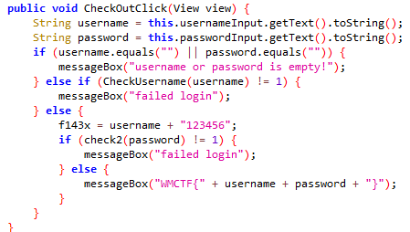

ida查看so没有看见这两个函数，wp说是JNI动态注册，可以使用frida将其hook。

### 反frida

#### 大致逻辑

在`.init_array`中有一个函数为反frida。

```python
a1 = [0xCF, 0xC3, 0xAD, 0xA8, 0x7A, 0x41, 0x6E, 0x9E, 0x61, 0x0F, 0x02, 0x03, 0x55, 0xB5, 0x2D, 0x26, 0x60, 0x7F, 0xA4,
      0xFC, 0xCF, 0xB7, 0x5F, 0x33, 0xFF, 0x65, 0x02, 0x17, 0xBF, 0x95, 0x47, 0x6D, 0xC4, 0xAE, 0x5E, 0xC8, 0x4D, 0x54,
      0xD4, 0x69, 0xD8, 0xEE, 0x70, 0x43, 0x8D, 0x0A, 0x61, 0x38, 0xCC, 0xF0, 0x2B, 0x0B, 0xEB, 0xC3, 0x3F, 0xB8, 0x3E,
      0x54, 0xDA, 0xEF, 0xB3, 0x4A, 0x1F, 0x00, 0x6B, 0x5D, 0xA0, 0xB5, 0xF1, 0xC3, 0xBA, 0xB0, 0x1F, 0x6D, 0xE4, 0x23,
      0x1E, 0xCC, 0x83, 0xFE, 0xA3, 0x86, 0xF0, 0xB0, 0xDA, 0x8A, 0xBF, 0xB1, 0x43, 0x2C, 0xF6, 0x50, 0x5F, 0xBB, 0x0C,
      0xA8, 0x69, 0x29, 0x3A, 0x08, 0xE4, 0x1B, 0xFE, 0x8B, 0x08, 0x2F, 0x86, 0x06, 0x5E, 0x1E, 0xFA, 0xC2, 0xDA, 0x93,
      0xE5, 0xDD, 0x45, 0x4E, 0x4A, 0x31, 0xB5, 0x5D, 0x94, 0x33, 0x38, 0x3F, 0x42, 0xFF, 0x27, 0x3D, 0x7F, 0x74, 0x3B,
      0xF4, 0x8A, 0x61, 0xF4, 0xBF, 0x8C, 0xD6, 0x6C, 0x81, 0x2D, 0xE2, 0x42, 0x09, 0xCD, 0xC6, 0xF2, 0x12, 0x49, 0x9D,
      0xEE, 0x00, 0xf4]
a2 = []
for i in range(16):
    a2.append(a1[22 + i % 0x14] ^ a1[22 + 20 + i])
print(bytearray(a2))
a3 = []
for i in range(2):
    a3.append((a1[83 + i % 0x1C] ^ a1[83 + 28 + i]))
print(bytearray(a3))
a4 = []
for i in range(6):
    a4.append((a1[0x83 + i % 0x12] ^ a1[0x83 + 18 + i]))
print(bytearray(a4))
# bytearray(b'/proc/self/maps\x00')
# bytearray(b'r\x00')
# bytearray(b'frida\x00')
```

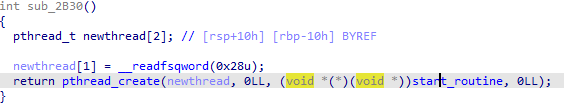

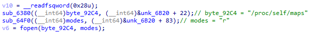

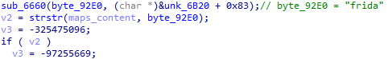

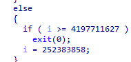

i与v3有关，因此当判断出maps含有frida则程序退出。

#### frida hook

frida hook掉pthread_create函数。

逻辑为：当第四个参数为0时，将第三个参数替换为自定义的函数。

```js
# frida -U -f com.wmctf.ezandroid -l .\frida.js
function hook_AntiFrida_func() {
    var pthread_create_addr = Module.findExportByName("libc.so", "pthread_create");
    Interceptor.attach(pthread_create_addr, {
        onEnter(args) {
            let func_addr = args[2];
            if (args[3] == 0) {
                Interceptor.replace(func_addr, new NativeCallback(function () {
                    console.log("[*] Replace antiFrida success!");
                }, 'void', []))
            }
        }
    });
}
```

### native函数

frida hook脚本：

```js
function hook_RegisterNatives() {
    var symbols = Process.getModuleByName('libart.so').enumerateSymbols();
    var RegisterNatives_addr = null;
    for (let i = 0; i < symbols.length; i++) {
        var symbol = symbols[i];
        if (symbol.name.indexOf("RegisterNatives") != -1 && symbol.name.indexOf("CheckJNI") == -1) {
            RegisterNatives_addr = symbol.address;
        }
    }
    console.log("RegisterNatives_addr: ", RegisterNatives_addr);
    Interceptor.attach(RegisterNatives_addr, {
        onEnter: function (args) {
            var env = Java.vm.tryGetEnv();
            var className = env.getClassName(args[1]);
            var methodCount = args[3].toInt32();
            for (let i = 0; i < methodCount; i++) {
                var methodName = args[2].add(Process.pointerSize * 3 * i).add(Process.pointerSize * 0).readPointer().readCString();
                var signature = args[2].add(Process.pointerSize * 3 * i).add(Process.pointerSize * 1).readPointer().readCString();
                var fnPtr =
                    args[2].add(Process.pointerSize * 3 * i).add(Process.pointerSize * 2).readPointer();
                var module = Process.findModuleByAddress(fnPtr);
                console.log(className, methodName, signature, fnPtr, module.name, fnPtr.sub(module.base));
            }

        }, onLeave: function (retval) {
        }
    })
}
```

得到结果：

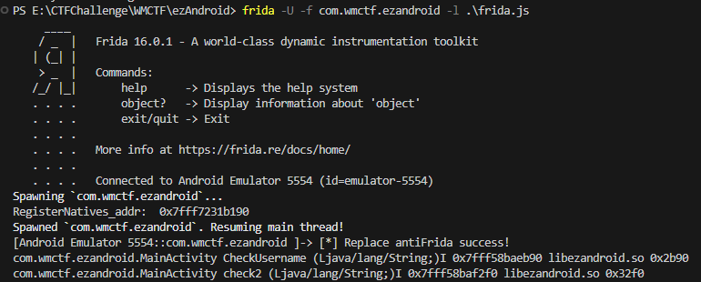

`CheckUsername: 0x2b90`

`check2: 0x32f0`

### SO函数

#### CheckUsername

被混淆了，主要逻辑在这里：

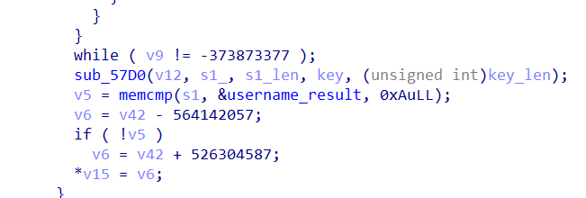

sub_57D0可以明显看出是RC4。

手动分析后，逻辑如下：

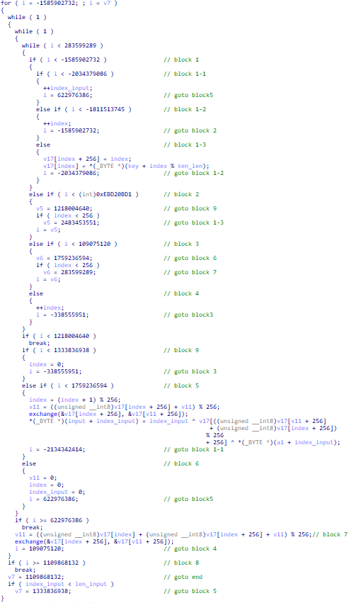

RC4初始化一：1-3 -> 1-2 -> 2 -> 1-3

RC4初始化二：7 -> 4 -> 3 -> 7

RC4解密：5 -> 1-1 -> 5

##### 还原代码

知道逻辑就可以了，但这里尝试手动patch还原一下代码。

主要有两类代码需要patch，先展示结果：


###### 第一种

将两段代码之间添加了一条jmp语句，使其去往分发器。

直接去掉jmp语句即可。


###### 第二种

这就是判断index是否大于256。

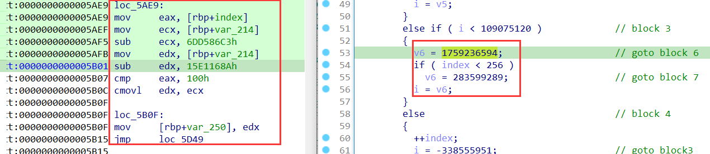

看看block7的地址，就在判断的下面：


因此直接将汇编：

```assembly
mov     eax, [rbp+index]
mov     ecx, [rbp+var_214]
sub     ecx, 6DD586C3h
mov     edx, [rbp+var_214]
sub     edx, 15E1168Ah
cmp     eax, 100h
cmovl   edx, ecx
loc_5B0F:
mov     [rbp+var_250], edx
jmp     loc_5D49
```

改成：

```assembly
mov     eax, [rbp+index]
cmp     eax, 100h
jge 	loc_5BC0
```

##### frida hook RC4函数的参数

脚本：

```js
function hook_sub_57D0() {
    var soAddr = Module.findBaseAddress("libezandroid.so");
    var sub_57D0 = soAddr.add(0x57D0);
    Interceptor.attach(sub_57D0, {
        onEnter: function (args) {
            console.log("[*] sub_57D0 called!");
            console.log("arg0: " + args[0].readCString());
            console.log("arg1: " + args[1].readCString());
            console.log("arg2: " + args[2]);
            console.log("arg3: " + args[3].readCString());
            console.log("arg4: " + args[4]);
        }, onLeave: function (retval) {
        }
    });
}
```

结果：

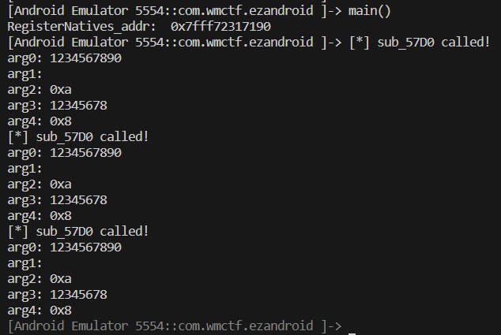

可见密钥是：`12345678`

注意到加密的时候还异或了index：

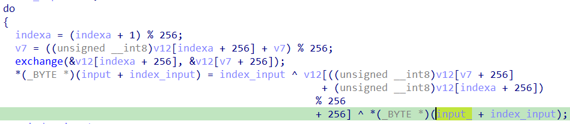

因此解密：

```python
from Crypto.Cipher import ARC4
def rc4_decrypt(key, ciphertext):
    cipher = ARC4.new(key.encode('utf-8'))
    plaintext = cipher.decrypt(ciphertext)
    return plaintext
key = "12345678"
ciphertext = bytearray([0xE9, 0x97, 0x64, 0xE6, 0x7E, 0xEB, 0xBD, 0xC1, 0xAB, 0x43])
plaintext = list(rc4_decrypt(key, ciphertext))
for i in range(len(plaintext)):
    plaintext[i] ^= i
print(bytearray(plaintext))
# Re_1s_eaSy
```

#### check2

同样是被混淆了，主题逻辑在这：

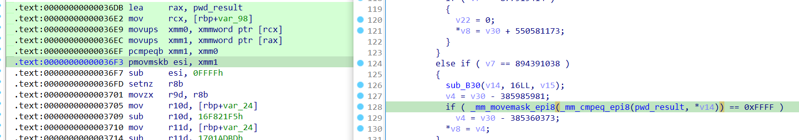

> 1. `movups xmm0, xmmword ptr [rcx]`: 将`rcx`寄存器指向的内存中的128位数据加载到`xmm0`寄存器中。
> 2. `movups xmm1, xmmword ptr [rax]`: 将`rax`寄存器指向的内存中的128位数据加载到`xmm1`寄存器中。
> 3. `pcmpeqb xmm1, xmm0`: 执行128位数据的比较操作，将比较结果保存在`xmm1`寄存器中。这里的`pcmpeqb`指令是用于比较两个XMM寄存器中的数据是否相等，结果是每个字节的比较结果（相等为0xFF，不等为0x00）。
> 4. `pmovmskb esi, xmm1`: 将`xmm1`寄存器中的比较结果按位转换成一个32位整数，并将结果保存在`esi`寄存器中。这个操作通常用于提取比较结果的掩码，其中每个位表示一个字节是否相等。

因此，也是一个加密，比对的过程。

##### 分析加密过程

由findcrypt找到AES特征，交叉引用看一下各个函数：

字节代换：

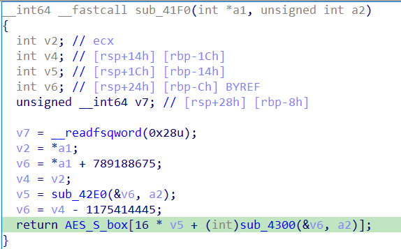

轮密钥生成的T函数：

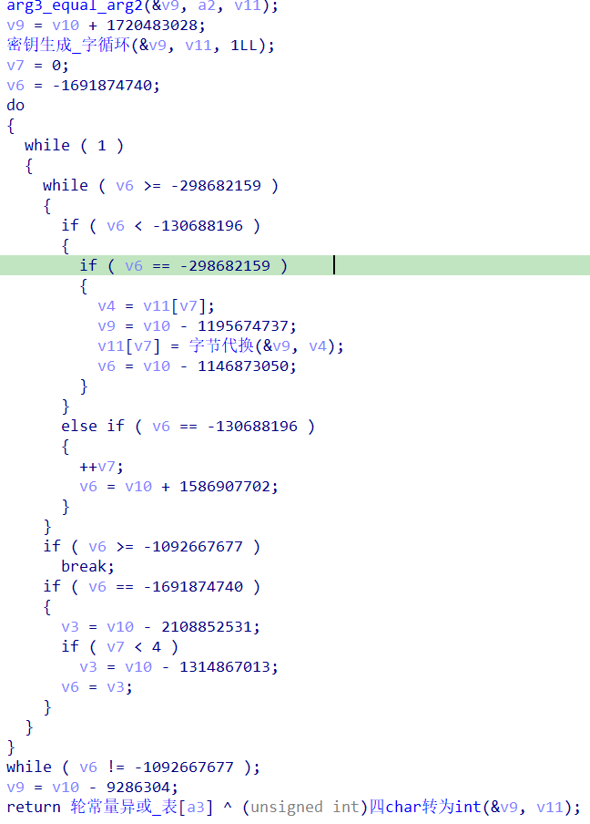

大概猜测其为AES。

注意到AES的Sbox盒在看交叉引用时有被赋值的操作，且`sub_2690`在`.init_array`中，表明SBOX表被更换了：


这里同样使用frida获取其参数：

```js
function hook_sub_B30() {
    var soAddr = Module.findBaseAddress("libezandroid.so");
    var sub_B30 = soAddr.add(0xB30);
    Interceptor.attach(sub_B30, {
        onEnter: function (args) {
            console.log("[*] sub_AFC called!");
            console.log("arg0: " + args[0].readCString());
            console.log("arg1: " + args[1]);
            console.log("arg2: " + args[2].readCString());
        }, onLeave:function (retval) {

        }
    })
}
```

结果：

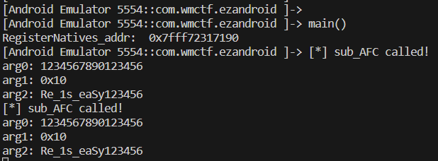

故解密：

```C
#include <stdio.h>
#include <string.h>
#include <time.h>
#include <windows.h>

#define Nb 4  // 数据块行数
#define Nk 4  // 密码块行数
#define Nr 10 // 轮加密次数

unsigned char RoundKey[4 * Nb * (Nr + 1)]; // 轮密钥
unsigned char Key[17];                     // 密钥
unsigned char state[4][4];                 // 明文加密状态

// 实际上只需要用Rocn[1-10] 
// 轮常量
int Rcon[255] = {
    0x8d, 0x01, 0x02, 0x04, 0x08, 0x10, 0x20, 0x40, 0x80, 0x1b, 0x36, 0x6c, 0xd8, 0xab, 0x4d, 0x9a,
    0x2f, 0x5e, 0xbc, 0x63, 0xc6, 0x97, 0x35, 0x6a, 0xd4, 0xb3, 0x7d, 0xfa, 0xef, 0xc5, 0x91, 0x39,
    0x72, 0xe4, 0xd3, 0xbd, 0x61, 0xc2, 0x9f, 0x25, 0x4a, 0x94, 0x33, 0x66, 0xcc, 0x83, 0x1d, 0x3a,
    0x74, 0xe8, 0xcb, 0x8d, 0x01, 0x02, 0x04, 0x08, 0x10, 0x20, 0x40, 0x80, 0x1b, 0x36, 0x6c, 0xd8,
    0xab, 0x4d, 0x9a, 0x2f, 0x5e, 0xbc, 0x63, 0xc6, 0x97, 0x35, 0x6a, 0xd4, 0xb3, 0x7d, 0xfa, 0xef,
    0xc5, 0x91, 0x39, 0x72, 0xe4, 0xd3, 0xbd, 0x61, 0xc2, 0x9f, 0x25, 0x4a, 0x94, 0x33, 0x66, 0xcc,
    0x83, 0x1d, 0x3a, 0x74, 0xe8, 0xcb, 0x8d, 0x01, 0x02, 0x04, 0x08, 0x10, 0x20, 0x40, 0x80, 0x1b,
    0x36, 0x6c, 0xd8, 0xab, 0x4d, 0x9a, 0x2f, 0x5e, 0xbc, 0x63, 0xc6, 0x97, 0x35, 0x6a, 0xd4, 0xb3,
    0x7d, 0xfa, 0xef, 0xc5, 0x91, 0x39, 0x72, 0xe4, 0xd3, 0xbd, 0x61, 0xc2, 0x9f, 0x25, 0x4a, 0x94,
    0x33, 0x66, 0xcc, 0x83, 0x1d, 0x3a, 0x74, 0xe8, 0xcb, 0x8d, 0x01, 0x02, 0x04, 0x08, 0x10, 0x20,
    0x40, 0x80, 0x1b, 0x36, 0x6c, 0xd8, 0xab, 0x4d, 0x9a, 0x2f, 0x5e, 0xbc, 0x63, 0xc6, 0x97, 0x35,
    0x6a, 0xd4, 0xb3, 0x7d, 0xfa, 0xef, 0xc5, 0x91, 0x39, 0x72, 0xe4, 0xd3, 0xbd, 0x61, 0xc2, 0x9f,
    0x25, 0x4a, 0x94, 0x33, 0x66, 0xcc, 0x83, 0x1d, 0x3a, 0x74, 0xe8, 0xcb, 0x8d, 0x01, 0x02, 0x04,
    0x08, 0x10, 0x20, 0x40, 0x80, 0x1b, 0x36, 0x6c, 0xd8, 0xab, 0x4d, 0x9a, 0x2f, 0x5e, 0xbc, 0x63,
    0xc6, 0x97, 0x35, 0x6a, 0xd4, 0xb3, 0x7d, 0xfa, 0xef, 0xc5, 0x91, 0x39, 0x72, 0xe4, 0xd3, 0xbd,
    0x61, 0xc2, 0x9f, 0x25, 0x4a, 0x94, 0x33, 0x66, 0xcc, 0x83, 0x1d, 0x3a, 0x74, 0xe8, 0xcb};

// s盒
int SBOX[256] = {
    // 0     1    2      3     4    5     6     7      8    9     A      B    C     D     E     F
    0x29, 0x40, 0x57, 0x6E, 0x85, 0x9C, 0xB3, 0xCA, 0xE1, 0xF8, 0x0F, 0x26, 0x3D, 0x54, 0x6B, 0x82,
    0x99, 0xB0, 0xC7, 0xDE, 0xF5, 0x0C, 0x23, 0x3A, 0x51, 0x68, 0x7F, 0x96, 0xAD, 0xC4, 0xDB, 0xF2,
    0x09, 0x20, 0x37, 0x4E, 0x65, 0x7C, 0x93, 0xAA, 0xC1, 0xD8, 0xEF, 0x06, 0x1D, 0x34, 0x4B, 0x62,
    0x79, 0x90, 0xA7, 0xBE, 0xD5, 0xEC, 0x03, 0x1A, 0x31, 0x48, 0x5F, 0x76, 0x8D, 0xA4, 0xBB, 0xD2,
    0xE9, 0x00, 0x17, 0x2E, 0x45, 0x5C, 0x73, 0x8A, 0xA1, 0xB8, 0xCF, 0xE6, 0xFD, 0x14, 0x2B, 0x42,
    0x59, 0x70, 0x87, 0x9E, 0xB5, 0xCC, 0xE3, 0xFA, 0x11, 0x28, 0x3F, 0x56, 0x6D, 0x84, 0x9B, 0xB2,
    0xC9, 0xE0, 0xF7, 0x0E, 0x25, 0x3C, 0x53, 0x6A, 0x81, 0x98, 0xAF, 0xC6, 0xDD, 0xF4, 0x0B, 0x22,
    0x39, 0x50, 0x67, 0x7E, 0x95, 0xAC, 0xC3, 0xDA, 0xF1, 0x08, 0x1F, 0x36, 0x4D, 0x64, 0x7B, 0x92,
    0xA9, 0xC0, 0xD7, 0xEE, 0x05, 0x1C, 0x33, 0x4A, 0x61, 0x78, 0x8F, 0xA6, 0xBD, 0xD4, 0xEB, 0x02,
    0x19, 0x30, 0x47, 0x5E, 0x75, 0x8C, 0xA3, 0xBA, 0xD1, 0xE8, 0xFF, 0x16, 0x2D, 0x44, 0x5B, 0x72,
    0x89, 0xA0, 0xB7, 0xCE, 0xE5, 0xFC, 0x13, 0x2A, 0x41, 0x58, 0x6F, 0x86, 0x9D, 0xB4, 0xCB, 0xE2,
    0xF9, 0x10, 0x27, 0x3E, 0x55, 0x6C, 0x83, 0x9A, 0xB1, 0xC8, 0xDF, 0xF6, 0x0D, 0x24, 0x3B, 0x52,
    0x69, 0x80, 0x97, 0xAE, 0xC5, 0xDC, 0xF3, 0x0A, 0x21, 0x38, 0x4F, 0x66, 0x7D, 0x94, 0xAB, 0xC2,
    0xD9, 0xF0, 0x07, 0x1E, 0x35, 0x4C, 0x63, 0x7A, 0x91, 0xA8, 0xBF, 0xD6, 0xED, 0x04, 0x1B, 0x32,
    0x49, 0x60, 0x77, 0x8E, 0xA5, 0xBC, 0xD3, 0xEA, 0x01, 0x18, 0x2F, 0x46, 0x5D, 0x74, 0x8B, 0xA2,
    0xB9, 0xD0, 0xE7, 0xFE, 0x15, 0x2C, 0x43, 0x5A, 0x71, 0x88, 0x9F, 0xB6, 0xCD, 0xE4, 0xFB, 0x12

};

// 逆s盒
int R_SBOX[256] = {
    0x41, 0xe8, 0x8f, 0x36, 0xdd, 0x84, 0x2b, 0xd2, 0x79, 0x20, 0xc7, 0x6e, 0x15, 0xbc, 0x63, 0xa, 0xb1, 0x58, 0xff, 0xa6, 0x4d, 0xf4, 0x9b, 0x42, 0xe9, 0x90, 0x37, 0xde, 0x85, 0x2c, 0xd3, 0x7a, 0x21, 0xc8, 0x6f, 0x16, 0xbd, 0x64, 0xb, 0xb2, 0x59, 0x0, 0xa7, 0x4e, 0xf5, 0x9c, 0x43, 0xea, 0x91, 0x38, 0xdf, 0x86, 0x2d, 0xd4, 0x7b, 0x22, 0xc9, 0x70, 0x17, 0xbe, 0x65, 0xc, 0xb3, 0x5a, 0x1, 0xa8, 0x4f, 0xf6, 0x9d, 0x44, 0xeb, 0x92, 0x39, 0xe0, 0x87, 0x2e, 0xd5, 0x7c, 0x23, 0xca, 0x71, 0x18, 0xbf, 0x66, 0xd, 0xb4, 0x5b, 0x2, 0xa9, 0x50, 0xf7, 0x9e, 0x45, 0xec, 0x93, 0x3a, 0xe1, 0x88, 0x2f, 0xd6, 0x7d, 0x24, 0xcb, 0x72, 0x19, 0xc0, 0x67, 0xe, 0xb5, 0x5c, 0x3, 0xaa, 0x51, 0xf8, 0x9f, 0x46, 0xed, 0x94, 0x3b, 0xe2, 0x89, 0x30, 0xd7, 0x7e, 0x25, 0xcc, 0x73, 0x1a, 0xc1, 0x68, 0xf, 0xb6, 0x5d, 0x4, 0xab, 0x52, 0xf9, 0xa0, 0x47, 0xee, 0x95, 0x3c, 0xe3, 0x8a, 0x31, 0xd8, 0x7f, 0x26, 0xcd, 0x74, 0x1b, 0xc2, 0x69, 0x10, 0xb7, 0x5e, 0x5, 0xac, 0x53, 0xfa, 0xa1, 0x48, 0xef, 0x96, 0x3d, 0xe4, 0x8b, 0x32, 0xd9, 0x80, 0x27, 0xce, 0x75, 0x1c, 0xc3, 0x6a, 0x11, 0xb8, 0x5f, 0x6, 0xad, 0x54, 0xfb, 0xa2, 0x49, 0xf0, 0x97, 0x3e, 0xe5, 0x8c, 0x33, 0xda, 0x81, 0x28, 0xcf, 0x76, 0x1d, 0xc4, 0x6b, 0x12, 0xb9, 0x60, 0x7, 0xae, 0x55, 0xfc, 0xa3, 0x4a, 0xf1, 0x98, 0x3f, 0xe6, 0x8d, 0x34, 0xdb, 0x82, 0x29, 0xd0, 0x77, 0x1e, 0xc5, 0x6c, 0x13, 0xba, 0x61, 0x8, 0xaf, 0x56, 0xfd, 0xa4, 0x4b, 0xf2, 0x99, 0x40, 0xe7, 0x8e, 0x35, 0xdc, 0x83, 0x2a, 0xd1, 0x78, 0x1f, 0xc6, 0x6d, 0x14, 0xbb, 0x62, 0x9, 0xb0, 0x57, 0xfe, 0xa5, 0x4c, 0xf3, 0x9a};

// 在一行上进位移
void rotWord(unsigned char temp[])
{
    int i, k = temp[0];
    for (i = 1; i < 4; i++)
        temp[i - 1] = temp[i];
    temp[3] = k;
}

// 在一行上进行s盒替换
void subWord(unsigned char temp[])
{
    int i;
    for (i = 0; i < 4; i++)
        temp[i] = SBOX[temp[i]];
}

// 密钥扩展，最终得到Nr+1个轮密钥，用于轮次加密
void keyExpansion()
{
    int i, j;
    unsigned char temp[5];
    memset(RoundKey, 0, sizeof(RoundKey));

    for (i = 0; i < Nk; i++)
    {
        for (j = 0; j < 4; j++)
        {
            RoundKey[i * 4 + j] = Key[i * 4 + j];
        }
    }

    while (i < (Nb * (Nr + 1)))
    {
        for (j = 0; j < 4; j++)
        {
            temp[j] = RoundKey[(i - 1) * 4 + j];
        }
        if (i % Nk == 0)
        {
            rotWord(temp);
            subWord(temp);
            temp[0] ^= Rcon[i / Nk];
        }

        for (j = 0; j < 4; j++)
            RoundKey[i * 4 + j] = RoundKey[(i - Nk) * 4 + j] ^ temp[j];
        i++;
    }
}

// 轮密钥加函数，将明文加密状态与轮密钥简单异或
void addRoundKey(int round)
{
    int i, j;
    for (i = 0; i < 4; i++)
    {
        for (j = 0; j < 4; j++)
        {
            state[i][j] ^= RoundKey[round * Nb * 4 + i * Nb + j];
        }
    }
}

// s盒替换函数
void subBytes()
{
    int i, j;
    for (i = 0; i < 4; i++)
    {
        for (j = 0; j < 4; j++)
        {
            state[i][j] = SBOX[state[i][j]];
        }
    }
}

// 逆s盒替换函数
void invSubBytes()
{
    int i, j;
    for (i = 0; i < 4; i++)
    {
        for (j = 0; j < 4; j++)
        {
            state[i][j] = R_SBOX[state[i][j]];
        }
    }
}

// 行位移函数
void shiftRows()
{
    int i, j, k;
    int shiftnum = 1;
    unsigned char tmp;
    for (j = 1; j < 4; j++)
    {
        for (i = 0; i < shiftnum; i++)
        {
            tmp = state[0][j];
            for (k = 0; k < 3; k++)
                state[k][j] = state[k + 1][j];
            state[3][j] = tmp;
        }
        shiftnum++;
    }
}

// 逆行位移函数
void invShiftRows()
{
    int i, j, k;
    int shiftnum = 1;
    unsigned char tmp;
    for (j = 1; j < 4; j++)
    {
        for (i = 0; i < shiftnum; i++)
        {
            tmp = state[3][j];
            for (k = 3; k > 0; k--)
                state[k][j] = state[k - 1][j];
            state[0][j] = tmp;
        }
        shiftnum++;
    }
}

// 列混淆函数
#define xtime(x) ((x << 1) ^ (((x >> 7) & 1) * 0x1b))
void mixColumns()
{
    int i, j;
    unsigned char tmp, t, p;
    for (i = 0; i < 4; i++)
    {
        p = state[i][0];
        tmp = state[i][0] ^ state[i][1] ^ state[i][2] ^ state[i][3];
        for (j = 0; j < 3; j++)
        {
            t = state[i][j] ^ state[i][j + 1];
            t = xtime(t);
            state[i][j] ^= t ^ tmp;
        }
        t = state[i][3] ^ p;
        t = xtime(t);
        state[i][3] ^= t ^ tmp;
    }
}

// 逆列混淆函数
#define Multiply(x, y) (((y & 1) * x) ^ ((y >> 1 & 1) * xtime(x)) ^ ((y >> 2 & 1) * xtime(xtime(x))) ^ ((y >> 3 & 1) * xtime(xtime(xtime(x)))) ^ ((y >> 4 & 1) * xtime(xtime(xtime(xtime(x))))))
void invMixColumns()
{
    int i;
    unsigned char a, b, c, d;
    for (i = 0; i < 4; i++)
    {
        a = state[i][0];
        b = state[i][1];
        c = state[i][2];
        d = state[i][3];

        state[i][0] = Multiply(a, 0x0e) ^ Multiply(b, 0x0b) ^ Multiply(c, 0x0d) ^ Multiply(d, 0x09);
        state[i][1] = Multiply(a, 0x09) ^ Multiply(b, 0x0e) ^ Multiply(c, 0x0b) ^ Multiply(d, 0x0d);
        state[i][2] = Multiply(a, 0x0d) ^ Multiply(b, 0x09) ^ Multiply(c, 0x0e) ^ Multiply(d, 0x0b);
        state[i][3] = Multiply(a, 0x0b) ^ Multiply(b, 0x0d) ^ Multiply(c, 0x09) ^ Multiply(d, 0x0e);
    }
}

// aes加密函数，key为密钥，input为需要加密的128位明文，output为输出128位密文
void aes_enc(unsigned char *key, unsigned char *input, unsigned char *output)
{
    int i, j, round = 0;
    memset(Key, 0, sizeof(Key));
    for (i = 0; i < Nk * 4; i++)
    {
        Key[i] = key[i];
    }

    keyExpansion();

    memset(state, 0, sizeof(state));
    for (i = 0; i < 4; i++)
    {
        for (j = 0; j < 4; j++)
            state[i][j] = input[i * 4 + j];
    }
    addRoundKey(0);
    for (round = 1; round < Nr; round++)
    {
        subBytes();
        shiftRows();
        mixColumns();
        addRoundKey(round);
    }

    subBytes();
    shiftRows();
    addRoundKey(Nr);

    for (i = 0; i < 4; i++)
    {
        for (j = 0; j < 4; j++)
            output[i * 4 + j] = state[i][j];
    }
}

// aes解密函数，key为密钥，input为需要解密的128位密文，output为输出128位明文
void aes_dec(unsigned char *key, unsigned char *input, unsigned char *output)
{
    int i, j, round = 0;
    memset(Key, 0, sizeof(Key));
    for (i = 0; i < Nk * 4; i++)
    {
        Key[i] = key[i];
    }

    keyExpansion();

    memset(state, 0, sizeof(state));
    for (i = 0; i < 4; i++)
    {
        for (j = 0; j < 4; j++)
            state[i][j] = input[i * 4 + j];
    }
    addRoundKey(Nr);
    for (round = Nr - 1; round > 0; round--)
    {
        invSubBytes();
        invShiftRows();
        addRoundKey(round);
        invMixColumns();
    }

    invSubBytes();
    invShiftRows();
    addRoundKey(0);

    for (i = 0; i < 4; i++)
    {
        for (j = 0; j < 4; j++)
            output[i * 4 + j] = state[i][j];
    }
}

void gets_t(unsigned char *str)
{
    char fin_input;
    scanf("%66s", str);
    do
        fin_input = getchar();
    while (fin_input != '\n');
}

int main()
{   
    // Re_1s_eaSy123456
    unsigned char key[17] = {82, 101, 95, 49, 115, 95, 101, 97, 83, 121, 49, 50, 51, 52, 53, 54};
    unsigned char input[17] = "1111222233334444";
    unsigned char enc[17] = {
        43,
        200,
        32,
        139,
        92,
        13,
        167,
        155,
        42,
        81,
        58,
        210,
        113,
        113,
        202,
        80,
    };
    unsigned char dec[17] = {0};
    printf("dec-----\n");
    aes_dec(key, enc, dec);
    for (int i = 0; i < 16; i++)
    {
        printf("%c", dec[i]);
    }
    return 0;
}
```

## BabyAnti-2.0

[2023 WMCTF writeup by W4ntY0u (qq.com)](https://mp.weixin.qq.com/s/hpLSfXtc1pYPtvz3734iLA)

[WMCTF 2023 wp - LaoGong - 飞书云文档 (feishu.cn)](https://pmxq1w80w6.feishu.cn/docx/RxBpdtPkHopGnLxXVNQcUrl5nhd)

[WMCTF2023-REVERSE_Blu3e的博客-CSDN博客](https://blog.csdn.net/m0_68757308/article/details/132794842)

### patch libanticheat.so

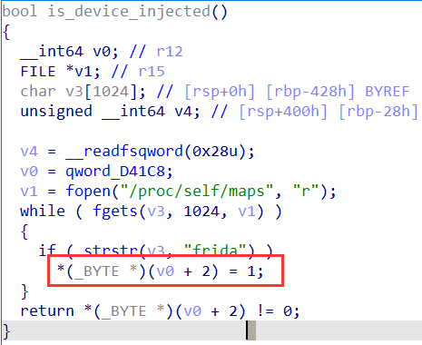

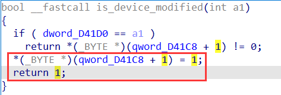

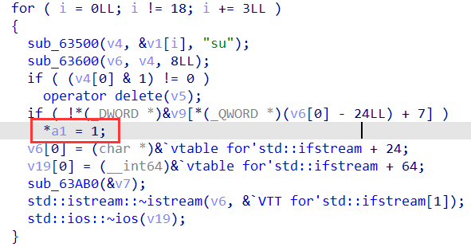

### 方法一 —— patch libapp.so

直接搜索5000（0x1388），将两个cmp改为个位数：

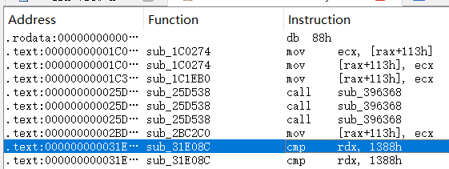

随便玩玩就有flag。

### 方法二 —— patch smali代码后用CE

由于apk中也有检测是否更改的分的方法，也需要更改：

> `const/4 p1, 0`：这行代码将值 0 存储到参数寄存器 p1 中

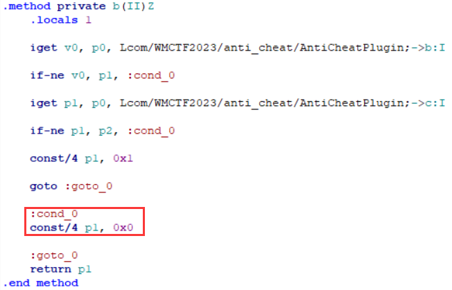

然后CE（进程为Ld9BoxHeadless.exe）搜索，得分改为5000。

