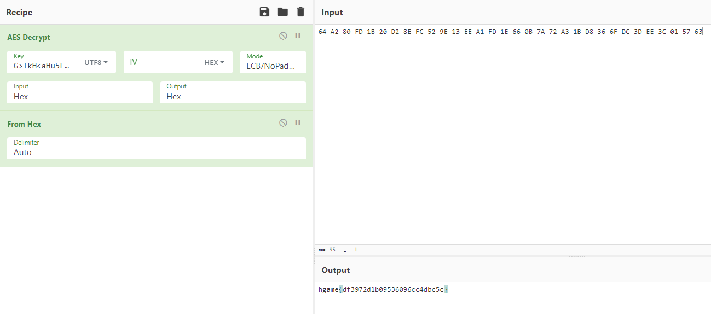
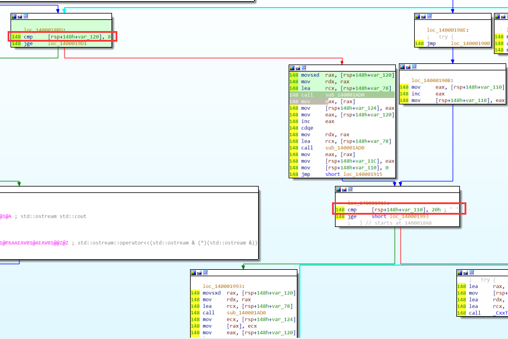

## week2

### arithmetic

```Python
number = []
with open('out', 'r') as f:
    for line in f.readlines():
        new = [int(x) for x in line.replace('\n', '').split(' ') if x != '']
        number.append(new)

def max_sum_triangle(data):
    n = len(data)
    # 使用二维列表来保存每个位置的最大和
    max_sums = [[0] * (i + 1) for i in range(n)]
    # 使用二维列表来保存每个位置的选择（1或2）
    choices = [[0] * (i + 1) for i in range(n)]
    # 填充最后一行的最大和和选择
    max_sums[-1] = data[-1]
    choices[-1] = [1] * (n - 1)
    # 从倒数第二行开始向上填充
    for i in range(n - 2, -1, -1):
        for j in range(i + 1):
            # 选择下一行的相邻两个数的较大值，与当前位置相加
            if max_sums[i+1][j] > max_sums[i+1][j+1]:
                choices[i][j] = 1
                max_sums[i][j] = data[i][j] + max_sums[i+1][j]
            else:
                choices[i][j] = 2
                max_sums[i][j] = data[i][j] + max_sums[i+1][j+1]
    return max_sums, choices

def path(choices):
    col = 0
    result = []
    for row in range(len(choices) - 1):
        result.append(choices[row][col])
        col += choices[row][col] - 1
    return result

max_sums, choices = max_sum_triangle(number)
print("最大和:", max_sums[0][0])
result = path(choices)
print("路径:", "".join(str(x) for x in result))
result = "".join(str(x) for x in result)
import hashlib
md5_result = hashlib.md5(result.encode()).hexdigest() 
print(f"hgame{{{md5_result}}}")
```

### babyAndroid

获取username

```js
Java.perform(function () {
    var Check1 = Java.use('com.feifei.babyandroid.Check1');

    Check1.encrypt.implementation = function (byteArray) {
        console.log('Input: ' + byteArray);
        // byteArray = [-75, 80, 80, 48, -88, 75, 103, 45, -91, 89, -60, 91, -54, 5, 6, -72];
        var result = this.encrypt(byteArray);
        console.log('Output: ' + result);
        // G>IkH<aHu5FE3GSV
        return result;
    };
});
```

获取check2

```js
function hook_RegisterNatives() {
    var symbols = Process.getModuleByName('libart.so').enumerateSymbols();
    var RegisterNatives_addr = null;
    for (let i = 0; i < symbols.length; i++) {
        var symbol = symbols[i];
        if (symbol.name.indexOf("RegisterNatives") != -1 && symbol.name.indexOf("CheckJNI") == -1) {
            RegisterNatives_addr = symbol.address;
        }
    }
    console.log("RegisterNatives_addr: ", RegisterNatives_addr);
    Interceptor.attach(RegisterNatives_addr, {
        onEnter: function (args) {
            var env = Java.vm.tryGetEnv();
            var className = env.getClassName(args[1]);
            var methodCount = args[3].toInt32();
            for (let i = 0; i < methodCount; i++) {
                var methodName = args[2].add(Process.pointerSize * 3 * i).add(Process.pointerSize * 0).readPointer().readCString();
                var signature = args[2].add(Process.pointerSize * 3 * i).add(Process.pointerSize * 1).readPointer().readCString();
                var fnPtr =
                    args[2].add(Process.pointerSize * 3 * i).add(Process.pointerSize * 2).readPointer();
                var module = Process.findModuleByAddress(fnPtr);
                console.log(className, methodName, signature, fnPtr, module.name, fnPtr.sub(module.base));
            }

        }, onLeave: function (retval) {
        }
    })
}
// [Android Emulator 5554::com.feifei.babyandroid ]-> RegisterNatives_addr:  0x7fff72318190
// com.feifei.babyandroid.MainActivity check2 ([B[B)Z 0x7fff580eabf0 libbabyandroid.so 0xbf0
```

check2用findcrypt猜测AES，密钥为username



### babyre

```python
key = [116, 120, 102, 101, 105, 119]
flag = [0] * 32
result = [0x00002F14, 0x0000004E, 0x00004FF3, 0x0000006D, 0x000032D8, 0x0000006D, 0x00006B4B, 0xFFFFFF92, 0x0000264F, 0x0000005B, 0x000052FB, 0xFFFFFF9C, 0x00002B71, 0x00000014, 0x00002A6F, 0xFFFFFF95, 0x000028FA, 0x0000001D, 0x00002989, 0xFFFFFF9B, 0x000028B4, 0x0000004E, 0x00004506, 0xFFFFFFDA, 0x0000177B, 0xFFFFFFFC, 0x000040CE, 0x0000007D, 0x000029E3, 0x0000000F, 0x00001F11, 0x000000FF]
for i in range(len(result)):
    if result[i] & 0x80000000:
        result[i] = result[i] - 0x100000000


for i in range(31, -1, -1):
    match i % 4:
        case 0:
            op_num = flag[i + 1] * key[i % 6]
            flag[i] = result[i] - op_num
        case 1:
            op_num = flag[i + 1] ^ key[i % 6]
            flag[i] = result[i] + op_num
        case 2:
            op_num = flag[i + 1] + key[i % 6]
            flag[i] = result[i] // op_num
        case 3:
            if i == 31:
                op_num = 250 - key[i % 6]
            else:
                op_num = flag[i + 1] - key[i % 6]
            flag[i] = result[i] ^ op_num
print(bytes(flag))
```

### ezcpp

```python
import struct
result = [0x88, 0x6A, 0xB0, 0xC9, 0xAD, 0xF1, 0x33, 0x33, 0x94, 0x74, 0xB5, 0x69, 0x73, 0x5F, 0x30, 0x62, 0x4A, 0x33, 0x63, 0x54, 0x5F, 0x30, 0x72, 0x31, 0x65, 0x6E, 0x54, 0x65, 0x44, 0x3F, 0x21, 0x7D]

def decrypt1(data):
    key = [1234, 2341, 3412, 4123]
    c1 = data[0]
    c2 = data[1]
    num = (-0x21524111 * 32) & 0xFFFFFFFF
    for _ in range(32):
        c2 -= (c1 + num) ^ ((c1 << 4) + key[2]) ^ ((c1 << 5) + key[3])
        c2 &= 0xFFFFFFFF
        c1 -= (c2 + num) ^ ((c2 << 4) + key[0]) ^ ((c2 << 5) + key[1])
        c1 &= 0xFFFFFFFF
        num += 0x21524111
        num &= 0xFFFFFFFF
    return [c1, c2]

def decrypt2(data):
    key = [2341, 1234, 4123, 3412]
    c1 = data[0]
    c2 = data[1]
    num = (0xDEADBEEF * 32) & 0xFFFFFFFF
    for _ in range(32):
        c2 -= (c1 + num) ^ ((c1 << 5) + key[2]) ^ ((c1 << 4) + key[3])
        c2 &= 0xFFFFFFFF
        c1 -= (c2 + num) ^ ((c2 << 5) + key[0]) ^ ((c2 << 4) + key[1])
        c1 &= 0xFFFFFFFF
        num -= 0xDEADBEEF
        num &= 0xFFFFFFFF
    return [c1, c2]

if __name__ == "__main__":
    c1 = struct.unpack('<I', bytes(result[3:7]))[0]
    c2 = struct.unpack('<I', bytes(result[7:11]))[0]
    data = decrypt2([c1, c2])
    p1 = struct.pack('<I', data[0])
    p2 = struct.pack('<I', data[1])
    result[3:7] = [p1[0], p1[1], p1[2], p1[3]]
    result[7:11] = [p2[0], p2[1], p2[2], p2[3]]
    c1 = struct.unpack('<I', bytes(result[2:6]))[0]
    c2 = struct.unpack('<I', bytes(result[6:10]))[0]
    data = decrypt2([c1, c2])
    p1 = struct.pack('<I', data[0])
    p2 = struct.pack('<I', data[1])
    result[2:6] = [p1[0], p1[1], p1[2], p1[3]]
    result[6:10] = [p2[0], p2[1], p2[2], p2[3]]
    c1 = struct.unpack('<I', bytes(result[1:5]))[0]
    c2 = struct.unpack('<I', bytes(result[5:9]))[0]
    data = decrypt2([c1, c2])
    p1 = struct.pack('<I', data[0])
    p2 = struct.pack('<I', data[1])
    result[1:5] = [p1[0], p1[1], p1[2], p1[3]]
    result[5:9] = [p2[0], p2[1], p2[2], p2[3]]
    c1 = struct.unpack('<I', bytes(result[0:4]))[0]
    c2 = struct.unpack('<I', bytes(result[4:8]))[0]
    data = decrypt1([c1, c2])
    p1 = struct.pack('<I', data[0])
    p2 = struct.pack('<I', data[1])
    result[0:4] = [p1[0], p1[1], p1[2], p1[3]]
    result[4:8] = [p2[0], p2[1], p2[2], p2[3]]
    print(''.join(map(chr, result)))
```

## week3

### mystery

```python
from ctypes import c_int8
# key = [24, 37, 41, 32, 25, 39, 185, 201, 52, 199, 113, 201, 172, 23, 180, 30, 229, 233, 252, 42, 74, 1, 234, 121, 199, 130, 254]
key = [24, 37, 41, 32, 25, 39, 185, 201, 52, 199, 113, 201, 172, 23, 180, 30, 229, 233, 252, 42, 74, 1, 234, 121, 199, 130, 254, 81, 231, 177, 174, 40, 21, 172, 45, 155, 21, 111, 57]
result = [0x50, 0x42, 0x38, 0x4D, 0x4C, 0x54, 0x90, 0x6F, 0xFE, 0x6F, 0xBC, 0x69, 0xB9, 0x22, 0x7C, 0x16, 0x8F, 0x44, 0x38, 0x4A, 0xEF, 0x37, 0x43, 0xC0, 0xA2, 0xB6, 0x34, 0x2C]
key = [c_int8(i) for i in key]
result = [c_int8(i) for i in result]
flag = [c_int8(0) for i in range(len(result))]
for i in range(len(result)):
    flag[i].value = (result[i].value + key[i].value)
    print(chr(flag[i].value), end="")
# print(bytes(flag))
# hgame{I826-2e904t-4t98-9i82}
```

### findme

```python
import struct
with open('findme.exe', 'rb') as f:
    data = f.read()

data = data[0x2440:0xBE00]
data = bytes(struct.unpack(f'<{len(data) // 4}I', data))

with open('dump.exe', 'wb+') as f:
    f.write(data)

from ctypes import c_int8
key = [21, 196, 226, 60, 84, 240, 77, 193, 106, 89, 21, 86, 120, 242, 24, 119, 65, 9, 52, 224, 249, 65, 72, 176, 127, 220, 13, 99, 224, 206, 243, 0]
result = [0x7D, 0x2B, 0x43, 0xA9, 0xB9, 0x6B, 0x93, 0x2D, 0x9A, 0xD0, 0x48, 0xC8, 0xEB, 0x51, 0x59, 0xE9, 0x74, 0x68, 0x8A, 0x45, 0x6B, 0xBA, 0xA7, 0x16, 0xF1, 0x10, 0x74, 0xD5, 0x41, 0x3C, 0x67, 0x7D]
key = [c_int8(i) for i in key]
result = [c_int8(i) for i in result]
flag = [c_int8(0) for i in range(len(result))]
for i in range(len(result)):
    flag[i].value = (result[i].value - key[i].value)
    print(chr(flag[i].value), end="")
# hgame{Fl0w3rs_Ar3_Very_fr4grant}
```

### encrypt

```Python
from Crypto.Cipher import AES


def decrypt(s, key, iv):
    cipher = AES.new(key, AES.MODE_CBC, iv)
    return cipher.decrypt(s)


if __name__ == '__main__':
    key = bytes([0x4C, 0x9D, 0x7B, 0x3E, 0xEC, 0xD0, 0x66, 0x1F, 0xA0, 0x34, 0xDC, 0x86, 0x3F, 0x5F, 0x1F, 0xE2])
    # iv = b'ChainingModeCBC\x00'
    iv = bytes([0x93, 0x6A, 0xF2, 0x25, 0xFA, 0x68, 0x10, 0xB8, 0xD0, 0x7C, 0x3E, 0x5E, 0x9E, 0xE8, 0xEE, 0x0D])
    s = [0xA4, 0xE1, 0x0F, 0x1C, 0x53, 0xBC, 0x42, 0xCD, 0x8E, 0x71, 0x54, 0xB7, 0xF1, 0x75, 0xE3, 0x50, 0x97, 0x20, 0x71, 0x97, 0xA8, 0x3B, 0x77, 0x61, 0x40, 0x69, 0x68, 0xC1, 0xB4, 0x7B, 0x88, 0x54, 0x9F, 0x19, 0x03, 0x44, 0x70, 0x78, 0x24, 0x25, 0xF0, 0xA9, 0x65, 0x35, 0x91, 0x3A, 0x04, 0x9C, 0x4E, 0x66, 0xBE, 0xD2, 0x8B, 0x8B, 0x20, 0x73, 0xCE, 0xA0, 0xCB, 0xE9, 0x39, 0xBD, 0x6D, 0x83]
    s = bytes(s)
    flag = decrypt(s, key, iv)
    print(flag)
# hgame{rever5e_wind0ws_4P1_is_1nter3sting}
```

### crakeme

异常处理，但做题的时候一直找不到在哪处理，用IDA流程图一看清楚明了了


加密过程是一层8次的大循环里有20次小循环



小循环里的操作是用异常处理进行的

1. ```assembly
   148 mov     [rsp+148h+var_138], rdx
   148 push    rbp
   150 sub     rsp, 20h
   170 mov     rbp, rdx
   170 mov     eax, [rbp+30h]
   170 and     eax, 3
   170 mov     eax, [rbp+rax*4+40h]
   170 mov     ecx, [rbp+30h]
   170 add     ecx, eax
   170 mov     eax, ecx
   170 mov     ecx, [rbp+2Ch]
   170 shr     ecx, 5
   170 mov     edx, [rbp+2Ch]
   170 shl     edx, 4
   170 xor     edx, ecx
   170 mov     ecx, edx
   170 add     ecx, [rbp+2Ch]
   170 xor     ecx, eax
   170 mov     eax, ecx
   170 mov     ecx, [rbp+24h]
   170 add     ecx, eax
   170 mov     eax, ecx
   170 mov     [rbp+24h], eax
   170 lea     rax, loc_140001942
   170 add     rsp, 20h
   150 pop     rbp
   148 retn
   ```

2. ```assembly
   000 mov     [rsp+arg_8], rdx
   000 push    rbp
   008 sub     rsp, 20h
   028 mov     rbp, rdx
   028 mov     eax, [rbp+30h]
   028 shr     eax, 0Bh
   028 and     eax, 3
   028 mov     eax, [rbp+rax*4+40h]
   028 mov     ecx, [rbp+30h]
   028 add     ecx, eax
   028 mov     eax, ecx
   028 mov     ecx, [rbp+24h]
   028 shr     ecx, 6
   028 mov     edx, [rbp+24h]
   028 shl     edx, 5
   028 xor     edx, ecx
   028 mov     ecx, edx
   028 add     ecx, [rbp+24h]
   028 xor     ecx, eax
   028 mov     eax, ecx
   028 mov     ecx, [rbp+2Ch]
   028 add     ecx, eax
   028 mov     eax, ecx
   028 mov     [rbp+2Ch], eax
   028 lea     rax, loc_140001968
   028 add     rsp, 20h
   008 pop     rbp
   000 retn
   ```

3. ```assembly
   000 mov     [rsp+arg_8], rdx
   000 push    rbp
   008 sub     rsp, 20h
   028 mov     rbp, rdx
   028 mov     eax, [rbp+3Ch]
   028 mov     ecx, [rbp+30h]
   028 xor     ecx, eax
   028 mov     eax, ecx
   028 mov     [rbp+30h], eax
   028 lea     rax, loc_14000198E
   028 add     rsp, 20h
   008 pop     rbp
   000 retn
   ```

总体是xtea加密

贴一下wp里的解密脚本

```C
void encipher(unsigned int num_rounds, uint32_t v[2], uint32_t const key[4]) {
    unsigned int i;
    uint32_t v0 = v[0], v1 = v[1], sum = 0, delta = 0x33221155;
    for (int i = 0; i < 32; i++)
    {
    	sum ^= delta;
    }
    for (i = 0; i < num_rounds; i++) {
        sum ^= delta;
        v1 -= (((v0 << 5) ^ (v0 >> 6)) + v0) ^ (sum + key[(sum >> 11) & 3]);
        v0 -= (((v1 << 4) ^ (v1 >> 5)) + v1) ^ (sum + key[sum & 3]);
    }
    printf("%x,%x\n", v0, v1);
    v[0] = v0; v[1] = v1;
}
int main()
{
    unsigned int data[] = {855388650,4032196418,4177899698,1598378430,4215209147,1802165040,75733113,792951007,0};
    unsigned int key[4] = { 1234,2345,3456,4567 };
    encipher(32, data, key);
    encipher(32, data + 2, key);
    encipher(32, data + 4, key);
    encipher(32, data + 6, key);
    puts((char*)data);
}
```
