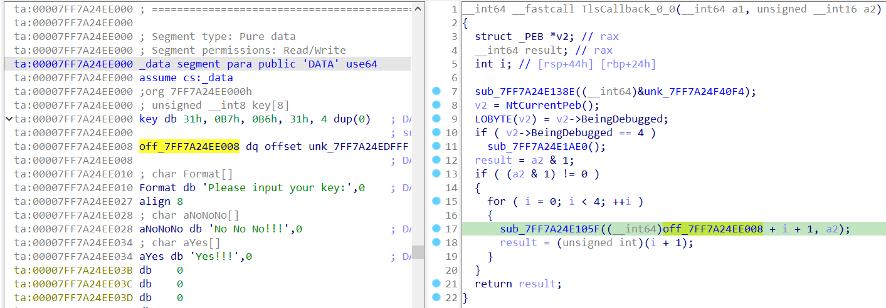
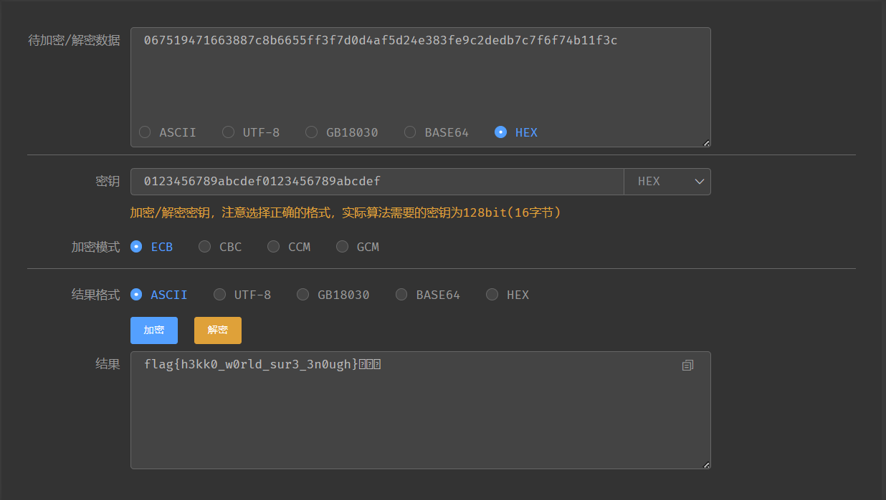
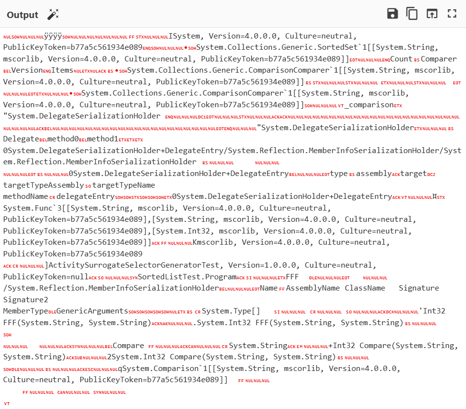
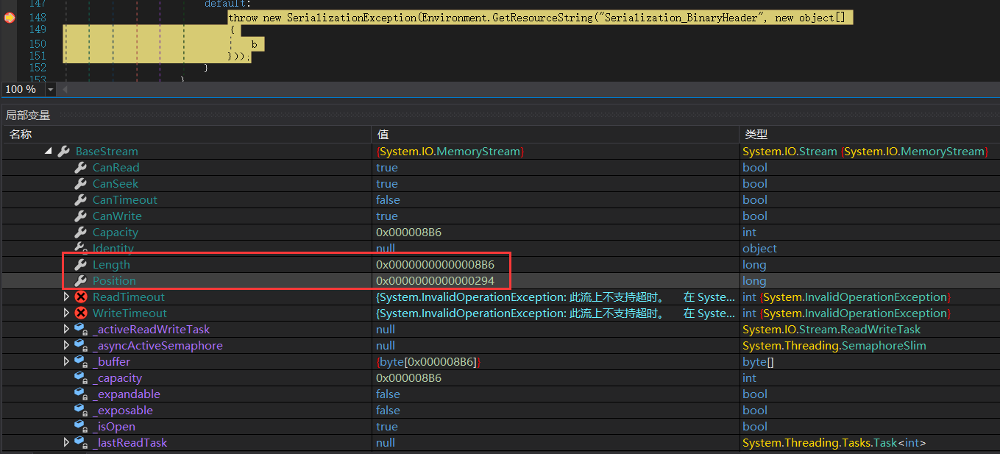
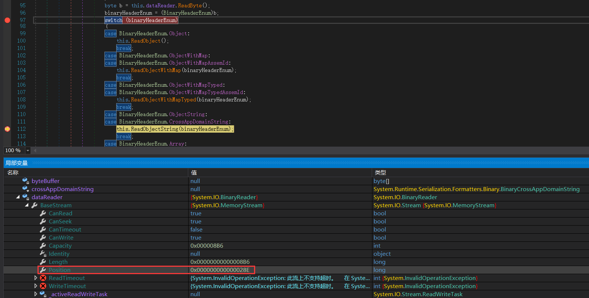
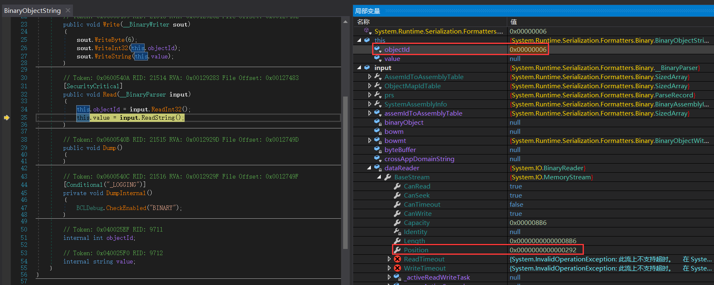
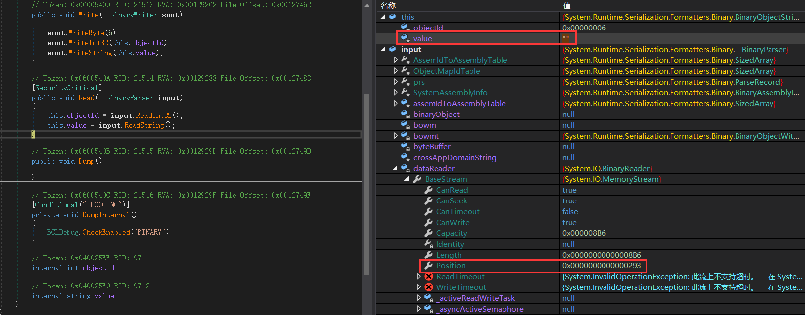

## babyre

逻辑很简单，一个类似TEA的加密。

```C
__int64 sub_7FF7A24E2050()
{
	...
    printf("Please input your key:");
    std::istream::getline(std::cin, Str, 33i64);
    if ( j_strlen(Str) == 32 )
    {
        memset(v5, 0, 0x20ui64);
        4char_to_1int((__int64)v5, (__int64)Str);
        for ( j = 0; j < 4; ++j )
            tea_dec(&v5[2 * j], &v5[2 * j + 1]);
        sub_7FF7A24E1087((__int64)v5, (__int64)byte_7FF7A24EE218);
        for ( k = 0; (int)k < 32; ++k )
        {
            if ( byte_7FF7A24EE040[k] != byte_7FF7A24EE218[k] )
            {
                printf("No No No!!!");
                sub_7FF7A24E11A9("%d", k);
                goto LABEL_15;
            }
        }
        printf("Yes!!!");
    }
    else
    {
        sub_7FF7A24E11A9("Wrong Length!");
    }
    return 0i64;
}
```

只是`key`和`result`被`TLSCallback`更改了：




脚本：

```Python
import struct
result = [0xE0, 0xF3, 0x21, 0x96, 0x97, 0xC7, 0xDE, 0x89, 0x9B, 0xCA,
          0x62, 0x8D, 0xB0, 0x5D, 0xFC, 0xD2, 0x89, 0x55, 0x1C, 0x42,
          0x50, 0xA8, 0x76, 0x9B, 0xEA, 0xB2, 0xC6, 0x2F, 0x7C, 0xCF,
          0x11, 0xDE]
for i in range(32):
    result[i] = result[i] ^ i
flag = []

def tea_dec(cipher, key):
    num = (0x90508D47 - 0x77BF7F99 * 33 * 4) & 0xFFFFFFFF
    for j in range(4):
        for i in range(33):
            num = (num + 0x77BF7F99) & 0xFFFFFFFF
            cipher[1] -= ((((cipher[0] << 5) ^ (cipher[0] >> 4)) + cipher[0]) & 0xffffffff) ^ (num + key[(num >> 11) & 3])
            cipher[1] &= 0xFFFFFFFF
            cipher[0] -= ((((cipher[1] << 5) ^ (cipher[1] >> 4)) + cipher[1]) & 0xffffffff) ^ (num + key[num & 3]) ^ num
            cipher[0] &= 0xFFFFFFFF
    return cipher

c = list(struct.unpack('<8I', bytearray(result)))
key = [0x62, 0x6F, 0x6D, 0x62]
content = []
for i in range(0, 8, 2):
    content += tea_dec(c[i:i + 2], key)
for i in range(len(content)):
    flag += struct.pack('<I', content[i])
print(bytearray(flag))
```

## ezre

放在强网先锋的ezre。

混淆给D8秒了，得到代码：

```C
__int64 __fastcall main(int a1, char **a2, char **a3)
{
    ...
        printf("Welcome to the CTF world:");
    memset(s, 0, 0x32uLL);
    ((void (*)(const char *, ...))__isoc99_scanf)("%s", s);
    v16 = strlen(s);
    v3 = strlen(s);
    v10 = 0;
    base64((__int64)s, (__int64)v11, v3);
    while ( v10 < 4 )
    {
        srand(byte_406132);
        v4 = strlen((const char *)(unsigned int)table);
        change_table((__int64)table, v4);
        if ( (v10 & 1) != 0 )
        {
            v5 = strlen(v11);
            base64((__int64)v11, (__int64)v12, v5);
        }
        else
        {
            base64decode((__int64)v11, (__int64)v12);
        }
        memset(v11, 0, 50uLL);
        memcpy(v11, v12, 50uLL);
        ++v10;
    }
    if ( dword_4062C0 == 1 )
    {
        revser_table((__int64)table, (__int64)&table[64]);
        for ( i = 0; i < 64; ++i )
            table[i] = (5 * (table[i] + 3)) ^ 0x15;
    }
    else
    {
        for ( j = 0; j < 64; ++j )
            table[j] ^= 0x27u;
    }
    sub_401EB0(v12, v13);
    for ( k = 0; ; ++k )
    {
        if ( k >= strlen(v12) )
        {
            printf("right!");
            return 0;
        }
        if ( byte_406180[k] != v13[k] )
            break;
    }
    printf("wrong!");
    return 0;
}

__int64 __fastcall sub_401EB0(char *input, char *output)
{
	...
    s = input;
    output_ = output;
    v8 = strlen(input);
    v7 = 2023;
    index = 0;
    memset(v5, 0, 0x32uLL);
    strncpy(v5, &table[6], 0x15uLL);
    v5[21] = 0;
    strcpy(output_, s);
    while ( index < v8 - 1 )
    {
        if ( index % 3 == 1 )
        {
            v7 = (v7 + 5) % 20;
            v3 = v5[v7 + 1];
        }
        else if ( index % 3 == 2 )
        {
            v7 = (v7 + 7) % 19;
            v3 = v5[v7 + 2];
        }
        else
        {
            v7 = (v7 + 3) % 17;
            v3 = v5[v7 + 3];
        }
        output_[index] ^= v3;
        v4 = output_[index++];
        output_[index] ^= v4;
    }
    return 0LL;
}
```

`.init_array`有反调试，影响`main`里的一些操作：


只用关注红框的就好了。

脚本：

变换的base64表在linux环境下执行以下代码就可以得到了。

```Python
import base64

result = [0x3A, 0x2C, 0x4B, 0x51, 0x68, 0x46, 0x59, 0x63, 0x24, 0x04, 0x5E, 0x5F, 0x00, 0x0C, 0x2B, 0x03, 0x29, 0x5C, 0x74, 0x70, 0x6A, 0x62, 0x7F, 0x3D, 0x2C, 0x4E, 0x6F, 0x13, 0x06, 0x0D, 0x06, 0x0C, 0x4D, 0x56, 0x0F, 0x28, 0x4D, 0x51, 0x76, 0x70, 0x2B, 0x05, 0x51, 0x68, 0x48, 0x55, 0x24, 0x19]
base64table0 = "l+USN4J5Rfj0TaVOcnzXiPGZIBpoAExuQtHyKD692hwmqe7/Mgk8v1sdCW3bYFLr"
base64table1 = "FGseVD3ibtHWR1czhLnUfJK6SEZ2OyPAIpQoqgY0w49u+7rad5CxljMXvNTBkm/8"
base64table2 = "Hc0xwuZmy3DpQnSgj2LhUtrlVvNYks+BX/MOoETaKqR4eb9WF8ICGzf6id1P75JA"
base64table3 = "pnHQwlAveo4DhGg1jE3SsIqJ2mrzxCiNb+Mf0YVd5L8c97/WkOTtuKFZyRBUPX6a"
base64table4 = "plxXOZtaiUneJIhk7qSYEjD1Km94o0FTu52VQgNL3vCBH8zsA/b+dycGPRMwWfr6"
base64table5 = []
for i in range(len(base64table4)):
    base64table5.append(ord(base64table4[i]) ^ 0x27)

def dec1(input, table):
    v7 = 2023
    v5 = table[6:6+0x15] + [0] * (0x32 - 21)
    v5[21] = 0
    xor_num = []    
    for i in range(len(input) - 1):
        if i % 3 == 1:
            v7 = (v7 + 5) % 20
            xor_num.append(v5[v7 + 1])
        elif i % 3 == 2:
            v7 = (v7 + 7) % 19
            xor_num.append(v5[v7 + 2])
        else:
            v7 = (v7 + 3) % 17
            xor_num.append(v5[v7 + 3])
    for i in range(len(input) - 2, -1, -1):
        input[i + 1] ^= input[i]
        input[i] ^= xor_num[i]
    return input

import base64

def encode(input, new_table):
    STANDARD_ALPHABET = b'ABCDEFGHIJKLMNOPQRSTUVWXYZabcdefghijklmnopqrstuvwxyz0123456789+/'
    CUSTOM_ALPHABET = new_table.encode()
    ENCODE_TRANS = bytes.maketrans(STANDARD_ALPHABET, CUSTOM_ALPHABET)
    return base64.b64encode(input).translate(ENCODE_TRANS)

def decode(input, new_table):
    STANDARD_ALPHABET = b'ABCDEFGHIJKLMNOPQRSTUVWXYZabcdefghijklmnopqrstuvwxyz0123456789+/'
    CUSTOM_ALPHABET = new_table.encode()
    DECODE_TRANS = bytes.maketrans(CUSTOM_ALPHABET, STANDARD_ALPHABET)
    return base64.b64decode(input.translate(DECODE_TRANS))


def enc2():
    v11, v12 = input, ""
    v11 = base64.b64encode(v11)
    v11 = base64.b64decode(v11)
    v11 = base64.b64encode(v11)
    v11 = base64.b64decode(v11)
    v11 = base64.b64encode(v11)

def dec2(input):
    input = decode(input, base64table4)
    input = encode(input, base64table3)
    input = decode(input, base64table2)
    input = encode(input, base64table1)
    input = decode(input, base64table0)
    return input


if __name__ == '__main__':
    a = dec1(result, base64table5)
    print(bytearray(a))
    print(dec2(bytearray(a)))
    # b'flag{3ea590ccwxehg715264fzxnzepqz}'
```

## ezre

放在逆向的ezre。

混淆同样是D8秒了，我的神。

main里面啥也不是，程序开了子进程，猜测是获取输入，在另一个进程里加密。

```C
unsigned __int64 __fastcall sub_39F0(unsigned int a1)
{
    ... 
    v3 = 1;
    ptrace(PTRACE_GETREGS, a1, 0LL, (char *)&stat_loc.__iptr + 4);
    ptr = malloc(0x1DuLL);
    sub_3270(a1, v7, ptr, 29LL);  // 猜测是获取另一个进程的输入
    sub_3580(ptr, 29LL); // 加密
    free(ptr);
	...
}
__int64 __fastcall sub_3580(const char *a1)
{
    _BOOL4 v1; // esi
    unsigned __int8 v2; // bl
    size_t v4; // [rsp+38h] [rbp-C8h]
    int i; // [rsp+60h] [rbp-A0h]
    __int64 v7[4]; // [rsp+80h] [rbp-80h]
    __int64 v8[2]; // [rsp+A0h] [rbp-60h] BYREF
    char s[64]; // [rsp+B0h] [rbp-50h] BYREF
    unsigned __int64 v10; // [rsp+F0h] [rbp-10h]

    v10 = __readfsqword(0x28u);
    memset(s, 0, 0x32uLL);
    // SM4特征
    v8[0] = 0xEFCDAB8967452301LL;
    v8[1] = 0xEFCDAB8967452301LL;
    v7[0] = 0x7C88631647197506LL;
    v7[1] = 0x4A0D7D3FFF55668BLL;
    v7[2] = 0xDEC2E93F384ED2F5LL;
    v7[3] = 0x3C1FB1746F7F7CDBLL;
    v4 = 16 * (strlen(a1) >> 4);
    v1 = (strlen(a1) & 0xF) != 0;
    v2 = strlen(a1);
    sub_2220(v2, v8, a1, s);
    for ( i = 0; ; ++i )
    {
        if ( i >= 16 * v1 + (int)v4 )
            return 1;
        if ( *((unsigned __int8 *)v7 + i) != (unsigned __int8)s[i] )
            break;
    }
    return 0;
}

unsigned __int64 __fastcall sub_2220(unsigned __int8 input_len, __int64 key, __int64 input, __int64 output)
{
	... 
    v25 = __readfsqword(0x28u);
    ptr = malloc(0x32uLL);
    memset(&s, 0, 0x20uLL);
    memset(enc_key, 0, sizeof(enc_key));
    memset(v15, 0, 0x120uLL);
    4char_to_1int(key, &s);
    4char_to_1int(key + 4, &v22);
    4char_to_1int(key + 8, &v23);
    4char_to_1int(key + 12, &v24);
    enc_key[0] = s ^ 0xA3B1BAC6LL;
    enc_key[1] = v22 ^ 0x56AA3350;
    enc_key[2] = v23 ^ 0x677D9197;
    enc_key[3] = v24 ^ 0xB27022DCLL;
    for ( i = 0; i < 32; ++i )                    // 子密钥
    {
        v6 = enc_key[i];
        enc_key[i + 4] = sub_16F0(qword_6030[i] ^ enc_key[i + 3] ^ enc_key[i + 2] ^ enc_key[i + 1]) ^ v6;
    }
    for ( j = 0; j < input_len; ++j )
        ptr[j] = *(_BYTE *)(input + j);
    for ( k = 0; k < 16 - input_len % 16; ++k )   // 补齐
        ptr[input_len + k] = 0;
    for ( m = 0; m < (input_len % 16 != 0) + input_len / 16; ++m )
    {
        4char_to_1int((__int64)&ptr[16 * m], v15);
        4char_to_1int((__int64)&ptr[16 * m + 4], &v15[1]);
        4char_to_1int((__int64)&ptr[16 * m + 8], &v15[2]);
        4char_to_1int((__int64)&ptr[16 * m + 12], &v15[3]);
        for ( n = 0; n < 32; ++n )
        {
            v5 = v15[n];
            v15[n + 4] = sub_1BC0(enc_key[n + 4] ^ v15[n + 3] ^ v15[n + 2] ^ v15[n + 1]) ^ v5;
        }                                           // 最后四轮溢出覆盖到19、18、17、16
        sub_13A0(v19, 16 * m + output); // int2byte
        sub_13A0(v18, 16 * m + output + 4);
        sub_13A0(v17, 16 * m + output + 8);
        sub_13A0(v16, 16 * m + output + 12);
    }
    free(ptr);
    return v25;
}
```

有密钥和密文，[国密SM4在线加密/解密](https://bkssl.com/ssl/sm4)



## dotdot

`ILSpy`打开(`dnspy`看不到数据)：

```C#
private static void Main(string[] args)
{
    try
    {
        BBB();
        byte[] array = new byte[16];
        byte[] array2 = new byte[16];
        byte[] array3 = new byte[16];
        AAA(v31, array2);
        Array.Clear(array, 0, 0);
        AAA(array, array3);
        if (!CCC(v4, array2, 16) || !CCC(v5, array3, 16))
        {
            Environment.Exit(-1);
        }
        v7 = DDD("License.dat");
        EEE(Encoding.UTF8.GetBytes(v6), v7);
        MemoryStream memoryStream = new MemoryStream(v7);
        BinaryFormatter binaryFormatter = new BinaryFormatter();
        memoryStream.Position = 0L;
        binaryFormatter.Deserialize(memoryStream);
        memoryStream.Close();
        Console.WriteLine(Encoding.UTF8.GetString(v10));
    }
    catch (Exception)
    {
    }
}
private static void BBB()
{
    v6 = Console.ReadLine();
    byte[] bytes = Encoding.UTF8.GetBytes(v6);
    if (bytes.Length == 16)
    {
        bytes.CopyTo(v31, 0);
    }
    else
    {
        Environment.Exit(-1);
    }
}
public static void AAA(byte[] aaa, byte[] bbb)
{
    for (int i = 0; i < 9; i++)
    {
        GGG(aaa);
        for (int j = 0; j < 4; j++)
        {
            uint num = v11[i, 4 * j, aaa[4 * j]];
            uint num2 = v11[i, 4 * j + 1, aaa[4 * j + 1]];
            uint num3 = v11[i, 4 * j + 2, aaa[4 * j + 2]];
            uint num4 = v11[i, 4 * j + 3, aaa[4 * j + 3]];
            uint num5 = v12[i, 24 * j, (num >> 28) & 0xF, (num2 >> 28) & 0xF];
            uint num6 = v12[i, 24 * j + 1, (num3 >> 28) & 0xF, (num4 >> 28) & 0xF];
            uint num7 = v12[i, 24 * j + 2, (num >> 24) & 0xF, (num2 >> 24) & 0xF];
            uint num8 = v12[i, 24 * j + 3, (num3 >> 24) & 0xF, (num4 >> 24) & 0xF];
            aaa[4 * j] = (byte)((v12[i, 24 * j + 4, num5, num6] << 4) | v12[i, 24 * j + 5, num7, num8]);
            num5 = v12[i, 24 * j + 6, (num >> 20) & 0xF, (num2 >> 20) & 0xF];
            num6 = v12[i, 24 * j + 7, (num3 >> 20) & 0xF, (num4 >> 20) & 0xF];
            num7 = v12[i, 24 * j + 8, (num >> 16) & 0xF, (num2 >> 16) & 0xF];
            num8 = v12[i, 24 * j + 9, (num3 >> 16) & 0xF, (num4 >> 16) & 0xF];
            aaa[4 * j + 1] = (byte)((v12[i, 24 * j + 10, num5, num6] << 4) | v12[i, 24 * j + 11, num7, num8]);
            num5 = v12[i, 24 * j + 12, (num >> 12) & 0xF, (num2 >> 12) & 0xF];
            num6 = v12[i, 24 * j + 13, (num3 >> 12) & 0xF, (num4 >> 12) & 0xF];
            num7 = v12[i, 24 * j + 14, (num >> 8) & 0xF, (num2 >> 8) & 0xF];
            num8 = v12[i, 24 * j + 15, (num3 >> 8) & 0xF, (num4 >> 8) & 0xF];
            aaa[4 * j + 2] = (byte)((v12[i, 24 * j + 16, num5, num6] << 4) | v12[i, 24 * j + 17, num7, num8]);
            num5 = v12[i, 24 * j + 18, (num >> 4) & 0xF, (num2 >> 4) & 0xF];
            num6 = v12[i, 24 * j + 19, (num3 >> 4) & 0xF, (num4 >> 4) & 0xF];
            num7 = v12[i, 24 * j + 20, num & 0xF, num2 & 0xF];
            num8 = v12[i, 24 * j + 21, num3 & 0xF, num4 & 0xF];
            aaa[4 * j + 3] = (byte)((v12[i, 24 * j + 22, num5, num6] << 4) | v12[i, 24 * j + 23, num7, num8]);
            num = v13[i, 4 * j, aaa[4 * j]];
            num2 = v13[i, 4 * j + 1, aaa[4 * j + 1]];
            num3 = v13[i, 4 * j + 2, aaa[4 * j + 2]];
            num4 = v13[i, 4 * j + 3, aaa[4 * j + 3]];
            num5 = v12[i, 24 * j, (num >> 28) & 0xF, (num2 >> 28) & 0xF];
            num6 = v12[i, 24 * j + 1, (num3 >> 28) & 0xF, (num4 >> 28) & 0xF];
            num7 = v12[i, 24 * j + 2, (num >> 24) & 0xF, (num2 >> 24) & 0xF];
            num8 = v12[i, 24 * j + 3, (num3 >> 24) & 0xF, (num4 >> 24) & 0xF];
            aaa[4 * j] = (byte)((v12[i, 24 * j + 4, num5, num6] << 4) | v12[i, 24 * j + 5, num7, num8]);
            num5 = v12[i, 24 * j + 6, (num >> 20) & 0xF, (num2 >> 20) & 0xF];
            num6 = v12[i, 24 * j + 7, (num3 >> 20) & 0xF, (num4 >> 20) & 0xF];
            num7 = v12[i, 24 * j + 8, (num >> 16) & 0xF, (num2 >> 16) & 0xF];
            num8 = v12[i, 24 * j + 9, (num3 >> 16) & 0xF, (num4 >> 16) & 0xF];
            aaa[4 * j + 1] = (byte)((v12[i, 24 * j + 10, num5, num6] << 4) | v12[i, 24 * j + 11, num7, num8]);
            num5 = v12[i, 24 * j + 12, (num >> 12) & 0xF, (num2 >> 12) & 0xF];
            num6 = v12[i, 24 * j + 13, (num3 >> 12) & 0xF, (num4 >> 12) & 0xF];
            num7 = v12[i, 24 * j + 14, (num >> 8) & 0xF, (num2 >> 8) & 0xF];
            num8 = v12[i, 24 * j + 15, (num3 >> 8) & 0xF, (num4 >> 8) & 0xF];
            aaa[4 * j + 2] = (byte)((v12[i, 24 * j + 16, num5, num6] << 4) | v12[i, 24 * j + 17, num7, num8]);
            num5 = v12[i, 24 * j + 18, (num >> 4) & 0xF, (num2 >> 4) & 0xF];
            num6 = v12[i, 24 * j + 19, (num3 >> 4) & 0xF, (num4 >> 4) & 0xF];
            num7 = v12[i, 24 * j + 20, num & 0xF, num2 & 0xF];
            num8 = v12[i, 24 * j + 21, num3 & 0xF, num4 & 0xF];
            aaa[4 * j + 3] = (byte)((v12[i, 24 * j + 22, num5, num6] << 4) | v12[i, 24 * j + 23, num7, num8]);
        }
    }
    GGG(aaa);
    for (int k = 0; k < 16; k++)
    {
        aaa[k] = v14[9, k, aaa[k]];
    }
    for (int l = 0; l < 16; l++)
    {
        bbb[l] = aaa[l];
    }
}

public static void EEE(byte[] v22, byte[] v21)
{
    int[] array = new int[256];
    int[] array2 = new int[256];
    byte[] array3 = new byte[v21.Length];
    int i;
    for (i = 0; i < 256; i++)
    {
        array[i] = v22[i % v22.Length];
        array2[i] = i;
    }
    int num = (i = 0);
    for (; i < 256; i++)
    {
        num = (num + array2[i] + array[i]) % 256;
        int num2 = array2[i];
        array2[i] = array2[num];
        array2[num] = num2;
    }
    int num3 = (num = (i = 0));
    for (; i < v21.Length; i++)
    {
        num3++;
        num3 %= 256;
        num += array2[num3];
        num %= 256;
        int num2 = array2[num3];
        array2[num3] = array2[num];
        array2[num] = num2;
        int num4 = array2[(array2[num3] + array2[num]) % 256];
        array3[i] = (byte)(v21[i] ^ num4);
    }
    for (i = 0; i < v21.Length; i++)
    {
        v21[i] = array3[i];
    }
}	
private static int FFF(string a, string b)
{
    if (b.Length != 21)
    {
        return 1;
    }
    if (!v6.Equals(a))
    {
        return 1;
    }
    string s = b.PadRight((b.Length / 8 + ((b.Length % 8 > 0) ? 1 : 0)) * 8);
    byte[] bytes = Encoding.UTF8.GetBytes(s);
    byte[] bytes2 = Encoding.UTF8.GetBytes(a);
    uint[] array = new uint[4];
    for (int i = 0; i < 4; i++)
    {
        array[i] = BitConverter.ToUInt32(bytes2, i * 4);
    }
    uint num = 3735928559u;
    int num2 = bytes.Length / 8;
    byte[] array2 = new byte[bytes.Length];
    for (int j = 0; j < num2; j++)
    {
        uint num3 = BitConverter.ToUInt32(bytes, j * 8);
        uint num4 = BitConverter.ToUInt32(bytes, j * 8 + 4);
        uint num5 = 0u;
        for (int k = 0; k < 32; k++)
        {
            num5 += num;
            num3 += ((num4 << 4) + array[0]) ^ (num4 + num5) ^ ((num4 >> 5) + array[1]);
            num4 += ((num3 << 4) + array[2]) ^ (num3 + num5) ^ ((num3 >> 5) + array[3]);
        }
        Array.Copy(BitConverter.GetBytes(num3), 0, array2, j * 8, 4);
        Array.Copy(BitConverter.GetBytes(num4), 0, array2, j * 8 + 4, 4);
    }
    for (int l = 0; l < array2.Length; l++)
    {
        if (v28[l] != array2[l])
        {
            return 1;
        }
    }
    byte[] array3 = MD5.Create().ComputeHash(v7);
    for (int m = 0; m < v10.Length; m++)
    {
        v10[m] ^= array3[m % array3.Length];
    }
    return 1;
}
private static bool CCC(byte[] a, byte[] b, int length)
{
    if (a.Length < length || b.Length < length)
    {
        Environment.Exit(-1);
    }
    for (int i = 0; i < length; i++)
    {
        if (a[i] != b[i])
        {
            return false;
        }
    }
    return true;
}

public static byte[] DDD(string v33)
{
    if (!File.Exists(v33))
    {
        throw new FileNotFoundException("", v33);
    }
    using FileStream fileStream = new FileStream(v33, FileMode.Open, FileAccess.Read);
    long length = fileStream.Length;
    byte[] array = new byte[length];
    if (fileStream.Read(array, 0, (int)length) != length)
    {
        throw new IOException("");
    }
    return array;
}
public static void GGG(byte[] v16)
{
    byte[] array = new byte[16];
    uint[] array2 = new uint[16]
    {
        0u, 5u, 10u, 15u, 4u, 9u, 14u, 3u, 8u, 13u,
        2u, 7u, 12u, 1u, 6u, 11u
    };
    for (int i = 0; i < 16; i++)
    {
        array[i] = v16[array2[i]];
    }
    array.CopyTo(v16, 0);
}
```

程序逻辑，获取输入，然后进入`AAA`加密比对，然后将`License.dat`数据进行`EEE`解密，进行反序列化。

先看`AAA`的加密：

网上WP说这是AES白盒，真看不出来。

本来想写个`z3`看看能不能解的，结果才知道`z3`的变量类型不能当数组的`index`。

直接给闵神爆破出来了✪ ω ✪：`WelcomeToQWB2023`

然后进入`EEE：RC4`，密钥是`WelcomeToQWB2023`

`Cyberchef`解得：



这里其他的看不懂，但有个`FFF`，应该是反序列化会执行到这个函数。

`FFF`是个TEA加密，密文、密钥都有，解得：`dotN3t_Is_1nt3r3sting   `

```Python
def tea_dec(cipher, key):
    num = (3735928559 * 32) & 0xFFFFFFFF
    for i in range(32):
        cipher[1] -= ((num + cipher[0]) ^ ((cipher[0] << 4) + key[2])
                      ^ ((cipher[0] >> 5) + key[3])) & 0xFFFFFFFF
        cipher[1] &= 0xFFFFFFFF
        cipher[0] -= ((num + cipher[1]) ^ ((cipher[1] << 4) + key[0])
                      ^ ((cipher[1] >> 5) + key[1])) & 0xFFFFFFFF
        cipher[0] &= 0xFFFFFFFF
        num = (num - 3735928559) & 0xFFFFFFFF
    return cipher


def tea():
    result = [
        69, 182, 171, 33, 121, 107, 254, 150, 92, 29,
        4, 178, 138, 166, 184, 106, 53, 241, 42, 191,
        23, 211, 3, 107
    ]
    result = list(struct.unpack('<6I', bytes(result)))
    key = list(struct.unpack('<4I', b"WelcomeToQWB2023"))
    flag = []
    content = []
    for i in range(0, 6, 2):
        content += tea_dec(result[i:i + 2], key)
    for i in range(len(content)):
        flag += struct.pack('<I', content[i])
    # print(bytes(flag))
    return bytes(flag)
```

`FFF`后面还有一段：`v7`是解密后的`Lisence.dat`

```C#
byte[] array3 = MD5.Create().ComputeHash(Program.v7);
for (int m = 0; m < Program.v10.Length; m++)
{
    Program.v10[m] = (Program.v10[m] ^ array3[m % array3.Length]);
}
```

但执行后，啥也不是。

题干提示了`fix the lisence`，且程序进行反序列化的时候报错，所以还需要修改`lisence`

在报错的地方断住，即`switch`的`default`位置：

```C#
internal void Run()
{
    try
    {
        bool flag = true;
        this.ReadBegin();
        this.ReadSerializationHeaderRecord();
        while (flag)
        {
            BinaryHeaderEnum binaryHeaderEnum = BinaryHeaderEnum.Object;
            BinaryTypeEnum binaryTypeEnum = this.expectedType;
            if (binaryTypeEnum != BinaryTypeEnum.Primitive)
            {
                if (binaryTypeEnum - BinaryTypeEnum.String > 6)
                {
                    throw new SerializationException(Environment.GetResourceString("Serialization_TypeExpected"));
                }
                byte b = this.dataReader.ReadByte();
                binaryHeaderEnum = (BinaryHeaderEnum)b;
                switch (binaryHeaderEnum)
                {
                    case BinaryHeaderEnum.Object:
                        this.ReadObject();
                        break;
                    case BinaryHeaderEnum.ObjectWithMap:
                    case BinaryHeaderEnum.ObjectWithMapAssemId:
                        this.ReadObjectWithMap(binaryHeaderEnum);
                        break;
                    case BinaryHeaderEnum.ObjectWithMapTyped:
                    case BinaryHeaderEnum.ObjectWithMapTypedAssemId:
                        this.ReadObjectWithMapTyped(binaryHeaderEnum);
                        break;
                    case BinaryHeaderEnum.ObjectString:
                    case BinaryHeaderEnum.CrossAppDomainString:
                        this.ReadObjectString(binaryHeaderEnum);
                        break;
                    case BinaryHeaderEnum.Array:
                    case BinaryHeaderEnum.ArraySinglePrimitive:
                    case BinaryHeaderEnum.ArraySingleObject:
                    case BinaryHeaderEnum.ArraySingleString:
                        this.ReadArray(binaryHeaderEnum);
                        break;
                    case BinaryHeaderEnum.MemberPrimitiveTyped:
                        this.ReadMemberPrimitiveTyped();
                        break;
                    case BinaryHeaderEnum.MemberReference:
                        this.ReadMemberReference();
                        break;
                    case BinaryHeaderEnum.ObjectNull:
                    case BinaryHeaderEnum.ObjectNullMultiple256:
                    case BinaryHeaderEnum.ObjectNullMultiple:
                        this.ReadObjectNull(binaryHeaderEnum);
                        break;
                    case BinaryHeaderEnum.MessageEnd:
                        flag = false;
                        this.ReadMessageEnd();
                        this.ReadEnd();
                        break;
                    case BinaryHeaderEnum.Assembly:
                    case BinaryHeaderEnum.CrossAppDomainAssembly:
                        this.ReadAssembly(binaryHeaderEnum);
                        break;
                    case BinaryHeaderEnum.CrossAppDomainMap:
                        this.ReadCrossAppDomainMap();
                        break;
                    case BinaryHeaderEnum.MethodCall:
                    case BinaryHeaderEnum.MethodReturn:
                        this.ReadMethodObject(binaryHeaderEnum);
                        break;
                    default:
                        throw new SerializationException(
                            Environment.GetResourceString(
                                "Serialization_BinaryHeader", 
                                new object[]{b}
                            )
                        );
                }
            }
            else
            {
                this.ReadMemberPrimitiveUnTyped();
            }
            
            ......
}
```

报错的原因是因为`b`为`0x00`，而`b`的来源是读取文件的，位置在`0x294`：



在`switch`断住，一个个看报错前的上一次`switch`是什么，发现是在`ObjectString`



里面有读字符串操作：


先读了一个`Int32`为`0x6`：



再读字符串：



跟进`ReadString`：

1. `Read7BitEncodedInt`按解析1Byte的数据，这里获取的数据为0x0，因此返回`string.Empty`
2. 如果`Read7BitEncodedInt`获取的数据不为0x0，在后面有`this.m_stream.Read(this.m_charBytes, 0, count);`就是读取字符串的操作。因此，先读取1Byte的长度，再根据长度读取字符串。

```C#
[__DynamicallyInvokable]
public virtual string ReadString()
{
    if (this.m_stream == null)
    {
        __Error.FileNotOpen();
    }
    int num = 0;
    int num2 = this.Read7BitEncodedInt();
    if (num2 < 0)
    {
        throw new IOException(
            Environment.GetResourceString(
                "IO.IO_InvalidStringLen_Len", new object[{num2}
                )
            );
    }
    if (num2 == 0)
    {
        return string.Empty;
    }
    if (this.m_charBytes == null)
    {
        this.m_charBytes = new byte[128];
    }
    if (this.m_charBuffer == null)
    {
        this.m_charBuffer = new char[this.m_maxCharsSize];
    }
    StringBuilder stringBuilder = null;
    int chars;
    for (;;)
    {
        int count = (num2 - num > 128) ? 128 : (num2 - num);
        int num3 = this.m_stream.Read(this.m_charBytes, 0, count);
        if (num3 == 0)
        {
            __Error.EndOfFile();
        }
        chars = this.m_decoder.GetChars(this.m_charBytes, 0, num3, this.m_charBuffer, 0);
        if (num == 0 && num3 == num2)
        {
            break;
        }
        if (stringBuilder == null)
        {
            stringBuilder = StringBuilderCache.Acquire(Math.Min(num2, 360));
        }
        stringBuilder.Append(this.m_charBuffer, 0, chars);
        num += num3;
        if (num >= num2)
        {
            goto Block_11;
        }
    }
    return new string(this.m_charBuffer, 0, chars);
    Block_11:
    return StringBuilderCache.GetStringAndRelease(stringBuilder);
}
```

以上，得到：


而下一步报错的原因就是，读取下一步操作的`opcode`为`0x0`，没有定义，就报错了。

因此，可能就是报错的时候读取的不是`opcode`，是字符串被`Patch`为00了

再根据被Patch的数据之后，再`0x2A8`的位置，也有个`06 07 00 00 00`，字符串估计就是从`0x293~0x2A7`，长度为21。

恰好`FFF`解密得到的字符串就为21长度，放进去。

对于后面的`06 07 00 00 00`也是对应一个字符串，长度为16，应该就是放`AAA`解密的字符串了。

再想想，有点难以理解，但是想到`FFF`的参数恰好就是上面的两个字符串，可能是这个反序列化过程，这两个字符串可以作为其`FFF`函数的参数了吧。

Patch之后：


再继续`FFF`后面的过程就可以得到FLAG了：

```Python
v10 = [
    59, 65, 108, 110, 223, 90, 245, 226, 6, 122,
    219, 170, 147, 176, 22, 190, 60, 24, 58, 86,
    150, 97, 188, 166, 113, 104, 232, 197, 234, 225,
    22, 183, 40, 78, 102, 116
]
with open("array3", "rb") as f:
    data = f.read()
md5_hash = hashlib.md5(data).hexdigest()
for i in range(len(v10)):
    index =  (i * 2) % len(md5_hash)
    v10[i] ^= int(md5_hash[index:index+2], 16)
print(bytes(v10))
# b'flag{d0tN3t_I5_Ea57_2_y09!G00d_Luck}'
```
