wp1:[巅峰极客 2023 逆向 Writeup - s11nk - 博客园 (cnblogs.com)](https://www.cnblogs.com/gaoyucan/p/17577858.html)

## g0Re

### 还原特征码

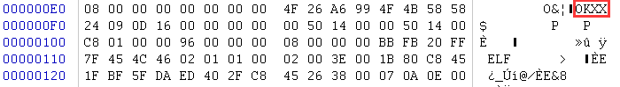

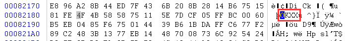

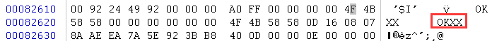

即可upx脱壳。

### 程序逻辑

首先是一个AES加密，调试可以得出加密函数：

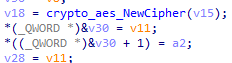

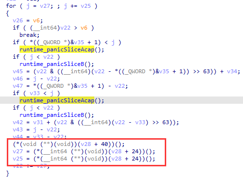

然后一个换表了的base64：

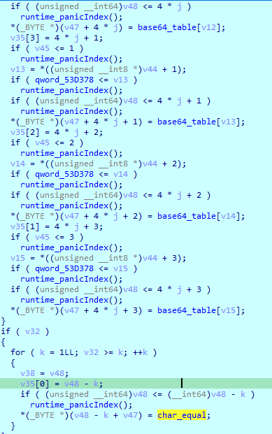

最后与key异或，然后比较：

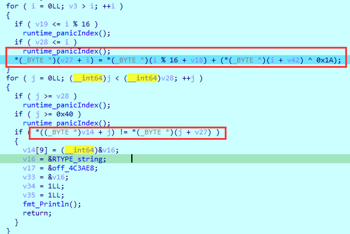

### exp

```python
import base64
import struct
from Crypto.Cipher import AES
key = [
    0x77, 0x76, 0x67, 0x69, 0x74, 0x62, 0x79, 0x67, 0x77, 0x62,
    0x6B, 0x32, 0x62, 0x34, 0x36, 0x64
]
uni_base64 = '456789}#IJKLMNOPQRSTUVWXYZabcdefghijklmnopqrstuvwxyz0123ABCDEFGH'
std_base64 = 'ABCDEFGHIJKLMNOPQRSTUVWXYZabcdefghijklmnopqrstuvwxyz0123456789+/'
data = [
    0xC9F5C5CFC889CEE6, 0xCCAC7FCE91C0D9D2,
    0x92EAD496C0B7CFE9, 0x93AEA5CB84DFD7E2,
    0xC9F0CEDF97BECAA6, 0xDB65B1C46BAEE1B7,
    0xC3ED8CD69392EDCE, 0xA7B5B2AAA594DAA3
]
result = b''
for i in range(8):
    result += struct.pack('<Q', data[i])
result = list(result)
for i in range(len(result)):
    result[i] -= key[i % 16]
    result[i] ^= 0x1A
result = ''.join(chr(i) for i in result)
result = result.translate(str.maketrans(uni_base64, std_base64))
result = base64.b64decode(result)
result = AES.new(bytearray(key), mode=AES.MODE_ECB).decrypt(result)
print(result)
```

## ezlua

跟着[巅峰极客 2023 逆向 Writeup](https://www.cnblogs.com/gaoyucan/p/17577858.html)走

### 程序逻辑

程序获取输入，验证是否都为十六进制字符，之后每两位输入组成两位十六进制数放入`lua_code[0x59b9:0x59CE]`，

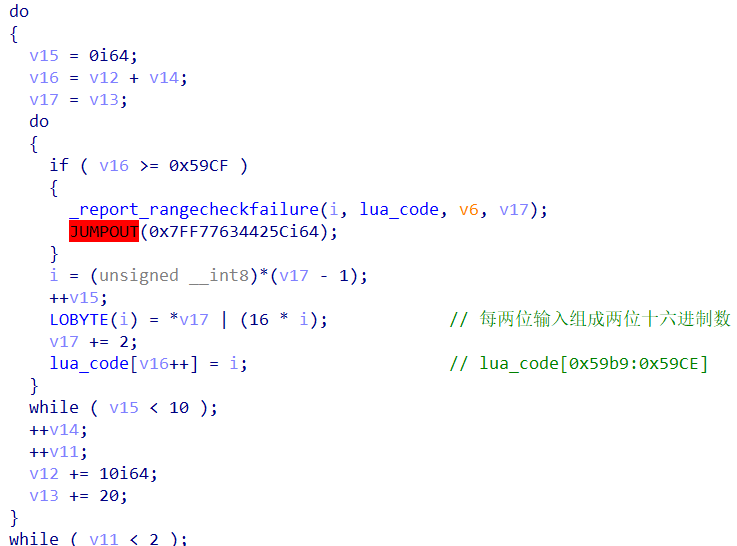

输入后为`lua_code[0x59b9:0x59CE]`下断点，在这里被读取了，是`lj_buf_ruleb128`

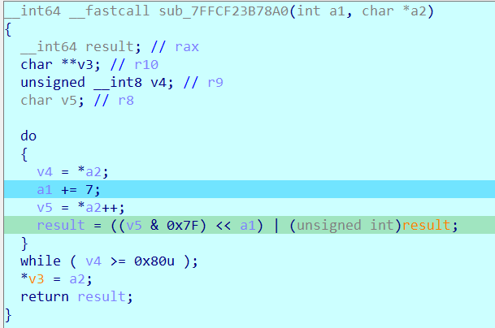

来到其上层函数：

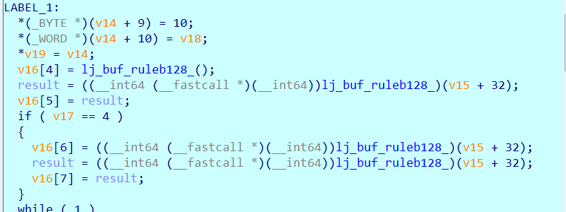

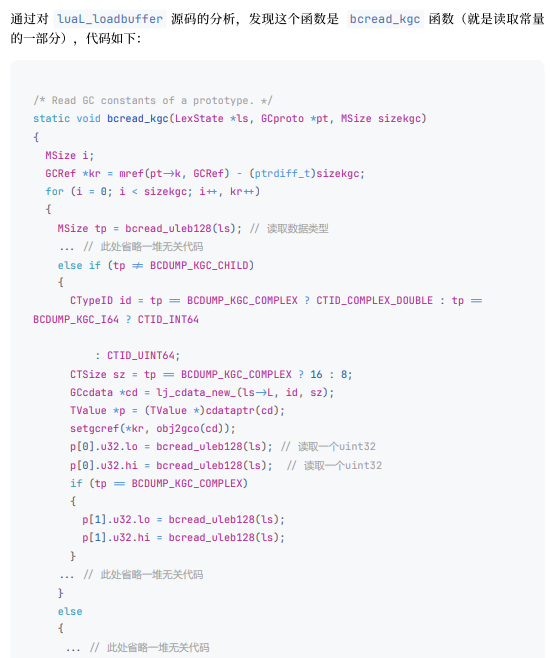

现输⼊的数据其实是两个 u64 类型的数字使⽤ uleb128 编码成 4 个 32bit 的值，判断依据是 tp 的值均为 3。

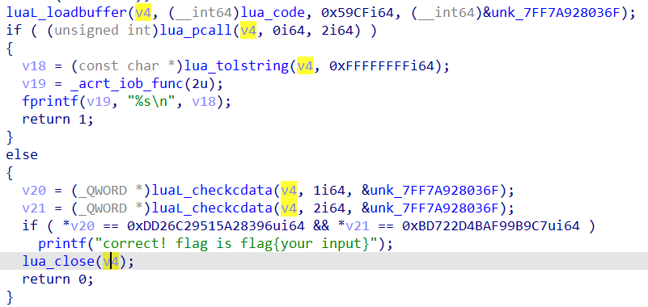

猜测是调用`lua`变化输入，然后再获取结果，进行比较。

### 反编译luajit

将`lua_code`保存为二进制文件，用[luajit-decompiler](https://github.com/Dr-MTN/luajit-decompiler)反编译。

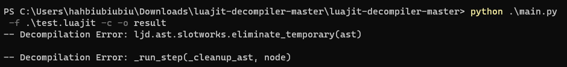

查看结果显示的数据是浮点数，根据wp更改，注释掉两行（`./luajit-decompiler/ljd/rawdump/constants.py`）再次反编译，即可。

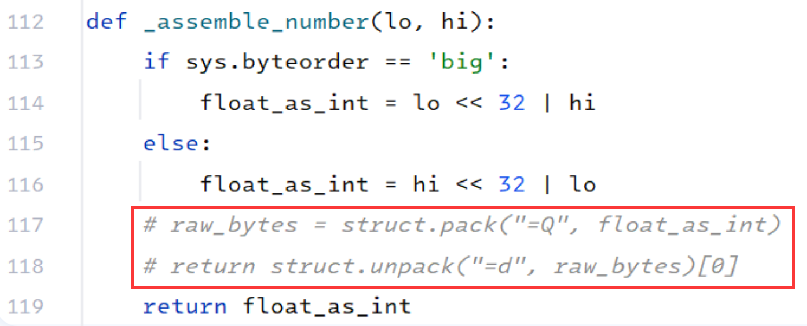

反编译后逻辑很简单，但有虚假控制流，可以改为python代码，打印下`slot2`。
每一步操作的逻辑：

```
slot6 = bit.rshift(slot1, 8)
slot7 = bit.lshift(slot1, 56)
slot4 = bit.bor(slot6, slot7)
slot1 = slot0 + slot4
slot1 = bit.bxor(slot1, slot2)

slot6 = bit.lshift(slot0, 3)
slot7 = bit.rshift(slot0, 61)
slot4 = bit.bor(slot6, slot7)
slot0 = bit.xor(slot4, slot1)
```

### exp

```python
import leb128


def u64_to_uleb128(u):
    high = u >> 32
    low = u & 0xffffffff
    return leb128.u.encode(low).hex() + leb128.u.encode(high).hex()


def dec(s0, s1, s2):
    s0 = ((s0 ^ s1) << 61 | (s0 ^ s1) >> 3) & 0xffffffffffffffff
    t = ((s1 ^ s2) - s0) & 0xffffffffffffffff
    s1 = (t >> 56 | t << 8) & 0xffffffffffffffff
    return s0, s1


slot2 = [
    0xdeadbeef12345678,
    0x28539dc5904d8141,
    0xf2ac321ccf237a7b,
    0xf03df21e866b1a36,
    0x584cde754c325b4b,
    0x97407269ac231f8b,
    0xd2960ba60ee82d09,
    0xb34efc0e8d197592,
    0x15011adba4d8613d,
    0x1598470b72677cea,
    0xb497efc6db87c606,
    0xae0f3ba8a4eeb218,
    0xab6036ab64121254,
    0x663ae5cc72c5eb7f,
    0x71af0f7e9c371b0e,
    0xeb97fc6b58f9eb33,
    0x774108a83f7c75f6,
    0x5a6542d5c9968681,
    0x5e6fb973117ccfb1,
    0xea8134ba653ce534,
    0xfc92946aa1cc9678,
    0x38af8cc9553071e4,
    0x99f7a1b258084992,
    0x82e920e890bb99da,
    0xc67f72528ed05d6c,
    0x4cab3a53d2598281,
    0x517358620b3249f9,
    0xcf3d41fd5e5e0786,
    0x626be66ab995efe3,
    0x24d85b01f54e2ab1,
    0xe9cd3a65e3f95992,
    0x4bf5996751882d17
]
s0, s1 = 0xDD26C29515A28396, 0xBD722D4BAF99B9C7
slot2.reverse()
for i in range(len(slot2)):
    s0, s1 = dec(s0, s1, slot2[i])

print(u64_to_uleb128(s1) + u64_to_uleb128(s0))
```
