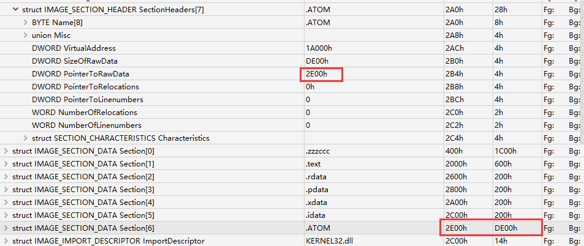
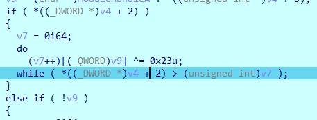
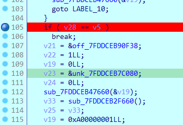
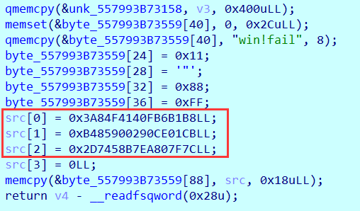

## bad_pe

ida打开提示有对不齐的节指针，去010editor中看下，把.ATOM修改正确：



修改之后，程序可以运行了，调试以下，发现以下异或：



异或出来的结果为MZ开头：


可知.ATOM为PE程序，dump出来，手动异或得到PE程序。

发现是个RC4加密：


调试一下，得到比较的结果，再当作自己的输入让其进行一次加密，得到flag：


## 安全编程

调试程序：

在sub_7FDDCEB2EC70中，有程序逻辑。

检测是否猜对数字：



如果猜对了次数加一，然后和100比较，若达到一百次，就解密图片：


直接该right_times为100就可以直接跑出来了。


## babyre

用条件断点获取rand数据。

逻辑很清晰，直接脚本：

```python
import numpy as np
import struct

rand_num = [
    19954, 28965, 14137, 3558, 10069, 31251, 32362, 11940, 3430, 27969, 14847, 11465, 12175, 9021, 27614, 8175, 12050,
    16408, 20581, 6478, 17749, 4203, 22364, 2272, 9340, 14232, 10535, 32196, 17981, 4946, 3136, 17889, 7408, 30816,
    16101, 12491, 23270, 11421, 6414, 31210, 17404, 16964, 2722, 7641, 15728, 14442, 18922, 7948, 4083, 1228, 17990,
    32182, 4095, 27339, 13087, 26345, 8298, 17333, 16156, 24319, 17212, 7238, 19353, 27450, 11454, 19311, 14421, 32423,
    3283, 26197, 5994, 11848, 651, 13725, 23939, 28785, 28150, 4071, 25161, 27507, 5174, 15768, 17694, 6008, 18904,
    18909, 2574, 14254, 5989, 25837, 770, 28328, 3123, 15246, 22839, 29185, 13185, 26586, 19183, 8514, 24515, 24387,
    29031, 1029, 16443, 469, 8968, 29531, 29897, 11963, 17889, 29292, 5124, 517, 9813, 31325, 22409, 8104, 9745, 15735,
    25236, 12230, 22338, 9605, 22221, 28720, 22532, 4477, 11108, 32554, 541, 5731, 31327, 17262, 17131, 18283, 14387,
    5491, 12187, 18782, 2450, 3566, 10652, 13630, 11141, 7578, 10067, 3629, 8634, 21044, 29969, 20107, 7967, 27850, 578,
    20575, 23728, 11574, 3815, 5368, 21132, 30438, 19782, 12244, 1871, 13022, 19423, 22720, 27036, 4863, 15267, 26945,
    26617, 6793, 26209, 18739, 15072, 4063, 27009, 3760, 5394, 15242, 2292, 21811, 11823, 6273, 11883, 4093, 23428,
    22951, 26823, 23480
]
rand_index = 0


def rand():
    global rand_num
    global rand_index
    num = rand_num[rand_index % len(rand_num)]
    rand_index += 1
    # print(num)
    return num


def fun1(num):
    for i in range(256):
        if (i * 0x17 + 0x42) & 0xff == num:
            return i
    return None


def decrtyp(data):
    num1 = data[0]
    num2 = data[1]
    num3 = data[2]

    for i in range(32):
        num3 -= (((rand() ^ (((num1 >> 15) ^ (num1 << 10)) | 3)) + ((num1 >> 7) + rand())) & 0xffffffff)
        num3 &= 0xffffffff
        num2 -= (((rand() ^ (((num3 >> 15) ^ (num3 << 10)) | 3)) + ((num3 >> 7) + rand())) & 0xffffffff)
        num2 &= 0xffffffff
        num1 -= (((rand() ^ (((num2 >> 15) ^ (num2 << 10)) | 3)) + ((num2 >> 7) + rand())) & 0xffffffff)
        num1 &= 0xffffffff

        num1_byte1 = num1 & 0xff
        num1_byte2 = (num1 >> 8) & 0xff
        num1_byte3 = (num1 >> 16) & 0xff
        num1_byte4 = (num1 >> 24) & 0xff
        num1_byte = [num1_byte1, num1_byte2, num1_byte3, num1_byte4]
        num2_byte1 = num2 & 0xff
        num2_byte2 = (num2 >> 8) & 0xff
        num2_byte3 = (num2 >> 16) & 0xff
        num2_byte4 = (num2 >> 24) & 0xff
        num2_byte = [num2_byte1, num2_byte2, num2_byte3, num2_byte4]
        num3_byte1 = num3 & 0xff
        num3_byte2 = (num3 >> 8) & 0xff
        num3_byte3 = (num3 >> 16) & 0xff
        num3_byte4 = (num3 >> 24) & 0xff
        num3_byte = [num3_byte1, num3_byte2, num3_byte3, num3_byte4]

        for j in range(4):
            num1_byte[j] = fun1(num1_byte[j])
            num2_byte[j] = fun1(num2_byte[j])
            num3_byte[j] = fun1(num3_byte[j])

        num1 = num1_byte[0] | (num1_byte[1] << 8) | (num1_byte[2] << 16) | (num1_byte[3] << 24)
        num2 = num2_byte[0] | (num2_byte[1] << 8) | (num2_byte[2] << 16) | (num2_byte[3] << 24)
        num3 = num3_byte[0] | (num3_byte[1] << 8) | (num3_byte[2] << 16) | (num3_byte[3] << 24)

    return [num1, num2, num3]


def encrypt(data):
    num1 = data[0]
    num2 = data[1]
    num3 = data[2]

    for i in range(32):
        num1_byte1 = num1 & 0xff
        num1_byte2 = (num1 >> 8) & 0xff
        num1_byte3 = (num1 >> 16) & 0xff
        num1_byte4 = (num1 >> 24) & 0xff
        num1_byte = [num1_byte1, num1_byte2, num1_byte3, num1_byte4]
        num2_byte1 = num2 & 0xff
        num2_byte2 = (num2 >> 8) & 0xff
        num2_byte3 = (num2 >> 16) & 0xff
        num2_byte4 = (num2 >> 24) & 0xff
        num2_byte = [num2_byte1, num2_byte2, num2_byte3, num2_byte4]
        num3_byte1 = num3 & 0xff
        num3_byte2 = (num3 >> 8) & 0xff
        num3_byte3 = (num3 >> 16) & 0xff
        num3_byte4 = (num3 >> 24) & 0xff
        num3_byte = [num3_byte1, num3_byte2, num3_byte3, num3_byte4]

        for j in range(4):
            num1_byte[j] = num1_byte[j] * 23 + 66
            num1_byte[j] = num1_byte[j] & 0xff
            num2_byte[j] = num2_byte[j] * 23 + 66
            num2_byte[j] = num2_byte[j] & 0xff
            num3_byte[j] = num3_byte[j] * 23 + 66
            num3_byte[j] = num3_byte[j] & 0xff

        num1 = num1_byte[0] | (num1_byte[1] << 8) | (num1_byte[2] << 16) | (num1_byte[3] << 24)
        num2 = num2_byte[0] | (num2_byte[1] << 8) | (num2_byte[2] << 16) | (num2_byte[3] << 24)
        num3 = num3_byte[0] | (num3_byte[1] << 8) | (num3_byte[2] << 16) | (num3_byte[3] << 24)

        num1 += (((num2 >> 7) + rand())) + ((rand() ^ (((num2 >> 15) ^ (num2 << 10)) | 3))) & 0xffffffff
        num1 &= 0xffffffff
        num2 += (((num3 >> 7) + rand())) + ((rand() ^ (((num3 >> 15) ^ (num3 << 10)) | 3))) & 0xffffffff
        num2 &= 0xffffffff
        num3 += (((num1 >> 7) + rand())) + ((rand() ^ (((num1 >> 15) ^ (num1 << 10)) | 3))) & 0xffffffff
        num3 &= 0xffffffff
    return [num1, num2, num3]

result = [
    0x48, 0x4D, 0x3B, 0xA0, 0x27, 0x31, 0x28, 0x54, 0x6D, 0xF1,
    0x21, 0x35, 0x18, 0x73, 0x6A, 0x4C, 0x71, 0x3B, 0xBD, 0x98,
    0xB6, 0x5A, 0x77, 0x2D, 0x0B, 0x2B, 0xCB, 0x9B, 0xE4, 0x8A,
    0x4C, 0xA9, 0x5C, 0x4F, 0x1B, 0xF1, 0x98, 0x3D, 0x30, 0x59,
    0x3F, 0x14, 0xFC, 0x7A, 0xF4, 0x64, 0x02, 0x2B
]
flag = []
rand_num.reverse()
for i in range(0, len(result) // 12):
    c = []
    for j in range(3):
        c.append(result[0 + j * 4 + i * 12] | (result[1 + j * 4 + i * 12] << 8) | (result[2 + j * 4 + i * 12] << 16) | (
                    result[3 + j * 4 + i * 12] << 24))
    c = decrtyp(c)
    flag += c
print(struct.pack('I' * 12, *flag))
```

## ezapk

Apk里的逻辑很简单，加密逻辑都在so中。

进so逻辑都呈现出来了，但是需要分析，比赛的时候只看出来了XXTEA，没看出来DES😫

### 逻辑

获取输入，分为四个32bit数，进行XXTEA加密

```C
sscanf((const char *)input, "%8x%8x%8x%8x", &c0, &c1, &p2_, &c3);
p3 = c3;
p0 = c0;
p1 = c1;
v16 = -19;
v17 = 0x98654782;
p2 = p2_;
do
{
    v19 = (v17 >> 2) & 3;
    p0 += (((p3 >> 5) ^ (4 * p1)) + ((p1 >> 3) ^ (16 * p3))) ^ ((v17 ^ p1) + (p3 ^ key[v19]));
    p1 += (((p0 >> 5) ^ (4 * p2)) + ((p2 >> 3) ^ (16 * p0))) ^ ((v17 ^ p2) + (p0 ^ key[(v17 >> 2) & 3 ^ 1]));
    p2 += (((p1 >> 5) ^ (4 * p3)) + ((p3 >> 3) ^ (16 * p1))) ^ ((v17 ^ p3) + (p1 ^ key[(v17 >> 2) & 3 ^ 2]));
    p3 += (((p2 >> 5) ^ (4 * p0)) + ((p0 >> 3) ^ (16 * p2))) ^ ((v17 ^ p0) + (p2 ^ key[(unsigned int)v19 ^ 3]));
    v17 -= 0x679AB87E;
    ++v16;
}
while ( v16 );
```

之后每两个数为一组进入`sub_22B0`，根据`a1`，进入不同模式的DES加密

```C
_QWORD *__fastcall sub_22B0(unsigned __int64 a1, __int64 a2)
{
    _QWORD *v3; // r14
    int i; // ebx
    unsigned int *v5; // rax
    unsigned __int64 v6; // rax
    unsigned int *v7; // rax
    __int64 j; // rax
    _QWORD *result; // rax
    char v10[168]; // [rsp+0h] [rbp-A8h] BYREF

    v3 = malloc(0x11uLL);
    v3[1] = 0LL;
    *((_BYTE *)v3 + 16) = 0;
    *v3 = a2;
    for ( i = 0; i != 64; ++i )
    {
        v6 = a1;
        a1 *= 2LL;
        if ( a1 < v6 )
        {
            a1 ^= 0x4A2E3FEAC2675AB3uLL;
            v5 = (unsigned int *)malloc(9uLL);
            *((_BYTE *)v5 + 8) = 0;
            *(_QWORD *)v5 = a1;
            DES_cbc_enc((__int64)v3, (__int64)v3, 8u, v5);
        }
        else
        {
            v7 = (unsigned int *)malloc(9uLL);
            *((_BYTE *)v7 + 8) = 0;
            *(_QWORD *)v7 = a1;
            sub_16A0((__int64)v10, v7);
            sub_1B90((__int64)v10, (unsigned int *)v3, v3);
            for ( j = 0LL; j != 128; j += 8LL )
            {
                v10[j] = 0;
                v10[j + 1] = 0;
                v10[j + 2] = 0;
                v10[j + 3] = 0;
                v10[j + 4] = 0;
                v10[j + 5] = 0;
                v10[j + 6] = 0;
                v10[j + 7] = 0;
            }
        }
    }
    result = malloc(0x10uLL);
    *result = a1;
    result[1] = *v3;
    return result;
}
```

#### DES_cbc_enc

第一个条件分支，将a1异或后就进入了该函数

```C
__int64 __fastcall DES_cbc_enc(__int64 c2_, __int64 c2, unsigned int value_8, unsigned int *c1)
{
	...
    sub_16A0((__int64)v19, c1);
    v18 = value_8;
    if ( value_8 && (value_8 & 7) == 0 )
    {
        LOBYTE(v7) = 'w';
        LOBYTE(v8) = 'v';
        LOBYTE(v9) = 'z';
        LOBYTE(v10) = 'm';
        LOBYTE(v11) = 'x';
        LOBYTE(v12) = 'r';
        v13 = 0LL;
        LOBYTE(v14) = 'r';
        LOBYTE(v15) = 'r';
        do
        {
            *(_BYTE *)(c2_ + v13) = *(_BYTE *)(c2 + v13) ^ v15;
            *(_BYTE *)(c2_ + v13 + 1) = *(_BYTE *)(c2 + v13 + 1) ^ v7;
            *(_BYTE *)(c2_ + v13 + 2) = *(_BYTE *)(c2 + v13 + 2) ^ v8;
            *(_BYTE *)(c2_ + v13 + 3) = *(_BYTE *)(c2 + v13 + 3) ^ v14;
            *(_BYTE *)(c2_ + v13 + 4) = *(_BYTE *)(c2 + v13 + 4) ^ v9;
            *(_BYTE *)(c2_ + v13 + 5) = *(_BYTE *)(c2 + v13 + 5) ^ v10;
            *(_BYTE *)(c2_ + v13 + 6) = *(_BYTE *)(c2 + v13 + 6) ^ v11;
            *(_BYTE *)(c2_ + v13 + 7) = *(_BYTE *)(c2 + v13 + 7) ^ v12;
            sub_1B90((__int64)v19, (unsigned int *)(c2_ + v13), (_BYTE *)(c2_ + v13));
            v15 = *(_QWORD *)(c2_ + v13);
            v7 = v15 >> 8;
            v8 = v15 >> 16;
            v14 = v15 >> 24;
            v9 = HIDWORD(v15);
            v10 = v15 >> 40;
            v11 = HIWORD(v15);
            v12 = HIBYTE(v15);
            v13 += 8LL;
        }
        while ( v18 != v13 );
    }
    ...
    return v18;
}
```

while循环只执行了一次，里面有一个异或，猜测是模式的异或，猜测异或的是IV，那`sub_16A0`应该是使用`c1`生成密钥，存储在`v19`，然后使用`sub_1B90`加密`c2`

##### 子密钥生成

猜测一下函数是子密钥生成，但逻辑上有些理不清

```C
Dword dword_750[16] = {0, 0x1, 0x100, 0x101, 0x10000, 0x10001, 0x10100, 0x10101, 0x1000000, 0x1000001, 0x1000100, 0x1000101, 0x1010000, 0x1010001, 0x1010100, 0x1010101};
Dword dword_790[16] = {0, 0x1000000, 0x10000, 0x1010000, 0x100, 0x1000100, 0x10100, 0x1010100, 0x1, 1000001, 0x10001, 0x1010001, 0x101, 0x1000101, 0x10101, 0x1010101};

__int64 __fastcall sub_16A0(__int64 a1, unsigned int *c1)
{
	...
    // 将字节倒转
    v2 = _byteswap_ulong(*c1);
    v3 = _byteswap_ulong(c1[1]);
    // v4, v5, v6, v7的操作 猜测是子密钥的第一个置换
    v4 = v2 ^ (v2 ^ (v3 >> 4)) & 0xF0F0F0F;
    v5 = v2 & 0x10101010 | (v3 ^ (16 * ((v2 ^ (v3 >> 4)) & 0xF0F0F0F))) & 0xEFEFEFEF;
    v6 = (
          (dword_750[HIBYTE(v4) & 0xF]) | \
          (8 * dword_750[((unsigned __int8)v2 ^ ((unsigned __int8)v2 ^ (unsigned __int8)(v3 >> 4)) & 0xF) & 0xF]) | \
          (4 * dword_750[(v4 >> 8) & 0xF]) | \
          (2 * dword_750[HIWORD(v4) & 0xF]) | \
          (dword_750[(v4 >> 5) & 0xF] << 7) | \
          (dword_750[(v4 >> 13) & 0xF] << 6) | \
          (32 * dword_750[(v4 >> 21) & 0xF]) | \
          (16 * *(_DWORD *)((char *)dword_750 + ((*(unsigned __int8 *)c1 >> 3) & 0x1C)))
    	) & 0xFFFFFFF;
    
    v7 = (dword_790[(v5 >> 25) & 0xF] | \
          (8 * *(_DWORD *)((char *)dword_790 + 2 * (v5 & 0x1E))) |\
          (4 * dword_790[(v5 >> 9) & 0xF]) | (2 * dword_790[(v5 >> 17) & 0xF]) | \
          (dword_790[(unsigned __int8)v5 >> 4] << 7) | \
          (dword_790[(unsigned __int16)v5 >> 12] << 6) | \
          (32 * dword_790[(v5 >> 20) & 0xF]) | \
          (16 * dword_790[v5 >> 28])) & 0xFFFFFFF;
    
    v8 = 0LL;
    do
    {
        // 检测当前轮次是否为0，1，8，15
        // 若是，则左右密钥移位step为2，否则为1
        if ( (unsigned int)v8 <= 0xF && (v22 = 33027, _bittest(&v22, v8)) )
        {
            v9 = 0xFFFFFFE;
            v10 = 27;
            v11 = 1;
        }
        else
        {
            v9 = 0xFFFFFFC;
            v10 = 26;
            v11 = 2;
        }
        v12 = v6 << v11;
        v13 = v6 >> v10;
        v14 = v9 & v12;
        v15 = v13 | v9 & v12;
        v16 = v7 << v11;
        v17 = v7 >> v10;
        v18 = v16 & v9;
        v19 = v17 | v18;
        v20 = ((((unsigned __int8)v17 | (unsigned __int8)v18) & 0x20) << 6) | (v16 >> 1) & 0x400;
        v18 >>= 14;
        
        // 上面是分组移位，下面就应该是密钥置换2了
        *(_DWORD *)(a1 + 8 * v8) = (16 * v14) & 0x24000000 | \
            ((v13 & 1) << 28) | \
            (v12 << 14) & 0x8000000 | \
            (v15 << 18) & 0x2080000 | \
            (v12 << 6) & 0x1000000 | \
            (v12 << 9) & 0x200000 | \
            (v12 >> 1) & 0x100000 | \
            (v16 >> 4) & 0x1000 | \
            (v16 >> 13) & 0x2000 | \
            (v15 << 10) & 0x40000 | \
            (4 * v14) & 0x20000 | \
            (v12 >> 10) & 0x10000 | \
            v16 & 0x100 | \
            v20 | \
            v18 & 0x200 | \
            (v16 >> 5) & 0x20 | \
            (v16 >> 10) & 0x10 | \
            (v19 >> 3) & 8 | \
            (v16 >> 18) & 4 | \
            (v16 >> 26) & 2 | \
            HIBYTE(v16) & 1;
        
        result = (((v15 << 15) & 0x20000000 | \
                   (v12 << 17) & 0x10000000 | \
                   (v15 << 10) & 0x8000000 | \
                   ((v15 & 0x10) << 22) | \
                   (v12 >> 2) & 0x2000000) + 2 * (v14 & 0x800000)) | \
            ((v15 & 0x20) << 16) | \
            ((v19 & 0x10) << 8) | \
            (v16 >> 2) & 0x2000 | \
            (v12 << 11) & 0x100000 | \
            (8 * v14) & 0x80000 | \
            (v12 >> 6) & 0x40000 | \
            (v15 << 15) & 0x20000 | \
            (v12 >> 4) & 0x10000 | \
            v16 & 0x200;
        
        *(_DWORD *)(a1 + 8 * v8 + 4) = result | v18 & 0x808 | (v16 >> 9) & 0x400 |\
            ((v19 & 2) << 7) | (v16 >> 7) & 0x20 | (v19 >> 3) & 0x11 | \
            (4 * (_BYTE)v17) & 4 | (v16 >> 21) & 2;
        
        v7 = v19;
        v6 = v15;
        ++v8;
    }
    while ( (_DWORD)v8 != 16 );
    return result;
}
```

##### DES 64bit 加密

```C
__int64 __fastcall sub_1B90(__int64 a1, unsigned int *a2, _BYTE *a3)
{
	...
    // 字节倒转
    // 拆成左右块
    v3 = _byteswap_ulong(*a2);
    v4 = _byteswap_ulong(a2[1]);
    v5 = (v4 ^ (v3 >> 4)) & 0xF0F0F0F;
    v6 = v5 ^ v4;
    v7 = v3 ^ (16 * v5);
    v8 = HIWORD(v7) ^ (unsigned __int16)v6;
    v9 = v8 ^ v6;
    v10 = v7 ^ (v8 << 16);
    v11 = (v10 ^ (v9 >> 2)) & 0x33333333;
    v12 = v11 ^ v10;
    v13 = v9 ^ (4 * v11);
    v14 = (v12 ^ (v13 >> 8)) & 0xFF00FF;
    v15 = v14 ^ v12;
    v16 = __ROL4__(v13 ^ (v14 << 8), 1);
    v17 = (v15 ^ v16) & 0xAAAAAAAA;
    v18 = v17 ^ v16;
    v19 = __ROL4__(v15 ^ v17, 1);
    v20 = 0LL;
    
    // 这里的while循环应该是加密操作了，但不知道为什么是8轮
    do
    {
        v21 = *(_DWORD *)(a1 + v20 + 4) ^ __ROL4__(v18, 28);
        v19 ^= DES_sbox_ED0[HIBYTE(v21) & 0x3F] ^ dword_DD0[HIWORD(v21) & 0x3F] ^ dword_CD0[(v21 >> 8) & 0x3F] ^ dword_BD0[v21 & 0x3F] ^ dword_AD0[(((unsigned int)v18 ^ *(_DWORD *)(a1 + v20)) >> 24) & 0x3F] ^ dword_9D0[(((unsigned int)v18 ^ *(_DWORD *)(a1 + v20)) >> 16) & 0x3F] ^ dword_8D0[(((unsigned int)v18 ^ *(_DWORD *)(a1 + v20)) >> 8) & 0x3F] ^ dword_7D0[((unsigned __int8)v18 ^ *(_BYTE *)(a1 + v20)) & 0x3F];
        
        v22 = *(_DWORD *)(a1 + v20 + 12) ^ __ROL4__(v19, 28);
        
        v18 ^= DES_sbox_ED0[HIBYTE(v22) & 0x3F] ^ dword_DD0[HIWORD(v22) & 0x3F] ^ dword_CD0[(v22 >> 8) & 0x3F] ^ dword_BD0[v22 & 0x3F] ^ dword_AD0[((v19 ^ *(_DWORD *)(a1 + v20 + 8)) >> 24) & 0x3F] ^ dword_9D0[((v19 ^ *(_DWORD *)(a1 + v20 + 8)) >> 16) & 0x3F] ^ dword_8D0[((v19 ^ *(_DWORD *)(a1 + v20 + 8)) >> 8) & 0x3F] ^ dword_7D0[((unsigned __int8)v19 ^ *(_BYTE *)(a1 + v20 + 8)) & 0x3F];
        
        v20 += 16LL;
    }
    while ( (_DWORD)v20 != 128 );
    v23 = __ROR4__(v18, 1);
    v24 = (v19 ^ v23) & 0xAAAAAAAA;
    v25 = v24 ^ v23;
    LODWORD(v26) = v19 ^ v24;
    HIDWORD(v26) = v19;
    v27 = (v25 ^ ((unsigned int)(v26 >> 1) >> 8)) & 0xFF00FF;
    v28 = v27 ^ v25;
    v29 = (v26 >> 1) ^ (v27 << 8);
    v30 = (v28 ^ (v29 >> 2)) & 0x33333333;
    v31 = v30 ^ v28;
    v32 = v29 ^ (4 * v30);
    v33 = HIWORD(v31) ^ (unsigned __int16)v32;
    v34 = v33 ^ v32;
    v35 = v31 ^ (v33 << 16);
    v36 = (v34 ^ (v35 >> 4)) & 0xF0F0F0F;
    v37 = v36 ^ v34;
    v38 = v35 ^ (16 * v36);
    *a3 = HIBYTE(v38);
    a3[1] = BYTE2(v38);
    a3[2] = BYTE1(v38);
    a3[3] = v38;
    a3[4] = HIBYTE(v37);
    a3[5] = BYTE2(v37);
    a3[6] = BYTE1(v37);
    a3[7] = v37;
    return 0LL;
}
```

#### DES_ecb_enc

另一个条件分支的加密和上面差不多，只是少了明文一开始的异或

`sub_16A0`初始化密钥，`sub_1B90`进行加密。

### exp

知道以上逻辑就可以写脚本解密flag了，借鉴了其他师傅WP的一部分👉[2023第三届“鹏城杯”线上初赛WriteUp](https://mp.weixin.qq.com/s/tjz3urSdsQac30JiqVN62Q)

```python
from Crypto.Cipher import DES

dst = [[0x3B3B082ADFEFF15B, 0x39A4E7E46830C917], [0x699BB6FB1FF1E699, 0x8A25934CD21D7C9A]]
des_res = []
iv = b'rwvrzmxr'
for num in range(2):
    res = dst[num]
    res[1] = res[1].to_bytes(8, 'little')
    for i in range(64):
        if res[0] & 1 == 1:
            des = DES.new(res[0].to_bytes(8, 'little'), DES.MODE_ECB)
            res[1] = des.decrypt(res[1])
            res[1] = bytes([x ^ y for x, y in zip(res[1], iv)])
            res[0] ^= 0x4A2E3FEAC2675AB3
            res[0] = (res[0] // 2) + 0x8000000000000000
        else:
            des = DES.new(res[0].to_bytes(8, 'little'), DES.MODE_ECB)
            res[1] = des.decrypt(res[1])
            res[0] //= 2
    res[1] = int.from_bytes(res[1], 'little')
    des_res += res
print(des_res)


res = des_res
key = [0x0E0C7E0C7, 0x0C6F1D3D7, 0x0C6D3C6D3, 0x0C4D0D2CE]

delta = 0x679AB87E
num = (0x98654782 - delta * 19) & 0xFFFFFFFF
for i in range(19):
    num += delta
    num &= 0xFFFFFFFF
    k_index = (num >> 2) & 3
    res[3] -= ((((res[2] >> 5) ^ (res[0] << 2)) & 0xFFFFFFFF) + (((res[0] >> 3) ^ (res[2] << 4)) & 0xFFFFFFFF)) ^ ((num ^ res[0]) + (res[2] ^ key[k_index ^ 3]) & 0xFFFFFFFF)
    res[3] &= 0xFFFFFFFF
    res[2] -= ((((res[1] >> 5) ^ (res[3] << 2)) & 0xFFFFFFFF) + (((res[3] >> 3) ^ (res[1] << 4)) & 0xFFFFFFFF)) ^ ((num ^ res[3]) + (res[1] ^ key[k_index ^ 2]) & 0xFFFFFFFF)
    res[2] &= 0xFFFFFFFF
    res[1] -= ((((res[0] >> 5) ^ (res[2] << 2)) & 0xFFFFFFFF) + (((res[2] >> 3) ^ (res[0] << 4)) & 0xFFFFFFFF)) ^ ((num ^ res[2]) + (res[0] ^ key[k_index ^ 1]) & 0xFFFFFFFF)
    res[1] &= 0xFFFFFFFF
    res[0] -= ((((res[3] >> 5) ^ (res[1] << 2)) & 0xFFFFFFFF) + (((res[1] >> 3) ^ (res[3] << 4)) & 0xFFFFFFFF)) ^ ((num ^ res[1]) + (res[3] ^ key[k_index]) & 0xFFFFFFFF)
    res[0] &= 0xFFFFFFFF

print("".join([hex(x)[2:] for x in res]))
```

## StateMachine

看了网上师傅的WP👉[2023 11.04 鹏城杯 wp - LaoGong](https://ycznkvrmzo.feishu.cn/docx/SBPWd7UWTo6OH3xqIM6cyMtznWd)

### 逻辑

先看获取`opcode`的函数：

```C
__int64 __fastcall get_opcode(int index, unsigned int unk_5150_indexMul329)
{
    unsigned int v3; // [rsp+Ch] [rbp-Ch]
    unsigned int v4; // [rsp+10h] [rbp-8h]

    v3 = unk_5150_indexMul329 >> 3;
    v4 = unk_5150_indexMul329 & 7;
    if ( v4 > 3 )
        return ((int)*((unsigned __int8 *)&unk_557993B73158 + 1316 * index + v3) >> v4) 
        	| ((((1 << ((unk_5150_indexMul329 & 7) - 3)) - 1) & (unsigned int)*((unsigned __int8 *)&unk_557993B73158 + 1316 * index + v3 + 1)) << (8 - v4));
    else
        return ((int)*((unsigned __int8 *)&unk_557993B73158 + 1316 * index + v3) >> v4) & 0x1F;
}

// 让代码好看一点
__int64 __fastcall get_opcode(int index, unsigned int unk_5150_indexMul329)
{
    unsigned int v3; // [rsp+Ch] [rbp-Ch]
    unsigned int v4; // [rsp+10h] [rbp-8h]

    int num2 = *((_DWORD *)&unk_557993B73150 + 329 * index)
    v3 = num2 >> 3;
    v4 = num2 & 7;
    void * num1 = ((unsigned __int8 *)&unk_557993B73158 + 1316 * index + v3)；
    
    if ( v4 > 3 )
        return ((int)*(num1) >> v4) | ((((1 << ((v4) - 3)) - 1) & (int)*(num1 + 1)) << (8 - v4));
    else
        return ((int)*(num1) >> v4) & 0x1F;
}
```

再看获取`op_num`的函数：

```C
__int64 __fastcall get_op_num(int a1, unsigned int a2)
{
    unsigned int v3; // [rsp+Ch] [rbp-Ch]
    unsigned int v4; // [rsp+10h] [rbp-8h]

    v3 = a2 >> 3;
    v4 = a2 & 7;
    if ( v4 > 4 )
        return ((int)*((unsigned __int8 *)&unk_557993B73158 + 1316 * a1 + v3) >> v4) | ((((1 << ((a2 & 7) - 4)) - 1) & (unsigned int)*((unsigned __int8 *)&unk_557993B73158 + 1316 * a1 + v3 + 1)) << (8 - v4));
    else
        return ((int)*((unsigned __int8 *)&unk_557993B73158 + 1316 * a1 + v3) >> v4) & 0xF;
}

// 让代码好看一点
__int64 __fastcall get_op_num(int index, unsigned int a2=num2)
{
    unsigned int v3; // [rsp+Ch] [rbp-Ch]
    unsigned int v4; // [rsp+10h] [rbp-8h]

    int num2 = *((_DWORD *)&unk_557993B73150 + 329 * index) + 5
    void * num1 = ((unsigned __int8 *)&unk_557993B73158 + 1316 * index + v3)
    v3 = num2 >> 3;
    v4 = num2 & 7;
    if ( v4 > 4 )
        return ((int)*num1 >> v4) | ((((1 << ((v4) - 4)) - 1) & (unsigned int)*(num1 + 1)) << (8 - v4));
    else
        return ((int)*((unsigned __int8 *)&unk_557993B73158 + 1316 * a1 + v3) >> v4) & 0xF;
}
```

`get_opcode`和`get_op_num`都是获取同一个数据里的数据，且最后返回的时候，经过了移位变换。

调试可以获取数据：


再来看其他函数，应该是控制流进行操作的函数了

```C
void __fastcall __noreturn start_routine(int *a1)
{
	...
        
    v3 = *a1; // &unk_5020 + 4 * i (i: 0~9)
    for ( i = 1; i <= &unk_F423F; ++i )
    {
        *(&unk_5100 + 329 * i + 2 * v3) = *(&unk_5100 + 329 * i + 2 * v3 - 329);
        while ( !byte_5154[1316 * i - 1316] )	    // 等待其他线程完成任务
            ;
        while ( !byte_5558[1316 * i - 1316] )       // 等待其他线程完成任务
            ;
        v4 = get_opcode((i - 1), *(&unk_5150 + 329 * i - 329)); // 获取opcode
        if ( v4 != 29 || v3 )
        {
            if ( v4 == 31 )
                break;
            if ( v3 == get_op_num((i - 1), (*(&unk_5150 + 329 * i - 329) + 5)) )
            {
                if ( (v4 & 0x18) != 0 )
                {
                    if ( (v4 & 0x18) == 8 )
                    {
                        v6 = sub_13F9((i - 1), (*(&unk_5150 + 329 * i - 329) + 9));
                        switch ( v4 & 7 )
                        {
                            case 0:
                                *(&unk_5100 + 329 * i + 2 * v3) = v6 + *(&unk_5100 + 329 * i + 2 * v3 - 329);
                                break;
                            case 1:
                                *(&unk_5100 + 329 * i + 2 * v3) = *(&unk_5100 + 329 * i + 2 * v3 - 329) - v6;
                                break;
                            case 2:
                                *(&unk_5100 + 329 * i + 2 * v3) = v6;
                                break;
                            case 3:
                                *(&unk_5100 + 329 * i + 2 * v3) = *(&unk_5100 + 329 * i + 2 * v3 - 329) << v6;
                                break;
                            case 4:
                                *(&unk_5100 + 329 * i + 2 * v3) = *(&unk_5100 + 329 * i + 2 * v3 - 329) >> v6;
                                break;
                            default:
                                break;
                        }
                    }
                    else if ( v4 == 16 )
                    {
                        // opcode == 16: mov
                        v5 = get_op_num((i - 1), (*(&unk_5150 + 329 * i - 329) + 9));
                        do
                        {
                            while ( !*(&byte_5104 + 1316 * i + 8 * v5 - 1316) )
                                ;
                        }
                        while ( !byte_5621[1316 * i - 1316] );
                        *(&unk_5100 + 329 * i + 2 * v3) = *(&byte_5559 + 1316 * i + *(&unk_5100 + 329 * i + 2 * v5 - 329) - 1316);
                    }
                }
                else
                {
                    // opcode & 0x18 == 0
                    v7 = get_op_num((i - 1), (*(&unk_5150 + 329 * i - 329) + 9));
                    while ( !*(&byte_5104 + 1316 * i + 8 * v7 - 1316) )
                        ;
                    v1 = v4 & 7;
                    if ( v1 == 3 )
                    {
                        // opcode & 7 == 3: xor
                        *(&unk_5100 + 329 * i + 2 * v3) = *(&unk_5100 + 329 * i + 2 * v7 - 329)
                                ^ *(&unk_5100 + 329 * i + 2 * v3 - 329);
                    }
                    else if ( (v4 & 7u) <= 3 )
                    {
                        if ( v1 == 2 )
                        {
                            // opcode & 7 == 2: 
                            *(&unk_5100 + 329 * i + 2 * v3) = *(&unk_5100 + 329 * i + 2 * v7 - 329);
                        }
                        else if ( (v4 & 7) != 0 )
                        {
                            // opcode & 7 == 1: sub
                            *(&unk_5100 + 329 * i + 2 * v3) = *(&unk_5100 + 329 * i + 2 * v3 - 329)
                                - *(&unk_5100 + 329 * i + 2 * v7 - 329);
                        }
                        else
                        {
                            // opcode & 7 == 0: add
                            *(&unk_5100 + 329 * i + 2 * v3) = *(&unk_5100 + 329 * i + 2 * v3 - 329)
                                + *(&unk_5100 + 329 * i + 2 * v7 - 329);
                        }
                    }
                }
            }
        }
        else
        {
            // opcode == 29: getchar
            *(&unk_5100 + 329 * i) = getchar();
        }
        *(&byte_5104 + 1316 * i + 8 * v3) = 1;
    }
    pthread_exit(0LL);
}

void __fastcall __noreturn sub_1C41(void *a1)
{
    int i; // [rsp+4h] [rbp-Ch]
    int v2; // [rsp+8h] [rbp-8h]
    int v3; // [rsp+Ch] [rbp-4h]

    for ( i = 1; i <= &unk_1869F; ++i )
    {
        *(&unk_5150 + 329 * i) = *(&unk_5150 + 329 * i - 329);
        while ( !byte_5558[1316 * i - 1316] )
            ;
        v2 = get_opcode(i - 1, *(&unk_5150 + 329 * i - 329));
        if ( (v2 & 0x18) != 0 && (v2 & 0x18) != 0x10 )
        {
            if ( (v2 & 0x18) == 24 )
            {
                *(&unk_5150 + 329 * i) = *(&unk_5150 + 329 * i - 329) + 5;
                if ( v2 == 28 )
                {
                    // opcode == 28: putchar
                    while ( !*(&byte_5104 + 1316 * i - 1316) )
                        ;
                    putchar(*(&unk_5100 + 329 * i - 329));
                }
                if ( v2 == 31 )
                    break;
            }
            else if ( (v2 & 0x18) == 8 )
            {
                *(&unk_5150 + 329 * i) = *(&unk_5150 + 329 * i - 329) + 25;
                if ( v2 == 15 )
                {
                    // opcode == 15: jnz
                    v3 = get_op_num((i - 1), (*(&unk_5150 + 329 * i - 329) + 5));
                    while ( !*(&byte_5104 + 1316 * i + 8 * v3 - 1316) )
                        ;
                    if ( *(&unk_5100 + 329 * i + 2 * v3 - 329) )
                        *(&unk_5150 + 329 * i) = sub_13F9((i - 1), (*(&unk_5150 + 329 * i - 329) + 9));
                }
            }
        }
        else
        {
            *(&unk_5150 + 329 * i) = *(&unk_5150 + 329 * i - 329) + 13;
        }
        byte_5154[1316 * i] = 1;
    }
    pthread_exit(0LL);
}

void __fastcall __noreturn sub_1F91(void *a1)
{
    int i; // [rsp+0h] [rbp-10h]
    int v2; // [rsp+4h] [rbp-Ch]
    int v3; // [rsp+8h] [rbp-8h]
    int v4; // [rsp+Ch] [rbp-4h]

    for ( i = 1; i <= &unk_1869F; ++i )
    {
        memcpy(&unk_5100 + 1316 * i + 1113, &unk_5100 + 1316 * i - 203, 0xC8uLL);
        while ( !byte_5154[1316 * i - 1316] )
            ;
        while ( !byte_5558[1316 * i - 1316] )
            ;
        v2 = get_opcode(i - 1, *(&unk_5150 + 329 * i - 329));
        if ( v2 == 17 )
        {
            // opcode= == 17: mov
            v3 = get_op_num((i - 1), (*(&unk_5150 + 329 * i - 329) + 5));
            v4 = get_op_num((i - 1), (*(&unk_5150 + 329 * i - 329) + 9));
            do
            {
                while ( !*(&byte_5104 + 1316 * i + 8 * v3 - 1316) );
            }
            while ( !*(&byte_5104 + 1316 * i + 8 * v4 - 1316) );
            *(&byte_5559 + 1316 * i + *(&unk_5100 + 329 * i + 2 * v4 - 329)) = *(&unk_5100 + 329 * i + 2 * v3 - 329);
        }
        else if ( v2 == 31 )
        {
            break;
        }
        byte_5621[1316 * i] = 1;
    }
    pthread_exit(0LL);
}
```

利用网上师傅WP里的脚本可以讲逻辑输出，对于`codes`为什么要二进制然后倒转这点我暂时没搞懂😭

```python
codes = open('./vm', 'rb').read()[0x3020: 0x3020 + 0x157]
codes = ''.join(bin(i)[2: ].rjust(8, '0')[:: -1] for i in codes)

def fetch_imm(codes, pc, size):
    assert pc + size <= len(codes)
    value = int(codes[pc: pc + size][:: -1], 2)
    return value, pc + size

def fetch_opcode(codes, pc):
    return fetch_imm(codes, pc, 5)

def fetch_reg_index(codes, pc):
    return fetch_imm(codes, pc, 4)

def fetch_imm16(codes, pc):
    return fetch_imm(codes, pc, 16)

regs = ['rax', 'rbp', 'r8', 'r9', 'r10', 'r11', 'r12', 'r13', 'r14', 'r15']

print('.intel_syntax noprefix')
pc = 0
while pc < len(codes):
    print('_0x%04x: ' % pc, end='')
    opcode, pc = fetch_opcode(codes, pc)
    if opcode == 15:
        dreg, pc = fetch_reg_index(codes, pc)
        imm, pc = fetch_imm16(codes, pc)
        print('cmp %s, 0\n  jnz _0x%04x' % (regs[dreg], imm))
    elif opcode == 17:
        dreg, pc = fetch_reg_index(codes, pc)
        sreg, pc = fetch_reg_index(codes, pc)
        print('mov [%s + 0x2000], %s' % (regs[sreg], regs[dreg]))
    elif opcode == 28:
        print('call m_putchar')
    elif opcode == 29:
        print('call m_getchar')
    elif opcode == 31:
        print('ret')
    elif opcode == 16:
        dreg, pc = fetch_reg_index(codes, pc)
        sreg, pc = fetch_reg_index(codes, pc)
        print('mov %s, [%s + 0x2000]' % (regs[dreg], regs[sreg]))
    elif opcode & 0x18 == 8:
        dreg, pc = fetch_reg_index(codes, pc)
        imm, pc = fetch_imm16(codes, pc)
        op = ['add', 'sub', 'mov', 'shl', 'shr'][opcode & 7]
        print('%s %s, 0x%x' % (op, regs[dreg], imm))
    elif opcode & 0x18 == 0:
        dreg, pc = fetch_reg_index(codes, pc)
        sreg, pc = fetch_reg_index(codes, pc)
        op = ['add', 'sub', 'mov', 'xor'][opcode & 7]
        print('%s %s, %s' % (op, regs[dreg], regs[sreg]))
    else:
        assert False, hex(opcode)

```

使用`gcc -c ./main.s -o main.o`可以将输出的汇编代码转成二进制文件，更好分析。

先获取输入，然后将输入分为三组，每组两个四字节数进行TEA加密，最后进行比较。

```C
__int64 __fastcall 0x0000(__int64 a1, __int64 a2)
{
    ...
    v2 = 24i64;
    v3 = 0i64;
    do
    {
        v4 = m_getchar(a1, a2, v3);
        *(_QWORD *)(v5 + 0x2000) = v4;
        --v2;
        v3 = v5 + 1;
    }
    while ( v2 );
    do
    {
        v6 = 4i64;
        v7 = 8i64 * MEMORY[0x2030];
        input_8char1 = 0i64;
        do
        {
            input_8char1 = *(_QWORD *)(v7 + 0x2000) ^ (input_8char1 << 8);
            ++v7;
            --v6;
        }
        while ( v6 );
        v9 = 4i64;
        input_8char2 = 0i64;
        do
        {
            input_8char2 = *(_QWORD *)(v7 + 0x2000) ^ (input_8char2 << 8);
            ++v7;
            --v9;
        }
        while ( v9 );
        v11 = 32i64;
        do
        {
            v9 += 0x43217856i64;
            v12 = 4i64;
            key0 = 0i64;
            do
            {
                v14 = v12 + 23;
                key0 = *(_QWORD *)(v14 + 0x2000) ^ (key0 << 8);
                v12 = v14 - 24;
            }
            while ( v12 );
            v15 = 4i64;
            key1 = 0i64;
            do
            {
                v17 = v15 + 27;
                key1 = *(_QWORD *)(v17 + 0x2000) ^ (key1 << 8);
                v15 = v17 - 28;
            }
            while ( v15 );
            input_8char1 += (key1 + (input_8char2 >> 5)) ^ (input_8char2 + v9) ^ (key0 + 16 * input_8char2);
            v18 = 4i64;
            key2 = 0i64;
            do
            {
                v20 = v18 + 31;
                key2 = *(_QWORD *)(v20 + 0x2000) ^ (key2 << 8);
                v18 = v20 - 32;
            }
            while ( v18 );
            v21 = 4i64;
            key3 = 0i64;
            do
            {
                v23 = v21 + 35;
                key3 = *(_QWORD *)(v23 + 0x2000) ^ (key3 << 8);
                v21 = v23 - 36;
            }
            while ( v21 );
            input_8char2 += (key3 + (input_8char1 >> 5)) ^ (input_8char1 + v9) ^ (key2 + 16 * input_8char1);
            --v11;
        }
        while ( v11 );
        v24 = 8i64 * MEMORY[0x2030] + 64;
        v25 = 8i64 * MEMORY[0x2030] + 68;
        v26 = 4i64;
        do
        {
            --v26;
            *(_QWORD *)(v24 + 0x2000) = input_8char1;
            *(_QWORD *)(v25 + 0x2000) = input_8char2;
            ++v24;
            ++v25;
            input_8char1 >>= 8;
            input_8char2 >>= 8;
        }
        while ( v26 );
        ++MEMORY[0x2030];
    }
    while ( MEMORY[0x2030] != 3i64 );
    if ( MEMORY[0x2058] != MEMORY[0x2040] )
        m_putchar(a1, a2, 88i64, 24i64);
    else
        m_putchar(a1, a2, 89i64, 23i64);
    m_putchar(v28, v27, v29, v30);
    m_putchar(v32, v31, v33, v34);
    return m_putchar(v36, v35, v37, v38);
}
```

密文在之前有一个初始化函数中：



### exp

懒得写解密脚本了，借鉴一下网上师傅的，阿里嘎多

主要是前面的逻辑或多或少没理清

```C
#include <stdio.h>
#include <stdlib.h>

void encrypt(char* data) {
    unsigned int* _data = (unsigned int*) data;
    for (int i = 0; i < 3; i++) {
        unsigned int _data0 = __builtin_bswap32(_data[2 * i + 0]);
        unsigned int _data1 = __builtin_bswap32(_data[2 * i + 1]);
        unsigned int sum = 0, delta = 0x43217856;
        unsigned int key[] = { 0x11, 0x22, 0x88, 0xff };
        for (int j = 0; j < 32; j++) {
            sum += delta;
            _data0 += (key[1] + (_data1 >> 5)) ^ (_data1 + sum) ^ (key[0] + (_data1 << 4));
            _data1 += (key[3] + (_data0 >> 5)) ^ (_data0 + sum) ^ (key[2] + (_data0 << 4));
        }
        _data[2 * i + 0] = _data0;
        _data[2 * i + 1] = _data1;
    }
}

void decrypt(char* data) {
    unsigned int* _data = (unsigned int*) data;
    for (int i = 0; i < 3; i++) {
        unsigned int _data0 = _data[2 * i + 0];
        unsigned int _data1 = _data[2 * i + 1];
        unsigned int sum = 0, delta = 0x43217856;
        unsigned int key[] = { 0x11, 0x22, 0x88, 0xff };
        sum = delta * 32;
        for (int j = 0; j < 32; j++) {
            _data1 -= (key[3] + (_data0 >> 5)) ^ (_data0 + sum) ^ (key[2] + (_data0 << 4));
            _data0 -= (key[1] + (_data1 >> 5)) ^ (_data1 + sum) ^ (key[0] + (_data1 << 4));
            sum -= delta;
        }
        _data[2 * i + 0] = __builtin_bswap32(_data0);
        _data[2 * i + 1] = __builtin_bswap32(_data1);
    }
}

int main() {
    char data[25] = { 0 };
    ((unsigned long long*) data)[0] = 0x3a84f4140fb6b1b8l;
    ((unsigned long long*) data)[1] = 0xb485900290ce01cbl;
    ((unsigned long long*) data)[2] = 0x2d7458b7ea807f7cl;
    // encrypt(data);
    decrypt(data);
    puts(data);
    return 0;
}
```
