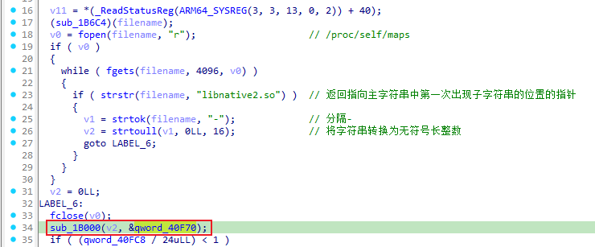
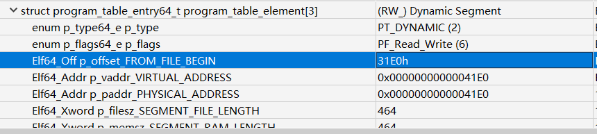
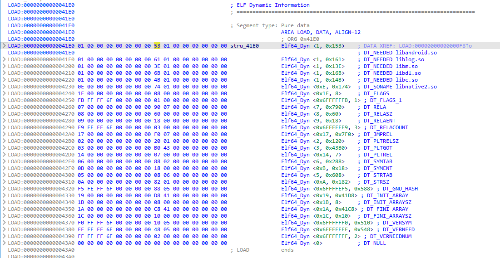
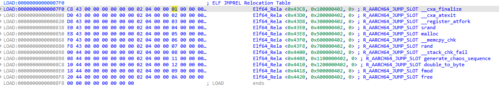
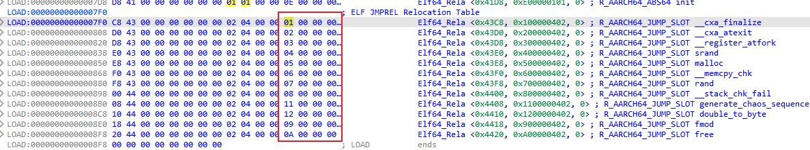
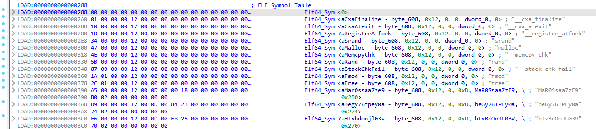
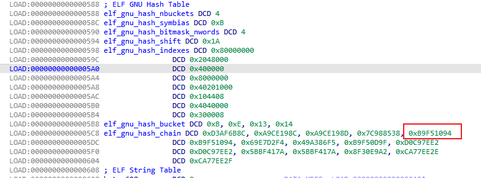
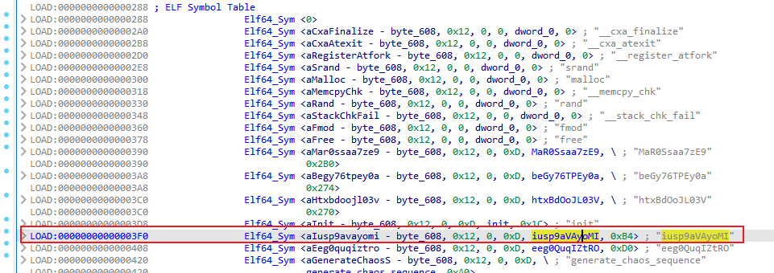
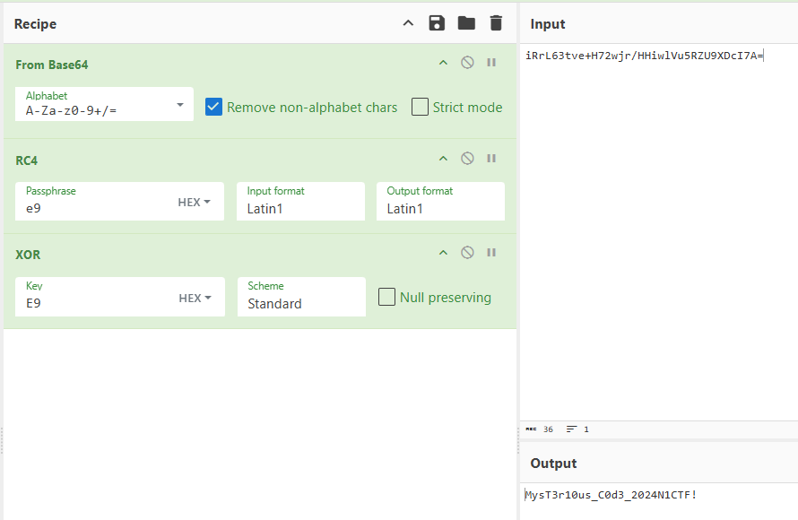

# ezapk

java层没啥逻辑，主要是native层。


在`libnative1.so`中`JNI_Onload`找到`method`表


里面有三个这个逻辑进行加密，但不知道机密函数`v10`具体是什么：


## 纯静态分析

### 找qword_40F70

看`qword_40F70`怎么来的：`sub_75e17c0540`



`/proc/self/maps`大致这样子：

```shell
thyme:/ # cat /proc/13853/maps | grep libnative2.so
6f6cac0000-6f6cac4000 r-xp 00000000 fc:28 104959 /data/app/~~q5YqQP1HKnoRJ2Foh2PYSg==/com.n1ctf2024.ezapk-L69cpW5lKW-z-LqMNvjOeA==/lib/arm64/libnative2.so
6f6cac4000-6f6cac5000 rw-p 00003000 fc:28 104959 /data/app/~~q5YqQP1HKnoRJ2Foh2PYSg==/com.n1ctf2024.ezapk-L69cpW5lKW-z-LqMNvjOeA==/lib/arm64/libnative2.so
```

所以应该是获取libnative2.so的起始地址。

然后进入`sub_1B000`：

```c
__int64 __fastcall sub_1B000(__int64 base, __int64 out)
{
    number_of_program_header_entries = *(base + 0x38);// base = libnative2.so在内存中的地址
    if ( *(base + 0x38) )
    {
        offset_from_file_begin = (*(base + 32) + base + 8);// 
        // base + 0x20 = program_header_offset
        // base + program_header_offset = program_table_table
        // program_table_table + 8 = proogram_table_element[0]->offset_from_file_begin
        do
        {                                           // offset_from_file_begin - 8 = p_type
            if ( *(offset_from_file_begin - 2) == 2 ) // PT_DYNAMIC
            {                                         // Dynamic Segment
                v4 = 0LL;
                v5 = 0LL;
                v6 = 0LL;
                v7 = 0LL;
                v8 = 0LL;
                v9 = 0LL;
                v10 = 0LL;
                v11 = 0;
                v12 = (*offset_from_file_begin + base + 8);
                ......
            }
            offset_from_file_begin += 7; // 8byte(QWORD) * 7 = 56byte = program_table_element的大小
            --number_of_program_header_entries;
        }
        while ( number_of_program_header_entries );
    }
    return 0xFFFFFFFFLL;
}
```

通过010editor模板对照分析，可以知道他在找`libnative2.so`中`p_flags`为`PT_DYNAMIC`的段，即`Dynamic Segment`：



在IDA中根据地址`0x41E0`来找到它：

* 每个条目代表一个动态链接表项，由`Elf64_Dyn`结构表示，它包含两个字段：一个是类型（d_tag），另一个是值（d_un）。
  * 这些条目定义了运行时加载器需要的信息来正确加载和链接程序或共享库。



然后程序遍历每个条目来进行操作：

```c
v4 = 0LL;
v5 = 0LL;
v6 = 0LL;
v7 = 0LL;
v8 = 0LL;
v9 = 0LL;
v10 = 0LL;
v11 = 0;
v12 = (*offset_from_file_begin + base + 8);
while ( 1 )
{
    v13 = *(v12 - 1);
    switch ( v13 )
    {
        case 0LL:
            if ( (~v11 & 0xF) != 0 )
                return 0xFFFFFFFFLL;
            v20 = (v8 + base);
            *(out + 32) = v6;
            v21 = v7 + base;
            v22 = v5 + base;
            *(out + 24) = v20;
            v23 = *v20++;
            *(out + 16) = v9 + base;
            *out = base;
            *(out + 8) = v10 + base;
            result = 0LL;
            *(out + 40) = v23;
            *(out + 88) = v4;
            *(out + 96) = v22;
            v25 = v20 + 8 * DWORD2(v23);
            *(out + 56) = v20;
            *(out + 64) = v25;
            *(out + 72) = &v25[4 * v23];
            *(out + 80) = v21;
            return result;
        case 1LL:
        case 4LL:
        case 7LL:
        case 8LL:
        case 9LL:
        case 11LL:
        case 12LL:
        case 13LL:
        case 14LL:
        case 15LL:
        case 16LL:
        case 17LL:
        case 18LL:
        case 19LL:
        case 20LL:
        case 21LL:
        case 22LL:
            goto LABEL_8;
        case 2LL:
            v14 = *v12;
            v12 += 2;
            v4 = v14;
            continue;
        case 3LL:
            v5 = *v12;
            goto LABEL_8;
        case 5LL:
            v16 = *v12;
            v12 += 2;
            v9 = v16;
            v11 |= 2u;
            continue;
        case 6LL:
            v17 = *v12;
            v12 += 2;
            v10 = v17;
            v11 |= 1u;
            continue;
        case 10LL:
            v18 = *v12;
            v12 += 2;
            v6 = v18;
            v11 |= 4u;
            continue;
        case 23LL:
            v19 = *v12;
            v12 += 2;
            v7 = v19;
            continue;
        default:
            if ( v13 == 0x6FFFFEF5 )
            {
                v15 = *v12;
                v12 += 2;
                v8 = v15;
                v11 |= 8u;
            }
            else
            {
                LABEL_8:
                v12 += 2; // 跳到下一个表项
            }
            break;
    }
}
```

根据 `libnative2.so` 的 `ELF Dynamic Information` ，大致分析后，分析如下：

* `case 0`是遍历到的最后一个表项。

* `libnative2.so` 的各个部分拖进IDA都分析好了，可以照着看来确定程序找的是什么。

* 程序在根据动态信息的每一项的 tag 来确定每一项，然后保存其 value。

* 在最后一项 `case 0` 时，进行全局变量的赋值，即把各个表等信息放到全局变量中。

创建个结构体来方便分析：

```C
struct dynamic_info
{
    void *libbase;
    void *symbolTable;
    void *stringTable;
    void *gru_hash_table;
    void *dt_STRSZ;
    _DWORD gnu_hash_nbuckets;
    _DWORD gnu_hash_symbias;
    _DWORD gnu_hash_bitmask_nwords;
    _DWORD gnu_hash_shift;
    _QWORD *gnu_hash_indexes_pointer;
    _DWORD *gnu_hash_bucket;
    _DWORD *gnu_hash_chain;
    struct relocation_item *relocationTable;
    _QWORD relocationTableSize;
    void *global_offset_table;
    void *none2;
    void *none3;
};
```

然后分析后，代码如下：

```c
__int64 __fastcall sub_75E1245000(__int64 base, struct dynamic_info *out)
{
    // base = libnative2.so在内存中的地址
    number_of_program_header_entries = *(unsigned __int16 *)(base + 0x38);
    if ( *(_WORD *)(base + 0x38) )
    {
        offset_from_file_begin = (_QWORD *)(*(_QWORD *)(base + 32) + base + 8);// 
        // base + 0x20 = program_header_offset
        // base + program_header_offset = program_table_table
        // program_table_table + 8 = proogram_table_element[0]->offset_from_file_begin
        do
        {                                           // offset_from_file_begin - 8 = p_type
            if ( *((_DWORD *)offset_from_file_begin - 2) == 2 )// PT_DYNAMIC
            {                                         // Dynamic Segment
                value_0x120 = 0LL;
                value_0x43b0 = 0LL;
                value_0x182 = 0LL;
                value_0x7f0 = 0LL;
                value_0x588 = 0LL;
                value_0x608 = 0LL;
                value_0x288 = 0LL;
                v11 = 0;
                v12 = (void **)(*offset_from_file_begin + base + 8);
                while ( 1 )
                {
                    v13 = (__int64)*(v12 - 1);
                    switch ( v13 )
                    {
                        case 0LL:
                            if ( (~v11 & 0xF) != 0 )
                                return 0xFFFFFFFFLL;
                            v20 = (__int128 *)&value_0x588[base];// DT_GRU_HASH
                            out->dt_STRSZ = value_0x182;      // DT_STRSZ
                            v21 = &value_0x7f0[base];         // DT_JMPREL:Relocation Table
                            v22 = &value_0x43b0[base];        // DT_PLTGOT:_GLOBAL_OFFSET_TABLE_
                            out->gru_hash_table = v20;
                            *(_OWORD *)elf_gnu_hash_nbuckets = *v20++;// 
                            // elf_gnu_hash_nbuckets = *GNU_HASH_TABLE
                            // GNU_HASH_TABLE + 16 = elf_gnu_hash_indexes
                            out->stringTable = &value_0x608[base];// DT_STRTAB:StringTable
                            out->libbase = (void *)base;      // 
                            // DT_SYMTAB:SymbolTable
                            out->symbolTable = &value_0x288[base];
                            result = 0LL;
                            *(_OWORD *)&out->gnu_hash_nbuckets = *(_OWORD *)elf_gnu_hash_nbuckets;
                            out->relocationTableSize = value_0x120;// DT_PLTRELSZ
                            out->global_offset_table = v22;
                            elf_gnu_hash_bucket = (char *)v20 + 8 * (unsigned int)elf_gnu_hash_nbuckets[2];
                            out->gnu_hash_indexes_pointer = v20;// 
                            // elf_gnu_hash_bucket
                            out->gnu_hash_bucket = elf_gnu_hash_bucket;
                            out->gnu_hash_chain = &elf_gnu_hash_bucket[4 * elf_gnu_hash_nbuckets[0]];
                            out->relocationTable = v21;
                            return result;
                        case 1LL:
                        case 4LL:
                        case 7LL:
                        case 8LL:
                        case 9LL:
                        case 11LL:
                        case 12LL:
                        case 13LL:
                        case 14LL:
                        case 15LL:
                        case 16LL:
                        case 17LL:
                        case 18LL:
                        case 19LL:
                        case 20LL:
                        case 21LL:
                        case 22LL:
                            goto LABEL_8;
                        case 2LL:
                            v14 = *v12;
                            v12 += 2;
                            value_0x120 = v14;
                            continue;
                        case 3LL:
                            value_0x43b0 = (char *)*v12;
                            goto LABEL_8;
                        case 5LL:
                            v16 = (char *)*v12;
                            v12 += 2;
                            value_0x608 = v16;
                            v11 |= 2u;
                            continue;
                        case 6LL:
                            v17 = (char *)*v12;
                            v12 += 2;
                            value_0x288 = v17;
                            v11 |= 1u;
                            continue;
                        case 10LL:
                            v18 = *v12;
                            v12 += 2;
                            value_0x182 = v18;
                            v11 |= 4u;
                            continue;
                        case 23LL:
                            v19 = (char *)*v12;
                            v12 += 2;
                            value_0x7f0 = v19;
                            continue;
                        default:
                            if ( v13 == 0x6FFFFEF5 )
                            {
                                v15 = (char *)*v12;
                                v12 += 2;
                                value_0x588 = v15;
                                v11 |= 8u;
                            }
                            else
                            {
                                LABEL_8:
                                v12 += 2;
                            }
                            break;
                    }
                }
            }
            // 8byte(QWORD) * 7 = 56byte = program_table_element的大小
            offset_from_file_begin += 7;
            --number_of_program_header_entries;
        }
        while ( number_of_program_header_entries );
    }
    return 0xFFFFFFFFLL;
}
```

再看`sub_75e17c0540`剩下部分：

```c
if ( (int)(nativ2.relocationTableSize / 0x18uLL) < 1 )
{
    LABEL_10:
    v10 = 0LL;
}
else
{
    relocationSize = (unsigned int)(nativ2.relocationTableSize / 0x18uLL);
    symbolTable = (unsigned int *)nativ2.symbolTable;
    stringTable = (const char *)nativ2.stringTable;
    info = nativ2.relocationTable->info;
    // info[0] -> type
    // info[1] -> index
    while ( strcmp(&stringTable[symbolTable[6 * info[1]]], "rand") )
    {
        info += 6;
        if ( !--relocationSize )
            goto LABEL_10;
    }
    v10 = *((_QWORD *)info - 1);
}
v11 = (_QWORD *)(v10 + v5);
result = mprotect(v11, 8uLL, 3);
*v11 = sub_75E1245140;
```

1. `info = nativ2.relocationTable->info;`
   1. relocation table长这样：每一项为24字节
      1. 
   2. 根据后面的使用先加了8个char，后加了1个int，因此使用的位置为`0x1`，即图中的部分
      1. 
   3. 因此循环遍历的`v9`使用的是一个`i`
2. `symbolTable[6 * info[1]]`
   1. 根据`i`，来遍历symbol table中的每一项，即symbol的字符串在string table中的index
      1. 
3. `stringTable[symbolTable[6 * info[1]]]`
   1. 获取symbol的字符串

这里找 `rand` 然后将其替换为 `sub_75E1245140`，使其固定返回 `0x233`。

### 找加密函数

然后折回去看加密的函数，看看调用的那几个函数。

先看第一部分：

```c
v4 = a1->functions->GetStringUTFChars(a1, a3, 0LL);
v6 = v4;
if ( (((1LL << (0xB9F51095uLL >> SLOBYTE(nativ2.gnu_hash_shift))) | 0x200000) & ~nativ2.gnu_hash_indexes_pointer[0x2E7D442u % nativ2.gnu_hash_bitmask_nwords]) == 0 )
{                                             // 检测hash是否存在
    v7 = nativ2.gnu_hash_bucket[0xB9F51095 % nativ2.gnu_hash_nbuckets];
    if ( v7 )
    {
        v8 = nativ2.gnu_hash_chain[v7 - nativ2.gnu_hash_symbias];
        if ( (v8 ^ 0xB9F51094) >= 2 )
        {                                         // 检测是否相同（除了最末位）
            v5 = 1LL;
            while ( (v8 & 1) == 0 )
            {
                v9 = 1 - nativ2.gnu_hash_symbias + v7;
                v5 = (unsigned int)++v7;
                v8 = nativ2.gnu_hash_chain[v9];
                if ( (v8 ^ 0xB9F51094) < 2 )
                    goto LABEL_9;
            }
        }
        else
        {
            LODWORD(v5) = nativ2.gnu_hash_bucket[0xB9F51095 % nativ2.gnu_hash_nbuckets];
LABEL_9:
            v5 = *((_QWORD *)nativ2.symbolTable + 3 * (unsigned int)v5 + 1);
        }
    }
}
v10 = (__int64 (__fastcall *)(const char *, size_t))((char *)nativ2.libbase + v5);
v11 = __strlen_chk(v4, 0xFFFFFFFFFFFFFFFFLL);
v12 = (const char *)v10(v6, v11);
```

通过简单的静态分析，加上libnative2.so对着看，找到：



因此，要寻找的估计为第`15`项，在Symbol Table中找到对应函数：`iusp9aVAyoMI`



接下来同样的方法，找到剩下两个调用的函数：

* 第`20`项：`SZ3pMtlDTA7Q`
* 第`22`项：`UqhYy0F049n5`

一眼看出三个函数分别为:

* `iusp9aVAyoMI`：异或随机值
* `SZ3pMtlDTA7Q`：RC4
* `UqhYy0F049n5`：base64

```c
_BYTE *__fastcall iusp9aVAyoMI(__int64 a1, size_t a2)
{
    v4 = malloc(a2);
    __memcpy_chk(v4, a1, a2, -1LL);
    for ( i = 0LL; i < a2; ++i )
        v4[i] ^= rand();
    return v4;
}

_BYTE *__fastcall SZ3pMtlDTA7Q(__int64 a1, int a2)
{
    v20[2] = *(_QWORD *)(_ReadStatusReg(ARM64_SYSREG(3, 3, 13, 0, 2)) + 40);
    v16 = malloc(a2);
    __memcpy_chk(v16, a1, a2, -1LL);
    v20[1] = 0LL;
    v20[0] = 0LL;
    for ( i = 0; i < 16; ++i )
        *((_BYTE *)v20 + i) = rand();
    for ( j = 0; j <= 255; ++j )
        v19[j] = j;
    v10 = 0;
    for ( k = 0; k <= 255; ++k )
    {
        v2 = (unsigned __int8)(v10 + v19[k] + *((_BYTE *)v20 + k % 16));
        if ( v10 + (unsigned __int8)v19[k] + *((unsigned __int8 *)v20 + k % 16) <= 0 )
            v2 = -(unsigned __int8)-(char)(v10 + v19[k] + *((_BYTE *)v20 + k % 16));
        v10 = v2;
        v7 = v19[k];
        v19[k] = v19[v2];
        v19[v2] = v7;
    }
    v14 = 0;
    v11 = 0;
    for ( m = 0; m < a2; ++m )
    {
        v3 = (unsigned __int8)(v14 + 1);
        if ( v14 + 1 <= 0 )
            v3 = -(unsigned __int8)-(char)(v14 + 1);
        v14 = v3;
        v4 = v11 + (unsigned __int8)v19[v3];
        v5 = (unsigned __int8)(v11 + v19[v3]);
        if ( v4 <= 0 )
            v5 = -(unsigned __int8)-(char)v4;
        v11 = v5;
        v8 = v19[v3];
        v19[v3] = v19[v5];
        v19[v5] = v8;
        v16[m] ^= v19[(unsigned __int8)(v19[v3] + v19[v5])];
    }
    _ReadStatusReg(ARM64_SYSREG(3, 3, 13, 0, 2));
    return v16;
}

_BYTE *__fastcall UqhYy0F049n5(__int64 a1, unsigned __int64 a2)
{
    qmemcpy(v23, "ABCDEFGHIJKLMNOPQRSTUVWXYZabcdefghijklmnopqrstuvwxyz0123456789+/", sizeof(v23));
    v20 = malloc((4 * ((unsigned int)(((a2 + 2) * (unsigned __int128)0xAAAAAAAAAAAAAAABLL) >> 64) >> 1)) | 1);
    v19 = 0;
    v12 = 0;
    v14 = 0;
    for ( i = 0; i < a2; ++i )
    {
        v13 = *(_BYTE *)(a1 + i);
        if ( v19 )
        {
            if ( v19 == 1 )
            {
                v19 = 2;
                v3 = v14++;
                v20[v3] = *((_BYTE *)v23 + ((v13 >> 4) & 0xFFFFFFCF | (16 * (v12 & 3))));
            }
            else
            {
                v19 = 0;
                v4 = v14;
                v15 = v14 + 1;
                v20[v4] = *((_BYTE *)v23 + ((v13 >> 6) & 0xFFFFFFC3 | (4 * (v12 & 0xF))));
                v5 = v15;
                v14 = v15 + 1;
                v20[v5] = *((_BYTE *)v23 + (v13 & 0x3F));
            }
        }
        else
        {
            v19 = 1;
            v2 = v14++;
            v20[v2] = *((_BYTE *)v23 + ((unsigned __int64)v13 >> 2));
        }
        v12 = v13;
    }
    if ( v19 == 1 )
    {
        v6 = v14;
        v16 = v14 + 1;
        v20[v6] = v23[v12 & 3];
        v7 = v16++;
        v20[v7] = 61;
        v8 = v16;
        v14 = v16 + 1;
        v20[v8] = 61;
    }
    else if ( v19 == 2 )
    {
        v9 = v14;
        v17 = v14 + 1;
        v20[v9] = *((_BYTE *)v23 + 4 * (v12 & 0xFu));
        v10 = v17;
        v14 = v17 + 1;
        v20[v10] = 61;
    }
    v20[v14] = 0;
    _ReadStatusReg(ARM64_SYSREG(3, 3, 13, 0, 2));
    return v20;
}
```

直接CyberChef解了：



## frida方法

找`enc`：

```js
const lib_art = Process.findModuleByName('libart.so');
const symbols = lib_art.enumerateSymbols();
for (let symbol of symbols) {
    var name = symbol.name;
    if (name.indexOf("art") >= 0) {
        if ((name.indexOf("CheckJNI") == -1) && (name.indexOf("JNI") >= 0)) {
            if (name.indexOf("GetStringUTFChars") >= 0) {
                console.log('start hook', symbol.name);
                Interceptor.attach(symbol.address, {
                    onEnter: function (arg) {
                        console.log('\nGetStringUTFChars called from:');
                        console.log(Thread.backtrace(this.context, Backtracer.ACCURATE).map(DebugSymbol.fromAddress).join('\n'));
                    },
                    onLeave: function (retval) {
                        console.log('onLeave GetStringUTFChars:', ptr(retval).readCString())
                    }
                })
            }
        }
    }
}

// GetStringUTFChars called from:
// 0x756379b17c libnative1.so!0x1b17c
// 0x756379b17c libnative1.so!0x1b17c
// 0x756c933094 base.odex!0x29094
// 0x756c933094 base.odex!0x29094
// onLeave GetStringUTFChars: qwehah
```

找enc的三个函数：

```js
Java.perform(() => {
    const MainActivity = Java.use("com.n1ctf2024.ezapk.MainActivity");
    MainActivity.enc.implementation = function(input) {
        console.log("enc called with input:", input);
        const result = this.enc(input);
        //startHook();
        startHooklib();
        console.log("enc returned:", result);
        return result;
    };
});

function startHooklib(){
    var functions_lib1 = Module.enumerateExports("libnative1.so");
    functions_lib1 = []
    functions_lib1 = functions_lib1.map(item => {
        return { ...item, module: "libnative1.so" };    
    })
    var functions_lib2 = Module.enumerateExports("libnative2.so");
    functions_lib2 = functions_lib2.map(item => {
        return { ...item, module: "libnative2.so" };    
    })
    var functions = [...functions_lib1,...functions_lib2];
    // {
    //     "address": "0x6d56602ca8",
    //     "name": "aE7KMLpKuUbB",
    //     "type": "function"
    // }
    functions.forEach(function(func) {
            var address = func.address
            // console.log("Attaching to function at " + func.module + "!" + func.addr);
            Interceptor.attach(address, {
                onEnter: function(args) {
                    console.log(func.module + " function called at "  + func.address + " " + func.name);
                },
                onLeave: function(retval) {
                    console.log(func.module + " function returned at "+ func.address + " " + func.name);
                }
            });
    });
}
// enc called with input: qwe
// libnative2.so function called at 0x75e5fad06c iusp9aVAyoMI  
// libnative2.so function called at 0x75e5fad06c iusp9aVAyoMI  
// libnative2.so function called at 0x75e5fad06c iusp9aVAyoMI  
// libnative2.so function called at 0x75e5fad06c iusp9aVAyoMI  
// libnative2.so function called at 0x75e5fad06c iusp9aVAyoMI  
// libnative2.so function called at 0x75e5fad06c iusp9aVAyoMI  
// libnative2.so function returned at 0x75e5fad06c iusp9aVAyoMI
```

