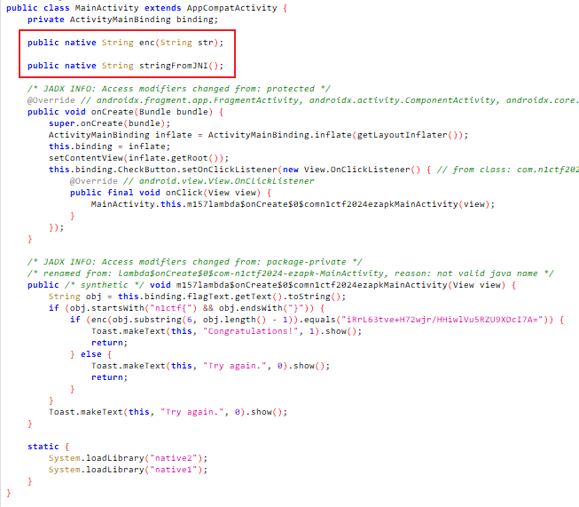
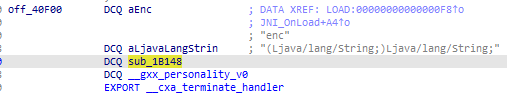
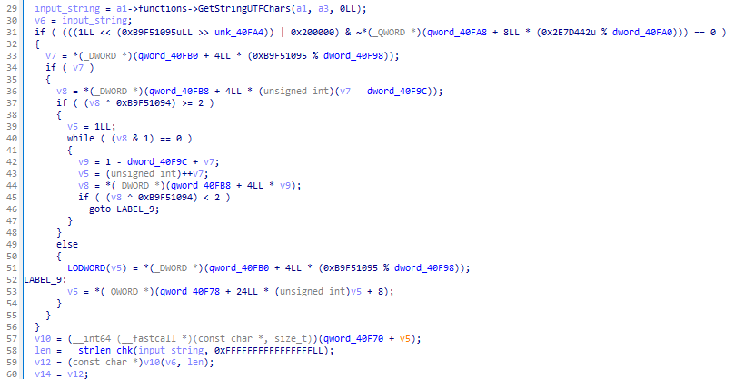

# ezapk

java层没啥逻辑，主要是native层。



在`libnative1.so`中`JNI_Onload`找到`method`表



里面有三个这个逻辑：



看`qword_40F70`怎么来的。


`/proc/self/maps`大致这样子：

```shell
star2qltechn:/ $ cat /proc/self/maps
555555554000-5555555b5000 r-xp 00000000 08:02 1678                       /system/bin/toybox
5555555b5000-5555555b9000 r--p 00060000 08:02 1678                       /system/bin/toybox
5555555b9000-5555555bb000 rw-p 00064000 08:02 1678                       /system/bin/toybox
5555555bb000-5555555bf000 rw-p 00000000 00:00 0                          [heap]
7ffff7200000-7ffff7600000 rw-p 00000000 00:00 0                          [anon:libc_malloc]
7ffff779d000-7ffff77a0000 r-xp 00000000 08:02 1277                       /system/lib64/libnetd_client.so
```

