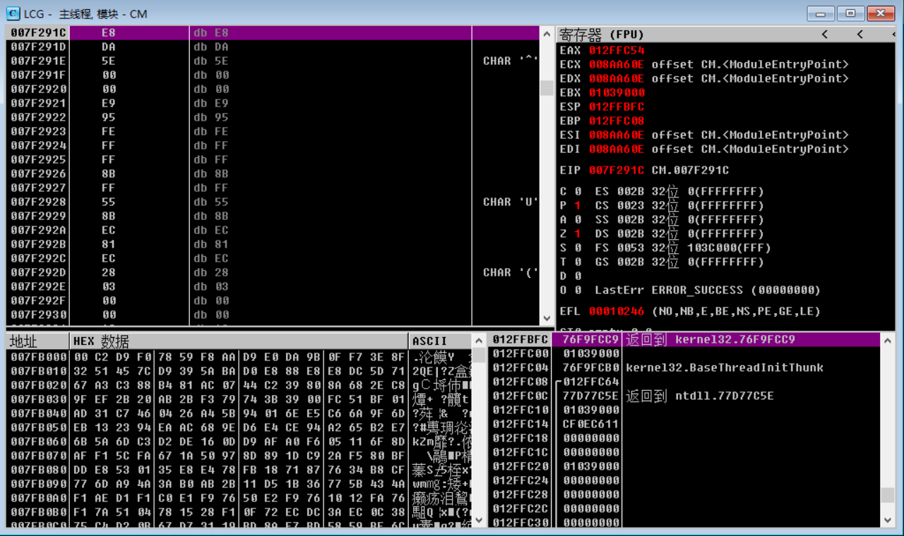

## opt

分析过程就不多说了，一条指令一条指令调出来的算法：

```Python
import string
import struct
from z3 import *

r = [
    0x00000000000000E1, 0x00000000000000FE, 0x00000000000000A3, 0x00000000000000CD,
    0x0000000000000036, 0x0000000000000082, 0x00000000000000CA, 0x00000000000000A5,
    0x00000000000000BE, 0x000000000000003F, 0x0000000000000005, 0x000000000000002B,
    0x00000000000000CD, 0x00000000000000B0, 0x0000000000000022, 0x000000000000008B,
    0x0000000000000054, 0x0000000000000019, 0x0000000000000000, 0x0000000000000083,
    0x00000000000000A6, 0x0000000000000078, 0x0000000000000095, 0x00000000000000B9
]
num_58_list = []
with open('num_50_list', 'rb') as f:
    content = f.read()
    for i in range(0, len(content), 8):
        num_58_list.append(struct.unpack('<Q', content[i:i+8])[0])

def enc_func(num_58, num_60):
    num_50 = 0
    for i in range(8):
        if num_58 & 1 == 1: # 低位是否为1
            num_50 = num_60 ^ num_50
        if num_60 & 0x80 == 0: # 高位是否为1
            num_60 = (num_60 << 1) & 0xFF
        else:
            num_60 = ((num_60 << 1) & 0xFF) ^ 0x1D # 0001 1101
        # num_60 = ((num_60 << 1) & 0xFF) ^ (0x1D)
        num_58 = num_58 >> 1
    return num_50

def enc(ptext):
    result = []
    for i in range(24):
        xor_num = 0
        for j in range(24):
            pchar = ord(ptext[j])
            for i in range(8):
                if num_58 & 1 == 1: # 低位是否为1
                    xor_num ^= num_60
                if num_60 & 0x80 == 1: # 高位是否为1,需要被模
                    num_60 = ((num_60 << 1) & 0xFF) ^ 0x1D # 0001 1101
                else:
                    num_60 = (num_60 << 1) & 0xFF
                num_58 = num_58 >> 1
        result.append(xor_num)
    return result
```

能力有限，看不出这个是有限域的矩阵乘法😭😭😭

看了我几个小时，逆不了这算法。

看了✌的WP：

```Python
import struct
mat = []
with open('num_50_list', 'rb') as f:
    content = f.read()
    for i in range(0, len(content), 8):
        mat.append(struct.unpack('<Q', content[i:i+8])[0])
target = [
    0x00000000000000E1, 0x00000000000000FE, 0x00000000000000A3, 0x00000000000000CD,
    0x0000000000000036, 0x0000000000000082, 0x00000000000000CA, 0x00000000000000A5,
    0x00000000000000BE, 0x000000000000003F, 0x0000000000000005, 0x000000000000002B,
    0x00000000000000CD, 0x00000000000000B0, 0x0000000000000022, 0x000000000000008B,
    0x0000000000000054, 0x0000000000000019, 0x0000000000000000, 0x0000000000000083,
    0x00000000000000A6, 0x0000000000000078, 0x0000000000000095, 0x00000000000000B9
]

import galois
import numpy as np
# 定义GF(2^8)
GF = galois.GF(2**8)
# 打印原根多项式
print(GF.irreducible_poly)
gf_mat = GF(mat).reshape(24, 24)
result = bytes(np.linalg.solve(gf_mat, GF(target)))
print(result)
```

## VMP2.07题目

VMP2.07的壳

### 脱壳

1. 右键 -> FKVMP -> start
   1. 记录`retn`地址：`0x96166E` (在Log data窗口)
   2. 
2. `Ctrl+G`搜索`VirtualProtect`，下断点
3. `F9`运行到堆栈区出现`NewProtect=PAGE_READONLY`
   1. 
4. 取消`VirtualProtect`断点，对代码段下内存访问断点（`ALT+M`打开Mamory map窗口），F9运行
   1. 
5. `Ctrl+G`搜索`retn`地址：`0x96166E`，下断点，F9运行
6. 取消代码段的内存访问断点，F9运行
7. 取消`retn`地址的断点
8. 给代码段下内存访问断点
9. F9运行来到OEP
   1. 

### 分析

#### key1

```assembly
.text:007F11B9                 push    offset aInputKey1 ; "Input Key1: "
.text:007F11BE                 call    printf
.text:007F11C3                 lea     eax, [ebp-11Ch]
.text:007F11C9                 push    eax
.text:007F11CA                 push    offset a250s    ; "%250s"
.text:007F11CF                 call    scanf
.text:007F11D4                 push    9
.text:007F11D6                 push    offset aEasystep1 ; "EaSyStEp1"
.text:007F11DB                 lea     ecx, [ebp-11Ch]
.text:007F11E1                 push    ecx
.text:007F11E2                 call    sub_7F2569
.text:007F11E7                 add     esp, 18h
.text:007F11EA                 test    eax, eax
.text:007F11EC                 jnz     loc_7F146C
```

输入后`key1`后，与`EaSyStEp1`一起进入`sub_7F2569`，第三个参数为9

```C
int __cdecl sub_7F2569(char *a1, _BYTE *a2, unsigned int a3)
{
    v13 = 0;
    if ( !a3 )
        return 0;
    if ( a3 < 5 )
    {...}
    else
    {
        v4 = a2;
        v5 = a1;
        while ( 1 )
        {
            v6 = *v5;
            v5 += 4;
            v4 += 4;
            if ( !v6 || v6 != *(v4 - 4) )
                break;
            v7 = *(v5 - 3);
            if ( !v7 || v7 != *(v4 - 3) )
            {
                v10 = (unsigned __int8)*(v5 - 3);
                v11 = (unsigned __int8)*(v4 - 3);
                return v10 - v11;
            }
            v8 = *(v5 - 2);
            if ( !v8 || v8 != *(v4 - 2) )
            {
                v10 = (unsigned __int8)*(v5 - 2);
                v11 = (unsigned __int8)*(v4 - 2);
                return v10 - v11;
            }
            v9 = *(v5 - 1);
            if ( !v9 || v9 != *(v4 - 1) )
            {
                v10 = (unsigned __int8)*(v5 - 1);
                v11 = (unsigned __int8)*(v4 - 1);
                return v10 - v11;
            }
            v13 += 4;
            if ( v13 >= a3 - 4 )
                goto LABEL_20;
        }
        v10 = (unsigned __int8)*(v5 - 4);
        v11 = (unsigned __int8)*(v4 - 4);
    }
    return v10 - v11;
}
```

一个字节一个字节的比较。`key1: EaSyStEp1`

#### key2

```assembly
.text:007F11FC                 lea     edx, [ebp-11Ch]
.text:007F1202                 push    edx
.text:007F1203                 push    offset a250s    ; "%250s"
.text:007F1208                 call    scanf
.text:007F120D                 add     esp, 0Ch
.text:007F1210                 lea     eax, [ebp-11Ch]
.text:007F1216                 lea     edx, [eax+1]
.text:007F1219                 lea     esp, [esp+0]
.text:007F1220
.text:007F1220 loc_7F1220:                             ; CODE XREF: .text:007F1225↓j
.text:007F1220                 mov     cl, [eax]
.text:007F1222                 inc     eax
.text:007F1223                 test    cl, cl
.text:007F1225                 jnz     short loc_7F1220
.text:007F1227                 sub     eax, edx
.text:007F1229                 lea     ecx, [ebp-11Ch]
.text:007F122F                 push    ecx
.text:007F1230                 lea     esi, [ebp-31Ch]
.text:007F1236                 mov     edx, eax
.text:007F1238                 call    base64
.text:007F123D                 push    9
.text:007F123F                 push    offset aEasystep2 ; "EaSyStEp2"
.text:007F1244                 mov     edx, esi
.text:007F1246                 push    edx
.text:007F1247                 call    memcmp
.text:007F124C                 add     esp, 10h
.text:007F124F                 test    eax, eax
.text:007F1251                 jnz     loc_7F146C
```

`EaSyStEp2`的base64编码：`RWFTeVN0RXAy`

#### key3

0x7F26C3 printf

0x7F26A6 scanf


key3部分还是无法正常看的，就动调了。

调出来OEP后，搜索`Next Key:`，下内存断点，F9运行，断在程序逻辑中。


程序key3逻辑部分有很多花指令，需要修改。

有些call是更改了返回地址的，单步步过会直接飞了。

可以在`0x7F26A6`即获取输入函数下断点（key1、key2逻辑很容易判断出哪一个是获取输入的函数），然后根据栈中的返回地址找到执行获取key3输入的地址。


进一步调试，来到这里，就是变化和验证key3的位置了。

验证比对的函数与key1逻辑中的是一样的。


循环异或key3：


故key3逻辑：

```Python
s1 = 'fseewefa'
s2 = 'EaSyStEp3'
flag = []
for i in range(9):
    flag.append(ord(s1[i % 8]) ^ ord(s2[i]))
print(flag)
print(bytes(flag))
# [35, 18, 54, 28, 36, 17, 35, 17, 85]
# b'#\x126\x1c$\x11#\x11U'
```

## ptrace题目


`orig_rax`字段是一个特别的字段，保存了发起系统调用的原始编号。

[linux 系统调用号表](https://blog.csdn.net/qq_29343201/article/details/52209588): `#define __NR_read 0`


在执行系统调用之前，内核会先检查当前进程是否处于被“跟踪”(traced)的状态。如果是的话，内核暂停当前进程并将控制权交给跟踪进程，使跟踪进程得以察看或者修改被跟踪进程的寄存器。


### 分析

```C
#include <sys/types.h>
#include <sys/wait.h>
#include <sys/user.h>
#include <sys/ptrace.h>
#include <unistd.h>
#include <stdio.h>
#include <string.h>
#include "./defs.h"
#include <sys/syscall.h>

int main(int argc, const char **argv, const char **envp)
{
    pid_t child;
    long long int status;
    struct user_regs_struct regs;
    child = fork();
    if (child == 0)
    {
        ptrace(PTRACE_TRACEME, 0, 0, 0);
        execl("puppet", "puppet", NULL);
    }
    printf("PID: %d\n", child);
    wait(&status);
    if (WIFEXITED(status))
        return 0;
    // 给系统调用下断点  在进入或退出都会断
    ptrace(PTRACE_SYSCALL, child, 0, 0);
    // HIDWORD(status)与wait(&status)无关，wait只会影响status的低八位
    // HIDWORD(status)其实为一个标志位，用来标记是否是系统调用退出
    // 0 为 进入，1 为 退出
    HIDWORD(status) = 0;
    unsigned long long int rsi = 0;
    // 开启循环，获取trace进程的用户输入的数据
    while (1)
    {
        wait(&status);
        if (WIFEXITED(status))
            break;
        // 获取系统调用号, 120为orig_rax的偏移量
        long int orig_rax = ptrace(PTRACE_PEEKUSER, child, 120, 0);
        // SYS_read
        if (!orig_rax) // 如果系统调用号为0 -> read
        {
            // 获取寄存器的值
            ptrace(PTRACE_GETREGS, child, 0, &regs);
            // 判断HIDWORD(status) 是否为系统调用退出状态
            // 只有系统调用退出,用户才输入完数据的
            if (HIDWORD(status)) {
                // 如果rax(调用返回值)不为0，说明读取到的数据长度大于0
                // 如果rsi不为0，说明读取到的数据存放在rsi中
                if (rsi && regs.rax)
                {
                    size_t size = 8 * ((regs.rax >> 3) + 1);
                    for (size_t i = 0; i <= (size + 6); i += 8)
                    {
                        // 获取用户输入的数据(8字节)
                        long data = ptrace(PTRACE_PEEKDATA, child, rsi + i, 0);
                        long temp = data;
                        *((char *)&temp) = *((char *)&data + 5);
                        *((char *)&temp + 1) = *((char *)&data + 7);
                        *((char *)&temp + 2) = *((char *)&data + 6);
                        *((char *)&temp + 5) = *((char *)&data);
                        *((char *)&temp + 6) = *((char *)&data + 2);
                        *((char *)&temp + 7) = *((char *)&data + 1);
                        for (size_t j = 0; i + j < regs.rax && j <= 7; j++)
                            *((char *)&temp + j) -= i + j;
                        *((char *)&temp + 3) = *((char *)&data + 4);
                        *((char *)&temp + 4) = *((char *)&data + 3);
                        printf("Data: %lx\n", temp);
                        // 将更改的数据放回原来的位置
                        ptrace(PTRACE_POKEDATA, child, rsi + i, temp);
                    }
                    rsi = 0;
                    break;
                }
                // 标志变量翻转
                HIDWORD(status) = 0;
            } else {
                // 标志变量翻转
                HIDWORD(status) = 1;
                // 如果rdi为0，说明从标准输入获取数据
                // 则将rsi设置为rsi的值
                if (!regs.rdi)
                    rsi = regs.rsi;
            }
        } 
        // else if (orig_rax == 1) 
        // {
        //     // 这里是用来测试PTRACE_SYSCALL是否是在进入或退出时下断的
        //     // 通过输出可以看出，其输出了两次一模一样的内容
        //     printf("syscall write\n");
        //     ptrace(PTRACE_GETREGS, child, 0, &regs);
        //     printf("rax: 0x%lx\n", regs.rax);
        //     printf("rdi: 0x%lx\n", regs.rdi);
        //     long data = ptrace(PTRACE_PEEKDATA, child, regs.rsi, 0);
        //     printf("write data: %lx\n", data);
        // }
        ptrace(PTRACE_SYSCALL, child, 0, 0);
    }
    ptrace(PTRACE_SINGLESTEP, child, 0, 0);
    int v9 = 0;
    long key[6] = {
        0xA39C3E6994313F40, 0x17872470565B9B60, 0x11A918AABA97CA68, 
        0xB8F1B0AB9B3DD3B0, 0x488749FB6A1835E4, 0x82926F78FE98158
    };
    while (1)
    {
        wait(&status);
        if (WIFEXITED(status))
            break;
        struct user_regs_struct regs;
        long rip = ptrace(PTRACE_PEEKUSER, child, 128LL, 0LL);
        long instruction = ptrace(PTRACE_PEEKDATA, child, rip, 0LL);
        // 判断是否执行到如下指令(**)
        // 对用户输入数据进行异或0x28的部分
        // .text:0000000000001285 8B 45 A4          mov     eax, [rbp+var_5C]
        // .text:0000000000001288 48 98             cdqe
        // .text:000000000000128A 0F B6 44 05 B0    movzx   eax, [rbp+rax+buf]
        // .text:000000000000128F 83 F0 28          xor     eax, 28h
        // .text:0000000000001292 89 C2             mov     edx, eax            ** 
        // .text:0000000000001294 8B 45 A4          mov     eax, [rbp+var_5C]   ** 将index放入rax
        // .text:0000000000001297 48 98             dqe
        // .text:0000000000001299 88 54 05 B0       mov     [rbp+rax+buf], dl
        // .text:000000000000129D 83 45 A4 01       add     [rbp+var_5C], 1
        if (
            (rip & 0xFFF) == 0x292 && 
            (instruction & 0xFFFFFFFFFFLL) == 0xA4458BC289LL
        )
        {
            ptrace(PTRACE_GETREGS, child, 0LL, &regs);
            unsigned int index = \
                (unsigned int)ptrace(PTRACE_PEEKDATA, child, regs.rbp - 0x5C, 0LL);
            // 异或结果 + key[index]
            regs.rax += (unsigned int)key[index];
            ptrace(PTRACE_SETREGS, child, 0LL, &regs);
            v9 = 1;
        }
        ptrace(PTRACE_SINGLESTEP, child, 0LL, 0LL);
    }
    do
    {
        ptrace(PTRACE_CONT, child, 0, 0);
        wait(&status);
    }
    while (!WIFEXITED(status));
    return 0;
}
```

### exp

```Python
import struct
key = [
    0xA39C3E6994313F40, 0x17872470565B9B60, 0x11A918AABA97CA68, 
    0xB8F1B0AB9B3DD3B0, 0x488749FB6A1835E4, 0x082926F78FE98158
]
key = struct.pack('Q'*6, *key)
key = list(key)
ct = [
    0x9C, 0x56, 0x89, 0xF3, 0xC1, 0x41, 0xDE, 0xE3, 
    0xD1, 0x9B, 0x6C, 0xA4, 0xB1, 0xA2, 0x00, 0x35, 
    0x81, 0xD4, 0x10, 0xD0, 0xF3, 0x29, 0x0A, 0x89, 
    0x13, 0x45, 0xA0, 0x08, 0xCA, 0x1F, 0x0F, 0x20, 
    0x00, 0x4F, 0x56, 0x81, 0x03, 0x5B, 0xAB, 0xC3, 
    0xC7, 0xFD, 0xF7, 0xBB, 0x09, 0x3B, 0x95, 0x08
]
flag = []
for i in range(48):
    # ct[i] = ((input[i] ^ 0x28) + key[i]) & 0xFF
    flag.append(((ct[i] - key[i]) & 0xFF) ^ 0x28)
for i in range(0, 48, 8):
    t = [0] * 8
    flag[i + 3], flag[i + 4] = flag[i + 4], flag[i + 3]
    for j in range(8):
        flag[i + j] += i + j
    t[0] = flag[i + 5]
    t[1] = flag[i + 7]
    t[2] = flag[i + 6]
    t[5] = flag[i + 0]
    t[6] = flag[i + 2]
    t[7] = flag[i + 1]
    flag[i:i+3] = t[0:3]
    flag[i+5:i+8] = t[5:8]
print(''.join([chr(i) for i in flag]))
```

## easy_iot

VMP的壳：


直接运行程序，程序会等待输入，直接暂停程序，然后输入数据，程序就会停下来：


一直执行到返回，跳出调用链，直到这里：


```Python
data = [
	0x04, 0x0E, 0x03, 0x05, 0x19, 0x26, 0x50, 0x53, 0x51, 0x23, 
	0x52, 0x20, 0x56, 0x21, 0x27, 0x54, 0x56, 0x55, 0x52, 0x56, 
	0x51, 0x57, 0x51, 0x21, 0x57, 0x56, 0x55, 0x54, 0x52, 0x20, 
	0x24, 0x24, 0x55, 0x5A, 0x57, 0x26, 0x5B, 0x1F, 0x00, 0x00
]
for i in data:
	print(chr(i ^ 0x62), end="")
```

## easyshell

靠包判断为冰蝎


使用默认密码进行AES解密：

默认密码：`e45e329feb5d925b`，IV全0


第一个包解密如下：

```php
@error_reporting(0);
function main($content)
{
    $result = array();
    $result["status"] = base64_encode("success");
    $result["msg"] = base64_encode($content);
    @session_start();  //初始化session，避免connect之后直接background，后续getresult无法获取cookie

    echo encrypt(json_encode($result));
}

function Encrypt($data)
{
    @session_start();
    $key = $_SESSION['k'];
    if(!extension_loaded('openssl'))
    {
        for($i=0;$i<strlen($data);$i++) {
            $data[$i] = $data[$i]^$key[$i+1&15];
        }
        return $data;
    }
    else
    {
        return openssl_encrypt($data, "AES128", $key);
    }
}
$content="UXhRWFBpb09IdG5Pc08zaTJMM2ZZWjE2Unl2dzQ1WVloYU5XWEhXS1l5dVJkQ2RFazVXWWJZM0RoSlpub2x4VFBXeU5JUGRPRTZ4RUdJWktybVJJcVhTSkVWNEVyeTZmcjRlYWxLbFZiZjJ4TUx3Snk5ZUxGSVdpbnh4NGZ3QW0ydjBpYXpOUmpBOXJKUzNXc1FJVjFwRjJPMXZKMEtPU0w5ZUxRRUs3bE5MZWNTQUJpM05aSTJhTXlMZzlGRERINU1jQkI0bGVQQU1vUlhWdlBDSjluSWxMTEY4UUhhTERFWFFzaWVPR3p0QzRlMms5ZWtiSWdsTEVVUlVYb2t3ZVA1VHFmOWZ1N1lveXc3OTVFRFllTVNOcXJXUktYZUhrc20yQ2p5YW5UQTVhbm9zY1NETXpQMkQ5UnM2TmtUQlBSenZxY0Yybm1qbHRHSEF2Ym1OV1hXb3RTT1lKMUhxNmRtRU5vN2g3NkpxWnRralc4a2lUQ0c5WlFwT0NkeHpOa0cwNXRobktWTURhRGdxQ0E2bENFM2t3ZXk2Njh3ZzB5ZG9LcEl3aUtjMlVPWkVVenRpTFZySDV1NEVXSENoWWNRaUZLM2hPQWp2bzZBMTFncHMyWm1KVldWNHltSUtzM0tvd1dhSVBvTzljNWVNT3BMb0swSU4yWElTU3BxbDFzaEFIWkVHS09MOTRwZGx4OUxJQ3Vsek5jM3M1NkFtdnlMTjR3dUJsM0dQUlNxYzJzMGdwS2Vmamx5Nkh6R2E3TWxtbWxmZW5xRlpaNDN6YXBHTURPcDZLQTJkUXdpS1NWWHhKbGlZbjZDWWRsWGE2d085bzE3RjlLcUpyejNmS2xYY3ZBeGhmdFNFUHpnTGhsWllXbk5weDlxbUV4cjNFZjNJaDNuRWU1cldqMXlCa0plRko5bzJxN2hkSDQ5eVBWNThqdVZoTXJSSmhpcTE3Qzg1UkhxZ3JuYmZqSmFCTEVSRzVXQ1dFOE00VDRpcWFDN0FnbXlXTEhIOFcycHE5bVBjZXczYVR4V0NBWVlPZ0QydWZsdWRhU1RTdVdqRTRlMDJ5ZzhxOHZZRW95dEpjTGRhdVlJQWJDQU5OcEdzTTBDN05YQ2ZLaktsaVpZc0o3YXNQVElaVFc1c0p3UklHbk5hUVNIRmY4aWFvZFRMUUY3QmxzRGVFQWVPTkFCTjlKc2w5NWg2SUlrMjZwSTM1YndMWWZ2VkJ4UGpJdExMazcyR0cyYXFnUHN4M2p6TDl3T0dLT2Q3MzR2ZmNBQ0RaUVZueERXN0YwWHU5TmRyUHBwbnNoTDdHd0wzUnFPVDlad3pISUM5M3ZmMDhQbDBOUFpGUW1ia3RFeE1iOVcwTkJGYjJFaUh2ZkdRc3ZweTZjWUt1cmdiSFg4TVVSVmhCTnYzSUNseDlBdVdTTFhybEppR1RGOFV2cWxiZmk0S29JMDZJZ0FrUjFKRUtsMFlBRGswajdrSncyZ1JqU0FlTmJEZ0NsZHhuVWwwQU5vaVVQNDRhenV1NjJXNVBTYUhNaDNKVmR2cWU2c21kZDZNSzlHekhFczJGTzdDMVRDeFdJS3k3dnFxOUFEQlptbFdRaDYxbVFjWXN6dVFqRjloY1R5aEs5RUgzTm96U2dGeTVVVzBMMkZUS3ZlSHZUNmNZWXFSV0lhYkNvRkJqdzNpTzFLRlVHZnBhVlk1MHl2ZkJNTjBacUxHcGVCMTRXS0taNWgwY0Z0c3RWVzVidXlhRWRuZ3M3MWtIYWFiNURqWTVubGNOSkdpSkFSSUwwNEJjS0IyYjNJckhYZEMzTmZieHptU0J3SlZBZEYyQ1N6Q1JQa1g3R2FBdklvME1QTmQ2UFFtQmlPNWYxYThvSTJaZk02bkk0b01CVmhLWTRHWElTcFkzaGtUaEN5SUhrbWVTRTRpdXoxZlZFR0liVXdJZlpBOEhCRFBsYUpXUUJxNGphOGJJVlpodHdVR2dHd3FOakRCNldka0cwdXJqclFOZVhKbXlHYXN5TGZ3bURIUVQwd0VNR3M3b3ZIZDI1emdyNGRneWF1MkoxdXdVTHR3NXZmNUpOU0NLWTRWV3hSY0pZbXJZenFUVXNQY0FZSjBIMHVzeWUwc1pLaDJ6djhSVk1OVjNCdGtFZm9nYlRmcUtOYTVUZEtUbkxlNVJhd3RDR0NWUHlqSXpBaWUyUnpzOVRQMU1KbnlCRFVkOEswZDNRRklPdDRKc2hGWU5ZbGEzcXJiWjY0R0EzRERmT2E4MEg0QXo2R0Y2cE5hUzA3ZG51a2h4VE02d1dsZ0VpT2RsNno5S1Fha3VQaXFQbG1VSkFBSlZ3MkRnaktuVGk3U0xBYVFkb3BBTlFDcHk2YThiRmlHR3VXVDVVZ0I5d3E3RFpjTE51M2RMdnJQdVhjN0dNdlJTazFRUGNWQU9QVnJrazVwTWZRU08zOTZFZGhyZzRUc0IyZUtiSDBicFhRcjFhbWFhTTVySG5UWkFTMGZURGhYZGo3U3M5THRvSDVKNFlta1VkUURCNlpjZXRncFZIS1hiY05nTWhFMXQ4ZmZ5aWswdTJJUjlaOXZDYU5xekRBMnd4OEhpclI4Q2FwZEdGMFFRVkd6dzBxMndOd2pHOVVxZDJYcTd6Z2pCdnBKaWxIN3NXQ3dHc25oMU9PeUJ0M01XU29mN2tBSHp0ZHAxVk4ySE9MSElaaVdMalVDc0tOVERTMXFGeGpGdkRqU0tLMGV6ZXhhN0lJenU0VEhlazZyMkdqSTJ4bHloY3laVDRNcUdPUUZsM0w5OXhTaEtjTnVyMzZlTDNFd3hQVHd1M216alNBWmR0U0JWUzF6V3lUaGY4UE1LWk9hSlBBSnRRZUoweWxaS0J4V2g1eEloa0NLR2RtSGV2bFV4eWZ2VFJsVWs3Q0hJSTVsM09wbENIdDd3ZmNmR3dNSTZHblpLQ3JhSFAxVm9BeDlRRG5zTjVvcklLc3ZpWTF4RXpTZ3BNNlYxNmhRQjNWRzNXeExaeXE3OEI4U0h0VW1pU1BlZXJmSE8zUjd2R2hOZTIwd1ZWenR4a2Y0U3FtUnlmbkJPVTZDb3lDZUY4V3FIYkN0bHZ5MVY2OHdQTlN3S0hVMk96eU5PZzk2aVE1WEtFY0tLZ3M2TTVHR1p2MEVMTWZBU25oYWNKT1NjYjZoYk1kdWx1UGR2WldvdFJQenhqYjVoZ1pqcDdTZW1aZzI1NTF4N2lMcHZ5NDluOGpMaTYxUzRmd05YUzZLM1F4YmNhZjJneUR6WGVySXlxNnhvbnNCdkI3dGdtclBuOW01RjJKT0I2dFVDYnZvekhSNEhLeGNWeG9iVG5jc1B1TE1ZVFpKcmRpNEwxT0JkU1NxQ2hOM2xTR3hxbm5LUXlkQ0R2NTZvUFRCYjZvbjZtU0oyNENhOEJXWnBNenB3cDFqUFlGSk5WTDNUQUQxRnd5cHN4TFJ6WjVhQTdGTGtneGtTNk84S2ZiZWtYR3VMRDFCbUlWOW9OVnRvS3NON0JKRE9oMHJZQUhxNmlCaDh2NHd3Yk5KYjhueU44WEhRVnF3dExFbW9DTXhkNVJTejZuNnVzVUVaZmxEbDlDQUt6b25QdzU5aHdDZ0hQbnpodnZ1RUoyS0ZWM2x0M2d4ckVGYzdFVzVvSmxiNzBv";$content=base64_decode($content);
main($content);
```

解密1278和1982的内容，分别为zip文件和一个字符串。


字符串为：


zip文件有密码，里面有两个文件：


字符串`Hello, but what you're looking for isn't me.`长度恰好与`secret2.txt`相同，且压缩后CRC相同。


使用`bkcrack`进行明文攻击：

* `-C`：指明加密的zip文件
* `-c`：zip文件中知道明文的被加密的文件（文件名，不要加`./`）
* `-p`：被加密文件的未加密版本
* `-k`：解密得到的密钥

```shell
> D:\CTF\Tool\bkcrack-1.6.1-win64\bkcrack.exe -C .\download.zip -c secret2.txt -p .\secret2.txt
bkcrack 1.6.1 - 2024-01-22
[16:27:27] Z reduction using 37 bytes of known plaintext
100.0 % (37 / 37)
[16:27:27] Attack on 207115 Z values at index 6
Keys: e0c271a4 cbd76d08 8d707128
10.0 % (20671 / 207115)
Found a solution. Stopping.
You may resume the attack with the option: --continue-attack 20671
[16:27:40] Keys
e0c271a4 cbd76d08 8d707128

> D:\CTF\Tool\bkcrack-1.6.1-win64\bkcrack.exe -C .\download.zip -c secret1.txt -k e0c271a4 cbd76d08 8d707128 -d secret1.txt
bkcrack 1.6.1 - 2024-01-22
[16:30:49] Writing deciphered data secret1.txt (maybe compressed)
Wrote deciphered data.

> cat .\secret1.txt
flag{70854278-ea0c-462e-bc18-468c7a04a505}
```

## remaaaa

有符号表，逻辑还是简单的：

```C
int __fastcall main(int argc, const char **argv, const char **envp)
{
    _main(argc, argv, envp);
    Str = (char *)malloc(0x1Eui64);
    memset(Str, 0, 0x1Eui64);
    if ( (unsigned __int8)password(Str) )         // aaaaaaassss
    {
        v3 = std::operator<<<std::char_traits<char>>(refptr__ZSt4cout, Str);
        std::ostream::operator<<(v3, refptr__ZSt4endlIcSt11char_traitsIcEERSt13basic_ostreamIT_T0_ES6_);
        v4 = std::operator<<<std::char_traits<char>>(refptr__ZSt4cout, "Please input your flag:");
        std::ostream::operator<<(v4, refptr__ZSt4endlIcSt11char_traitsIcEERSt13basic_ostreamIT_T0_ES6_);
        input = (char *)malloc(0x64ui64);
        std::operator>><char,std::char_traits<char>>(refptr__ZSt3cin, input);
        memset(output, 0, sizeof(output));
        key = &Str[-48 * strlen(Str) + 768];
        generate_CK();
        sm4_encrypt(input, key, output);
        check(key, output);
    }
    return 0;
}

__int64 __fastcall password(char *a1)
{
    ...
    v11 = 0x3C;
    v12 = 0x26;
    v13 = 0x63;
    v14 = 0xC2;
    v15 = 0x1E;
    v16 = 0x72;
    v17 = 0xCE;
    v18 = 0x78;
    v1 = std::operator<<<std::char_traits<char>>(refptr__ZSt4cout, "Let's play a game!");
    std::ostream::operator<<(v1, refptr__ZSt4endlIcSt11char_traitsIcEERSt13basic_ostreamIT_T0_ES6_);
    v2 = std::operator<<<std::char_traits<char>>(refptr__ZSt4cout, "If you win, I will give my password to you!");
    std::ostream::operator<<(v2, refptr__ZSt4endlIcSt11char_traitsIcEERSt13basic_ostreamIT_T0_ES6_);
    v3 = std::operator<<<std::char_traits<char>>(refptr__ZSt4cout, "Start!");
    std::ostream::operator<<(v3, refptr__ZSt4endlIcSt11char_traitsIcEERSt13basic_ostreamIT_T0_ES6_);
    y = 2;
    x = 7;
    y_aim = 6;
    x_aim = 0;
    v21 = 0;
    do
    {
        std::operator>><char,std::char_traits<char>>(refptr__ZSt3cin, &input_chr);
        *a1++ = input_chr;
        if ( input_chr == 'd' )
        {
            if ( ++x > 7 )
                --x;
        }
        else if ( input_chr > 100 )
        {
            if ( input_chr == 's' )
            {
                if ( ++y > 7 )
                    --y;
            }
            else if ( input_chr == 'w' )
            {
                --y;
                y += y < 0;
            }
        }
        else if ( input_chr == 'a' )
        {
            --x;
            x += x < 0;
        }
        if ( ++v21 <= 11 && y == y_aim && x == x_aim )
        {
            v4 = std::operator<<<std::char_traits<char>>(refptr__ZSt4cout, "You win!");
            std::ostream::operator<<(v4, refptr__ZSt4endlIcSt11char_traitsIcEERSt13basic_ostreamIT_T0_ES6_);
            std::operator<<<std::char_traits<char>>(refptr__ZSt4cout, "Here is the password:");
            return 1i64;
        }
        if ( y == y_aim && x == x_aim )
        {
            v6 = std::operator<<<std::char_traits<char>>(refptr__ZSt4cout, "You lose!");
            v7 = std::ostream::operator<<(v6, refptr__ZSt4endlIcSt11char_traitsIcEERSt13basic_ostreamIT_T0_ES6_);
            v8 = std::operator<<<std::char_traits<char>>(v7, "Too Slow!");
            std::ostream::operator<<(v8, refptr__ZSt4endlIcSt11char_traitsIcEERSt13basic_ostreamIT_T0_ES6_);
            return 0i64;
        }
    }
    while ( v21 <= 20 );
    v9 = std::operator<<<std::char_traits<char>>(refptr__ZSt4cout, "You lose!");
    std::ostream::operator<<(v9, refptr__ZSt4endlIcSt11char_traitsIcEERSt13basic_ostreamIT_T0_ES6_);
    return 0i64;
}
```

`password`函数很简单`aaaaaaassss`过了就好（不唯一），但长度一定为11。

之后就是获取输入然后SM4加密，比较验证。

主要是`key`，`key = &Str[-48 * strlen(Str) + 768];`这个获取很迷，动态调试运行，每次都不一样。

猜测是有反调试的，但看了一圈没找到，直接选择附加了。

程序在获取flag的时候，进行附加，然后这一次可以看到`key`为全0字节。

已知走到比较验证部分：

把`cipher`数据patch为`v6`的数据，直接运行就会打印`flag`了：`flag{2d8fad_980asf_k2p14o}`

```C
for ( i = 0; i <= 255; ++i )
{
    v8 = cipher[i] == (unsigned __int8)v6[i];
    if ( !v8 )
        break;
}
if ( v8 )
{
    v2 = std::operator<<<std::char_traits<char>>(refptr__ZSt4cout, "Right!Here are your flag:");
    std::ostream::operator<<(v2, refptr__ZSt4endlIcSt11char_traitsIcEERSt13basic_ostreamIT_T0_ES6_);
    sm4_decrypt(cipher, key, v5);
    return printf("%s\n", (const char *)v5);
}
else
{
    v4 = std::operator<<<std::char_traits<char>>(refptr__ZSt4cout, "Wrong!");
    return std::ostream::operator<<(v4, refptr__ZSt4endlIcSt11char_traitsIcEERSt13basic_ostreamIT_T0_ES6_);
}
```

