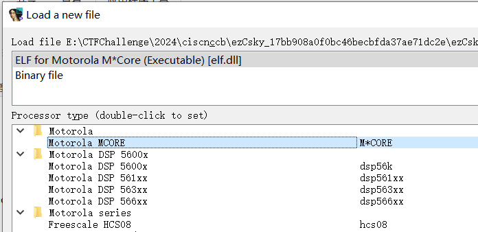
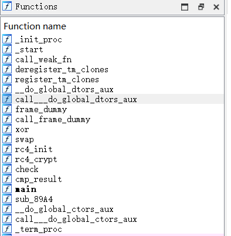
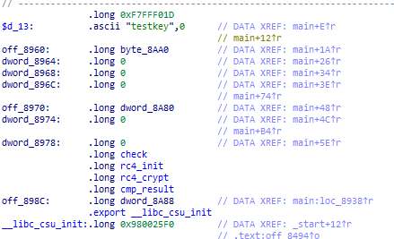
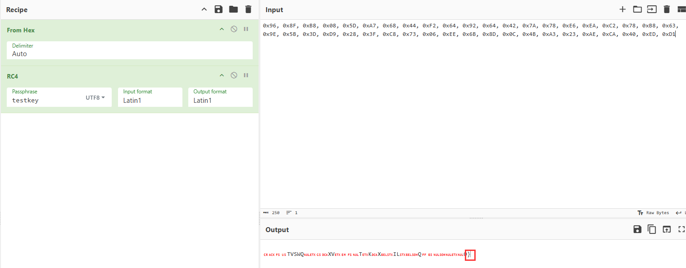
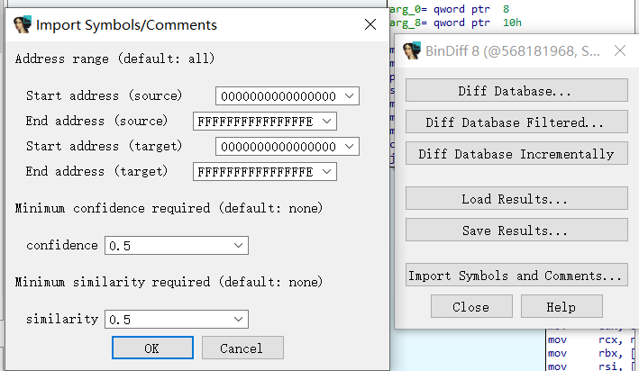
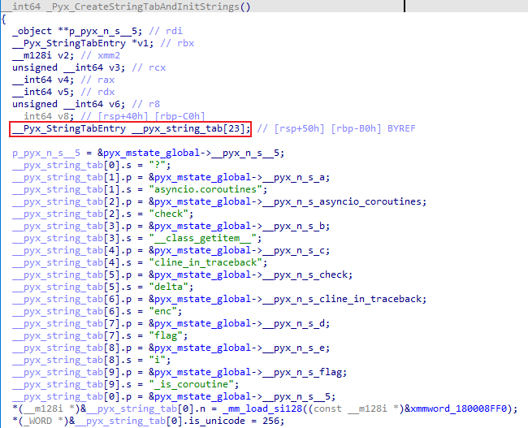
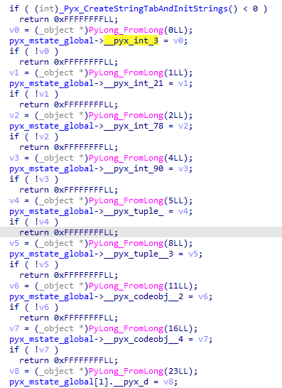
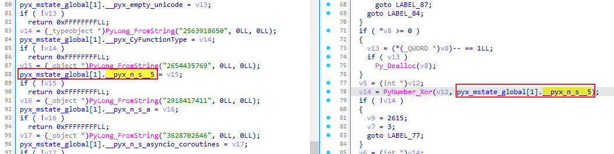
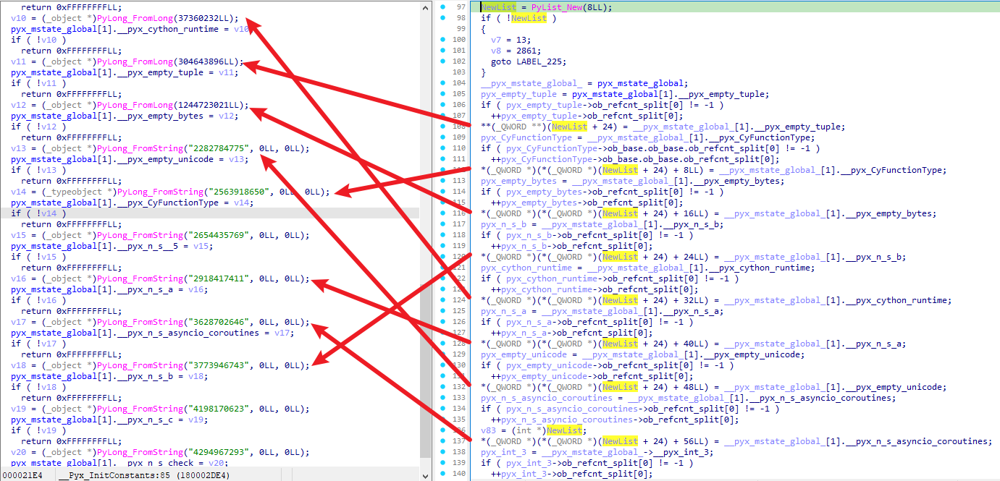

# ezCsky

找半天，找到个[M-CORE_IDA-Pro/mcore.dll at master · MotoFanRu/M-CORE_IDA-Pro](https://github.com/MotoFanRu/M-CORE_IDA-Pro/blob/master/mcore.dll)



能瞅瞅逻辑了。

看到 `rc4` 等函数：



再看到这些变量：



猜测 `testkey` 是密钥， `byte_8AA0` 是结果。



最后一个大括号，直接猜测相邻的异或。

```python
from Crypto.Cipher import ARC4

data = [0x96, 0x8F, 0xB8, 0x08, 0x5D, 0xA7, 0x68, 0x44, 0xF2, 0x64, 0x92, 0x64, 0x42, 0x7A, 0x78, 0xE6, 0xEA, 0xC2, 0x78, 0xB8, 0x63, 0x9E, 0x5B, 0x3D, 0xD9, 0x28, 0x3F, 0xC8, 0x73, 0x06, 0xEE, 0x6B, 0x8D, 0x0C, 0x4B, 0xA3, 0x23, 0xAE, 0xCA, 0x40, 0xED, 0xD1]
key = b"testkey"
cipher = ARC4.new(key)
data = cipher.decrypt(bytes(data))
data = bytearray(data)
for i in range(len(data) - 2, -1, -1):
    data[i] ^= data[i + 1]
print(bytearray(data).decode())
```

# dump

有提示：

> 字符编码算法
>
> 注意：正确的flag长度为22，第13位为4

通过尝试，发现是单字节加密，且位置无关：

```
.\re.exe flag
23291e24

.\re.exe fla1
23291e1c
```

直接开始爆破：

```python
import subprocess
exe_path = './re.exe'
table = {}
chartable = "0123456789abcdefghijklmnopqrstuvwxyzABCDEFGHIJKLMNOPQRSTUVWXYZ{}="
for i in chartable:
    process = subprocess.Popen(f"{exe_path} flag{i}", stdout=subprocess.PIPE, stderr=subprocess.PIPE)
    stdout, stderr = process.communicate()
    out = stdout.decode()
    # print(f"{exe_path} flag{i} -> {out}")
    if out[8:] == '':
        print("No output")
        continue
    v = int(out[8:], 16)
    if v in table:
        print(f"Duplicate value {v} for {i}")
    table[v] = i
with open('flag', 'rb') as f:
    data = f.read()
flag = ''
for i in data:
    flag += table[i]
print(f"final {flag}")
```

有几个重复的：

```
python .\exp.py
Duplicate value 0 for 3
Duplicate value 0 for 4
Duplicate value 0 for 5
Duplicate value 0 for 6
Duplicate value 0 for 7
Duplicate value 0 for 8
Duplicate value 0 for 9
final flag{MTczMDc9MzQ2Ng==}
```

根据提示，flag 为 `flag{MTczMDc4MzQ2Ng==}`

# rand0m

先 help 看看：

```
>>> import rand0m
>>> help(rand0m)
Help on module rand0m:
NAME
    rand0m
FUNCTIONS
    check(flag)
    rand0m(x)
DATA
    __test__ = {}
FILE
    e:\ctfchallenge\2024\ciscn&ccb\rand0m_84de0f4fbc09d405e40850e97a05765f\rand0m.pyd
```

hook 一下：

```python
class Symbol:
    def __init__(self, name):
        self.name = name

    def __eq__(self, other):
        print(f"Comparing {self.name} and {other:08x}")
        if isinstance(other, Symbol):
            return self.name == other.name
        return self.name == other

import rand0m
tempcheck = rand0m.check
temprand0m = rand0m.rand0m

def mycheck(flag):
    print("Checking flag: ", flag, end=" ->\n")
    result = tempcheck(flag)
    print("Result: ", result)
    return result
    
def myrand0m(x):
    print("\tRandom: ", x, end=" -> ")
    result = temprand0m(x)
    print(f"\tResult: ({result[0]:08x}, {result[1]:08x})")
    result = (Symbol(f"{result[0]:x}"), Symbol(f"{result[1]:x}"))
    return result
    
rand0m.check = mycheck
rand0m.rand0m = myrand0m
flag = "1234567890abcdef1234567890abcdef"
print(rand0m.check(flag))
```

得到输出：

```
Checking flag:  1234567890abcdef1234567890abcdef ->
        Random:  12345678 ->    Result: (8c219e43, 22006781)
Comparing 22006781 and 12287f38
        Random:  90abcdef ->    Result: (cd1312bc, 0a38def9)
Comparing a38def9 and 4a30f74d
        Random:  12345678 ->    Result: (8c219e43, 22006781)
Comparing 22006781 and 023a1268
        Random:  90abcdef ->    Result: (cd1312bc, 0a38def9)
Comparing a38def9 and 88108807
Result:  False
False
```

输出变一下，可以判断 check 把每8个hex字符放到 rand0m，然后得到两个结果。

通过自定义的 Symbol Class，可以知道返回结果的第二个与数据进行比较。

去看 pyd：

通过字符串 `rand0m.rand0m` 来找到 `sub_7FF885D712B0`，分析一下可以得到逻辑：

```python
def myrand0m(x):
    x = int(x, 16)
    t2 = x >> 5
    x1 = x << 4
    t4 = x1 &  
    t5 = t2 >> 23
    t6 = t4 + t5
    t1 = x ^ 
    t1 = t1 >> 11
    t8 = t1 ** 
    t9 = t8 % 
    return (t9, t6)
```

空着的操作数我没找到。

首先看 `t6`，其左移和右移其实没损失信息，主要需要看 `&` 的参数，直接输入 `x` 为 `0xFFFFFFFF`，这样 `&` 之后哪里为0，则 `&` 的参数哪里为 `0`。

输入 `FFFFFFFF`，得到 `fa3affff`，则 `&` 的参数为 `0xFA3AFFFF`：

```
def myrand0m1(x):
    x = int(x, 16)
    x1 = x << 4
    # 0xA3A -> 1010 0011 1010
    t4 = x1 & 0xFA3AFFFF
    t5 = x >> 28
    t6 = t4 | t5
    return t6
```

由于 `myrand0m1` 包含 `&`，有信息损失，`6` 个bit，所以会有 `2**6` 个结果可以得到答案。

这里遍历 `2**6` 个结果，然后通过 `rand0m.rand0m` 的第一个结果来筛选。

通过 `rand0m.rand0m` 的第一个结果通过选择一个符合第二个结果验证的输入来得到。

爆破脚本：

脚本有点bug，但还是能出结果

```python
final2 = [0x98d24b3a, 0xe0f1db77, 0xadf38403, 0xd8499bb6]
flag = [0x812287f3, 0xd4a30f74, 0x8023a126, 0x78810880]

# # 0xA3A -> 1010 0011 1010
# 0xFFA3AFFF
base = "101000111010"
idx = [1, 3, 4, 5, 9, 11]
flag_str = [[] for i in range(4)]
for z in range(4):
    for i in range(2 ** 6):
        test = flag[z]
        i_str_bin = format(i, '06b')
        for j in range(6):
            test = test | (int(i_str_bin[j]) << (23 - idx[j]))
            r = rand0m.rand0m(f"{test:08x}")
            if r[0] == final2[z]:
                print(f"idx: {z} Testing: {i_str_bin} -> {test:08x}: {test:032b}")
                flag_str[z].append(f"{test:08x}")

print(flag_str)
```

## 学习

[2024 CISCN x 长城杯铁人三项 初赛 WriteUp By A1natas](https://mp.weixin.qq.com/s?__biz=MzkxMTc0NjU0OQ==&mid=2247484122&idx=1&sn=b57e5a8594dbf4c7f70601ee56d43ba9&chksm=c0c092a4268d4ddb8432d0f212d124b3cb944ac4d1f56cf57f2f009220505ae22e1603fcde59&mpshare=1&scene=23&srcid=1216RhQCR1SYFHuqfx0RuoTU&sharer_shareinfo=22f5d8e6ca592074cccdd911228762f0&sharer_shareinfo_first=22f5d8e6ca592074cccdd911228762f0#rd)👈网上看到师傅的做法，学习一下。

用相同的版本 Python3.12 编译一份 pyd 来恢复符号。

`test.py`：

```python
def check(flag):
    print(flag)
    t = [0] * 7
    t[5], t[6] = rand0m(flag)
    a = 12 * 45
    t[0] = a
    b = a & 0xffff
    t[1] = b
    c = b + 78
    t[2] = c
    d = c ^ 90
    t[3] = d
    e = d - 21
    t[4] = e
    return t


def rand0m(x):
    return (x + 1, x ^ 3)

__test__ = {}
```

`build.py`：

```python
from setuptools import setup, Extension
from Cython.Build import cythonize

ext_modules = [
    Extension(
        name = "test",
        sources = ["test.py"],
        extra_compile_args = ["/Zi"],
        extra_link_args = ["/DEBUG"]
    )
]

setup(
    name = "test",
    ext_modules = cythonize(ext_modules, annotate=True),
)
```

编译：`python .\build.py build_ext --inplace`，得到 `test.pyd` （`pcb` 文件在同目录下）。

`bindiff` 载入后，导入符号：



用 IDA 将 `test.pyd` 的类型信息导入到 `rand0m.pyd`：（执行该脚本）


对着 `test.pyd` 和 `rand0m.pyd` 看，定义一下类型。

* `__pyx_mstate` 每个 pyd 不一样。
* `_Pyx_CreateStringTabAndInitStrings`：
  * `__pyx_string_tab`可以通过逐步增大，直至最后一项是会被 `memset` 为 `0` 的。
  * 
* `_Pyx_InitConstants`：
  * 设置了一些常量。
  * 

这样子就可以找到分析时用到的常量了。

虽然结构成员不适用于 `rand0m.pyd`，但来做个区分还是可以的。

常量去 `_Pyx_InitConstants` 找。

字符串去 `_Pyx_CreateStringTabAndInitStrings` 找。



分析 `check` 的时候，会创建一个 `List`，并给他赋值：



分析如下：

```python
def rand0m(x):
    x = int(x, 16)
    t2 = x >> 5
    x1 = x << 4
    t4 = x1 & 4198170623
    t5 = t2 >> 23
    t6 = t4 + t5
    t1 = x ^ 2654435769
    t1 = t1 >> 11
    t8 = t1 ** 65537
    t9 = t8 % 4294967293
    return (t9, t6)

def check(flag):
    newlist = [
        304643896, 2563918650, 1244723021, 3773946743, 
        37360232, 2918417411, 2282784775, 3628702646
   	]
    i = 0
    while True:
        l = i * 8
        r = (i + 1) * 8
        result = rand0m(flag[l:r])
        if result[1] != newlist[i * 2]:
        	return false
        if result[0] != newlist[i * 2 + 1]:
        	return false
        i += 1
        if i == 4:
            return True
```

虽然加密是个 RSA，n 很好分解，但这里学个 exp，z3 真好用：

* 直接添加约束 `dt == res[1]` 找不到解，需要放大一点范围。

```python
from z3 import *
def rand0m(x):
    x = int(x, 16)
    t2 = x >> 5
    x1 = x << 4
    t4 = x1 & 4198170623
    t5 = t2 >> 23
    t6 = t4 + t5
    t1 = x ^ 2654435769
    t1 = t1 >> 11
    t8 = t1 ** 65537
    t9 = t8 % 4294967293
    return t9, t6
nums = [
    0x12287f38, 0x98d24b3a, 0x4a30f74d, 0xe0f1db77, 
    0x23a1268, 0xadf38403, 0x88108807, 0xd8499bb6
]
for i in range(0, 8, 2):
    res = [nums[i + 1], nums[i]]
    a = BitVec("data", 32)
    s = Solver()
    dt = ((a << 4) & 0xfa3affff) + (a >> 28)
    # s.add(dt == res[1])
    s.add(And(res[1] - 0x10 <= dt, dt <= res[1] + 0x10))
    while s.check() == sat:
        module = s.model()
        result = module[a].as_long()
        chec = rand0m(hex(result)[2:])
        if chec[0] == res[0] and chec[1] == res[1]:
            print(f"{i}: {result:08x}")
            break
        s.add(a!= result)
```

# Cython

exe 解包后，反编译 pyc 得到源码：

```python
import ez
flag = input()
flag1 = list(flag)
value = []
b = 0
ck = 0
if len(flag1) == 24:
    for i in range(0, len(flag1), 4):
        b = (ord(flag1[i]) << 16) | (ord(flag1[i + 1]) << 8) | ord(flag1[i + 2]) | ord(flag1[i + 3])
        value.append(b)

    key = [102, 108, 97, 103]
    flag_encrypt = []

    for i in range(0, 6, 2):
        print(f"{value[i]:x} {value[i + 1]:x}")
        res = ez.encrypt(value[i], value[i + 1], key)
        flag_encrypt.append(res)

    ck = ez.check(flag_encrypt)
    if ck == 3:
        print('yes!!!,you get right flag')
    else:
        print('wrong!!!')
else:
    print('wrong!!!')
```

主要逻辑在 `ez.pyd`，但这加密方式一眼 tea。

同样 bindiff 用 `test.pyd`恢复符号。  

* 感觉写个函数差不多的 pyd 来恢复会好一点。

同样是对着看去分析。

根据 `ez.encrypt` 字符串来找引用函数，一般是第二个。

分析代码如下（省略一些不影响逻辑分析的）：

```c
__int64 __fastcall _pyx_pf_4test_2encrypt(
    __int64 a1, __int64 arg_v0, __int64 arg_v1, __int64 arg_key
){
    v12 = pyx_mstate_global->__pyx_n_s_c_uint32_; // c_uint32
    AttrStrNoError = (_QWORD *)PyDict_GetItem_KnownHash(pyx_mstate_global->__pyx_d, v12, v12[1].ob_type);
    v13 = 0;
    v102[0] = arg_v0;
    BuiltinName = (_QWORD *)_Pyx_PyObject_FastCallDict((__int64)AttrStrNoError, &v102[-v13], (unsigned int)(v13 + 1));
    
    v21 = pyx_mstate_global->__pyx_n_s_c_uint32_;
    Item_KnownHash = (_QWORD *)PyDict_GetItem_KnownHash(pyx_mstate_global->__pyx_d, v21, v21[1].ob_type);
    v102[1] = Item;
    v103[0] = arg_v1;
    AttrStrNoError = (_QWORD *)_Pyx_PyObject_FastCallDict((__int64)Item_KnownHash, &v103[-v22], (unsigned int)(v22 + 1));
    
    v29 = v25->__pyx_n_s_c_uint32_;
    v30 = (_QWORD *)PyDict_GetItem_KnownHash(v25->__pyx_d, v29, v29[1].ob_type);
    v25 = pyx_mstate_global;
    BuiltinName = v30;
    pyx_int_0 = v25->__pyx_int_0;
    v103[1] = (__int64)v31;
    v101 = _Pyx_PyObject_FastCallDict((__int64)BuiltinName, &pyx_int_0 - v32, v32 + 1);
    v35 = (_QWORD *)v101;
    AttrStrNoError = (_QWORD *)v101;
    v99 = pyx_int_1415865428;
    v105 = 0;
    v18 = 11;
    do
    {
        pyx_n_s_value = pyx_mstate_global->__pyx_n_s_value;
        Attr = PyObject_GetAttr(Item_KnownHash, pyx_n_s_value);
        AttrStrNoError = (_QWORD *)Attr;
        v42 = pyx_mstate_global->__pyx_n_s_value;
        v44 = PyObject_GetAttr(v26, v42);
        BuiltinName = (_QWORD *)v44;
        Item_KnownHash = (_QWORD *)_Pyx_PyInt_LshiftObjC(v44, pyx_mstate_global->__pyx_int_value_3);
        
        v45 = pyx_mstate_global->__pyx_n_s_value;
        v46 = *(__int64 (__fastcall **)(_QWORD *, _object *))(v26[1] + 144i64);
        v47 = PyObject_GetAttr(v26, v45);
        BuiltinName = (_QWORD *)v47;
        Item = _Pyx_PyInt_RshiftObjC(v47, pyx_mstate_global->__pyx_int_value_6, 6i64);
        
        BuiltinName = (_QWORD *)PyNumber_Xor(Item_KnownHash, Item);
        
        v48 = pyx_mstate_global->__pyx_n_s_value;
        v49 = *(__int64 (__fastcall **)(_QWORD *, _object *))(v26[1] + 144i64);
        v50 = PyObject_GetAttr(v26, v48);
        Item = v50;
        Item_KnownHash = (_QWORD *)PyNumber_Add(BuiltinName, v50);
        
        v51 = pyx_mstate_global->__pyx_n_s_value;
        v53 = PyObject_GetAttr(v101, v51);
        v54 = pyx_mstate_global->__pyx_n_s_value;
        v56 = PyObject_GetAttr(v101, v54);
        v58 = PyNumber_And(v56, pyx_mstate_global->__pyx_int_value_3);
        v5 = (_QWORD *)v58;
        BuiltinName = (_QWORD *)_Pyx_PyObject_GetItem(arg_key, v5);
        v5 = (_QWORD *)PyNumber_Add(Item, BuiltinName);
        
        BuiltinName = (_QWORD *)PyNumber_Xor(Item_KnownHash, v5);
        
        v5 = (_QWORD *)PyNumber_InPlaceAdd(AttrStrNoError, BuiltinName);
        
        v59 = pyx_mstate_global->__pyx_n_s_value;
        v61 = PyObject_SetAttr(v98, v59, v5);
        v62 = pyx_mstate_global->__pyx_n_s_value;
        v64 = PyObject_GetAttr(v101, v62);
        BuiltinName = (_QWORD *)PyNumber_InPlaceAdd(v64, v99);
        v67 = PyObject_SetAttr(v101, v65, BuiltinName);
        
        
        v68 = pyx_mstate_global->__pyx_n_s_value;
        v70 = PyObject_GetAttr(v26, v68);
        BuiltinName = (_QWORD *)v70;
        v71 = pyx_mstate_global->__pyx_n_s_value;
        v73 = PyObject_GetAttr(v98, v71);
        AttrStrNoError = (_QWORD *)_Pyx_PyInt_LshiftObjC(v73, pyx_mstate_global->__pyx_int_value_3);
        
        v74 = pyx_mstate_global->__pyx_n_s_value;
        v76 = PyObject_GetAttr(v98, v74);
        Item_KnownHash = (_QWORD *)_Pyx_PyInt_RshiftObjC(v76, pyx_mstate_global->__pyx_int_value_6, 6i64);
        v5 = (_QWORD *)PyNumber_Xor(AttrStrNoError, Item_KnownHash);
        
        v77 = pyx_mstate_global->__pyx_n_s_value;
        v79 = PyObject_GetAttr(v98, v77);
        Item_KnownHash = (_QWORD *)v79;
        AttrStrNoError = (_QWORD *)PyNumber_Add(v5, v79);
        v80 = pyx_mstate_global->__pyx_n_s_value;
        v82 = PyObject_GetAttr(v101, v80);
        Item_KnownHash = (_QWORD *)v82;
        v83 = pyx_mstate_global->__pyx_n_s_value;
        v85 = PyObject_GetAttr(v101, v83);
        Item = _Pyx_PyInt_RshiftObjC(v85, pyx_mstate_global->__pyx_int_4, 11i64);
        v87 = PyNumber_And(Item, pyx_mstate_global->__pyx_int_value_3);
        Item = _Pyx_PyObject_GetItem(arg_key, v5);
        v5 = (_QWORD *)PyNumber_Add(Item_KnownHash, Item);
        Item = PyNumber_Xor(AttrStrNoError, v5);
        v5 = (_QWORD *)PyNumber_InPlaceAdd(BuiltinName, Item);
        v88 = pyx_mstate_global->__pyx_n_s_value;
        v90 = PyObject_SetAttr(v26, v88, v5);
        Item_KnownHash = v98;
        ++v105;
    }
    while ( v105 < 64 );
    v91 = pyx_mstate_global->__pyx_n_s_value;
    v93 = PyObject_GetAttr(v98, v91);
    v94 = pyx_mstate_global->__pyx_n_s_value;
    v96 = PyObject_GetAttr(v26, v94);
    Item = v96;
    v97 = PyTuple_New(2i64);
    *(_QWORD *)(v97 + 24) = v5;
    *(_QWORD *)(v97 + 32) = Item;
    return v37;
}
```

还原 python 代码：

```python
def encrypt(v0, v1, key):
    v0 = ctypes.c_uint32(v0)
    v1 = ctypes.c_uint32(v1)
    num = ctypes.c_uint32(0)

    for i in range(64):
        t1 = v1.value + (v1.value  << 3 ^ v1.value >> 6)
        t2 = num.value + key[num.value & 3]
        t3 = t1 ^ t2
        v0.value = v0.value + t3
        num.value = num.value + 1415865428
        t1 = v0.value + (v0.value << 3 ^ v0.value >> 6)
        t2 = num.value + key[num.value >> 11 & 3]
        t3 = t1 ^ t2
        v1.value = v1.value + t3
    return v0.value, v1.value
```

还有一个 `ez.check`，直接使用了 `ez.data` 与加密结果进行比较。

因此直接解密：

```python
def decrypt(v0, v1, key):
    num = 0
    delta = 0x54646454
    for i in range(64):
        num += delta
        num = num & 0xFFFFFFFF

    for i in range(64):
        t1 = (v0 + ((v0 << 3) ^ (v0 >> 6))) & 0xFFFFFFFF
        t2 = (num + key[(num >> 11) & 3]) & 0xFFFFFFFF
        t3 = t1 ^ t2
        v1 = v1 - t3
        v1 &= 0xFFFFFFFF
        num = num - delta
        num = num & 0xFFFFFFFF
        t1 = (v1 + ((v1 << 3) ^ (v1 >> 6))) & 0xFFFFFFFF
        t2 = (num + key[num & 3]) & 0xFFFFFFFF
        t3 = t1 ^ t2
        v0 = v0 - t3
        v0 &= 0xFFFFFFFF
    return v0, v1

key = [102, 108, 97, 103]
result = [2129084917, 4147024244, 2971480309, 1606961219, 710575902, 4012634395]
flag = []
for i in range(3):
    v0, v1 = result[i * 2], result[i * 2 + 1]
    flag += decrypt(v0, v1, key)
flag_str = ""
for i in flag:
    flag_str += i.to_bytes(4, "big").decode()
print(flag_str)
```

