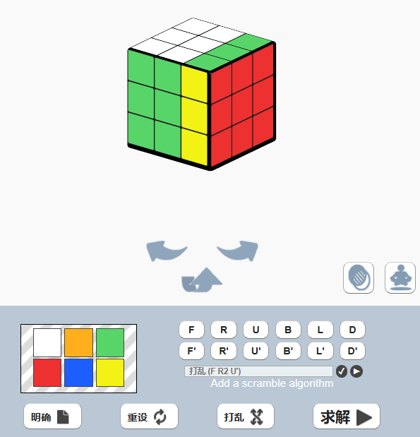
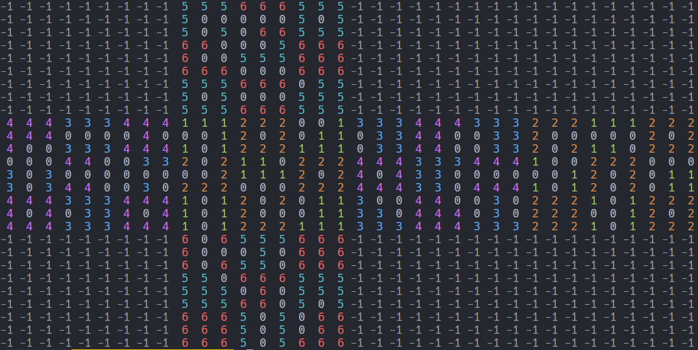
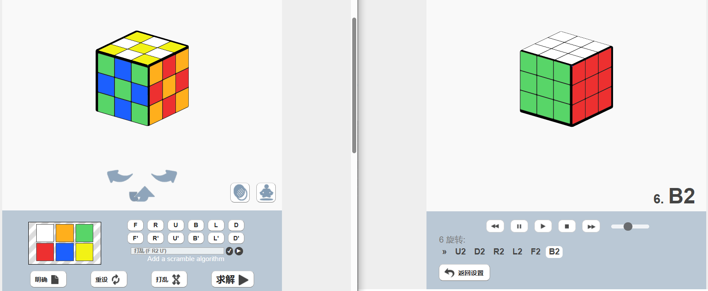
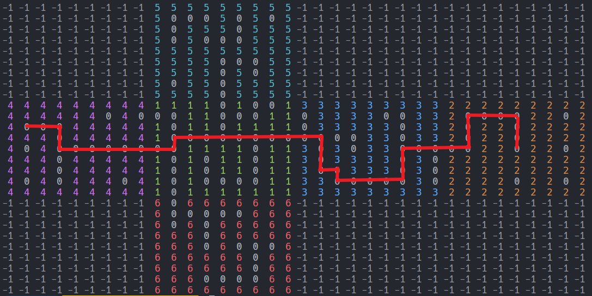
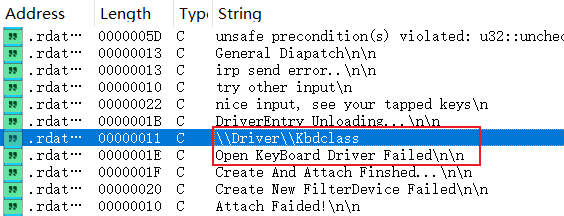

# round

比较简单的逻辑。

`user`检测是一个有换位的base64

```java
public String encodeToBase64(String str) {
    StringBuilder sb = new StringBuilder();
    byte[] bytes = str.getBytes();
    int length = (3 - (bytes.length % 3)) % 3;
    int length2 = bytes.length + length;
    for (int i = 0; i < length2; i += 3) {
        int i2 = 0;
        for (int i3 = 0; i3 < 3; i3++) {
            i2 <<= 8;
            int i4 = i + i3;
            if (i4 < bytes.length) {
                i2 |= bytes[i4] & UByte.MAX_VALUE;
            }
        }
        int i5 = 0;
        while (i5 < 4) {
            int i6 = i5 != 1 ? i5 == 2 ? 1 : i5 : 2;
            if (((i * 8) / 6) + i5 < ((bytes.length * 8) / 6) + length) {
                sb.append(BASE64_CHARS[(i2 >> ((3 - i6) * 6)) & 63]);
            } else {
                sb.append('=');
            }
            i5++;
        }
    }
    return sb.toString();
}

```

`password`检测有点像虚拟机：

```java
package com.example.demo;

/* loaded from: classes.dex */
public class Round {

    /* loaded from: classes.dex */
    public static class Result {
        private int num;
        private int rip;

        public Result(int i, int i2) {
            this.num = i;
            this.rip = i2;
        }

        public int getNum() {
            return this.num;
        }

        public int getRip() {
            return this.rip;
        }
    }

    public boolean round(int[] iArr, String str) {
        Result add;
        int length = str.length();
        int[] iArr2 = new int[length];
        int[] iArr3 = {352, 646, 752, 882, 65, 0, 122, 0, 0, 7, 350, 360};
        int i = 33;
        for (int i2 = 0; i2 < str.length(); i2++) {
            int charAt = str.charAt(i2);
            for (int i3 = 0; i3 < 32; i3++) {
                int i4 = (((iArr[i] ^ charAt) % 5) + 5) % 5;
                if (i4 == 0) {
                    add = add(iArr, charAt, i);
                } else if (i4 == 1) {
                    add = sub(iArr, charAt, i);
                } else if (i4 == 2) {
                    add = xor(iArr, charAt, i);
                } else if (i4 == 3) {
                    add = shl(charAt, i);
                } else if (i4 == 4) {
                    add = shr(charAt, i);
                } else {
                    add = new Result(charAt, i);
                }
                charAt = add.getNum();
                i = add.getRip();
            }
            iArr2[i2] = charAt;
        }
        if (length != 12) {
            return false;
        }
        for (int i5 = 0; i5 < length; i5++) {
            if (iArr2[i5] != iArr3[i5]) {
                return false;
            }
        }
        return true;
    }

    public Result add(int[] box, int charAt, int i) {
        int i2 = (((charAt + box[i]) % 1024) + 1024) % 1024;
        return new Result(i2, (i + i2) % 1024);
    }

    public Result sub(int[] iArr, int i, int i2) {
        int i3 = (((i - iArr[i2]) % 1024) + 1024) % 1024;
        return new Result(i3, (i2 + i3) % 1024);
    }

    public Result xor(int[] iArr, int i, int i2) {
        int i3 = (iArr[i2] ^ i) % 1024;
        return new Result(i3, (i2 + i3) % 1024);
    }

    public Result shl(int i, int i2) {
        int i3 = (i >> 3) % 1024;
        return new Result(i3, (i2 + i3) % 1024);
    }

    public Result shr(int i, int i2) {
        int i3 = (i << 3) % 1024;
        return new Result(i3, (i2 + i3) % 1024);
    }
}
```

发现是单字符加密，直接爆破：

```js
Java.perform(function () {
    var MakePathClass = Java.use('com.example.demo.MakePath');
    var makePathInstance = MakePathClass.$new();
    var context = Java.use('android.app.ActivityThread').currentApplication().getApplicationContext();
    var inputString = "round_and";
    var box = makePathInstance.encode(context, inputString);
    var RoundClass = Java.use('com.example.demo.Round');
    var roundInstance = RoundClass.$new();
    const ResultClass = Java.use("com.example.demo.Round$Result");


    var charset = "abcdefghijklmnopqrstuvwxyzABCDEFGHIJKLMNOPQRSTUVWXYZ_";
    var r = [352, 646, 752, 882, 65, 0, 122, 0, 0, 7, 350, 360];
    var num = 0;
    var n = 0;
    var result = 0;
    function dfs(len, newFlag) {
        if (len == 12) {
            console.log("flag: " + newFlag);
            return true;
        }
        flag = newFlag;
        var choice = [];
        for (var i = 0; i < charset.length; i++) {
            var idx = flag.length;
            var test = flag + charset[i] + "*".repeat(12 - flag.length - 1);
            num = 0;
            n = 32 * (flag.length + 1);
            ResultClass.getNum.implementation = function () {
                let temp = this.getNum();
                num += 1;
                if (num % n == 0 && num / n == 1) {
                    result = temp;
                }
                return temp;
            };
            var roundResult = roundInstance.round(box, test);
            if (r[idx] == result) {
                console.log("roundResult of " + test + " -> " + roundResult + "\n\tidx: " + idx + " -> result: " + result);
                choice.push(charset[i]);
                console.log("choice: " + choice);
            }
            num = 0;
        }
        console.log("choice: " + choice);
        for (var i = 0; i < choice.length; i++) {
            console.log("dfs: " + newFlag + choice[i]);
            if (dfs(len + 1, newFlag + choice[i])) {
                return true;
            }
        }
        return false;
    }
    var flag = "";
    dfs(flag.length, flag);
    console.log("done");
    console.log("====================================");
});
```

# crush's secret

SMC题目，补一下环境，直接运行后Attach调试，得到逻辑，一眼xxtea：

```
.SMC:00418000                 push    ebp
.SMC:00418001                 mov     ebp, esp
.SMC:00418003                 sub     esp, 10Ch
.SMC:00418009                 push    ebx
.SMC:0041800A                 push    esi
.SMC:0041800B                 push    edi
.SMC:0041800C                 lea     edi, [ebp+var_4C]
.SMC:0041800F                 mov     ecx, 13h
.SMC:00418014                 mov     eax, 0CCCCCCCCh
.SMC:00418019                 rep stosd
.SMC:0041801B                 mov     ecx, offset unk_41F0F3
.SMC:00418020                 call    sub_41136B
.SMC:00418025                 nop
.SMC:00418026                 cmp     [ebp+arg_4], 1
.SMC:0041802A                 jle     loc_418181
.SMC:00418030                 mov     eax, 34h ; '4'
.SMC:00418035                 cdq
.SMC:00418036                 idiv    [ebp+arg_4]
.SMC:00418039                 add     eax, 6
.SMC:0041803C                 mov     [ebp+var_38], eax
.SMC:0041803F                 mov     [ebp+num], 0
.SMC:00418046                 mov     eax, [ebp+0Ch]  ; Interrupt controller, 8259A.
.SMC:00418049                 mov     ecx, [ebp+input]
.SMC:0041804C                 mov     edx, [ecx+eax*4-4]
.SMC:00418050                 mov     [ebp+var_14], edx
.SMC:00418053
.SMC:00418053 loc_418053:                             ; CODE XREF: sub_418000+17B↓j
.SMC:00418053                 mov     eax, [ebp+num]
.SMC:00418056                 sub     eax, 61C88647h
.SMC:0041805B                 mov     [ebp+num], eax
.SMC:0041805E                 mov     eax, [ebp-20h]  ; Interrupt controller, 8259A.
.SMC:00418061                 shr     eax, 2
.SMC:00418064                 and     eax, 3
.SMC:00418067                 mov     [ebp+var_44], eax
.SMC:0041806A                 mov     [ebp+var_2C], 0
.SMC:00418071                 jmp     short loc_41807C
.SMC:00418073 ; ---------------------------------------------------------------------------
.SMC:00418073
.SMC:00418073 loc_418073:                             ; CODE XREF: sub_418000+F7↓j
.SMC:00418073                 mov     eax, [ebp+var_2C]
.SMC:00418076                 add     eax, 1
.SMC:00418079                 mov     [ebp+var_2C], eax
.SMC:0041807C
.SMC:0041807C loc_41807C:                             ; CODE XREF: sub_418000+71↑j
.SMC:0041807C                 mov     eax, [ebp+arg_4]
.SMC:0041807F                 sub     eax, 1          ; AT 80287 latch clear.
.SMC:0041807F                                         ; 'Busy' gets latched upon an unmasked 287 error.
.SMC:00418082                 cmp     [ebp+var_2C], eax
.SMC:00418085                 jnb     short loc_4180FC
.SMC:00418087                 mov     eax, [ebp+var_2C]
.SMC:0041808A                 mov     ecx, [ebp+8]
.SMC:0041808D                 mov     edx, [ecx+eax*4+4]
.SMC:00418091                 mov     [ebp+var_8], edx
.SMC:00418094                 mov     eax, [ebp+var_14]
.SMC:00418097                 shr     eax, 5
.SMC:0041809A                 mov     ecx, [ebp-8]
.SMC:0041809D                 shl     ecx, 2
.SMC:004180A0                 xor     eax, ecx
.SMC:004180A2                 mov     edx, [ebp-8]
.SMC:004180A5                 shr     edx, 3
.SMC:004180A8                 mov     ecx, [ebp+var_14]
.SMC:004180AB                 shl     ecx, 4
.SMC:004180AE                 xor     edx, ecx
.SMC:004180B0                 add     eax, edx
.SMC:004180B2                 mov     edx, [ebp-20h]
.SMC:004180B5                 xor     edx, [ebp+var_8]
.SMC:004180B8                 mov     ecx, [ebp+var_2C]
.SMC:004180BB                 and     ecx, 3          ; AT 80287 data.
.SMC:004180BB                                         ; 286 sends opcodes & operands and receives results.
.SMC:004180BE                 xor     ecx, [ebp+var_44]
.SMC:004180C1                 mov     esi, [ebp+key]
.SMC:004180C4                 mov     ecx, [esi+ecx*4]
.SMC:004180C7                 xor     ecx, [ebp+var_14]
.SMC:004180CA                 add     edx, ecx
.SMC:004180CC                 xor     eax, edx
.SMC:004180CE                 mov     edx, [ebp+var_2C]
.SMC:004180D1                 mov     ecx, [ebp+input]
.SMC:004180D4                 mov     edx, [ecx+edx*4]
.SMC:004180D7                 add     edx, eax
.SMC:004180D9                 mov     [ebp+var_10C], edx
.SMC:004180DF                 mov     eax, [ebp+var_2C]
.SMC:004180E2                 mov     ecx, [ebp+input]
.SMC:004180E5                 mov     edx, [ebp+var_10C]
.SMC:004180EB                 mov     [ecx+eax*4], edx
.SMC:004180EE                 mov     eax, [ebp+var_10C]
.SMC:004180F4                 mov     [ebp+var_14], eax
.SMC:004180F7                 jmp     loc_418073
.SMC:004180FC ; ---------------------------------------------------------------------------
.SMC:004180FC
.SMC:004180FC loc_4180FC:                             ; CODE XREF: sub_418000+85↑j
.SMC:004180FC                 mov     eax, 4
.SMC:00418101                 imul    ecx, eax, 0
.SMC:00418104                 mov     edx, [ebp+input]
.SMC:00418107                 mov     eax, [edx+ecx]
.SMC:0041810A                 mov     [ebp+var_8], eax
.SMC:0041810D                 mov     eax, [ebp+var_14]
.SMC:00418110                 shr     eax, 5
.SMC:00418113                 mov     ecx, [ebp+var_8]
.SMC:00418116                 shl     ecx, 2
.SMC:00418119                 xor     eax, ecx
.SMC:0041811B                 mov     edx, [ebp+var_8]
.SMC:0041811E                 shr     edx, 3
.SMC:00418121                 mov     ecx, [ebp+var_14]
.SMC:00418124                 shl     ecx, 4
.SMC:00418127                 xor     edx, ecx
.SMC:00418129                 add     eax, edx
.SMC:0041812B                 mov     edx, [ebp+num]
.SMC:0041812E                 xor     edx, [ebp+var_8]
.SMC:00418131                 mov     ecx, [ebp+var_2C]
.SMC:00418134                 and     ecx, 3
.SMC:00418137                 xor     ecx, [ebp+var_44]
.SMC:0041813A                 mov     esi, [ebp+key]
.SMC:0041813D                 mov     ecx, [esi+ecx*4]
.SMC:00418140                 xor     ecx, [ebp+var_14]
.SMC:00418143                 add     edx, ecx
.SMC:00418145                 xor     eax, edx
.SMC:00418147                 mov     edx, [ebp+arg_4]
.SMC:0041814A                 mov     ecx, [ebp+input]
.SMC:0041814D                 mov     edx, [ecx+edx*4-4]
.SMC:00418151                 add     edx, eax
.SMC:00418153                 mov     [ebp+var_10C], edx
.SMC:00418159                 mov     eax, [ebp+arg_4]
.SMC:0041815C                 mov     ecx, [ebp+input]
.SMC:0041815F                 mov     edx, [ebp+var_10C]
.SMC:00418165                 mov     [ecx+eax*4-4], edx
.SMC:00418169                 mov     eax, [ebp+var_10C]
.SMC:0041816F                 mov     [ebp+var_14], eax
.SMC:00418172                 mov     eax, [ebp-38h]  ; Interrupt controller, 8259A.
.SMC:00418175                 sub     eax, 1
.SMC:00418178                 mov     [ebp+var_38], eax
.SMC:0041817B                 jnz     loc_418053
.SMC:00418181
.SMC:00418181 loc_418181:                             ; CODE XREF: sub_418000+2A↑j
.SMC:00418181                 pop     edi
.SMC:00418182                 pop     esi
.SMC:00418183                 pop     ebx
.SMC:00418184                 add     esp, 10Ch
.SMC:0041818A                 cmp     ebp, esp
.SMC:0041818C                 call    sub_411280
.SMC:00418191                 mov     esp, ebp
.SMC:00418193                 pop     ebp
.SMC:00418194                 retn
.SMC:00418194 sub_418000      endp
```

写个脚本解：

```python
v10 = [0] * 12
v10[0] = 0x5A764F8A
v10[1] = 0x5B0DF77
v10[2] = 0xF101DF69
v10[3] = 0xF9C14EF4
v10[4] = 0x27F03590
v10[5] = 0x7DF3324F
v10[6] = 0x2E322D74
v10[7] = 0x8F2A09BC
v10[8] = 0xABE2A0D7
v10[9] = 0xC2A09FE
v10[10] = 0x35892BB2
v10[11] = 0x53ABBA12
v5 = [0] * 4
v5[0] = 0x5201314
v5[1] = 0x52013140
v5[2] = 0x5201314
v5[3] = 0x52013140

def enc(p, k):
    num = 0
    for i in range(32):
        num = (num - 0x61C88647) & 0xFFFFFFFF
        p[0] += ((p[1] ^ k[(((num >> 2) & 3) ^ 0 & 3)]) + (p[1] ^ num)) ^ (((p[1] << 4) ^ (p[1] >> 3)) + ((p[1] << 2) ^ (p[1] >> 5)))
        p[0] &= 0xFFFFFFFF
        p[1] += ((p[0] ^ k[(((num >> 2) & 3) ^ 1 & 3)]) + (p[0] ^ num)) ^ (((p[0] << 4) ^ (p[0] >> 3)) + ((p[0] << 2) ^ (p[0] >> 5)))
        p[1] &= 0xFFFFFFFF
        print(hex(p[1]))
    return p

def dec(c, k):
    num = (0 - 32 * 0x61C88647) & 0xFFFFFFFF
    for i in range(32):
        c[1] -= ((c[0] ^ k[(((num >> 2) & 3) ^ 1 & 3)]) + (c[0] ^ num)) ^ (((c[0] << 4) ^ (c[0] >> 3)) + ((c[0] << 2) ^ (c[0] >> 5)))
        c[1] &= 0xFFFFFFFF
        c[0] -= ((c[1] ^ k[(((num >> 2) & 3) ^ 0 & 3)]) + (c[1] ^ num)) ^ (((c[1] << 4) ^ (c[1] >> 3)) + ((c[1] << 2) ^ (c[1] >> 5)))
        c[0] &= 0xFFFFFFFF
        num = (num + 0x61C88647) & 0xFFFFFFFF
    return c


c = v10
key = v5
flag = []
for i in range(0, len(c), 2):
    p = c[i:i+2]
    p = dec(p, key)
    flag += p
import struct
print(struct.pack("I" * 12, *flag))
```

# FunMz

根据wp提示，知道是魔方。

先来个魔方的图：



题目分为两次输入，第一次输入为变换魔方，第二次输入为走迷宫。

主逻辑如下：

* `get_first_input_and_trans`获取第一次输入，然后变换魔方
* `go_maze`检测魔方是否转正确了，并且开始走迷宫

```c
__int64 sub_14002E4A0()
{
    sub_1400124E2((__int64)maze_class);
    get_first_input_and_trans((__int64)maze_class);
    go_maze((__int64)maze_class);
    sub_1400125EB(maze_class);
    return 0LL;
}
```

对于`get_first_input_and_trans`：

* 获取`input`在`a1 + 4096`的位置
* 通过`R, U, F, L, D, B`来控制每一步操作，`\`代表反向操作
* `a1 + 0 ~ a1 + 208`猜测是26个class，来控制魔方的具体形状
* `trans_on_maze`就是根据`a1 + 0 ~ a1 + 208`的26个class，来将地图输出到maze的区域
* `a1 + 208 ~ a1 + 0xf30`就是maze的具体形状
  * 通过分析可以知道，是`27 * 36`的大小，每一面是`3 * 3 * 9(9个int组成一个小方格) * 4(int大小)`


```c
__int64 __fastcall get_first_input_and_trans_(__int64 a1)
{
    v1 = sub_140012136(std::cout, "make the path safy first:");
    std::ostream::operator<<(v1, sub_140012082);
    get_input(a1);
    trans(a1);
    return trans_on_maze(a1);
}

__int64 __fastcall trans(__int64 Mz)
{
    for ( i = 0; ; ++i )
    {
        v22 = i;
        len = get_len(Mz + 4096);
        if ( v22 >= len )
            break;
        if ( *(_BYTE *)string_charAt(Mz + 4096, i) == 'R' )
        {
            if ( *(_BYTE *)string_charAt(Mz + 4096, i + 1) == '\'' )
            {
                ++i;
                qmemcpy(v10, (const void *)get_array_by_index12((__int64)&mode_array, 3LL), 12uLL);
                sub_14001204B(Mz, (__int64)v10, 0LL);
            }
            else
            {
                qmemcpy(v11, (const void *)get_array_by_index12((__int64)&mode_array, 3LL), 12uLL);
                LOBYTE(v2) = 1;
                sub_14001204B(Mz, (__int64)v11, v2);
            }
        }
        else if ( *(_BYTE *)string_charAt(Mz + 4096, i) == 'U' )
        {
            if ( *(_BYTE *)string_charAt(Mz + 4096, i + 1) == '\'' )
            {
                qmemcpy(v12, (const void *)get_array_by_index12((__int64)&mode_array, 4LL), 0xCuLL);
                sub_14001204B(Mz, (__int64)v12, 0LL);
                ++i;
            }
            else
            {
                qmemcpy(v13, (const void *)get_array_by_index12((__int64)&mode_array, 4LL), 0xCuLL);
                LOBYTE(v3) = 1;
                sub_14001204B(Mz, (__int64)v13, v3);
            }
        }
        else if ( *(_BYTE *)string_charAt(Mz + 4096, i) == 'F' )
        {
            if ( *(_BYTE *)string_charAt(Mz + 4096, i + 1) == '\'' )
            {
                qmemcpy(v14, (const void *)get_array_by_index12((__int64)&mode_array, 0LL), 0xCuLL);
                sub_14001204B(Mz, (__int64)v14, 0LL);
                ++i;
            }
            else
            {
                qmemcpy(v15, (const void *)get_array_by_index12((__int64)&mode_array, 0LL), 0xCuLL);
                LOBYTE(v4) = 1;
                sub_14001204B(Mz, (__int64)v15, v4);
            }
        }
        else if ( *(_BYTE *)string_charAt(Mz + 4096, i) == 'L' )
        {
            if ( *(_BYTE *)string_charAt(Mz + 4096, i + 1) == '\'' )
            {
                qmemcpy(v16, (const void *)get_array_by_index12((__int64)&mode_array, 2LL), 0xCuLL);
                LOBYTE(v5) = 1;
                sub_14001204B(Mz, (__int64)v16, v5);
                ++i;
            }
            else
            {
                qmemcpy(v17, (const void *)get_array_by_index12((__int64)&mode_array, 2LL), 0xCuLL);
                sub_14001204B(Mz, (__int64)v17, 0LL);
            }
        }
        else if ( *(_BYTE *)string_charAt(Mz + 4096, i) == 'D' )
        {
            if ( *(_BYTE *)string_charAt(Mz + 4096, i + 1) == '\'' )
            {
                qmemcpy(v18, (const void *)get_array_by_index12((__int64)&mode_array, 5LL), 0xCuLL);
                sub_14001204B(Mz, (__int64)v18, 0LL);
                ++i;
            }
            else
            {
                qmemcpy(v19, (const void *)get_array_by_index12((__int64)&mode_array, 5LL), 0xCuLL);
                LOBYTE(v6) = 1;
                sub_14001204B(Mz, (__int64)v19, v6);
            }
        }
        else if ( *(_BYTE *)string_charAt(Mz + 4096, i) == 'B' )
        {
            if ( *(_BYTE *)string_charAt(Mz + 4096, i + 1) == '\'' )
            {
                qmemcpy(v20, (const void *)get_array_by_index12((__int64)&mode_array, 1LL), 0xCuLL);
                sub_14001204B(Mz, (__int64)v20, 0LL);
                ++i;
            }
            else
            {
                qmemcpy(v21, (const void *)get_array_by_index12((__int64)&mode_array, 1LL), 0xCuLL);
                LOBYTE(v7) = 1;
                sub_14001204B(Mz, (__int64)v21, v7);
            }
        }
    }
    return 0LL;
}

__int64 __fastcall trans_on_maze(__int64 a1)
{
    memset(&v25[636], 0, sizeof(_BYTE));
    v11 = a1;
    v12 = a1;
    v13 = a1 + 208;
    while ( v12 != v13 )
    {
        v14 = v12;
        memset_zero(v15, 32LL);
        v3 = dereference(v14);
        sub_14001250A(v3, v15);
        v4 = dereference(v14);
        v16 = return_arg_8(v4);
        v17 = (char *)return_arg_8_dereference(v16);
        v18 = (char *)return_arg_8_dereference_(v16);
        while ( v17 != v18 )
        {
            qmemcpy(v19, v17, 0x30uLL);
            v20 = 0;
            v21 = v15;
            v22 = sub_140012078(v15);
            v23 = sub_140012938(v21);
            while ( v22 != v23 )
            {
                v24 = v22;
                v5 = sub_1400128C5(v19, v26);
                if ( (unsigned __int8)sub_140012E1F(v24, v5) )
                {
                    sub_140012717(v25, 32LL);
                    sub_14001212C(v25);
                    v27[0] = *(_DWORD *)(v24 + 12) / 3;
                    sub_140012514(v25, v27);
                    v28[0] = *(_DWORD *)(v24 + 12) % 3;
                    sub_140012514(v25, v28);
                    v30 = &v29;
                    v32 = v31;
                    v35 = sub_140012159(v31, v25);
                    v36 = v35;
                    qmemcpy(v34, (const void *)sub_1400128C5(v19, v33), 0xCuLL);
                    v6 = sub_140012CC1(v34);
                    v37 = sub_14001A8E0(v10, v30, v6, v36);
                    v38 = v37;
                    sub_140012D2F(v19, a1 + 208, v37);
                    sub_140012721(v25);
                }
                v22 += 16LL;
            }
            v17 += 48;
        }
        sub_1400120AA(v15);
        v12 += 8LL;
    }
    return sub_140012A96(v8, &unk_14003AAB0);
}
```

转完模型，就是走maze。

* 检查魔方是否转好了，即魔方的每个区域除了0，就是其默认的数
* 之后走迷宫就很好理解了

```c
__int64 __fastcall sub_140029980(char *a1, const void *a2)
{
    qmemcpy(a1, a2, 0xF30uLL);
    copy_3888(v18, a1);
    if ( !(unsigned __int8)sub_140029760(v18) )   // 
        // 检测每一面是否为默认值
        // 如果不是默认值就得是0
    {
        v4 = sub_140012136(std::cout, "path");
        v5 = sub_140012136(v4, "may");
        v6 = sub_140012136(v5, "wrong!");
        std::ostream::operator<<(v6, sub_140012082);
    }
    col = *(int *)get_array_by_index4___(a1 + 3896, 1LL);// 1
    row = (int *)get_array_by_index4___(a1 + 3896, 0LL);// 11
    v8 = get_array_by_index144(a1, *row);
    if ( *(_DWORD *)get_array_by_index4_(v8, col)
        || (col = *(int *)get_array_by_index4___(a1 + 3904, 1LL),// 31
            row_ = (int *)get_array_by_index4___(a1 + 3904, 0LL),// 13
            v10 = get_array_by_index144(a1, *row_),
            *(_DWORD *)get_array_by_index4_(v10, col)) )
    {                                             // 检测起点、终点是否在0的位置
        v11 = sub_140012136(std::cout, "wrong!");
        std::ostream::operator<<(v11, sub_140012082);
    }
    else
    {
        get_path_input(a1);
        go_by_path(a1);
        if ( (unsigned __int8)sub_14001298D(a1 + 3888, a1 + 3904) )
        {
            v12 = sub_140012136(std::cout, "Great!");
            v13 = std::ostream::operator<<(v12, sub_140012082);
            sub_140012136(v13, "yourFlagIs: D0g3xGC{MD5(YourInputPath)}!");
        }
        else
        {
            v14 = sub_140012136(std::cout, "wrong path!");
            std::ostream::operator<<(v14, sub_140012082);
        }
    }
    return sub_140012A96(v16, &unk_14003C270);
}

unsigned __int64 __fastcall sub_140029760(const void *a1)
{
    memset(&v14[1580], 0, sizeof(_BYTE));
    v10[0] = 0;
    v10[1] = 9;
    v10[2] = 5;
    v10[3] = 9;
    v10[4] = 0;
    v10[5] = 3;
    v10[6] = 9;
    v10[7] = 9;
    v10[8] = 1;
    v10[9] = 9;
    v10[10] = 18;
    v10[11] = 4;
    v10[12] = 9;
    v10[13] = 27;
    v10[14] = 2;
    v10[15] = 18;
    v10[16] = 9;
    v10[17] = 6;
    v11 = v10;
    v12 = (char *)return_arg((__int64)v10);
    v13 = (char *)return_arg_72((__int64)v11);
    while ( 1 )
    {
        v3 = (unsigned __int64)v13;
        if ( v12 == v13 )
            break;
        qmemcpy(v14, v12, 12uLL);
        v16 = (int *)get_array_by_index4(v14, 2LL);
        v17 = (int *)get_array_by_index4(v14, 1LL);
        v4 = (int *)get_array_by_index4(v14, 0LL);
        qmemcpy(v15, a1, sizeof(v15));
        v3 = (unsigned __int8)checkMz((int)&v9, (int)v15, *v4, *v17, *v16);// 
        // 检测每一面是否为默认值
        // 如果不是默认值就得是0
        if ( (_BYTE)v3 )
        {
            LOBYTE(v3) = 1;
            goto LABEL_10;
        }
        v12 += 12;
    }
    LOBYTE(v3) = 0;
    LABEL_10:
    v5 = v3;
    sub_140012A96(v7, &unk_14003D350);
    return v5;
}

__int64 __fastcall go_by_path(__int64 a1)
{
    v4 = 0;
    path = (char *)sub_140012041(a1 + 3912);
    path_end = sub_140012091(a1 + 3912);
    while ( 1 )
    {
        result = path_end;
        if ( path == (char *)path_end )
            break;
        v7 = *path;
        if ( *path == 'h' )
        {
            v4 += sub_140012CD5(a1, 0LL, 0xFFFFFFFFLL);
        }
        else
        {
            switch ( v7 )
            {
                case 'j':
                    v4 += sub_140012CD5(a1, 1LL, 0LL);
                    break;
                case 'k':
                    v4 += sub_140012CD5(a1, 0xFFFFFFFFLL, 0LL);
                    break;
                case 'l':
                    v4 += sub_140012CD5(a1, 0LL, 1LL);
                    break;
                default:
                    v2 = sub_140012136(std::cout, "b//a");
                    v3 = sub_140012136(v2, "d //inpu//t");
                    std::ostream::operator<<(v3, sub_140012082);
                    exit(1);
            }
        }
        ++path;
    }
    if ( v4 )
        exit(2);
    return result;
}
```

因此，解flag方法：获取源魔方 -> 拧好魔方 -> 走迷宫

一开始拧魔方的地方，具体变化有点复杂，不好看。

WP提供了好思路：不操作，在走迷宫的时候，就是原始魔方。

得到魔方：

```python
with open("maze", 'rb') as f:
    data = f.read()
import struct
from colorama import Fore, Style
maze = struct.unpack('i'*(len(data) // 4), data)
length = 36
width = 27
color_map = {
    0: Fore.WHITE,
    1: Fore.GREEN,
    2: Fore.YELLOW,
    3: Fore.BLUE,
    4: Fore.MAGENTA,
    5: Fore.CYAN,
    6: Fore.RED,
    7: Fore.BLACK,
}

for i in range(width):
    for j in range(length):
        value = maze[i * length + j]
        color = color_map.get(value % len(color_map), Fore.RESET)
        print(f"{color}{value:2X}{Style.RESET_ALL}", end=' ')
    print()
```



网上求解：



输入`UUDDRRLLFFBB`，即可得到maze（起点`(11,1)`，终点`(13,31)`）



手动得到path，在对应到`hjkl`即可。

#  eazy_key

驱动题。

首先看 `DriverEntry`：

看到其注册了 `Read`，就去看看。

```c
NTSTATUS __stdcall DriverEntry(PDRIVER_OBJECT DriverObject, PUNICODE_STRING RegistryPath)
{
    v14 = DriverObject;
    v15 = RegistryPath;
    DriverObject->DriverUnload = (PDRIVER_UNLOAD)unload;
    v7[0] = sub_FFFFF804415D3EF0(0LL, 27LL);
    v7[1] = v2;
    while ( 1 )
    {
        v8 = sub_FFFFF804415D3ED0((__int64)v7);
        idx = v3;
        if ( !v8 )
            break;
        v16 = idx;
        v10 = (DRIVER_DISPATCH *)DispatchCommon;
        if ( idx >= 0x1CuLL )
            sub_FFFFF804415DC560(idx, 28LL, &off_FFFFF804415DD0F0);
        DriverObject->MajorFunction[idx] = v10;
    }
    v11 = callback_read;
    DriverObject->MajorFunction[3] = (PDRIVER_DISPATCH)callback_read;// IRP_MJ_READ
    v12 = sub_FFFFF804415D1FF0;
    DriverObject->MajorFunction[22] = (PDRIVER_DISPATCH)sub_FFFFF804415D1FF0;// IMP_MJ_POWER
    v13 = sub_FFFFF804415D2090;
    DriverObject->MajorFunction[27] = (PDRIVER_DISPATCH)sub_FFFFF804415D2090;// IRP_MJ_PNP
    sub_FFFFF804415D2450(DriverObject, RegistryPath);
    return 0;
}
```

在 `callback_read` 中没看到啥，但是其判断了 `pIrp->CurrentLocation` 是否到达最底层。

且条件的两个分支主逻辑都没什么。

但有个 `IoSetCompletionRoutine(pIrp, (PIO_COMPLETION_ROUTINE)func_callback, pObject, 1u, 1u, 1u);`。

参数函数将在 I/O 操作完成后由 Windows 内核调用。

```c
__int64 __fastcall callback_read(PDEVICE_OBJECT pObject, PIRP pIrp)
{
    v10 = pObject;
    v11 = pIrp;
    if ( ((unsigned __int8)pIrp & 0xF) != 0 )
        sub_FFFFF804415DC5D0(16LL, (__int64)pIrp);
    if ( pIrp->CurrentLocation == 1 )             
        // 表示 IRP 已经到达请求堆栈的最底层
        // 没有更多的驱动程序可以处理它
    {
        sub_FFFFF804415D3F90(v7, &off_FFFFF804415DD1A8, v8);
        sub_FFFFF804415D9420(v7);
        if ( ((unsigned __int8)pIrp & 0xF) != 0 )
            sub_FFFFF804415DC5D0(16LL, (__int64)pIrp);
        pIrp->IoStatus.Status = 0xC0000010;
        pIrp->IoStatus.Information = 0LL;
        IofCompleteRequest(pIrp, 0);
        return 0xC0000010;
    }
    else
    {
        if ( ((unsigned __int8)pObject & 0xF) != 0 )
            sub_FFFFF804415DC5D0(16LL, (__int64)pObject);
        DeviceExtension = (__int64)pObject->DeviceExtension;
        v12 = DeviceExtension;
        if ( (DeviceExtension & 7) != 0 )
            sub_FFFFF804415DC5D0(8LL, DeviceExtension);
        v13 = *(PDEVICE_OBJECT *)(DeviceExtension + 24);
        v14 = sub_FFFFF804415D1730((__int64)pIrp);
        sub_FFFFF804415D1770(pIrp);
        CompletionRoutine = (PIO_COMPLETION_ROUTINE)func_callback;
        // func_callback将在 I/O 操作完成后由 Windows 内核调用。
        IoSetCompletionRoutine(pIrp, (PIO_COMPLETION_ROUTINE)func_callback, pObject, 1u, 1u, 1u);
        return (unsigned int)IofCallDriver(v13, pIrp);
    }
}
```

进去看看：

`v14` 就很可疑，并且根据字符串，可以找到判断 `if ( (sub_FFFFF804415D4A80((__int64)v12, (__int64)v13) & 1) != 0 )` ，其为 `true` 就输出 `nice input, see your tapped keys`。

```c
__int64 __fastcall func_callback(PDEVICE_OBJECT DeviceObject, PIRP Irp, PVOID Context)
{
    v19 = DeviceObject;
    v20 = Irp;
    v21 = Context;
    v22 = sub_FFFFF804415D1730((__int64)Irp);
    if ( ((unsigned __int8)Irp & 0xF) != 0 )
        sub_FFFFF804415DC5D0(16LL, (__int64)Irp);
    if ( (sub_FFFFF804415D9560((unsigned int)Irp->IoStatus.Status) & 1) != 0 )
    {
        if ( ((unsigned __int8)Irp & 0xF) != 0 )
            sub_FFFFF804415DC5D0(16LL, (__int64)Irp);
        MasterIrp = (__int64)Irp->AssociatedIrp.MasterIrp;
        v23 = MasterIrp;
        v6 = Irp->IoStatus.Information >> 3;
        v24 = v6;
        if ( (MasterIrp & 1) != 0 )
            sub_FFFFF804415DC5D0(2LL, MasterIrp);
        if ( *(_WORD *)(MasterIrp + 4) )
        {
            v9[0] = sub_FFFFF804415D3EF0(0LL, v6);
            v9[1] = v3;
            while ( 1 )
            {
                v10 = sub_FFFFF804415D3ED0((__int64)v9);
                v11 = v4;
                if ( !v10 )
                    break;
                v25 = v11;
                if ( (MasterIrp & 1) != 0 )
                    sub_FFFFF804415DC5D0(2LL, MasterIrp);
                if ( *(_WORD *)(MasterIrp + 2) == 0x1C )
                {
                    if ( (MasterIrp & 1) != 0 )
                        sub_FFFFF804415DC5D0(2LL, MasterIrp);
                    if ( *(_WORD *)(MasterIrp + 2) == 14 )
                    {
                        sub_FFFFF804415D4C90(&unk_FFFFF804415E0000);
                    }
                    else
                    {
                        sub_FFFFF804415D4FB0((__int64)v12, (__int64)&unk_FFFFF804415E0000);
                        v14[0] = 0x20;
                        v14[1] = 0x2A;
                        v14[2] = 0xB;
                        v14[3] = 0x22;
                        v14[4] = 4;
                        v14[5] = 0x2D;
                        v14[6] = 34;
                        v14[7] = 42;
                        v14[8] = 46;
                        v14[9] = 42;
                        v14[10] = 26;
                        v14[11] = 42;
                        v14[12] = 30;
                        v14[13] = 7;
                        v14[14] = 7;
                        v14[15] = 48;
                        v14[16] = 3;
                        v14[17] = 4;
                        v14[18] = 5;
                        v14[19] = 3;
                        v14[20] = 12;
                        v14[21] = 11;
                        v14[22] = 5;
                        v14[23] = 32;
                        v14[24] = 5;
                        v14[25] = 12;
                        v14[26] = 5;
                        v14[27] = 7;
                        v14[28] = 9;
                        v14[29] = 30;
                        v14[30] = 12;
                        v14[31] = 10;
                        v14[32] = 10;
                        v14[33] = 32;
                        v14[34] = 4;
                        v14[35] = 12;
                        v14[36] = 8;
                        v14[37] = 18;
                        v14[38] = 32;
                        v14[39] = 48;
                        v14[40] = 30;
                        v14[41] = 5;
                        v14[42] = 46;
                        v14[43] = 10;
                        v14[44] = 11;
                        v14[45] = 11;
                        v14[46] = 2;
                        v14[47] = 33;
                        v14[48] = 27;
                        v14[49] = 42;
                        sub_FFFFF804415D5100((__int64)v13, (__int64)v14);
                        if ( (sub_FFFFF804415D4A80((__int64)v12, (__int64)v13) & 1) != 0 )
                        {
                            sub_FFFFF804415D6E40(v13);
                            sub_FFFFF804415D3F90(v15, &off_FFFFF804415DD3E0, v16);
                            sub_FFFFF804415D9420(v15);
                        }
                        else
                        {
                            sub_FFFFF804415D6E40(v13);
                            sub_FFFFF804415D3F90(v17, &off_FFFFF804415DD3A8, v18);
                            sub_FFFFF804415D9420(v17);
                        }
                        sub_FFFFF804415D4E50(&unk_FFFFF804415E0000);
                        sub_FFFFF804415D6E40(v12);
                    }
                }
                else
                {
                    if ( (MasterIrp & 1) != 0 )
                        sub_FFFFF804415DC5D0(2LL, MasterIrp);
                    LOWORD(v4) = *(_WORD *)(MasterIrp + 2);
                    sub_FFFFF804415D4D90(&unk_FFFFF804415E0000, v4);
                }
            }
        }
    }
    if ( ((unsigned __int8)Irp & 0xF) != 0 )
        sub_FFFFF804415DC5D0(16LL, (__int64)Irp);
    if ( Irp->PendingReturned )
        sub_FFFFF804415D1F80(Irp);
    if ( ((unsigned __int8)Irp & 0xF) != 0 )
        sub_FFFFF804415DC5D0(16LL, (__int64)Irp);
    return (unsigned int)Irp->IoStatus.Status;
}
```

通过字符串，猜测驱动为 keyboard 的驱动：



通过WP，直到这里 `v14` 是按下的键。

进行转化得到 flag：

```python
keyboard_scan_codes = {
    '1': {'down': '2', 'up': '82'},
    '2': {'down': '3', 'up': '83'},
    '3': {'down': '4', 'up': '84'},
    '4': {'down': '5', 'up': '85'},
    '5': {'down': '6', 'up': '86'},
    '6': {'down': '7', 'up': '87'},
    '7': {'down': '8', 'up': '88'},
    '8': {'down': '9', 'up': '89'},
    '9': {'down': '0A', 'up': '8A'},
    '0': {'down': '0B', 'up': '8B'},
    '-': {'down': '0C', 'up': '8C'},
    '=': {'down': '0D', 'up': '8D'},
    'Bksp': {'down': '0E', 'up': '8E'},
    'Tab': {'down': '0F', 'up': '8F'},
    'q': {'down': '10', 'up': '90'},
    'w': {'down': '11', 'up': '91'},
    'e': {'down': '12', 'up': '92'},
    'r': {'down': '13', 'up': '93'},
    't': {'down': '14', 'up': '94'},
    'y': {'down': '15', 'up': '95'},
    'u': {'down': '16', 'up': '96'},
    'i': {'down': '17', 'up': '97'},
    'o': {'down': '18', 'up': '98'},
    'p': {'down': '19', 'up': '99'},
    '[': {'down': '1A', 'up': '9A'},
    ']': {'down': '1B', 'up': '9B'},
    'Enter': {'down': '1C', 'up': '9C'},
    'Ctrl': {'down': '1D', 'up': '9D'},
    'a': {'down': '1E', 'up': '9E'},
    's': {'down': '1F', 'up': '9F'},
    'd': {'down': '20', 'up': 'A0'},
    'f': {'down': '21', 'up': 'A1'},
    'g': {'down': '22', 'up': 'A2'},
    'h': {'down': '23', 'up': 'A3'},
    'j': {'down': '24', 'up': 'A4'},
    'k': {'down': '25', 'up': 'A5'},
    'l': {'down': '26', 'up': 'A6'},
    ';': {'down': '27', 'up': 'A7'},
    "'": {'down': '28', 'up': 'A8'},
    '`': {'down': '29', 'up': 'A9'},
    'Lshift': {'down': '2A', 'up': 'AA'},
    '\\': {'down': '2B', 'up': 'AB'},
    'z': {'down': '2C', 'up': 'AC'},
    'x': {'down': '2D', 'up': 'AD'},
    'c': {'down': '2E', 'up': 'AE'},
    'v': {'down': '2F', 'up': 'AF'},
    'b': {'down': '30', 'up': 'B0'},
    'n': {'down': '31', 'up': 'B1'},
    'm': {'down': '32', 'up': 'B2'},
    ',': {'down': '33', 'up': 'B3'},
    '.': {'down': '34', 'up': 'B4'},
    '/': {'down': '35', 'up': 'B5'},
    'Rshift': {'down': '36', 'up': 'B6'},
    '*PrSc': {'down': '37', 'up': 'B7'},
    'Alt': {'down': '38', 'up': 'B8'},
    'space': {'down': '39', 'up': 'B9'},
    'Caps': {'down': '3A', 'up': 'BA'},
    'F1': {'down': '3B', 'up': 'BB'},
    'F2': {'down': '3C', 'up': 'BC'},
    'F3': {'down': '3D', 'up': 'BD'},
    'F4': {'down': '3E', 'up': 'BE'},
    'F5': {'down': '3F', 'up': 'BF'},
    'F6': {'down': '40', 'up': 'C0'},
    'F7': {'down': '41', 'up': 'C1'},
    'F8': {'down': '42', 'up': 'C2'},
    'F9': {'down': '43', 'up': 'C3'},
    'F10': {'down': '44', 'up': 'C4'},
    'NumLck': {'down': '45', 'up': 'C5'},
    'Scroll': {'down': '46', 'up': 'C6'},
    'Home': {'down': '47', 'up': 'C7'},
    'up': {'down': '48', 'up': 'C8'},
    'PgUp': {'down': '49', 'up': 'C9'},
    'left': {'down': '4B', 'up': 'CB'},
    'right': {'down': '4D', 'up': 'CD'},
    'end': {'down': '4F', 'up': 'CF'},
    'down': {'down': '50', 'up': 'D0'},
    'PgDn': {'down': '51', 'up': 'D1'},
    'Ins': {'down': '52', 'up': 'D2'},
    'Del': {'down': '53', 'up': 'D3'},
    'F11': {'down': '57', 'up': 'D7'},
    'F12': {'down': '58', 'up': 'D8'},
    # 'Pause': {'down': '45 B1', 'up': 'E1 1D'}
}

v14 = [0] * 50
v14[0] = 0x20
v14[1] = 0x2A
v14[2] = 0xB
v14[3] = 0x22
v14[4] = 4
v14[5] = 0x2D
v14[6] = 34
v14[7] = 42
v14[8] = 46
v14[9] = 42
v14[10] = 26
v14[11] = 42
v14[12] = 30
v14[13] = 7
v14[14] = 7
v14[15] = 48
v14[16] = 3
v14[17] = 4
v14[18] = 5
v14[19] = 3
v14[20] = 12
v14[21] = 11
v14[22] = 5
v14[23] = 32
v14[24] = 5
v14[25] = 12
v14[26] = 5
v14[27] = 7
v14[28] = 9
v14[29] = 30
v14[30] = 12
v14[31] = 10
v14[32] = 10
v14[33] = 32
v14[34] = 4
v14[35] = 12
v14[36] = 8
v14[37] = 18
v14[38] = 32
v14[39] = 48
v14[40] = 30
v14[41] = 5
v14[42] = 46
v14[43] = 10
v14[44] = 11
v14[45] = 11
v14[46] = 2
v14[47] = 33
v14[48] = 27
v14[49] = 42

flag = ""
keyboard_dict = {}
for k, v in keyboard_scan_codes.items():
    keyboard_dict[int(v['down'], 16)] = k
for i in range(50):
    flag += keyboard_dict[v14[i]]

while flag.find("Lshift") != -1:
    idx = flag.find("Lshift")
    ch = flag[idx - 1]
    if ch.isalpha():
        flag = flag[:idx-1] + flag[idx-1].upper() + flag[idx+6:]
    elif ch == "[":
        flag = flag[:idx-1] + "{" + flag[idx+6:]
    elif ch == "]":
        flag = flag[:idx-1] + "}" + flag[idx+6:]
print(flag)
```

