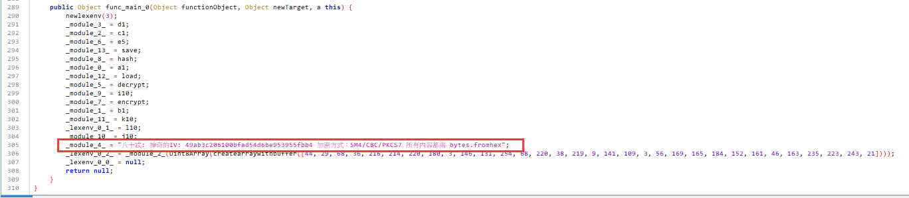
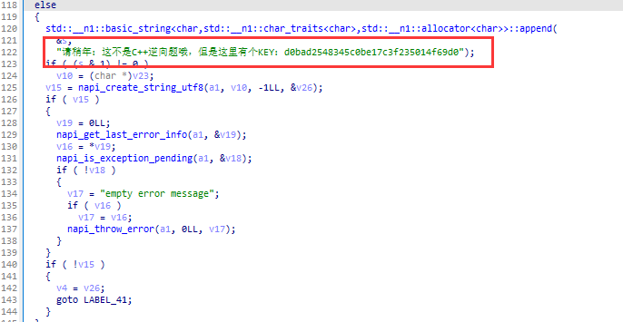
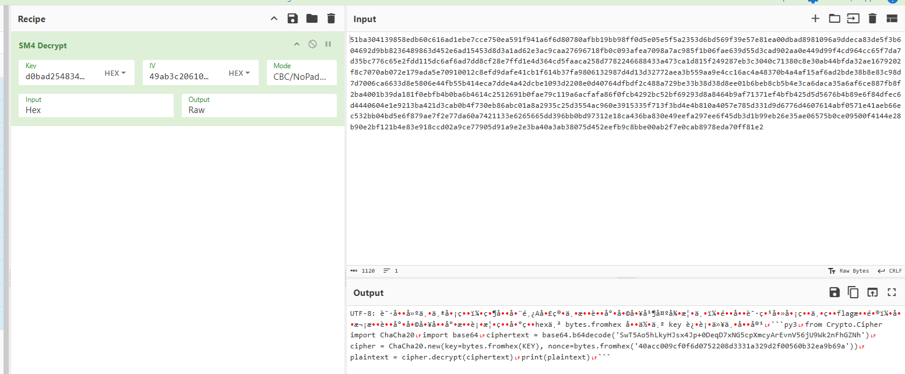
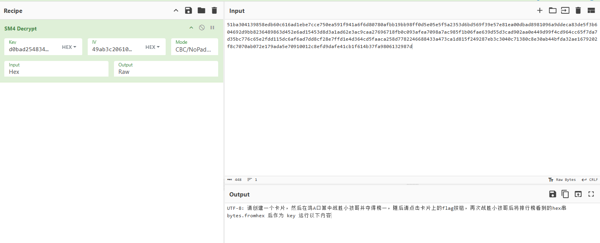

# 鸿蒙分析

## 分析

解压有个文件：

```
message flag {
  string flag = 1; // 越问：FLAG的获取方式密文在末尾
}
// 51ba304139858edb60c616ad1ebe7cce750ea591f941a6f6d80780afbb19bb98ff0d5e05e5f5a235
// 3d6bd569f39e57e81ea00dbad8981096a9ddeca83de5f3b604692d9bb8236489863d452e6ad15453
// d8d3a1ad62e3ac9caa27696718fb0c093afea7098a7ac985f1b06fae639d55d3cad902aa0e449d99
// f4cd964cc65f7da7d35bc776c65e2fdd115dc6af6ad7dd8cf28e7ffd1e4d364cd5faaca258d77822
// 46688433a473ca1d815f249287eb3c3040c71380c8e30ab44bfda32ae1679202f8c7070ab072e179
// ada5e70910012c8efd9dafe41cb1f614b37fa9806132987d4d13d32772aea3b559aa9e4cc16ac4a4
// 8370b4a4af15af6ad2bde38b8e83c98d7d7006ca6633d8e5806e44fb55b414eca7dde4a42dcbe109
// 3d2208e0d40764dfbdf2c488a729be33b38d38d8ee01b6beb8cb5b4e3ca6daca35a6af6ce887fb8f
// 2ba4001b39da181f0ebfb4b0ba6b4614c2512691b0fae79c119a6acfafa86f0fcb4292bc52bf6929
// 3d8a8464b9af71371ef4bfb425d5d5676b4b89e6f84dfec6d4440604e1e9213ba421d3cab0b4f730
// eb86abc01a8a2935c25d3554ac960e3915335f713f3bd4e4b810a4057e785d331d9d6776d4607614
// abf0571e41aeb66ec532bb04bd5e6f879ae7f2e77da60a7421133e6265665dd396bb0bd97312e18c
// a436ba830e49eefa297ee6f45db3d1b99eb26e35ae06575b0ce09500f4144e28b90e2bf121b4e83e
// 918ccd02a9ce77905d91a9e2e3ba40a3ab38075d452eefb9c8bbe00ab2f7e0cab8978eda70ff81e2
```

https://github.com/ohos-decompiler/abc-decompiler/releases去看modules.abc

解密：key为arg0感觉

`import { decrypt } from "@normalized:N&&&entry/src/main/ets/a/a&"`这种形式感觉就是去一个class拿个方法来用

```java
package p000entry.src.main.ets.a;

public Object decrypt(Object functionObject, Object newTarget, a this, Object arg0, Object arg1) 
    Object obj = createobjectwithbuffer(["iv", 0, "aad", 0, "authTag", 0, "algName", 0]);
    Object obj2 = createobjectwithbuffer(["data", 0]); obj2.data = arg1.subarray(0, 16); obj.iv = obj2;
    Object obj3 = createobjectwithbuffer(["data", 0]); obj3.data = Uint8Array(null); obj.aad = obj3;
    Object obj4 = createobjectwithbuffer(["data", 0]); obj4.data = arg1.subarray(16, 32); obj.authTag = obj4;
	// GcmParamsSpec
    Object callargsN = _module_9_(createarraywithbuffer([235, 207, 193, 252, 205, 222, 205, 193, 223, 255, 220, 201, 207])); obj.algName = callargsN;
    try {
        Object cryptoFramework = import { default as cryptoFramework } from "@ohos:security.cryptoFramework";
        // AES256|GCM|PKCS7
        Object createCipher = cryptoFramework.createCipher(_module_9_(createarraywithbuffer([237, 233, 255, 158, 153, 154, 208, 235, 239, 225, 208, 252, 231, 239, 255, 155])));
        createCipher.initSync(import { default as cryptoFramework } from "@ohos:security.cryptoFramework".CryptoMode.DECRYPT_MODE, arg0, obj);
        Object obj5 = createCipher.updateSync;
        Object obj6 = createobjectwithbuffer(["data", 0]);
        obj6.data = arg1.subarray(32);
        Object callthisN = obj5(obj6);
        Object doFinalSync = createCipher.doFinalSync(0);
        int i = (0 == doFinalSync ? 1 : 0);
        int i2 = i;
        if (istrue(i) == null) {
            i2 = (0 == doFinalSync.data ? 1 : 0);
        }
        if (istrue(i2) != null || isfalse((0 == doFinalSync.data.byteLength ? 1 : 0)) == null) {
            return callthisN.data;
        }
        int i3 = (0 == callthisN ? 1 : 0);
        int i4 = i3;
        if (istrue(i3) == null) {
            i4 = (0 == callthisN.data ? 1 : 0);
        }
        if (istrue(i4) != null || isfalse((0 == callthisN.data.byteLength ? 1 : 0)) == null) {
            return doFinalSync.data;
        }
        Object newobjrange = Uint8Array((callthisN.data.byteLength + doFinalSync.data.byteLength));
        newobjrange.set(callthisN.data, 0);
        newobjrange.set(doFinalSync.data, callthisN.data.byteLength);
        return newobjrange;
    } catch (ExceptionI0 unused) {
        isfalse(instanceof(callargsN, Error));
        return null;
    }
}
```

class a里有蛮多工具方法会被用到，并且还有：（提示了iv，但加密方式不知道对不对，前面decrypt函数用的AES）



搜decrypt字符串，有个这个用了，且感觉是check：

```java
package p000entry.src.main.ets.pages;

public Object nextChallenge(Object functionObject, Object newTarget, Index this) {
    this.clearCanvas();
    if (isfalse(this.dead) == null) {
        return null;
    }
    if ((this.tasks.length == (this.currentIndex + 1) ? 1 : 0) == 0) {
        this.currentIndex = tonumer(this.currentIndex) + 1;
        this.cardOffset = (this.displayWidth / 10) - (this.currentIndex * (((this.displayWidth / 10) * 8) + 20));
        return null;
    }
    boolean z = 2;
    String str = "";
    if ((_lexenv_0_4_.length > 0 ? 1 : 0) != 0) {
        Object decrypt = import { decrypt } from "@normalized:N&&&entry/src/main/ets/a/a&";
        Object c1 = import { c1 } from "@normalized:N&&&entry/src/main/ets/a/a&";
        Object hash = import { hash } from "@normalized:N&&&entry/src/main/ets/a/a&";
        Object s1 = import { default as s1 } from "@normalized:Y&&&libentry.so&";
        // s1来自so文件
        Object callargsN = decrypt(c1(hash(s1["checkFlag"]("flag{flag}"))), import { b1 } from "@normalized:N&&&entry/src/main/ets/a/a&"(_lexenv_0_4_));
        if ((0 != callargsN ? 1 : 0) != 0) {
            str = import { a1 } from "@normalized:N&&&entry/src/main/ets/a/a&"(callargsN);
        } else {
            z = true;
        }
    } else {
        z = true;
    }
    if ((1 == z ? 1 : 0) != 0) {
        _lexenv_0_5_[_lexenv_0_5_.byteLength - 1] = 96;
        Object callargsN2 = import { decrypt } from "@normalized:N&&&entry/src/main/ets/a/a&"(import { c1 } from "@normalized:N&&&entry/src/main/ets/a/a&"(_lexenv_0_5_), _lexenv_0_6_);
        str = (0 == callargsN2 ? 1 : 0) != 0 ? "" : import { a1 } from "@normalized:N&&&entry/src/main/ets/a/a&"(callargsN2);
    }
    Object router = import { default as router } from "@ohos:router";
    Object obj = router.pushUrl;
    Object obj2 = createobjectwithbuffer(["url", "pages/Rank", "params", 0]);
    Object obj3 = createobjectwithbuffer(["c", 0, "s", 0, "f1", 0]);
    obj3.c = this.cost;
    obj3.s = z;
    obj3.f1 = str;
    obj2.params = obj3;
    obj(obj2);
    return null;
}
```

so里确实有checkflag：


有个函数，里面有key：`d0bad2548345c0be17c3f235014f69d0`



根据提示解密信息：



```python
from Crypto.Cipher import ChaCha20
import base64
ciphertext = base64.b64decode('SwT5Ao5hLkyHJsx4Jp+0DeqD7xNG5cpXmcyArEvnV56jU9Wk2nFhGZNh')
cipher = ChaCha20.new(key=bytes.fromhex(KEY), nonce=bytes.fromhex('40acc009cf0f6d0752208d3331a329d2f00560b32ea9b69a'))
plaintext = cipher.decrypt(ciphertext)
print(plaintext)
```

前半部分有个utf-8，删去后面内容



## 运行hap

DevEco中有模拟器 需要打开hyper-v

## OCR

需要90s打败小孩哥，无法取得第一（50s）

```python
import easyocr
from PIL import ImageGrab, Image
import numpy as np
import pyautogui
from time import sleep

LESS = (138, 330)
EQUAL = (184, 330)
MORE = (231, 330)
OTHER = (180, 430)
allbbox = (60, 250, 300, 310)
reader = easyocr.Reader(['en'], gpu = True)
print("Starting...")

def getNum():
    img = ImageGrab.grab(bbox=allbbox)
    img_array = np.array(img)
    # 保留黑色笔记部分，使OCR更容易识别
    img_array[img_array > 70] = 255
    result = reader.readtext(img_array)
    print(result)
    # OCR可能将所有识别为一条字符串
    if len(result) == 1:
        result = result[0][-2]
        if '<' in result or '>' in result or '=' in result:
            return -1, -1
        result = result.split('?')
        num1 = int(result[0].strip())
        num2 = int(result[1].strip())
    # OCR可能将所有识别为两条字符串，问号可能在前一个数字后面，或者后一个数字前面
    elif len(result) == 2:
        if '<' in result[1][-2] or '>' in result[1][-2] or '=' in result[1][-2]:
            return -1, -1
        if ' ' in result[0][-2]:
            num1 = int(result[0][-2].split(' ')[0].strip())
            num2 = int(result[1][-2].strip())
        elif ' ' in result[1][-2]:
            num1 = int(result[0][-2].strip())
            num2 = int(result[1][-2].split(' ')[-1].strip())
        else:
            num1 = int(result[0][-2].strip())
            num2 = int(result[1][-2].strip())
    else:
        if '<' in result[1][-2] or '>' in result[1][-2] or '=' in result[1][-2]:
            return -1, -1
        num1 = int(result[0][-2].strip())
        num2 = int(result[-1][-2].strip())
    return num1, num2


cnt = 0
while True:
    try:
        num1, num2 = getNum()
        # 保证两次识别的结果相同，防止识别错误
        while True:
            num1_, num2_ = getNum()
            if num1_ == -1 and num2_ == -1:
                num1, num2 = num1_, num2_
                continue
            if num1_ == num1 and num2_ == num2:
                break
            num1, num2 = num1_, num2_
        if num1 == -1 and num2 == -1:
            continue
        print(f"num1: {num1}, num2: {num2}")
        if num1 > num2:
            print(f"answer: {num1} > {num2}")
            pyautogui.click(MORE)
            cnt += 1
        elif num1 < num2:
            print(f"answer: {num1} < {num2}")
            pyautogui.click(LESS)
            cnt += 1
        else:
            print(f"answer: {num1} = {num2}")
            pyautogui.click(EQUAL)
            cnt += 1
        sleep(0.3)
    except KeyboardInterrupt:
        print(f"Count of answers: {cnt}")
        break
    except Exception as e:
        # print(f"An error occurred: {e}")
        pass
```

