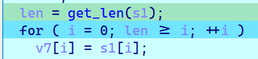
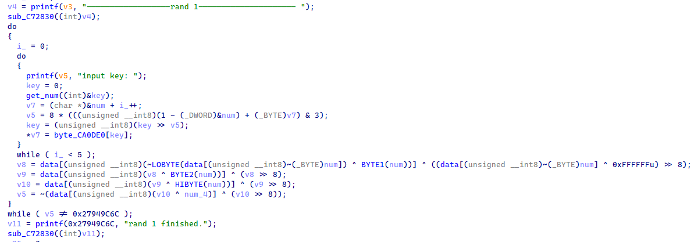
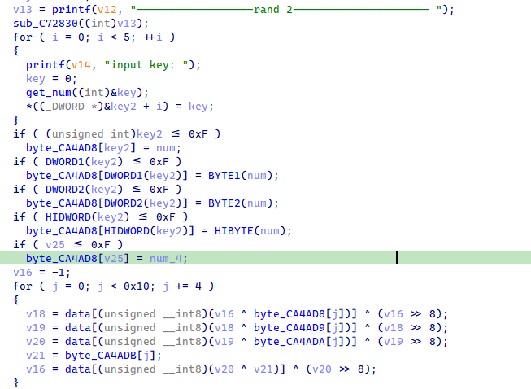
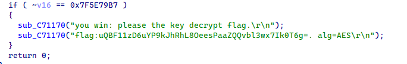
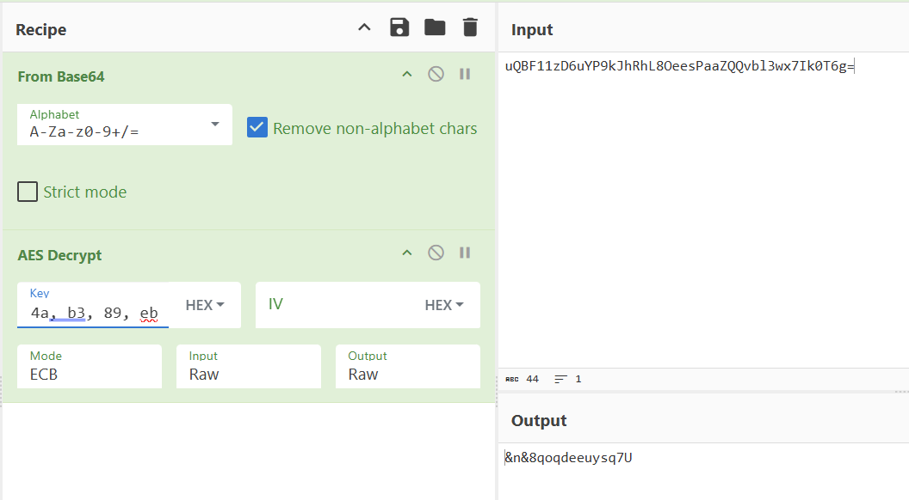

## pwn server

👉[第三届广东省大学生网络攻防竞赛WriteUp](https://mp.weixin.qq.com/s/cYjPdrf5CEvIzA1Ulfm6lw)

`i`从`-1`开始，如果一开始`v1`就为空字符，则`i`为`-1`。

```C
__int64 __fastcall get_len(_BYTE *a1)
{
    _BYTE *v1; // rax
    unsigned int i; // [rsp+Ch] [rbp-Ch]
    _BYTE *v4; // [rsp+10h] [rbp-8h]

    if ( !a1 )
        return 0LL;
    v4 = a1;
    for ( i = -1; ; ++i )
    {
        v1 = v4++;
        if ( !*v1 )
            break;
    }
    return i;
}
```

这里`len`为`unsigned int8`类型，因此返回的`-1`为`0xFF: 255`。

因此`v7`会复制`s1`开始的`255`字节。



这里会将输入的`key`、`value`合并，并且异或0x30。

```C
char *__fastcall sub_400AD7(const char *a1, const char *a2)
{
    char v3[32]; // [rsp+20h] [rbp-30h] BYREF
    int v4; // [rsp+40h] [rbp-10h]
    int v5; // [rsp+44h] [rbp-Ch]
    int v6; // [rsp+48h] [rbp-8h]
    int i; // [rsp+4Ch] [rbp-4h]

    if ( !a1 || !a2 )
        return 0LL;
    v6 = strlen(a1);
    v5 = strlen(a2);
    v4 = v6 + v5;
    sprintf(v3, "%s%s", a1, a2);
    if ( v4 > 0 )
    {
        for ( i = 0; i < v4; ++i )
            v3[i] ^= 0x30u;
    }
    return v3;
}
```

`file`到`v7`的距离为`0x7FFD6D484300 - 0x7FFD6D484260 = 0xa0`，

`s`（存储flag字符串）到`s1`的距离为`0x7FFD6D484250 - 0x7FFD6D4841B0 = 0xa0`。

都为0xa0，恰好可以把`flag`字符串复制到`file`处

后面会读取`file`的文件名的文件的内容并返回：

```C
fd = open(file, 0);
if ( fd == -1 )
    return 0LL;
read(fd, buf, 0x3CuLL);
close(fd);
dest = (char *)malloc(0x80uLL);
if ( !dest )
    return 0LL;
strcpy(dest, buf);
```

因此，输入`0:0`即可。

## re1

```C
int __cdecl sub_401190(int *a1, int a2)
{
    int v2; // eax
    int v3; // esi
    int v4; // edi
    int v5; // eax
    int result; // eax
    int v7; // [esp+0h] [ebp-34h]
    int v8; // [esp+0h] [ebp-34h]
    int v9; // [esp+0h] [ebp-34h]
    int v10; // [esp+14h] [ebp-20h]
    int v11; // [esp+1Ch] [ebp-18h]
    int v12; // [esp+24h] [ebp-10h]
    int v13; // [esp+28h] [ebp-Ch]
    int v14; // [esp+28h] [ebp-Ch]
    int v15; // [esp+2Ch] [ebp-8h]
    int i; // [esp+30h] [ebp-4h]

    v11 = add_edx_ecx(v7);
    v15 = a1[1];
    do
    {
        v12 = add_edx_ecx(v8);
        return_0();
        for ( i = 0; !i; i = 1 )
        {
            v13 = a1[add_edx_ecx(v8)];
            printf((int)"tmp=%x, z=%d\r\n", v13, v15);
            shift_add_shift(v13); // (x >> 5 ^ x << 2) + (x >> 3 ^ x << 4)
            xor(v12, v13);
            v2 = and_xor(); // (a2 & 3) ^ a1
            xor(*(_DWORD *)(a2 + 4 * v2), v15);
            *a1 = add_edx_ecx(v9);
            v15 = *a1;
            printf((int)"y=%x, z=%x\r\n", v13, *a1);
        }
        v14 = *a1;
        v3 = shift_add_shift(*a1);
        v4 = xor(v12, v14);
        v5 = and_xor();
        v10 = ((xor(*(_DWORD *)(a2 + 4 * v5), v15) + v4) ^ v3) + a1[1];
        a1[1] = v10;
        v15 = v10;
        result = --v11;
    }
    while ( v11 );
    return result;
}
```

## re2

答辩......全是爆破。





然后解密：



### 其他解法

[第三届广东大学生网络安全攻防竞赛-S1uM4i](https://blog.s1um4i.com/2024-ProvinceCTF/#reverse)👈利用[CRC32 tools: reverse, undo/rewind, and calculate hashes](https://github.com/theonlypwner/crc32)

将源码的`reverse_callback`函数改为如下：（原来为六个字节）

```python
def reverse_callback():
    # initialize tables
    init_tables(get_poly())
    # find reverse bytes
    desired = parse_dword(args.desired)
    accum = parse_dword(args.accum)
    # 4-byte patch
    patches = findReverse(desired, accum)
    for patch in patches:
        out('4 bytes: {{0x{0:02x}, 0x{1:02x}, 0x{2:02x}, 0x{3:02x}}}'.format(*patch))
        checksum = calc(patch, accum)
        out('verification checksum: 0x{0:08x} ({1})'.format(checksum, 'OK' if checksum == desired else 'ERROR'))
    # 6-byte alphanumeric patches
    # for i in permitted_characters:
    #     for j in permitted_characters:
    #         bytes = [i, j]
    #         patches = findReverse(desired, calc(bytes, accum))
    #         for patch in patches:
    #             if all(p in permitted_characters for p in patch):
    #                 bytes.extend(patch)
    #                 out('alternative: {1}{2}{3}{4}{5}{6} ({0})'.format('OK' if calc(bytes, accum) == desired else 'ERROR', *map(chr, bytes)))
    print(accum)
    for i in range(256):
        bytes = [i]
        patches = findReverse(desired, calc(bytes, accum))
        for patch in patches:
            # if all(p in permitted_characters for p in patch):
            bytes.extend(patch)
            out('alternative: {1}, {2}, {3}, {4}, {5} ({0})'.format('OK' if calc(bytes, accum) == desired else 'ERROR', *map(hex, bytes)))
```

得到第一轮的key，第二轮就好爆破多了。

```C
#include <stdio.h>

int data[256] = {
    ...
};
int check1(int i, int j, int k, int l, int m) {
    unsigned int v8, v9, v10, v5, v7;
    v8 = data[(unsigned __int8)(~(data[(unsigned __int8)~i] & 0xFF) ^ j)] ^ ((data[(unsigned __int8)~i] ^ 0xFFFFFFu) >> 8);
    v9 = data[(unsigned __int8)(v8 ^ k)] ^ (v8 >> 8);
    v10 = data[(unsigned __int8)(v9 ^ l)] ^ (v9 >> 8);
    v5 = ~(data[(unsigned __int8)(v10 ^ m)] ^ (v10 >> 8));
    return v5 == 0x27949C6C;
}

int check2(int i, int j, int k, int l, int m, int key1[5]) {
    int data2[16] = {0x1B, 0xB1, 0xFF, 0xFD, 0x19, 0xFF, 0x89, 0x8C, 0x09, 0xFF, 0xFF, 0xD7, 0x4A, 0xB3, 0xFF, 0xEB};
    data2[i] = key1[0];
    data2[j] = key1[1];
    data2[k] = key1[2];
    data2[l] = key1[3];
    data2[m] = key1[4];
    unsigned int crc = 0xFFFFFFFF;
    for (int index = 0; index < 16; index++)
    {
        crc = data[(crc ^ data2[index]) & 0xff] ^ (crc >> 8);
    }
    return (crc ^ 0xFFFFFFFF) == 0x7F5E79B7;
}

int main() {
    // 第一轮结果
    int key1[5 * 256] = {
        0x0, 0x32, 0x62, 0x32, 0x10, 
        ......
        0xff, 0xbf, 0x8d, 0x30, 0x3d, 
    };
    for (int t = 0; t < 256; t++)
    {
        for (int i = 0; i < 16; i++) 
        {
            for (int j = 0; j < 16; j++)
            {
                for (int k = 0; k < 16; k++)
                {
                    for (int l = 0; l < 16; l++)
                    {
                        for (int m = 0; m < 16; m++)
                        {
                            if (check2(i, j, k, l, m, key1 + t * 5)) {
                                printf("%d, %d, %d, %d, %d\n", i, j, k, l, m);
                                int data2[16] = {
                                    0x1B, 0xB1, 0xFF, 0xFD, 0x19, 0xFF, 0x89, 0x8C, 
                                    0x09, 0xFF, 0xFF, 0xD7, 0x4A, 0xB3, 0xFF, 0xEB
                                };
                                data2[i] = key1[0 + t * 5];
                                data2[j] = key1[1 + t * 5];
                                data2[k] = key1[2 + t * 5];
                                data2[l] = key1[3 + t * 5];
                                data2[m] = key1[4 + t * 5];
                                printf("key: ");
                                for (int index = 0; index < 16; index++)
                                {
                                    printf("%02x, ", data2[index]);
                                }
                            }
                        }
                    }
                }
            }
        }

    }
    return 0;
}
```

