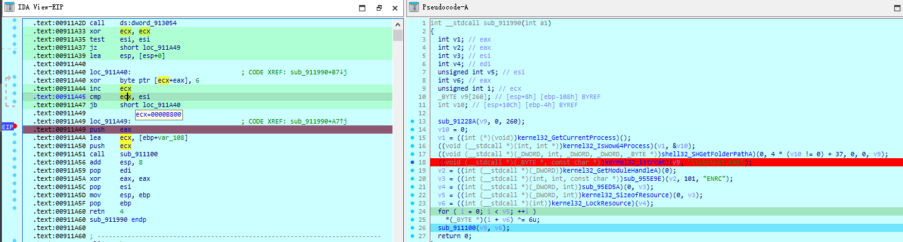
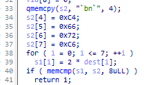

# 2024 朱雀re1

获取目标代码段：（可以跟着010editor看逻辑）


恢复代码段并执行：


代码段逻辑如下：

```c
__int64 sub_7FF7F3763000()
{
    v38 = 0LL;
    *(_QWORD *)&v39 = 0LL;
    v0 = sub_7FF7F3761550(std::cout, "Input your flag:");
    std::ostream::operator<<(v0, sub_7FF7F3761720);
    v1 = std::setw(v37, 255LL);
    (*(void (__fastcall **)(char *, _QWORD))v1)((char *)&std::cin + *(int *)(std::cin + 4LL), *(_QWORD *)(v1 + 8));
    sub_7FF7F37617F0(std::cin, v2, &v38);
    v3 = -1LL;
    do
        ++v3;
    while ( *((_BYTE *)&v38 + v3) );
    if ( v3 != 24 )
    {
        v4 = sub_7FF7F3761550(std::cout, "wrong!");
        std::ostream::operator<<(v4, sub_7FF7F3761720);
        exit(-1);
    }
    ProcessHeap = GetProcessHeap();
    v6 = (const char *)HeapAlloc(ProcessHeap, 8u, 0x2CuLL);
    if ( !v6 )
    {
        v7 = sub_7FF7F3761550(std::cout, "Error");
        std::ostream::operator<<(v7, sub_7FF7F3761720);
        exit(-1);
    }
    v8 = GetProcessHeap();
    flag = (unsigned __int8 *)HeapAlloc(v8, 8u, 0x2CuLL);
    if ( !flag )
    {
        v10 = sub_7FF7F3761550(std::cout, "Error");
        std::ostream::operator<<(v10, sub_7FF7F3761720);
        exit(-1);
    }
    v11 = 42LL;
    v12 = v39;
    *(_OWORD *)flag = v38;
    v13 = v40;
    *((_OWORD *)flag + 1) = v12;
    *((_QWORD *)flag + 4) = v13;
    *((_WORD *)flag + 20) = v41;
    flag[42] = v42;
    *((_BYTE *)v6 + 43) = 0;
    do
    {
        v14 = flag[23];
        v15 = flag[21];
        flag[23] /= 24;
        temp = flag[22] + ((unsigned int)(v14 % 24) << 8);
        flag[22] = temp / 24;
        v17 = ((temp % 24) << 8) + v15;
        LODWORD(temp) = flag[20];
        flag[21] = v17 / 24;
        LODWORD(temp) = ((v17 % 24) << 8) + temp;
        v18 = flag[19];
        flag[20] = (unsigned int)temp / 24;
        v19 = (((unsigned int)temp % 24) << 8) + v18;
        LODWORD(temp) = flag[18];
        flag[19] = v19 / 24;
        LODWORD(temp) = ((v19 % 24) << 8) + temp;
        v20 = flag[17];
        flag[18] = (unsigned int)temp / 24;
        v21 = (((unsigned int)temp % 24) << 8) + v20;
        LODWORD(temp) = flag[16];
        flag[17] = v21 / 24;
        v22 = ((v21 % 24) << 8) + (unsigned int)temp;
        v23 = flag[15];
        flag[16] = v22 / 24;
        v24 = ((v22 % 24) << 8) + v23;
        LODWORD(v22) = flag[14];
        flag[15] = v24 / 24;
        LODWORD(v22) = ((v24 % 24) << 8) + v22;
        v25 = flag[13];
        flag[14] = (unsigned int)v22 / 24;
        v26 = (((unsigned int)v22 % 24) << 8) + v25;
        LODWORD(v22) = flag[12];
        flag[13] = v26 / 24;
        LODWORD(v22) = ((v26 % 24) << 8) + v22;
        v27 = flag[11];
        flag[12] = (unsigned int)v22 / 24;
        v28 = (((unsigned int)v22 % 24) << 8) + v27;
        LODWORD(v22) = flag[10];
        flag[11] = v28 / 24;
        LODWORD(v22) = ((v28 % 24) << 8) + v22;
        v29 = flag[9];
        flag[10] = (unsigned int)v22 / 24;
        v30 = (((unsigned int)v22 % 24) << 8) + v29;
        LODWORD(v22) = flag[8];
        flag[9] = v30 / 24;
        LODWORD(v22) = ((v30 % 24) << 8) + v22;
        LODWORD(v30) = flag[7];
        flag[8] = (unsigned int)v22 / 24;
        LODWORD(v30) = (((unsigned int)v22 % 24) << 8) + v30;
        LODWORD(v22) = flag[6];
        flag[7] = (unsigned int)v30 / 24;
        LODWORD(v22) = (((unsigned int)v30 % 24) << 8) + v22;
        LODWORD(v30) = flag[5];
        flag[6] = (unsigned int)v22 / 24;
        LODWORD(v30) = (((unsigned int)v22 % 24) << 8) + v30;
        LODWORD(v22) = flag[4];
        flag[5] = (unsigned int)v30 / 24;
        LODWORD(v22) = (((unsigned int)v30 % 24) << 8) + v22;
        LODWORD(v30) = flag[3];
        flag[4] = (unsigned int)v22 / 24;
        LODWORD(v30) = (((unsigned int)v22 % 24) << 8) + v30;
        LODWORD(v22) = flag[2];
        flag[3] = (unsigned int)v30 / 24;
        v31 = (((unsigned int)v30 % 24) << 8) + (unsigned int)v22;
        flag[2] = v31 / 24;
        LODWORD(v30) = ((v31 % 24) << 8) + flag[1];
        LODWORD(v31) = *flag;
        flag[1] = (unsigned int)v30 / 24;
        v32 = (((unsigned int)v30 % 24) << 8) + (unsigned int)v31;
        *flag = v32 / 24;
        v6[v11--] = aCmhkv3djf8rpw6[v32 % 24];
    }
    while ( v11 >= 0 );
    v33 = strcmp(v6, "CJXQ9JRHCJBH8PGWBDWDH4C4XTHQHHWRHFBGDF6HT27");
    v34 = "correct!";
    if ( v33 )
        v34 = "wrong!";
    v35 = sub_7FF7F3761550(std::cout, v34);
    return std::ostream::operator<<(v35, sub_7FF7F3761720);
}
```

总结算法：

```python
table = "CMHKV3DJF8RPW6B7GT9Y4XQ2"
def enc():
    flag = "wdflag{606b867aab2faec0}"
    flag = [ord(i) for i in flag]
    result = [0] * 43
    for j in range(42, -1, -1):
        temp = 0
        for i in range(23, -1, -1):
            temp = (temp % 24) << 8 | flag[i]
            flag[i] = temp // 24
        result[j] = table[temp % 24]
    print("".join(result))
```

逆向算法：

```python
table = "CMHKV3DJF8RPW6B7GT9Y4XQ2"
def dec1():
    result = "CJXQ9JRHCJBH8PGWBDWDH4C4XTHQHHWRHFBGDF6HT27"
    result = [table.index(i) for i in result]
    flag = []
    temp = 0
    for i in result:
        temp = temp * 24 + i
    while temp:
        flag.append(temp & 0xFF)
        temp >>= 8
    flag = ''.join(chr(i) for i in flag)
    print(flag)
```

# 2024 朱雀 re2

`flag`在靶机上，只能通过GET请求访问。

```dockerfile
FROM ubuntu:22.04

RUN sed -i s@/archive.ubuntu.com/@/mirrors.tuna.tsinghua.edu.cn/@g /etc/apt/sources.list
RUN apt-get clean

COPY httpd /home/httpd
COPY www /home/www
COPY flag /flag


RUN chmod +x /home/httpd
EXPOSE 8080
WORKDIR "/home/"
CMD [ "/home/httpd"]
```

访问`http://127.0.0.1:8080/..../www/..../flag`

实际处理得到的路径为：


# 2024 白虎 re1

[Release 1.5.1 · skylot/jadx](https://github.com/skylot/jadx/releases/tag/v1.5.1)


`app-debug\lib\`存着各个架构的`so`

`ida`打开`so`。

`JNI`的函数有两种注册方式：（不谈原理，谈解决方法）

1. 静态注册：直接搜索函数名
2. 动态注册：去`JNI_OnLoad`找

直接搜索找不到：


去看`JNI_Onload`存在花指令，都nop掉


发现没啥东西：


查看init_array中的两个函数


替换cmp：


另一个走进去能发现AES加密：


# 2024 白虎 re2

硬件断点：


长度：



明显的PE头特征：


dump出来在拖进ida


keyExpand和FindCrypto3看出是AES加密

尝试解密得到： 但注意后面一串`\x00`

```python
from Crypto.Cipher import AES
key = [0x16157E3B, 0xA6D2AE38, 0x8815F7BB, 0x3C4FCF19]
key = b''.join([x.to_bytes(4, 'little') for x in key])
cipher = AES.new(key, AES.MODE_ECB)
with open('1.txt.cry', 'rb') as f:
    flag = f.read()
flag = cipher.decrypt(flag)
print(flag)
# b'~moehnr=<[N8>G1EZ<M^B@Gt\x00\x00\x00\x00\x00\x00\x00\x00'
```

xor暴力破解看一下：


# 2024 玄武 re1

java层逻辑：


native层逻辑：


```c
char __fastcall sub_6E0(_JNIEnv *a1, __int64 a2, void *a3)
{
    v13 = __readfsqword(0x28u);
    input_string = a1->functions->GetStringUTFChars(a1, a3, 0LL);
    sub_940(v11); // keyExpand
    *s = 0LL;
    strcpy(s, input_string);
    v4 = strlen(input_string);
    if ( v4 == 16 )
    {
        enc(v12, s, &xmmword_3140);
    }
    else
    {
        v5 = s;
        v6 = (strlen(s) >> 4) + 16 - v4 % 16;
        if ( v4 % 16 < 16 )
            memset(&s[v4], 0, (15 - v4 % 16) + 1LL);
        if ( v6 )
        {
            v7 = -v6;
            v8 = &xmmword_3140;
            do
            {
                enc(v12, v5, v8);
                v5 += 16;
                ++v8;
                ++v7;
            }
            while ( v7 );
        }
    }
    v9 = -5LL;
    while ( result[v9 + 5] == *(&xmmword_3140 + v9 + 5)
           && result[v9 + 6] == *(&xmmword_3140 + v9 + 6)
           && result[v9 + 7] == *(&xmmword_3140 + v9 + 7)
           && result[v9 + 8] == *(&xmmword_3140 + v9 + 8)
           && result[v9 + 9] == *(&xmmword_3140 + v9 + 9) )
    {
        v9 += 5LL;
        if ( v9 >= 40 )
            return 1;
    }
    return 0;
}
```

看keyExpand函数可以发现SM4特征


`sm4_sbox`和`sm4_rk`异或7后与原来SM4算法的没有区别。

直接获取密钥解出flag。


`_byteswap_ulong`是字节序转换

```c
#include <stdio.h>
#include <stdlib.h>
int main() {
    unsigned long x = 0x12345678;
    unsigned long swapped_x = _byteswap_ulong(x);
    printf("Original: %lx\n", x);
    printf("Swapped: %lx\n", swapped_x);
    return 0;
}
```

key3和key4程序给出的是直接异或fk的，这里还原：

```python
key = [0x32313141, 0x37353332]
sm4_fk = [0xa3b1bac6, 0x56aa3350, 0x677d9197, 0xb27022dc]
key += [sm4_fk[2] ^ 0x534BA9AE, sm4_fk[3] ^ 0x8B401286]
# sm4的key获取转为int使用大端序模式的
key = b''.join(
    [x.to_bytes(4, 'little') for x in key[:2]] +  # 程序使用了byteswap
    [x.to_bytes(4, 'big') for x in key[2:]]
)
print(key)
```

```python
key = [0x32313141, 0x37353332]
sm4_fk = [0xa3b1bac6, 0x56aa3350, 0x677d9197, 0xb27022dc]
key += [sm4_fk[2] ^ 0x534BA9AE, sm4_fk[3] ^ 0x8B401286]
key = b''.join(
    [x.to_bytes(4, 'little') for x in key[:2]] + [x.to_bytes(4, 'big') for x in key[2:]]
)
key = int.from_bytes(key, 'big')
from pysm4 import decrypt
result = [
    0x85, 0xFC, 0xBC, 0x1D, 0x8A, 0x32, 0x90, 0x7C, 0xB6, 0xCA,
    0xCA, 0xAA, 0xA9, 0x10, 0x99, 0x57, 0xE3, 0x8C, 0x80, 0x65,
    0x1E, 0xAD, 0xF1, 0x38, 0xC3, 0xFE, 0x84, 0x9A, 0x62, 0xDA,
    0x68, 0xB3, 0x6E, 0xFF, 0x51, 0xFC, 0xD8, 0xB6, 0x9F, 0xEB,
    0x7A, 0xE0, 0x73, 0x86, 0x19, 0xA4, 0xCA, 0x13
]
result = bytes(result)
flag = ''
for i in range(len(result) // 16):
    num = int.from_bytes(result[i * 16:i * 16 + 16], 'big')
    flag += decrypt(num, key).to_bytes(16, 'big').decode()
print(flag)
```

再回来看看这个操作：


```c
#include <stdio.h>
#include <stdlib.h>
#include <smmintrin.h>  // 包含 SSE4.1 指令集的头文件

void print_m128i(__m128i v) {
    int elements[4];
    _mm_storeu_si128((__m128i *)elements, v);
    printf("Elements: %08x, %08x, %08x, %08x\n", elements[0], elements[1], elements[2], elements[3]);
    char flag[17] = {0};
    for (int i = 0; i < 16; i++) {
        flag[i] = elements[i / 4] >> (i % 4 * 8);
        printf("%c", (flag[i] != 0 ? flag[i] : '_'));
    }
    printf("\n");
}

int main() {
    __m128i v3;
    char flag[16] = "1234567890abcdef";

    __m128i v1 = _mm_cvtsi32_si128(flag[15]);
    v1 = _mm_insert_epi8(v1, flag[11], 1);
    v1 = _mm_insert_epi8(v1, flag[7], 2);
    v1 = _mm_insert_epi8(v1, flag[3], 3);
    v1 = _mm_cvtepu8_epi32(v1);
    print_m128i(v1);

    __m128i v2 = _mm_cvtsi32_si128(flag[14]);
    v2 = _mm_insert_epi8(v2, flag[10], 1);
    v2 = _mm_insert_epi8(v2, flag[6], 2);
    v2 = _mm_insert_epi8(v2, flag[2], 3);
    v2 = _mm_cvtepu8_epi32(v2);
    v2 = _mm_slli_epi32(v2, 8);
    print_m128i(v2);

    __m128i v3_part1 = _mm_or_si128(v1, v2);
    print_m128i(v3_part1);

    __m128i v4 = _mm_cvtsi32_si128(flag[13]);
    v4 = _mm_insert_epi8(v4, flag[9], 1);
    v4 = _mm_insert_epi8(v4, flag[5], 2);
    v4 = _mm_insert_epi8(v4, flag[1], 3);
    v4 = _mm_cvtepu8_epi32(v4);
    v4 = _mm_slli_epi32(v4, 16);
    print_m128i(v4);

    __m128i v5 = _mm_cvtsi32_si128(flag[12]);
    v5 = _mm_insert_epi8(v5, flag[8], 1);
    v5 = _mm_insert_epi8(v5, flag[4], 2);
    v5 = _mm_insert_epi8(v5, flag[0], 3);
    v5 = _mm_cvtepu8_epi32(v5);
    v5 = _mm_slli_epi32(v5, 24);
    print_m128i(v5);

    __m128i v3_part2 = _mm_or_si128(v4, v5);
    print_m128i(v3_part2);

    v3 = _mm_or_si128(v3_part1, v3_part2);

    printf("v3 = ");
    print_m128i(v3);

    return 0;
}
```


# 2024 玄武 re2

检查格式：


乘2：



异或：


换表base64：


AES：


```python
import base64
from Crypto.Cipher import AES

flag = [0] * 32
s2 = [0x60, 0x62, 0x6E, 0x60, 0xC4, 0x66, 0x72, 0xC6]
for i in range(8):
    flag[i] = s2[i] // 2
v11 = [0x6d, 0x0a, 0x16, 0x40, 0x78, 0x0c, 0x44, 0x57]
v21 = [ord(i) for i in 'XorrLord']
for i in range(8):
    flag[i + 8] = v11[i] ^ v21[i]

def custom_base64_decode(encoded_str, table):
    standard_table = "ABCDEFGHIJKLMNOPQRSTUVWXYZabcdefghijklmnopqrstuvwxyz0123456789+/"
    translation_table = str.maketrans(table, standard_table)
    translated_str = encoded_str.translate(translation_table)
    return base64.b64decode(translated_str)

encoded_str = "BYOzAjWyAVA="
custom_table = "CDEFGHIJKLMNOPQRSTUVWXYZABabcdefghijklmnopqrstuvwxyz0123456789+/"
decoded_bytes = custom_base64_decode(encoded_str, custom_table)
flag[16:24] = list(decoded_bytes)

cipher = AES.new(b'AesMasterAesMast', AES.MODE_ECB)
flag[24:] = list(cipher.decrypt(bytes([0xF6, 0xAB, 0x47, 0xBE, 0x71, 0xE4, 0x1, 0xDC, 0x3, 0x30, 0x9F, 0xF1, 0x43, 0xF1, 0xD3, 0x66])))
print(''.join([chr(i) for i in flag]))
```

# 训练中心

## re547（Rc4、Tea算法分析）

```python
def tea_dec(c):
    delta = 0x61c88647
    num = -delta * 32 & 0xffffffff
    for _ in range(32):
        c[1] -= ((c[0] >> 5) + 0x8265) ^ (num + c[0]) ^ ((c[0] << 4) + 0x4523)
        c[1] &= 0xffffffff
        c[0] -= ((c[1] >> 5) + 0x5678) ^ (num + c[1]) ^ ((c[1] << 4) + 0x1234)
        c[0] &= 0xffffffff
        num += delta
    return c

def rc4_dec(c):
    box = list(range(256))
    k = [ord(i) for i in "wdadwawdasddw"]
    i = 0
    for j in range(256):
        t1 = box[j]
        i = (t1 + k[j % len(k)] + i) & 0xff
        box[j] = box[i]
        box[i] = t1
    t1 = 0
    t2 = 0
    t3 = 0
    for i in range(0x2a):
        t1 = (i + 1) & 0xff
        t2 = box[t1]
        t3 = (t3 + t2) & 0xff
        box[t1] = box[t3]
        box[t3] = t2
        c[i] ^= box[(box[t1] + t2) & 0xff]
    return c

if __name__ == '__main__':
    result = [0x1C30FE24, 0xA34C7D11, 0x6F106E38, 0x3EBDE0C4, 0x400FC847, 0x752FF41A, 0xF13DDEBA, 0x6C7835C6, 0xFD3E6948, 0x9DFD7447]
    for i in range(len(result) // 2):
        result[i * 2:i * 2 + 2] = tea_dec(result[i * 2:i * 2 + 2])
    result = b''.join([result[i].to_bytes(4, 'little') for i in range(len(result))])
    result += 0x2F66.to_bytes(2, 'little')
    result = list(result)
    result = rc4_dec(result)
    print(result)
    print(bytes(result).decode())
    # flag{1f782dbb-7570-46c8-b7a2-f64dfa4383b7}
```

## re667（UPX脱壳、矩阵算法） 没解出flag

## go（go逆向、动调）

1. base64解出key：`What_is_go_a_A_H`，iv：`What_is_go_a_A_H`
2. AES CBC解密文：`cbdb2c89f6800e6c93e1c1e541e1a89758f45fd988c6652fa955db2f00290da272454969d57b828ca80bd146ebe8c89d`

## Py （PyInstaller）

1. exeinfo查看为PyInstaller

2. ```shell
   python pyinstxtractor.py .\src
   [+] Processing .\src
   [+] Pyinstaller version: 2.1+
   [+] Python version: 3.4
   [+] Length of package: 4023776 bytes
   [+] Found 24 files in CArchive
   [+] Beginning extraction...please standby
   [+] Possible entry point: pyiboot01_bootstrap.pyc
   [+] Possible entry point: pyi_rth_multiprocessing.pyc
   [+] Possible entry point: src.pyc
   [!] Warning: This script is running in a different Python version than the one used to build the executable.
   [!] Please run this script in Python 3.4 to prevent extraction errors during unmarshalling
   [!] Skipping pyz extraction
   [+] Successfully extracted pyinstaller archive: .\src
   
   You can now use a python decompiler on the pyc files within the extracted directory
   ```

3. `pycdc.exe .\src_extracted\src.pyc > src.py`

## NONO（魔改UPX壳 +  混淆 + 数织）

1. 
2. 
3. 
4. 永真、永假条件混淆，直接nop

## tree（算法题目 + ida脚本）

算法题目

## Daye's program 离散余弦变换


# 半决赛

## 网络流量分析


