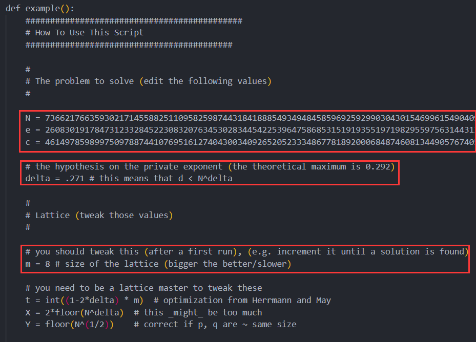

## 算法原理

### 公钥、私钥的生成

> 算法由两个密钥，即公钥和私钥组成。
> 1）准备两个非常大的素数 p 和 q（转换成二进制后 1024 个二进制位或者更多，位数越多越难破解）；
> 2）利用字符串模拟计算大素数 p 和 q 的乘积 n=pq；
> 3）同样方法计算 m=(p−1)(q−1)，这里的 m 为 n 的欧拉函数；
> 4）找到一个数 e(1<e<m)，满足 gcd(m,e)=1（即 e 和 m 互素）；
> 5）计算 e 在模 m 域上的逆元 d（即满足 ed mod m=1）；
> 6）至此，公钥和私钥生成完毕：(n,e) 为公钥，(n,d) 为私钥；

### 加密

对于明文 x，用公钥 (n,e) 对 x 加密的过程，就是将 x 转换成数字（字符串的话取其 ASCII码或者 unicode 值），然后通过幂取模计算出 y，其中 y 就是密文；

### 解密

对于密文 y，用私钥 (n,d) 对 y 进行解密的过程和加密类似，同样是计算幂取模；

### 破解

而对于外界来说，知道的只有公钥 (n,e)，如何通过这两个已知数得到明文？

- 首先，明文需要密文的 d 次幂模上 n 来计算，所以首先要知道 d；
- d 为 e 对 ϕ(n) 的逆元，如果知道 ϕ(n)，则能够通过扩展欧几里德算法计算出 d；
- ϕ(n)=(p−1)(q−1)，其中 p 和 q 均为素数，只有得知 p 和 q 的值才能计算出 ϕ(n)；
- n=pq，n 已知，所以如果能够分解 n，则 p 和 q 就能被计算出来。

## 题型总结

### 1. N = r**4 * q = p * q * r，已知r

#### challenge

```Python
from secret import flag,init
from Crypto.Util.number import *
from sage.all import *
from gmpy2 import iroot
m = bytes_to_long(flag.encode())
r = getPrime(128)

p = init
# for i in range(r-1):
#     p += next_prime(init)

# assert iroot(p,3)[1] == 1
q = getPrime(12)
# N = p*q*r
N = r**4*q
e = getPrime(17)
c = pow(m,e,N)
print(f"r = {r}")
print(f"e = {e}")
print(f"c = {c}")

# r = 287040188443069778047400125757341514899
# e = 96001
# c = 7385580281056276781497978538020227181009675544528771975750499295104237912389096731847571930273208146186326124578668216163319969575131936068848815308298035625
```

#### exp

```python
p ** (1/3) 为整数 -> t ** 3 = p -> r=t
N = p * q * r = r ** 4 * q
p = r**3
phi = [r**(4-1)*(r-1) * (q-1)]
    = [r**3 * (r-1) * (q-1)]
    = [(r**4 - r**3) * (q-1)]
q = getPrime(12) -> 可爆破获取
```

```Python
from Crypto.Util.number import *

r = 287040188443069778047400125757341514899
e = 96001
c = 7385580281056276781497978538020227181009675544528771975750499295104237912389096731847571930273208146186326124578668216163319969575131936068848815308298035625

for i in range(2**12):
    q = i
    if not isPrime(q):
        continue
    phi = (r**4 - r**3) * (q - 1)
    d = inverse(e, phi)
    m = pow(c, d, r**4 *q)
    m = (long_to_bytes(m))
    if b"flag" in m:
        print(m)
        break    
```

网上的[WP](https://mp.weixin.qq.com/s/pZwJGkX4kRHZUvHjnpf2NQ)有个答案不需要爆破：

```Python
from Crypto.Util.number import *
r = 287040188443069778047400125757341514899
e = 96001
c = 7385580281056276781497978538020227181009675544528771975750499295104237912389096731847571930273208146186326124578668216163319969575131936068848815308298035625
m = pow(c, inverse(e, r**4 - r**3), r**4)
print(long_to_bytes(m))
```

### 2. 

#### challenge

```Python
#!/usr/bin/env python3
# -*- coding: utf-8 -*-
from secret import flag
from Crypto.Util.number import *

p = getPrime(512)
q = getPrime(512)
t = getPrime(65)
s = getPrime(65)
P = getPrime(1024)
Q = getPrime(1024)


delta = getPrime(100)
n = p * q
e = 65537
m = bytes_to_long(flag.encode())

N = p * q * delta
c = pow(m, e, N)
leak = (s * P + t * Q + delta) % n
hint = p - s
# P = 91307300383014465303389363075431698588933838431961163766796972428733255940234665671679789435258337578396879726483195947952476118985507696067550566875810703327064257916213956673893327976728584687137639337961422903593701591152074826447530099276756806166361533554689114264018344629905535188048343259754284652017
# Q = 149089411480331249267443825847904508235946280550542428853480950085018092182435890098430254117786823782088885695848943795846175490059759543848516828825072642481794902650586147465149175976488985613001468444893241645390860978312924241181340390543064512602477917112031391367608345501790785857442379515898677467337
# n = 97339579366356507946846401691835843338581994635020856947574389213640653953117584127557153363761256108433474475102197685296591968229050609482457622390855692102761025647645801250282912327521623082583744902369819132264725498938021235699466656447009532567358416017236962637028458839659218745744825556065623673913
# N = 72077628115206161977315177371814064093288033362281459918751639032623658967593542855291047617938064177930014574391486973767462937337649946356572406647109942552336519343063401327708412361664750917582404375485334706345485264831286788789648126355202140531434534406410829696252616051882952860015344370516517084357909896281965899571934196572691
# leak = 45439323369250400352006541741265096780554398472451037280607564706700682873365442581062404781075514235328183754475227917775810587457541607767765455164339314322631781126065808432845447798024685402323868389611285038950397054020330610558058133599416135943335731904873776868614834960217751934513462319743149481906
# c = 31456530156035981140909630437789986968079386074106871160743980387785993275753486380185420818239283975922682050323918081691381897642776414263991442096807392948925867761878299044300335666219533277719472330029607869735373712681522022301659090108633692457216985013550482473362675907949633024047291607542103649091410575340884845190483766424507
# hint = 13318665442465244206832303588726230530847297247590371628366697082014350966833522479782161994817212671730145702818662148370306660550486536176566012104254910
```

#### exp

```python
from Crypto.Util.number import *
import itertools


def small_roots(f, bounds, m=1, d=None):
    if not d:
        d = f.degree()
    R = f.base_ring()
    N = R.cardinality()
    f /= f.coefficients().pop(0)
    f = f.change_ring(ZZ)

    G = Sequence([], f.parent())
    for i in range(m + 1):
        base = N ^ (m - i) * f ^ i
        for shifts in itertools.product(range(d), repeat=f.nvariables()):
            g = base * prod(map(power, f.variables(), shifts))
            G.append(g)
    B, monomials = G.coefficient_matrix()
    monomials = vector(monomials)
    factors = [monomial(*bounds) for monomial in monomials]
    for i, factor in enumerate(factors):
        B.rescale_col(i, factor)
    B = B.dense_matrix().LLL()
    B = B.change_ring(QQ)
    for i, factor in enumerate(factors):
        B.rescale_col(i, 1 / factor)
    H = Sequence([], f.parent().change_ring(QQ))
    for h in filter(None, B * monomials):
        H.append(h)
        I = H.ideal()
        if I.dimension() == -1:
            H.pop()
        elif I.dimension() == 0:
            roots = []
            for root in I.variety(ring=ZZ):
                root = tuple(R(root[var]) for var in f.variables())
                roots.append(root)
            return roots
    return []


e = 65537
P = 91307300383014465303389363075431698588933838431961163766796972428733255940234665671679789435258337578396879726483195947952476118985507696067550566875810703327064257916213956673893327976728584687137639337961422903593701591152074826447530099276756806166361533554689114264018344629905535188048343259754284652017
Q = 149089411480331249267443825847904508235946280550542428853480950085018092182435890098430254117786823782088885695848943795846175490059759543848516828825072642481794902650586147465149175976488985613001468444893241645390860978312924241181340390543064512602477917112031391367608345501790785857442379515898677467337
n = 97339579366356507946846401691835843338581994635020856947574389213640653953117584127557153363761256108433474475102197685296591968229050609482457622390855692102761025647645801250282912327521623082583744902369819132264725498938021235699466656447009532567358416017236962637028458839659218745744825556065623673913
N = 72077628115206161977315177371814064093288033362281459918751639032623658967593542855291047617938064177930014574391486973767462937337649946356572406647109942552336519343063401327708412361664750917582404375485334706345485264831286788789648126355202140531434534406410829696252616051882952860015344370516517084357909896281965899571934196572691
leak = 45439323369250400352006541741265096780554398472451037280607564706700682873365442581062404781075514235328183754475227917775810587457541607767765455164339314322631781126065808432845447798024685402323868389611285038950397054020330610558058133599416135943335731904873776868614834960217751934513462319743149481906
c = 31456530156035981140909630437789986968079386074106871160743980387785993275753486380185420818239283975922682050323918081691381897642776414263991442096807392948925867761878299044300335666219533277719472330029607869735373712681522022301659090108633692457216985013550482473362675907949633024047291607542103649091410575340884845190483766424507
hint = 13318665442465244206832303588726230530847297247590371628366697082014350966833522479782161994817212671730145702818662148370306660550486536176566012104254910
delta = N // n

# ---------- 求解s、t ----------
# 二元coppersmith
PR.< x, y > = PolynomialRing(Zmod(n))
f = P*x + Q*y + delta - leak
ans = small_roots(f, bounds=(2 ^ 70, 2 ^ 70), m=3, d=3)
print(ans)
# ------------------------------

s = 30656796668419630391
t = 35875762848049841267
p = hint + s
q = n // p
assert p*q == n
phi = (p - 1) * (q - 1) * (delta - 1)
d = inverse(e, phi)
m = pow(c, d, n)
print(long_to_bytes(m))
```

### 3. $d < N^{0.29}$，Boneh-Durfee攻击 

#### challenge

```Python
from Crypto.Util.number import getPrime, inverse, bytes_to_long
# from secret import flag

flag = b''
flag = bytes_to_long(flag)

def gen():
    p = getPrime(512)
    q = getPrime(512)
    d = getPrime(282)
    n = p * q
    phi = (p - 1) * (q - 1)
    try:
        e = inverse(d, phi)
    except:
        return gen()
    c = pow(flag, e, n)
    return n, e, c

n, e, c = gen()
print(f'{n = }\n{e = }\n{c = }')

"""
N = 73662176635930217145588251109582598744318418885493494845859692592990304301546996154904097420724904838772056137908521735803973827790665774255932629529776216900362889972771913683024723128622502292694632281143536586986352764727899291750703185204118126673717387089701233154888606074285445820360105604776003690487 
e = 26083019178473123328452230832076345302834454225396475868531519193551971982955975631443131705619185405190763284436613436828597887376946206551305947183212830810924956452635880343496593901027606468731840531964306285933726727512533644720818081124507069662781291949841231431546394148749720394411454774153995026037 
c = 46149785989975097887441076951612740430034092652052333486778189200068487460813449057674051203125773261695615434443270333980225346411838188124458064365680435783802887397970067324393852247219619820813993601444322710186223021625645961186730735728928546458428244830359782270698452792224875596683123815246426241726 
"""
```

#### exp

[RSA-and-LLL-attacks/boneh_durfee.sage](https://github.com/mimoo/RSA-and-LLL-attacks/blob/master/boneh_durfee.sage)

修改如下：



获取私钥：


