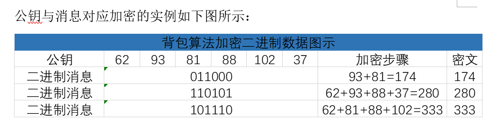
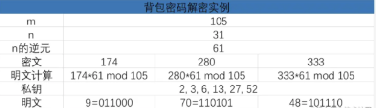
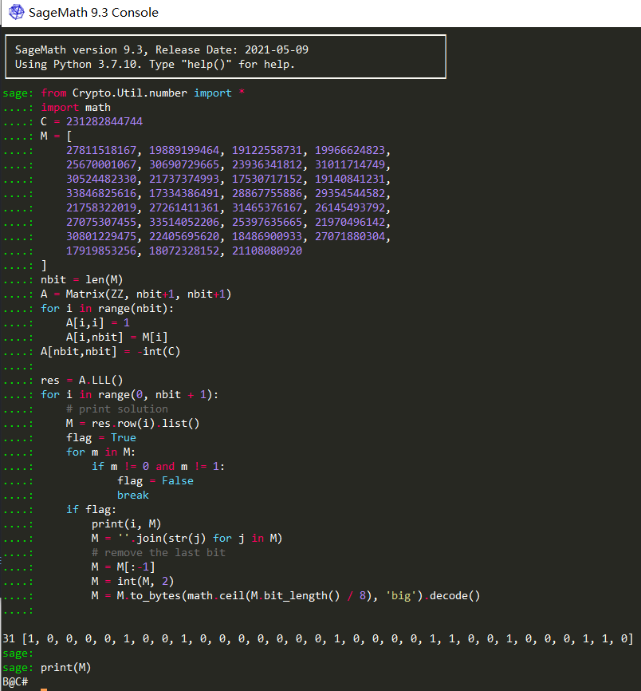

## 算法解释

密码问题是依靠难解的问题来确保其加密性，背包问题就是背包密码的困难问题。

> 假设一个背包的最多可以承重为`W`，有`n`个物体，重量分别为`a1,a2,a3……,an`，并且每个物品只能被装一次，问装哪些物品可以恰好使得背包装满。

式子表达：$b_1a_1 + b_2a_2 + ... + b_na_n = W$

`a`为物体重量，`b`表示有或没有，即0或1，0表示没有，1表示有。

### 超递增序列

定义：**序列中每一项都大于前面所有项之和**，例如：`[1,3,6,11,23,45]`

在背包问题当中，若物品的重量列表是一个超递增序列，这个问题是很容易的出答案的，解决超递增序列的背包问题主要有以下几个步骤：

1. 假如有一个背包，背包的重量已知，将这个背包的重量与我们已知的超递增序列中的最大值进行比较
   1. 如果背包的重量小于这个数，那么这个数不在背包中
   2. 如果重量大于或等于这个数，那么这个数在背包中
   3. 用背包的重量减去这个数，得出的结果继续与序列中的下一个数进行比较，重复比较直到比较完为止
   4. 如果背包的总重量减到0则该背包问题得出解，反之则无解

### 加解密

1. 私钥：$[a_1, a_2, a_3,...,a_n]$
   1. 超递增序列
2. 公钥：$d \equiv n*a \bmod m $
   1. 选取$n,m$，私钥里面的每一个值乘以$n$模$m$
   2. $m$应大于序列中所有数之和
   3. $n$与$m$互素
3. 加密
   1. 对二进制明文数据分组，每组长度为$len(d)$
   2. 将公钥与二进制数据一一对应，求和
   3. 
4. 解密
   1. 计算$n$关于$m$的逆元：$n^{-1} *n\equiv 1 \bmod m$
   2. 每个密文乘$n^{-1}$在模$m$：
      1. $m' \equiv c * n^{-1} \bmod m$
      2. $m' \equiv d*m*n^{-1} \equiv n * a * m * n * n^{-1} \equiv a*n \bmod m$
   3. 用私钥进行求解$m$（超递增序列解法）
   4. 

#### 代码

```Python
import gmpy2
import math

# 解决背包问题
def resolve(a, w):
    b = []
    for i in range(len(a) - 1, -1 , -1):
        an = a[i]
        if w < an:
            b.insert(0, 0)
        else:
            w = w - an
            b.insert(0, 1)
    return b

# 以私钥生成公钥
def create_pubkey(private_key, n, m):
    assert m > sum(private_key), gmpy2.gcd(n, m) == 1
    pubkey = [(k * n) % m for k in private_key]
    return pubkey

# 用生成的公钥加密
def encrypto(message, pubkey):
    message = [int(bit) for bit in bin(int.from_bytes(message.encode(), 'big'))[2:]]
    message = [0] * (8 - len(message) % 8) + message
    message += [0] * (len(pubkey) - len(message) % len(pubkey))
    cipher = []
    for i in range(0, len(message), len(pubkey)):
        cipher.append(0)
        for j in range(len(pubkey)):
            cipher[-1] += message[i + j] * pubkey[j]
    return cipher

# 处理密文，再用私钥解密
def decrypto(cipher, n, m, private_key):
    phi_n = gmpy2.invert(n, m)
    message = []
    for c in cipher:
        cip = c * phi_n % m
        message += resolve(private_key, cip)
    message = message[:-(len(message) % 8)]
    message = int(''.join(str(i) for i in message), 2)
    message = message.to_bytes(
        math.ceil(message.bit_length() / 8), 'big'
    ).decode()
    return message

# 示例
if __name__ == '__main__':
    # 私钥为超递增序列
    private_key = [1, 3, 6, 11, 23, 45]
    n = 41
    m = 95
    message = "helloworld"
    pubkey = create_pubkey(private_key, n, m)
    print(f'pubkey: {pubkey}')
    cipher = encrypto(message, pubkey)
    print(f'cipher: {cipher}')
    mes = decrypto(cipher, n, m, private_key)
    print(f'message: {mes}')
```

### 破解

有详细讲 👉

[asis-ctf-quals-2014 ](https://github.com/ctfs/write-ups-2014/tree/b02bcbb2737907dd0aa39c5d4df1d1e270958f54/asis-ctf-quals-2014/archaic)

[格密码笔记（二）](https://www.ruanx.net/lattice-2/)

#### challenge

```Python
#!/usr/bin/env python3
# -*- coding: utf-8 -*-

from sage.all import *
from secret import flag
from Crypto.Util.number import *
from math import log2

class Knapsack:
    def __init__(self,n,m):
        self.M = []
        self.n = n
        self.m = self.pre(m)
        self.A = 0
        self.B = 0
        
    def pre(self,m):
        tmp_m = bin(m)[2:]
        t = []
        for tmp in tmp_m:
            t.append(int(tmp))
        return t
    
    def get_M(self):
        seq = [randint(2**34,2**35) for _ in range(self.n)]
        self.M = seq
        
    def calc_density(self):
        t = log2(max(self.M))
        d = self.n/t
        print(d)

    def enc(self):
        self.get_M()
        self.calc_density()
        C = 0
        for t in range(len(self.m)):
            C += self.m[t] * self.M[t]
        print(f"C = {C}")
        print(f"M = {self.M}")
        
if __name__=="__main__":
    m = bytes_to_long(flag.encode())
    n = m.bit_length()
    k = Knapsack(n,m)
    k.enc()

# C = 231282844744
# M = [27811518167, 19889199464, 19122558731, 19966624823, 25670001067, 30690729665, 23936341812, 31011714749, 30524482330, 21737374993, 17530717152, 19140841231, 33846825616, 17334386491, 28867755886, 29354544582, 21758322019, 27261411361, 31465376167, 26145493792, 27075307455, 33514052206, 25397635665, 21970496142, 30801229475, 22405695620, 18486900933, 27071880304, 17919853256, 18072328152, 21108080920]
```

##### exp

```python
from Crypto.Util.number import *
import math
C = 231282844744
M = [
    27811518167, 19889199464, 19122558731, 19966624823, 
    25670001067, 30690729665, 23936341812, 31011714749, 
    30524482330, 21737374993, 17530717152, 19140841231, 
    33846825616, 17334386491, 28867755886, 29354544582, 
    21758322019, 27261411361, 31465376167, 26145493792, 
    27075307455, 33514052206, 25397635665, 21970496142, 
    30801229475, 22405695620, 18486900933, 27071880304, 
    17919853256, 18072328152, 21108080920
]
nbit = len(M)
A = Matrix(ZZ, nbit+1, nbit+1)
for i in range(nbit):
    A[i,i] = 1
    A[i,nbit] = M[i]
A[nbit,nbit] = -int(C)

res = A.LLL()
for i in range(0, nbit + 1):
    # print solution
    M = res.row(i).list()
    flag = True
    for m in M:
        if m != 0 and m != 1:
            flag = False
            break
    if flag:
        print(i, M)
        M = ''.join(str(j) for j in M)
        # remove the last bit
        M = M[:-1]
        M = int(M, 2)
        M = M.to_bytes(math.ceil(M.bit_length() / 8), 'big').decode()
        print(M)
```

SageMath shell 运行：



