# volatity2

volatity2 为 python2使用的，其所需的库也要用python2的pip下载。

## 用法

```
Volatility Foundation Volatility Framework 2.6
用法： Volatility - 内存取证分析平台
 
Options:
  -h, --help            列出所有可用选项及其默认值
                        默认值可以在配置文件中设置
                        (/etc/volatilityrc)
  --conf-file=/home/kali/.volatilityrc
                        基于用户的配置文件
  -d, --debug           调试Volatility
  --plugins=PLUGINS     要使用的其他插件目录（冒号分隔）
  --info                打印所有注册对象的信息
  --cache-directory=/home/kali/.cache/volatility
                        存放缓存文件的目录
  --cache               使用缓存
  --tz=TZ               设置 (Olson) 时区以使用 pytz（如果已安装）或 tzset 显示时间戳
  -f FILENAME, --filename=FILENAME
                        打开图像时使用的文件名
  --profile=WinXPSP2x86
                        要加载的配置文件的名称（使用 --info 查看支持的配置文件列表）
  -l LOCATION, --location=LOCATION
                        从中加载地址空间的 URN 位置
  -w, --write           启用写支持
  --dtb=DTB             DTB 地址
  --shift=SHIFT         Mac KASLR 移位地址
  --output=text         以这种格式输出（支持特定于模块，请参阅下面的模块输出选项）
  --output-file=OUTPUT_FILE
                        在此文件中写入输出
  -v, --verbose         详细信息
  -g KDBG, --kdbg=KDBG  指定一个 KDBG 虚拟地址（注意：对于 64 位 Windows 8 及更高版本，这是 KdCopyDataBlock 的地址）
  --force               强制使用可疑配置文件
  -k KPCR, --kpcr=KPCR  指定特定的 KPCR 地址
  --cookie=COOKIE       指定 nt!ObHeaderCookie 的地址（仅适用于 Windows 10）
 
	支持的插件命令:
 
		amcache        	查看AmCache应用程序痕迹信息
		apihooks       	检测内核及进程的内存空间中的API hook
		atoms          	列出会话及窗口站atom表
		atomscan       	Atom表的池扫描(Pool scanner)
		auditpol       	列出注册表HKLMSECURITYPolicyPolAdtEv的审计策略信息
		bigpools       	使用BigPagePoolScanner转储大分页池(big page pools)
		bioskbd        	从实时模式内存中读取键盘缓冲数据(早期电脑可以读取出BIOS开机密码)
		cachedump      	获取内存中缓存的域帐号的密码哈希
		callbacks      	打印全系统通知例程
		clipboard      	提取Windows剪贴板中的内容
		cmdline        	显示进程命令行参数
		cmdscan        	提取执行的命令行历史记录（扫描_COMMAND_HISTORY信息）
		connections    	打印系统打开的网络连接(仅支持Windows XP 和2003)
		connscan       	打印TCP连接信息
		consoles       	提取执行的命令行历史记录（扫描_CONSOLE_INFORMATION信息）
		crashinfo      	提取崩溃转储信息
		deskscan       	tagDESKTOP池扫描(Poolscaner)
		devicetree     	显示设备树信息
		dlldump        	从进程地址空间转储动态链接库
		dlllist        	打印每个进程加载的动态链接库列表
		driverirp      	IRP hook驱动检测
		drivermodule   	关联驱动对象至内核模块
		driverscan     	驱动对象池扫描
		dumpcerts      	提取RAS私钥及SSL公钥
		dumpfiles      	提取内存中映射或缓存的文件
		dumpregistry   	转储内存中注册表信息至磁盘
		editbox        	查看Edit编辑控件信息 (Listbox正在实验中)
		envars         	显示进程的环境变量
		eventhooks     	打印Windows事件hook详细信息
		evtlogs        	提取Windows事件日志（仅支持XP/2003)
		filescan       	提取文件对象（file objects）池信息
		gahti          	转储用户句柄（handle）类型信息
		gditimers      	打印已安装的GDI计时器(timers)及回调(callbacks)
		gdt            	显示全局描述符表(Global Deor Table)
		getservicesids 	获取注册表中的服务名称并返回SID信息
		getsids        	打印每个进程的SID信息
		handles        	打印每个进程打开的句柄的列表
		hashdump       	转储内存中的Windows帐户密码哈希(LM/NTLM)
		hibinfo        	转储休眠文件信息
		hivedump       	打印注册表配置单元信息
		hivelist       	打印注册表配置单元列表
		hivescan       	注册表配置单元池扫描
		hpakextract    	从HPAK文件（Fast Dump格式）提取物理内存数据
		hpakinfo       	查看HPAK文件属性及相关信息
		idt            	显示中断描述符表(Interrupt Deor Table)
		iehistory      	重建IE缓存及访问历史记录
		imagecopy      	将物理地址空间导出原生DD镜像文件
		imageinfo      	查看/识别镜像信息
		impscan        	扫描对导入函数的调用
		joblinks       	打印进程任务链接信息
		kdbgscan       	搜索和转储潜在KDBG值
		kpcrscan       	搜索和转储潜在KPCR值
		ldrmodules     	检测未链接的动态链接DLL
		lsadump        	从注册表中提取LSA密钥信息（已解密）
		machoinfo      	转储Mach-O 文件格式信息
		malfind        	查找隐藏的和插入的代码
		mbrparser      	扫描并解析潜在的主引导记录(MBR)
		memdump        	转储进程的可寻址内存
		memmap         	打印内存映射
		messagehooks   	桌面和窗口消息钩子的线程列表
		mftparser      	扫描并解析潜在的MFT条目
		moddump        	转储内核驱动程序到可执行文件的示例
		modscan        	内核模块池扫描
		modules        	打印加载模块的列表
		multiscan      	批量扫描各种对象
		mutantscan     	对互斥对象池扫描
		notepad        	查看记事本当前显示的文本
		objtypescan    	扫描窗口对象类型对象
		patcher        	基于页面扫描的补丁程序内存
		poolpeek       	可配置的池扫描器插件
		printkey       	打印注册表项及其子项和值
		privs          	显示进程权限
		procdump       	进程转储到一个可执行文件示例
		pslist         	按照EPROCESS列表打印所有正在运行的进程
		psscan         	进程对象池扫描
		pstree         	以树型方式打印进程列表
		psxview        	查找带有隐藏进程的所有进程列表
		qemuinfo       	转储 Qemu 信息
		raw2dmp        	将物理内存原生数据转换为windbg崩溃转储格式
		screenshot     	基于GDI Windows的虚拟屏幕截图保存
		servicediff    	Windows服务列表(ala Plugx)
		sessions       	_MM_SESSION_SPACE的详细信息列表(用户登录会话)
		shellbags      	打印Shellbags信息
		shimcache      	解析应用程序兼容性Shim缓存注册表项
		shutdowntime   	从内存中的注册表信息获取机器关机时间
		sockets        	打印已打开套接字列表
		sockscan       	TCP套接字对象池扫描
		ssdt           	显示SSDT条目
		strings        	物理到虚拟地址的偏移匹配(需要一些时间，带详细信息)
		svcscan        	Windows服务列表扫描
		symlinkscan    	符号链接对象池扫描
		thrdscan       	线程对象池扫描
		threads        	调查_ETHREAD 和_KTHREADs
		timeliner      	创建内存中的各种痕迹信息的时间线
		timers         	打印内核计时器及关联模块的DPC
		truecryptmaster	Recover 	恢复TrueCrypt 7.1a主密钥
		truecryptpassphrase		查找并提取TrueCrypt密码
		truecryptsummary	TrueCrypt摘要信息
		unloadedmodules	打印卸载的模块信息列表
		userassist     	打印注册表中UserAssist相关信息
		userhandles    	转储用户句柄表
		vaddump        	转储VAD数据为文件
		vadinfo        	转储VAD信息
		vadtree        	以树形方式显示VAD树信息
		vadwalk        	显示遍历VAD树
		vboxinfo       	转储Virtualbox信息（虚拟机）
		verinfo        	打印PE镜像中的版本信息
		vmwareinfo     	转储VMware VMSS/VMSN 信息
		volshell       	内存镜像中的shell
		windows        	打印桌面窗口(详细信息)
		wintree        	Z顺序打印桌面窗口树
		wndscan        	池扫描窗口站
		yarascan       	以Yara签名扫描进程或内核内存
```

### 详细点

`python2 vol.py -f xxx imageinfo`：获取镜像信息。

`volatility - f xxx --profile=操作系统  操作`：执行相关操作。

## 插件

插件所需放置位置：

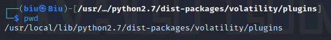

1. mimikazt
  1. 获取内存中的密码
2. usbstor
  1. 扫描注册表查找插入系统的USB设备
3. lasspass
  1. 扫描注册表查找插入系统的USB设备
4. bitlocker
  1. 找到并提取BitLocker全卷加密密钥(FVEK)，可以用来解密BitLocker卷。

# volatility3

python3下使用的volatility。

类似，只是命令不太同。

## 用法

### 具体

```shell
vol -f mem文件 [plugin]
```

```
python3 vol.py [plugin] -f [image]
 
常用插件：
    layerwriter：列出内存镜像platform信息
    linux.bash：从内存中恢复bash命令历史记录
    linux.check_afinfo：验证网络协议的操作功能指针
    linux.check_syscall：检查系统调用表中的挂钩
    linux.elfs：列出所有进程的所有内存映射ELF文件
    linux.lsmod：列出加载的内核模块
    linux.lsof：列出所有进程的所有内存映射
    linux.malfind：列出可能包含注入代码的进程内存范围
    linux.proc：列出所有进程的所有内存映射
    linux.pslist：列出linux内存映像中存在的进程
    linux.pstree：列出进程树
    mac.bash：从内存中恢复bash命令历史记录
    mac.check_syscall：检查系统调用表中的挂钩
    mac.check_sysctl：检查sysctl处理程序的挂钩
    mac.check_trap_table：检查trap表中的挂钩
    mac.ifconfig：列出网卡信息
    mac.lsmod：列出加载的内核模块
    mac.lsof：列出所有进程的所有内存映射
    mac.malfind：列出可能包含注入代码的进程内存范围
    mac.netstat：列出所有进程的所有网络连接
    mac.psaux：恢复程序命令行参数
    mac.pslist：列出linux内存映像中存在的进程
    mac.pstree：列出进程树
    mac.tasks：列出Mac内存映像中存在的进程
    windows.info：显示正在分析的内存样本的OS和内核详细信息
    windows.callbacks：列出内核回调和通知例程
    windows.cmdline：列出进程命令行参数
    windows.dlldump：将进程内存范围DLL转储
    windows.dlllist：列出Windows内存映像中已加载的dll模块
    windows.driverirp：在Windows内存映像中列出驱动程序的IRP
    windows.driverscan：扫描Windows内存映像中存在的驱动程序
    windows.filescan：扫描Windows内存映像中存在的文件对象
    windows.handles：列出进程打开的句柄
    windows.malfind：列出可能包含注入代码的进程内存范围
    windows.moddump：转储内核模块
    windows.modscan：扫描Windows内存映像中存在的模块
    windows.mutantscan：扫描Windows内存映像中存在的互斥锁
    windows.pslist：列出Windows内存映像中存在的进程
    windows.psscan：扫描Windows内存映像中存在的进程
    windows.pstree：列出进程树
    windows.procdump：转储处理可执行映像
    windows.registry.certificates：列出注册表中存储的证书
    windows.registry.hivelist：列出内存映像中存在的注册表配置单元
    windows.registry.hivescan：扫描Windows内存映像中存在的注册表配置单元
    windows.registry.printkey：在配置单元或特定键值下列出注册表项
    windows.registry.userassist：打印用户助手注册表项和信息
    windows.ssdt：列出系统调用表
    windows.strings：读取字符串命令的输出，并指示每个字符串属于哪个进程
    windows.svcscan：扫描Windows服务
    windows.symlinkscan：扫描Windows内存映像中存在的链接
```

# Arsenal Image Mounter

挂载磁盘镜像文件。

选择磁盘镜像文件后点击 OK，即可。

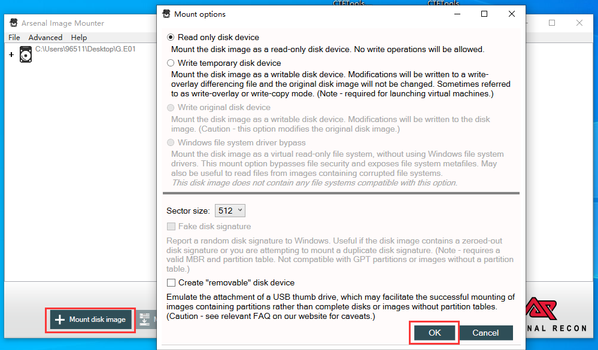

# Elcomsoft Forensic Disk Decryptor

暴力型全功能分布式密码恢复工具。

## 破解Bitlocker密钥

1. Decrypt or mount disk
2. Physical disk\partition
3. 选择挂载上的磁盘以及相应的内存文件
   1. 
4. 破解完成，下一页
   1. 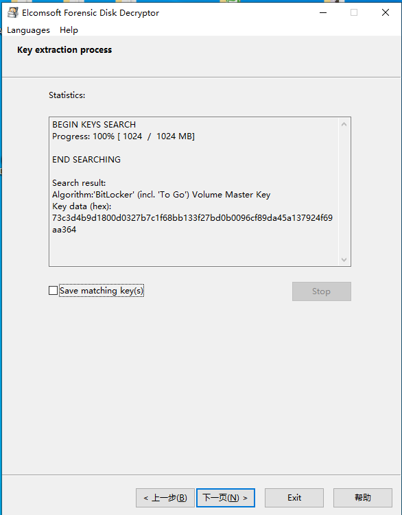
5. 获取key
   1. 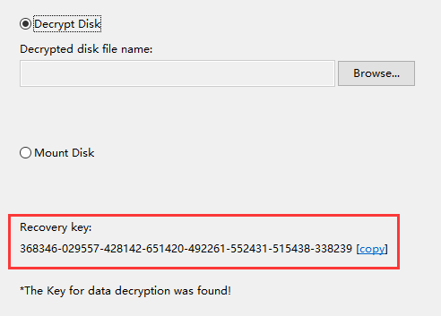
6. 将获取的恢复密钥，解密磁盘
   1. 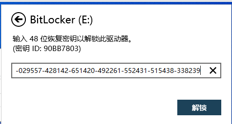

# Passware Kit Forensic

## 破解文件密码

1. 文件拖入，选择自定义
   1. 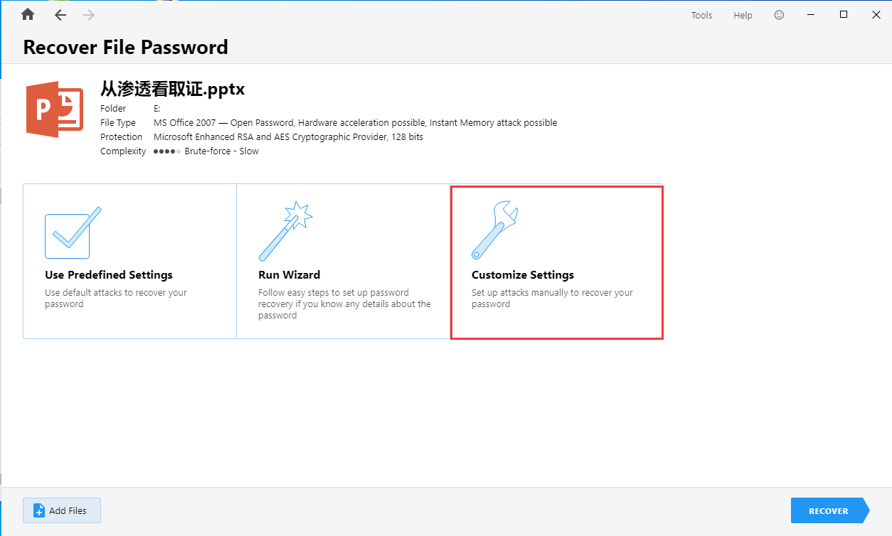
2. 字典攻击（这里给出了包含其密码的字典）
   1. 添加字典攻击
      1. 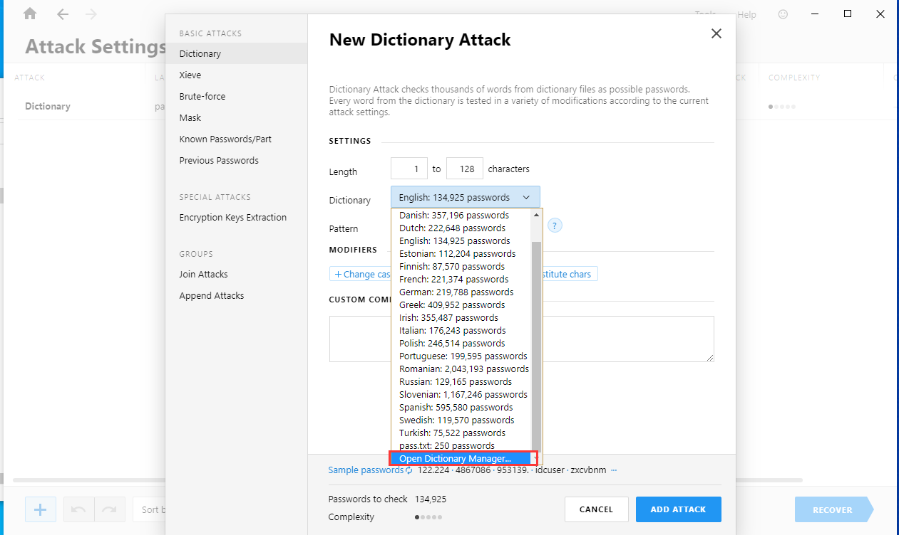
   2. 选定字典文件
      1. 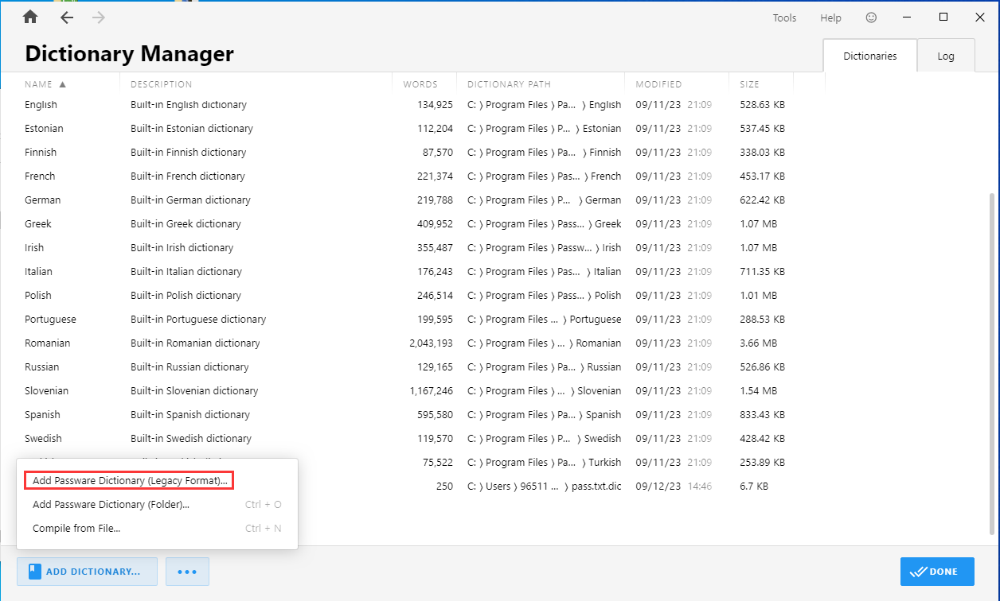
3. 获取密码
   1. 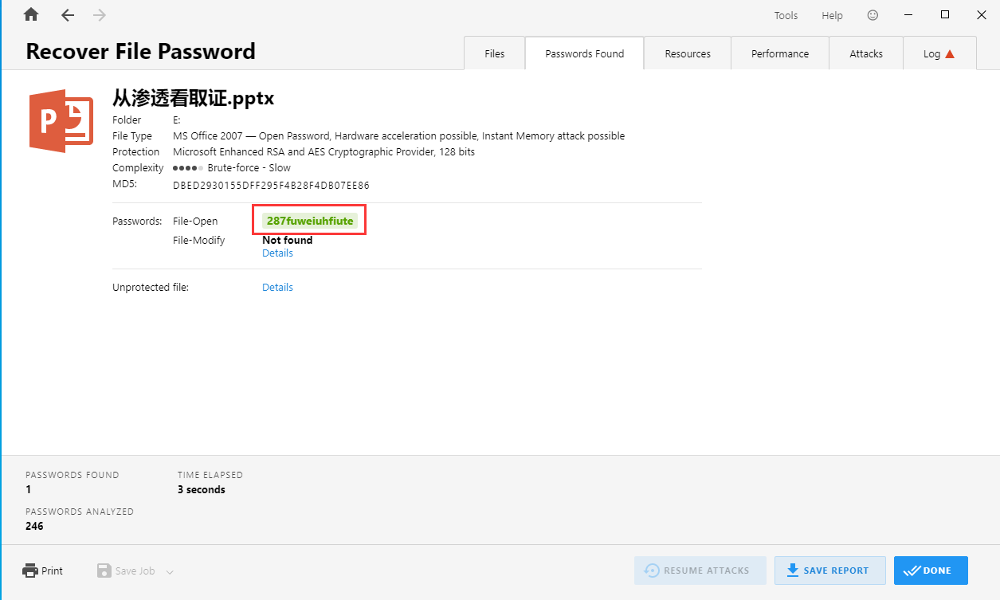

## 内存分析

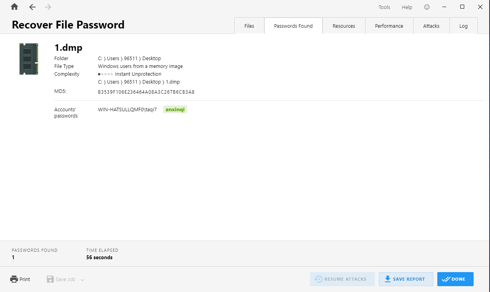

## 解密True Crypt卷

1. 选择True Crypt，然后选择True Crypt容器文件和内存映像文件。
   1. 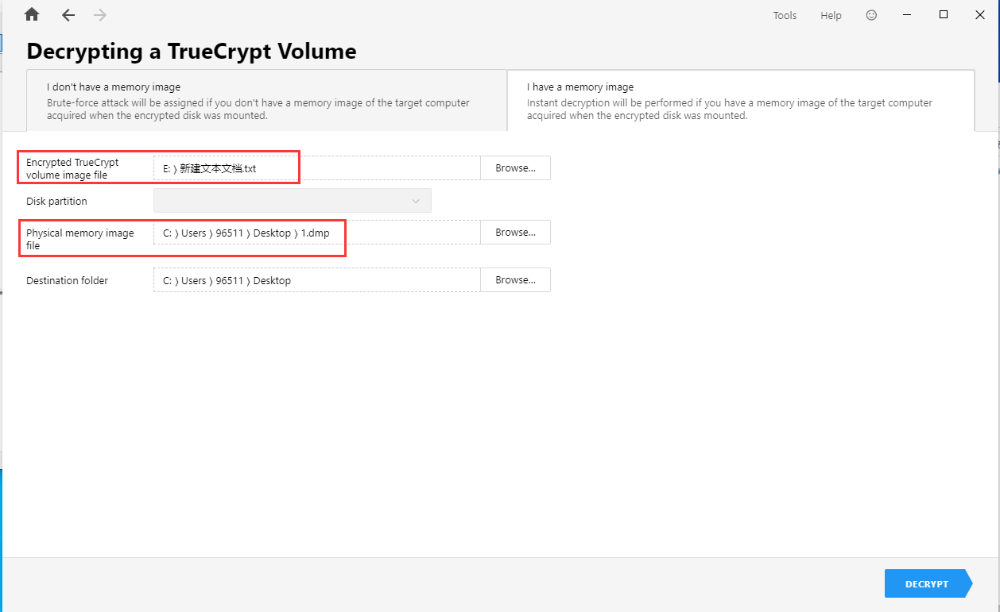
2. 得到输出文件，即未加密的TrueCrypt容器，挂载即可查看其文件。

## 解密BitLocker分区

1. 选择BitLocker，选择Bitlocker容器文件和内存映像文件。
   1. 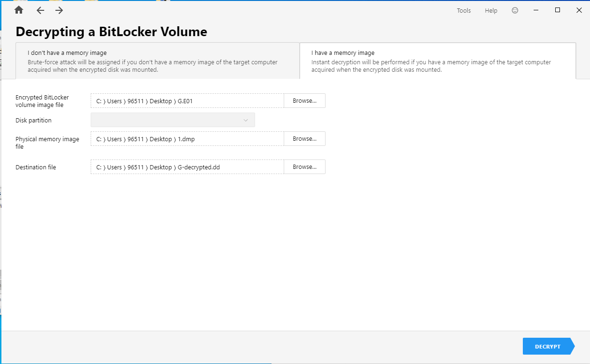
2. 获得恢复密钥
   1. 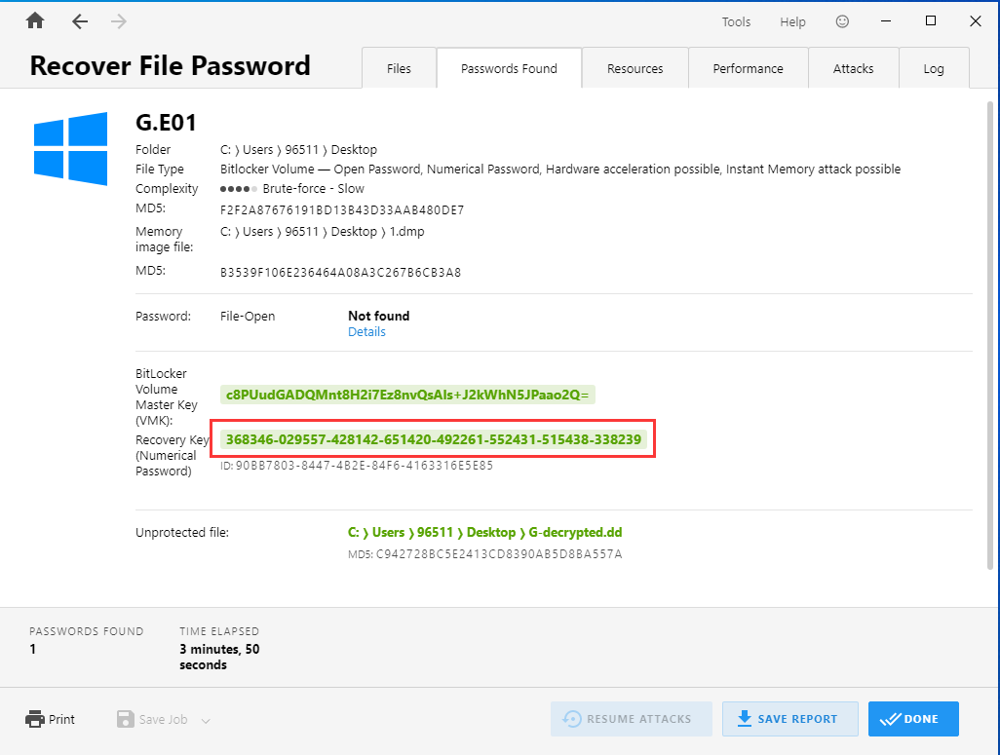
   2. 其中有输出dd文件，可直接挂载查看其文件。

# AccessData FTK Imager

## 挂载TrueCrypt容器

挂载完即可在G盘中看到。

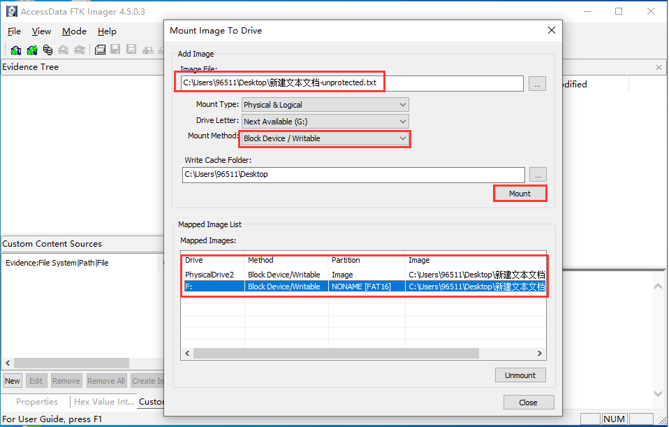

## 报错UnknownType

使用FTK挂在后，使用DiskGenius修复磁盘：

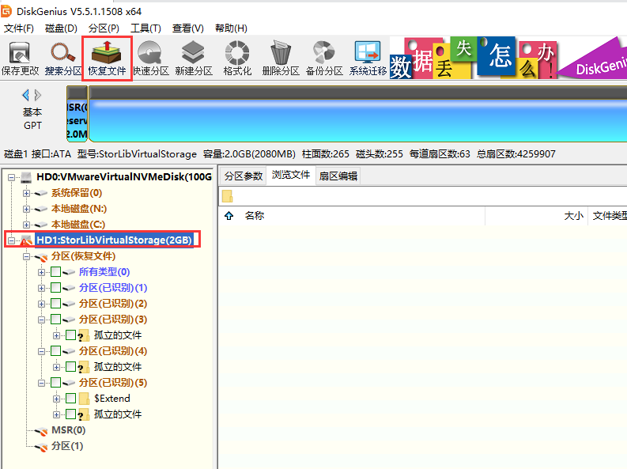

即可使用访问文件：

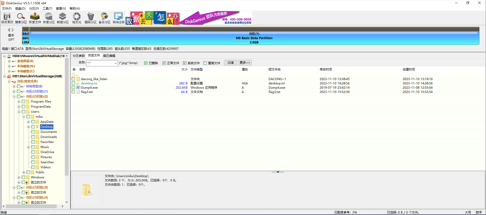

# 一些命令

## findstr

`findstr /s "iBoot" *`：在当前文件夹及子文件夹下查询所有包含“iBoot”的文件和位置。

`find /www/wwwroot/v9.licai.com/ -name *.php* |xargs grep '密码不正确'`：`find /www/wwwroot/v9.licai.com/ -name *.php*`：这部分命令使用`find`命令在指定的目录`/www/wwwroot/v9.licai.com/`及其子目录中查找文件。`-name`选项后面跟着`*.php*`，表示查找文件名中包含`.php`的文件，`*`是通配符，可以匹配任何字符。这将列出所有具有`.php`扩展名的文件。

```powershell
FINDSTR [/B] [/E] [/L] [/R] [/S] [/I] [/X] [/V] [/N] [/M] [/O] [/P] [/F:file]
        [/C:string] [/G:file] [/D:dir list] [/A:color attributes] [/OFF[LINE]]
        strings [[drive:][path]filename[ ...]]

  /B         在一行的开始配对模式。
  /E         在一行的结尾配对模式。
  /L         按字使用搜索字符串。
  /R         将搜索字符串作为一般表达式使用。
  /S         在当前目录和所有子目录中搜索匹配文件。
  /I         指定搜索不分大小写。
  /X         打印完全匹配的行。
  /V         只打印不包含匹配的行。
  /N         在匹配的每行前打印行数。
  /M         如果文件含有匹配项，只打印其文件名。
  /O         在每个匹配行前打印字符偏移量。
  /P         忽略有不可打印字符的文件。
  /OFF[LINE] 不跳过带有脱机属性集的文件。
  /A:attr    指定有十六进位数字的颜色属性。请见 "color /?"
  /F:file    从指定文件读文件列表 (/ 代表控制台)。
  /C:string  使用指定字符串作为文字搜索字符串。
  /G:file    从指定的文件获得搜索字符串。 (/ 代表控制台)。
  /D:dir     查找以分号为分隔符的目录列表
  strings    要查找的文字。
  [drive:][path]filename
             指定要查找的文件。

除非参数有 /C 前缀，请使用空格隔开搜索字符串。
例如: 'FINDSTR "hello there" x.y' 在文件 x.y 中寻找 "hello" 或
"there"。'FINDSTR /C:"hello there" x.y' 文件 x.y  寻找
"hello there"。

一般表达式的快速参考:
  .        通配符: 任何字符
  *        重复: 以前字符或类出现零或零以上次数
  ^        行位置: 行的开始
  $        行位置: 行的终点
  [class]  字符类: 任何在字符集中的字符
  [^class] 补字符类: 任何不在字符集中的字符
  [x-y]    范围: 在指定范围内的任何字符
  \x       Escape: 元字符 x 的文字用法
  \<xyz    字位置: 字的开始
  xyz\>    字位置: 字的结束
```

## Get-FileHash

```
名称
    Get-FileHash
语法
    Get-FileHash [-Path] <string[]>  [<CommonParameters>]
    Get-FileHash  [<CommonParameters>]
    Get-FileHash  [<CommonParameters>]
```

# firmwalker.sh

`电子取证/firmwalker.sh {被测试文件系统根目录} {扫描结果输出路径}`

## R-STUDIO

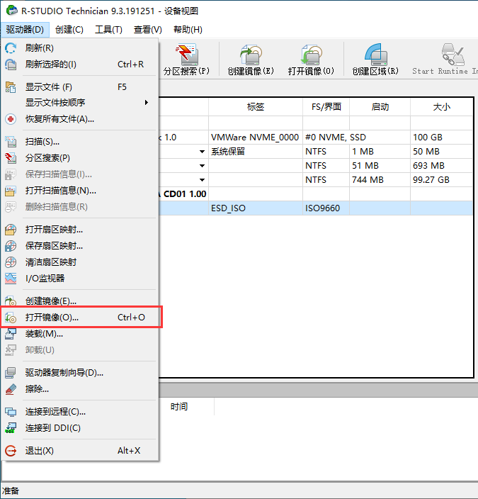

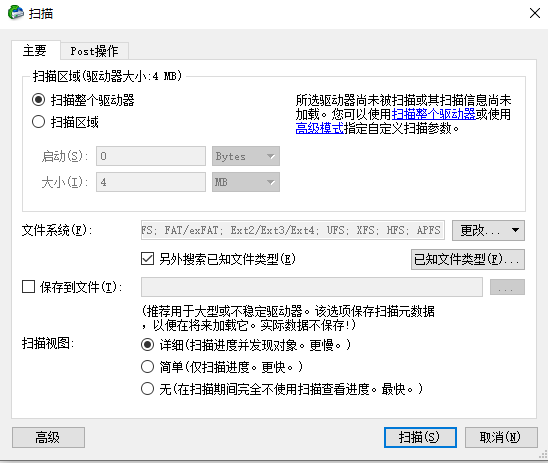

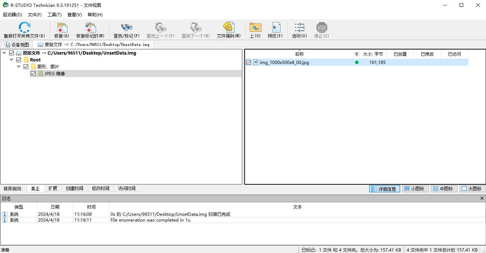
