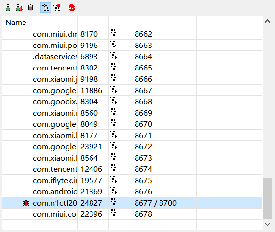
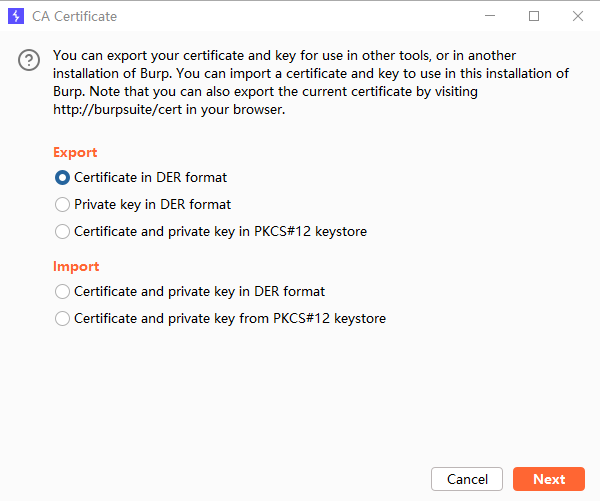

# JNI

当虚拟机加载SO后，会首先到符号表中找一个名为JNI_OnLoad的函数，如果找到了，会立刻调用它。

## 静态注册

在`src/main`下创建`cpp`目录，并且创建`cpp`文件：`boss.cpp`

```cpp
#include <jni.h>
extern "C" {
    jstring Java_com_example_apk2_Boss_stringFromJNI(JNIEnv *env, jobject obj) {
        return env->NewStringUTF("Boss is B1u");
    }
}
```

在`src/main`下创建`make`文件：`CMakeLists.txt`

```cmake
cmake_minimum_required(VERSION 3.4.1)

# 设置源文件目录
set(SOURCE_DIR ${CMAKE_SOURCE_DIR})

# 添加 C++ 源文件
add_library(
        boss
        SHARED
        ${SOURCE_DIR}/boss.cpp)

# 包含头文件目录
include_directories(${SOURCE_DIR})

# 找到预构建的库
find_library(
        log-lib
        log)

# 链接库
target_link_libraries(
        boss
        ${log-lib})
```

`build.gradle.kts`添加：

```
android {
	...
    // 配置 CMake
    externalNativeBuild {
        cmake {
            path = file("src/main/cpp/CMakeLists.txt")
            version = "3.10.2"
        }
    }
}
```

创建类：

```kotlin
package com.example.apk2
class Boss {
    // 声明本地方法
    external fun stringFromJNI(): String
    companion object {
        // 加载本地库
        init {
            System.loadLibrary("boss")
        }
    }
}
```

## 动态注册

修改cpp：

```cpp
#include <jni.h>
jstring stringFromJNI(JNIEnv *env, jobject obj) {
    return env->NewStringUTF("Boss is B1u");
}
JNINativeMethod methods[]= {
        {"stringFromJNI", "()Ljava/lang/String;", (void*)stringFromJNI}
};
jint JNI_OnLoad(JavaVM *vm, void *reserved) {
    JNIEnv *env;
    vm->GetEnv((void**)&env,JNI_VERSION_1_4);
    jclass classTest = env->FindClass("com/example/apk2/Boss");
    env->RegisterNatives(classTest, methods, sizeof(methods)/sizeof(JNINativeMethod));
    return JNI_VERSION_1_4;
}
```

### 删除so符号表

```cmake
cmake_minimum_required(VERSION 3.4.1
set(CMAKE_CXX_FLAGS "${CMAKE_CXX_FLAGS} -fvisibility=hidden")
# 设置源文件目录
set(SOURCE_DIR ${CMAKE_SOURCE_DIR})
# 添加 C++ 源文件
add_library(
        boss
        SHARED
        ${SOURCE_DIR}/boss.cpp)
# 包含头文件目录
include_directories(${SOURCE_DIR})
```

# Apk 编译混淆

`app/proguard-rules.pro`中：

```
-optimizationpasses 5                                                           # 指定代码的压缩级别
-dontusemixedcaseclassnames                                                     # 是否使用大小写混合
-dontskipnonpubliclibraryclasses                                                # 是否混淆第三方jar
-dontpreverify                                                                  # 混淆时是否做预校验
-verbose                                                                        # 混淆时是否记录日志
-optimizations !code/simplification/arithmetic,!field/*,!class/merging/*        # 混淆时所采用的算法

-keep public class * extends android.app.Activity                               # 保持哪些类不被混淆
-keep public class * extends android.app.Application                            # 保持哪些类不被混淆
-keep public class * extends android.app.Service                                # 保持哪些类不被混淆
-keep public class * extends android.content.BroadcastReceiver                  # 保持哪些类不被混淆
-keep public class * extends android.content.ContentProvider                    # 保持哪些类不被混淆
-keep public class * extends android.app.backup.BackupAgentHelper               # 保持哪些类不被混淆
-keep public class * extends android.preference.Preference                      # 保持哪些类不被混淆
-keep public class com.android.vending.licensing.ILicensingService              # 保持哪些类不被混淆

-keepclasseswithmembernames class * {                                           # 保持 native 方法不被混淆
    native <methods>;
}

-keepclasseswithmembers class * {                                               # 保持自定义控件类不被混淆
    public <init>(android.content.Context, android.util.AttributeSet);
}

-keepclasseswithmembers class * {                                               # 保持自定义控件类不被混淆
    public <init>(android.content.Context, android.util.AttributeSet, int);     
}

-keepclassmembers class * extends android.app.Activity {                        # 保持自定义控件类不被混淆
   public void *(android.view.View);
}

-keepclassmembers enum * {                                                      # 保持枚举 enum 类不被混淆
    public static **[] values();
    public static ** valueOf(java.lang.String);
}

-keep class * implements android.os.Parcelable {                                # 保持 Parcelable 不被混淆
  public static final android.os.Parcelable$Creator *;
}

-keep class MyClass;                                                            # 保持自己定义的类不被混淆
```

`app/build.gradle.kts`：

```
android {
    buildTypes {
        release {
            isMinifyEnabled = true
            isShrinkResources = true
            isZipAlignEnabled = true
            proguardFiles(
                getDefaultProguardFile("proguard-android-optimize.txt"),
                "proguard-rules.pro"
            )
        }
    }
}
```


# 反编译与回编译

## Apktool

```shell
// 反编译
apktool.bat d .\target.apk
// 回编译
apktool.bat b .\target
```

1. 在回编译的时候报错信息：`error: No resource identifier found for attribute 'alpha' in package 'com.xxx' W:`
   1. 在反编译apk的时候加上`-r`参数：`apktool -r d target.apk -o target`
   2. 加上`-r`参数不会反编译资源文件，在再次打包时就不会报资源找不到的错误
2. 

# 调试

## so调试

1. 设备的`ro.debuggable`需为`1`
   1. `magisk resetprop ro.debuggable 1; stop; start;`
2. 设备启动`android_server`，在本地的`23946`端口监听
   1. 若是使用真机，这里的本地，指的是手机的网络，需要使用`adb forward tcp:23946 tcp:23946`
   2. 若是使用模拟器，则不需要
3. 以调试模式启动程序`adb shell am start -D -n com.n1ctf2024.ezapk/.MainActivity`
4. IDA设置`localhost`，开始Attach
5. 此时，IDA进入调试，APK仍`waiting for debugger`
6. 打开ddms（`...\android-sdk-windows\tools\ddms.bat`）查看端口
   1. 当 JVM 启动时，如果启用了调试模式，它会监听指定的端口以等待调试器（如 JDB）的连接。
   2. `8677`是调试端口，`8700`是ddms给的映射端口
   3. 
7. jdb连接：` jdb -connect com.sun.jdi.SocketAttach:port=8700,hostname=localhost`
   1. ddms还挂着的时候，可以使用`8700`
   1. 不然使用`8677`


# Android证书（真机）

burpsuit下载证书，保存为cer，导入到手机。



1. 用户：
   1. 导入Android；
   2. Android安装证书；
2. 系统：
   1. `openssl x509 -inform DER -in .\bp.cer -out .\bp.pem`
   2. `openssl x509 -inform PEM -subject_hash_old -in .\bp.pem` 得到哈希值：`9a5ba575`，重命名为 `9a5ba575.0`
   3. 移至 `/system/etc/security/cacerts/`
      1. 需要 `/system` 的读写权限
   4. `chmod 644 9a5ba575.0; chgrp root 9a5ba575.0`
3. Android设置代理为电脑IP及端口。


