# oppo众包 app

## 伪造请求

### 配置burpsuite和模拟器

配置burpsuite：

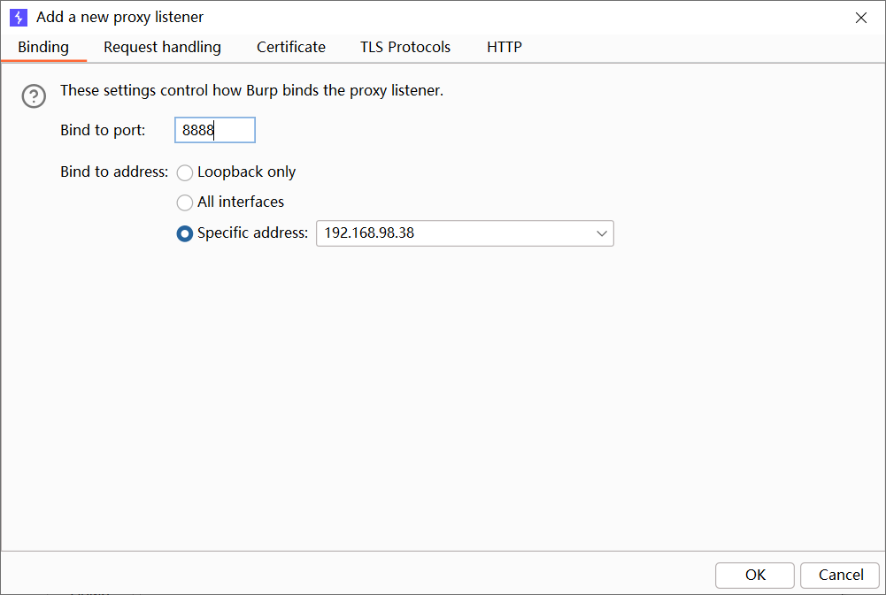

配置模拟器：

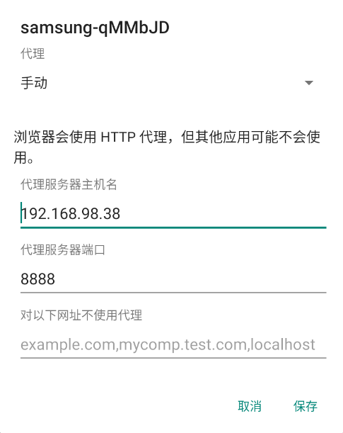

然后安装证书，这一步看网上的方法（模拟器访问burp，下载证书，然后安装）不成功

[雷电模拟器(安卓9)将bp证书安装为系统证书](https://www.chuxuejiaocheng.com/e18e0bf67d.html)👈这个方法成功了

```shell
openssl x509 -inform DER -in cacert.der -out cacert.pem 
openssl x509 -inform PEM -subject_hash_old -in .\cacert.pem

adb push .\9a5ba575.0 /data/local/tmp/

adb shell
star2qltechn:/ $ su
su
1|:/ # mount -o remount -o rw /
mount -o remount -o rw /
:/ # ls /data/local/tmp/
ls /data/local/tmp/
9a5ba575.0         crakeme.dex    re.frida.server
android_server64   frida-server64 shizuku
android_x64_server oat            shizuku_starter
:/ # cp /data/local/tmp/9a5ba575.0 /system/etc/security/cacerts/
cp /data/local/tmp/9a5ba575.0 /system/etc/security/cacerts/
:/ # chmod 644 /system/etc/security/cacerts/9a5ba575.0
chmod 644 /system/etc/security/cacerts/9a5ba575.0
:/ # reboot
reboot
```

### 分析功能

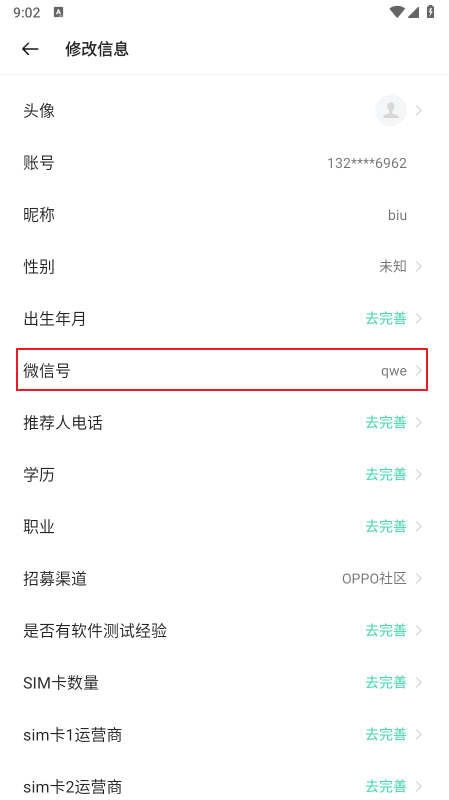

点击修改微信号，然后输入，app会发送向`/api/app/user/auth/insertCrowdPortra`网络数据包。

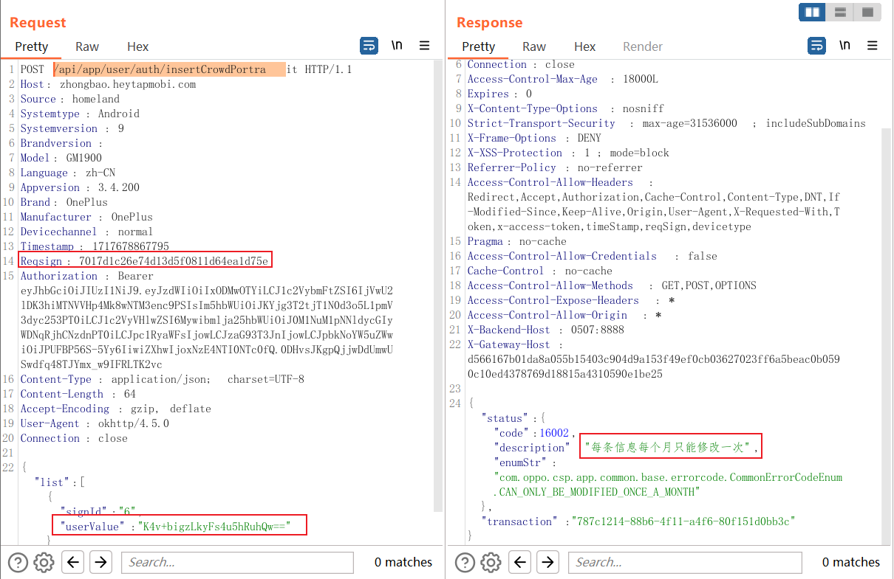

发送相同微信号的数据包的`Reqsign`和`Timestamp`不一样：

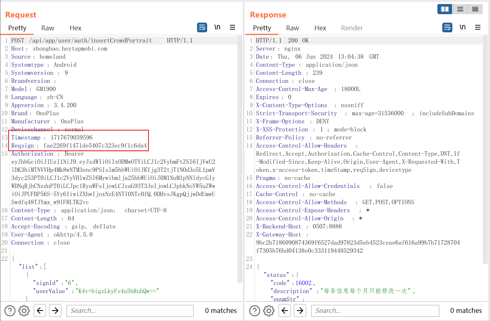

输入不同微信号时，`userValue`、`Reqsign`、`Timestamp`都不一样：

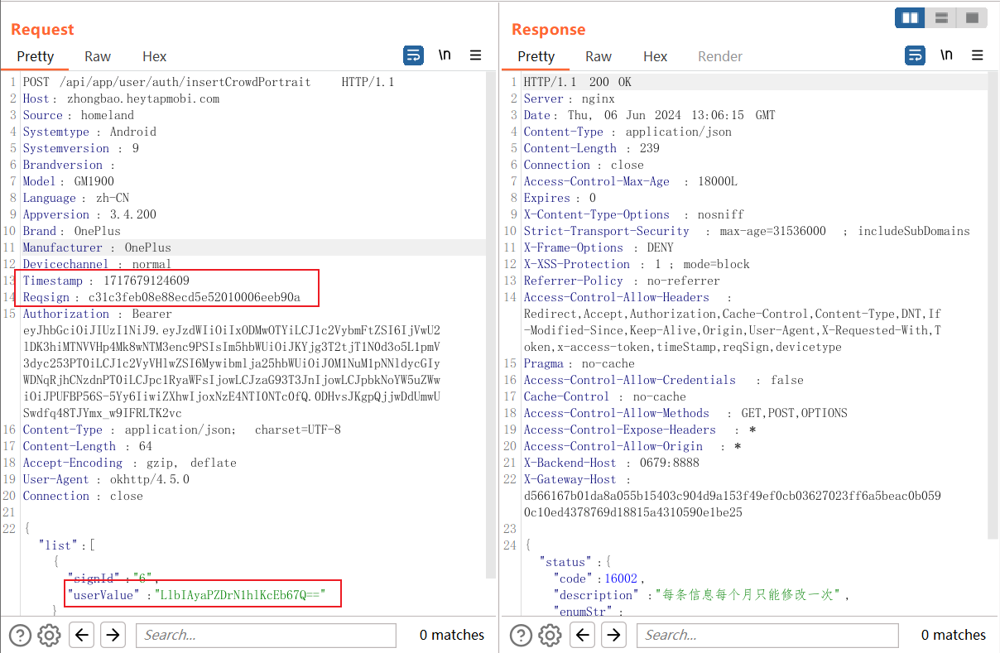

篡改`userValue`，会导致回复签名错误：

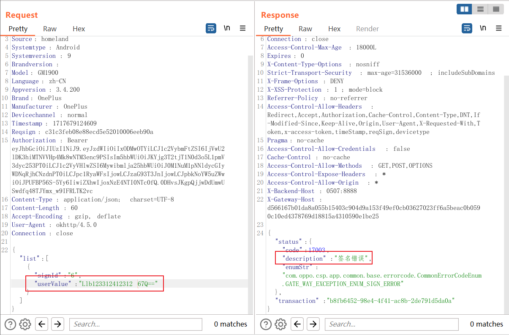

### 分析代码

#### userValue

##### jadx找到加密微信名

搜索api：

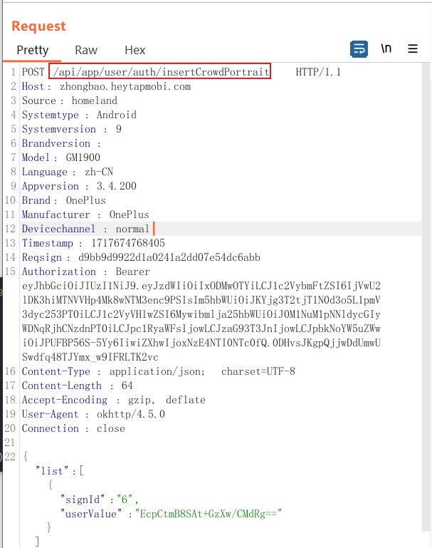

只有一个结果：

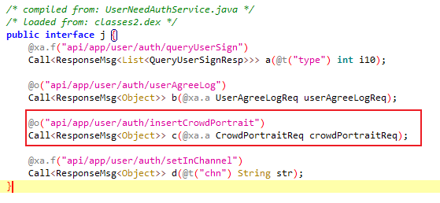

查找`c`的用例，也是只有一个：

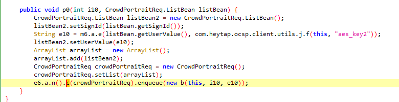

上面的逻辑就是查找`key`，然后获取输入，进行加密，然后结果添加到`list`中，应该是`request`的`list`。

具体加密代码如下，就是个AES加密：

```java
public static String e(String ptext, String key) {
    try {
        Cipher cipher = Cipher.getInstance("AES/CBC/PKCS5Padding");
        cipher.init(1, f(key), new IvParameterSpec(key.getBytes()));
        byte[] doFinal = cipher.doFinal(ptext.getBytes(utf8_encode));
        m0.a("encrypt-data  result=" + ptext);
        return b(doFinal);
    } catch (Exception e10) {
        m0.a("encrypt-data  result exception=" + e10.toString());
        g(e10);
        return TextUtils.isEmpty(ptext) ? "" : ptext;
    }
}

public static SecretKeySpec f(String str) {
    return new SecretKeySpec(h(str, 32, UCDeviceInfoUtil.DEFAULT_MAC).getBytes(utf8_encode), "AES");
}
private static String h(String str, int i10, String str2) {
    int length = str.length();
    if (length < i10) {
        StringBuilder sb = new StringBuilder();
        sb.append(str);
        for (int i11 = 0; i11 < i10 - length; i11++) {
            sb.append(str2);
        }
        return sb.toString();
    }
    return str;
}
public static String b(byte[] bArr) {
    return Base64.encodeToString(bArr, 2);
}
```

##### frida获取密钥

frida直接hook加密的函数就可以获取密钥：

```java script
Java.perform(function() {
    var aClass = Java.use('m6.a');
    aClass.e.implementation = function (ptext, key) {
        var result = this.e(ptext, key);
        console.log("a.e(" + ptext + "," + key + ") return: " + result);
        return result;
    };
});
```

得到密钥：`zbLoginJwt@20221`


##### 自行加密

直接修改下源码，得到：

```Java
import javax.crypto.Cipher;
import javax.crypto.spec.IvParameterSpec;
import javax.crypto.spec.SecretKeySpec;
import java.util.Base64;

public class test {
    public static void main(String[] args) throws Exception {
        String k = "zbLoginJwt@20221";
        String name = "B1ubiu2024";
        String sign = encrypt(name, k);
        System.out.println("CipherText:" + sign);
        //        String c = "EcpCtmB8SAt+GzXw/CMdRg==";
        String p = decrypt(sign, k);
        System.out.println("PlainText:" + p);

    }

    public static String encrypt(String ptext, String key) {
        try {
            Cipher cipher = Cipher.getInstance("AES/CBC/PKCS5Padding");
            cipher.init(Cipher.ENCRYPT_MODE, f(key), new IvParameterSpec(key.getBytes()));
            byte[] doFinal = cipher.doFinal(ptext.getBytes());
            byte[] encodedByteArray = Base64.getEncoder().encode(doFinal);
            return new String(encodedByteArray);
        } catch (Exception e10) {
            System.out.println(e10);
        }
        return "";
    }

    public static String decrypt(String ctext, String key) {
        try {
            Cipher cipher = Cipher.getInstance("AES/CBC/PKCS5Padding");
            cipher.init(Cipher.DECRYPT_MODE, f(key), new IvParameterSpec(key.getBytes()));
            byte[] decodedByteArray = Base64.getDecoder().decode(ctext);
            byte[] doFinal = cipher.doFinal(decodedByteArray);
            return new String(doFinal);
        } catch (Exception e10) {
            System.out.println(e10);
        }
        return "";
    }

    public static SecretKeySpec f(String str) {
        return new SecretKeySpec(h(str).getBytes(), "AES");
    }

    private static String h(String str) {
        int length = str.length();
        if (length < 32) {
            return str + "0".repeat(32 - length);
        }
        return str;
    }

}
```

#### Regsign签名

搜索`Reqsign`，其实就一个，其他都是`reqsignin`。

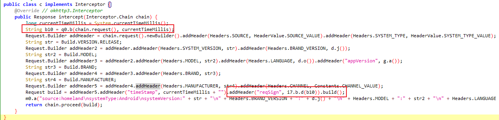

i7.b.d为生成md5，实际内容为b10。

直接hook`q0.b`看一看：

```javascript
Java.perform(function() {
    var q0Class = Java.use('com.heytap.ocsp.client.utils.q0');
    q0Class.b.implementation = function (request, j10) {
        var result = this.b(request, j10);
        console.log("q0.b -> return: " + result);
        return result;
    };
});
```

输入两个一样的微信号，只有时间戳是不同的：

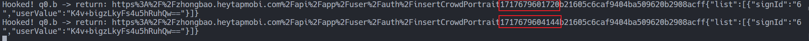

这个签名包含的信息有时间戳、URL、请求体。

`userValue`上面写了，可以自行生成，因此，这个签名很容易伪造。

### 伪造

伪造思路：

1. 对name进行加密
2. 生成时间戳
3. 组成content以进行md5

代码如下：

```java
import javax.crypto.Cipher;
import javax.crypto.spec.IvParameterSpec;
import javax.crypto.spec.SecretKeySpec;
import java.math.BigInteger;
import java.nio.charset.StandardCharsets;
import java.security.MessageDigest;
import java.util.Base64;
import java.util.Date;

public class test {
    public static <nstant> void main(String[] args) throws Exception {
        String url = "https%3A%2F%2Fzhongbao.heytapmobi.com%2Fapi%2Fapp%2Fuser%2Fauth%2FinsertCrowdPortrait";
        String mid = "b21605c6caf9404ba509620b2908acff{\"list\":[{\"signId\":\"6\",\"userValue\":\"";
        String suffix = "\"}]}";
        String k = "zbLoginJwt@20221";
        String name = "B1ubiu2024";
        System.out.println("Name:" + name);
        String c = encrypt(name, k);
        System.out.println("CipherText:" + c);
        Date date = new Date();
        long timestamp = date.getTime();
        System.out.println("Timestamp: " + timestamp);
        String content = url + timestamp + mid + c + suffix;
        MessageDigest md = MessageDigest.getInstance("MD5");
        byte[] messageDigest = md.digest(content.getBytes(StandardCharsets.UTF_8));
        BigInteger no = new BigInteger(1, messageDigest);
        StringBuilder md5 = new StringBuilder(no.toString(16));
        while (md5.length() < 32) {
            md5.insert(0, "0");
        }
        System.out.println("MD5:" + md5);

    }

    public static String encrypt(String ptext, String key) {
        try {
            Cipher cipher = Cipher.getInstance("AES/CBC/PKCS5Padding");
            cipher.init(Cipher.ENCRYPT_MODE, f(key), new IvParameterSpec(key.getBytes()));
            byte[] doFinal = cipher.doFinal(ptext.getBytes());
            byte[] encodedByteArray = Base64.getEncoder().encode(doFinal);
            return new String(encodedByteArray);
        } catch (Exception e10) {
            System.out.println("encrypt-data result exception=" + e10);
        }
        return "";
    }

    public static String decrypt(String ctext, String key) {
        try {
            Cipher cipher = Cipher.getInstance("AES/CBC/PKCS5Padding");
            cipher.init(Cipher.DECRYPT_MODE, f(key), new IvParameterSpec(key.getBytes()));
            byte[] decodedByteArray = Base64.getDecoder().decode(ctext);
            byte[] doFinal = cipher.doFinal(decodedByteArray);
            return new String(doFinal);
        } catch (Exception e10) {
            System.out.println("decrypt-data result exception=" + e10);
        }
        return "";
    }

    public static SecretKeySpec f(String str) {
        return new SecretKeySpec(h(str).getBytes(), "AES");
    }

    private static String h(String str) {
        int length = str.length();
        if (length < 32) {
            return str + "0".repeat(32 - length);
        }
        return str;
    }

}
```

结果如下：

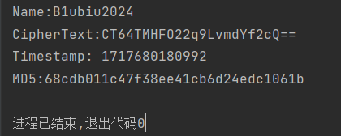

根据其生成结果尝试发送数据包，成功伪造：

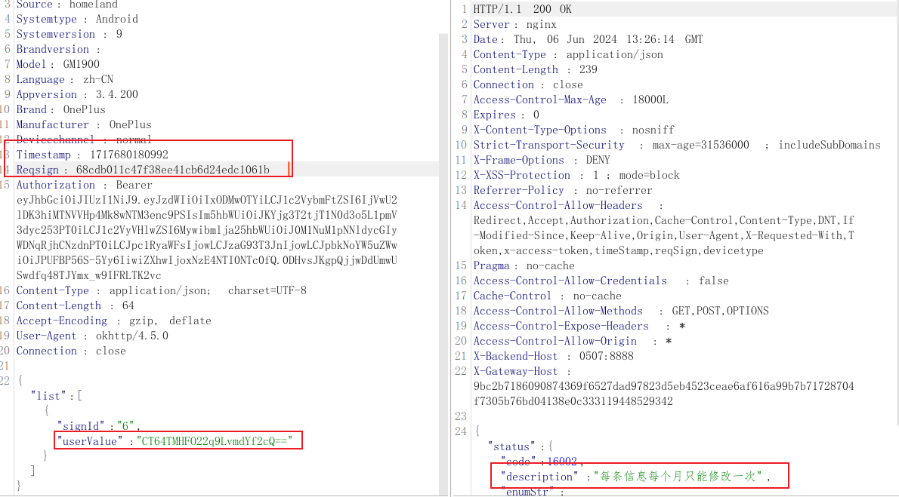

## app发送修改微信号请求的逻辑

### 拦截器

首先，定义了一个拦截器，为请求添加timeStamp、reqSign等请求头。

```java
public class c implements Interceptor {
    @Override // okhttp3.Interceptor
    public Response intercept(Interceptor.Chain chain) {
        long currentTimeMillis = System.currentTimeMillis();
        String b10 = q0.b(chain.request(), currentTimeMillis);
        Request.Builder addHeader = chain.request().newBuilder().addHeader(Headers.SOURCE, HeaderValue.SOURCE_VALUE).addHeader(Headers.SYSTEM_TYPE, HeaderValue.SYSTEM_TYPE_VALUE);
        String str = Build.VERSION.RELEASE;
        Request.Builder addHeader2 = addHeader.addHeader(Headers.SYSTEM_VERSION, str).addHeader(Headers.BRAND_VERSION, d.j());
        String str2 = Build.MODEL;
        Request.Builder addHeader3 = addHeader2.addHeader(Headers.MODEL, str2).addHeader(Headers.LANGUAGE, d.o()).addHeader("appVersion", g.a());
        String str3 = Build.BRAND;
        Request.Builder addHeader4 = addHeader3.addHeader(Headers.BRAND, str3);
        String str4 = Build.MANUFACTURER;
        Request.Builder addHeader5 = addHeader4.addHeader(Headers.MANUFACTURER, str4).addHeader(Headers.CHANNEL, Constants.CHANNEL_VALUE);
        Request build = addHeader5.addHeader("timeStamp", currentTimeMillis + "").addHeader("reqSign", i7.b.d(b10)).build();
        m0.a("source:homeland\nsystemType:Android\nsystemVersion:" + str + "\n" + Headers.BRAND_VERSION + ":" + d.j() + "\n" + Headers.MODEL + ":" + str2 + "\n" + Headers.LANGUAGE + ":" + d.o() + "\nappVersion:" + g.a() + "\n" + Headers.BRAND + ":" + str3 + "\n" + Headers.MANUFACTURER + ":" + str4 + "\n" + Headers.CHANNEL + ":" + Constants.CHANNEL_VALUE + "\ntimeStamp:" + currentTimeMillis + "\nreqSign:" + i7.b.d(b10));
        return chain.proceed(build);
    }
}
```

其reqSign的生成为请求的URL+时间戳+请求体的md5。

### 服务对象创建

以下代码（仅部分有关代码）创建了`Retrofit`服务对象，从而使用该接口的方法从服务器获取数据。

然后在修改微信号的对应api：`api/app/user/auth/insertCrowdPortrait`，使用`p0`来处理。

```java
public interface j {
    @xa.f("api/app/user/auth/queryUserSign")
    Call<ResponseMsg<List<QueryUserSignResp>>> a(@t("type") int i10);

    @o("api/app/user/auth/userAgreeLog")
    Call<ResponseMsg<Object>> b(@xa.a UserAgreeLogReq userAgreeLogReq);

    @o("api/app/user/auth/insertCrowdPortrait")
    Call<ResponseMsg<Object>> c(@xa.a CrowdPortraitReq crowdPortraitReq);

    @xa.f("api/app/user/auth/setInChannel")
    Call<ResponseMsg<Object>> d(@t("chn") String str);
}

public class a {
    private static <T> T k(Class<T> cls) {
        q();
        return (T) new Retrofit.Builder().baseUrl(Constants.BASE_URL).client(h()).addConverterFactory(wa.a.a()).build().create(cls);
    }
    public static j n() {
        return (j) k(j.class);
    }
}

public class ChangeInfoActivity extends BaseActivity {
    public void p0(int i10, CrowdPortraitReq.ListBean listBean) {
        CrowdPortraitReq.ListBean listBean2 = new CrowdPortraitReq.ListBean();
        listBean2.setSignId(listBean.getSignId());
        String e10 = m6.a.e(listBean.getUserValue(), com.heytap.ocsp.client.utils.j.f(this, "aes_key2"));
        listBean2.setUserValue(e10);
        ArrayList arrayList = new ArrayList();
        arrayList.add(listBean2);
        CrowdPortraitReq crowdPortraitReq = new CrowdPortraitReq();
        crowdPortraitReq.setList(arrayList);
        e6.a.n().c(crowdPortraitReq).enqueue(new b(this, i10, e10));
    }
}
```

`p0`请求该api的逻辑为：

1. 由`listBean`获取`signid`
2. 由`listBean`获取用户输入
   1. 获取`aes_key2`对应的密钥
   2. 对用户输入进行AES加密
3. 将`signid`和密文设置到`listBean2`上，并加到`arrayList`队列
4. 然后放入请求队列发送

### 查找谁调用p0且怎么为listBean赋值

查看调用`p0`的逻辑（一直交叉引用往上找）：`p -> W -> M -> i0 -> p0`（代码顺序为从左至右，且只放了方法）

可以看到`p`中为listBean设置属性`signid`和`userValue`。

`userValue`为app中输入框的字符串

```java
public /* synthetic */ void p(View view) {
    if (this.f11981k == null) {
        return;
    }
    this.f11976f.setSignId(this.f11979i.getId());
    if (this.f11979i.getDivSign() != UserInfoInputType.TYPE_RADIO.value) {
        if (this.f11979i.getDivSign() != UserInfoInputType.TYPE_CHECK_BOX.value) {
            if (this.f11979i.getDivSign() != UserInfoInputType.TYPE_DATE_YEAR_MONTH.value) {
                if (this.f11979i.getDivSign() != UserInfoInputType.TYPE_BLANK.value) {
                    if (this.f11979i.getDivSign() != UserInfoInputType.TYPE_PROVINCE_CITY.value) {
                        if (this.f11979i.getDivSign() == UserInfoInputType.TYPE_DATE_YEAR_MONTH_DAY.value) {
                            CrowdPortraitReq.ListBean listBean = this.f11976f;
                            StringBuilder sb = new StringBuilder();
                            sb.append(this.f11978h.nearDatePicker.getYear());
                            sb.append("-");
                            sb.append(this.f11978h.nearDatePicker.getMonth() < 9 ? UCDeviceInfoUtil.DEFAULT_MAC + (this.f11978h.nearDatePicker.getMonth() + 1) : Integer.valueOf(this.f11978h.nearDatePicker.getMonth() + 1));
                            sb.append("-");
                            sb.append(this.f11978h.nearDatePicker.getDayOfMonth() < 9 ? UCDeviceInfoUtil.DEFAULT_MAC + this.f11978h.nearDatePicker.getDayOfMonth() : Integer.valueOf(this.f11978h.nearDatePicker.getDayOfMonth()));
                            listBean.setUserValue(sb.toString());
                        } else {
                            this.f11976f.setSignId("-1");
                        }
                    } else {
                        this.f11976f.setUserValue(this.f11978h.textPicker1.getCurrentSelect().getName() + this.f11978h.textPicker2.getCurrentSelect().getName());
                    }
                } else if (this.f11978h.inputText.getText() != null && !TextUtils.isEmpty(this.f11978h.inputText.getText().toString())) {
                    this.f11976f.setUserValue(this.f11978h.inputText.getText().toString());
                } else {
                    this.f11976f.setUserValue("");
                }
            } else {
                CrowdPortraitReq.ListBean listBean2 = this.f11976f;
                StringBuilder sb2 = new StringBuilder();
                sb2.append(this.f11978h.nearDatePicker.getYear());
                sb2.append("-");
                sb2.append(this.f11978h.nearDatePicker.getMonth() < 9 ? UCDeviceInfoUtil.DEFAULT_MAC + (this.f11978h.nearDatePicker.getMonth() + 1) : Integer.valueOf(this.f11978h.nearDatePicker.getMonth() + 1));
                listBean2.setUserValue(sb2.toString());
            }
        } else {
            StringBuilder sb3 = new StringBuilder();
            int i10 = 0;
            for (int i11 = 0; i11 < this.f11978h.selectCheckBox.getChildCount(); i11++) {
                if (((CheckBox) this.f11978h.selectCheckBox.getChildAt(i11)).isChecked()) {
                    i10++;
                }
            }
            for (int i12 = 0; i12 < this.f11978h.selectCheckBox.getChildCount(); i12++) {
                if (((CheckBox) this.f11978h.selectCheckBox.getChildAt(i12)).isChecked()) {
                    sb3.append(((CheckBox) this.f11978h.selectCheckBox.getChildAt(i12)).getText().toString());
                    if (i10 > 1) {
                        sb3.append("，");
                        i10--;
                    }
                }
            }
            if (TextUtils.isEmpty(sb3.toString())) {
                this.f11976f.setUserValue("");
            } else {
                this.f11976f.setUserValue(sb3.toString());
            }
        }
    } else {
        int checkedRadioButtonId = this.f11978h.selectRadioGroup.getCheckedRadioButtonId();
        if (checkedRadioButtonId == -1) {
            this.f11976f.setUserValue("");
        } else {
            this.f11976f.setUserValue(((RadioButton) this.f11978h.selectRadioGroup.findViewById(checkedRadioButtonId)).getText().toString());
        }
    }
    this.f11981k.a(this.f11977g, this.f11976f);
    a();
}

public void W(List<QueryUserSignResp> list) {
    this.H = list;
    for (final int i10 = 0; i10 < this.H.size(); i10++) {
        View inflate = LayoutInflater.from(this).inflate(R.layout.user_info_item, (ViewGroup) null);
        this.userInfoLayout.addView(inflate);
        LinearLayout.LayoutParams layoutParams = (LinearLayout.LayoutParams) inflate.getLayoutParams();
        layoutParams.width = -1;
        layoutParams.height = com.heytap.ocsp.client.utils.m.a(this, 52.0f);
        layoutParams.gravity = 16;
        if (i10 == this.H.size() - 1) {
            layoutParams.bottomMargin = 24;
        }
        ((TextView) inflate.findViewById(R.id.labelText)).setText(this.H.get(i10).getSignName());
        ((TextView) inflate.findViewById(R.id.attribute)).setText(m6.a.c(this.H.get(i10).getSelectValue(), com.heytap.ocsp.client.utils.j.f(this, "aes_key2")));
        inflate.setOnClickListener(new View.OnClickListener() { // from class: com.heytap.ocsp.client.user.activity.u
            @Override // android.view.View.OnClickListener
            public final void onClick(View view) {
                ChangeInfoActivity.O(ChangeInfoActivity.this, i10, view);
            }
        });
    }
    if (list.size() > 0) {
        View inflate2 = LayoutInflater.from(this).inflate(R.layout.user_info_item_more, (ViewGroup) null);
        this.userInfoLayout.addView(inflate2);
        inflate2.findViewById(R.id.moreInfoSetting).setOnClickListener(new View.OnClickListener() { // from class: com.heytap.ocsp.client.user.activity.v
            @Override // android.view.View.OnClickListener
            public final void onClick(View view) {
                ChangeInfoActivity.N(view);
            }
        });
    }
    UserInfoDialog userInfoDialog = new UserInfoDialog(this, R.style.CommonBottomSheetDialog);
    this.F = userInfoDialog;
    userInfoDialog.s(new UserInfoDialog.a() { // from class: com.heytap.ocsp.client.user.activity.y
        @Override // com.heytap.ocsp.client.common.view.dialog.UserInfoDialog.a
        public final void a(int i11, CrowdPortraitReq.ListBean listBean) {
            ChangeInfoActivity.M(ChangeInfoActivity.this, i11, listBean);
        }
    });
}


public static /* synthetic */ void M(ChangeInfoActivity changeInfoActivity, int i10, CrowdPortraitReq.ListBean listBean) {
    changeInfoActivity.i0(i10, listBean);
}


public /* synthetic */ void i0(int i10, CrowdPortraitReq.ListBean listBean) {
    if ("-1".equals(listBean.getSignId())) {
        return;
    }
    p0(i10, listBean);
    ((TextView) this.userInfoLayout.getChildAt(i10).findViewById(R.id.attribute)).setText(listBean.getUserValue());
    for (int i11 = 0; i11 < this.G.size(); i11++) {
        if (this.G.get(i11).getSignId().equals(listBean.getSignId())) {
            this.G.get(i11).setUserValue(listBean.getUserValue());
            return;
        }
    }
    CrowdPortraitReq.ListBean listBean2 = new CrowdPortraitReq.ListBean();
    listBean2.setSignId(listBean.getSignId());
    listBean2.setUserValue(listBean.getUserValue());
    this.G.add(listBean2);
}
```

### 查找谁触发了发送该请求的操作

查找触发`p`的逻辑，一直往上找，找到`b`，调用顺序：`b -> k`

可以看出是`b`中设置的点击事件监听，由点击触发的`k`。

```java
public void b() {
    setCanceledOnTouchOutside(true);
    this.f11867d.getDecorView().setPadding(0, 0, 0, 0);
    this.f11978h.cancel.setOnClickListener(new View.OnClickListener() { // from class: com.heytap.ocsp.client.common.view.dialog.o0
        @Override // android.view.View.OnClickListener
        public final void onClick(View view) {
            UserInfoDialog.j(UserInfoDialog.this, view);
        }
    });
    this.f11978h.sure.setOnClickListener(new View.OnClickListener() { // from class: com.heytap.ocsp.client.common.view.dialog.p0
        @Override // android.view.View.OnClickListener
        public final void onClick(View view) {
            UserInfoDialog.k(UserInfoDialog.this, view);
        }
    });
}

public static /* synthetic */ void k(UserInfoDialog userInfoDialog, View view) {
    userInfoDialog.p(view);
}
```

可以看出`p`是由点击事件触发的，根据sure，应该就是为确定按钮了。

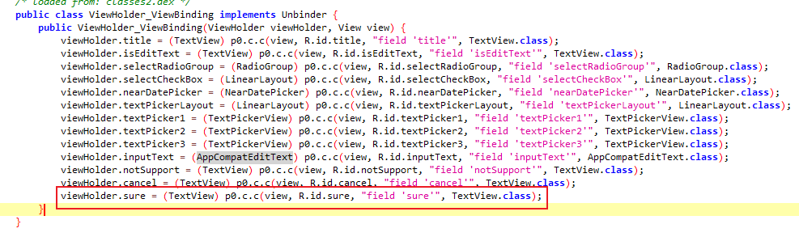

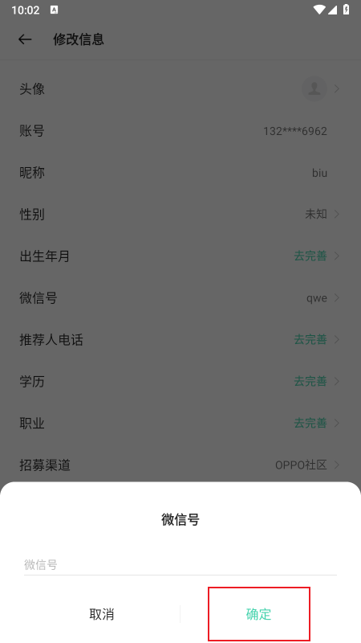

## Frida对关键函数的主动调用

通过上面的分析，可以发现`p0`为关键函数，也是在这里根据参数`listBean`的`signid`和`userValue`进行加密，并发包的。

```java
public class ChangeInfoActivity extends BaseActivity {
    public void p0(int i10, CrowdPortraitReq.ListBean listBean) {
        CrowdPortraitReq.ListBean listBean2 = new CrowdPortraitReq.ListBean();
        listBean2.setSignId(listBean.getSignId());
        String e10 = m6.a.e(listBean.getUserValue(), com.heytap.ocsp.client.utils.j.f(this, "aes_key2"));
        listBean2.setUserValue(e10);
        ArrayList arrayList = new ArrayList();
        arrayList.add(listBean2);
        CrowdPortraitReq crowdPortraitReq = new CrowdPortraitReq();
        crowdPortraitReq.setList(arrayList);
        e6.a.n().c(crowdPortraitReq).enqueue(new b(this, i10, e10));
    }
}
```

首先，hook一下`p0`，看看`i10`的值是什么。

```javascript
Java.perform(function () {
    var ChangeInfoActivityObj = Java.use('com.heytap.ocsp.client.user.activity.ChangeInfoActivity');
    ChangeInfoActivityObj.p0.implementation = function (arg1, arg2) {
        console.log("p0 method hooked");
        console.log("arg1: " + arg1);
        console.log("arg2: " + arg2);
        return this.p0(arg1, arg2);
    };
});
```

可以看出其恒为`2`。

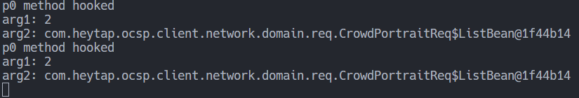

由于该方法不为静态方法，因此去内存中寻找`ChangeInfoActivity`实例，然后调用其`p0`方法。

listBean的两个属性一个为6，另一个就是要更改的微信号。

调用p0的第一个参数为2，另一个为我们自定义的listBean。

```javascript
Java.perform(function () {
    var signid = '6';
    var userValue = 'B1ubiu--2024';

    Java.choose('com.heytap.ocsp.client.user.activity.ChangeInfoActivity', {
        onMatch: function (instance) {
            console.log('Found instance: ' + instance);
            var listBeanClass = Java.use('com.heytap.ocsp.client.network.domain.req.CrowdPortraitReq$ListBean');
            var listBeanInstance = listBeanClass.$new();
            listBeanInstance.setSignId(signid);
            listBeanInstance.setUserValue(userValue);
            instance.p0(2, listBeanInstance);
            console.log('p0 method called (' + signid + ', ' + userValue + ')');
        },
        onComplete: function () {
            console.log('Search complete');
        }
    });
});
```

然后运行，输出为：

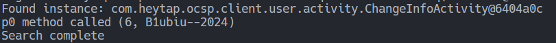

burpsuite抓包可以看见其成功发出数据包，并且没有报签名错误。

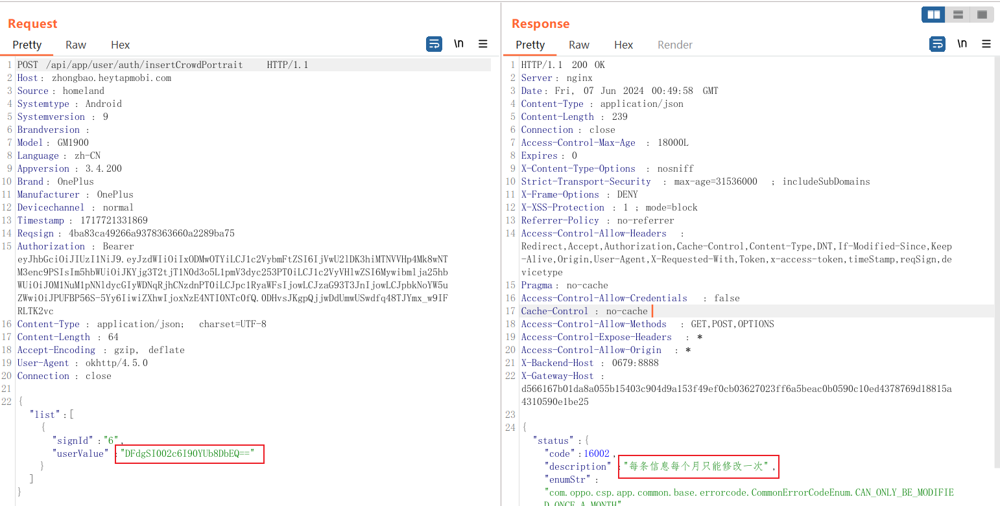

解密`userValue`可以看出是我们的`B1ubiu--2024`

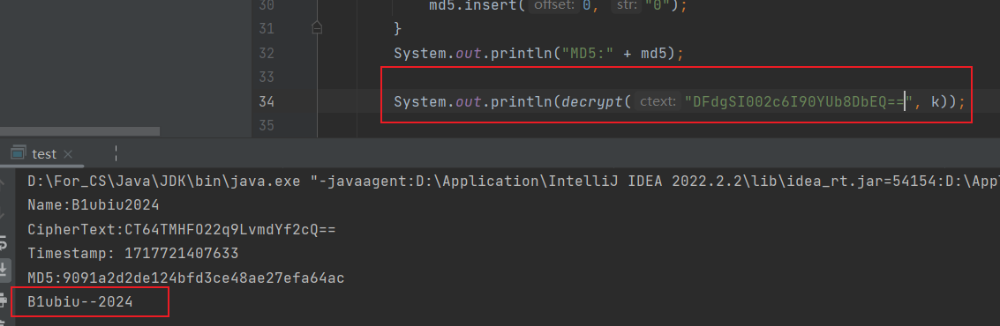