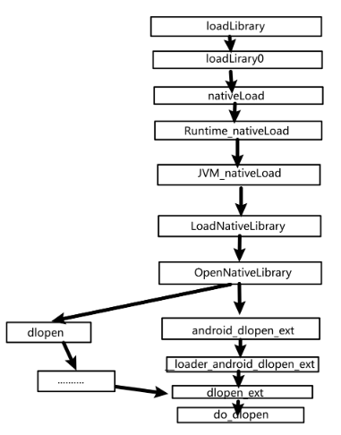

# 使用

执行模拟器中的`frida-server`，然后adb端口转发：

1. `adb forward tcp:27042 tcp:27042`
2. `adb forward tcp:27043 tcp:27043`

## 命令

1. 查看设备的进程：`frida-ps -U`
   1. 加上 `-a` 可以查看进程的`identifier`

2. 执行脚本：
   1. `frida -U 包名 -l frida脚本`
   2. `frida -U -f com.feifei.babyandroid -l .\hook.js`
      1. `-f`: 使用spawn的方式启动脚本，无该参数则以attach的方式。
      2. 若要hook的函数是在`onCreate`等中，所以app刚启动就自动检查，则需要用spawn的方式去启动frida脚本hook，而不是attach。

3. Python脚本方式

   1. ```python
      import frida
      import sys
      
      def on_message(message, data):
          if message['type'] == 'send':
              print(f"Received data: {message['payload']}")
          elif message['type'] == 'error':
              print(f"Error: {message['stack']}")
      
      device = frida.get_usb_device(timeout=10)
      print(device.name)
      session = device.attach("ezapk")
      
      script = session.create_script("""
      Java.perform(function () {
          function arrayBufferToHex(arrayBuffer) {
              return Array.from(new Uint8Array(arrayBuffer))
                          .map(b => b.toString(16).padStart(2, '0'))
                          .join('');
          }
          var startAddress = ptr('0x6f03276000'); // 起始地址
          var endAddress = ptr('0x6f0327a000');  // 结束地址
          var size = endAddress.sub(startAddress).toInt32(); // 计算内存大小
          var data = Memory.readByteArray(startAddress, size);
          var hexString = arrayBufferToHex(data);
          send(hexString);
      });
      """)
      script.on('message', on_message)
      script.load()
      sys.stdin.read()
      ```


# Hook

* APK

  * 可以这样理解：每一个 `implementation` 都是操作一个具体的函数，而 `overload` 是在这个基础上，为了应对函数重载（一个函数名对应多个函数体），提供了通过参数区分不同函数体的能力。

  * 覆盖：能够在任意函数被调用时注入你自己的逻辑。

    * ```js
      Java.perform(function () {
          console.log("start");
          var Main = Java.use("com.galaxylab.countdown");
          Main.getBeg.implementation = function () {
              var ret = this.getBeg();
              console.log("getBeg:", ret);
              return ret;
          }
      })
      ```

  * 重载：如果钩取的函数有多个版本，每个版本有不同的参数，使用 Frida 的`overload`函数更合适。

    * ```js
      // hook equal()，从而使无论输入什么都是flag正确。
      Java.perform(() => {
          const stringClass = Java.use('java.lang.String')
          stringClass.equals.overload('java.lang.Object').implementation = function (p1) {
              if (this == "BxLHc1KruiH31I94W171oal+9olDzgBIjnK/J1Db0IUyi+MbI38+nw62ejCPShRB") {
                  console.log("change!!!!")
                  return true
              }
              return this.equals(p1)
          }
      })
      ```

* so

  * ```js
    // 获取参数，并替换返回值
    Java.perform(function(){
         // 指定要Hook的so文件名和要Hook的函数名，函数名就是上面IDA导出表中显示的那个函数名
         Interceptor.attach(Module.findExportByName("libcheck.so","Java_com_example_check_MainActivity_check_1s"),{
             // onEnter: function(args)：进入该函数前要执行的代码
             // args是传入的参数
             // 一般so层函数第一个参数都是JniEnv，第二个参数是jclass，从第三个参数开始才是我们java层传入的参数
             onEnter: function(args) {
                 send("Hook start");
                 send("args[2]=" + args[2]);
                 send("args[3]=" + args[3]);
             },
             // onLeave: function(retval)：该函数执行结束要执行的代码
             // retval参数即是返回值
             onLeave: function(retval){
                 send("return:"+retval);
                 retval.replace(0); //替换返回值为0
             }
         });
     });
    ```

# 调用

1. 静态方法
   1. 直接调用
   
   2. ```js
      Java.perform(function () {
          console.log("start")
          var FridaActivity2 = Java.use("com.example.androiddemo.Activity.FridaActivity2")
          //hook静态函数直接调用
          FridaActivity2.setStatic_bool_var()
          //hook动态函数，找到instance实例，从实例调用函数方法
          Java.choose("com.example.androiddemo.Activity.FridaActivity2", {
              onMatch: function (instance) {
                  instance.setBool_var()
              },
              onComplete: function () {
                  console.log("end")
              }
          })
      })
      ```
   
2. 动态方法
   1. 找到实例再调用
   
      1. ```js
         Java.perform(() => {
             const encClass = Java.use('cn.shenghuo2.decrypt_me.DES')
             const stringClass = Java.use('java.lang.String')
             let encObject = encClass.$new()
             console.log(
                 encObject.encrypt(stringClass.$new("reversehavemagic"), 
                 stringClass.$new('123456'), 
                 stringClass.$new("r3v3rs3car3fully")
             )
         })
         ```
   
   2. 创建实例再调用
   
      1. ```js
          Java.perform(function () {
             console.log("start");
             var Main = Java.use("com.galaxylab.countdown");
             let test = Main.$new();
             console.log(test.stringFromJNI(208462));
         })

# frida持久化

Frida Gadget

## 修改so，导入so

前提条件：apk中有so。

利用一个方便的脚本👉[非root环境下frida持久化的两种方式及脚本](https://bbs.kanxue.com/thread-268175.htm)+[nszdhd1/UtilScript](https://github.com/nszdhd1/UtilScript)

大致思路：

1. 选择一个会被加载的so，将`libfrida-gadget.so`注入进去

   1. ```python
      import lief
      libnative = lief.parse("libnative.so")
      libnative.add_library("libgadget.so")
      libnative.write("libnative.so")
      ```

2. 将对应架构的`libfrida-gadget.so`放到对应`lib`目录

3. 放置配置文件`libfrida-gadget.config.so`到对应`lib`目录

   1. ```json
      {
      	"interaction": {
      		"type": "script",
               // path为设备存放frida代码的路径
               "path": "/data/local/tmp/hook.js",
               "on_change":"reload"
      	}
      }
      ```

```python
import argparse
import os
import shutil
import sys
import zipfile
import lief
import sys

def getpwd():
    pwd = sys.path[0]
    if os.path.isfile(pwd):
        pwd = os.path.dirname(pwd)
    return pwd


def getpwd():
    pwd = sys.path[0]
    if os.path.isfile(pwd):
        pwd = os.path.dirname(pwd)
    return pwd

class LIEFInject:
    def __init__(self,args):
        has_lib = False
        with zipfile.ZipFile(args.input, 'r') as apk_file:
            for item in apk_file.infolist():
                if item.filename.endswith(".so"):
                    has_lib = True
                    break
        if not has_lib:
            print('apk can\'t find so')
            exit(1)
        self.apkpath = args.input
        self.outdir  = args.output
        self.soname  = os.path.basename(args.soname)
        self.deletelist = []
        self.toolPath = getpwd() + "//tools"


    def injectso(self):
        print("injectso...")
        injectsolist = []
        with zipfile.ZipFile(self.apkpath,'r')as apk_file:
            for item in apk_file.infolist():
                if item.filename.find(self.soname) != -1:
                    print("find:" + item.filename)
                    apk_file.extract(item.filename)
                    self.deletelist.append(item.filename)
                    injectsolist.append(item.filename)
        for soname in injectsolist:
            if soname.find("x86") != -1:
                continue
            so = lief.parse(os.getcwd() + "\\" + soname)
            print("gadget so path:" + os.getcwd() + '\\' + soname)
            so.add_library("libfrida-gadget.so")
            so.write(soname + "gadget.so")


    def modifyapk(self):
        print("modifyapk...")
        (path, filename) = os.path.split(self.apkpath)
        (file, ext) = os.path.splitext(filename)
        outapk = os.path.join(self.outdir,file+"_frida.apk")
        with zipfile.ZipFile(self.apkpath, 'r')as orig_file:
            with zipfile.ZipFile(outapk, 'w')as out_file:
                for item in orig_file.infolist():
                    if item.filename.find(self.soname) != -1 and os.path.exists(os.getcwd()+"\\"+item.filename+"gadget.so"):
                        out_file.write(os.getcwd()+"\\"+item.filename+"gadget.so",arcname=item.filename)
                        if item.filename.find("lib/armeabi-v7a") != -1:
                            out_file.write(os.path.join(self.toolPath,"frida-gadget-14.2.18-android-arm.so"), arcname="lib/armeabi-v7a/libfrida-gadget.so")
                            print("add" + os.path.join(self.toolPath, "frida-gadget-14.2.18-android-arm.so"))
                        if item.filename.find("lib/arm64-v8a") != -1:
                            out_file.write(os.path.join(self.toolPath, "frida-gadget-14.2.18-android-arm64.so"), arcname="lib/arm64-v8a/libfrida-gadget.so")
                            print("add " + os.path.join(self.toolPath, "frida-gadget-14.2.18-android-arm64.so"))
                        if item.filename.find("lib/x86/") != -1:
                            out_file.write(os.path.join(self.toolPath, "frida-gadget-14.2.18-android-x86.so"), arcname="lib/x86/libfrida-gadget.so")
                            print(f"add " + os.path.join(self.toolPath, "frida-gadget-14.2.18-android-x86.so"))
                        continue
                    if item.filename.find("META-INF") == -1:
                        out_file.writestr(item, orig_file.read(item.filename))
        # shutil.rmtree("lib")
        return outapk

    def addHook(self,apk_path):
        print("addHook...")
        with zipfile.ZipFile(apk_path, 'a')as apk_file:
            for item in apk_file.infolist():
                if item.filename == "lib/armeabi-v7a/libfrida-gadget.so":
                    apk_file.write(os.path.join(self.toolPath, "libfrida-gadget.config.so"), arcname="lib/armeabi-v7a/libfrida-gadget.config.so")
                    print("add lib/armeabi-v7a/libfrida-gadget.config.so")
                if item.filename == "lib/arm64-v8a/libfrida-gadget.so":
                    apk_file.write(os.path.join(self.toolPath, "libfrida-gadget.config.so"), arcname="lib/arm64-v8a/libfrida-gadget.config.so")
                    print("add lib/arm64-v8a/libfrida-gadget.config.so")
                if item.filename == "lib/x86/libfrida-gadget.so":
                    apk_file.write(os.path.join(self.toolPath, "libfrida-gadget.config.so"), arcname="lib/x86/libfrida-gadget.config.so")
                    print("add lib/x86/libfrida-gadget.config.so")
                continue

if __name__ == "__main__":
    parser = argparse.ArgumentParser()
    parser.add_argument('input', help="apk path")
    parser.add_argument('output', help="Folder to store output files")
    parser.add_argument('soname', help="the so name of apk first load  ")
    parser.add_argument('-persistence', help="HOOK Persistence ", action='store_true')

    args = parser.parse_args()
    liefs = LIEFInject(args)
    liefs.injectso()
    out = liefs.modifyapk()
    if args.persistence:
        liefs.addHook(out)
    print("success, new apk :" + out)
```

当前目录：

```shell
C:.
│  hook.js
│  LIEFInjectFrida.py
│  SmaliInjectFrida.py
│  target.apk
│
└─tools
        aapt.exe
        apksignerNew.jar
        APPkeystore.jks
        baksmali-2.5.2.jar
        frida-gadget-14.2.18-android-arm.so
        frida-gadget-14.2.18-android-arm64.so
        frida-gadget-14.2.18-android-x86.so
        libfrida-gadget.config.so
        smali-2.5.2.jar
```

* `hook.js`：持久化执行的frida代码，需要放到设备中去（路径和`libfrida-gadget.config.so`的对应）

* `libfrida-gadget.config.so`：

  * ```json
    {
    	"interaction": {
    		"type": "script",
             // path为设备存放frida代码的路径
             "path": "/data/local/tmp/hook.js",
             "on_change":"reload"
    	}
    }
    ```

* 执行：`python LIEFInjectFrida.py [target apk path] [output path] [so_file] -persistence`

  * `[so_file]`：目标apk的`lib`中存在且会被加载的`so`

最后，对输出的Apk重签名即可。

## 修改smali，导入so

[Frida-Gadget免ROOT注入APP实现破解](https://www.52pojie.cn/thread-1181471-1-1.html)

[nszdhd1/UtilScript](https://github.com/nszdhd1/UtilScript)

引入`so`的对应的smali代码：相当于`loadLibrary("libfrida.so")`

```java
const-string v0, "frida"
invoke-static {v0}, Ljava/lang/System;->loadLibrary(Ljava/lang/String;)V
```

# 脚本

## 替换so方法中的返回值

```js
Java.perform(function(){
    Interceptor.attach(Module.findExportByName("libfridaso.so","Java_com_example_fridasostring_fridaSoString_FridaSo"),{
        onEnter: function(args) {
            send("Hook start");
            send("args[2]=" + args[2]);
        },
        onLeave: function(retval){
            send("return:"+retval);
            // 获取env对象，也就是native函数的第一个参数
            var env = Java.vm.getEnv();
            // 因为返回的是字符串指针，使用我们需要构造一个newStringUtf对象，用来代替这个指针
            var jstrings = env.newStringUtf("tamper");
            retval.replace(jstrings);
        }
    });
});
```

## frida与python通信

目标代码，修改其可以使用admin：

```java
public class MainActivity extends AppCompatActivity {
    EditText username_et;
    EditText password_et;
    TextView message_tv;
    @Override
    protected void onCreate(Bundle savedInstanceState) {
        super.onCreate(savedInstanceState);
        setContentView(R.layout.activity_main);
        password_et = (EditText) this.findViewById(R.id.editText2);
        username_et = (EditText) this.findViewById(R.id.editText);
        message_tv = ((TextView) findViewById(R.id.textView));
        this.findViewById(R.id.button).setOnClickListener(new View.OnClickListener() {
            @Override
            public void onClick(View v) {
                if (username_et.getText().toString().compareTo("admin") == 0) {
                    message_tv.setText("You cannot login as admin");
                    return;
                }
                //hook target
                message_tv.setText(
                    "Sending to the server :" +
                    Base64.encodeToString(
                        (username_et.getText().toString() + ":" + password_et.getText().toString()).getBytes(), 
                    	Base64.DEFAULT
                    )
                );
            }
        });
    }
}
```

frida代码：

```js
console.log("Script loaded successfully ");
Java.perform(function () {
    var tv_class = Java.use("android.widget.TextView");
    tv_class.setText.overload("java.lang.CharSequence").implementation = function (x) {
        var string_to_send = x.toString();
        var string_to_recv;
        send(string_to_send); // send data to python code
        recv(function (received_json_object) {
            string_to_recv = received_json_object.my_data
            console.log("string_to_recv: " + string_to_recv);
        }).wait(); //block execution till the message is received
        var my_string = Java.use("java.lang.String").$new(string_to_recv);
        this.setText(my_string);
    }
});
```

python使用脚本：

```python
import time
import frida
import base64

def my_message_handler(message, payload):
    print(message)
    print(payload)
    if message["type"] == "send":
        print(message["payload"])
        data = message["payload"].split(":")[1].strip()
        print('message:', message)
        data = str(base64.b64decode(data))
        print('data:',data)
        user, pw = data.split(":")
        print('pw:',pw)
        data = str(base64.b64encode(("admin" + ":" + pw).encode()))
        print("encoded data:", data)
        script.post({"my_data": data})  # send JSON object
        print("Modified data sent")

device = frida.get_usb_device()
pid = device.spawn(["myapplication.example.com.frida_demo"])
device.resume(pid)
time.sleep(1)
session = device.attach(pid)
with open("frida_demo2.js") as f:
    script = session.create_script(f.read())
script.on("message", my_message_handler)
script.load()
input()
```

## 枚举

```js
function ch6() {
    Java.perform(function () {
        Java.enumerateLoadedClasses({
            onMatch: function (name, handle){
                if (name.indexOf("com.example.androiddemo.Activity.Frida6") != -1) {
                    console.log("name:" + name + " handle:" + handle)
                    Java.use(name).check.implementation = function () {
                        return true
                    }
                }
            },
            onComplete: function () {
                console.log("end")
            }
        })
    })
}
```

## 获取Native函数

```js
function hook_RegisterNatives() {
    var symbols = Process.getModuleByName('libart.so').enumerateSymbols();
    var RegisterNatives_addr = null;
    for (let i = 0; i < symbols.length; i++) {
        var symbol = symbols[i];
        if (symbol.name.indexOf("RegisterNatives") != -1 && symbol.name.indexOf("CheckJNI") == -1) {
            RegisterNatives_addr = symbol.address;
        }
    }
    console.log("RegisterNatives_addr: ", RegisterNatives_addr);
    Interceptor.attach(RegisterNatives_addr, {
        onEnter: function (args) {
            var env = Java.vm.tryGetEnv();
            var className = env.getClassName(args[1]);
            var methodCount = args[3].toInt32();
            for (let i = 0; i < methodCount; i++) {
                var methodName = args[2].add(Process.pointerSize * 3 * i).add(Process.pointerSize * 0).readPointer().readCString();
                var signature = args[2].add(Process.pointerSize * 3 * i).add(Process.pointerSize * 1).readPointer().readCString();
                var fnPtr =
                    args[2].add(Process.pointerSize * 3 * i).add(Process.pointerSize * 2).readPointer();
                var module = Process.findModuleByAddress(fnPtr);
                console.log(className, methodName, signature, fnPtr, module.name, fnPtr.sub(module.base));
            }

        }, onLeave: function (retval) {
        }
    })
}
// [Android Emulator 5554::com.feifei.babyandroid ]-> RegisterNatives_addr:  0x7fff72318190
// com.feifei.babyandroid.MainActivity check2 ([B[B)Z 0x7fff580eabf0 libbabyandroid.so 0xbf0
```

## 获取调用的库

Apk中执行`System.loadLibrary`时，调用链如下：



该代码可以获取调用的库。

如果某个库存在反frida等手段，可通过该代码知道最后一个调用的库是什么，并检查。

```js
function hook_android_dlopen_ext() {
    Interceptor.attach(Module.findExportByName(null, "android_dlopen_ext"),
        {
            onEnter: function (args) {
                this.fileName = args[0].readCString()
                console.log(`dlopen onEnter: ${this.fileName}`)
            }, onLeave: function(retval){
                console.log(`dlopen onLeave fileName: ${this.fileName}`)
            }
        }
    );
}
```

## 获取进程内存地址

```python
import frida
import sys

def on_message(message, data):
    if message['type'] == 'send':
        print(f"Received data: {message['payload']}")
        with open("dump.bin", "wb") as f:
            f.write(bytes.fromhex(message['payload']))
    elif message['type'] == 'error':
        print(f"Error: {message['stack']}")

device = frida.get_usb_device(timeout=10)
print(device.name)
session = device.attach("ezapk")

script = session.create_script("""
Java.perform(function () {
    function arrayBufferToHex(arrayBuffer) {
        return Array.from(new Uint8Array(arrayBuffer))
                    .map(b => b.toString(16).padStart(2, '0'))
                    .join('');
    }
    var startAddress = ptr('0x6f03276000'); // 起始地址
    var endAddress = ptr('0x6f0327b000');  // 结束地址
    var size = endAddress.sub(startAddress).toInt32(); // 计算内存大小
    var data = Memory.readByteArray(startAddress, size);
    var hexString = arrayBufferToHex(data);
    send(hexString);
});
""")
script.on('message', on_message)
script.load()
sys.stdin.read()
```


# objection

1. 启动并注入内存：`objection -g package_name explore`

   1. `-s` + hook语句，即可在启动时就hook

2. 可直接 `objection run xxx`方式使用

3. 列举：

   1. 列举so文件：`memory list modules`

   2. 列举so文件导出方法：`memory list exports libA3AEECD8.so`

   3. 将结果写入文件中：`memory list exports libA3AEECD8.so --json /root/test.json`

   4. 查找可以hook的类：`android hooking list classes`

   5. 查找带关键词的类：`android hooking search classes display`

   6. 查看对应类有哪些方法：

      `android hooking list class_methods com.android.settings.DisplaySettings`

   7. 生成hook类的代码
      `android hooking generate simple `

   8. hook 类的所有方法
      `android hooking watch class d.d.a.g.c`
      `android hooking watch class_method com.xxx.xxx.setUrl --dump-args --dump-return`

   9. 帮助类：

      `help `
      `android hooking watch class`

   10. 禁用sslpinning：`android sslpinning disable`

   11. 搜索类的实列
       `android heap search instances com.example.httptest.MainActivity
       `android heap execute 0x1fc6 getMethod`

   12. 搜索activties
       `android hooking list activities`
       `android intent launch_activity com.example.httptest.MainActivity`

4. 内存搜索/修改：

   1. `memory search "64 65 78 0a 30 33 35 00"`
   2. `memory search "99999999999" --string`
   3. `memory write 0x130b4060 "99999999999" --string`

5. dump（默认在C:\Users\hahbiubiubiu下）

   1. `memory dump all 文件名`
   2. `memory dump from_base 起始地址 字节数 文件名`

6. hook

   1. `android hooking watch class 类名`：hook这个类里面的所有方法，每次调用都会被log出来

   2. `android hooking watch class_method 方法名`：hook方法

   3. hook输出选项：`--dump-args --dump-backtrace --dump-return`

7. 隐藏root：`android root disable`

[objection操作 | m4bln (mabin004.github.io)](https://mabin004.github.io/2020/08/13/objection操作/)
