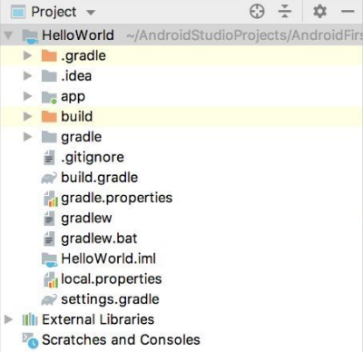
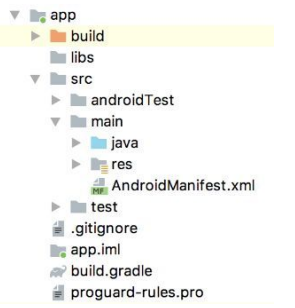
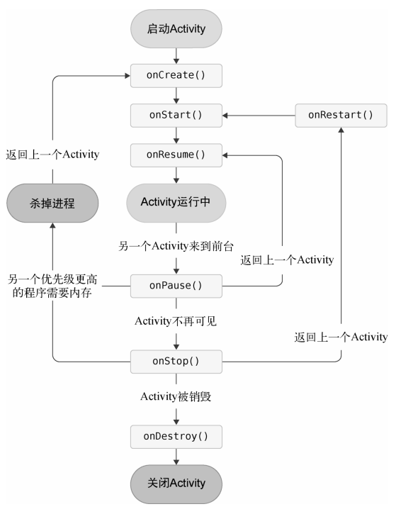
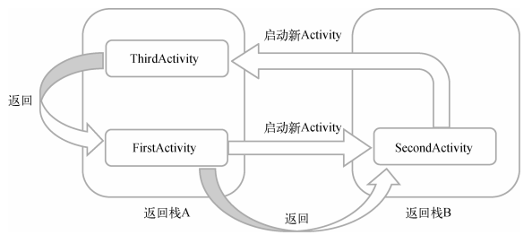

## Android

### 项目结构



1. `.gradle`和`.idea`：放置的都是Android Studio自动生成的一些文件
2. app 项目中的代码、资源等内容都是放置在这个目录下的
   1. 
   2. build：这个目录和外层的build目录类似，包含了一些在编译时自动生成的文件
   3. libs：如果项目中使用到了第三方jar包，就需要把这些jar包都放在libs目录下，放在这个目录下的jar包会被自动添加到项目的构建路径里
   4. androidTest：编写Android Test测试用例的，可以对项目进行一些自动化测试
   5. java：放置所有Java代码（Kotlin代码也放在这里）
   6. res：在项目中使用到的所有图片、布局、字符串等资源都要存放在这个目录下。当然这个目录下还有很多子目录，图片放在drawable 目录下，布局放在layout目录下，字符串放在values目录下，所以你不用担心会把整个res 目录弄得乱糟糟的
   7. AndroidManifest.xml：整个Android项目的配置文件，你在程序中定义的所有四大组件都需要在这个文件里注册，另外还可以在这个文件中给应用程序添加权限声明。
   8. test：编写Unit Test测试用例的，是对项目进行自动化测试的另一种方式
   9. .gitignore：将app模块内指定的目录或文件排除在版本控制之外，作用和外层的.gitignore文件类似
   10. app.iml：IntelliJ IDEA项目自动生成的文件
   11. build.gradle：app模块的gradle构建脚本，这个文件中会指定很多项目构建相关的配置
   12. proguard-rules.pro ：指定项目代码的混淆规则，当代码开发完成后打包成安装包文件，如果不希望代码被别人破解，通常会将代码进行混淆，从而让破解者难以阅读
3. build：主要包含了一些在编译时自动生成的文件
4. gradle：包含了gradle wrapper的配置文件，使用gradle wrapper的方式不需要提前将gradle下载好，而是会自动根据本地的缓存情况决定是否需要联网下载gradle。
   1. Android Studio默认就是启用gradle wrapper方式的，如果需要更改成离线模式，可点击`Android Studio导航栏→File→Settings→Build, Execution, Deployment→Gradle`，进行配置更改。 
5. .gitignore：将指定的目录或文件排除在版本控制之外的。
6. build.gradle：项目全局的gradle构建脚本，通常不需要修改
7. gradle.properties：全局的gradle配置文件，在这里配置的属性将会影响到项目中所有的gradle编译脚本
8. gradlew和gradlew.bat：用来在命令行界面中执行gradle命令的，其中gradlew是在Linux或Mac系统中使用的，gradlew.bat是在Windows系统中使用的。
9. HelloWorld.iml：iml文件是所有IntelliJ IDEA项目都会自动生成的一个文件（Android Studio是基于IntelliJ IDEA开发的），用于标识这是一个IntelliJ IDEA项目
10. local.properties：用于指定本机中的Android SDK路径，不需要修改，除非本机中的Android SDK位置发生了变化，那么将这个文件中的路径改成新的位置即可
11. settings.gradle：用于指定项目中所有引入的模块。

#### AndroidManifest.xml

没有在AndroidManifest.xml里注册的Activity是不能使用的。

```xml
<activity android:name=".MainActivity">
    <intent-filter>
        <!-- 表示MainActivity是这个项目的主Activity -->
        <action android:name="android.intent.action.MAIN" />
        <category android:name="android.intent.category.LAUNCHER" />
    </intent-filter>
</activity>
```

#### res

```xml
<!-- res/values/strings.xml -->
<resources>
    <string name="app_name">HelloWorld</string>
</resources>
```

这里定义了一个应用程序名的字符串，有以下两种方式来引用它

1. 在代码中通过`R.string.app_name`可以获得该字符串的引用
2. 在XML中通过`@string/app_name`可以获得该字符串的引用

## Kotlin

### 变量

val（value的简写）用来声明一个不可变的变量，这种变量在初始赋值之后就再也不能重新赋值，对应Java中的final变量。

var（variable的简写）用来声明一个可变的变量，这种变量在初始赋值之后仍然可以再被重新赋值，对应Java中的非final变量。

Kotlin的类型推导机制并不总是可以正常工作的，比如说如果对一个变量延迟赋值的话，Kotlin就无法自动推导它的类型了。

```kotlin
val a = 10

// 显式声明
val a: Int = 10
```

### 函数

```kotlin
fun methodName(param1: Int, param2: Int): Int {
    return 0
}
```

当一个函数中只有一行代码时，Kotlin允许不编写函数体，可以直接将唯一的一行代码写在函数定义的尾部，中间用等号连接即可。

```kotlin
fun largerNumber(num1: Int, num2: Int): Int = max(num1, num2)
fun largerNumber(num1: Int, num2: Int) = max(num1, num2)
```

给函数设定参数默认值

```kotlin
fun printParams(num: Int, str: String = "hello") {
    println("num is $num , str is $str")
}
```

Kotlin可以通过键值对的方式来传参，从而不必像传统写法那样按照参数定义的顺序来传参。

### 修饰符

| 修饰符    | Java                               | Kotlin             |
| --------- | ---------------------------------- | ------------------ |
| public    | 所有类可见                         | 所有类可见（默认） |
| private   | 当前类可见                         | 当前类可见         |
| protected | 当前类、子类、同一包路径下的类可见 | 当前类、子类可见   |
| default   | 同一包路径下的类可见（默认）       | 无                 |
| internal  | 无                                 | 同一模块中的类可见 |

### 逻辑控制

#### if

```kotlin
fun largerNumber(num1: Int, num2: Int): Int {
    var value = 0
    if (num1 > num2) {
        value = num1
    } else {
        value = num2
    }
    return value
}

// Kotlin中的if语句是可以有返回值的，返回值就是if语句每一个条件中最后一行代码的返回值
fun largerNumber(num1: Int, num2: Int): Int {
    val value = if (num1 > num2) {
        num1
    } else {
        num2
    }
    return value
}
fun largerNumber(num1: Int, num2: Int) = if (num1 > num2) num1 else num2
```

#### when

```kotlin
// 匹配值 -> { 执行逻辑 }
fun getScore(name: String) = when (name) {
    "Tom" -> 86
    "Jim" -> 77
    "Jack" -> 95
    "Lily" -> 100
    else -> 0
}
fun checkNumber(num: Number) {
    when (num) {
        is Int -> println("number is Int")
        is Double -> println("number is Double")
        else -> println("number not support")
    }
}

```

#### for

```kotlin
val range = 0..10 // 表示一个区间[0, 10]。
val range = 0 until 10 // [0, 10) 

// 递增
for (i in 0 until 10 step 2) {
    println(i)
}

// 降序
for (i in 10 downTo 1) {
    println(i)
}

```

### class

```kotlin
class Person {
    var name = ""
    var age = 0
    fun eat() {
        println(name + " is eating. He is " + age + " years old.")
    }
}
```

class默认无法继承，须添加`open`才可继承。

```kotlin
open class Person {
    ...
}
class Student : Person() {
    var sno = ""
    var grade = 0
}
```

#### 主构造函数

每个类默认都会有一个不带参数的主构造函数，主构造函数的特点是没有函数体，直接定义在类名的后面即可。

```Kotlin
class Student(val sno: String, val grade: Int) : Person() {}
```

主构造函数没有函数体，Kotlin提供了一个`init`结构体，所有主构造函数中的逻辑都可以写在里面

```kotlin
class Student(val sno: String, val grade: Int) : Person() {
    init {
        println("sno is " + sno)
        println("grade is " + grade)
    }
}
```

根据继承特性的规定，子类的构造函数必须调用父类的构造函数。

```kotlin
class Student(val sno: String, val grade: Int, name: String, age: Int) :
    Person(name, age) {
        ...
}
```

#### 次构造函数

任何一个类只能有一个主构造函数，但是可以有多个次构造函数。

次构造函数也可以用于实例化一个类，这一点和主构造函数没有什么不同，只不过它是有函数体的。 

Kotlin规定，当一个类既有主构造函数又有次构造函数时，所有的次构造函数都必须调用主构造函数（包括间接调用）。

```kotlin
class Student(val sno: String, val grade: Int, name: String, age: Int) :
    Person(name, age) {
        constructor(name: String, age: Int) : this("", 0, name, age) {
        }
        constructor() : this("", 0) {
        }
}
```

次构造函数是通过`constructor`关键字来定义的，这里我们定义了两个次构造函数：第一个次构造函数接收`name`和`age`参数，然后它又通过`this`关键字调用了主构造函数，并将`sno`和 `grade`这两个参数赋值成初始值；第二个次构造函数不接收任何参数，它通过`this`关键字调用 了我们刚才定义的第一个次构造函数，并将`name`和`age`参数也赋值成初始值。

#### 数据类

在一个规范的系统架构中，数据类通常占据着非常重要的角色，它们用于将服务器端或数据库中的数据映射到内存中，为编程逻辑提供数据模型的支持。

当在一个类前面声明了data关键字时，就表明这个类是一个数据类，Kotlin会根据主构造函数中的参数将equals()、hashCode()、toString()等固定且无实际逻辑意义的方法自动生成，从而大大减少了开发的工作量。

```kotlin
data class Cellphone(val brand: String, val price: Double)
```

#### 单例类

单例模式是最常用、最基础的设计模式之一，它可以用于避免创建重复的对象，比如某个类在全局最多只能拥有一个实例，这时就可以使用单例模式。

Java的单例模式的写法：

> 首先为了禁止外部创建Singleton的实例，我们需要用private关键字将Singleton的构造函数私有化，然后给外部提供了一个getInstance()静态方法用于获取Singleton的实例。在getInstance()方法中，我们判断如果当前缓存的Singleton实例为null，就创建一个新的实例，否则直接返回缓存的实例即可，这就是单例模式的工作机制。

```Java
public class Singleton {
    private static Singleton instance;
    private Singleton() {}
    public synchronized static Singleton getInstance() {
        if (instance == null) {
            instance = new Singleton();
        }
        return instance;
    }
    public void singletonTest() {
        System.out.println("singletonTest is called.");
    }
}
```

Kotlin的写法：（使用`object`关键字）
```Kotlin
object Singleton {
    fun singletonTest() {
        println("singletonTest is called.")
    }
}
// 调用
Singleton.singletonTest()
```

实Kotlin在背后自动帮我们创建了一个Singleton类的实例，并且保证全局只会存在一个Singleton实例。

#### 密封类

当在`when`语句中传入一个密封类变量作为条件时，Kotlin编译器会自动检查该密封类有哪些子类，并强制要求你将每一个子类所对应的条件全部处理。这样就可以保证，即使没有编写`else`条件，也不可能会出现漏写条件分支的情况。

```kotlin
sealed class Result
class Success(val msg: String) : Result()
class Failure(val error: Exception) : Result()

// 可编译的
fun getResultMsg(result: Result) = when (result) {
    is Success -> result.msg
    is Failure -> "Error is ${result.error.message}"
}
```


### 接口

```kotlin
interface Study {
    fun readBooks() // 允许有默认实现
    fun doHomework()
}
class Student(name: String, age: Int) : Person(name, age), Study {
    override fun readBooks() {
        println(name + " is reading.")
    }
    www.blogss.cn
    override fun doHomework() {
        println(name + " is doing homework.")
    }
}
```

### Lambda编程

#### 集合

1. List集合
   1. `listOf`
      1. `val list = listOf("Apple", "Banana", "Orange", "Pear")`
      2. 不可变集合，只可读取
   2. `mutableListof`
      1. 可变集合
2. Set集合
   1. `setOf`、`mutableSetOf`
   2. 不可存放重复元素
3. Map集合
   1. `map["Apple"] = 1`
   2. `val number = map["Apple"]`
   3. `val map = mapOf("Apple" to 1, "Banana" to 2, "Orange" to 3)`

#### 集合的函数API

1. maxBy：``
2. filter：``
3. map：``
4. any：
   1. `list.any { it.length <= 5 }`
   2. 是否至少存在一个元素满足指定条件
5. all：
   1. `list.all { it.length <= 5 }`
   2. 是否所有元素都满足指定条件

#### Lambda语法结构

```kotlin
{参数名1: 参数类型, 参数名2: 参数类型 -> 函数体}
```

函数体中可以编写任意行代码

最后一行代码会自动作为Lambda表达式的返回值

```kotlin
val list = listOf("Apple", "Banana", "Orange", "Pear", "Grape")

val lambda = { fruit: String -> fruit.length }
val maxLengthFruit = list.maxBy(lambda)

// 可以直接将lambda表达式传入maxBy函数
val maxLengthFruit = list.maxBy({ fruit: String -> fruit.length })

// 当Lambda参数是函数的最后一个参数时，可以将Lambda表达式移到函数括号的外面
val maxLengthFruit = list.maxBy() { fruit: String -> fruit.length }

// 如果Lambda参数是函数的唯一一个参数的话，还可以将函数的括号省略
val maxLengthFruit = list.maxBy { fruit: String -> fruit.length }

// Lambda表达式中的参数列表其实在大多数情况下不必声明参数类型
val maxLengthFruit = list.maxBy { fruit -> fruit.length }

// 当Lambda表达式的参数列表中只有一个参数时，也不必声明参数名，而是可以使用it关键字来代替
val maxLengthFruit = list.maxBy { it.length }
```

```kotlin
// 保留5个字母以内的水果
fun main() {
    val list = listOf("Apple", "Banana", "Orange", "Pear", "Grape")
    val newList = list.filter { it.length <= 5 }
    				.map { it.toUpperCase() }
}
```

#### Java函数式API的使用

如果在Kotlin代码中调用了一个Java方法，并且该方法接收一个Java单抽象方法接口参数，就可以使用函数式API。

Java单抽象方法接口指的是接口中只有一个待实现方法，如果接口中有多个待实现方法，则无法使用函数式API。

```kotlin
Thread(object : Runnable {
    override fun run() {
        println("Thread is running")
    }
}).start()

// 因为Runnable类中只有一个待实现方法，即使这里没有显式地重写run()方法，Kotlin也能自动明白Runnable后面的Lambda表达式就是要在run()方法中实现的内容。
Thread(Runnable {
    println("Thread is running")
}).start()

// 如果一个Java方法的参数列表中有且仅有一个Java单抽象方法接口参数，我们还可以将接口名进行省略
Thread({
    println("Thread is running")
}).start()
// 当Lambda表达式是方法的最后一个参数时，可以将Lambda表达式移到方法括号的外面
// 如果Lambda表达式还是方法的唯一一个参数，还可以将方法的括号省略
Thread {
    println("Thread is running")
}.start()
```

### 标准函数

#### let

`let`提供了函数式API的编程接口，并将原始调用对象作为参数传递到`Lambda`表达式中。

```kotlin
obj.let { obj2 ->
	// 编写具体的业务逻辑
}
```

这里调用了`obj`对象的`let`函数，然后`Lambda`表达式中的代码就会立即执行，并且这个`obj`对象本身还会作为参数传递到`Lambda`表达式中。不过，为了防止变量重名，这里将参数名改成了`obj2`，但实际上它们是同一个对象。

#### with

- with函数接收两个参数：
  - 第一个参数可以是一个任意类型的对象
  - 第二个参数是一个Lambda表达式
- with函数会在Lambda表达式中提供第一个参数对象的上下文，并使用Lambda表达式中的最后一行代码作为返回值返回。

```kotlin
// 无with
val list = listOf("Apple", "Banana", "Orange", "Pear", "Grape")
val builder = StringBuilder()
builder.append("Start eating fruits.\n")
for (fruit in list) {
    builder.append(fruit).append("\n")
}
builder.append("Ate all fruits.")
val result = builder.toString()
println(result)

// 有with
val list = listOf("Apple", "Banana", "Orange", "Pear", "Grape")
val result = with(StringBuilder()) {
    append("Start eating fruits.\n")
    for (fruit in list) {
        append(fruit).append("\n")
    }
    append("Ate all fruits.")
    toString()
}
println(result)
```

#### run

- run函数通常不会直接调用，而是要在某个对象的基础上调用
- run函数只接收一个Lambda参数，并且会在Lambda表达式中提供调用对象的上下文
- 其他方面和with函数是一样的，包括也会使用Lambda表达式中的最后一行代码作为返回值返回

```kotlin
val list = listOf("Apple", "Banana", "Orange", "Pear", "Grape")
val result = StringBuilder().run {
    append("Start eating fruits.\n")
    for (fruit in list) {
        append(fruit).append("\n")
    }
    append("Ate all fruits.")
    toString()
}
println(result)
```

#### apply

- apply函数要在某个对象上调用，并且只接收一个Lambda参数
- apply在Lambda表达式中提供调用对象的上下文
- apply函数无法指定返回值，而是会自动返回调用对象本身

```kotlin
val list = listOf("Apple", "Banana", "Orange", "Pear", "Grape")
val result = StringBuilder().apply {
    append("Start eating fruits.\n")
    for (fruit in list) {
        append(fruit).append("\n")
    }
    append("Ate all fruits.")
}
println(result.toString())
```

### 空指针检查

Kotlin默认所有的参数和变量都不可为空，Kotlin将空指针异常的检查提前到了编译时期，如果程序存在空指针异常的风险，那么在编译的时候会直接报错，修正之后才能成功运行。

可为空的类型系统：在类名的后面加上一个问号

比如，`Int`表示不可为空的整型，而`Int?`就表示可为空的整型；`String`表示不可为空的字符串，而`String?`就表示可为空的字符串。

判断非空：

```kotlin
if (a != null) {
    a.doSomething()
}
// 简化
a?.doSomething()

// 更好的方法
fun doStudy(study: Study?) {
    study?.let { stu ->
		stu.readBooks()
		stu.doHomework()
    }
}

val c = if (a ! = null) {
    a
} else {
    b
}
// 简化
val c = a ?: b
```

外部已经对变量进行了非空检查，在调用方法时，还认为这里存在空指针风险，从而无法编译通过。在这种情况下，如果想要强行通过编译，可以使用非空断言工具，写法是在对象的后面加上`!!`。

```kotlin
var content: String? = "hello"
fun main() {
    if (content != null) {
        printUpperCase()
    }
}
fun printUpperCase() {
    val upperCase = content!!.toUpperCase()
    println(upperCase)
}
```

### 静态方法

调用静态方法并不需要创建类的实例，而可以直接以`Util.doAction()`这种写法调用。

#### 单例类

Kotlin提供了单例类，可以使用`Util.doAction()`的方式来调用，但是使用单例类的写法会将整个类中的所有方法全部变成类似于静态方法的调用方式。

#### companion object

只让类中的某一个方法变成静态方法的调用方式。

```kotlin
// doAction1()方法是一定要先创建Util类的实例才能调用的
// doAction2()方法可以直接使用Util.doAction2()的方式调用
class Util {
    fun doAction1() {
        println("do action1")
    }
    companion object {
        fun doAction2() {
            println("do action2")
        }
    }
}
```

`doAction2()`方法其实也**并不是静态方法**，如果在Java代码中以静态方法的形式去调用的话，会发现这些方法并不存在。

`companion object`这个关键字实际上会在`Util`类的内部创建一个伴生类，而`doAction2()`方法就是定义在这个伴生类里面的实例方法。

#### 注解

给单例类或`companion object`中的方法加上`@JvmStatic`注解，那么Kotlin编译器就会将这些方法编译成真正的静态方法。

```kotlin
class Util {
    fun doAction1() {
        println("do action1")
    }
    companion object {
        @JvmStatic
        fun doAction2() {
            println("do action2")
            www.blogss.cn
        }
    }
}
```

`@JvmStatic`注解只能加在单例类或`companion object`中的方法上，如果尝试加在一个普通方法上，会直接提示语法错误。

#### 顶层方法

顶层方法指的是那些没有定义在任何类中的方法。

Kotlin编译器会将所有的顶层方法全部编译成静态方法，因此只要定义了一个顶层方法，那么它就一定是静态方法。

### Kotlin Tips

#### 字符串内嵌表达式

```kotlin
"hello, ${obj.name}. nice to meet you!"
// 当表达式中仅有一个变量的时候，还可以将两边的大括号省略
"hello, $name. nice to meet you!"
```

#### 扩展函数

给类型添加方法。

扩展函数的语法结构：

```kotlin
fun ClassName.methodName(param1: Int, param2: Int): Int {
    return 0
}
```

示例：

```kotlin
fun String.lettersCount(): Int {
    var count = 0
    for (char in this) {
        if (char.isLetter()) {
            count++
        }
    }
    return count
}
```

### 关键字

#### lateinit：延迟初始化

```kotlin
private lateinit var adapter: MsgAdapter
```

对一个全局变量使用了`lateinit`关键字时，请一定要确保它在被任何地方调用之前 已经完成了初始化工作，否则Kotlin将无法保证程序的安全性。

来判断一个全局变量是否已经完成了初始化：

```kotlin
private lateinit var adapter: MsgAdapter
override fun onCreate(savedInstanceState: Bundle?) {
    ...
    if (!::adapter.isInitialized) {
        adapter = MsgAdapter(msgList)
    }
    ...
}
```

#### operator：运算符重载

Kotlin允许将所有的运算符甚至其他的关键字进行重载，从而拓展这些运算符和关键字的用法。

运算符重载使用的是`operator`关键字，只要在指定函数的前面加上`operator`关键字，就可以实现运算符重载的功能了。

因为不同的运算符对应的重载函数也是不同的。

比如说加号运算符对应的是`plus()`函数，减号运算符对应的是`minus()`函数。


```kotlin
class Obj {
    operator fun plus(obj: Obj): Obj {
        // 处理相加的逻辑
    }
}
```

示例：

```kotlin
class Money(val value: Int) {
    // 自己与自己相加
    operator fun plus(money: Money): Money {
        val sum = value + money.value
        return Money(sum)
    }
    // 自己与其他类型相加
    operator fun plus(newValue: Int): Money {
        val sum = value + newValue
        return Money(sum)
    }
}
```

| 语法糖表达式 | 实际调用函数   |
| ------------ | -------------- |
| a + b        | a.plus(b)      |
| a - b        | a.minus(b)     |
| a * b        | a.times(b)     |
| a / b        | a.div(b)       |
| a % b        | a.rem(b)       |
| a++          | a.inc()        |
| a--          | a.dec()        |
| +a           | a.unaryPlus()  |
| -a           | a.unaryMinus() |
| !a           | a.not()        |
| a == b       | a.equals(b)    |
| a > b        |                |
| a < b        |                |
| a >= b       |                |
| a <= b       | a.compareTo(b) |
| a..b         | a.rangeTo(b)   |
| a[b]         | a.get(b)       |
| a[b] = c     | a.set(b, c)    |
| a in b       | b.contains(a)  |

## Activity

### Acitivity 基本用法

#### 布局

右击`app/src/main/res目录→New→Directory`，会弹出一个新建目录的窗口。

然后对着创建目录右键`→New→android resource file`，又会弹出一个新建布局资源文件的窗口。

Layout布局：

```xml
<!-- 新建的layout -->
<?xml version="1.0" encoding="utf-8"?>
<LinearLayout xmlns:android="http://schemas.android.com/apk/res/android"
    android:orientation="vertical"
    android:layout_width="match_parent"
    android:layout_height="match_parent">
	<!-- 添加button -->
    <Button
        android:layout_width="match_parent"
        android:layout_height="wrap_content"
        android:text="Button 1"
        android:id="@+id/button1"
    />
</LinearLayout>
```

AndroidManifest.xml中注册

```xml
<?xml version="1.0" encoding="utf-8"?>
<manifest xmlns:android="http://schemas.android.com/apk/res/android"
          xmlns:tools="http://schemas.android.com/tools">
    <application
                 android:allowBackup="true"
                 android:dataExtractionRules="@xml/data_extraction_rules"
                 android:fullBackupContent="@xml/backup_rules"
                 android:icon="@mipmap/ic_launcher"
                 android:label="@string/app_name"
                 android:roundIcon="@mipmap/ic_launcher_round"
                 android:supportsRtl="true"
                 android:theme="@style/Theme.MyApplication"
                 tools:targetApi="31">
        <!-- 建立的Layout -->
        <activity
                  android:name=".FirstActivity"
                  android:label="This is FirstActivity"
                  android:exported="true">
            <!-- 配置主Activity -->
            <intent-filter>
                <action android:name="android.intent.action.MAIN" />
                <category android:name="android.intent.category.LAUNCHER" />
            </intent-filter>
        </activity>
    </application>
</manifest>
```

FirstActivity：

```kotlin
package com.example.myapplication

import android.os.Bundle
import android.widget.Button
import android.widget.Toast
import androidx.activity.enableEdgeToEdge
import androidx.appcompat.app.AppCompatActivity
import androidx.core.view.ViewCompat
import androidx.core.view.WindowInsetsCompat
import com.example.myapplication.databinding.FirstLayoutBinding

class FirstActivity : AppCompatActivity() {
    override fun onCreate(savedInstanceState: Bundle?) {
        super.onCreate(savedInstanceState)
        setContentView(R.layout.first_layout)
    }
}
```

#### Toast

Toast是Android系统提供的一种非常好的提醒方式，在程序中可以使用它将一些短小的信息通知给用户，这些信息会在一段时间后自动消失，并且不会占用任何屏幕空间。

```kotlin
override fun onCreate(savedInstanceState: Bundle?) {
    super.onCreate(savedInstanceState)
    setContentView(R.layout.first_layout)
    val button1: Button = findViewById(R.id.button1)
    button1.setOnClickListener {
        Toast.makeText(this, "You clicked Button 1", Toast.LENGTH_SHORT).show()
    }
}
```

使用`ViewBinding`简化，避免调用`findViewById()`

书中使用的`kotlin-android-extensions`插件，但已被弃用。

作者在👉[kotlin-android-extensions插件也被废弃了](https://blog.csdn.net/guolin_blog/article/details/113089706)讲解了替代品——`ViewBinding`。

在`build.gradle`中添加

```
android {
	...
    buildFeatures {
	    viewBinding = true
    }
}
```

```kotlin
override fun onCreate(savedInstanceState: Bundle?) {
    super.onCreate(savedInstanceState)
    setContentView(R.layout.first_layout)
    val binding = FirstLayoutBinding.inflate(layoutInflater)
    setContentView(binding.root)
    binding.button1.setOnClickListener {
        Toast.makeText(this, "You clicked Button1", Toast.LENGTH_SHORT).show()
    }
}
```

#### menu

res/menu/main.xml

```xml
<?xml version="1.0" encoding="utf-8"?>
<menu xmlns:android="http://schemas.android.com/apk/res/android">
    <item
        android:id="@+id/add_item"
        android:title="Add"/>
    <item
        android:id="@+id/remove_item"
        android:title="Remove"/>
</menu>
```

FirstActivity

```kotlin
package com.example.myapplication

import android.os.Bundle
import android.view.Menu
import android.view.MenuItem
import android.widget.Button
import android.widget.Toast
import androidx.activity.enableEdgeToEdge
import androidx.appcompat.app.AppCompatActivity
import androidx.core.view.ViewCompat
import androidx.core.view.WindowInsetsCompat
import com.example.myapplication.databinding.FirstLayoutBinding

class FirstActivity : AppCompatActivity() {
	...
    // ctrl + o 打开override目标
    override fun onCreateOptionsMenu(menu: Menu?): Boolean {
        menuInflater.inflate(R.menu.main, menu)
        return true
    }

    override fun onOptionsItemSelected(item: MenuItem): Boolean {
        when (item.itemId) {
            R.id.add_item -> Toast.makeText(this, "You clicked Add", Toast.LENGTH_SHORT).show()
            R.id.remove_item -> Toast.makeText(this, "You clicked Remove", Toast.LENGTH_SHORT).show()
        }
        return true
    }
}
```

#### 销毁Activity

1. 按一下Back键就可以销毁当前的Activity了
2. Activity类提供了一个 finish()方法

```kotlin
finish()
```

### Intent

Intent是Android程序中各组件之间进行交互的一种重要方式，它不仅可以指明当前组件想要执行的动作，还可以在不同组件之间传递数据。Intent一般可用于启动Activity、启动Service以及发送广播等场景。

#### 显式Intent

Intent有多个构造函数的重载

* `Intent(Context packageContext, Class cls)`
  * 第一个参数`Context`要求提供一个启动Activity的上下文
  * 第二个参数`Class`用于指定想要启动的目标Activity

Activity类中提供了一个`startActivity()`方法，专门用于启动Activity，它接收一个`Intent`参数，这里将构建好的`Intent`传入`startActivity()`方法就可以启动目标Activity了。

#### 隐式Intent

隐式Intent并不明确指出想要启动哪一个Activity，而是指定了一系列更为抽象的action和category等信息，然后交由系统去分析这个Intent，并找出合适的Activity去启动。

AndroidManifest.xml：

指明了当前Activity可以响应 `com.example.activitytest.ACTION_START`这个action，而标签则包含了 一些附加信息

```xml
<activity
          android:name=".SecondActivity"
          android:exported="false">
    <intent-filter>
        <action android:name="com.example.myapplication.ACTION_START" />
        <category android:name="android.intent.category.DEFAULT" />
    </intent-filter>
</activity>
```

修改按钮点击事件：

- 表明想要启动能够响应`com.example.activitytest.ACTION_START`这个action的Activity
- 在调用`startActivity()`方法的时候会自动将`android.intent.category.DEFAULT`添加到Intent中。

```kotlin
button1.setOnClickListener {
    val intent = Intent("com.example.activitytest.ACTION_START")
    startActivity(intent)
}
```

每个Intent中只能指定一个action，但能指定多个category。

```kotlin
// FirstActivity
button1.setOnClickListener {
    val intent = Intent("com.example.activitytest.ACTION_START")
    intent.addCategory("com.example.activitytest.MY_CATEGORY")
    startActivity(intent)
}
```

```xml
// AndroidManifest.xml
<activity android:name=".SecondActivity" >
    <intent-filter>
        <action android:name="com.example.activitytest.ACTION_START" />
        <category android:name="android.intent.category.DEFAULT" />
        <category android:name="com.example.activitytest.MY_CATEGORY"/>
    </intent-filter>
</activity>
```

使用隐式Intent，不仅可以启动自己程序内的Activity，还可以启动其他程序的Activity。

```kotlin
// 调用系统的浏览器来打开网页
button1.setOnClickListener {
    val intent = Intent(Intent.ACTION_VIEW)
    intent.data = Uri.parse("https://www.baidu.com")
    startActivity(intent)
}
```

在`<intent-filter>`标签中再配置一个`<data>`标签，用于更精确地指定当前Activity能够响应的数据。

标签中主要可以配置以下内容。

1. android:scheme：指定数据的协议部分，如上例中的https部分
2. android:host：指定数据的主机名部分
3. android:port：指定数据的端口部分，一般紧随在主机名之后
4. android:path：指定主机名和端口之后的部分，如一段网址中跟在域名之后的内容
5. android:mimeType：指定可以处理的数据类型，允许使用通配符的方式进行指定。

只有当标签中指定的内容和Intent中携带的Data完全一致时，当前Activity才能够响应该Intent。

#### 向下一个Activity传递数据

Intent中提供了一系列`putExtra()`方法的重载，可以把想要传递的数据暂存在Intent中，在启动另一个Activity后，只需要把这些数据从Intent中取出就可以了

```kotlin
// FirstActivity
button1.setOnClickListener {
    val data = "Hello SecondActivity"
    val intent = Intent(this, SecondActivity::class.java)
    // putExtra(): 
    // 第一个参数是键，用于之后从Intent中取值
    // 第二个参数是真正要传递的数据
    intent.putExtra("extra_data", data)
    startActivity(intent)
}

// 另一个Activity
class SecondActivity : AppCompatActivity() {
    override fun onCreate(savedInstanceState: Bundle?) {
        super.onCreate(savedInstanceState)
        setContentView(R.layout.second_layout)
        // intent调用的是父类的getIntent()方法，该方法会获取用于启动SecondActivity的Intent
        val extraData = intent.getStringExtra("extra_data")
        Log.d("SecondActivity", "extra data is $extraData")
    }
}
```

#### 返回数据给上一个Activity

`startActivityForResult()`方法用于启动Activity，但它期望在Activity销毁的时候能够返回一个结果给上一个Activity（区别于`startActivity`）

```kotlin
button1.setOnClickListener {
    val intent = Intent(this, SecondActivity::class.java)
    // 第一个参数还是Intent
    // 第二个参数是请求码，用于在之后的回调中判断数据的来源，唯一值
    startActivityForResult(intent, 1)
}
```

1. 通过点击按钮返回上一级

   1. 需要返回数据的Activity构建了一个Intent，仅仅用于传递数据。

   2. 把要传递的数据存放在Intent中，然后调用了`setResult()`方法。

   3. 这个方法专门用于向上一个Activity返回数据。

   4. `setResult()`方法接收两个参数：

      1. 第一个参数用于向上一个Activity返回处理结果
         1. 一般只使用`RESULT_OK`或`RESULT_CANCELED`这两个值
      2. 第二个参数则把带有数据的Intent传递回去。

   5. 最后调用了`finish()`方法来销毁当前Activity。

   6. ```kotlin
      class SecondActivity : AppCompatActivity() {
          override fun onCreate(savedInstanceState: Bundle?) {
              super.onCreate(savedInstanceState)
              setContentView(R.layout.second_layout)
              button2.setOnClickListener {
                  val intent = Intent()
                  intent.putExtra("data_return", "Hello FirstActivity")
                  setResult(RESULT_OK, intent)
                  finish()
              }
          }
      }
      ```

2. 通过Back键返回上一级

   1. 在SecondActivity中重写`onBackPressed()`方法

   2. ```kotlin
      override fun onBackPressed() {
          val intent = Intent()
          intent.putExtra("data_return", "Hello FirstActivity")
          setResult(RESULT_OK, intent)
          finish()
      }
      ```

由于是使用`startActivityForResult()`方法来启动SecondActivity的，在 SecondActivity被销毁之后会回调上一个Activity的`onActivityResult()`方法，因此]需要在FirstActivity中重写这个方法来得到返回的数据。

1. `onActivityResult(requestCode, resultCode, data)`
   1. 第一个参数requestCode: 启动Activity时传入的请求码
   2. 第二个参数resultCode: 返回数据时传入的处理结果
   3. 第三个参数data: 携带着返回数据的Intent

```kotlin
override fun onActivityResult(requestCode: Int, resultCode: Int, data: Intent?) {
    super.onActivityResult(requestCode, resultCode, data)
    when (requestCode) {
        1 -> if (resultCode == RESULT_OK) {
            val returnedData = data?.getStringExtra("data_return")
            Log.d("FirstActivity", "returned data is $returnedData")
        }
    }
}
```

### Activity的生命周期

#### Activity状态

1. 运行状态：Activity位于返回栈的栈顶
2. 暂停状态：Activity不再处于栈顶位置，但仍然可见
3. 停止状态：Activity不再处于栈顶位置，并且完全不可见
4. 销毁状态：Activity从返回栈中移除

#### Activity的生存期

Activity类的7个回调方法（覆盖了Activity生命周期的每一个环节）

1. `onCreate()`：在Activity第一次被创建的时候调用。
   1. 应该在这个方法中完成Activity的初始化操作，比如加载布局、绑定事件等。
2. `onStart()`：在Activity由不可见变为可见的时候调用。
3. `onResume()`：在Activity准备好和用户进行交互的时候调用。
   1. 此时的Activity一定位于返回栈的栈顶，并且处于运行状态。
4. `onPause()`：在系统准备去启动或者恢复另一个Activity的时候调用。
   1. 通常会在这个方法中将一些消耗CPU的资源释放掉，以及保存一些关键数据。
   2. 这个方法的执行速度一定要快，不然会影响到新的栈顶Activity的使用。
5. `onStop()`：在Activity完全不可见的时候调用。
   1. 它和`onPause()`方法的主要区别在于，如果启动的新Activity是一个对话框式的Activity，那么`onPause()`方法会得到执行，而`onStop()`方法并不会执行。
6. `onDestroy()`：在Activity被销毁之前调用。
7. `onRestart()`：在Activity由停止状态变为运行状态之前调用。



当一个Activity进入了停止状态，是有可能被系统回收的。

> 应用中有一个Activity A，用户在Activity A的基础上启动了Activity B，Activity A就进入了停止状态，这个时候由于系统内存不足，将Activity A回收掉了，然后用户按下Back键返回Activity A还是会正常显示Activity A的，只不过这时并不会执行 `onRestart()`方法，而是会执行Activity A的`onCreate()`方法，因为Activity A在这种情况下会被重新创建一次。 
>
> Activity A中是可能存在临时数据和状态的，Activity A被系统回收后，数据和状态会丢失。
>
> 当手机的屏幕发生旋转的时候，Activity也会经历一个重新创建的过程，因而在这种情况 下，Activity中的数据也会丢失。

* `onSaveInstanceState(outState: Bundle)`以保证在Activity被回收之前一定会被调用。

* `Bundle`提供了一系列的方法用于保存数据：

  * 每个保存方法需要传入两个参数

    * 第一个参数是键，用于后面从Bundle中取值

    * 第二个参数是真正要保存的内容

    * `putString()`方法保存字符串

    * `putInt()`方法保存整型数据

* 存

  * ```kotlin
    // 在MainActivity中
    override fun onSaveInstanceState(outState: Bundle) {
        super.onSaveInstanceState(outState)
        val tempData = "Something you just typed"
        outState.putString("data_key", tempData)
    }
    ```

* 取

  * ```kotlin
    override fun onCreate(savedInstanceState: Bundle?) {
        super.onCreate(savedInstanceState)
        Log.d(tag, "onCreate")
        setContentView(R.layout.activity_main)
        if (savedInstanceState != null) {
            val tempData = savedInstanceState.getString("data_key")
            Log.d(tag, "tempData is $tempData")
        }
        ...
    }
    ```

### Activity的启动模式

在实际项目中，应该根据特定的需求为每个Activity指定恰当的启动模式。

启动模式一共有4种，分别是`standard`、`singleTop`、`singleTask`和`singleInstance`，可以在`AndroidManifest.xml`中通过给标签指定`android:launchMode`属性来选择启动模式。

```kotlin
<activity
android:name=".FirstActivity"
android:launchMode="singleTop" // ******
android:label="This is FirstActivity">
    <intent-filter>
        <action android:name="android.intent.action.MAIN"/>
        <category android:name="android.intent.category.LAUNCHER"/>
    </intent-filter>
</activity>
```

#### standard

`standard`是Activity默认的启动模式。

对于使用standard模式的Activity，系统不会在乎这个Activity是否已经在返回栈中存在，每次启动都会创建一个该Activity的新实例。

#### singleTop

当Activity的启动模式指定为`singleTop`，在启动Activity时如果发现返回栈的栈顶已经是该Activity，则认为可以直接使用它，不会再创建新的Activity实例。

当Activity并未处于栈顶位置时，再启动Activity还是会创建新的实例的。

#### singleTask

当Activity的启动模式指定为`singleTask`，每次启动该Activity时，系统首先会在返回栈中检查是否存在该Activity的实例，如果发现已经存在则直接使用该实例，并把在这个Activity之上的所有其他Activity统统出栈，如果没有发现就会创建一个新的Activity实例。

#### singleInstance

指定为`singleInstance`模式的Activity会启用一个新的返回栈来管理这个Activity（其实如果`singleTask`模式指定了不同的taskAffinity，也会启动一个新的返回栈）。

在`singleInstance`模式下，会有一个单独的返回栈来管理这个Activity，不管是哪个应用程序来访问这个Activity，都共用同一个返回栈，也就解决了共享Activity实例的问题。



### Tips

#### 知晓当前是哪一个Activity

```Kotlin
// 不需要让BaseActivity在AndroidManifest.xml中注册
// 要让BaseActivity成为项目中所有Activity的父类
open class BaseActivity : AppCompatActivity() {
    override fun onCreate(savedInstanceState: Bundle?) {
        super.onCreate(savedInstanceState)
        Log.d("BaseActivity", javaClass.simpleName)
    }
}
```

#### 退出程序

```kotlin
object ActivityCollector {
    private val activities = ArrayList<Activity>()
    fun addActivity(activity: Activity) {
        activities.add(activity)
    }
    fun removeActivity(activity: Activity) {
        activities.remove(activity)
    }
    fun finishAll() {
        for (activity in activities) {
            if (!activity.isFinishing) {
                activity.finish()
            }
        }
        activities.clear()
    }
}

open class BaseActivity : AppCompatActivity() {
    override fun onCreate(savedInstanceState: Bundle?) {
        super.onCreate(savedInstanceState)
        Log.d("BaseActivity", javaClass.simpleName)
        ActivityCollector.addActivity(this)
    }
    override fun onDestroy() {
        super.onDestroy()
        ActivityCollector.removeActivity(this)
    }
}

class ThirdActivity : BaseActivity() {
    override fun onCreate(savedInstanceState: Bundle?) {
        super.onCreate(savedInstanceState)
        Log.d("ThirdActivity", "Task id is $taskId")
        setContentView(R.layout.third_layout)
        button3.setOnClickListener {
            ActivityCollector.finishAll()
        }
    }
}
```

#### 启动Activity的最佳写法

SecondActivity所需要的数据在方法参数中全部体现出来了，可以非常清晰地知道启动SecondActivity需要传递哪些数据。

```kotlin
// 启动的Activity
class SecondActivity : BaseActivity() {
    ...
    companion object {
        fun actionStart(context: Context, data1: String, data2: String) {
            val intent = Intent(context, SecondActivity::class.java)
            intent.putExtra("param1", data1)
            intent.putExtra("param2", data2)
            context.startActivity(intent)
        }
    }
}

// 如何启动SecondActivity
button1.setOnClickListener {
    SecondActivity.actionStart(this, "data1", "data2")
}
```

#### ViewBinding

在`build.gradle`中添加

```
android {
	...
    buildFeatures {
	    viewBinding = true
    }
}
```

##### 在Activity中使用

```kotlin
override fun onCreate(savedInstanceState: Bundle?) {
    super.onCreate(savedInstanceState)
    setContentView(R.layout.first_layout)
    val binding = FirstLayoutBinding.inflate(layoutInflater)
    setContentView(binding.root)
    binding.button1.setOnClickListener {
        Toast.makeText(this, "You clicked Button1", Toast.LENGTH_SHORT).show()
    }
}
```

##### 在Fragment中使用

```kotlin
package com.example.fragmenttest1

import android.os.Bundle
import android.view.LayoutInflater
import android.view.View
import android.view.ViewGroup
import androidx.fragment.app.Fragment
import com.example.fragmenttest1.databinding.LeftFragmentBinding

class LeftFragment : Fragment() {
    var buttonClickListener: ButtonClickListener? = null
    private var _binding: LeftFragmentBinding? = null
    private val binding get() = _binding!!

    override fun onCreateView(
        inflater: LayoutInflater,
        container: ViewGroup?,
        savedInstanceState: Bundle?
    ): View? {
        _binding = LeftFragmentBinding.inflate(inflater, container, false)
        return binding.root
    }

    override fun onViewCreated(view: View, savedInstanceState: Bundle?) {
        super.onViewCreated(view, savedInstanceState)
        binding.button.setOnClickListener {
            buttonClickListener?.onButtonClick()
        }
    }

    override fun onDestroyView() {
        super.onDestroyView()
        _binding = null
    }

    interface ButtonClickListener {
        fun onButtonClick()
    }
}
```


## UI

### 常用控件

- `android:visibility`：指定Android控件的可见属性
  - `visible`：表示控件是可见的，这个值是默认值，不指定android:visibility时，控件都是可见的
  - `invisible`：表示控件不可见，但是它仍然占据着原来的位置和大小
  - `gone`：表示控件不仅不可见，而且不再占用任何屏幕空间
  - `setVisibility()`方法，允许传入`View.VISIBLE`、`View.INVISIBLE`和`View.GONE`这3种值，来改变空间的可见属性

#### TextView

```xml
<LinearLayout xmlns:android="http://schemas.android.com/apk/res/android"
              android:orientation="vertical"
              android:layout_width="match_parent"
              android:layout_height="match_parent">
    <TextView
              android:id="@+id/textView"
              android:layout_width="match_parent"
              android:layout_height="wrap_content"
              android:gravity="center"
              android:textColor="#00ff00"
              android:textSize="24sp"

              android:text="This is TextView"/>
</LinearLayout>
```

1. `android:id`：唯一标识符
2. `android:layout_width`和`android:layout_height`：指定了控件的宽度和高度
   1. Android中所有的控件都具有这两个属性，可选值有3种：match_parent、wrap_content和固定值
      1. match_parent表示让当前控件的大小和父布局的大小一样，也就是由父布局来决定当前控件的大小
      2. wrap_content表示让当前控件的大小能够刚好包含住里面的内容，也就是由控件内容决定当前控件的大小
      3. 固定值表示表示给控件指定一个固定的尺寸，单位一般用dp，这是一种屏幕密度无关的尺寸单位，可以保证在不同分辨率的手机上显示效果尽可能地一致
3. `android:gravity`：指定文字的对齐方式（默认左上），可选值有top、bottom、start、 end、center等，可以用`|`来同时指定多个值
   1. `center_vertical|center_horizontal`表示文字在垂直和水平方向都居中对齐
4. `android:textColor`：指定文字的颜色
5. `android:textSize`：指定文字的大小
   1. 文字大小要使用sp作为单位

#### Button

```xml
<LinearLayout xmlns:android="http://schemas.android.com/apk/res/android"
              android:orientation="vertical"
              android:layout_width="match_parent"
              android:layout_height="match_parent">
    <Button
            android:id="@+id/button"
            android:layout_width="match_parent"
            android:layout_height="wrap_content"
            android:text="Button" />
</LinearLayout>
```

1. `android:textAllCaps`
   1. `true`表示按钮上的英文字母全部转换成大写
   2. `false`表示保留原始文字内容

为Button的点击事件注册一个监听器：

```kotlin
// 写法1
class MainActivity : AppCompatActivity() {
    override fun onCreate(savedInstanceState: Bundle?) {
        super.onCreate(savedInstanceState)
        setContentView(R.layout.activity_main)
        button.setOnClickListener {
            // 在此处添加逻辑
        }
    }
}

// 写法2
class MainActivity : AppCompatActivity(), View.OnClickListener {
    override fun onCreate(savedInstanceState: Bundle?) {
        super.onCreate(savedInstanceState)
        setContentView(R.layout.activity_main)
        button.setOnClickListener(this)
    }
    override fun onClick(v: View?) {
        when (v?.id) {
            R.id.button -> {
                // 在此处添加逻辑
            }
        }
    }
}
```

#### EditText

EditText允许用户在控件里输入和编辑内容，并可以在程序中对这些内容进行处理。

```xml
<LinearLayout xmlns:android="http://schemas.android.com/apk/res/android"
              android:orientation="vertical"
              android:layout_width="match_parent"
              android:layout_height="match_parent">
    <EditText
              android:id="@+id/editText"
              android:layout_width="match_parent"
              android:layout_height="wrap_content"
              android:hint="Type something here"
              android:maxLines="2"
              />
</LinearLayout>
```

获取内容：

```kotlin
class MainActivity : AppCompatActivity(), View.OnClickListener {
    ...
    override fun onClick(v: View?) {
        when (v?.id) {
            R.id.button -> {
                val inputText = editText.text.toString()
                Toast.makeText(this, inputText, Toast.LENGTH_SHORT).show()
            }
        }
    }
}
```

#### ImageView

ImageView是用于在界面上展示图片的一个控件。

图片通常是放在以drawable开头的目录下的，并且要带上具体的分辨率。

```xml
<LinearLayout xmlns:android="http://schemas.android.com/apk/res/android"
              android:orientation="vertical"
              android:layout_width="match_parent"
              android:layout_height="match_parent">
    ...
    <ImageView
               android:id="@+id/imageView"
               android:layout_width="wrap_content"
               android:layout_height="wrap_content"
               android:src="@drawable/img_1"
               />
</LinearLayout>

```

动态修改图片：

```kotlin
class MainActivity : AppCompatActivity(), View.OnClickListener {
    override fun onClick(v: View?) {
        when (v?.id) {
            R.id.button -> {
                imageView.setImageResource(R.drawable.img_2)
            }
        }
    }
}
```

#### ProgressBar

ProgressBar用于在界面上显示一个进度条，表示程序正在加载一些数据。

1. `style`：指定不同的样式
2. `android:max`：给进度条设置最大值

```Xml
<LinearLayout xmlns:android="http://schemas.android.com/apk/res/android"
              android:orientation="vertical"
              android:layout_width="match_parent"
              android:layout_height="match_parent">
    <ProgressBar
                 android:id="@+id/progressBar"
                 android:layout_width="match_parent"
                 android:layout_height="wrap_content"
                 style="?android:attr/progressBarStyleHorizontal"
                 android:max="100"
                 />
</LinearLayout>
```

修改进度：

```kotlin
class MainActivity : AppCompatActivity(), View.OnClickListener {
    ...
    override fun onClick(v: View?) {
        when (v?.id) {
            R.id.button -> {
                progressBar.progress = progressBar.progress + 10
            }
        }
    }
}
```

#### AlertDialog

AlertDialog可以在当前界面弹出一个对话框，这个对话框是置顶于所有界面元素之上的，能够屏蔽其他控件的交互能力，因此AlertDialog一般用于提示一些非常重要的内容或者警告信息。

```kotlin
class MainActivity : AppCompatActivity(), View.OnClickListener {
    ...
    override fun onClick(v: View?) {
        when (v?.id) {
            R.id.button -> {
                AlertDialog.Builder(this).apply {
                    setTitle("This is Dialog")
                    setMessage("Something important.")
                    setCancelable(false)
                    setPositiveButton("OK") { dialog, which -> }
                    setNegativeButton("Cancel") { dialog, which -> }
                    show()
                }
            }
        }
    }
}
```

#### ListView

##### 简单用法

```xml
<LinearLayout xmlns:android="http://schemas.android.com/apk/res/android"
              android:layout_width="match_parent"
              android:layout_height="match_parent">
    <ListView
              android:id="@+id/listView"
              android:layout_width="match_parent"
              android:layout_height="match_parent" />
</LinearLayout>
```

- 集合中的数据是无法直接传递给ListView的，需要借助适配器来完成。
- Android 中提供了很多适配器的实现类，其中最好用的就是ArrayAdapter。
  - 它可以通过泛型来指定要适配的数据类型，然后在构造函数中把要适配的数据传入。
  - ArrayAdapter有多个构造函数的重载，应该根据实际情况选择最合适的一种。
  - 由于我们这里提供的数据都是字符串，因此将ArrayAdapter的泛型指定为`String`，然后在ArrayAdapter的构造函数中依次传入Activity 的实例、ListView子项布局的id，以及数据源。
  - `android.R.layout.simple_list_item_1`作为ListView子项布局的id，这是一个 Android内置的布局文件，里面只有一个TextView，可用于简单地显示一段文本。
- 最后，还需要调用ListView的`setAdapter()`方法，将构建好的适配器对象传递进去，这样ListView和数据之间的关联就建立完成了。

```kotlin
class MainActivity : AppCompatActivity() {
    private val data = listOf("Apple", "Banana", "Orange", "Watermelon", "Pear", "Grape", "Pineapple", "Strawberry", "Cherry", "Mango", "Apple", "Banana", "Orange", "Watermelon", "Pear", "Grape", "Pineapple", "Strawberry", "Cherry", "Mango")
    override fun onCreate(savedInstanceState: Bundle?) {
        super.onCreate(savedInstanceState)
        setContentView(R.layout.activity_main)
        val adapter = ArrayAdapter<String>(this,android.R.layout.simple_list_item_1,data)
        listView.adapter = adapter
    }
}
```

##### 定制ListView的节面

为ListView的子项指定一个自定义的布局：

```xml
<LinearLayout xmlns:android="http://schemas.android.com/apk/res/android"
              android:layout_width="match_parent"
              android:layout_height="60dp">
    <ImageView
               android:id="@+id/fruitImage"
               android:layout_width="40dp"
               android:layout_height="40dp"
               android:layout_gravity="center_vertical"
               android:layout_marginLeft="10dp"/>
    <TextView
              android:id="@+id/fruitName"
              android:layout_width="wrap_content"
              android:layout_height="wrap_content"
              android:layout_gravity="center_vertical"
              android:layout_marginLeft="10dp" />
</LinearLayout>
```

定义一个实体类，作为ListView适配器的适配类型。

```kotlin
class Fruit(val name:String, val imageId: Int)
```

创建一个自定义的适配器，这个适配器继承自ArrayAdapter，并将泛型指定为Fruit类。

```kotlin
class FruitAdapter(activity: Activity, val resourceId: Int, data: List<Fruit>) :
ArrayAdapter<Fruit>(activity, resourceId, data) {
    override fun getView(position: Int, convertView: View?, parent: ViewGroup): View {
        val view = LayoutInflater.from(context).inflate(resourceId, parent, false)
        val fruitImage: ImageView = view.findViewById(R.id.fruitImage)
        val fruitName: TextView = view.findViewById(R.id.fruitName)
        val fruit = getItem(position) // 获取当前项的Fruit实例
        if (fruit != null) {
            fruitImage.setImageResource(fruit.imageId)
            fruitName.text = fruit.name
        }
        return view
    }
}
```

最后修改MainActivity中的代码：

```kotlin
class MainActivity : AppCompatActivity() {
    private val fruitList = ArrayList<Fruit>()
    override fun onCreate(savedInstanceState: Bundle?) {
        super.onCreate(savedInstanceState)
        setContentView(R.layout.activity_main)
        initFruits() // 初始化水果数据
        val adapter = FruitAdapter(this, R.layout.fruit_item, fruitList)
        listView.adapter = adapter
    }
    private fun initFruits() {
        repeat(2) {
            fruitList.add(Fruit("Apple", R.drawable.apple_pic))
            fruitList.add(Fruit("Banana", R.drawable.banana_pic))
            fruitList.add(Fruit("Orange", R.drawable.orange_pic))
            fruitList.add(Fruit("Watermelon", R.drawable.watermelon_pic))
            fruitList.add(Fruit("Pear", R.drawable.pear_pic))
            fruitList.add(Fruit("Grape", R.drawable.grape_pic))
            fruitList.add(Fruit("Pineapple", R.drawable.pineapple_pic))
            fruitList.add(Fruit("Strawberry", R.drawable.strawberry_pic))
            fruitList.add(Fruit("Cherry", R.drawable.cherry_pic))
            fruitList.add(Fruit("Mango", R.drawable.mango_pic))
        }
    }
}
```

为ListView的每一个子项添加点击事件：

```kotlin
class MainActivity : AppCompatActivity() {
    private val fruitList = ArrayList<Fruit>()
    override fun onCreate(savedInstanceState: Bundle?) {
        super.onCreate(savedInstanceState)
        setContentView(R.layout.activity_main)
        initFruits() // 初始化水果数据
        val adapter = FruitAdapter(this, R.layout.fruit_item, fruitList)
        listView.adapter = adapter
        listView.setOnItemClickListener { parent, view, position, id ->
			val fruit = fruitList[position]
			Toast.makeText(this, fruit.name, Toast.LENGTH_SHORT).show()
		}
    }
    ...
}
```

##### 优化ListView的运行效率

在FruitAdapter的getView()方法中，每次都将布局重新加载了一遍，当ListView快速滚动的时候，这就会成为性能的瓶颈。

`getView()`方法中还有一个`convertView`参数，这个参数用于将之前加载好的布局进行缓存，以便之后进行重用，可以借助这个参数来进行性能优化。

```kotlin
class FruitAdapter(activity: Activity, val resourceId: Int, data: List<Fruit>) :
ArrayAdapter<Fruit>(activity, resourceId, data) {
    override fun getView(position: Int, convertView: View?, parent: ViewGroup): View {
        val view: View
        if (convertView == null) {
            view = LayoutInflater.from(context).inflate(resourceId, parent, false)
        } else {
            view = convertView
        }
        val fruitImage: ImageView = view.findViewById(R.id.fruitImage)
        val fruitName: TextView = view.findViewById(R.id.fruitName)
        val fruit = getItem(position) // 获取当前项的Fruit实例
        if (fruit != null) {
            fruitImage.setImageResource(fruit.imageId)
            fruitName.text = fruit.name
        }
        return view
    }
}
```

每次在`getView()`方法中仍然会调用`View`的`findViewById()`方法来获取一次控件的实例，可以借助一个`ViewHolder`来对这部分性能进行优化，修改`FruitAdapter`中的代码。

```kotlin
class FruitAdapter(activity: Activity, val resourceId: Int, data: List<Fruit>) :
ArrayAdapter<Fruit>(activity, resourceId, data) {
    inner class ViewHolder(val fruitImage: ImageView, val fruitName: TextView)
    override fun getView(position: Int, convertView: View?, parent: ViewGroup): View {
        val view: View
        val viewHolder: ViewHolder
        if (convertView == null) {
            view = LayoutInflater.from(context).inflate(resourceId, parent, false)
            val fruitImage: ImageView = view.findViewById(R.id.fruitImage)
            val fruitName: TextView = view.findViewById(R.id.fruitName)
            viewHolder = ViewHolder(fruitImage, fruitName)
            view.tag = viewHolder
        } else {
            view = convertView
            viewHolder = view.tag as ViewHolder
        }
        val fruit = getItem(position) // 获取当前项的Fruit实例
        if (fruit != null) {
            viewHolder.fruitImage.setImageResource(fruit.imageId)
            viewHolder.fruitName.text = fruit.name
        }
        return view
    }
}
```

#### RecyclerView

##### 基本用法

RecyclerView属于新增控件，Google将RecyclerView控件定义在了AndroidX当中，只需要在项目的`build.gradle`中添加RecyclerView库的依赖，就能保证在所有Android系统版本上都可以使用RecyclerView控件了。

```
dependencies {
...
implementation 'androidx.recyclerview:recyclerview:1.0.0'
...
}
```

Layout文件中：

```xml
<LinearLayout xmlns:android="http://schemas.android.com/apk/res/android"
              android:layout_width="match_parent"
              android:layout_height="match_parent">
    <!-- RecyclerView不是内置在系统SDK当中的，需要把完整的包路径写出来 -->
    <androidx.recyclerview.widget.RecyclerView
		android:id="@+id/recyclerView"
		android:layout_width="match_parent"
		android:layout_height="match_parent" />
</LinearLayout>
```

为RecyclerView准备一个适配器：

```kotlin
class FruitAdapter(val fruitList: List<Fruit>) :
		RecyclerView.Adapter<FruitAdapter.ViewHolder>() {
    inner class ViewHolder(view: View) : RecyclerView.ViewHolder(view) {
        val fruitImage: ImageView = view.findViewById(R.id.fruitImage)
        val fruitName: TextView = view.findViewById(R.id.fruitName)
    }
    // 用于创建ViewHolder实例
    override fun onCreateViewHolder(parent: ViewGroup, viewType: Int): ViewHolder {
        val view = LayoutInflater.from(parent.context)
        .inflate(R.layout.fruit_item, parent, false)
        return ViewHolder(view)
    }
    // onBindViewHolder()方法用于对RecyclerView子项的数据进行赋值
    override fun onBindViewHolder(holder: ViewHolder, position: Int) {
        val fruit = fruitList[position]
        holder.fruitImage.setImageResource(fruit.imageId)
        holder.fruitName.text = fruit.name
    }
    override fun getItemCount() = fruitList.size
}
```

修改MainActivity：

```kotlin
class MainActivity : AppCompatActivity() {
    private val fruitList = ArrayList<Fruit>()
    override fun onCreate(savedInstanceState: Bundle?) {
        super.onCreate(savedInstanceState)
        setContentView(R.layout.activity_main)
        initFruits() // 初始化水果数据
        // LayoutManager用于指定RecyclerView的布局方式
        // 这里使用的LinearLayoutManager是线性布局的意思
        val layoutManager = LinearLayoutManager(this)
        recyclerView.layoutManager = layoutManager
        val adapter = FruitAdapter(fruitList)
        recyclerView.adapter = adapter
    }
    private fun initFruits() {
        repeat(2) {
            fruitList.add(Fruit("Apple", R.drawable.apple_pic))
            fruitList.add(Fruit("Banana", R.drawable.banana_pic))
            ...
        }
    }
}
```

##### 实现横向滚动和瀑布流布局

RecyclerView将布局排列交给了LayoutManager。

###### 横向布局

要实现横向滚动，应该把fruit_item里的元素改成垂直排列才比较合理，修改fruit_item.xml中的代码：

```xml
<LinearLayout xmlns:android="http://schemas.android.com/apk/res/android"
              android:orientation="vertical"
              android:layout_width="80dp"
              android:layout_height="wrap_content">
    <ImageView
               android:id="@+id/fruitImage"
               android:layout_width="40dp"
               android:layout_height="40dp"
               android:layout_gravity="center_horizontal"
               android:layout_marginTop="10dp" />
    <TextView
              android:id="@+id/fruitName"
              android:layout_width="wrap_content"
              android:layout_height="wrap_content"
              android:layout_gravity="center_horizontal"
              android:layout_marginTop="10dp" />
</LinearLayout>
```

修改MainActivity：

```kotlin
class MainActivity : AppCompatActivity() {
    private val fruitList = ArrayList<Fruit>()
    override fun onCreate(savedInstanceState: Bundle?) {
        super.onCreate(savedInstanceState)
        setContentView(R.layout.activity_main)
        initFruits() // 初始化水果数据
        val layoutManager = LinearLayoutManager(this)
        layoutManager.orientation = LinearLayoutManager.HORIZONTAL // *
        recyclerView.layoutManager = layoutManager
        val adapter = FruitAdapter(fruitList)
        recyclerView.adapter = adapter
    }
    ...
}
```

###### 瀑布流布局

```xml
<LinearLayout xmlns:android="http://schemas.android.com/apk/res/android"
              android:orientation="vertical"
              android:layout_width="match_parent"
              android:layout_height="wrap_content"
              android:layout_margin="5dp">
    <ImageView
               android:id="@+id/fruitImage"
               android:layout_width="40dp"
               android:layout_height="40dp"
               android:layout_gravity="center_horizontal"
               android:layout_marginTop="10dp" />
    <TextView
              android:id="@+id/fruitName"
              android:layout_width="wrap_content"
              android:layout_height="wrap_content"
              android:layout_gravity="left"
              android:layout_marginTop="10dp" />
</LinearLayout>
```

```kotlin
class MainActivity : AppCompatActivity() {
    private val fruitList = ArrayList<Fruit>()
    override fun onCreate(savedInstanceState: Bundle?) {
        super.onCreate(savedInstanceState)
        setContentView(R.layout.activity_main)
        initFruits() // 初始化水果数据
        val layoutManager = StaggeredGridLayoutManager(3,StaggeredGridLayoutManager.VERTICAL)
        recyclerView.layoutManager = layoutManager
        val adapter = FruitAdapter(fruitList)
        recyclerView.adapter = adapter
    }
    private fun initFruits() {
        repeat(2) {
            www.blogss.cn
            fruitList.add(Fruit(getRandomLengthString("Apple"),
                                R.drawable.apple_pic))
            fruitList.add(Fruit(getRandomLengthString("Banana"),
                                R.drawable.banana_pic))
            ......
        }
    }
    private fun getRandomLengthString(str: String): String {
        val n = (1..20).random()
        val builder = StringBuilder()
        repeat(n) {
            builder.append(str)
        }
        return builder.toString()
    }
```

##### 点击事件

RecyclerView并没有提供类似于`setOnItemClickListener()`这样的注册监听器方法，而是需要给子项具体的View去注册点击事件。

修改FruitAdapter：

```kotlin
class FruitAdapter(val fruitList: List<Fruit>) :
RecyclerView.Adapter<FruitAdapter.ViewHolder>() {
    ...
    override fun onCreateViewHolder(parent: ViewGroup, viewType: Int): ViewHolder {
        val view = LayoutInflater.from(parent.context)
        .inflate(R.layout.fruit_item, parent, false)
        val viewHolder = ViewHolder(view)
        viewHolder.itemView.setOnClickListener {
            val position = viewHolder.adapterPosition
            val fruit = fruitList[position]
            Toast.makeText(parent.context, "you clicked view ${fruit.name}", Toast.LENGTH_SHORT).show()
        }
        viewHolder.fruitImage.setOnClickListener {
            val position = viewHolder.adapterPosition
            val fruit = fruitList[position]
            Toast.makeText(parent.context, "you clicked image ${fruit.name}", Toast.LENGTH_SHORT).show()
        }
        return viewHolder
    }
    ...
}

```

### 基本布局

#### LinearLayout

LinearLayout又称作线性布局，这个布局会将它所包含的控件在线性方向上依次排列。

```Xml
<LinearLayout xmlns:android="http://schemas.android.com/apk/res/android"
              android:orientation="horizontal"  # 在此修改线性方向
              android:layout_width="match_parent"
              android:layout_height="match_parent">
    ...
</LinearLayout>
```

如LinearLayout的排列方向是horizontal，内部的控件就绝对不能将宽度指定为`match_parent`，否则，单独一个控件就会将整个水平方向占满，其他的控件就没有可放置的位置了。同样的道理，如果LinearLayout的排列方向是vertical，内部的控件就不能将高 度指定为`match_parent`。

- `android:gravity`用于指定文字在控件中的对齐方式。
- `android:layout_gravity`用于指定控件在布局中的对齐方式。
  - `android:layout_gravity`的可选值和`android:gravity`差不多。
    - `top、center_vertical、bottom`
  - 需要注意，当LinearLayout的排列方向是horizontal时，只有垂直方向上的对齐方式才会生效。因为此时水平方向上的长度是不固定的，每添加一个控件，水平方向上的长度都会改变，因而无法指定该方向上的对齐方式。
- `android:layout_weight`使用比例的方式来指定控件的大小。
  - 使用了`android:layout_weight`属性，此时控件的宽度就不再由`android:layout_width`来决定。
  - 系统会先把LinearLayout下所有控件指定的`layout_weight`值相加，得到一个总值，然后每个控件所占大小的比例就是用该控件的l`ayout_weight`值除以刚才算出的总值。

#### RelativeLayout

RelativeLayout又称作相对布局，可以通过相对定位的方式让控件出现在布局的任何位 置。

相对于父布局定位：

```xml
<RelativeLayout xmlns:android="http://schemas.android.com/apk/res/android"
                android:layout_width="match_parent"
                android:layout_height="match_parent">
    <!-- 左上角对齐 -->
    <Button
            android:id="@+id/button1"
            www.blogss.cn
            android:layout_width="wrap_content"
            android:layout_height="wrap_content"
            android:layout_alignParentLeft="true"
            android:layout_alignParentTop="true"
            android:text="Button 1" />
    <!-- 右上角对齐 -->
    <Button
            android:id="@+id/button2"
            android:layout_width="wrap_content"
            android:layout_height="wrap_content"
            android:layout_alignParentRight="true"
            android:layout_alignParentTop="true"
            android:text="Button 2" />
    <!-- 居中对齐 -->
    <Button
            android:id="@+id/button3"
            android:layout_width="wrap_content"
            android:layout_height="wrap_content"
            android:layout_centerInParent="true"
            android:text="Button 3" />
    <!-- 左下角对齐 -->
    <Button
            android:id="@+id/button4"
            android:layout_width="wrap_content"
            android:layout_height="wrap_content"
            android:layout_alignParentBottom="true"
            android:layout_alignParentLeft="true"
            android:text="Button 4" />
    <!-- 右下角对齐 -->
    <Button
            android:id="@+id/button5"
            android:layout_width="wrap_content"
            android:layout_height="wrap_content"
            android:layout_alignParentBottom="true"
            android:layout_alignParentRight="true"
            android:text="Button 5" />
</RelativeLayout>
```

相对于控件定位：

```xml
<RelativeLayout xmlns:android="http://schemas.android.com/apk/res/android"
                android:layout_width="match_parent"
                android:layout_height="match_parent">
    <!-- 居中 -->
    <Button
            android:id="@+id/button3"
            android:layout_width="wrap_content"
            android:layout_height="wrap_content"
            android:layout_centerInParent="true"
            android:text="Button 3" />
    <!-- button3 左上角 -->
    <Button
            android:id="@+id/button1"
            android:layout_width="wrap_content"
            android:layout_height="wrap_content"
            android:layout_above="@id/button3"
            android:layout_toLeftOf="@id/button3"
            android:text="Button 1" />
    <!-- button3 右上角 -->
    <Button
            android:id="@+id/button2"
            android:layout_width="wrap_content"
            android:layout_height="wrap_content"
            android:layout_above="@id/button3"
            android:layout_toRightOf="@id/button3"
            android:text="Button 2" />
    <!-- button3 左下角 -->
    <Button
            android:id="@+id/button4"
            android:layout_width="wrap_content"
            android:layout_height="wrap_content"
            android:layout_below="@id/button3"
            android:layout_toLeftOf="@id/button3"
            android:text="Button 4" />
    <!-- button3 右下角 -->
    <Button
            android:id="@+id/button5"
            android:layout_width="wrap_content"
            android:layout_height="wrap_content"
            android:layout_below="@id/button3"
            android:layout_toRightOf="@id/button3"
            android:text="Button 5" />
</RelativeLayout>
```

- 另外一组相对于控件进行定位的属性：
  - `android:layout_alignLeft`表示让一个控件的左边缘和另一个控件的左边缘对齐
  - `android:layout_alignRight`表示让一个控件的右边缘和另一个控件的右边缘对齐
  - `android:layout_alignTop`
  - `android:layout_alignBottom`

#### FrameLayout

FrameLayout又称作帧布局，所有的控件都会默认摆放在布局的左上角。


### 自定义控件

#### 增加一个标题栏

layout目录下新增title：

```xml
<LinearLayout xmlns:android="http://schemas.android.com/apk/res/android"
              android:layout_width="match_parent"
              android:layout_height="wrap_content"
              android:background="@drawable/title_bg">
    <Button
            android:id="@+id/titleBack"
            android:layout_width="wrap_content"
            android:layout_height="wrap_content"
            android:layout_gravity="center"
            android:layout_margin="5dp"
            android:background="@drawable/back_bg"
            android:text="Back"
            android:textColor="#fff" />
    <TextView
              android:id="@+id/titleText"
              android:layout_width="0dp"
              android:layout_height="wrap_content"
              android:layout_gravity="center"
              android:layout_weight="1"
              android:gravity="center"
              android:text="Title Text"
              android:textColor="#fff"
              android:textSize="24sp" />
    <Button
            android:id="@+id/titleEdit"
            android:layout_width="wrap_content"
            android:layout_height="wrap_content"
            android:layout_gravity="center"
            android:layout_margin="5dp"
            android:background="@drawable/edit_bg"
            android:text="Edit"
            android:textColor="#fff" />
</LinearLayout>
```

即可在其他Acitivity中使用：

```xml
<LinearLayout xmlns:android="http://schemas.android.com/apk/res/android"
              android:layout_width="match_parent"
              android:layout_height="match_parent" >
    <include layout="@layout/title" />
</LinearLayout
```

使自定义控件布局中有一些控件要求能够响应事件：

```kotlin
class TitleLayout(context: Context, attrs: AttributeSet) : LinearLayout(context, attrs) {
    init {
        LayoutInflater.from(context).inflate(R.layout.title, this)
        titleBack.setOnClickListener {
            val activity = context as Activity
            activity.finish()
        }
        titleEdit.setOnClickListener {
            Toast.makeText(context, "You clicked Edit button", Toast.LENGTH_SHORT).show()
        }
    }
}
```

即可在布局文件中添加这个自定义控件：

```xml
<LinearLayout xmlns:android="http://schemas.android.com/apk/res/android"
	android:layout_width="match_parent"
	android:layout_height="match_parent" >
    <com.example.uicustomviews.TitleLayout
		android:layout_width="match_parent"
		android:layout_height="wrap_content" />
</LinearLayout>
```
