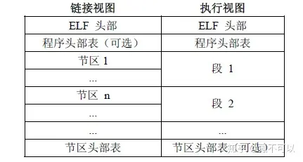
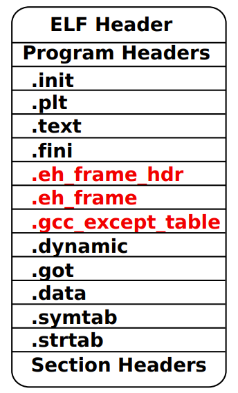
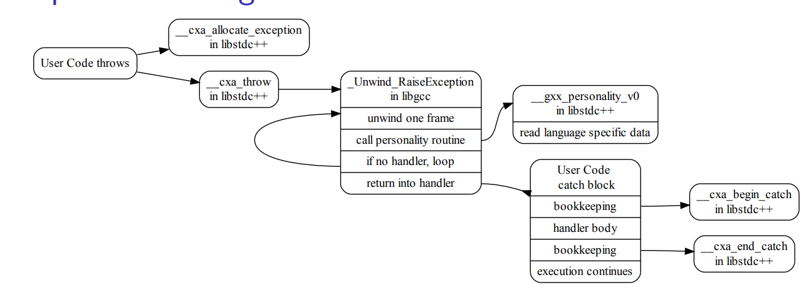

# ELF

## ELF文件格式

👉[ELF文件格式](https://zhuanlan.zhihu.com/p/286088470)

ELF文件格式提供了两种视图，分别是链接视图和执行视图：

链接视图是以节（section）为单位，执行视图是以段（segment）为单位。链接视图就是在链接时用到的视图，而执行视图则是在执行时用到的视图。



1. ELF头(ELF header)

   1. 描述文件的主要特性

   2. ```c
      typedef struct elf32_hdr
      {
          unsigned char	e_ident[EI_NIDENT];	/* Magic number and other info */
          Elf32_Half	e_type; /* Object file type */
          Elf32_Half	e_machine; /* Architecture */
          Elf32_Word	e_version; /* Object file version */
          Elf32_Addr	e_entry; /* Entry point virtual address */
          Elf32_Off	e_phoff; /* Program header table file offset */
          Elf32_Off	e_shoff; /* Section header table file offset */
          Elf32_Word	e_flags; /* Processor-specific flags */
          Elf32_Half	e_ehsize; /* ELF header size in bytes */
          Elf32_Half	e_phentsize; /* Program header table entry size */
          Elf32_Half	e_phnum; /* Program header table entry count */
          Elf32_Half	e_shentsize; /* Section header table entry size */
          Elf32_Half	e_shnum; /* Section header table entry count */
          Elf32_Half	e_shstrndx; /* Section header string table index */
      } Elf32_Ehdr;
      ```

2. 程序头表(Program header table)

   1. 列举了所有有效的段(segments)和他们的属性（执行视图）

   2. ```c
      typedef struct elf32_phdr{
          Elf32_Word	p_type;    /* Magic number and other info */
          Elf32_Off	p_offset;
          Elf32_Addr	p_vaddr;
          Elf32_Addr	p_paddr;
          Elf32_Word	p_filesz;
          Elf32_Word	p_memsz;
          Elf32_Word	p_flags;
          Elf32_Word	p_align;
      } Elf32_Phdr;
      ```

3. 节头表(Section header table)

   1. 包含对节(sections)的描述（链接视图）

   2. ```c
      typedef struct elf32_shdr{
          Elf32_Word sh_name; //节区名，名字是一个 NULL 结尾的字符串。
          Elf32_Word sh_type; //为节区类型
          Elf32_Word sh_flags; //节区标志
          Elf32_Addr sh_addr; //节区的第一个字节应处的位置。否则，此字段为 0。
          Elf32_Off sh_offset; //此成员的取值给出节区的第一个字节与文件头之间的偏移。
          Elf32_Word sh_size; //此 成 员 给 出 节 区 的 长 度 （ 字 节 数 ）。
          Elf32_Word sh_link; //此成员给出节区头部表索引链接。
          Elf32_Word sh_info; //此成员给出附加信息，其解释依赖于节区类型。
          Elf32_Word sh_addralign; //某些节区带有地址对齐约束.
          Elf32_Word sh_entsize; //给出每个表项的长度字节数。
      }Elf32_Shdr;
      ```

4. 系统预订的固定section

   1. |  sh_name  |   sh_type    | description                                                  |
      | :-------: | :----------: | :----------------------------------------------------------- |
      |   .text   | SHT_PROGBITS | 代码段，包含程序的可执行指令                                 |
      |   .data   | SHT_PROGBITS | 包含初始化了的数据，将出现在程序的内存映像中                 |
      |   .bss    |  SHT_NOBITS  | 未初始化数据，因为只有符号所以                               |
      |  .rodata  | SHT_PROGBITS | 包含只读数据                                                 |
      | .comment  | SHT_PROGBITS | 包含版本控制信息                                             |
      | .eh_frame | SHT_PROGBITS | 它生成描述如何unwind 堆栈的表，在调试程序的时候经常需要进行堆栈回溯 |
      |  .debug   | SHT_PROGBITS | 此节区包含用于符号调试的信息                                 |
      |  .dynsym  |  SHT_DYNSYM  | 此节区包含了动态链接符号表                                   |
      | .shstrtab |  SHT_STRTAB  | 存放section名，字符串表。Section Header String Table         |
      |  .strtab  |  SHT_STRTAB  | 字符串表                                                     |
      |  .symtab  |  SHT_SYMTAB  | 符号表                                                       |
      |   .got    | SHT_PROGBITS | 全局偏移表                                                   |
      |   .plt    | SHT_PROGBITS | 过程链接表                                                   |
      | .relname  |   SHT_REL    | 包含了重定位信息，例如 .text 节区的重定位节区名字将是：.rel.text |

## ELF加载过程

👉[ELF文件加载过程](https://zhuanlan.zhihu.com/p/287863861)

从编译/链接和运行的角度看，库分为动态链接和静态链接：

1）静态链接：在装入/启动其运行时无需装入函数库映像、也无需进行动态连接。

2）动态连接：需要在装入/启动其运行时同时装入函数库映像并进行动态链接。

## 栈回溯

👉[linux 栈回溯(x86_64)](https://zhuanlan.zhihu.com/p/302726082)

### frame pointer

使用``ebp`寄存器保存栈帧地址，esp保存栈顶指针，在过程调用时将上一个栈帧地址入栈保存

### DWARF

调试信息标准DWARF (Debugging With Attributed Record Formats)定义了一个`.debug_frame section`。该调试信息格式支持处理无基址指针的方法，可以将`ebp`用作常规寄存器，但是当保存``esp`时，它必须在`.debug_frame`节中产生一个注释，告诉调试器什么指令将其保存在何处。

它可以告诉调试器如何还原更多信息，而不仅仅是``ebp`。而且没有指令开销。

### EH_FRAME段

当函数执行入栈指令后，在该段会保存跟入栈指令一一对应的编码数据，根据这些编码数据，就能计算出当前函数栈大小和CPU的哪些寄存器入栈了，在栈中什么位置。

#### 格式

`readelf -wF a.out`查看elf文件中的`.eh_frame`解析信息


### CFI directives

CFI directives伪指令是一组生成CFI调试信息的高级语言，它的形式截取如下：

```c
.cfi_startproc
pushl %ebp
.cfi_def_cfa_offset 8
.cfi_offset ebp, -8
```

#### CFI伪指令

1. .`cfi_startproc`

   1. > 用在每个函数的入口处。

2. `.cfi_endproc`

   1. > .cfi_endproc用在函数的结束处，和.cfi_startproc对应。

3. `.cfi_def_cfa_offset [offset]`

   1. > 用来修改修改CFA计算规则，基址寄存器不变，offset变化：
      > CFA = register + offset(new)

4. `.cfi_def_cfa_register register`

   1. > 用来修改修改CFA计算规则，基址寄存器从rsp转移到新的register。
      > register = new register

5. `.cfi_offset** register, offset`

   1. > 寄存器register上一次值保存在CFA偏移offset的堆栈中：
      > *(CFA + offset) = register(pre_value)

6. `.cfi_def_cfa register, offset`

   1. > 用来定义CFA的计算规则：
      > CFA = register + offset
      > 默认基址寄存器register = rsp。
      > x86_64的register编号从0-15对应下表。rbp的register编号为6，rsp的register编号为7。
      > %rax，%rbx，%rcx，%rdx，%esi，%edi，%rbp，%rsp，%r8，%r9，%r10，%r11，%r12，%r13，%r14，%r15

# DWARF

参考：

👉[Exploiting DWARF | 异常处理的DWARF相关利用姿势](https://www.cnblogs.com/Mz1-rc/p/17392370.html)

👉[linux 栈回溯(x86_64)](https://zhuanlan.zhihu.com/p/302726082)

👉[通过DWARF Expression将代码隐藏在栈展开过程中](https://bbs.kanxue.com/thread-271891.htm)

## .eh_frame



根据`.eh_frame_hdr`查找。

+ CFA（Canonical Frame Address）：规范栈帧地址

  + 在执行当前函数（callee）的caller的call指令时的RSP值

  + > caller: 
    >
    > push arg1    -->    RSP = 0xFFF8 
    >
    > push arg2    -->    RSP = 0xFFF0  (执行call指令时的RSP值在这)
    >
    > call callee    -->    RSP = 0xFFE8  
    >
    > callee: 
    >
    > push rbp      -->    CFA = 0xFFF0

+ `.eh_frame`： 包含一个或多个`CFI(Call Frame Information)`记录

+ `CFI`：包含一个`CIE(Common Information Entry Record)`记录

+ `CIE`：含一个或者多个`FDE(Frame Description Entry)`记录

# Exception Handling Flow

异常处理流


