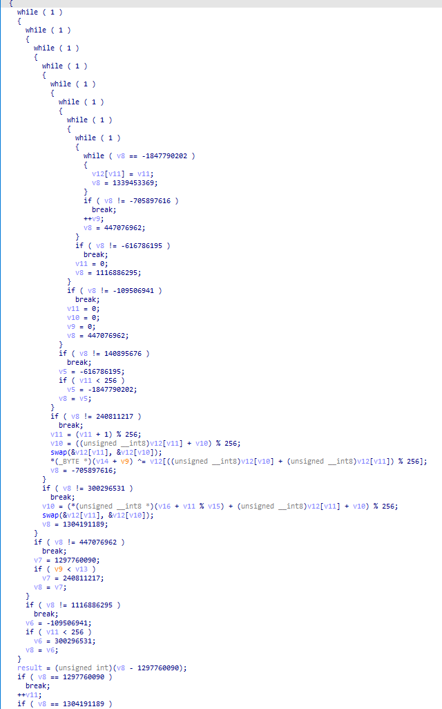
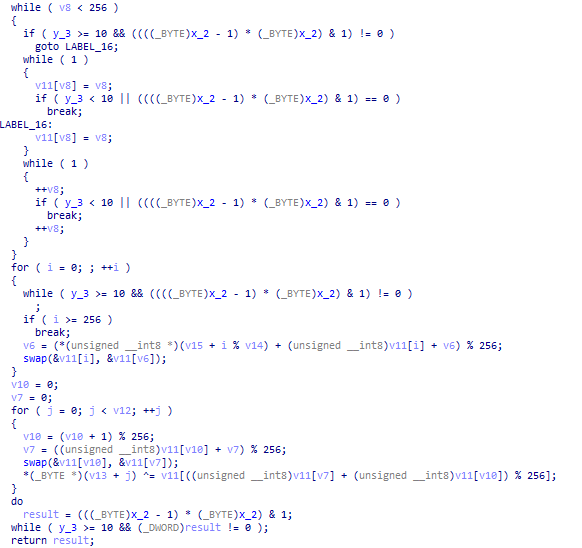
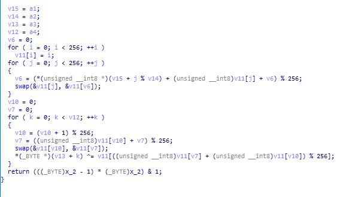

# 控制流平坦化

通过OLLVM的代码来学习LLVM PASS的写法以及控制流平坦化的生成逻辑。

基本概念：

* 基本块：一段顺序执行的指令序列。
* 终止指令：决定了基本块执行完成后程序控制流的去向通常包括无条件跳转,，指令、条件跳转指令和返回指令等。
* InvokeInst：调用指令，常用于异常处理相关场景。
* PHI指令：phi 指令根据当前基本块之前执行的是哪一个 前继块来得到相应的值。
* 逃逸变量：在一个基本块中定义，并且在另一个基本块被引用的变量。
  * 在原程序中某些基本块可能引用之前某个基本块中的变量，平坦化后原基本块之间不存在确定的前后关系了（由分发块决定），因此某些变量的引用可能会损坏。

## 控制流平坦化原理

首先，总结一遍控制流平坦化的生成逻辑：（以函数为单位进行混淆）

1. 保存所有的基本块（除第一个基本块）`origBB`
   1. 同时判断遍历到的基本块是否以invoke指令作为终止指令，如果是则无法进行混淆
      1. 如果对以 `InvokeInst` 结尾的基本块进行混淆操作，很可能会破坏原有的、与异常相关的控制流逻辑。
   2. 如果只有一个基本块的函数，则无法进行混淆
2. 处理第一个基本块
   1. 判断第一个基本块末尾是否需要特殊处理
      1. 条件：
         1. 判断终止指令是否分支指令，且存在条件
         2. 判断后继块数量是否大于1
      2. 如果满足，则：
         1. 获取第一个基本块的倒数第1条指令，假设为`i`
         2. 如果第一个基本块指令数量大于1，则获取的是倒数第2条指令，假设为`i`
            1. 倒数2条指令：类似cmp和jz指令的组合
         3. 切割基本块：`ins -> ins[:i]、ins[i:]`
            1. `i`之前的指令为一个基本块，`i`及`i`之后的指令为一个基本块
            2. 并且两个基本块之间建立一个无条件跳转
         4. 将`i`及`i`之后的指令形成的基本块插入到`origBB`的最前面
   2. 删除第一个基本块的终止指令
3. 构建主分发器
   1. 操作switch变量switchVar
      1. 在函数的栈帧分配其内存空间（AllocaInst）
      2. 生成存储指令StoreInst，插入到第一个基本块中
      3. 生成加载指令LoadInst，插入到loopEntry末尾
   2. 创建基本块loopEntry、loopEnd
      1. 分别插入到第一个基本块前面：loopEntry -> loopEnd -> 第一个基本块
   3. 创建基本块switchDefault
      1. 插入到loopEntry前面：loopEntry -> switchDefault -> loopEnd -> 第一个基本块
   4. 创建分支指令
      1. insert -> loopEntry
      2. loopEnd -> loopEntry
      3. switchDefault -> loopEnd
   5. 创建switch指令
      1. 初始0个case
      2. 默认分支为switchDefault
      3. 指令插入到loopEntry中
      4. 设置switch的目标switchVar
   6. 删除第一个基本块的终止指令
   7. 创建分支指令
      1. 第一个基本块 -> loopEntry
4. 将原始基本块都装入switch中
   1. 对每一个遍历到的原始基本块
      1. 将其插入到loopEnd前面
      2. 创建与其匹配的~~随机数~~ （应该称其为 ID），作为switch的case
5. 调整原始基本块
   1. 如果没有后续块（ret），则跳过
   2. 如果有一个后续块（无条件跳转），则：
      1. 删除到后续块的跳转
      2. 在基本块最后生成存储指令
         1. 设置switchVar为后续块对应的caseNum
   3. 如果有两个后续块（条件跳转），则：
      1. 将基本块的终止指令转换为分支指令
         1. 根据条件来设置switchVar为两个后续块的某一个值
6. 处理局部变量
   1. 遍历每个基本块，遍历每条指令
      1. 获取PHI节点
         1. `isa<PHINode>`
      2. 获取逃逸变量
         1. 如果不是AllocaInst指令或者不在入口基本块中
         2. 如果在其他基本块中被使用
   2. 对逃逸变量进行寄存器降级到栈的操作：DemoteRegToStack
      1. 为逃逸变量开辟内存空间
         1. 在插入点创建一个Alloca指令（通常在第一个基本块的终止指令之前）
      2. 如果逃逸变量的指令是InvokeInst且指令所在基本块的后续块是否不止一个前驱块，则：
         1. 在指令所在基本块和后续块之间插入一个新的基本块
         2. 如果不这么做，则存在因为其他异常的控制流路径提前存在提前进入这个基本块而导致存储指令执行顺序混乱的可能
      3. 替换逃逸变量的引用为slot的加载指令
         1. 遍历逃逸变量的每一个使用者
         2. 如果为PHINode，则将PHINode对应value为该逃逸变量的传入值替换为加载指令
         3. 如果不是，直接将使用者的指令替换为加载指令
      4. 寻找存储指令插入的位置
         1. 如果是终止指令，则在后继块的第一条指令之前插入存储指令
         2. 如果不是，跳过所在基本块中的PHINode和异常相关指令之后，插入存储指令
   3. 对PHINode进行降级到栈的操作：DemotePHIToStack
      1. 为逃逸变量开辟内存空间：Alloca
      2. 在PHINode的传入值的前驱块中插入存储指令
      3. 寻找slot的加载指令的插入位置，并替换所有的使用为该加载指令

## 注释代码

### Flattening

lib/Transforms/Obfuscation/Flattening.cpp

```cpp
bool Flattening::flatten(Function *f) {
    vector<BasicBlock *> origBB;
    BasicBlock *loopEntry;
    BasicBlock *loopEnd;
    LoadInst *load;
    SwitchInst *switchI;
    AllocaInst *switchVar;

    // SCRAMBLER
    char scrambling_key[16];
    llvm::cryptoutils->get_bytes(scrambling_key, 16);
    // END OF SCRAMBLER

    // Lower switch
    FunctionPass *lower = createLowerSwitchPass();
    lower->runOnFunction(*f);

    // 保存所有的基本块
    for (Function::iterator i = f->begin(); i != f->end(); ++i) {
        BasicBlock *tmp = &*i;
        origBB.push_back(tmp);
        // 如果当前基本块以invoke指令终止，则无法进行混淆
        BasicBlock *bb = &*i;
        if (isa<InvokeInst>(bb->getTerminator())) {
            return false;
        }
    }

    // 如果只有一个基本块，则无法进行混淆
    if (origBB.size() <= 1) {
        return false;
    }

    // 移除第一个基本块
    origBB.erase(origBB.begin());

    // 获取第一个基本块的指针
    Function::iterator tmp = f->begin(); //++tmp;
    BasicBlock *insert = &*tmp;

    BranchInst *br = NULL;
    // 检查第一个基本块的终止指令是否为分支指令
    if (isa<BranchInst>(insert->getTerminator())) {
        // 将终止指令赋值给br
        br = cast<BranchInst>(insert->getTerminator());
    }
    // 如果第一个基本块的终止指令为分支指令或者终止指令的后继节点数大于1
    if ((br != NULL && br->isConditional()) || insert->getTerminator()->getNumSuccessors() > 1) {
        // 获取第一个基本块的最后一条指令
        // insert->end()实际上是指向最后一条指令的下一条指令（NULL），类似于 C++ 中容器迭代器指向容器末尾的下一个位置的概念
        BasicBlock::iterator i = insert->end();
        // 获取最后一条指令
        --i;
        // 如果指令数量大于1，则迭代器i向前移动一位
        if (insert->size() > 1) {
            --i;
        }
        // 分裂基本块，i以及i之后的指令形成first基本块
        // 两个基本块之间建立一个无条件跳转
        BasicBlock *tmpBB = insert->splitBasicBlock(i, "first");
        origBB.insert(origBB.begin(), tmpBB);
    }

    // 删除第一个基本块最后的末尾跳转
    insert->getTerminator()->eraseFromParent();

    // 创建并初始化switch变量：32 位整数类型，插入到insert基本块中
    // AllocaInst：在函数的栈帧中分配内存空间
    switchVar = new AllocaInst(Type::getInt32Ty(f->getContext()), 0, "switchVar", insert);
    // 生成存储指令StoreInst在insert中
    // 将随机生成的32位整数存储到switchVar中
    new StoreInst(
        ConstantInt::get(
            Type::getInt32Ty(f->getContext()),
            llvm::cryptoutils->scramble32(0, scrambling_key)
        ),
        switchVar, insert
    );

    // 创建两个基本块（主分发器、子分发器）并插入到insert中
    // 默认插入是在insert基本块之前：loopEntry -> loopEnd -> insert
    loopEntry = BasicBlock::Create(f->getContext(), "loopEntry", f, insert);
    loopEnd = BasicBlock::Create(f->getContext(), "loopEnd", f, insert);

    load = new LoadInst(switchVar, "switchVar", loopEntry);

    // insert -> loopEntry -> loopEnd
    insert->moveBefore(loopEntry);
    // *llvm::BranchInst::Create(llvm::BasicBlock *IfTrue, llvm::BasicBlock *InsertAtEnd)
    // 建立了从loopEntry到insert的分支跳转关系，但不改变基本块在函数中的顺序
    // insert -> loopEntry
    BranchInst::Create(loopEntry, insert);
    // 建立了从loopEntry到loopEntry的分支跳转关系
    // loopEnd -> loopEntry
    BranchInst::Create(loopEntry, loopEnd);
    // 创建switch的默认块：switchDefault -> loopEnd
    BasicBlock *swDefault = BasicBlock::Create(f->getContext(), "switchDefault", f, loopEnd);
    BranchInst::Create(loopEnd, swDefault);

    // 创建了一个SwitchInst（switch指令）
    // swDefault表示switch指令的默认分支
    // 创建时，只有0个case
    // 指令插入到loopEntry基本块中
    switchI = SwitchInst::Create(&*f->begin(), swDefault, 0, loopEntry);
    // 设置switch指令的条件：load
    switchI->setCondition(load);

    // 删除第一个基本块的终止指令
    f->begin()->getTerminator()->eraseFromParent();
    // 创建一个分支指令，loopEntry -> 第一个基本块
    BranchInst::Create(loopEntry, &*f->begin());

    // 将原始基本块插入到switch指令中
    for (
        vector<BasicBlock *>::iterator b = origBB.begin(); 
        b != origBB.end();
        ++b
    ) {
        BasicBlock *i = *b;
        ConstantInt *numCase = NULL;
        // i -> loopEnd
        i->moveBefore(loopEnd);
        // 获取随机数的常量
        numCase = cast<ConstantInt>(
            ConstantInt::get(
                switchI->getCondition()->getType(),
                llvm::cryptoutils->scramble32(
                    switchI->getNumCases(), 
                    scrambling_key
                )
            )
        );
        // 添加一个case： i与numCase进行绑定
        switchI->addCase(numCase, i);
    }

    // 调整每个switch的case
    for (
        vector<BasicBlock *>::iterator b = origBB.begin(); 
        b != origBB.end();
        ++b
    ) {
        BasicBlock *i = *b;
        ConstantInt *numCase = NULL;

        // 如果没有后继块（ret），则跳过
        if (i->getTerminator()->getNumSuccessors() == 0) {
            continue;
        }

        // 如果后继块只有一个（无条件跳转），则直接跳转到后继块
        if (i->getTerminator()->getNumSuccessors() == 1) {
            // 获取后继块
            BasicBlock *succ = i->getTerminator()->getSuccessor(0);
            // 删除当前基本块的终止指令
            // 删除 i —> 后继块 的跳转
            i->getTerminator()->eraseFromParent();
            // 获取后继块对应的case
            numCase = switchI->findCaseDest(succ);
            // 如果没有找到对应的case，则生成一个随机数
            if (numCase == NULL) {
                numCase = cast<ConstantInt>(
                    ConstantInt::get(
                        switchI->getCondition()->getType(),
                        llvm::cryptoutils->scramble32(
                            switchI->getNumCases() - 1, scrambling_key
                        )
                    )
                );
            }
            // 创建一个存储指令，将numCase存储到switchVar中
            // 将该指令插入到当前基本块中
            new StoreInst(numCase, load->getPointerOperand(), i);
            // 创建一个分支指令，跳转到loopEnd
            BranchInst::Create(loopEnd, i);
            continue;
        }

        // 如果后继块有两个（条件跳转），则创建一个选择指令
        if (i->getTerminator()->getNumSuccessors() == 2) {
            // 获取两个后继块的case值
            ConstantInt *numCaseTrue = switchI->findCaseDest(i->getTerminator()->getSuccessor(0));
            ConstantInt *numCaseFalse = switchI->findCaseDest(i->getTerminator()->getSuccessor(1));

            // 如果没有找到对应的case，则生成一个随机数
            if (numCaseTrue == NULL) {
                numCaseTrue = cast<ConstantInt>(
                    ConstantInt::get(
                        switchI->getCondition()->getType(),
                        llvm::cryptoutils->scramble32(
                            switchI->getNumCases() - 1, scrambling_key
                        )
                    )
                );
            }
            if (numCaseFalse == NULL) {
                numCaseFalse = cast<ConstantInt>(
                    ConstantInt::get(
                        switchI->getCondition()->getType(),
                        llvm::cryptoutils->scramble32(
                            switchI->getNumCases() - 1, scrambling_key
                        )
                    )
                );
            }
            // 将某个指令所在基本块的终止指令（Terminator）转换为 BranchInst（分支指令）类型
            BranchInst *br = cast<BranchInst>(i->getTerminator());
            // 创建一个选择指令
            // 根据条件的真假 获取对应的case值
            // 将选择指令插入到当前基本块的终止指令之前
            SelectInst *sel = SelectInst::Create(
                br->getCondition(), 
                numCaseTrue, 
                numCaseFalse, 
                "", i->getTerminator()
            );
            // 删除当前基本块的终止指令
            i->getTerminator()->eraseFromParent();
            // 创建一个存储指令，将选择指令的结果存储到switchVar中
            new StoreInst(sel, load->getPointerOperand(), i);
            // i -> loopEnd
            BranchInst::Create(loopEnd, i);
            continue;
        }
    }
    fixStack(f);
    return true;
}
```

### Utils

lib/Transforms/Obfuscation/Utils.cpp

```cpp
void fixStack(Function *f) {
    // PHI指令：基本块之间传递数值
    // 逃逸变量：逃逸到函数外部的作用域
    // 删除phi节点并将寄存器降级到堆栈
    std::vector<PHINode *> tmpPhi;
    std::vector<Instruction *> tmpReg;
    BasicBlock *bbEntry = &*f->begin();

    do {
        tmpPhi.clear();
        tmpReg.clear();
        // 遍历函数的每个基本块
        for (Function::iterator i = f->begin(); i != f->end(); ++i) {
            // 遍历基本块的每个指令
            for (BasicBlock::iterator j = i->begin(); j != i->end(); ++j) {
                // 如果是phi节点
                if (isa<PHINode>(j)) {
                    PHINode *phi = cast<PHINode>(j);
                    // 将phi节点存储到tmpPhi中
                    tmpPhi.push_back(phi);
                    continue;
                }
                // 如果该指令位于入口块并且该指令为alloca指令则该指令一定不含逃逸变量
                // 如果该指令在其他基本块中也被使用过则该指令可能含有逃逸变量
                if (
                    !(isa<AllocaInst>(j) && j->getParent() == bbEntry) && 
                    (valueEscapes(&*j) || j->isUsedOutsideOfBlock(&*i))
                ) {
                    tmpReg.push_back(&*j);
                    continue;
                }
            }
        }
        // 修复
        for (unsigned int i = 0; i != tmpReg.size(); ++i) {
            DemoteRegToStack(*tmpReg.at(i), f->begin()->getTerminator());
        }

        for (unsigned int i = 0; i != tmpPhi.size(); ++i) {
            DemotePHIToStack(tmpPhi.at(i), f->begin()->getTerminator());
        }

    } while (tmpReg.size() != 0 || tmpPhi.size() != 0);
}
```

### DemoteRegToStack/DemotePHIToStack

lib/Transforms/Utils/DemoteRegToStack.cpp

```cpp
AllocaInst *llvm::DemoteRegToStack(Instruction &I, bool VolatileLoads, Instruction *AllocaPoint) {
    // 如果该指令没有被使用则直接删除该指令
    if (I.use_empty()) {
        I.eraseFromParent();
        return nullptr;
    }

    // 如果指定了插入点则在插入点处创建一个alloca指令
    AllocaInst *Slot;
    if (AllocaPoint) {
        Slot = new AllocaInst(I.getType(), nullptr, I.getName()+".reg2mem", AllocaPoint);
    } else {
        Function *F = I.getParent()->getParent();
        Slot = new AllocaInst(I.getType(), nullptr, I.getName() + ".reg2mem", &F->getEntryBlock().front());
    }

    // We cannot demote invoke instructions to the stack if their normal edge
    // is critical. Therefore, split the critical edge and create a basic block
    // into which the store can be inserted.
    // 尝试将I转化为InvokeInst
    if (InvokeInst *II = dyn_cast<InvokeInst>(&I)) {
        // 如果该指令的正常后继块没有单一的前驱块则分裂该关键边
        if (!II->getNormalDest()->getSinglePredecessor()) {
            // 获取该指令的后继块的编号
            unsigned SuccNum = GetSuccessorNumber(II->getParent(), II->getNormalDest());
            // 如果该指令所在基本块到后继块是关键边
            assert(isCriticalEdge(II, SuccNum) && "Expected a critical edge!");
            // 分裂关键边：在II和II->getNormalDest()之间插入一个新的基本块
            BasicBlock *BB = SplitCriticalEdge(II, SuccNum);
            assert(BB && "Unable to split critical edge.");
            (void)BB;
        }
    }

    // 将I的使用者替换为Slot
    while (!I.use_empty()) {
        // 获取I的一个使用者，即依赖指令I的结果值的其他指令
        Instruction *U = cast<Instruction>(I.user_back());
        // 如果U是一个PHINode则在其前驱块中插入一个load指令
        if (PHINode *PN = dyn_cast<PHINode>(U)) {
            // If this is a PHI node, we can't insert a load of the value before the
            // use.  Instead insert the load in the predecessor block corresponding
            // to the incoming value.
            //
            // Note that if there are multiple edges from a basic block to this PHI
            // node that we cannot have multiple loads. The problem is that the
            // resulting PHI node will have multiple values (from each load) coming in
            // from the same block, which is illegal SSA form. For this reason, we
            // keep track of and reuse loads we insert.
            DenseMap<BasicBlock*, Value*> Loads;
            // 当有多个前驱基本块的控制流汇聚到一个包含PHINode的基本块时，PHINode会根据控制流的来源（即不同的前驱基本块）选择不同的值
            // PN->getNumIncomingValues() 获取 PHINode 的传入值的数量
            for (unsigned i = 0, e = PN->getNumIncomingValues(); i != e; ++i)            
                // PN->getIncomingValue(i) 获取 PHINode 的第 i 个传入值，判断其是否是 I
                if (PN->getIncomingValue(i) == &I) {
                    // 获取对应前驱基本块的加载指令的引用
                    Value *&V = Loads[PN->getIncomingBlock(i)];
                    // 如果没记录过，则在前驱基本块中插入一个load指令
                    if (!V) {
                        V = new LoadInst(Slot, I.getName()+".reload", VolatileLoads, PN->getIncomingBlock(i)->getTerminator());
                    }
                    // 将PHINode的传入值替换为加载指令
                    PN->setIncomingValue(i, V);
                }

        } else {
            // 如果U只是一个普通的指令则直接替换为LoadInst
            Value *V = new LoadInst(Slot, I.getName()+".reload", VolatileLoads, U);
            U->replaceUsesOfWith(&I, V);
        }
    }

    // Insert stores of the computed value into the stack slot. We have to be
    // careful if I is an invoke instruction, because we can't insert the store
    // AFTER the terminator instruction.
    BasicBlock::iterator InsertPt;
    if (!isa<TerminatorInst>(I)) {
        InsertPt = ++I.getIterator();
        // 如果是PHINode或者InsertPt是EHPad（异常处理相关）则继续向后查找
        for (; isa<PHINode>(InsertPt) || InsertPt->isEHPad(); ++InsertPt)
            /* empty */;   // Don't insert before PHI nodes or landingpad instrs.
    } else {
        // 如果是InvokeInst则在其正常后继块的第一个插入点插入store指令
        InvokeInst &II = cast<InvokeInst>(I);
        InsertPt = II.getNormalDest()->getFirstInsertionPt();
    }
    // 在InsertPt处插入store指令：将I的值存储到Slot中
    new StoreInst(&I, Slot, &*InsertPt);
    return Slot;
}

// 将原本通过 PHINode 来处理在不同控制流路径下值的传递和选择机制，转变为通过栈上的存储和加载来实现
AllocaInst *llvm::DemotePHIToStack(PHINode *P, Instruction *AllocaPoint) {
    if (P->use_empty()) {
        P->eraseFromParent();
        return nullptr;
    }

    // Create a stack slot to hold the value.
    AllocaInst *Slot;
    if (AllocaPoint) {
        Slot = new AllocaInst(P->getType(), nullptr, P->getName()+".reg2mem", AllocaPoint);
    } else {
        Function *F = P->getParent()->getParent();
        Slot = new AllocaInst(P->getType(), nullptr, P->getName() + ".reg2mem", &F->getEntryBlock().front());
    }

    // 遍历每个PHINode的传入值
    for (unsigned i = 0, e = P->getNumIncomingValues(); i < e; ++i) {
        // 如果传入值是InvokeInst
        if (InvokeInst *II = dyn_cast<InvokeInst>(P->getIncomingValue(i))) {
            // II所在的基本块需要和P的传入值的前驱块不同
            assert(II->getParent() != P->getIncomingBlock(i) && "Invoke edge not supported yet"); (void)II;
        }
        // 在P的传入值的前驱块中插入store指令：将P的传入值存储到Slot中
        new StoreInst(P->getIncomingValue(i), Slot, P->getIncomingBlock(i)->getTerminator());
    }

    // Insert a load in place of the PHI and replace all uses.
    // 寻找插入点
    BasicBlock::iterator InsertPt = P->getIterator();
    // 跳过PHINode和EHPad
    for (; isa<PHINode>(InsertPt) || InsertPt->isEHPad(); ++InsertPt)
        /* empty */;   // Don't insert before PHI nodes or landingpad instrs.

    Value *V = new LoadInst(Slot, P->getName() + ".reload", &*InsertPt);
    // 将PHINode的使用者替换为加载指令
    P->replaceAllUsesWith(V);

    // 删除PHINode
    P->eraseFromParent();
    return Slot;
}
```

## 反混淆

控制流平坦化存在主/子分发块、真实块、预分发块（跳回主分发块）、返回块（ret）。

逻辑为：主/子分发器 -> 真实块 -> 预分发器 -> 主/子分发器。

通过混淆的逻辑可以发现各个块的规律：

* 主分发块：一般在第二个块（第一个块通常为实现栈存储的变量）。
* 预分发块：主分发块的前驱块。
* 真实块：预分发块的前驱块。
* 返回块：没有后继块的基本块。
* 子分发块：其余的大概都是子分发块。

### 示例

为了学习反混淆，这里编译了个示例，来进行测试。

示例源码：

```c
#include <stdio.h>
#include <stdlib.h>
#include <string.h>

void rc4(unsigned char *key, int key_len, unsigned char *data, int data_len) __attribute((__annotate__(("fla"))));

void swap(unsigned char *a, unsigned char *b) {
    unsigned char temp = *a;
    *a = *b;
    *b = temp;
}

void rc4(unsigned char *key, int key_len, unsigned char *data, int data_len) {
    unsigned char s[256];
    int i, j = 0;
    for (i = 0; i < 256; i++) {
        s[i] = i;
    }
    for (i = 0; i < 256; i++) {
        j = (j + s[i] + key[i % key_len]) % 256;
        swap(&s[i], &s[j]);
    }

    int k, t;
    i = 0, j = 0;
    for (k = 0; k < data_len; k++) {
        i = (i + 1) % 256;
        j = (j + s[i]) % 256;
        swap(&s[i], &s[j]);
        t = (s[i] + s[j]) % 256;
        data[k] ^= s[t];
    }
}

int main() {
    unsigned char key[] = "rc4_real_key";
    unsigned char data[25] = {0x5e,0x5b,0x37,0x59,0x7c,0x89,0xeb,0xb3,0x8d,0xc8,0x52,0x35,0x6f,0x3e,0xd0,0xbb,0x60,0xcf,0x7f,0x48,0x8d,0xa8,0x28,0x4d};
    int data_len = strlen((char *)data);
    rc4(key, strlen((char *)key), data, data_len);
    printf("Decrypted data: %s\n", data);
    return 0;
}
```

混淆后的反编译代码：



### idapython + 动态调试

#### 分析

通过idapython，可以获取控制流平坦化的各个块。

同时通过动态调试，可以知道每个块之间的逻辑顺序，这之后一个普遍的思路就是patch跳转指令，将逻辑块串起来。

先看一下真实块在设置switchVar时的两种情况：

1. 后继块唯一时：使用mov设置switchVar

   1. ```assembly
      loc_401E5D:
      mov     eax, [rbp+var_1C]
      add     eax, 1
      mov     [rbp+var_184], eax
      mov     [rbp+switchVar], 65F1685Bh
      jmp     loc_401F28
      ```
      
   2. 这种真实块直接patch jmp指令即可。

2. 后继块有两个时：通过cmov等同类指令设置switchVar

   1. ```assembly
      loc_401DC7:
      mov     eax, 9E1BF90Bh
      mov     ecx, 921BD6DEh
      mov     dl, [rbp+var_2D]
      test    dl, 1
      cmovnz  eax, ecx
      mov     [rbp+switchVar], eax
      jmp     loc_401F28
      ```
   
   2. 这种真实块需要两个jmp指令来修复，一个是条件跳转，一个是无条件跳转，如以下示例：
   
      1. ```assembly
         loc_4013D8:
         mov     eax, 0F965161Fh
         mov     ecx, 692ED1F4h
         mov     edx, [rbp+var_30]
         cmp     edx, [rbp+var_24]
         cmovl   eax, ecx
         mov     [rbp+switchVar], eax
         jmp     loc_4014C7
         # if [rbp+var_30] < [rbp+var_24]: switchVar = 0x692ED1F4
         # else: switchVar = 0xF965161F
         
         loc_4013D8:
         mov     edx, [rbp+var_30]
         cmp     edx, [rbp+var_24]
         jl		loc_xxxx # 对应switchVar为0x692ED1F4的真实块
         jmp		loc_xxxx # 对应switchVar为0xF965161F的真实块
         ```
   
   3. 获取其下一个逻辑上的真实块时，还需要根据cmp结果来判断时patch哪一条jmp指令

#### 实现

1. 获取块

   1. 主分发器：`main_block`
   2. 真实块：
      1. 具有单一后继块的真实块：`true_blocks_no_condition`
      2. 不具有单一后继块的真实块：`true_blocks_with_condition`
   3. 返回块：`return_blocks`

2. 下断点（起始点下断点是为了获取程序逻辑，`cmov`指令位置下断点是为了获取`cmp`条件结果）

   1. 对所有具有单一后继块的真实块的起始位置下断点
   2. 对所有不具有单一后继块的真实块的起始位置和`cmov`指令位置下断点
   3. 对返回块下断点

3. 定义last_block_addr来保存程序执行时上一个到达的真实块的地址

4. 使用DBG_Hooks自定义IDA调试的断点回调

   1. 判断last_block_addr是否有值
      1. 如果没有意味着现在到达的是第一个真实块，其上一个块应该是main_block
   2. 判断当前断点的地址是否是真实块或返回块的起始地址
      1. 如果不是，则意味着处于`cmov`指令位置
         1. 对于`cmovl`，获取`sf`和`of`标志位的值
            1. 如果`sf == of`，则下一个将要到达的块为`cmp`条件为`True`的分支
            2. 如果`sf != of`，则下一个将要到达的块为`cmp`条件为`False`的分支
            3. 通过判断设置自定义标志`condition`，来指示下一个断点应该作何操作
         2. 暂时没有对其他`cmov`类指令进行处理，但原理相同
      2. 如果是，则：
         1. 如果上一个真实块是具有单一后继块的真实块
            1. 则设置上一个真实块的下一个逻辑块为当前块
         2. 如果上一个真实块是不具有单一后继块的真实块
            1. 则根据`condition`来设置上一个真实块的相应的条件分支为当前块
   3. 最后，当程序走到返回块时，删除之前设置的断点

5. 使用DBG_Hooks自定义IDA调试的进程结束的回调

   1. 执行`unhook`
   2. 此时已经获取了整个函数的块的逻辑执行顺序，可以开始修复程序了

6. `deflat`

   1. 对于具有单一后继块的真实块，直接patch跳转地址即可

   2. 对于不具有单一后续块的真实块，根据其情况来进行patch

      1. 如果之前为`cmovl`，则需要用`jl`和`jmp`来patch

         1. 将`cmovl`及之后的指令patch为

         2. ```assembly
            jl loc_xx(之前记录的条件为真时的下一个逻辑块); 
            jmp loc_xx(之前记录的条件为假时的下一个逻辑块)
            ```

      2. 暂时没有进行其他`cmov`类指令进行处理，但原理相同

```python
import ida_dbg
import ida_bytes
import idaapi
import idc

class MyDBG(ida_dbg.DBG_Hooks):
    def __init__(self, func_addr):
        super(MyDBG, self).__init__()
        self.func_addr = func_addr
        # 返回块
        self.return_block = None
        # 主分发块
        self.main_block = None
        # 真实块
        self.true_blocks_no_condition = {}
        self.true_blocks_with_condition = {}
        # 上一个块的地址
        self.last_block_addr = -1
        # 指示条件分支的标志
        self.condition = 0 # 1: true, -1: false
        self.get_block()
        self.add_bpt_for_blocks()

    def dbg_bpt(self, tid, ea):
        print(f"MyDBG >> Breakpoint at {ea:X}")
        # 如果last_block_addr仍未定义，则其上一个块为主分发块
        if self.last_block_addr == -1:
            self.main_block["logic_next"].append(ea)
            self.last_block_addr = ea
            ida_dbg.continue_process()
            return 0
        # 判断ea是否在真实块或返回块的起始地址
        if ea in self.true_blocks_no_condition or \
            ea in self.true_blocks_with_condition or \
            ea == self.return_block["start"]:
            # 如果上一个块为具有单一后继块的真实块，直接设置其下一个逻辑块为当前块
            if self.last_block_addr in self.true_blocks_no_condition:
                self.true_blocks_no_condition[self.last_block_addr]["logic_next"] = ea
            # 如果上一个块为具有条件跳转的真实块，根据条件设置其下一个逻辑块为当前块
            elif self.last_block_addr in self.true_blocks_with_condition:
                if self.condition == 1:
                    self.true_blocks_with_condition[self.last_block_addr]["logic_next_true"] = ea
                elif self.condition == -1:
                    self.true_blocks_with_condition[self.last_block_addr]["logic_next_false"] = ea
                else:
                    assert False, f"Unknown condition {self.last_block_addr:X} -> {ea:X}"
            # 更新上一个块的地址
            self.last_block_addr = ea
        else:
            # 如果ea不在真实块或返回块的起始地址，则当前地址为cmov指令的地址
            addr = self.true_blocks_with_condition[self.last_block_addr]["condition"]
            inst = idc.print_insn_mnem(addr)
            match inst:
                case "cmovl":
                    sf = idc.get_reg_value("SF")
                    of = idc.get_reg_value("OF")
                    # 判断less条件是否满足
                    if sf != of:
                        # 如果满足，则接下来跳到的block为条件为真的block
                        self.condition = 1
                    else:
                        # 如果不满足，则接下来跳到的block为条件为假的block
                        self.condition = -1
                case _:
                    # 暂时只处理cmovl指令
                    assert False, f"Unknown instruction {ea:X}{inst}"
        # 如果到了返回块，则删除所有断点
        if ea == self.return_block["start"]:
            self.del_bpt_for_blocks()
        ida_dbg.continue_process()
        return 0

    def dbg_process_exit(self, pid, tid, ea, code):
        print(f"MyDBG >> Process exited with code {code}")
        self.unhook()
        self.show_logic()
        self.deflat()

    def get_block(self):
        func = idaapi.get_func(self.func_addr)
        # 获取所有基本块
        flowchart = idaapi.FlowChart(func, flags=idaapi.FC_PREDS)
        # 主分发块：第2个块
        self.main_block = {
            "start": flowchart[1].start_ea,
            "end": flowchart[1].end_ea,
            "jmp_addr": idaapi.prev_head(flowchart[1].end_ea, idc.get_segm_start(flowchart[1].end_ea)),
            "logic_next": []
        }
        # 预分发块：主分发块的前驱块
        pre_main_block = None
        for pred in flowchart[1].preds():
            if pred.start_ea != flowchart[0].start_ea:
                pre_main_block = pred
                break
        else:
            assert False, "Can not find pre_main_block"
        # 返回块：没有后继块的块
        for block in flowchart:
            succ = [succ for succ in block.succs()]
            if len(succ) == 0:
                self.return_block = {
                    "start": block.start_ea,
                    "end": block.end_ea
                }
                break
        else:
            assert False, "Can not find return_block"
        # 真实块：预分发块的所有前驱块
        # 给真实块的开头下断点
        for p in pre_main_block.preds():
            # 检查是否有cmovl类指令
            ea = p.start_ea
            cmp_addr = -1
            while ea < p.end_ea:
                mnem = idc.print_insn_mnem(ea)
                if mnem == "cmp":
                    cmp_addr = ea
                elif mnem.startswith("cmov"):
                    # 如果具有条件跳转指令，则该块为不具有单一后继块的真实块
                    self.true_blocks_with_condition[p.start_ea] = {
                        "start": p.start_ea,
                        "end": p.end_ea,
                        "jmp_addr": idaapi.prev_head(p.end_ea, idc.get_segm_start(p.end_ea)),
                        "logic_next_true": -1,
                        "logic_next_false": -1,
                        "condition": ea,
                        "cmp_addr": cmp_addr
                    }
                    break
                ea = ida_bytes.next_head(ea, p.end_ea)
            else:
                # 如果没有条件跳转指令，则该块为具有单一后继块的真实块
                self.true_blocks_no_condition[p.start_ea] = {
                    "start": p.start_ea,
                    "end": p.end_ea,
                    "jmp_addr": idaapi.prev_head(p.end_ea, idc.get_segm_start(p.end_ea)),
                    "logic_next": -1
                }

    # 为所有真实块和返回块下断点
    def add_bpt_for_blocks(self):
        for key in self.true_blocks_no_condition:
            ida_dbg.add_bpt(key)
        for key in self.true_blocks_with_condition:
            ida_dbg.add_bpt(self.true_blocks_with_condition[key]["condition"])
            ida_dbg.add_bpt(key)
        ida_dbg.add_bpt(self.return_block["start"])

    # 删除所有真实块和返回块的断点
    def del_bpt_for_blocks(self):
        for key in self.true_blocks_no_condition:
            ida_dbg.del_bpt(key)
        for key in self.true_blocks_with_condition:
            ida_dbg.del_bpt(self.true_blocks_with_condition[key]["condition"])
            ida_dbg.del_bpt(key)
        ida_dbg.del_bpt(self.return_block["start"])

    # 获取程序逻辑
    def show_logic(self):
        print(f"Main block: {self.main_block['start']:X}")
        for addr in self.main_block["logic_next"]:
            print(f"    -> {addr:X}")
        for addr, block in self.true_blocks_no_condition.items():
            print(f"True block: {block['start']:X} -> {block['logic_next']:X}")
        for addr, block in self.true_blocks_with_condition.items():
            print(f"True block: {block['start']:X} ->")
            print(f"    ->  true: {block['logic_next_true']:X}")
            print(f"    -> false: {block['logic_next_false']:X}")

    # 修复逻辑
    def deflat(self):
        print("Deflating...")
        for addr, block in self.true_blocks_no_condition.items():
            if block["logic_next"] == -1:
                continue
            offset = block["logic_next"] - block["jmp_addr"] - 5
            print(f"Patch {block['jmp_addr']:X} {offset:X}")
            ida_bytes.patch_dword(block["jmp_addr"] + 1, offset)
        for addr, block in self.true_blocks_with_condition.items():
            if block["logic_next_true"] == -1 or block["logic_next_false"] == -1:
                continue
            space_len = block["end"] - block["condition"]
            mnem = idc.print_insn_mnem(block["condition"])
            ea = block["condition"]
            if mnem == "cmovl":
                data = b'\x0f\x8c' # jl指令
                data += (block["logic_next_true"] - ea - 6).to_bytes(4, byteorder="little")
                data += b'\xE9' # jmp指令
                data += (block["logic_next_false"] - ea - 6 - 5).to_bytes(4, byteorder="little")
                assert space_len >= len(data), f"Space not enough {space_len} < {len(data)}"
                print(f"Patch {ea:X} {data.hex()}")
                ida_bytes.patch_bytes(ea, data)
                ida_bytes.patch_bytes(ea + len(data), b'\x90' * (space_len - len(data)))
            else:
                assert False, f"Unknown instruction {block['condition']:X} {mnem}"
        print("Deflat done!")

if __name__ == "__main__":
    func_addr = idc.get_reg_value("RIP")
    ida_dbg.del_bpt(func_addr)
    mydbg = MyDBG(func_addr)
    mydbg.hook()
    ida_dbg.continue_process()
```

#### 结果


#### 缺点

这种方法很明显只适用于具有该特征的的控制流平坦化。

并且如果程序逻辑有条件分支，且程序没有都走过条件分支的两边，则无法复原这个条件分支的。

### 符号执行 angr

通过模拟执行，知晓执行的下一个真实块。

这里设置了更大的 Python 的递归深度限制，放置部分逻辑在执行时报错 `RecursionError: maximum recursion depth exceeded`。

```python
import sys
sys.setrecursionlimit(2000)
```

#### 获取各个块

这里思路与上一节类似，不再赘述。

```python
def get_blocks(cfg):
    return_node = []
    for node in cfg:
        if cfg.in_degree(node) == 0:
            prologue_node = node
            print(f"Prologue node: {prologue_node.addr:x}")
        elif cfg.out_degree(node) == 0:
            return_node.append(node)
            print(f"Return node: {node.addr:x}")
    main_node = list(cfg.successors(prologue_node))[0]
    print(f"Main node: {main_node.addr:x}")
    pre_main_node = [
        n 
        for n in cfg.predecessors(main_node) 
        if n.addr != prologue_node.addr
    ][0]
    print(f"Pre-main node: {pre_main_node.addr:x}")
    true_nodes = [n for n in cfg.predecessors(pre_main_node)]
    print(f"True nodes: {[hex(n.addr) for n in true_nodes]}")
    nop_nodes = [
        n 
        for n in cfg 
        if n not in [prologue_node, main_node, pre_main_node] + 
            true_nodes + return_node
    ]
    return (
        prologue_node, main_node, 
        pre_main_node, true_nodes, 
        return_node, nop_nodes
    )
```

#### 获取控制流

这里创建两个列表，方便操作：

```python
relevant_nodes = [prologue_node] + true_nodes + return_node
relevant_nodes_without_ret = [prologue_node] + true_nodes
```

遍历 `relevant_nodes_without_ret`，判断其是否在真实逻辑下有多个分支（是否存在 `cmov` 等指令）。

与此同时，hook 掉 `call` 指令。

```python
def preprocess(proj, block_addr):
    def hook_func(state):
        pass
    block = proj.factory.block(block_addr)
    has_branch = False
    for insn in block.capstone.insns:
        if insn.mnemonic.startswith("cmov"):
            has_branch = True
            branch_addr = insn.address
            branch_type = insn.mnemonic
        elif insn.mnemonic == "call":
            proj.hook(insn.address, hook=hook_func, length=insn.size)
    return (
        has_branch, 
        branch_addr if has_branch else None,
        branch_type if has_branch else None
    )

def get_flow(proj, relevant_nodes, relevant_nodes_without_ret):
    patch_addrs = {}
    cmov_types = {}
    relevant_nodes_addr = [n.addr for n in relevant_nodes]
    # 默认字典，当key不存在时，自动创建一个空列表
    flow = defaultdict(list)
    for node in relevant_nodes_without_ret:
        has_branch, branch_addr, branch_type = preprocess(proj, node.addr)
        if has_branch: ...
        else: ...
    return flow, patch_addrs, cmov_types
```

如果只有一条分支，直接进入符号执行。

```python
next_addr = symbolic_execution(proj, node.addr, relevant_nodes_addr)
flow[node].append(next_addr)
```

如果由两条分支，分别给出个条件来进入符号执行。

```python
patch_addr[node.addr] = branch_addr
cmov_types[node.addr] = branch_type
true_addr = symbolic_execution(
    proj, node.addr, relevant_nodes_addr,
    condition=claripy.BVV(1, 1)
)
false_addr = symbolic_execution(
    proj, node.addr, relevant_nodes_addr, 
    condition=claripy.BVV(0, 1)
)
flow[node].append(true_addr)
flow[node].append(false_addr)
```

对于符号执行：

如果只有一条分支，则从遍历到的块的地址开始符号执行，直到其到达一个在 `relevant_addr` 中的另一个地址，这个地址即为其真是逻辑下的后继点。

```python
def symbolic_execution(proj, block_addr, relevant_nodes, condition=None):
    simgr = proj.factory.simgr(state)
    simgr.step()
    while len(simgr.active) > 0:
        for active in simgr.active:
            if active.addr in relevant_nodes:
                return active.addr
        simgr.step()
    assert False, f"Cannot reach relevant node in symbolic execution: {block_addr:x}"   
```

如果具有两条分支，这是需要给 `cmov` 指令下断点来进行符号执行了。

首先，得知道：angr 中的使用多条 VEX IR 来解释汇编指令的。

对于如下具有 `cmov` 指令的基本块进行操作：

```assembly
.text:000000000040162E loc_40162E:
.text:000000000040162E mov     eax, 3FC0223Bh
.text:0000000000401633 mov     ecx, 7E22D93Dh
.text:0000000000401638 mov     edx, [rbp+var_8]
.text:000000000040163B mov     esi, [rbp+var_4]
.text:000000000040163E cmp     edx, esi
.text:0000000000401640 cmovg   eax, ecx
.text:0000000000401643 mov     [rbp+var_14], eax
.text:0000000000401646 jmp     loc_401671
```

代码为：

```python
def myaction(state):
    expressions = list(state.scratch.irsb.statements[state.inspect.statement].expressions)
    if len(expressions) != 0 and isinstance(expressions[0], pyvex.expr.ITE):
        print(f"Address: {state.addr:x}")
        print(f"state.scratch.irsb.statements[state.inspect.statement]: {state.scratch.irsb.statements[state.inspect.statement]}")
        print(f"Expressions: {expressions}, type: {type(expressions[0])}")
        print(f"state.scratch.temps[expressions[0].cond.tmp]:{state.scratch.temps[expressions[0].cond.tmp]}")
        print(f"state.inspect._breakpoints['statement']:{state.inspect._breakpoints['statement']}")
```

输出如下（只包含了 `ITE` 指令部分）：

```python
Address: 40163b
state.scratch.irsb.statements[state.inspect.statement]: t52 = ITE(t30,0x835299ab,0x77182fd4)
Expressions: [<pyvex.expr.ITE object at 0x7f551b529700>, <pyvex.expr.RdTmp object at 0x7f551dda3bb0>, <pyvex.expr.Const object at 0x7f551b510d30>, <pyvex.expr.Const object at 0x7f551b510d60>], type: <class 'pyvex.expr.ITE'>
state.scratch.temps[expressions[0].cond.tmp]:<BV1 if reg_rsi_2_64[31:0] <s reg_rdi_1_64[31:0] then 1 else 0>
state.inspect._breakpoints['statement']:[<BP before-action with conditions {}, no condition func, with action func>]
```

可以看到，`cmov` 指令被解释的多条 VEX IR 中，有一个：`t52 = ITE(t30,0x835299ab,0x77182fd4)`。

其根据 `t30` 来给 `t52` 赋值，条件其实在 `state.scratch.temps[expressions[0].cond.tmp]:<BV1 if reg_rsi_2_64[31:0] <s reg_rdi_1_64[31:0] then 1 else 0>`。

如果人为给出条件，使其根据条件来走，即可获知当 `t52 = 0x835299ab` 时，程序会如何执行。

因此，这里的代码为：

```python
def symbolic_execution(proj, block_addr, relevant_nodes, condition=None):
    def modify_ITE_condition(state):
        expressions = list(state.scratch.irsb.statements[state.inspect.statement].expressions)
        # 判断是否是ITE表达式
        if len(expressions) != 0 and isinstance(expressions[0], pyvex.expr.ITE):
            # 修改条件
            state.scratch.temps[expressions[0].cond.tmp] = condition
            # 移除断点
            state.inspect._breakpoints['statement'] = []
    
    state = proj.factory.blank_state(
        addr=block_addr,
        remove_options={angr.options.LAZY_SOLVES}
    )
    if condition is not None:
        # 设置断点，
        # 当执行到statement前，调用modify_ITE_condition函数
        # ITE：If Then Else
        statement_bp = state.inspect.b('statement', when=angr.BP_BEFORE, action=modify_ITE_condition)
    simgr = proj.factory.simgr(state)
    simgr.step()
    while len(simgr.active) > 0:
        for active in simgr.active:
            if active.addr in relevant_nodes:
                return active.addr
        simgr.step()
    assert False, f"Cannot reach relevant node in symbolic execution: {block_addr:x}"   
```

#### 修补程序

修补的目标有两个：

1. 将真实的逻辑串起来（修补 `jmp` 等指令）。
2. 将无用的块进行 nop。

这里修补同样判断其是否有多条分支：

```python
def patch(proj, data, relevant_nodes_without_ret, flow, patch_addrs, cmov_types):
    for node in relevant_nodes_without_ret:
        next_nodes = flow[node]
        if len(next_nodes) == 1: ... 
        else: ... 
    return data
```

如果只有一个分支，直接将块的最后一条指令修改为 `jmp`（如果该块为 `prologue_node`，则修改到下一个块去）。

```python
def patch_jmp(proj, data, patch_addr, target_addr):
    jmp_ins = b"\xe9" + (target_addr - patch_addr - 5).to_bytes(4, 'little')
    jmp_ins = list(jmp_ins)
    offset = patch_addr - proj.loader.main_object.min_addr
    data[offset:offset+5] = jmp_ins
    print(f"Patch jmp at {patch_addr:x} to {target_addr:x}")

if len(next_nodes) == 1:
    # 无条件分支：一般最后都是jmp指令（跳转去子分发块）
    if node.addr == prologue_node.addr:
        # 往main_block的地址写入prologue_block的jmp指令
        patch_addr = node.addr + node.size
    else:
        patch_addr = node.addr + node.size - 5
        patch_jmp(proj, data, patch_addr, next_nodes[0])
```

如果有多个分支，首先需要修改 `cmov` 等指令为对应的 `jx` 指令，跳去之前设置为 true 的分支。

然后在修改后的 `jx` 指令后，再加上 `jmp` 指令，跳去之前设置为 false 的分支。

这里寻找 `cmov` 等指令为对应的 `jx` 指令时，是使用 `keystone `的，安装 👉 `pip install keystone-engine`

```python
def patch_jmp(proj, data, patch_addr, target_addr):
    jmp_ins = b"\xe9" + (target_addr - patch_addr - 5).to_bytes(4, 'little')
    jmp_ins = list(jmp_ins)
    offset = patch_addr - proj.loader.main_object.min_addr
    data[offset:offset+5] = jmp_ins
    print(f"Patch jmp at {patch_addr:x} to {target_addr:x}")

def patch_nop(proj, data, patch_addr, length):
    offset = patch_addr - proj.loader.main_object.min_addr
    data[offset:offset+length] = [0x90] * length
    print(f"Patch nop at {patch_addr:x} with length {length}")

def get_jmp_ins_bytes(cmov_type):
    jmp_ins = cmov_type.replace("cmov", "j")
    ks = Ks(KS_ARCH_X86, KS_MODE_64)
    code, count = ks.asm(f"{jmp_ins} 0xFFFFFFFF")
    code = code[:2]
    return code

def patch_cmov_(proj, data, patch_addr, cmov_type, target_addr):
    offset = patch_addr - proj.loader.main_object.min_addr
    jmp_ins = get_jmp_ins_bytes(cmov_type)
    jmp_ins += list((target_addr - patch_addr - 6).to_bytes(4, 'little', signed=True))
    data[offset:offset+6] = jmp_ins
    print(f"Patch cmov at {patch_addr:x} to {target_addr:x}")

# 有条件分支
patch_addr = patch_addrs[node.addr]
cmov_type = cmov_types[node.addr]
patch_nop(proj, data, patch_addr, node.addr + node.size - patch_addr)
patch_cmov_(proj, data, patch_addr, cmov_type, next_nodes[0])
patch_jmp(proj, data, patch_addr + 6, next_nodes[1])
```

#### 完整代码

```python
import sys
import angr
import claripy
import pyvex
import logging
from keystone import *
from angrmanagement.utils.graph import to_supergraph
from collections import defaultdict

def get_cfg(proj, func_addr):
    cfg = proj.analyses.CFGFast(
        normalize=True,
        force_complete_scan=False,
    )
    cfg = cfg.kb.functions[func_addr].transition_graph
    cfg = to_supergraph(cfg)
    return cfg

def get_blocks(cfg):
    return_node = []
    for node in cfg:
        if cfg.in_degree(node) == 0:
            prologue_node = node
            print(f"Prologue node: {prologue_node.addr:x}")
        elif cfg.out_degree(node) == 0:
            return_node.append(node)
            print(f"Return node: {node.addr:x}")
    main_node = list(cfg.successors(prologue_node))[0]
    print(f"Main node: {main_node.addr:x}")
    pre_main_node = [
        n 
        for n in cfg.predecessors(main_node) 
        if n.addr != prologue_node.addr
    ][0]
    print(f"Pre-main node: {pre_main_node.addr:x}")
    true_nodes = [n for n in cfg.predecessors(pre_main_node)]
    print(f"True nodes: {[hex(n.addr) for n in true_nodes]}")
    nop_nodes = [
        n 
        for n in cfg 
        if n not in [prologue_node, main_node, pre_main_node] + 
            true_nodes + return_node
    ]
    return (
        prologue_node, main_node, 
        pre_main_node, true_nodes, 
        return_node, nop_nodes
    )

def preprocess(proj, block_addr):
    def hook_func(state):
        pass
    block = proj.factory.block(block_addr)
    has_branch = False
    for insn in block.capstone.insns:
        if insn.mnemonic.startswith("cmov"):
            has_branch = True
            branch_addr = insn.address
            branch_type = insn.mnemonic
        elif insn.mnemonic == "call":
            proj.hook(insn.address, hook=hook_func, length=insn.size)
    return (
        has_branch, 
        branch_addr if has_branch else None,
        branch_type if has_branch else None
    )

def symbolic_execution(proj, block_addr, relevant_nodes, condition=None):
    def modify_ITE_condition(state):
        expressions = list(state.scratch.irsb.statements[state.inspect.statement].expressions)
        # 判断是否是ITE表达式
        if len(expressions) != 0 and isinstance(expressions[0], pyvex.expr.ITE):
            # 修改条件
            state.scratch.temps[expressions[0].cond.tmp] = condition
            # 使用保存的断点对象移除断点
            state.inspect._breakpoints['statement'] = []
    
    state = proj.factory.blank_state(
        addr=block_addr,
        remove_options={angr.options.LAZY_SOLVES}
    )
    if condition is not None:
        # 设置断点，
        # 当执行到statement前，调用modify_ITE_condition函数
        # ITE：If Then Else
        statement_bp = state.inspect.b('statement', when=angr.BP_BEFORE, action=modify_ITE_condition)
    simgr = proj.factory.simgr(state)
    simgr.step()
    while len(simgr.active) > 0:
        for active in simgr.active:
            if active.addr in relevant_nodes:
                return active.addr
        simgr.step()
    assert False, f"Cannot reach relevant node in symbolic execution: {block_addr:x}"        

def get_flow(proj, relevant_nodes, relevant_nodes_without_ret):
    patch_addrs = {}
    cmov_types = {}
    relevant_nodes_addr = [n.addr for n in relevant_nodes]
    # 默认字典，当key不存在时，自动创建一个空列表
    flow = defaultdict(list)
    for node in relevant_nodes_without_ret:
        has_branch, branch_addr, branch_type = preprocess(proj, node.addr)
        if has_branch:
            patch_addrs[node.addr] = branch_addr
            cmov_types[node.addr] = branch_type
            print(f"Symbolic execution with branch: {node.addr:x}", end=" -true-> ")
            true_addr = symbolic_execution(
                proj, node.addr, relevant_nodes_addr,
                condition=claripy.BVV(1, 1)
            )
            print(f"{true_addr:x}")
            print(f"Symbolic execution with branch: {node.addr:x}", end=" -false-> ")
            false_addr = symbolic_execution(
                proj, node.addr, relevant_nodes_addr, 
                condition=claripy.BVV(0, 1)
            )
            print(f"{false_addr:x}")
            flow[node].append(true_addr)
            flow[node].append(false_addr)
        else:
            print(f"Symbolic execution without branch: {node.addr:x}", end=" -> ")
            next_addr = symbolic_execution(proj, node.addr, relevant_nodes_addr)
            print(f"{next_addr:x}")
            flow[node].append(next_addr)
    return flow, patch_addrs, cmov_types

def print_flow(flow):
    for k, v in flow.items():
        if len(v) == 1:
            print(f"{k.addr:x} -> {v[0]:x}")
        else:
            print(f"{k.addr:x} -> true:{v[0]:x}, false:{v[1]:x}")

def patch_jmp(proj, data, patch_addr, target_addr):
    jmp_ins = b"\xe9" + (target_addr - patch_addr - 5).to_bytes(4, 'little', signed=True)
    jmp_ins = list(jmp_ins)
    offset = patch_addr - proj.loader.main_object.min_addr
    data[offset:offset+5] = jmp_ins
    print(f"Patch jmp at {patch_addr:x} to {target_addr:x}: {[hex(i) for i in jmp_ins]}")

def patch_nop(proj, data, patch_addr, length):
    offset = patch_addr - proj.loader.main_object.min_addr
    data[offset:offset+length] = [0x90] * length
    print(f"Patch nop at {patch_addr:x} with length {length}")

def get_jmp_ins_bytes(cmov_type):
    jmp_ins = cmov_type.replace("cmov", "j")
    ks = Ks(KS_ARCH_X86, KS_MODE_64)
    code, count = ks.asm(f"{jmp_ins} 0xFFFFFFFF")
    print(f"Get jmp ins bytes: ({jmp_ins} 0xFFFFFFFF) -> {[hex(i) for i in code]}")
    code = code[:2]
    return code

def patch_cmov_(proj, data, patch_addr, cmov_type, target_addr):
    offset = patch_addr - proj.loader.main_object.min_addr
    jmp_ins = get_jmp_ins_bytes(cmov_type)
    jmp_ins += list((target_addr - patch_addr - 6).to_bytes(4, 'little', signed=True))
    data[offset:offset+6] = jmp_ins
    print(f"Patch {cmov_type} at {patch_addr:x} to {target_addr:x}: {[hex(i) for i in jmp_ins]}")

def patch(proj, data, relevant_nodes_without_ret, flow, patch_addrs, cmov_types):
    prologue_node = relevant_nodes_without_ret[0]
    for node in relevant_nodes_without_ret:
        next_nodes = flow[node]
        if len(next_nodes) == 1:
            # 无条件分支：一般最后都是jmp指令（跳转去子分发块）
            if node.addr == prologue_node.addr:
                # 往main_block的地址写入prologue_block的jmp指令
                patch_addr = node.addr + node.size
            else:
                patch_addr = node.addr + node.size - 5
            patch_jmp(proj, data, patch_addr, next_nodes[0])
        else:
            # 有条件分支
            patch_addr = patch_addrs[node.addr]
            cmov_type = cmov_types[node.addr]
            patch_nop(proj, data, patch_addr, node.addr + node.size - patch_addr)
            patch_cmov_(proj, data, patch_addr, cmov_type, next_nodes[0])
            patch_jmp(proj, data, patch_addr + 6, next_nodes[1])
    return data
            

def main(filename, func_addr):
    print(f"Set recursion limit to 2000")
    sys.setrecursionlimit(2000)
    logging.getLogger('cle').setLevel(logging.ERROR)
    logging.getLogger('angr').setLevel(logging.ERROR)
    proj = angr.Project(filename, auto_load_libs=False)
    cfg = get_cfg(proj, func_addr)
    (
        prologue_node, main_node, 
        pre_main_node, true_nodes, 
        return_node, nop_nodes
    ) = get_blocks(cfg)
    relevant_nodes = [prologue_node] + true_nodes + return_node
    relevant_nodes_without_ret = [prologue_node] + true_nodes
    flow, patch_addrs, cmov_types = get_flow(proj, relevant_nodes, relevant_nodes_without_ret)
    # print_flow(flow)
    with open(filename, 'rb') as f:
        data = list(f.read())
    patch(proj, data, relevant_nodes_without_ret, flow, patch_addrs, cmov_types)
    with open(filename + '_patched', 'wb') as f:
        f.write(bytes(data))
    print(f"Patch done! Output file: {filename}_patched")

if __name__ == '__main__':
    filename = 'test'
    main(filename, 0x401170)
```


# 虚假控制流

## 虚假控制流原理

在这里进行删除 debug 输出的源码讲解。

### runOfFunction

1. 先对函数执行 `bogus`。
2. 再对整个模块进行 `doF` 。

```c++
virtual bool runOnFunction(Function &F) {
    if (ObfTimes <= 0) {
        errs() << "BogusControlFlow application number -bcf_loop=x must be x > 0";
        return false;
    }
    if (!((ObfProbRate > 0) && (ObfProbRate <= 100))) {
        errs() << "BogusControlFlow application basic blocks percentage -bcf_prob=x must be 0 < x <= 100";
        return false;
    }
    if (toObfuscate(flag, &F, "bcf")) {
        bogus(F);
        doF(*F.getParent());
        return true;
    }
    return false;
}
```

### bogus

1. 将所有基本块存入队列。
2. 遍历队列，根据 `ObfProbRate`，有概率地对遍历到的基本块进行 `addBogusFlow` 操作。

```cpp
void bogus(Function &F) {
    ++NumFunction;
    int NumBasicBlocks = 0;
    bool firstTime = true;
    bool hasBeenModified = false;
    if (ObfProbRate < 0 || ObfProbRate > 100) {
        ObfProbRate = defaultObfRate;
    }
    if (ObfTimes <= 0) {
        ObfTimes = defaultObfTime;
    }
    NumTimesOnFunctions = ObfTimes;
    int NumObfTimes = ObfTimes;

    do {
        // 将基本块放入列表
        std::list<BasicBlock *> basicBlocks;
        for (Function::iterator i = F.begin(); i != F.end(); ++i) {
            basicBlocks.push_back(&*i);
        }
        while (!basicBlocks.empty()) {
            NumBasicBlocks++;
            // Basic Blocks' selection
            if ((int)llvm::cryptoutils->get_range(100) <= ObfProbRate) {
                hasBeenModified = true;
                ++NumModifiedBasicBlocks;
                // 混淆增加了3个基本块: originalBB, alteredBB, originalBBpart2
                NumAddedBasicBlocks += 3;
                FinalNumBasicBlocks += 3;
                // 取出第一个基本块进行混淆
                BasicBlock *basicBlock = basicBlocks.front();
                addBogusFlow(basicBlock, F);
            }
            basicBlocks.pop_front();
            if (firstTime) {
                ++InitNumBasicBlocks;
                ++FinalNumBasicBlocks;
            }
        }
        firstTime = false;
    } while (--NumObfTimes > 0);
}
```

### addBogusFlow

1. 将基本块分为两部分。

   1. 第一部分 `basicBlock` 只包含 phi 节点、调试信息和由 splitBasicBlock 创建的终结指令。
   2. 第二部分 `originalBB` 包含第一部分外的所有指令。

2. 通过 `createAlteredBasicBlock` 将 `originalBB` 进行复制和修改，得到 `alteredBB`。

3. 修改终止指令以调整控制流。

   1. 删除 alteredBB 和 first basic blocks 的终止指令。

4. 创建两个常量值，值都为 1，用于创建条件跳转指令。

5. 将该基本块的逻辑改变为：

   1. ```
      basicBlock -> 
           True -> originalBB
           False -> alteredBB -> originalBB
      ```

   2. 根据常量值，创建 `1 == 1` 的条件跳转指令。

6. 再将基本块的逻辑改变为：

   1. ```
       basicBlock -if-> 
           True -> originalBB -if->
                       True -> originalBBpart2
                       False -> alteredBB -> originalBB
           False -> alteredBB -> originalBB
      ```

   2. 取 `originalBB` 的终止指令之前的指令，并分割为两个基本块：`originalBB, originalBBpart2`。

   3. 根据常量值，创建 `1 == 1` 的条件跳转指令。

```cpp
virtual void addBogusFlow(BasicBlock *basicBlock, Function &F) {
    // 将基本块分为两部分
    // 第一部分只包含 phi 节点、调试信息和由 splitBasicBlock 创建的终结指令
    // 第二部分包含第一部分外的所有指令
    BasicBlock::iterator i1 = basicBlock->begin();
    if (basicBlock->getFirstNonPHIOrDbgOrLifetime())
        i1 = (BasicBlock::iterator)basicBlock->getFirstNonPHIOrDbgOrLifetime();
    Twine *var;
    var = new Twine("originalBB");
    BasicBlock *originalBB = basicBlock->splitBasicBlock(i1, *var);
    // 复制一个修改过的基本块，用于第一个基本块跳转
    Twine *var3 = new Twine("alteredBB");
    // 这个 alteredBB 不会被执行到
    BasicBlock *alteredBB = createAlteredBasicBlock(originalBB, *var3, &F);

    // 修改终止指令以调整控制流
    // 删除 alteredBB 和 first basic blocks 的终止指令
    alteredBB->getTerminator()->eraseFromParent();
    basicBlock->getTerminator()->eraseFromParent();
    // 创建两个常量值,用于创建条件跳转指令
    Value *LHS = ConstantFP::get(Type::getFloatTy(F.getContext()), 1.0);
    Value *RHS = ConstantFP::get(Type::getFloatTy(F.getContext()), 1.0);

    // 以下代码将改变逻辑如下:
    // basicBlock -> 
    //     True -> originalBB
    //     False -> alteredBB -> originalBB

    // 创建一个为真(1 == 1)的条件,放置在第一个基本块的末尾
    Twine *var4 = new Twine("condition");
    FCmpInst *condition = new FCmpInst(*basicBlock, FCmpInst::FCMP_TRUE, LHS, RHS, *var4);
    // 设置条件跳转指令, true -> originalBB, false -> alteredBB
    BranchInst::Create(originalBB, alteredBB, (Value *)condition, basicBlock);
    // alteredBB 会跳转回 originalBB
    BranchInst::Create(originalBB, alteredBB);

    // 以下代码将改变逻辑如下:
    // basicBlock -if-> 
    //     True -> originalBB -if->
    //                 True -> originalBBpart2
    //                 False -> alteredBB -> originalBB
    //     False -> alteredBB -> originalBB

    // --i: 获取 originalBB 的终止指令之前的指令,并分割为两个基本块
    BasicBlock::iterator i = originalBB->end();
    Twine *var5 = new Twine("originalBBpart2");
    BasicBlock *originalBBpart2 = originalBB->splitBasicBlock(--i, *var5);
    // 删除 originalBB 的终止指令
    originalBB->getTerminator()->eraseFromParent();
    // 添加永真的条件跳转指令
    Twine *var6 = new Twine("condition2");
    FCmpInst *condition2 = new FCmpInst(*originalBB, CmpInst::FCMP_TRUE, LHS, RHS, *var6);
    BranchInst::Create(originalBBpart2, alteredBB, (Value *)condition2, originalBB);
}
```

### createAlteredBasicBlock

1. 复制一个基本块 `alteredBB` ，包括基本块中的所有指令。
   1. 更新 VMap，使得对于 `basicBlock` 中的每个 Value，都有一个指向其在新基本块中对应副本的映射。
   2. 新基本块在函数 F 中的名字为 Name。
2. 遍历 `alteredBB`，并修复其信息。
   1. `alteredBB` 的指令的操作数。
   2. `alteredBB ` 的 phi 节点的入口块。
   3. `alteredBB` 的元数据。
   4. `alteredBB` 的调试信息。
3. 遍历 `alteredBB` 的指令：
   1. 随机地在二元操作的指令前插入一些指令。
   2. 随机地修改 `alteredBB` 的条件判断的方式。

```cpp
virtual BasicBlock *createAlteredBasicBlock(BasicBlock *basicBlock, const Twine &Name="gen", Function *F=0) {
    ValueToValueMapTy VMap;
    // llvm::CloneBasicBlock(basicBlock, VMap, Name, F)
    // 复制一个基本块，包括基本块中的所有指令
    // 更新 VMap，使得对于 basicBlock 中的每个 Value，都有一个指向其在新基本块中对应副本的映射
    // 新基本块在函数 F 中的名字为 Name
    BasicBlock *alteredBB = llvm::CloneBasicBlock(basicBlock, VMap, Name, F);
    // Remap operands.
    BasicBlock::iterator ji = basicBlock->begin();
    // 修复 alteredBB 中的信息
    for (BasicBlock::iterator i = alteredBB->begin(), e = alteredBB->end(); i != e; ++i) {
        // 根据 VMap 恢复 alteredBB 中的指令的操作数
        for (User::op_iterator opi = i->op_begin(), ope = i->op_end(); opi != ope; ++opi) {
            // get the value for the operand
            // 根据 VMap 更新操作数
            Value *v = MapValue(*opi, VMap, RF_None, 0);
            if (v != 0) {
                *opi = v;
            }
        }
        DEBUG_WITH_TYPE("gen", errs() << "bcf: Operands remapped\n");
        // 更新 phi 节点的入口块
        if (PHINode *pn = dyn_cast<PHINode>(i)) {
            // 遍历 phi 节点的所有输入值
            // 获取对应的输入基本块，更新为新基本块
            for (unsigned j = 0, e = pn->getNumIncomingValues(); j != e; ++j) {
                Value *v = MapValue(pn->getIncomingBlock(j), VMap, RF_None, 0);
                if (v != 0) {
                    pn->setIncomingBlock(j, cast<BasicBlock>(v));
                }
            }
        }
        // 修复元数据
        SmallVector<std::pair<unsigned, MDNode *>, 4> MDs;
        i->getAllMetadata(MDs);
        // important for compiling with DWARF, using option -g.
        // 修复调试信息
        i->setDebugLoc(ji->getDebugLoc());
        ji++;
    }

    for (BasicBlock::iterator i = alteredBB->begin(), e = alteredBB->end(); i != e; ++i) {
        // 随机地插入一些指令
        if (i->isBinaryOp()) {
            unsigned opcode = i->getOpcode();
            BinaryOperator *op, *op1 = NULL;
            Twine *var = new Twine("_");
            // 分别处理浮点数和整数
            // Binary int
            if (opcode == Instruction::Add || opcode == Instruction::Sub ||
                opcode == Instruction::Mul || opcode == Instruction::UDiv ||
                opcode == Instruction::SDiv || opcode == Instruction::URem ||
                opcode == Instruction::SRem || opcode == Instruction::Shl ||
                opcode == Instruction::LShr || opcode == Instruction::AShr ||
                opcode == Instruction::And || opcode == Instruction::Or ||
                opcode == Instruction::Xor) {
                for (int random = (int)llvm::cryptoutils->get_range(10); random < 10; ++random) {
                    switch (llvm::cryptoutils->get_range(4)) {
                        case 0:
                            break;
                        case 1:
                            // 创建指令：op1 - op0
                            op = BinaryOperator::CreateNeg(i->getOperand(0), *var, &*i);
                            op1 = BinaryOperator::Create(Instruction::Add, op, i->getOperand(1), "gen", &*i);
                            break;
                        case 2:
                            // 创建指令：(op0 - op1) * op0
                            op1 = BinaryOperator::Create(Instruction::Sub, i->getOperand(0), i->getOperand(1), *var, &*i);
                            op = BinaryOperator::Create(Instruction::Mul, op1, i->getOperand(1), "gen", &*i);
                            break;
                        case 3:
                            // 创建指令：op0 << op1
                            op = BinaryOperator::Create(Instruction::Shl, i->getOperand(0), i->getOperand(1), *var, &*i);
                            break;
                    }
                }
            }
            // Binary float
            if (opcode == Instruction::FAdd || opcode == Instruction::FSub ||
                opcode == Instruction::FMul || opcode == Instruction::FDiv ||
                opcode == Instruction::FRem) {
                for (int random = (int)llvm::cryptoutils->get_range(10); random < 10; ++random) {
                    switch (llvm::cryptoutils->get_range(3)) {
                        case 0:
                            break;
                        case 1:
                            op = BinaryOperator::CreateFNeg(i->getOperand(0), *var, &*i);
                            op1 = BinaryOperator::Create(Instruction::FAdd, op, i->getOperand(1), "gen", &*i);
                            break;
                        case 2:
                            op = BinaryOperator::Create(Instruction::FSub, i->getOperand(0), i->getOperand(1), *var, &*i);
                            op1 = BinaryOperator::Create(Instruction::FMul, op, i->getOperand(1), "gen", &*i);
                            break;
                    }
                }
            }
            if (opcode == Instruction::ICmp) { // Condition (with int)
                ICmpInst *currentI = (ICmpInst *)(&i);
                switch (llvm::cryptoutils->get_range(3)) {
                    case 0:
                        break;
                    case 1:
                        currentI->swapOperands();
                        break;
                    case 2:
                        // 随机改变条件的判读方式
                        switch (llvm::cryptoutils->get_range(10)) {
                            case 0:
                                currentI->setPredicate(ICmpInst::ICMP_EQ);
                                break; // equal
                            case 1:
                                currentI->setPredicate(ICmpInst::ICMP_NE);
                                break; // not equal
                            case 2:
                                currentI->setPredicate(ICmpInst::ICMP_UGT);
                                break; // unsigned greater than
                            case 3:
                                currentI->setPredicate(ICmpInst::ICMP_UGE);
                                break; // unsigned greater or equal
                            case 4:
                                currentI->setPredicate(ICmpInst::ICMP_ULT);
                                break; // unsigned less than
                            case 5:
                                currentI->setPredicate(ICmpInst::ICMP_ULE);
                                break; // unsigned less or equal
                            case 6:
                                currentI->setPredicate(ICmpInst::ICMP_SGT);
                                break; // signed greater than
                            case 7:
                                currentI->setPredicate(ICmpInst::ICMP_SGE);
                                break; // signed greater or equal
                            case 8:
                                currentI->setPredicate(ICmpInst::ICMP_SLT);
                                break; // signed less than
                            case 9:
                                currentI->setPredicate(ICmpInst::ICMP_SLE);
                                break; // signed less or equal
                        }
                        break;
                }
            }
            if (opcode == Instruction::FCmp) {
                FCmpInst *currentI = (FCmpInst *)(&i);
                switch (llvm::cryptoutils->get_range(3)) {
                    case 0:
                        break;
                    case 1:
                        currentI->swapOperands();
                        break;
                    case 2: // randomly change the predicate
                        switch (llvm::cryptoutils->get_range(10)) {
                            case 0:
                                currentI->setPredicate(FCmpInst::FCMP_OEQ);
                                break; // ordered and equal
                            case 1:
                                currentI->setPredicate(FCmpInst::FCMP_ONE);
                                break; // ordered and operands are unequal
                            case 2:
                                currentI->setPredicate(FCmpInst::FCMP_UGT);
                                break; // unordered or greater than
                            case 3:
                                currentI->setPredicate(FCmpInst::FCMP_UGE);
                                break; // unordered, or greater than, or equal
                            case 4:
                                currentI->setPredicate(FCmpInst::FCMP_ULT);
                                break; // unordered or less than
                            case 5:
                                currentI->setPredicate(FCmpInst::FCMP_ULE);
                                break; // unordered, or less than, or equal
                            case 6:
                                currentI->setPredicate(FCmpInst::FCMP_OGT);
                                break; // ordered and greater than
                            case 7:
                                currentI->setPredicate(FCmpInst::FCMP_OGE);
                                break; // ordered and greater than or equal
                            case 8:
                                currentI->setPredicate(FCmpInst::FCMP_OLT);
                                break; // ordered and less than
                            case 9:
                                currentI->setPredicate(FCmpInst::FCMP_OLE);
                                break; // ordered or less than, or equal
                        }
                        break;
                }
            }
        }
    }
    return alteredBB;
}
```

### doF

1. 创建两个全局变量。
2. 遍历模块的每一个函数，再遍历函数的每一个基本块：
   1. 判断基本块的终止指令是否分支指令。
   2. 判断分支是否是条件分支。
   3. 判断条件是否是浮点数比较。
   4. 判断比较结果是否永真。
   5. 如果都是，则要删除该条件指令，修改分支指令。
3. 根据遍历的结果：
   1. 要修改的分支指令：
      1. 创建分支指令：
         1. 将条件替换为 `y < 10 || x*(x+1) % 2 == 0` 的形式。
      2. 删除原来的分支指令。
   2. 要删除的条件指令：直接删除。

```cpp
// 将所有的永真条件替换为不透明的条件
// 删除所有的函数、基本块和指令的名称
bool doF(Module &M) {
    // 将永真式改为(y < 10 || x * (x + 1) % 2 == 0)的形式
    DEBUG_WITH_TYPE("gen", errs() << "bcf: Starting doFinalization...\n");
    // 创建全局变量
    Twine *varX = new Twine("x");
    Twine *varY = new Twine("y");
    Value *x1 = ConstantInt::get(Type::getInt32Ty(M.getContext()), 0, false);
    Value *y1 = ConstantInt::get(Type::getInt32Ty(M.getContext()), 0, false);
    GlobalVariable *x = new GlobalVariable(
        M, Type::getInt32Ty(M.getContext()), false,
        GlobalValue::CommonLinkage, (Constant *)x1, *varX
    );
    GlobalVariable *y = new GlobalVariable(
        M, Type::getInt32Ty(M.getContext()), false,
        GlobalValue::CommonLinkage, (Constant *)y1, *varY
    );

    std::vector<Instruction *> toEdit, toDelete;
    BinaryOperator *op, *op1 = NULL;
    LoadInst *opX, *opY;
    ICmpInst *condition, *condition2;
    // Looking for the conditions and branches to transform
    for (Module::iterator mi = M.begin(), me = M.end(); mi != me; ++mi) {
        for (Function::iterator fi = mi->begin(), fe = mi->end(); fi != fe; ++fi) {
            // 如果要删除名称，则在这里
            // fi->setName("");
            // 获取基本块的终止指令
            TerminatorInst *tbb = fi->getTerminator();
            // 如果终止指令是分支指令
            if (tbb->getOpcode() == Instruction::Br) {
                BranchInst *br = (BranchInst *)(tbb);
                // 如果分支是条件分支
                if (br->isConditional()) {
                    FCmpInst *cond = (FCmpInst *)br->getCondition();
                    unsigned opcode = cond->getOpcode();
                    // 如果条件是浮点数比较，且比较结果永真
                    if (opcode == Instruction::FCmp) {
                        if (cond->getPredicate() == FCmpInst::FCMP_TRUE) {
                            // 要删掉 cond
                            toDelete.push_back(cond);
                            // 要替换的分支
                            toEdit.push_back(tbb);
                        }
                    }
                }
            }
        }
    }
    // Replacing all the branches we found
    for (std::vector<Instruction *>::iterator i = toEdit.begin(); i != toEdit.end(); ++i) {
        // if y < 10 || x*(x+1) % 2 == 0
        opX = new LoadInst((Value *)x, "", (*i));
        opY = new LoadInst((Value *)y, "", (*i));
        // x * (x - 1) % 2 == 0
        op = BinaryOperator::Create(
            Instruction::Sub, (Value *)opX,
            ConstantInt::get(Type::getInt32Ty(M.getContext()), 1, false), 
            "", (*i)
        );
        op1 = BinaryOperator::Create(Instruction::Mul, (Value *)opX, op, "", (*i));
        op = BinaryOperator::Create(
            Instruction::URem, op1,
            ConstantInt::get(Type::getInt32Ty(M.getContext()), 2, false), 
            "", (*i)
        );
        condition = new ICmpInst(
            (*i), ICmpInst::ICMP_EQ, op,
            ConstantInt::get(Type::getInt32Ty(M.getContext()), 0, false)
        );
        // y < 10
        condition2 = new ICmpInst(
            (*i), ICmpInst::ICMP_SLT, opY,
            ConstantInt::get(Type::getInt32Ty(M.getContext()), 10, false)
        );
        // y < 10 || x * (x + 1) % 2 == 0
        op1 = BinaryOperator::Create(Instruction::Or, (Value *)condition, (Value *)condition2, "", (*i));
        // 替换原始的条件
        BranchInst::Create(
            ((BranchInst *)*i)->getSuccessor(0),
            ((BranchInst *)*i)->getSuccessor(1), (Value *)op1,
            ((BranchInst *)*i)->getParent()
        );
        (*i)->eraseFromParent();
    }
    for (std::vector<Instruction *>::iterator i = toDelete.begin(); i != toDelete.end(); ++i) {
        (*i)->eraseFromParent();
    }
    return true;
}
```

## 反混淆

### 示例

示例源码：

```c
#include <stdio.h>
#include <stdlib.h>
#include <string.h>

void swap(unsigned char *a, unsigned char *b) {
    unsigned char temp = *a;
    *a = *b;
    *b = temp;
}

void rc4(unsigned char *key, int key_len, unsigned char *data, int data_len) {
    unsigned char s[256];
    int i, j = 0;
    for (i = 0; i < 256; i++) {
        s[i] = i;
    }
    for (i = 0; i < 256; i++) {
        j = (j + s[i] + key[i % key_len]) % 256;
        swap(&s[i], &s[j]);
    }

    int k, t;
    i = 0, j = 0;
    for (k = 0; k < data_len; k++) {
        i = (i + 1) % 256;
        j = (j + s[i]) % 256;
        swap(&s[i], &s[j]);
        t = (s[i] + s[j]) % 256;
        data[k] ^= s[t];
    }
}

int main() {
    unsigned char key[] = "rc4_real_key";
    unsigned char data[25] = {0x5e,0x5b,0x37,0x59,0x7c,0x89,0xeb,0xb3,0x8d,0xc8,0x52,0x35,0x6f,0x3e,0xd0,0xbb,0x60,0xcf,0x7f,0x48,0x8d,0xa8,0x28,0x4d};
    int data_len = strlen((char *)data);
    rc4(key, strlen((char *)key), data, data_len);
    printf("Decrypted data: %s\n", data);
    return 0;
}
```

混淆后效果：




### 符号执行 angr

#### 实现

根据混淆原理，虚假控制流其实就是插入了一些基本块，并且利用永真或永假的条件，使插入的基本块无法执行。

符号执行遇到不可能成立的路径，加入了无解的约束，angr 发现是 unsat 的，即不可满足的，则可以辨别出是虚假控制流。

因此，使用符号执行记录走过的基本块，从而得到没走过的基本块，把没走过的基本块进行 `nop`，即可。

```python
import angr
import logging

def patch_nop(data, proj, addr):
    obfblock = proj.factory.block(addr)
    size = obfblock.size
    offset = obfblock.addr - proj.loader.main_object.mapped_base
    nop = [0x90] * size
    data[offset:offset+size] = nop
    return data
    

def deflat_bogus(filename, start_addr):
    proj = angr.Project(filename, load_options={'auto_load_libs': False})
    # 获取函数的所有基本块
    cfg = proj.analyses.CFGFast()
    func = cfg.kb.functions[start_addr]
    basicblocks = list(func.blocks)
    obfblocksAddr = set()
    # 将函数里的所有调用都hook掉
    for block in basicblocks:
        obfblocksAddr.add(block.addr)
        for insn in block.capstone.insns:
            if insn.mnemonic == 'call':
                # 获取要调用的函数的地址
                addr = insn.operands[0].imm
                # 检查 函数 是否是库函数
                called_function = cfg.kb.functions.function(addr=addr)
                print(f"called_function: {called_function.name}, is_plt: {called_function.is_plt}")
                if called_function is not None and called_function.is_plt:
                    # 返回无约束的符号
                    proj.hook(
                        addr, 
                        angr.SIM_PROCEDURES['stubs']['ReturnUnconstrained'](),
                        replace=True
                    )
                    print(f"Hook [call {addr:x}] at {insn.address:x}")
    
    # state = proj.factory.blank_state(
    #     addr=start_addr, 
    #     remove_options={angr.sim_options.LAZY_SOLVES}
    # )
    state = proj.factory.entry_state(
        remove_options={angr.sim_options.LAZY_SOLVES}
    )
    simgr = proj.factory.simulation_manager(state)
    # 如果有active状态，就一步步走下去，直到没有active状态
    while len(simgr.active) > 0:
        for active in simgr.active:
            # 去除已经走过的基本块，即原逻辑的基本块
            obfblocksAddr.discard(active.addr)
        simgr.step()
    # 输出没有走过的基本块
    for addr in obfblocksAddr:
        print(f"Unexplored block: {addr:x}")
    # 将没有走过的基本块进行nop
    with open(filename, "rb") as f:
        data = list(f.read())
    for addr in obfblocksAddr:
        data = patch_nop(data, proj, addr)
    with open(filename + "_deflat", "wb") as f:
        f.write(bytes(data))
    print(f"Deflat done, output file: {filename}_deflat")
    

def main():
    # 去除angr的warning日志
    logging.getLogger('cle').setLevel(logging.ERROR)
    logging.getLogger('angr').setLevel(logging.ERROR)
    filename = "test1"
    deflat_bogus(filename, 0x401170)


if __name__ == "__main__":
    main()
```

这里使用了两种 `state`：

+ `blank_state`
  + `blank_state` 创建的是一个几乎空的状态，它只包含了最基础的环境设置，比如寄存器、内存等，但没有加载任何二进制文件或库。
  + `state = proj.factory.blank_state(addr=start_addr, remove_options={angr.sim_options.LAZY_SOLVES})`
+ `entry_state`
  + `entry_state` 创建的是一个代表程序正常启动时的状态。它会自动加载二进制文件及其依赖库，并正确地设置所有必要的环境变量、参数等，使得这个状态就像是程序刚刚被操作系统加载并准备开始执行一样。
  + 使用 `entry_state` 时要确保程序逻辑会调用想要解混淆的函数。
  + `state = proj.factory.entry_state(remove_options={angr.sim_options.LAZY_SOLVES})`

两种都有效果，一种跑不出来换另一种试试。

关于是否要 `hook` 函数， 我看到网上师傅的解答，我觉得是对的。

> 在符号执行一些静态链接的文件时，angr的符号执行模拟器会陷入到复杂的库函数中，导致跑的时间非常长或者根本跑不出来。

在我的代码中，只 `hook` 了库函数。

#### 结果



### Patch不透明谓词

IDA 由于无法识别不透明谓词，无法简化混淆代码。

这些用于混淆的不透明谓词是没有被赋值的，因此从始至终都为 0。

因此，可以使用脚本将用于混淆的不透明谓词都 patch 了。

通过创建的全局变量来找引用这些不透明谓词的指令：

```assembly
.bss:0000000000404038 __bss_start     db ?                    ; DATA XREF: deregister_tm_clones↑o
.bss:0000000000404038                                         ; deregister_tm_clones+5↑o ...
.bss:0000000000404038                                         ; Alternative name is '__TMC_END__'
.bss:0000000000404038                                         ; completed.8061
.bss:0000000000404038                                         ; _edata
.bss:0000000000404039                 align 4
.bss:000000000040403C                 public x
.bss:000000000040403C x               db    ? ;
.bss:000000000040403D                 db    ? ;
.bss:000000000040403E                 db    ? ;
.bss:000000000040403F                 db    ? ;
.bss:0000000000404040                 public y_7
.bss:0000000000404040 y_7             db    ? ;
.bss:0000000000404041                 db    ? ;
.bss:0000000000404042                 db    ? ;
.bss:0000000000404043                 db    ? ;
.bss:0000000000404044                 public y_5
.bss:0000000000404044 y_5             dd ?                    ; DATA XREF: test+21↑r
.bss:0000000000404044                                         ; test+6B↑r ...
.bss:0000000000404048                 public y_3
.bss:0000000000404048 y_3             dd ?                    ; DATA XREF: rc4+44↑r
.bss:0000000000404048                                         ; rc4+93↑r ...
.bss:000000000040404C                 public y
.bss:000000000040404C y               db    ? ;
.bss:000000000040404D                 db    ? ;
.bss:000000000040404E                 db    ? ;
.bss:000000000040404F                 db    ? ;
.bss:0000000000404050                 public x_6
.bss:0000000000404050 x_6             db    ? ;
.bss:0000000000404051                 db    ? ;
.bss:0000000000404052                 db    ? ;
.bss:0000000000404053                 db    ? ;
.bss:0000000000404054                 public x_4
.bss:0000000000404054 x_4             dd ?                    ; DATA XREF: test+1A↑r
.bss:0000000000404054                                         ; test+64↑r ...
.bss:0000000000404058                 public x_2
.bss:0000000000404058 x_2             dd ?                    ; DATA XREF: rc4+3D↑r
.bss:0000000000404058                                         ; rc4+8C↑r ...
.bss:000000000040405C                 align 20h
.bss:000000000040405C _bss            ends
```

#### 实现

```python
import idc
import idautils
import ida_bytes

def get_xref_type(t):
    # types = {
    #     idc.fl_F: "Flow",
    #     idc.fl_JF: "False flow",
    #     idc.dr_R: "Read",
    #     idc.dr_W: "Write",
    #     idc.dr_T: "Text",
    #     idc.fl_CN: "Call near",
    #     idc.fl_CF: "Call far",
    # }
    # return types.get(t, "Unknown"), t == idc.dr_R
    return t == idc.dr_R

def deflat(start_addr, end_addr, argSize=4):
    print("Deflating...")
    reg_table = {
        "eax": 0xB8,
        "ebx": 0xBB,
        "ecx": 0xB9,
        "edx": 0xBA,
        "esi": 0xBE,
        "edi": 0xBF,
    }
    addr = start_addr
    while addr < end_addr:
        print(f"Check {addr:X}")
        xrefs = list(idautils.XrefsTo(addr))
        # 没有xref则跳过
        if len(xrefs) == 0: 
            print(f"Addr:{addr:x} no xref. Skip {addr:X}")
            addr += argSize
            continue
        # 确保所有xref都是读取
        if len([1 for i in xrefs if get_xref_type(i.type)]) != len(xrefs):
            print(f"Addr:{addr:x} xref not all read. Skip {addr:X}")
            addr += argSize
            continue
        for xref in xrefs:
            xref_addr = xref.frm
            print(f"Check {xref_addr:X} from {addr:X}")
            # 判断是否mov指令
            mnem = idc.print_insn_mnem(xref_addr)
            if mnem != "mov": continue
            print("Find mov")
            # 判断第一个操作数是否为寄存器
            if idc.get_operand_type(xref_addr, 0) != idc.o_reg: continue
            print("Find reg")
            # 判断第二个操作数是否为全局变量
            if idc.get_operand_type(xref_addr, 1) != idc.o_mem: continue
            print("Find imm")
            # 将mov reg, xxx 替换为 mov reg, 0
            patch_bytes = [reg_table[idc.print_operand(xref_addr, 0)]]
            patch_bytes += [0x00] * 4
            patch_bytes += [0x90] * (ida_bytes.get_item_size(xref_addr) - len(patch_bytes))
            patch_bytes = bytes(patch_bytes)
            ida_bytes.patch_bytes(xref_addr, patch_bytes)
            print(f"Patch {xref_addr:X} {patch_bytes.hex()}")
        addr += argSize
    print("Deflat done!")

def main():
    deflat(0x40403C, 0x40405C)

if __name__ == "__main__":
    main()
```

