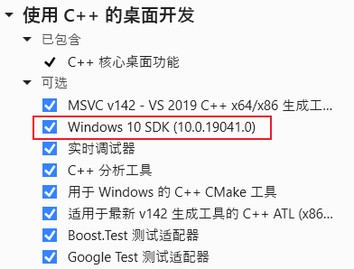
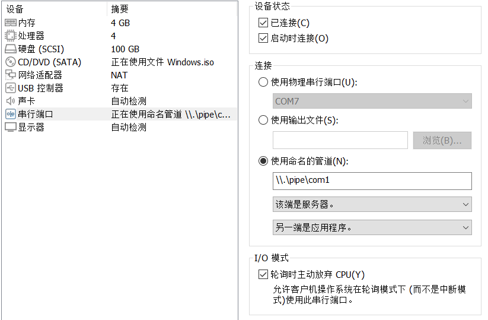
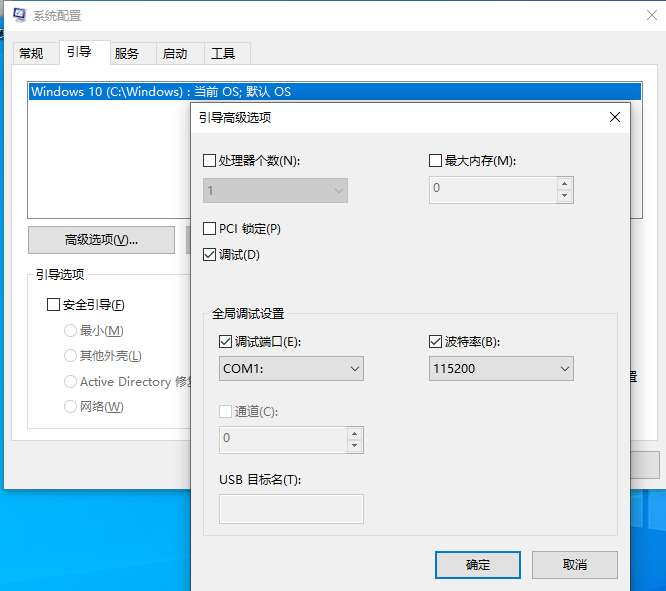
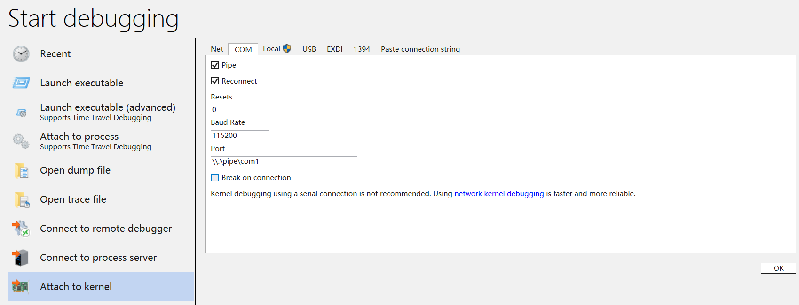
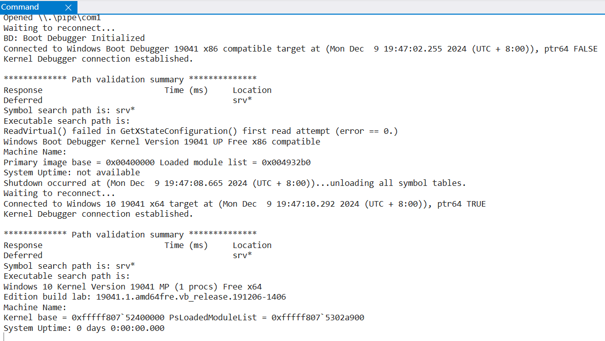
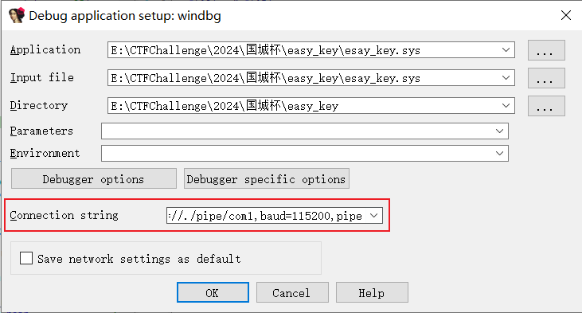

# 驱动开发

## Visual Studio环境配置

Visual Studio 安装 SDK：



然后下载对应版本的 WDK。

安装后，需要安装 Visual Studio的驱动开发插件。

## 测试用例

Visual Studio -> 新建 Empty WDM Driver


# 代码示例

```c
#include <ntddk.h>

// 全局变量定义
PDEVICE_OBJECT g_DeviceObject;
UNICODE_STRING g_DeviceName;
UNICODE_STRING g_DeviceLink;

// 创建/关闭设备派遣函数
NTSTATUS CreateCloseDispatch(
    PDEVICE_OBJECT DeviceObject,
    PIRP Irp
)
{
    Irp->IoStatus.Status = STATUS_SUCCESS;
    Irp->IoStatus.Information = 0;
    IoCompleteRequest(Irp, IO_NO_INCREMENT);
    return STATUS_SUCCESS;
}

// 驱动卸载函数
VOID UnloadDriver(PDRIVER_OBJECT DriverObject)
{
    // 删除符号链接
    IoDeleteSymbolicLink(&g_DeviceLink);
    // 删除设备对象
    IoDeleteDevice(g_DeviceObject);
}

// 驱动入口函数
NTSTATUS DriverEntry(
    PDRIVER_OBJECT DriverObject,
    PUNICODE_STRING RegistryPath
)
{
    NTSTATUS status;

    // 初始化设备名称字符串
    RtlInitUnicodeString(&g_DeviceName, L"\\Device\\MyVirtualDevice");
    // 创建设备对象
    status = IoCreateDevice(
        DriverObject,
        0,
        &g_DeviceName,
        FILE_DEVICE_UNKNOWN,
        0,
        FALSE,
        &g_DeviceObject
    );
    if (!NT_SUCCESS(status))
    {
        return status;
    }

    // 初始化符号链接字符串
    RtlInitUnicodeString(&g_DeviceLink, L"\\DosDevices\\MyVirtualDeviceLink");
    // 创建符号链接，方便用户态访问设备
    status = IoCreateSymbolicLink(&g_DeviceLink, &g_DeviceName);
    if (!NT_SUCCESS(status))
    {
        IoDeleteDevice(g_DeviceObject);
        return status;
    }

    // 设置驱动对象的各种派遣函数（这里简单初始化，实际需根据需求完善）
    DriverObject->MajorFunction[IRP_MJ_CREATE] = CreateCloseDispatch;
    DriverObject->MajorFunction[IRP_MJ_CLOSE] = CreateCloseDispatch;
    DriverObject->DriverUnload = UnloadDriver;

    return STATUS_SUCCESS;
}
```

`DriverObject->MajorFunction`是个函数指针数组，通过这个数组，可以把IRP类型和派遣函数关联起来。

IRP（I/O Request Packet，输入/输出请求包）是Windows操作系统内核中用于表示和管理I/O操作的数据结构。

对于同一设备栈中，IRP会从栈顶一直传递到栈底，且新添加的设备总是附加在设备栈的顶部，也就是说新添加的设备可以更先获取IRP。

在 Windows 驱动程序模型中，`IRP_MJ_*` 是主 I/O 请求包 (IRP) 的主要功能代码。

以下是对应的功能代码值（十六进制表示）：

| **IRP 类型**               | **值 (十六进制)** | **描述**                                            |
| -------------------------- | ----------------- | --------------------------------------------------- |
| `IRP_MJ_CREATE`            | `0x00`            | 用于创建设备（如 `CreateFile`）。                   |
| `IRP_MJ_READ`              | `0x03`            | 用于读设备（如 `ReadFile`）。                       |
| `IRP_MJ_WRITE`             | `0x04`            | 用于写设备（如 `WriteFile`）。                      |
| `IRP_MJ_QUERY_INFORMATION` | `0x05`            | 用于获取设备信息（如 `GetFileSize`）。              |
| `IRP_MJ_SET_INFORMATION`   | `0x06`            | 用于设置设备信息（如 `SetFileSize`）。              |
| `IRP_MJ_DEVICE_CONTROL`    | `0x0E`            | 用于自定义操作（如 `DeviceIoControl`）。            |
| `IRP_MJ_SYSTEM_CONTROL`    | `0x0D`            | 用于系统控制消息。                                  |
| `IRP_MJ_CLOSE`             | `0x02`            | 用于关闭设备（如 `CloseHandle`）。                  |
| `IRP_MJ_CLEANUP`           | `0x12`            | 用于清除设备资源（通常与 `CloseHandle` 一起处理）。 |
| `IRP_MJ_SHUTDOWN`          | `0x10`            | 在系统关机时发送。                                  |
| `IRP_MJ_PNP`               | `0x1B`            | 即插即用消息（仅支持 WDM 驱动）。                   |
| `IRP_MJ_POWER`             | `0x16`            | 操作系统处理电源消息时发送。                        |

# 驱动示例

## 键盘监控

[keyboard scan code表](https://blog.csdn.net/cmdasm/article/details/10168907)

# 驱动调试

## 配置双机调试

虚拟机配置添加串行端口：



管理员下，执行：

```shell
C:\Windows\system32>bcdedit /set {bootmgr} bootdebug on
操作成功完成。
C:\Windows\system32>bcdedit /set {bootmgr} debugtype serial
操作成功完成。
C:\Windows\system32>bcdedit /set {bootmgr} debugport 1
操作成功完成。
C:\Windows\system32>bcdedit /set {bootmgr} baudrate 11520
操作成功完成。
C:\Windows\system32>bcdedit /set testsigning on
操作成功完成。
C:\Windows\system32>bcdedit /enum
Windows 启动管理器
--------------------
标识符                  {bootmgr}
device                  partition=\Device\HarddiskVolume1
description             Windows Boot Manager
locale                  zh-CN
inherit                 {globalsettings}
debugtype               Serial
debugport               1
baudrate                11520
bootdebug               Yes
default                 {current}
resumeobject            {57fbc531-577e-11ee-bfa8-b64507f2ed63}
displayorder            {current}
toolsdisplayorder       {memdiag}
timeout                 30

Windows 启动加载器
-------------------
标识符                  {current}
device                  partition=C:
path                    \Windows\system32\winload.exe
description             Windows 10
locale                  zh-CN
inherit                 {bootloadersettings}
recoverysequence        {57fbc533-577e-11ee-bfa8-b64507f2ed63}
displaymessageoverride  Recovery
recoveryenabled         Yes
testsigning             Yes
allowedinmemorysettings 0x15000075
osdevice                partition=C:
systemroot              \Windows
resumeobject            {57fbc531-577e-11ee-bfa8-b64507f2ed63}
nx                      OptIn
bootmenupolicy          Standard
```

设置虚拟机系统配置：



本机使用Windbg连接：





## 配置IDA调试驱动

调试器选择Windbg dbugger。

填写`connection string`：`com:port=//./pipe/com1,baud=115200,pipe`



然后在`DriverEntry`下断点即可。

