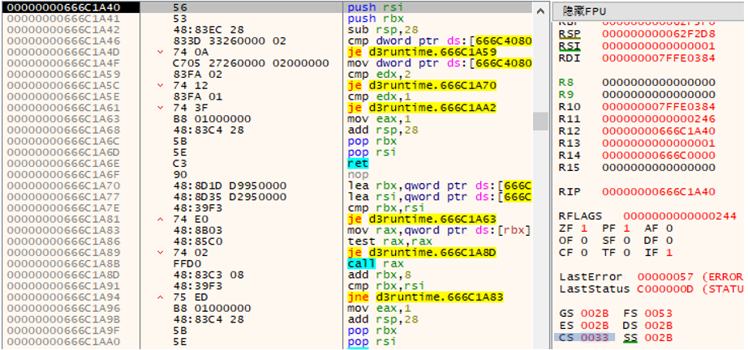
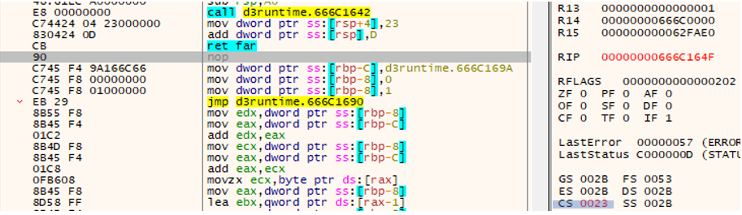
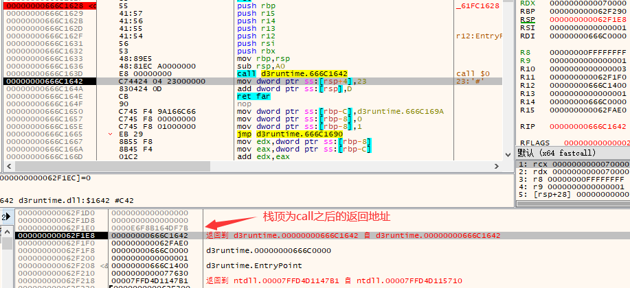
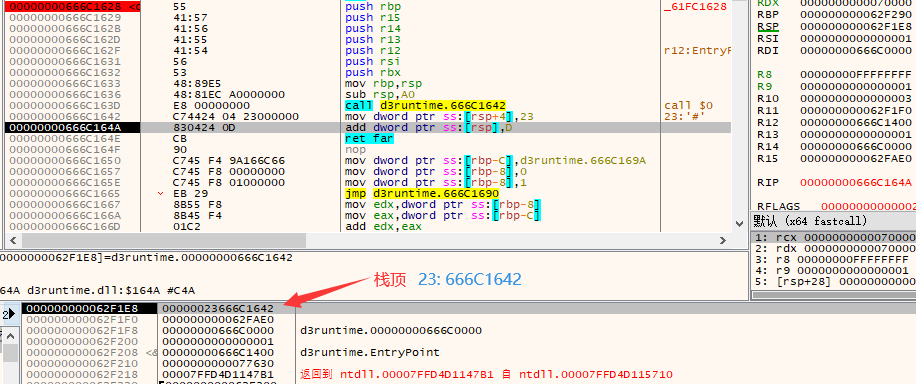
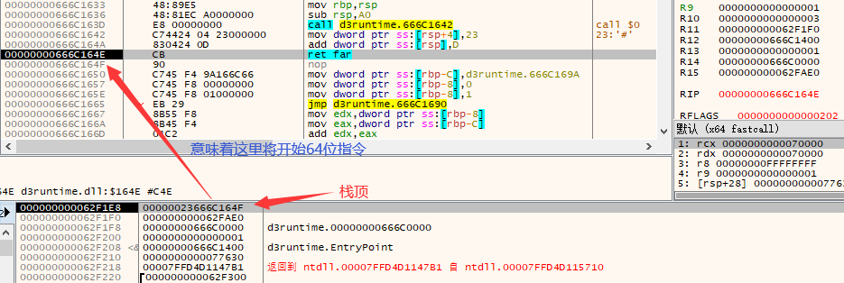
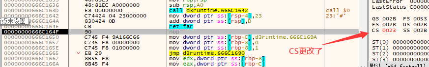
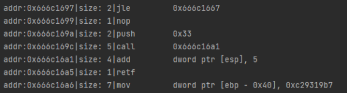

# 前言

本篇文章仅为看wp学习到的天堂之门技术做个总结。

具体学习，看看这些✌：

👉[天堂之门 (Heaven's Gate) C语言实现 | 34r7hm4n's blog (bluesadi.cn)](http://blog.bluesadi.cn:4000/2021/11/06/天堂之门-Heaven-s-Gate-C语言实现/) 👈讲得很细，看完就懂

👉[天堂之门 (Heaven's Gate) - s0rry's Blog](http://s0rry.cn/archives/tian-tang-zhi-men-heavensgate#toc-head-2)

# WoW64

WOW64（Windows-On-Windows 64bit）是X64 Windows操作系统的一个子系统，为32位应用程序提供运行环境。类似的还有WOW32子系统，负责在32位Windows系统上运行16位应用程序。

在64位系统中，32位的应用程序运行在一个WoW64的子系统中，这个子系统为32位程序提供了一个类似沙箱的运行环境。事实上这个32位程序运行的环境也是一个64位的运行环境，系统在创建32位进程时，首先创建一个64位的进程，然后再在其中创建一个32位的子环境。32位程序所调用的系统函数，最终都要通过64位的动态链接库而实现。

Winodws系统中，CS段寄存器用来标识目前所运行的代码是32位的，还是64位的。

以一个使用天堂之门的程序为例，其为64位程序。

一开始为64位模式：



切换到32位模式后：



# 天堂之门实现

## 32位和64位之间的转化

32位 → 64位：

+ 将`0x33`入栈
+ 将64位指令地址入栈
+ `retf` 远返回：先取返回地址，再取`0x33`作为CS寄存器，因此跳转的地址为`0x33:64位指令地址`

```
push 0x33
push _next_x64_code
retf
```

64位 → 32位：

+ 将`0x23`入栈
+ 将32位指令地址入栈
+ `retfq` 远返回：先取返回地址，再取`0x23`作为CS寄存器，因此跳转的地址为`0x23:32位指令地址`
  + `retq`相当于`pop ip; pop cs`
  + `retfq`是按64位进行`pop`，`retf`是按32位进行`pop`

```
push 0x23
push _nexr_x86_code
retfq
```

其实实现的方式应该并不是那么固定，虽然大差不差，比如举例的程序为64位 → 32位，其流程为：


- `call $+5`：跳到下一条指令，call指令大小为5，同时将`0x666C1642`地址入栈；
  - 
- `mov [rsp+0xA8-0xA4], 23h`：将栈顶32位数据的前八位变成0x23
  - 
- `add [rsp+0xA8-0xA8], 0Dh`：将栈顶64位数据 += 0x0D，使其retf返回地址指向`0x23:0x666C164E`
  - 
- `retf`：远返回，该指令会从栈顶取出一个返回地址，再取出一个cs段选择子，这里的CS段变成了0x23，返回地址为`0x23:0x666C164E`，然后开始以32位模式开始`0x666C164E`处的指令
  - 

它32位 → 64位就更差不多了：

将`push 返回地址`拆成`call + add`。



## 代码实现

实现步骤：

1. 实现模式的切换
2. 代码（可以是仅指令代码，也可以是调用相对应位数的函数，但这会麻烦一些）
3. 切换回原来的模式

字节码与汇编的转换可以通过`keystone`和`capstone`获取。

这一部分就没有实践了，看看各位✌的代码：

以下是[32位下可运行的64位memcpy函数](http://blog.bluesadi.cn:4000/2021/11/06/天堂之门-Heaven-s-Gate-C语言实现/)：

> ```c
> void memcpy64(uint64_t dst, uint64_t src, uint64_t sz) {
> 	static uint8_t code[] = {
> 		/*	[bits 32]
> 			push 0x33
> 			push _next_x64_code
> 			retf
> 		*/
> 		0x6A, 0x33, 0x68, 0x78, 0x56, 0x34, 0x12, 0xCB,
> 		/*	[bits 64]
> 			push rsi
> 			push rdi
> 			mov rsi, src
> 			mov rdi, dst
> 			mov rcx, sz
> 			rep movsb
> 			pop rsi
> 			pop rdi
> 		*/
> 		0x56, 0x57,
> 		0x48, 0xBE, 0x88, 0x77, 0x66, 0x55, 0x44, 0x33, 0x22, 0x11,
> 		0x48, 0xBF, 0x88, 0x77, 0x66, 0x55, 0x44, 0x33, 0x22, 0x11,
> 		0x48, 0xB9, 0x88, 0x77, 0x66, 0x55, 0x44, 0x33, 0x22, 0x11,
> 		0xF3, 0xA4,
> 		0x5E, 0x5F,
> 		/*	[bits 64]
> 			push 0x23
> 			push _next_x86_code
> 			retfq
> 		*/
> 		0x6A, 0x23, 0x68, 0x78, 0x56, 0x34, 0x12, 0x48, 0xCB,
> 		/*	[bits 32]
> 			ret
> 		*/
> 		0xC3
> 	};
> 
> 	static uint32_t ptr = NULL;
> 	if (!ptr) {
> 		ptr = (uint32_t)VirtualAlloc(NULL, sizeof(code), MEM_COMMIT | MEM_RESERVE, PAGE_EXECUTE_READWRITE);
> 		for (int i = 0; i < sizeof(code); i++) ((PBYTE)ptr)[i] = code[i];
> 	}
> 	*(uint32_t*)(ptr + 3) = ptr + 8;
> 	*(uint64_t*)(ptr + 12) = src;
> 	*(uint64_t*)(ptr + 22) = dst;
> 	*(uint64_t*)(ptr + 32) = sz;
> 	*(uint32_t*)(ptr + 47) = ptr + 53;
> 	((void(*)())ptr)();
> }
> ```
