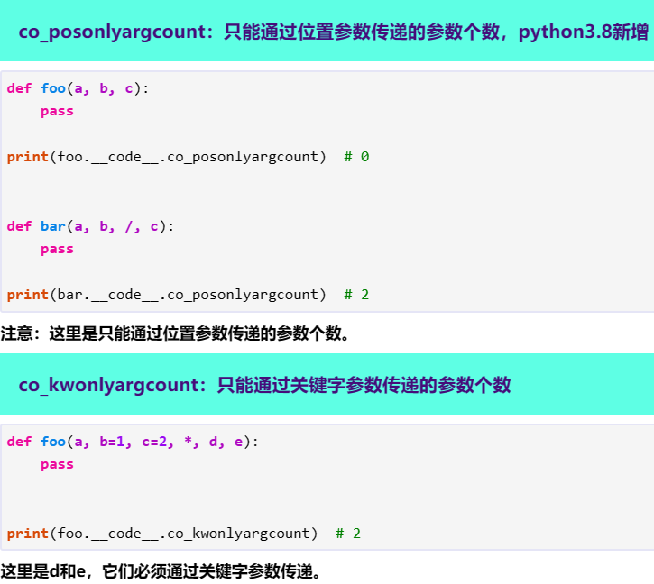
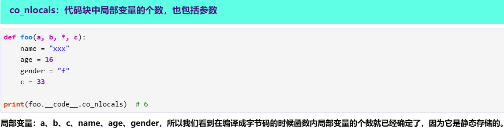
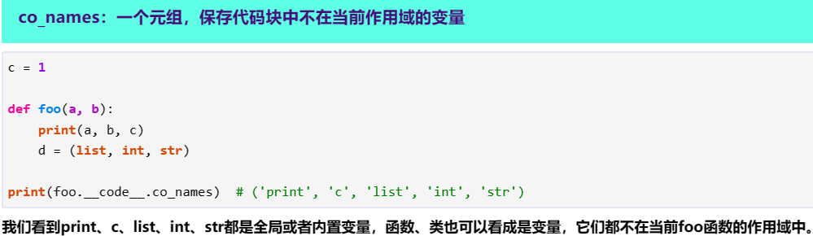
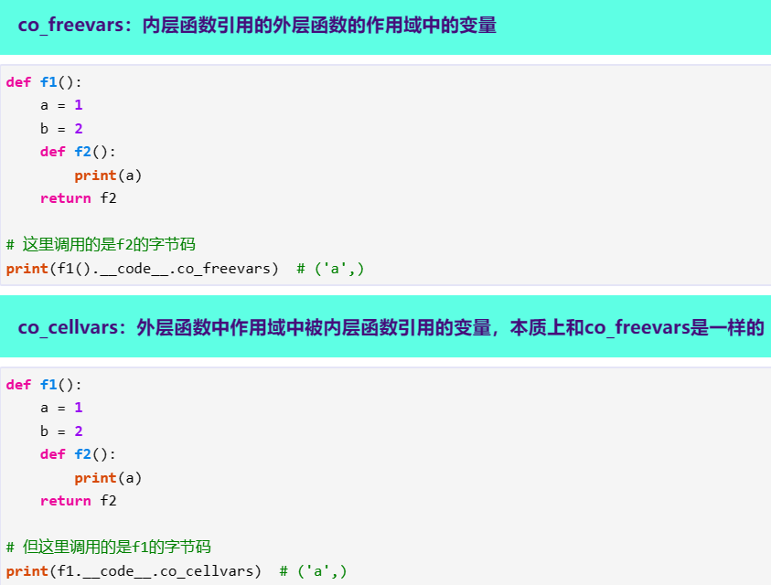
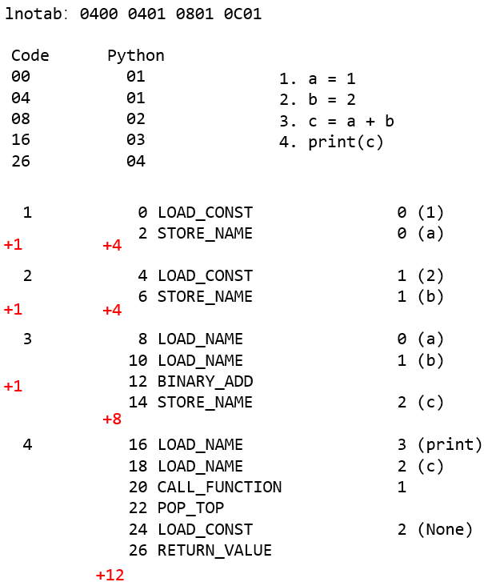
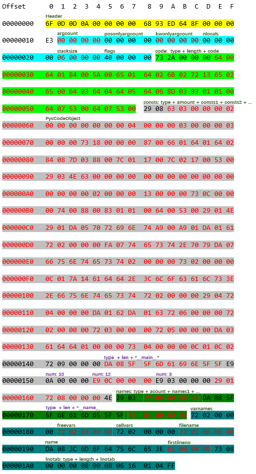
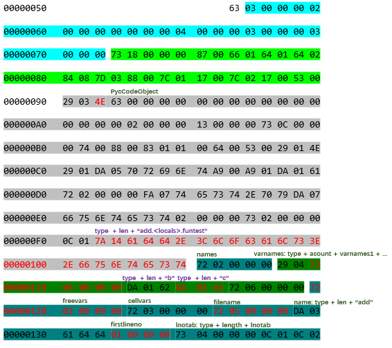
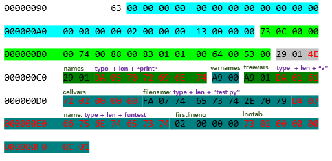

# PyCodeObject

```C
typedef struct {
    PyObject_HEAD		/* 头部信息, 我们看到真的一切皆对象, 字节码也是个对象 */	
    int co_argcount;            /* 可以通过位置参数传递的参数个数 */
    int co_posonlyargcount;     /* 只能通过位置参数传递的参数个数,  Python3.8新增 */
    int co_kwonlyargcount;      /* 只能通过关键字参数传递的参数个数 */
    int co_nlocals;             /* 代码块中局部变量的个数，也包括参数 */
    int co_stacksize;           /* 执行该段代码块需要的栈空间 */
    int co_flags;               /* 参数类型标识 */
    int co_firstlineno;         /* 代码块在对应文件的行号 */
    PyObject *co_code;          /* 指令集, 也就是字节码, 它是一个bytes对象 */
    PyObject *co_consts;        /* 常量池, 一个元组，保存代码块中的所有常量。 */
    PyObject *co_names;         /* 一个元组,保存代码块中引用的其它作用域的变量 */
    PyObject *co_varnames;      /* 一个元组,保存当前作用域中的变量 */
    PyObject *co_freevars;      /* 内层函数引用的外层函数的作用域中的变量 */
    PyObject *co_cellvars;      /* 外层函数中作用域中被内层函数引用的变量，本质上和co_freevars是一样的 */
    Py_ssize_t *co_cell2arg;    /* 无需关注 */
    PyObject *co_filename;      /* 代码块所在的文件名 */
    PyObject *co_name;          /* 代码块的名字，通常是函数名或者类名 */
    PyObject *co_lnotab;        /* 字节码指令与python源代码的行号之间的对应关系，以PyByteObject的形式存在 */
    void *co_zombieframe;       /* for optimization only (see frameobject.c) */
    PyObject *co_weakreflist;   /* to support weakrefs to code objects */
    void *co_extra;
    unsigned char *co_opcache_map;
    _PyOpcache *co_opcache;
    int co_opcache_flag; 
    unsigned char co_opcache_size; 
} PyCodeObject;
```

在Python中通过`PyObject.__code__.xxx`获取。

## 部分解释

### posonlyargcount、kwonlyargcount



### nlocals



### names



### freevars、cellvars



### lnotab

[svn.python.org/projects/python/branches/pep-0384/Objects/lnotab_notes.txt](https://svn.python.org/projects/python/branches/pep-0384/Objects/lnotab_notes.txt)

> co_lnotab: 字节码指令与python源代码的行号之间的对应关系，以PyByteObject的形式存在
>
> 然而事实上，Python不会直接记录这些信息，而是会记录增量值。
>
> 比如说： 
>
> 字节码在co_code中的偏移量            .py文件中源代码的行号 
>
> 0                                                         1   
>
> 6                                                         2 
>
> 50                                                       7 
>
> 那么co_lnotab就应该是: 0 1 6 1 44 5。
>
> 0和1很好理解, 就是co_code和.py文件的起始位置，而6和1表示字节码的偏移量是6，.py文件的行号增加了1，而44和5表示字节码的偏移量是44，.py文件的行号增加了5



# Code字节码

具体可在pycdc/bytes/python_310.map中（mingw64\opt\include\python2.7\opcode.h也有）：

```
0x1 POP_TOP
0x2 ROT_TWO
0x3 ROT_THREE
0x4 DUP_TOP
0x5 DUP_TOP_TWO
0x6 ROT_FOUR
0x9 NOP
0xa UNARY_POSITIVE
0xb UNARY_NEGATIVE
0xc UNARY_NOT
0xf UNARY_INVERT
0x10 BINARY_MATRIX_MULTIPLY
0x11 INPLACE_MATRIX_MULTIPLY
0x13 BINARY_POWER
0x14 BINARY_MULTIPLY
0x16 BINARY_MODULO
0x17 BINARY_ADD
0x18 BINARY_SUBTRACT
0x19 BINARY_SUBSCR
0x1a BINARY_FLOOR_DIVIDE
0x1b BINARY_TRUE_DIVIDE
0x1c INPLACE_FLOOR_DIVIDE
0x1d INPLACE_TRUE_DIVIDE
0x1e GET_LEN
0x1f MATCH_MAPPING
0x20 MATCH_SEQUENCE
0x21 MATCH_KEYS
0x22 COPY_DICT_WITHOUT_KEYS
0x31 WITH_EXCEPT_START
0x32 GET_AITER
0x33 GET_ANEXT
0x34 BEFORE_ASYNC_WITH
0x36 END_ASYNC_FOR
0x37 INPLACE_ADD
0x38 INPLACE_SUBTRACT
0x39 INPLACE_MULTIPLY
0x3b INPLACE_MODULO
0x3c STORE_SUBSCR
0x3d DELETE_SUBSCR
0x3e BINARY_LSHIFT
0x3f BINARY_RSHIFT
0x40 BINARY_AND
0x41 BINARY_XOR
0x42 BINARY_OR
0x43 INPLACE_POWER
0x44 GET_ITER
0x45 GET_YIELD_FROM_ITER
0x46 PRINT_EXPR
0x47 LOAD_BUILD_CLASS
0x48 YIELD_FROM
0x49 GET_AWAITABLE
0x4a LOAD_ASSERTION_ERROR
0x4b INPLACE_LSHIFT
0x4c INPLACE_RSHIFT
0x4d INPLACE_AND
0x4e INPLACE_XOR
0x4f INPLACE_OR
0x52 LIST_TO_TUPLE
0x53 RETURN_VALUE
0x54 IMPORT_STAR
0x55 SETUP_ANNOTATIONS
0x56 YIELD_VALUE
0x57 POP_BLOCK
0x59 POP_EXCEPT
0x5a STORE_NAME
0x5b DELETE_NAME
0x5c UNPACK_SEQUENCE
0x5d FOR_ITER
0x5e UNPACK_EX
0x5f STORE_ATTR
0x60 DELETE_ATTR
0x61 STORE_GLOBAL
0x62 DELETE_GLOBAL
0x63 ROT_N
0x64 LOAD_CONST
0x65 LOAD_NAME
0x66 BUILD_TUPLE
0x67 BUILD_LIST
0x68 BUILD_SET
0x69 BUILD_MAP
0x6a LOAD_ATTR
0x6b COMPARE_OP
0x6c IMPORT_NAME
0x6d IMPORT_FROM
0x6e JUMP_FORWARD
0x6f JUMP_IF_FALSE_OR_POP
0x70 JUMP_IF_TRUE_OR_POP
0x71 JUMP_ABSOLUTE
0x72 POP_JUMP_IF_FALSE
0x73 POP_JUMP_IF_TRUE
0x74 LOAD_GLOBAL
0x75 IS_OP
0x76 CONTAINS_OP
0x77 RERAISE
0x79 JUMP_IF_NOT_EXC_MATCH
0x7a SETUP_FINALLY
0x7c LOAD_FAST
0x7d STORE_FAST
0x7e DELETE_FAST
0x81 GEN_START
0x82 RAISE_VARARGS
0x83 CALL_FUNCTION
0x84 MAKE_FUNCTION
0x85 BUILD_SLICE
0x87 LOAD_CLOSURE
0x88 LOAD_DEREF
0x89 STORE_DEREF
0x8a DELETE_DEREF
0x8d CALL_FUNCTION_KW
0x8e CALL_FUNCTION_EX
0x8f SETUP_WITH
0x90 EXTENDED_ARG
0x91 LIST_APPEND
0x92 SET_ADD
0x93 MAP_ADD
0x94 LOAD_CLASSDEREF
0x98 MATCH_CLASS
0x9a SETUP_ASYNC_WITH
0x9b FORMAT_VALUE
0x9c BUILD_CONST_KEY_MAP
0x9d BUILD_STRING
0xa0 LOAD_METHOD
0xa1 CALL_METHOD
0xa2 LIST_EXTEND
0xa3 SET_UPDATE
0xa4 DICT_MERGE
0xa5 DICT_UPDATE
```

或者执行脚本获得：

```python
import opcode
for i in opcode.opmap:
    print(hex(opcode.opmap[i]), i)
```


# 对象类型

具体可在pycdc/PythonBytecode.txt中：

```
                       3.0     3.4
TYPE_NULL               '0'     '0'
TYPE_NONE               'N'     'N'
TYPE_FALSE              'F'     'F'
TYPE_TRUE               'T'     'T'
TYPE_STOPITER           'S'     'S'
TYPE_ELLIPSIS           '.'     '.'
TYPE_INT                'i'     'i'
TYPE_INT64              'I'
TYPE_FLOAT              'f'     'f'
TYPE_BINARY_FLOAT       'g'     'g'
TYPE_COMPLEX            'x'     'x'
TYPE_BINARY_COMPLEX     'y'     'y'
TYPE_LONG               'l'     'l'
TYPE_STRING             's'     's'
TYPE_INTERNED                   't'
TYPE_REF                        'r'
TYPE_TUPLE              '('     '('
TYPE_LIST               '['     '['
TYPE_DICT               '{'     '{'
TYPE_CODE               'c'     'c'
TYPE_UNICODE            'u'     'u'
TYPE_UNKNOWN            '?'     '?'
TYPE_SET                '<'     '<'
TYPE_FROZENSET          '>'     '>'
TYPE_ASCII                      'a'
TYPE_ASCII_INTERNED             'A'
TYPE_SMALL_TUPLE                ')'
TYPE_SHORT_ASCII                'z'
TYPE_SHORT_ASCII_INTERNED       'Z'
```

pyc文件中每个类型的对象都有着固定的形式：

1. 数值类型：type（1 byte）+ num
   1. `E9 0A 00 00 00`：10
   2. `69 11 01 00 00`：111
   3. `67 a4 70 3d 0a d7 a3 0a 40`：3.33 （[IEEE 754 浮点数转化](https://www.toolhelper.cn/Digit/FractionConvert)）
   4. 大于0x80000000的数，type为0x6C。
      1. `6C 03 00 00 00 90 78 AC 68 48 00`：0x1234567890
      2. `6C 03 00 00 00 00 00 00 00 02 00`：0x80000000
2. 字符串类型：type（1 byte）+ 长度（1 byte）+ string
   1. `DA 05 70 72 69 6E 74`：“print”
   2. `FA 07 74 65 73 74 2E 70 79`：“test.py”
   3. `7a 10 74 68 69 73 20 69 73 20 73 74 72 20 74 79 70 65`：“this is str type”
   4. `5a 03 61 67 65 `：“age”
3. 元组（tuple）**0x29**：type（1 byte）+ 元素数量（1 byte）+ 元素
   1. `29 + 03 + a + b + c`：（a，b，c）
4. 集合（set）：type（1 byte）+ 元素数量（1 byte）+ 元素
   1. `3e 03 00 00 00 + a + b + c`：{a，b，c}
5. 字典（dict）：
   1. `5a 05 41 6c 69 63 65 + e9 1e 00 00 00 + 29 02 + da 04 6e 61 6d 65 + 5a 03 61 67 65 `：{'name': 'Alice', 'age': 30}
6. 代码（code）**0x73**：type（1 byte）+ 长度（4 byte）+ code
7. `72 + xx xx xx xx`：获取已声明的对象
   1. 若`72 05 00 00 00`，则获取已声明的第五个对象（从先到后）
8. `TYPE_NONE = 0x4E; TYPE_FALSE = 0x46; TYPE_TRUE = 0x54`
9. `73 04 00 00 00 0C 01 0C 02`：lnotab: type + length +lnotab

# 具体pyc文件

分析一下python代码的pyc文件。

```python
def add(a, b, /, c):
    def funtest():
        print(a)
    return a + b + c


if __name__ == '__main__':
    print(add(10, 12, c=3))
```

pyc文件对象：



add函数对象：



funtest函数对象：



其中，按先后顺序声明的对象为：

```
1. “printf”
2. A9 00 (应该是类似null，其他对象为空的属性都是：72 02 00 00 00)
3. (“a”, )
4. “a”
5. “test.py”
6. “funtest”
7. “b”
8. “c”
9. “add”
10. “__main__”
11. 10
12. 12
13. 3
14. “__name__”
```

解析的脚本：

```python
import marshal
import dis
import struct
import time
import types
import binascii


def print_metadata(fp):
    magic = struct.unpack('<l', fp.read(4))[0]
    print(f"magic number = {hex(magic)}")
    bit_field = struct.unpack('<l', fp.read(4))[0]
    print(f"bit filed = {bit_field}")
    t = struct.unpack('<l', fp.read(4))[0]
    print(f"time = {time.asctime(time.localtime(t))}")
    file_size = struct.unpack('<l', fp.read(4))[0]
    print(f"file size = {file_size}")


def show_code(code, indent=''):
    print("%scode" % indent)
    indent += '   '
    print("%sargcount %d" % (indent, code.co_argcount))
    print("%sposonlyargcount %d" % (indent, code.co_posonlyargcount))
    print("%skwonlyargcount %d" % (indent, code.co_kwonlyargcount))
    print("%snlocals %d" % (indent, code.co_nlocals))
    print("%sstacksize %d" % (indent, code.co_stacksize))
    print("%sflags %04x" % (indent, code.co_flags))
    show_hex("code", code.co_code, indent=indent)
    dis.disassemble(code)
    print("%sconsts" % indent)
    for const in code.co_consts:
        if type(const) == types.CodeType:
            show_code(const, indent + '   ')
            continue
        else:
            print("   %s%r" % (indent, const))
    print("%snames %r" % (indent, code.co_names))
    print("%svarnames %r" % (indent, code.co_varnames))
    print("%sfreevars %r" % (indent, code.co_freevars))
    print("%scellvars %r" % (indent, code.co_cellvars))
    print("%sfilename %r" % (indent, code.co_filename))
    print("%sname %r" % (indent, code.co_name))
    print("%sfirstlineno %d" % (indent, code.co_firstlineno))
    show_hex("lnotab", code.co_lnotab, indent=indent)


def show_hex(label, h, indent):
    h = binascii.hexlify(h)
    if len(h) < 60:
        print("%s%s %s" % (indent, label, h))
    else:
        print("%s%s" % (indent, label))
        for i in range(0, len(h), 60):
            print("%s   %s" % (indent, h[i:i + 60]))


if __name__ == '__main__':
    filename = "PYC解析/__pycache__/rev_RightBack.pyc"
    with open(filename, "rb") as fp:
        print_metadata(fp)
        code_object = marshal.load(fp)
        show_code(code_object)
```


# 参考

[《深度剖析CPython解释器》10. Python中的PyCodeObject对象与pyc文件 - 古明地盆 - 博客园 (cnblogs.com)](https://www.cnblogs.com/traditional/p/13507329.html)