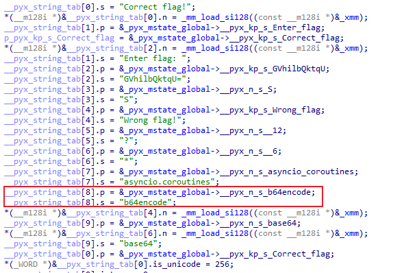
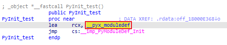
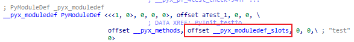
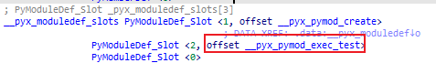
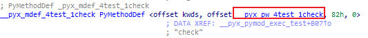
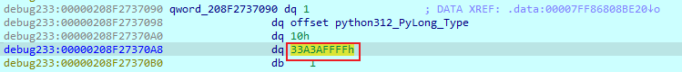

pyd 文件是编译生成的 Python 扩展模块，是类似 so、dll 的一种 Python 文件。

pyd 文件无法像 pyc文件那样恢复源码，只能通过逆向手段去恢复逻辑。

# 理解pyd文件

## 编译pyd

自己编译一个 pyd 保留符号来看。

`test.py`：

```python
import base64

key = [ord(i) for i in "key"]
res = "GVhilbQktqU="

def check(flag):
    if len(flag) != 16:
        return False
    flag = int(flag, 16)
    flag = flag.to_bytes(8, 'big')
    flag = encrypt(flag, key)
    flag = base64.b64encode(bytes(flag)).decode()
    if flag == res:
        return True
    return False

def encrypt(ptext, key):
    S = list(range(256))
    j = 0
    out = []
    for i in range(256):
        j = (j + S[i] + key[i % len(key)]) % 256
        S[i], S[j] = S[j], S[i]
    i = j = 0
    for t in ptext:
        i = (i + 1) % 256
        j = (j + S[i]) % 256
        S[i], S[j] = S[j], S[i]
        out.append(t ^ S[(S[i] + S[j]) % 256])
    return out

def logic():
    flag = input("Enter flag: ")
    if check(flag):
        print("Correct flag!")
    else:
        print("Wrong flag!")

__test__ = {}
```

`setup.py`：

```python
from setuptools import setup, Extension
from Cython.Build import cythonize

ext_modules = [
    Extension(
        name = "test",
        sources = ["test.py"],
        extra_compile_args = ["/Zi"],
        extra_link_args = ["/DEBUG"]
    )
]

setup(
    name = "test",
    ext_modules = cythonize(ext_modules, annotate=True),
)
```

编译：`python .\setup.py build_ext --inplace`

在当前目录就会生成 pyd 和对应的 pcb。

## 分析pyd

### 全局变量与常量

在分析 pyd 逻辑之前，需要关注这几个函数（全局变量相关）：

1. `__Pyx_CreateStringTabAndInitStrings`
2. `__Pyx_InitCachedBuiltins`
3. `__Pyx_InitCachedConstants`
4. `__Pyx_InitConstants`
5. `__Pyx_InitGlobals`
6. `PyInit_test`

这些函数会设置一些全局变量、常量在 `_pyx_mstate_global`。

#### __Pyx_CreateStringTabAndInitStrings

这里设置了字符串：

1. 程序逻辑本身的字符串；
2. 变量名；
3. 模块属性；



一般特征为 `_pyx_mstate_global->__pyx_n_s_ + 字符串` 为获取目标字符串。

通过其实现字符串的使用、变量的获取、属性的获取。

#### __Pyx_InitCachedBuiltins

这里获取了程序逻辑会用到的 python 自带的函数：

```c
v6 = _Pyx_PyObject_GetAttrStrNoError(_pyx_mstate_global->__pyx_b, pyx_n_s_input);
_pyx_builtin_input = v6;
```

#### __Pyx_InitConstants

设置一些常数，程序要使用时直接 `_pyx_mstate_global->__pyx_int_value`。

```c
v0 = (_object *)PyLong_FromLong(0LL);
_pyx_mstate_global->__pyx_int_0 = v0;
v1 = (_object *)PyLong_FromLong(1LL);
_pyx_mstate_global->__pyx_int_1 = v1;
v2 = (_object *)PyLong_FromLong(8LL);
_pyx_mstate_global->__pyx_int_8 = v2;
```

#### __Pyx_InitCachedConstants

同样设置了一些常数，但更多的好像是 `tuple`，方便了函数传参。

```c
v0 = (_object *)PyTuple_Pack(2LL, _pyx_mstate_global->__pyx_int_8, _pyx_mstate_global->__pyx_n_s_big);
_pyx_mstate_global->__pyx_tuple_ = v0;
```

#### PyInit_test

通过一路跳转找到 `__pyx_pymod_exec_test`。







这里会进行一些初始化（库的导入、全局变量初始化...）。

在 `_pyx_mstate_global->__pyx_d` 创建了一个空的字典，以便全局变量的读取：

```c
Dict = PyModule_GetDict();
_pyx_mstate_global->__pyx_d = (_object *)Dict;
```

一些常量的设置：

```c
v26 = (_object *)PyLong_FromLong(256LL)
v27 = _pyx_mstate_global
_pyx_mstate_global->__pyx_int_256 = v26
```

设置 `builtins` 的一些 python 自带函数：

```c
v7 = (_object *)PyImport_AddModule("builtins");
_pyx_mstate_global->__pyx_b = v7;
pyx_n_s_input = _pyx_mstate_global->__pyx_n_s_input;
_pyx_builtin_input = v33;
```

导入 `base64` 库：

```c
pyx_n_s_base64 = _pyx_mstate_global->__pyx_n_s_base64;
Module = (_object *)PyImport_GetModule(pyx_n_s_base64);
p_ob_refcnt = &Module->ob_refcnt;
PyDict_SetItem(_pyx_mstate_global->__pyx_d, _pyx_mstate_global->__pyx_n_s_base64, p_ob_refcnt)
```

生成 `key` 的操作：`key = [ord(i) for i in "key"]`

```c
p_ob_refcnt = (_QWORD *)PyList_New(0LL);
Iter = PyObject_GetIter(_pyx_mstate_global->__pyx_n_s_key);
v2 = (_QWORD *)Iter;
v46 = *(__int64 (__fastcall **)(_QWORD *))(*(_QWORD *)(Iter + 8) + 224LL);
while (1) {
    v47 = (_object *)v46(v2);
    v3 = v47;
    if ( !v47 )
      break;
    v50 = _pyx_7genexpr__pyx_v_4test_i;
    v51 = v47;
    _pyx_7genexpr__pyx_v_4test_i = v47;
    ob_refcnt_low = LOBYTE(v51[2].ob_refcnt);
    v59 = (_object *)PyLong_FromLong(ob_refcnt_low);
    PyList_Append(p_ob_refcnt, v59);
}
PyDict_SetItem(_pyx_mstate_global->__pyx_d, _pyx_mstate_global->__pyx_n_s_key, p_ob_refcnt);
```

设置 `res = "GVhilbQktqU="`：

```c
PyDict_SetItem(
    _pyx_mstate_global->__pyx_d,
    _pyx_mstate_global->__pyx_n_s_res,
    _pyx_mstate_global->__pyx_kp_s_GVhilbQktqU
)
```

设置 `check` 函数：

```c
v66 = _Pyx_CyFunction_New(
    &_pyx_mdef_4test_1check,
    v64,
    _pyx_mstate_global->__pyx_n_s_check,
    v65,
    _pyx_mstate_global->__pyx_n_s_test,
    _pyx_mstate_global->__pyx_d,
    _pyx_mstate_global->__pyx_codeobj__8
);
PyDict_SetItem(_pyx_mstate_global->__pyx_d, _pyx_mstate_global->__pyx_n_s_check, v66)
```

通过 `_pyx_mdef_4test_1check`找到 `_pyx_pw_4test_1check`：



`_pyx_pw_4test_1check` 会调用 `_pyx_pf_4test_check`。

`_pyx_pf_4test_check` 是 `check` 的函数逻辑。

### 分析逻辑

通过上面的铺垫，现在开始分析一下测试的三个函数。

#### logic

通过以下三个函数的片段可知，程序逻辑：`flag = input("Enter flag: ")`

```c
_Pyx_CreateStringTabAndInitStrings:
__pyx_string_tab[1].p = &_pyx_mstate_global->__pyx_kp_s_Enter_flag;
__pyx_string_tab[1].s = "Enter flag: ";

_Pyx_InitCachedConstants:
v6 = (_object *)PyTuple_Pack(1LL, v5->__pyx_kp_s_Enter_flag, v4);
v8 = _pyx_mstate_global;
_pyx_mstate_global->__pyx_tuple__3 = v6;

_pyx_pf_4test_4logic:
v5 = _Pyx_PyObject_Call(_pyx_builtin_input, _pyx_mstate_global->__pyx_tuple__3, a3);
```

执行调用 `check(flag)`：

```c
pyx_n_s_check = _pyx_mstate_global->__pyx_n_s_check;
AttrStrNoError = (_object *)_PyDict_GetItem_KnownHash(
    _pyx_mstate_global->__pyx_d,
    pyx_n_s_check,
    pyx_n_s_check[1].ob_type
);
v13 = _pyx_mstate_global->__pyx_d;
__pyx_callargs[1] = v6;
v20 = _Pyx_PyObject_FastCallDict(AttrStrNoError, &__pyx_callargs[-v16 + 1], (unsigned int)(v16 + 1), pyx_d);
```

判断 `check` 结果：

```python
if check(flag):
        print("Correct flag!")
    else:
        print("Wrong flag!")
```

```c
IsTrue = v20 == (_object *)_Py_TrueStruct;
if ( IsTrue )
{
    v24 = _Pyx_PyObject_Call(_pyx_builtin_print, _pyx_mstate_global->__pyx_tuple__4, v21);
}
else
{
    v24 = _Pyx_PyObject_Call(_pyx_builtin_print, _pyx_mstate_global->__pyx_tuple__5, v21);
}
```

#### check

`if len(flag) != 16: return False`

```c
_object *__fastcall _pyx_pf_4test_check(_object *__pyx_v_flag, _object *__pyx_self) {
    v3 = PyObject_Size(__pyx_self);
    if ( v3 != 16 )
        goto LABEL_4;
    ...
}
```

`flag = int(flag, 16)`：

```c
v8 = (_object *)PyTuple_New(2LL, v4);
++v2->ob_refcnt;
v11 = _pyx_mstate_global;
v8[1].ob_type = (_typeobject *)v2;
++v11->__pyx_int_16->ob_refcnt;
v8[2].ob_refcnt = (__int64)v11->__pyx_int_16;
v12 = _Pyx_PyObject_Call(PyLong_Type, v8, v9);
```

`flag = flag.to_bytes(8, 'big')`：

```c
_Pyx_InitCachedConstants:
v0 = (_object *)PyTuple_Pack(2LL, _pyx_mstate_global->__pyx_int_8, _pyx_mstate_global->__pyx_n_s_big);
_pyx_mstate_global->__pyx_tuple_ = v0;

_pyx_pf_4test_check:
Attr = (_object *)PyObject_GetAttr(v12, pyx_n_s_to_bytes);
v19 = _Pyx_PyObject_Call(Attr, _pyx_mstate_global->__pyx_tuple_, v18);
```

`flag = encrypt(flag, key)`：

```c
v24 = _pyx_mstate_global->__pyx_n_s_encrypt;
Item_KnownHash = (_object *)_PyDict_GetItem_KnownHash(_pyx_mstate_global->__pyx_d, v24, v24[1].ob_type);
AttrStrNoError = Item_KnownHash;
v30 = v21->__pyx_n_s_key;
BuiltinName = (_object *)_PyDict_GetItem_KnownHash(v21->__pyx_d, v30, v30[1].ob_type);
pyx_d = _pyx_mstate_global->__pyx_d;
_pyx_dict_version = (unsigned __int64)_pyx_mstate_global->__pyx_d[1].ob_type;
_pyx_dict_cached_value = BuiltinName;
v33 = 0;
__pyx_callargs[0] = p_ob_base;
__pyx_callargs[1] = v19;
__pyx_callargs[2] = BuiltinName;
v36 = _Pyx_PyObject_FastCallDict(AttrStrNoError, &__pyx_callargs[-v33 + 1], (unsigned int)(v33 + 2), v20);
```

`flag = base64.b64encode(bytes(flag)).decode()`：

```c
v42 = _pyx_mstate_global->__pyx_n_s_base64;
v43 = (_object *)_PyDict_GetItem_KnownHash(_pyx_mstate_global->__pyx_d, v42, v42[1].ob_type);
AttrStrNoError = v43;
pyx_n_s_b64encode = v39->__pyx_n_s_b64encode;v47 = PyObject_GetAttr(AttrStrNoError, pyx_n_s_b64encode);
v49 = (_object *)v47;
v52 = 0LL;
v53 = 0;
args[1] = v52;
v74 = v50;
AttrStrNoError = _Pyx_PyObject_FastCallDict(v49, &__pyx_callargs[-v53 - 1], (unsigned int)(v53 + 1), v51);
pyx_n_s_decode = _pyx_mstate_global->__pyx_n_s_decode;
v58 = PyObject_GetAttr(AttrStrNoError, pyx_n_s_decode);
v49 = (_object *)v58;
v65 = _Pyx_PyObject_FastCallDict(v49, &args[-v61], v62, v59);
```

`if flag == res: return True`

`else: return False`

```c
v2 = v65;
v69 = _pyx_mstate_global->__pyx_n_s_res;
AttrStrNoError = (_object *)_PyDict_GetItem_KnownHash(_pyx_mstate_global->__pyx_d, v69, v69[1].ob_type);
v49 = (_object *)PyObject_RichCompare(v2, AttrStrNoError, 2LL);
IsTrue = _Pyx_PyObject_IsTrue(v49);
if ( !IsTrue )
{
    LABEL_4:
    v5 = ++_Py_FalseStruct;
    goto LABEL_157;
}
v5 = ++_Py_TrueStruct;
LABEL_157:
return (_object *)v5;
```

#### encrypt

`S = list(range(256))`：

```c
v9 = _Pyx_PyObject_Call(
    _pyx_builtin_range, 
    _pyx_mstate_global->__pyx_tuple__2, 
    __pyx_self
);
pyx_int_1 = (_object *)PySequence_List(v9);
```


```python
j = 0
out = []
for i in range(256):
        j = (j + S[i] + key[i % len(key)]) % 256
        S[i], S[j] = S[j], S[i]
```

```c
v13 = pyx_int_1;
obj = pyx_int_1;
pyx_int_0 = v16->__pyx_int_0;
v17 = PyList_New(0LL);
v64 = (_QWORD *)v17;
for ( i = 0; i < 256; ++i )
{
    v19 = PyLong_FromLong((unsigned int)i);
    v20 = (_object *)v19;
    v6 = v19;
    Item = _Pyx_PyObject_GetItem(v13, v20);
    pyx_int_1 = Item;
    v9 = (_object *)PyNumber_Add(pyx_int_0, Item);
    v23 = PyObject_Size(__pyx_self);
    v24 = PyLong_FromSsize_t(v23);
    pyx_int_1 = (_object *)v24;
    v4 = (_object *)PyNumber_Remainder(v6, v24);
    pyx_int_1 = _Pyx_PyObject_GetItem(__pyx_self, v4);
    v4 = (_object *)PyNumber_Add(v9, pyx_int_1);
    v27 = _Pyx_PyInt_RemainderObjC(v4, _pyx_mstate_global->__pyx_int_256, v25, v26, v61);
    pyx_int_1 = _Pyx_PyObject_GetItem(obj, v27);
    v4 = _Pyx_PyObject_GetItem(obj, (_object *)v6);
    PyObject_SetItem(obj, v6, pyx_int_1);
    PyObject_SetItem(obj, pyx_int_0, v4);
}
```


```python
for t in ptext:
    i = (i + 1) % 256
    j = (j + S[i]) % 256
    S[i], S[j] = S[j], S[i]
    out.append(t ^ S[(S[i] + S[j]) % 256])
```

```c
v32 = _pyx_mstate_global;
v33 = (_QWORD *)v6;
v6 = (__int64)v32->__pyx_int_0;
v34 = _pyx_mstate_global;
v35 = v34->__pyx_int_0;
Iter = PyObject_GetIter(__pyx_v_key);
v39 = *(__int64 (__fastcall **)(_QWORD))(*(_QWORD *)(Iter + 8) + 224LL);
v66 = v39;
while ( 2 ) {
    if ( !v39 ) {
        pyx_int_1 = _pyx_mstate_global->__pyx_int_1;
        v44 = *(_object **)(v6 + 8);
        v48 = _Pyx_PyInt_RemainderObjC(pyx_int_1, _pyx_mstate_global->__pyx_int_256, v30, v31, v61);
        v50 = _Pyx_PyObject_GetItem(obj, v48);pyx_int_1 = (_object *)PyNumber_Add(pyx_int_0, v50);
        v53 = _Pyx_PyInt_RemainderObjC(pyx_int_1, _pyx_mstate_global->__pyx_int_256, v51, v52, v62);
        pyx_int_0 = v53;
        v55 = v53;
        v9 = _Pyx_PyObject_GetItem(obj, v53);
        pyx_int_1 = _Pyx_PyObject_GetItem(obj, (_object *)v6);
        PyObject_SetItem(obj, v6, v9);
        PyObject_SetItem(obj, v55, pyx_int_1);
        pyx_int_1 = _Pyx_PyObject_GetItem(obj, (_object *)v6);
        v56 = _Pyx_PyObject_GetItem(obj, v55);
        v5 = (_object *)PyNumber_Add(pyx_int_1, v56);
        v9 = _Pyx_PyInt_RemainderObjC(v5, _pyx_mstate_global->__pyx_int_256, v57, v58, v63);
        v5 = _Pyx_PyObject_GetItem(obj, v9);
        v9 = (_object *)PyNumber_Xor(v65, v5);
        PyList_Append(v64, v9);
    }
}
```

## 调试pyd

通过以下代码调用 pyd：

```python
import rand0m
import os
# 使用pid，attach该进程
print(f"Process ID: {os.getpid()}")
r = rand0m.rand0m("12345678")
```

在 `rand0m.rand0m` 处下断点，使用IDE进行调试。

IDA attach 该进程即可。

注意：pyd 逻辑中使用的数据是 Python 的 Type。



# 实践分析

这里用 ciscb ccb 比赛的 Cython 题目进行实践。

exe 解包后，反编译 pyc 得到源码：

```python
import ez
flag = input()
flag1 = list(flag)
value = []
b = 0
ck = 0
if len(flag1) == 24:
    for i in range(0, len(flag1), 4):
        b = (ord(flag1[i]) << 16) | (ord(flag1[i + 1]) << 8) | ord(flag1[i + 2]) | ord(flag1[i + 3])
        value.append(b)

    key = [102, 108, 97, 103]
    flag_encrypt = []

    for i in range(0, 6, 2):
        print(f"{value[i]:x} {value[i + 1]:x}")
        res = ez.encrypt(value[i], value[i + 1], key)
        flag_encrypt.append(res)

    ck = ez.check(flag_encrypt)
    if ck == 3:
        print('yes!!!,you get right flag')
    else:
        print('wrong!!!')
else:
    print('wrong!!!')
```

主要逻辑在 `ez.pyd`，但这加密方式一眼 tea。

bindiff 用 `test.pyd`恢复符号，对着看去分析。

根据 `ez.encrypt` 字符串来找引用函数，一般是第二个。

分析代码如下（省略一些不影响逻辑分析的）：

```c
__int64 __fastcall _pyx_pf_4test_2encrypt(
    __int64 a1, __int64 arg_v0, __int64 arg_v1, __int64 arg_key
){
    v12 = pyx_mstate_global->__pyx_n_s_c_uint32_; // c_uint32
    AttrStrNoError = (_QWORD *)PyDict_GetItem_KnownHash(pyx_mstate_global->__pyx_d, v12, v12[1].ob_type);
    v13 = 0;
    v102[0] = arg_v0;
    BuiltinName = (_QWORD *)_Pyx_PyObject_FastCallDict((__int64)AttrStrNoError, &v102[-v13], (unsigned int)(v13 + 1));
    
    v21 = pyx_mstate_global->__pyx_n_s_c_uint32_;
    Item_KnownHash = (_QWORD *)PyDict_GetItem_KnownHash(pyx_mstate_global->__pyx_d, v21, v21[1].ob_type);
    v102[1] = Item;
    v103[0] = arg_v1;
    AttrStrNoError = (_QWORD *)_Pyx_PyObject_FastCallDict((__int64)Item_KnownHash, &v103[-v22], (unsigned int)(v22 + 1));
    
    v29 = v25->__pyx_n_s_c_uint32_;
    v30 = (_QWORD *)PyDict_GetItem_KnownHash(v25->__pyx_d, v29, v29[1].ob_type);
    v25 = pyx_mstate_global;
    BuiltinName = v30;
    pyx_int_0 = v25->__pyx_int_0;
    v103[1] = (__int64)v31;
    v101 = _Pyx_PyObject_FastCallDict((__int64)BuiltinName, &pyx_int_0 - v32, v32 + 1);
    v35 = (_QWORD *)v101;
    AttrStrNoError = (_QWORD *)v101;
    v99 = pyx_int_1415865428;
    v105 = 0;
    v18 = 11;
    do
    {
        pyx_n_s_value = pyx_mstate_global->__pyx_n_s_value;
        Attr = PyObject_GetAttr(Item_KnownHash, pyx_n_s_value);
        AttrStrNoError = (_QWORD *)Attr;
        v42 = pyx_mstate_global->__pyx_n_s_value;
        v44 = PyObject_GetAttr(v26, v42);
        BuiltinName = (_QWORD *)v44;
        Item_KnownHash = (_QWORD *)_Pyx_PyInt_LshiftObjC(v44, pyx_mstate_global->__pyx_int_value_3);
        
        v45 = pyx_mstate_global->__pyx_n_s_value;
        v46 = *(__int64 (__fastcall **)(_QWORD *, _object *))(v26[1] + 144i64);
        v47 = PyObject_GetAttr(v26, v45);
        BuiltinName = (_QWORD *)v47;
        Item = _Pyx_PyInt_RshiftObjC(v47, pyx_mstate_global->__pyx_int_value_6, 6i64);
        
        BuiltinName = (_QWORD *)PyNumber_Xor(Item_KnownHash, Item);
        
        v48 = pyx_mstate_global->__pyx_n_s_value;
        v49 = *(__int64 (__fastcall **)(_QWORD *, _object *))(v26[1] + 144i64);
        v50 = PyObject_GetAttr(v26, v48);
        Item = v50;
        Item_KnownHash = (_QWORD *)PyNumber_Add(BuiltinName, v50);
        
        v51 = pyx_mstate_global->__pyx_n_s_value;
        v53 = PyObject_GetAttr(v101, v51);
        v54 = pyx_mstate_global->__pyx_n_s_value;
        v56 = PyObject_GetAttr(v101, v54);
        v58 = PyNumber_And(v56, pyx_mstate_global->__pyx_int_value_3);
        v5 = (_QWORD *)v58;
        BuiltinName = (_QWORD *)_Pyx_PyObject_GetItem(arg_key, v5);
        v5 = (_QWORD *)PyNumber_Add(Item, BuiltinName);
        
        BuiltinName = (_QWORD *)PyNumber_Xor(Item_KnownHash, v5);
        
        v5 = (_QWORD *)PyNumber_InPlaceAdd(AttrStrNoError, BuiltinName);
        
        v59 = pyx_mstate_global->__pyx_n_s_value;
        v61 = PyObject_SetAttr(v98, v59, v5);
        v62 = pyx_mstate_global->__pyx_n_s_value;
        v64 = PyObject_GetAttr(v101, v62);
        BuiltinName = (_QWORD *)PyNumber_InPlaceAdd(v64, v99);
        v67 = PyObject_SetAttr(v101, v65, BuiltinName);
        
        
        v68 = pyx_mstate_global->__pyx_n_s_value;
        v70 = PyObject_GetAttr(v26, v68);
        BuiltinName = (_QWORD *)v70;
        v71 = pyx_mstate_global->__pyx_n_s_value;
        v73 = PyObject_GetAttr(v98, v71);
        AttrStrNoError = (_QWORD *)_Pyx_PyInt_LshiftObjC(v73, pyx_mstate_global->__pyx_int_value_3);
        
        v74 = pyx_mstate_global->__pyx_n_s_value;
        v76 = PyObject_GetAttr(v98, v74);
        Item_KnownHash = (_QWORD *)_Pyx_PyInt_RshiftObjC(v76, pyx_mstate_global->__pyx_int_value_6, 6i64);
        v5 = (_QWORD *)PyNumber_Xor(AttrStrNoError, Item_KnownHash);
        
        v77 = pyx_mstate_global->__pyx_n_s_value;
        v79 = PyObject_GetAttr(v98, v77);
        Item_KnownHash = (_QWORD *)v79;
        AttrStrNoError = (_QWORD *)PyNumber_Add(v5, v79);
        v80 = pyx_mstate_global->__pyx_n_s_value;
        v82 = PyObject_GetAttr(v101, v80);
        Item_KnownHash = (_QWORD *)v82;
        v83 = pyx_mstate_global->__pyx_n_s_value;
        v85 = PyObject_GetAttr(v101, v83);
        Item = _Pyx_PyInt_RshiftObjC(v85, pyx_mstate_global->__pyx_int_4, 11i64);
        v87 = PyNumber_And(Item, pyx_mstate_global->__pyx_int_value_3);
        Item = _Pyx_PyObject_GetItem(arg_key, v5);
        v5 = (_QWORD *)PyNumber_Add(Item_KnownHash, Item);
        Item = PyNumber_Xor(AttrStrNoError, v5);
        v5 = (_QWORD *)PyNumber_InPlaceAdd(BuiltinName, Item);
        v88 = pyx_mstate_global->__pyx_n_s_value;
        v90 = PyObject_SetAttr(v26, v88, v5);
        Item_KnownHash = v98;
        ++v105;
    }
    while ( v105 < 64 );
    v91 = pyx_mstate_global->__pyx_n_s_value;
    v93 = PyObject_GetAttr(v98, v91);
    v94 = pyx_mstate_global->__pyx_n_s_value;
    v96 = PyObject_GetAttr(v26, v94);
    Item = v96;
    v97 = PyTuple_New(2i64);
    *(_QWORD *)(v97 + 24) = v5;
    *(_QWORD *)(v97 + 32) = Item;
    return v37;
}
```

还原 python 代码：

```python
def encrypt(v0, v1, key):
    v0 = ctypes.c_uint32(v0)
    v1 = ctypes.c_uint32(v1)
    num = ctypes.c_uint32(0)

    for i in range(64):
        t1 = v1.value + (v1.value  << 3 ^ v1.value >> 6)
        t2 = num.value + key[num.value & 3]
        t3 = t1 ^ t2
        v0.value = v0.value + t3
        num.value = num.value + 1415865428
        t1 = v0.value + (v0.value << 3 ^ v0.value >> 6)
        t2 = num.value + key[num.value >> 11 & 3]
        t3 = t1 ^ t2
        v1.value = v1.value + t3
    return v0.value, v1.value
```

还有一个 `ez.check`，直接使用了 `ez.data` 与加密结果进行比较。

因此直接解密：

```python
def decrypt(v0, v1, key):
    num = 0
    delta = 0x54646454
    for i in range(64):
        num += delta
        num = num & 0xFFFFFFFF

    for i in range(64):
        t1 = (v0 + ((v0 << 3) ^ (v0 >> 6))) & 0xFFFFFFFF
        t2 = (num + key[(num >> 11) & 3]) & 0xFFFFFFFF
        t3 = t1 ^ t2
        v1 = v1 - t3
        v1 &= 0xFFFFFFFF
        num = num - delta
        num = num & 0xFFFFFFFF
        t1 = (v1 + ((v1 << 3) ^ (v1 >> 6))) & 0xFFFFFFFF
        t2 = (num + key[num & 3]) & 0xFFFFFFFF
        t3 = t1 ^ t2
        v0 = v0 - t3
        v0 &= 0xFFFFFFFF
    return v0, v1

key = [102, 108, 97, 103]
result = [2129084917, 4147024244, 2971480309, 1606961219, 710575902, 4012634395]
flag = []
for i in range(3):
    v0, v1 = result[i * 2], result[i * 2 + 1]
    flag += decrypt(v0, v1, key)
flag_str = ""
for i in flag:
    flag_str += i.to_bytes(4, "big").decode()
print(flag_str)
```

