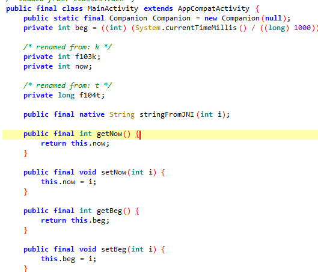
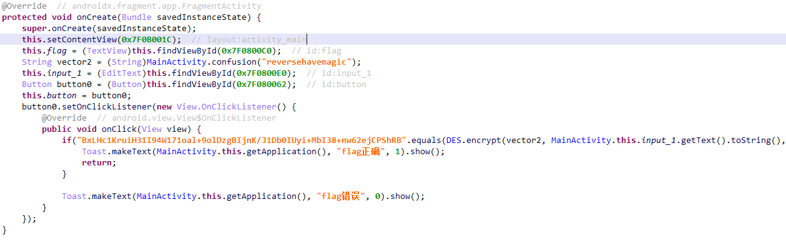
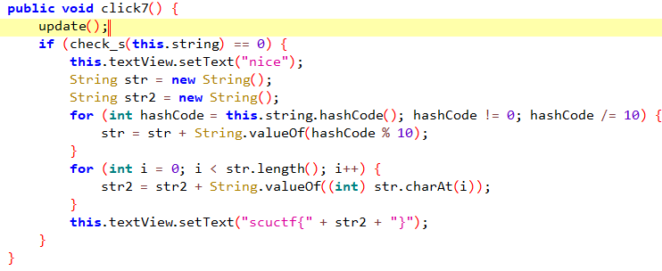
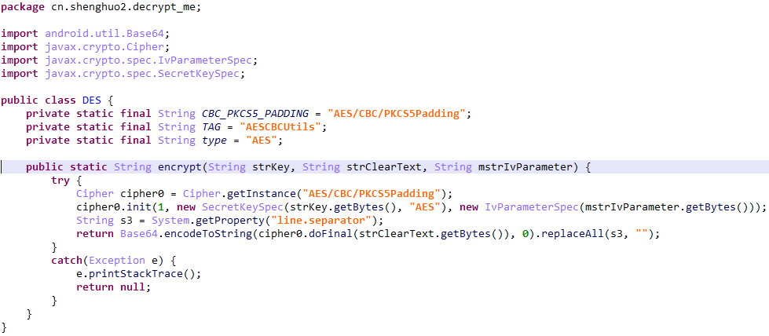
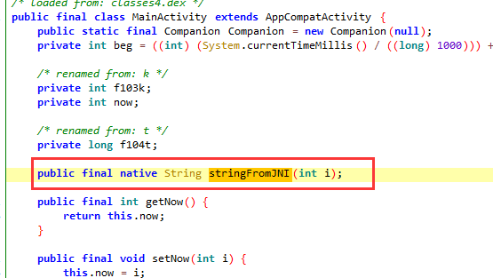

# 使用

执行模拟器中的`frida-server`，然后adb端口转发，与ida的dbgserver类似。

`adb forward tcp:27042 tcp:27042`

`adb forward tcp:27043 tcp:27043`

## 命令

1. 查看设备的进程：`frida-ps -U`
   1. 加上 `-a` 可以查看进程的`identifier`

2. 

## 执行脚本

### 命令行方式

`frida -U 包名 -l frida脚本`

`frida -U -f com.feifei.babyandroid -l .\hook.js`

`-f`: 使用spawn的方式启动脚本，无该参数则以attach的方式。

若要hook的函数是在`onCreate`等中，所以app刚启动就自动检查，则需要用spawn的方式去启动frida脚本hook，而不是attach。


### Python脚本方式

```python
import frida  #导入frida模块
import sys    #导入sys模块

jscode = """  #从此处开始定义用来Hook的javascript代码
    Java.perform(function(){  
        var MainActivity = Java.use('com.example.testfrida.MainActivity'); //获得MainActivity类
        MainActivity.testFrida.implementation = function(){ //Hook testFrida函数，用js自己实现
            send('Statr! Hook!'); //发送信息，用于回调python中的函数
            return 'Change String!' //劫持返回值，修改为我们想要返回的字符串
        }
    });
"""

def on_message(message,data): #js中执行send函数后要回调的函数
    print(message)

process = frida.get_remote_device().attach('com.example.testfrida') #得到设备并劫持进程com.example.testfrida（该开始用get_usb_device函数用来获取设备，但是一直报错找不到设备，改用get_remote_device函数即可解决这个问题）
script = process.create_script(jscode) #创建js脚本
script.on('message',on_message) #加载回调函数，也就是js中执行send函数规定要执行的python函数
script.load() #加载脚本
sys.stdin.read()
```

# frida hook

## 静态函数

直接use class然后调用方法，非静态函数需要先choose实例然后调用

```js
Java.perform(function () {
        console.log("start")
        var FridaActivity2 = Java.use("com.example.androiddemo.Activity.FridaActivity2")
        //hook静态函数直接调用
        FridaActivity2.setStatic_bool_var()
        //hook动态函数，找到instance实例，从实例调用函数方法
        Java.choose("com.example.androiddemo.Activity.FridaActivity2", {
            onMatch: function (instance) {
                instance.setBool_var()
            },
            onComplete: function () {
                console.log("end")
            }
        })
    })
```

### hook 动态方法



```js
Java.perform(function () {
    console.log("start");
    var Main = Java.use("com.galaxylab.countdown");
    Main.getBeg.implementation = function () {
        var ret = this.getBeg();
        console.log("getBeg:", ret);
        return ret;
    }
})
```

### hook APK的方法

以之前的题目为例：



可以直接hook `equal()`，从而使无论输入什么都是flag正确。

#### 脚本

```javascript
Java.perform(() => {
    const stringClass = Java.use('java.lang.String')
    stringClass.equals.overload('java.lang.Object').implementation = function (p1) {
        if (this == "BxLHc1KruiH31I94W171oal+9olDzgBIjnK/J1Db0IUyi+MbI38+nw62ejCPShRB") {
            console.log("change!!!!")
            return true
        }
        return this.equals(p1)
    }
})
```

#### 命令

`frida -U -f cn.shenghuo2.decrypt_me -l .\NKCTF\try_decrypt_me\hook.js`

## hook .so的函数

还是以一道题目为例，hook这里的check_s函数，打印出第2、3个参数：



### 脚本

获取参数，并替换返回值：

```javascript
Java.perform(function(){
     //下面这一句代码是指定要Hook的so文件名和要Hook的函数名，函数名就是上面IDA导出表中显示的那个函数名
     Interceptor.attach(Module.findExportByName("libcheck.so","Java_com_example_check_MainActivity_check_1s"),{
         //onEnter: function(args)顾名思义就是进入该函数前要执行的代码，其中args是传入的参数，一般so层函数第一个参数都是JniEnv，第二个参数是jclass，从第三个参数开始才是我们java层传入的参数
         onEnter: function(args) {
             send("Hook start");
             send("args[2]=" + args[2]); //打印我们java层第一个传入的参数
             send("args[3]=" + args[3]); //打印我们java层传入的第二个参数
         },
         onLeave: function(retval){ //onLeave: function(retval)是该函数执行结束要执行的代码，其中retval参数即是返回值
             send("return:"+retval); //打印返回值
             retval.replace(0); //替换返回值为0
         }
     });
 });
```

## 脚本

### 替换string类型返回值

```js
Java.perform(function(){
    Interceptor.attach(Module.findExportByName("libfridaso.so","Java_com_example_fridasostring_fridaSoString_FridaSo"),{
        onEnter: function(args) {
            send("Hook start");
            send("args[2]=" + args[2]);
        },
        onLeave: function(retval){
            send("return:"+retval);
            var env = Java.vm.getEnv(); //获取env对象，也就是native函数的第一个参数
            var jstrings = env.newStringUtf("tamper"); //因为返回的是字符串指针，使用我们需要构造一个newStringUtf对象，用来代替这个指针
            retval.replace(jstrings); //替换返回值
        }
    });
});
```

### 动态修改

目标代码，修改其可以使用admin：

```java
public class MainActivity extends AppCompatActivity {

    EditText username_et;
    EditText password_et;
    TextView message_tv;

    @Override
    protected void onCreate(Bundle savedInstanceState) {
        super.onCreate(savedInstanceState);
        setContentView(R.layout.activity_main);

        password_et = (EditText) this.findViewById(R.id.editText2);
        username_et = (EditText) this.findViewById(R.id.editText);
        message_tv = ((TextView) findViewById(R.id.textView));

        this.findViewById(R.id.button).setOnClickListener(new View.OnClickListener() {
            @Override
            public void onClick(View v) {

                if (username_et.getText().toString().compareTo("admin") == 0) {
                    message_tv.setText("You cannot login as admin");
                    return;
                }
                //hook target
                message_tv.setText("Sending to the server :" + Base64.encodeToString((username_et.getText().toString() + ":" + password_et.getText().toString()).getBytes(), Base64.DEFAULT));

            }
        });

    }
}
```

frida代码：

```js
console.log("Script loaded successfully ");
Java.perform(function () {
    var tv_class = Java.use("android.widget.TextView");
    tv_class.setText.overload("java.lang.CharSequence").implementation = function (x) {
        var string_to_send = x.toString();
        var string_to_recv;
        send(string_to_send); // send data to python code
        recv(function (received_json_object) {
            string_to_recv = received_json_object.my_data
            console.log("string_to_recv: " + string_to_recv);
        }).wait(); //block execution till the message is received
        var my_string = Java.use("java.lang.String").$new(string_to_recv);
        this.setText(my_string);
    }
});
```

python使用脚本：

```python
import time
import frida
import base64

def my_message_handler(message, payload):
    print(message)
    print(payload)
    if message["type"] == "send":
        print(message["payload"])
        data = message["payload"].split(":")[1].strip()
        print( 'message:', message)
        #data = data.decode("base64")
        #data = data
        data = str(base64.b64decode(data))
        print( 'data:',data)
        user, pw = data.split(":")
        print( 'pw:',pw)
        #data = ("admin" + ":" + pw).encode("base64")
        data = str(base64.b64encode(("admin" + ":" + pw).encode()))
        print( "encoded data:", data)
        script.post({"my_data": data})  # send JSON object
        print( "Modified data sent")

device = frida.get_usb_device()
pid = device.spawn(["myapplication.example.com.frida_demo"])
device.resume(pid)
time.sleep(1)
session = device.attach(pid)
with open("frida_demo2.js") as f:
    script = session.create_script(f.read())
script.on("message", my_message_handler)
script.load()
input()
```

### 爆破

```js
function main() {
    Java.perform(function x() {
        console.log("In Java perform")
        var verify = Java.use("org.teamsik.ahe17.qualification.Verifier")
        var stringClass = Java.use("java.lang.String")
        var p = stringClass.$new("09042ec2c2c08c4cbece042681caf1d13984f24a")
        var pSign = p.getBytes()
        // var pStr = stringClass.$new(pSign)
        // console.log(parseInt(pStr))
        for (var i = 999; i < 10000; i++){
            var v = stringClass.$new(String(i))
            var vSign = verify.encodePassword(v)
            if (parseInt(stringClass.$new(pSign)) == parseInt(stringClass.$new(vSign))) {
                console.log("yes: " + v)
                break
            }
            console.log("not :" + v)
        }
    })
}
setImmediate(main)
```

### 目标函数是动态加载进来的

```js
package com.example.androiddemo.Dynamic;

public interface CheckInterface {
    boolean check();
}
...

public class DynamicCheck implements CheckInterface {
    public boolean check() {
        return false;
    }
}
...
public class FridaActivity5 extends BaseFridaActivity {
    private CheckInterface DynamicDexCheck = null;
    ...
    public CheckInterface getDynamicDexCheck() {
        if (this.DynamicDexCheck == null) {
            loaddex();
        }
        return this.DynamicDexCheck;
    }

    /* access modifiers changed from: protected */
    public void onCreate(Bundle bundle) {
        super.onCreate(bundle);
        loaddex();
    }

    public void onCheck() {
        if (getDynamicDexCheck() == null) {
            Toast.makeText(this, "onClick loaddex Failed!", 1).show();
        } else if (getDynamicDexCheck().check()) {
            CheckSuccess();
            startActivity(new Intent(this, FridaActivity6.class));
            finishActivity(0);
        } else {
            super.CheckFailed();
        }
    }
}
```

frida代码：

> 这里有个loaddex其实就是先从资源文件加载classloader到内存里，再loadClass DynamicCheck，创建出一个实例，最终调用这个实例的check。
> 所以就要先枚举class loader，找到能实例化我们要的class的那个class loader，然后把它设置成Java的默认class factory的loader。现在就可以用这个class loader来使用`.use`去import一个给定的类。

```js
function ch5() {
    Java.perform(function () {
        // Java.choose("com.example.androiddemo.Activity.FridaActivity5",{
        //     onMatch:function(x){
        //         console.log(x.getDynamicDexCheck().$className)
        //     },onComplete:function(){}
        // })
        console.log("start")
        Java.enumerateClassLoaders({
            onMatch: function (loader) {
                try {
                    if(loader.findClass("com.example.androiddemo.Dynamic.DynamicCheck")){
                        console.log("Successfully found loader")
                        console.log(loader);
                        Java.classFactory.loader = loader ;
                    }
                }
                catch(error){
                    console.log("find error:" + error)
                }
            },
            onComplete: function () {
                console.log("end1")
            }
        })
        Java.use("com.example.androiddemo.Dynamic.DynamicCheck").check.implementation = function () {
            return true
        }
        console.log("end2")
    })
}
setImmediate(ch5)
```

### 枚举

```js
function ch6() {
    Java.perform(function () {
        Java.enumerateLoadedClasses({
            onMatch: function (name, handle){
                if (name.indexOf("com.example.androiddemo.Activity.Frida6") != -1) {
                    console.log("name:" + name + " handle:" + handle)
                    Java.use(name).check.implementation = function () {
                        return true
                    }
                }
            },
            onComplete: function () {
                console.log("end")
            }
        })
    })
}
```

### 获取Native函数

```js
function hook_RegisterNatives() {
    var symbols = Process.getModuleByName('libart.so').enumerateSymbols();
    var RegisterNatives_addr = null;
    for (let i = 0; i < symbols.length; i++) {
        var symbol = symbols[i];
        if (symbol.name.indexOf("RegisterNatives") != -1 && symbol.name.indexOf("CheckJNI") == -1) {
            RegisterNatives_addr = symbol.address;
        }
    }
    console.log("RegisterNatives_addr: ", RegisterNatives_addr);
    Interceptor.attach(RegisterNatives_addr, {
        onEnter: function (args) {
            var env = Java.vm.tryGetEnv();
            var className = env.getClassName(args[1]);
            var methodCount = args[3].toInt32();
            for (let i = 0; i < methodCount; i++) {
                var methodName = args[2].add(Process.pointerSize * 3 * i).add(Process.pointerSize * 0).readPointer().readCString();
                var signature = args[2].add(Process.pointerSize * 3 * i).add(Process.pointerSize * 1).readPointer().readCString();
                var fnPtr =
                    args[2].add(Process.pointerSize * 3 * i).add(Process.pointerSize * 2).readPointer();
                var module = Process.findModuleByAddress(fnPtr);
                console.log(className, methodName, signature, fnPtr, module.name, fnPtr.sub(module.base));
            }

        }, onLeave: function (retval) {
        }
    })
}
// [Android Emulator 5554::com.feifei.babyandroid ]-> RegisterNatives_addr:  0x7fff72318190
// com.feifei.babyandroid.MainActivity check2 ([B[B)Z 0x7fff580eabf0 libbabyandroid.so 0xbf0
```


# frida 调用

## 例子1

要调用以下的加密函数：



```javascript
Java.perform(() => {
    const encClass = Java.use('cn.shenghuo2.decrypt_me.DES')
    const stringClass = Java.use('java.lang.String')
    let encObject = encClass.$new()
    console.log(encObject.encrypt(stringClass.$new("reversehavemagic"), 
                                stringClass.$new('123456'), 
                                stringClass.$new("r3v3rs3car3fully")))
})
```

## 例子2



```js
Java.perform(function () {
    console.log("start");
    var Main = Java.use("com.galaxylab.countdown");
    let test = Main.$new();
    console.log(test.stringFromJNI(208462));
})
```

# objection

1. 启动并注入内存：`objection -d -g package_name explore`

2. 可直接 `objection run xxx`方式使用

3. 列举：

   1. 列举so文件：`memory list modules`

   2. 列举so文件导出方法：`memory list exports libA3AEECD8.so`

   3. 将结果写入文件中：`memory list exports libA3AEECD8.so --json /root/test.json`

   4. 查找可以hook的类：`android hooking list classes`

   5. 查找带关键词的类：`android hooking search classes display`

   6. 查看对应类有哪些方法：

      `android hooking list class_methods com.android.settings.DisplaySettings`

   7. 生成hook类的代码
      `android hooking generate simple `

   8. hook 类的所有方法
      `android hooking watch class d.d.a.g.c`
      `android hooking watch class_method com.xxx.xxx.setUrl --dump-args --dump-return`

   9. 帮助类：

      `help `
      `android hooking watch class`

   10. 禁用sslpinning：`android sslpinning disable`

   11. 搜索类的实列
       `android heap search instances com.example.httptest.MainActivity
       `android heap execute 0x1fc6 getMethod`

   12. 搜索activties
       `android hooking list activities`
       `android intent launch_activity com.example.httptest.MainActivity`

4. 内存搜索/修改：

   1. `memory search "64 65 78 0a 30 33 35 00"`
   2. `memory search "99999999999" --string`
   3. `memory write 0x130b4060 "99999999999" --string`

5. dump（默认在C:\Users\hahbiubiubiu下）

   1. `memory dump all 文件名`
   2. `memory dump from_base 起始地址 字节数 文件名`

6. hook

   1. `android hooking watch class 类名`
      这样就可以hook这个类里面的所有方法，每次调用都会被log出来。

   2. `android hooking watch class 类名 --dump-args --dump-backtrace --dump-return`

      在上面的基础上，额外dump参数，栈回溯，返回值

      `android hooking watch class xxx.MainActivity --dump-args --dump-backtrace --dump-return`

   3. `android hooking watch class_method 方法名`

      可以直接hook到所有重载
      `android hooking watch class_method xxx.MainActivity.fun --dump-args --dump-backtrace --dump-return`

# 参考

[Frida Android hook | Sakuraのblog (eternalsakura13.com)](https://eternalsakura13.com/2020/07/04/frida/)

