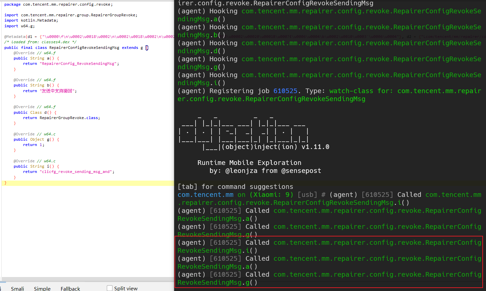
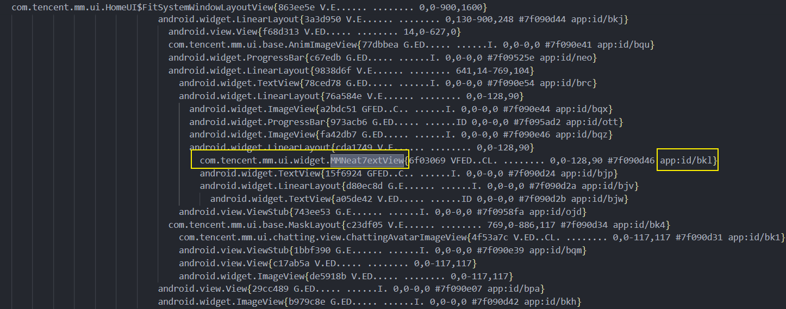
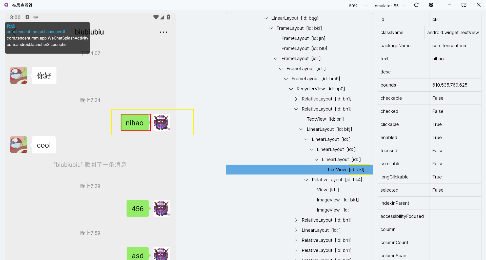
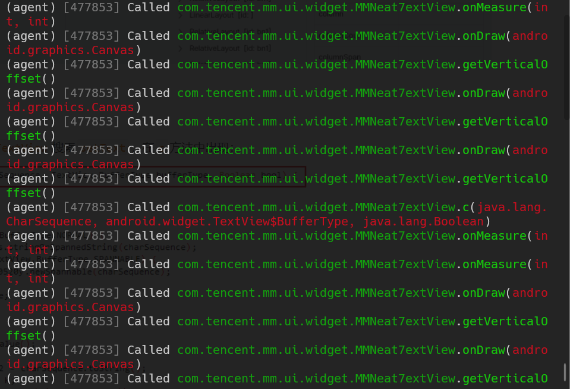
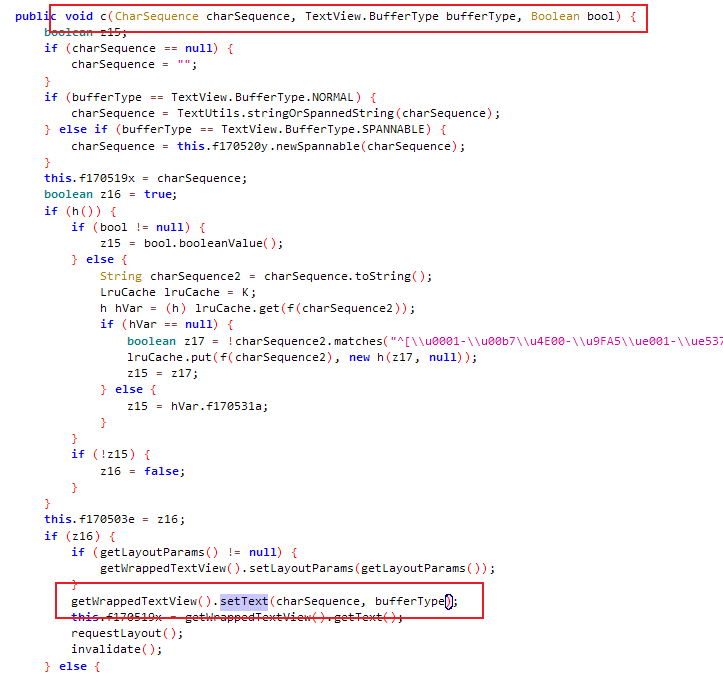
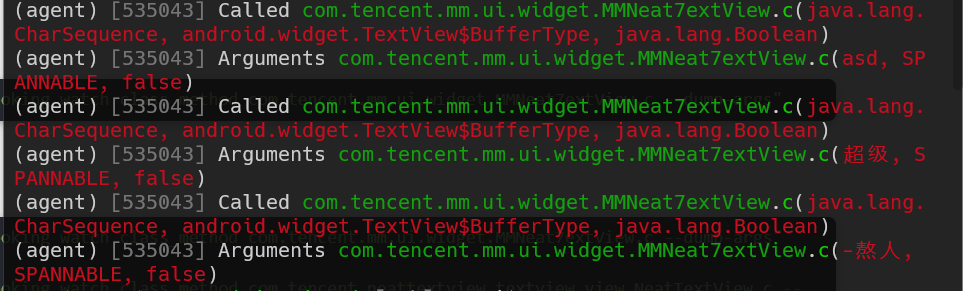
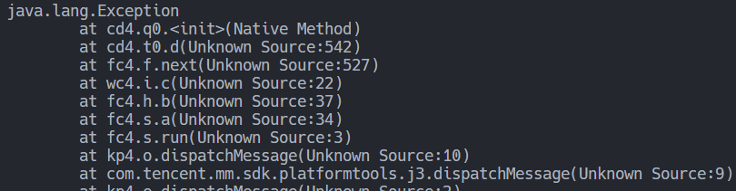
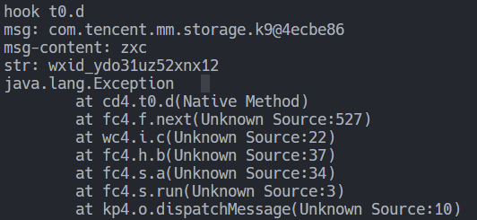
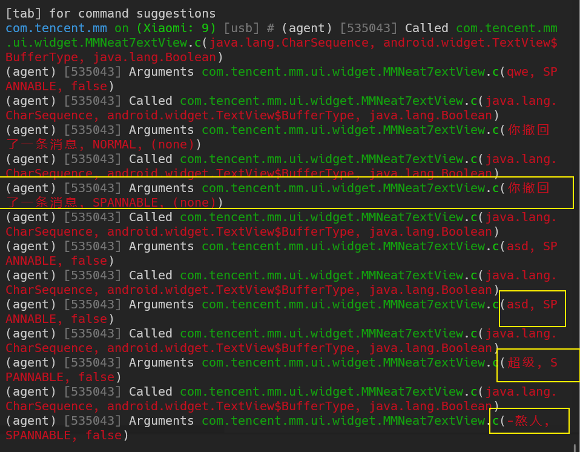

查看微信聊天界面的布局：

```shell
adb shell dumpsys activity top
```





两者`id`相同，尝试hook `MMNeat7extView`，然后发一条信息，很明显是相关的。



查看`MMNeat7extView`继承自`NeatTextView`，在`NeatTextView`搜索`setText`，在`c`方法中出现：



hook查看其参数，发现了发的消息内容：

```shell
objection -g com.tencent.mm explore -s "android hooking watch class_method com.tencent.mm.ui.widget.MMNeat7extView.c --dump-args"
```



打印一下调用栈：

```javascript
Java.perform(function() {
    var NextTextView = Java.use('com.tencent.neattextview.textview.view.NeatTextView');
    NextTextView.c.implementation = function(charSequence, bufferType, aBoolean) {
        console.log("hook NeatTextView.c");
        console.log("charSequence: " + charSequence);
        console.log("bufferType: " + bufferType);
        console.log("aBoolean: " + aBoolean);
        console.log(Java.use("android.util.Log").getStackTraceString(Java.use("java.lang.Exception").$new()));
        return this.c(charSequence, bufferType, aBoolean);
    }
});
```

跟着调用栈往上找，主要看`charSequence`参数：


一直找到`cd4.q0`：

```java
public final class q0 extends kotlin.jvm.internal.q implements zt4.l {
    public final /* synthetic */ vb4.c f22527d;
    public final /* synthetic */ k9 f22528e;
    public final /* synthetic */ kotlin.jvm.internal.h0 f22529f;
    public q0(vb4.c cVar, k9 k9Var, kotlin.jvm.internal.h0 h0Var) {
        super(1);
        this.f22527d = cVar;
        this.f22528e = k9Var;
        this.f22529f = h0Var;
    }
    @Override // zt4.l
    public Object invoke(Object obj) {
        vp it = (vp) obj;
        kotlin.jvm.internal.o.g(it, "it");
        oc.b(it.f163282b.getContext(), this.f22527d, wp.d(this.f22528e), (CharSequence) this.f22529f.f262102d, it.f163282b, this.f22528e, 4);
        return kt4.f0.f263276a;
    }
}
```

hook其构造方法，确定是否是发送的信息以及获取调用栈：

```javascript
var q0 = Java.use('cd4.q0');
q0.$init.implementation = function (cVar, k9Var, h0Var) {
    console.log('cd4.q0', cVar, k9Var, h0Var);
    console.log(Java.use("android.util.Log").getStackTraceString(Java.use("java.lang.Exception").$new()));
    this.$init(cVar, k9Var, h0Var);
}
```



继续往上找：

```js
var t0 = Java.use('cd4.t0');
var wpClass = Java.use('com.tencent.mm.ui.chatting.viewitems.wp');
t0.d.implementation = function (ui5, msg, str, uiBlock) {
    console.log("hook t0.d");
    console.log("msg: " + msg);
    console.log("msg-content: " + wpClass.d(msg));
    console.log("str: " + str);
    console.log(Java.use("android.util.Log").getStackTraceString(Java.use("java.lang.Exception").$new()));
    return this.d(ui5, msg, str, uiBlock);
}
```




```shell
objection -g com.tencent.mm explore -s "android hooking watch class_method com.tencent.mm.ui.widget.MMNeat7extView.c --dump-args"

objection -g com.tencent.mm explore -s "android hooking watch class_method com.tencent.neattextview.textview.view.NeatTextView.c --dump-args"


Java.perform(function() {
    var NextTextView = Java.use('com.tencent.neattextview.textview.view.NeatTextView');
    NextTextView.c.implementation = function(charSequence, bufferType, aBoolean) {
        console.log("hook NeatTextView.c");
        console.log("charSequence: " + charSequence);
        console.log("bufferType: " + bufferType);
        console.log("aBoolean: " + aBoolean);
        console.log(Java.use("android.util.Log").getStackTraceString(Java.use("java.lang.Exception").$new()));
        return this.c(charSequence, bufferType, aBoolean);
    }
});

objection -g com.tencent.mm explore -s "android hooking watch class_method com.tencent.mm.ui.chatting.viewitems.oc.b --dump-args"


```


```javascript
var oc = Java.use('com.tencent.mm.ui.chatting.viewitems.oc');
    oc.b.implementation = function(a, b, c, d, e, f, g) {
    console.log("hook oc.b");
    console.log("str: " + c);
    console.log(Java.use("android.util.Log").getStackTraceString(Java.use("java.lang.Exception").$new()));
    return this.b(a, b, c, d, e, f, g);
}
```


