# 分析

APK信息：

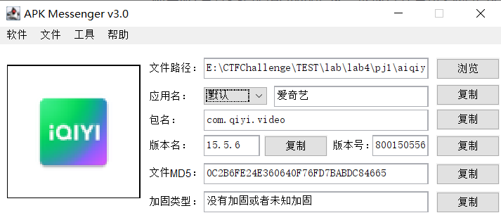

利用MT管理器查看Activity记录，发现打开爱奇艺时先为`com.qiyi.video.WelcomeActivity`再是`org.qiyi.android.video.MainActivity`。

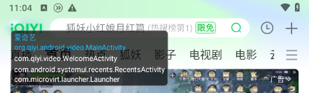

利用`objection`把`com.qiyi.video.WelcomeActivity`的所有方法都hook了，但报错找不到。

利用`objection`把`org.qiyi.android.video.MainActivity`的所有方法都hook了，查看打开app时有什么方法调用了。

用jadx看了下`org.qiyi.android.video.MainActivity`，有很多`startup.log`的记录日志，也用`objection`hook一下。

```shell
objection -g com.qiyi.video explore -s "android hooking watch class_method org.qiyi.android.video.MainActivity.dispatchTouchEvent --dump-args" -s "android hooking watch class_method com.qiyi.video.startup.Startup.log --dump-args"
```

广告的开始与结束都会输出日志：

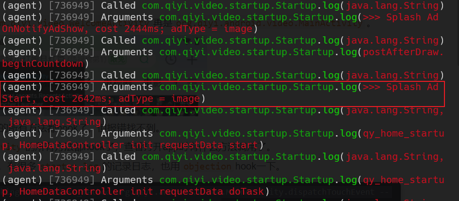

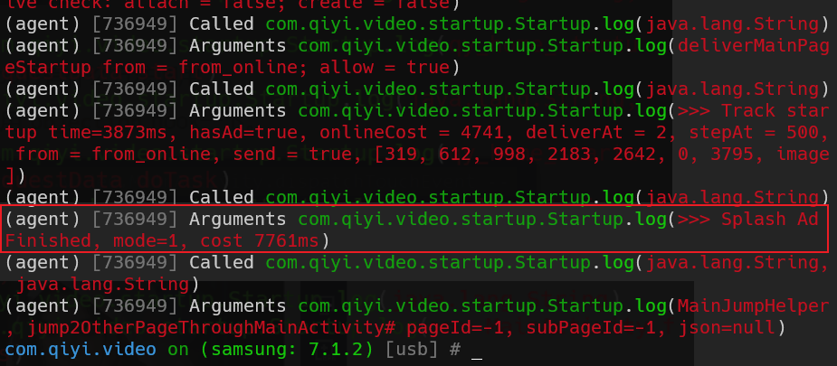

尝试启动时点击跳过广告，与之前没跳过广告出现两个触摸事件，并且广告时间减少了：

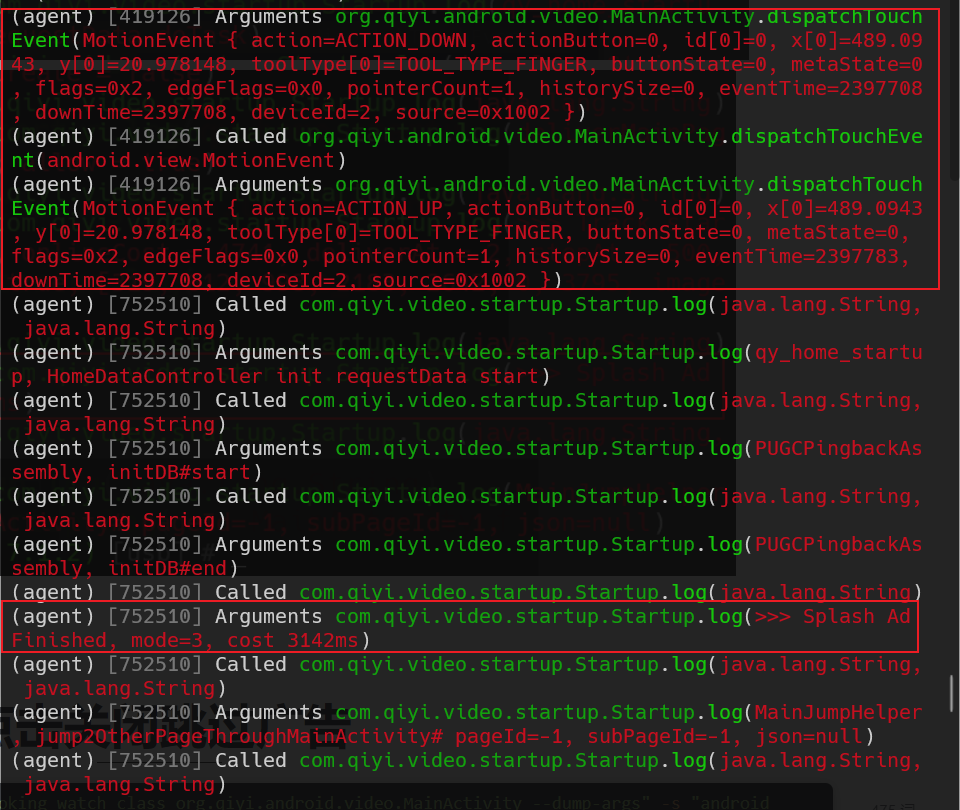


# 方法

## 1 模拟点击跳过广告

理论上，可以模拟点击跳过广告来实现跳过广告。

`org.qiyi.android.video.MainActivity.dispatchTouchEvent`的实现：

```java
@Override // android.app.Activity, android.view.Window.Callback
public final boolean dispatchTouchEvent(MotionEvent motionEvent) {
    tv1.a aVar = this.S;
    if (aVar != null) {
        aVar.a(motionEvent);
    }
    return super.dispatchTouchEvent(motionEvent);
}
```

该方法所需要的参数`motionEvent`t可通过以下方法生成：

[MotionEvent - Android中文版 - API参考文档 (apiref.com)](https://www.apiref.com/android-zh/android/view/MotionEvent.html)

```java
// 创建一个新的MotionEvent，填入定义运动的所有基本值。
static MotionEvent.obtain(
    long downTime, 
    long eventTime, 
    int action, 
    int pointerCount, 
    PointerProperties[] pointerProperties, 
    PointerCoords[] pointerCoords, 
    int metaState, 
    int buttonState, 
    float xPrecision, 
    float yPrecision, 
    int deviceId, 
    int edgeFlags, 
    int source, 
    int flags
)
```

利用frida在内存中找到`org.qiyi.android.video.MainActivity`实例，然后调用其`dispatchTouchEvent`方法，参数根据hook发现的参数生成。

由于需要等待内存中出现`org.qiyi.android.video.MainActivity`实例，设置定时任务等待1s去寻找。

由于app不会立刻加载到广告界面，因此设置定时任务等待1s调用`dispatchTouchEvent`方法。

```javascript
Java.perform(function () {
    console.log('Begin...');
    const MainActivityClass = Java.use('org.qiyi.android.video.MainActivity');

    MainActivityClass.dispatchTouchEvent.implementation = function (motionEvent) {
        console.log('dispatchTouchEvent called', motionEvent);
        console.log(Java.use("android.util.Log").getStackTraceString(Java.use("java.lang.Exception").$new()));
        return this.dispatchTouchEvent(motionEvent);
    };

    // MotionEvent { action=ACTION_MOVE, actionButton=0, id[0]=0, x[0]=483.10538, y[0]=50.94693, toolType[0]=TOOL_TYPE_FINGER, buttonState=0, metaState=0, flags=0x2, edgeFlags=0x0, pointerCount=1, historySize=0, eventTime=17219228, downTime=17219189, deviceId=2, source=0x1002 }
    // MotionEvent { action=ACTION_UP,   actionButton=0, id[0]=0, x[0]=483.10538, y[0]=50.94693, toolType[0]=TOOL_TYPE_FINGER, buttonState=0, metaState=0, flags=0x2, edgeFlags=0x0, pointerCount=1, historySize=0, eventTime=17219300, downTime=17219189, deviceId=2, source=0x1002 }
    // 获取 MotionEvent 类型
    var MotionEvent = Java.use('android.view.MotionEvent');
    // 创建 PointerProperties[] 和 PointerCoords[] 数组
    var PointerProperties = Java.use('android.view.MotionEvent$PointerProperties');
    var PointerCoords = Java.use('android.view.MotionEvent$PointerCoords');
    var properties = [PointerProperties.$new()];
    properties[0].id.value = 0;
    properties[0].toolType.value = MotionEvent.TOOL_TYPE_FINGER.value;
    var coords = [PointerCoords.$new()];
    coords[0].x.value = 469.13126;
    coords[0].y.value = 48.949013;
    var SystemClock = Java.use('android.os.SystemClock');
    setTimeout(function() {
        Java.choose('org.qiyi.android.video.MainActivity', {
            onMatch: function (instance) {
                console.log('Found instance:', instance);
                setTimeout(function() {
                    var downTime = SystemClock.uptimeMillis();
                    var eventTime = SystemClock.uptimeMillis();
                    var me_move = MotionEvent.obtain.call(MotionEvent,downTime,eventTime,MotionEvent.ACTION_DOWN.value,1,properties,coords, 0,0,0,0,2,0,0x1002,0x2);
                    instance.dispatchTouchEvent(me_move);
                    eventTime = SystemClock.uptimeMillis();
                    var me_up = MotionEvent.obtain.call(MotionEvent,downTime,eventTime,MotionEvent.ACTION_UP.value,1,properties,coords, 0,0,0,0,2,0,0x1002,0x2);
                    instance.dispatchTouchEvent(me_up);
                }, 1000);
                console.log('Dispatched ACTION_DOWN MotionEvent to instance');
            },
            onComplete: function () {
                console.log('Completed');
            }
        })
    }, 1000);
});
```

## 2 hook返回值

jadx搜索前面日志提到的：`>>> Splash Ad`，有三个结果：

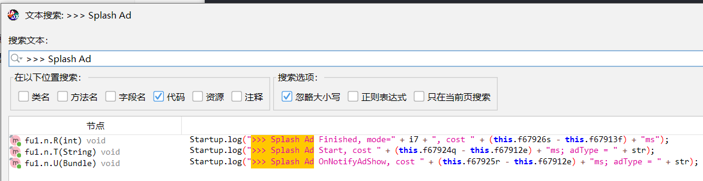

根据日志，最先开始的是`>>> Splash Ad OnNotifyAdShow...`

其在`fu1.n.U`：

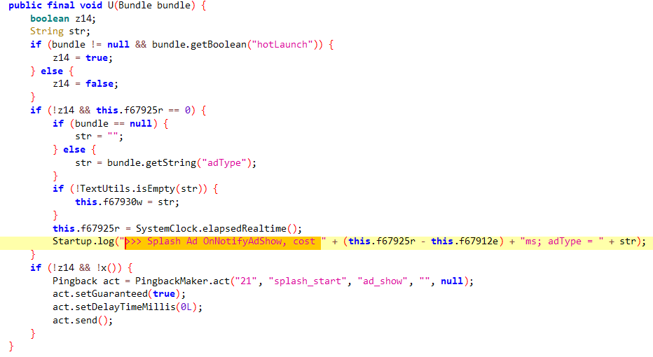

往上继续找调用，来到`fu.k.a`：

感觉像是在指令下发。

```java
public final void a(@Nullable Bundle bundle, @NonNull String str) {
    char c7 = 65535;
    switch (str.hashCode()) {
        case -1815218094:
            if (str.equals("openMainPage")) {
                c7 = 0;
                break;
            }
            break;
        case -1622699333:
            if (str.equals("splashAdDataBack")) {
                c7 = 1;
                break;
            }
            break;
        case -1621830290:
            if (str.equals("adCountDown")) {
                c7 = 2;
                break;
            }
            break;
        case -919830139:
            if (str.equals("splashAnimationStart")) {
                c7 = 3;
                break;
            }
            break;
        case -102574563:
            if (str.equals("splashAdFinish")) {
                c7 = 4;
                break;
            }
            break;
        case 504874902:
            if (str.equals("hotEnterApp")) {
                c7 = 5;
                break;
            }
            break;
        case 655002777:
            if (str.equals("requestSplashAd")) {
                c7 = 6;
                break;
            }
            break;
        case 847409990:
            if (str.equals("updateNetTaskDependent")) {
                c7 = 7;
                break;
            }
            break;
        case 938785385:
            if (str.equals("notifyAdShow")) {
                c7 = '\b';
                break;
            }
            break;
        case 1168077776:
            if (str.equals("splashAnimationFinish")) {
                c7 = '\t';
                break;
            }
            break;
        case 1211949834:
            if (str.equals("adSource_adn")) {
                c7 = '\n';
                break;
            }
            break;
        case 1275055209:
            if (str.equals("requestAdEnd")) {
                c7 = 11;
                break;
            }
            break;
        case 1912870968:
            if (str.equals("splashAdJump")) {
                c7 = '\f';
                break;
            }
            break;
    }
    switch (c7) {
        case 0:
            n.E(bundle);
            return;
        case 1:
            if (n.H() != null) {
                n.H().g0();
                return;
            }
            return;
        case 2:
            n.D(bundle);
            return;
        case 3:
            if (n.H() != null) {
                n.H().i0();
                return;
            }
            return;
        case 4:
            h.a.f67907a.c(bundle);
            return;
        case 5:
            h.a.f67907a.q();
            return;
        case 6:
            h.a.f67907a.l();
            return;
        case 7:
            i0.n();
            return;
        case '\b':
            h.a.f67907a.h(bundle);
            if (n.H() != null) {
                n.H().U(bundle);
                return;
            }
            return;
        case '\t':
            if (n.H() != null) {
                n.H().h0(bundle);
                return;
            }
            return;
        case '\n':
            if (n.H() != null) {
                n.H().S();
                return;
            }
            return;
        case 11:
            h.a.f67907a.j();
            return;
        case '\f':
            h.a.f67907a.d(bundle);
            int i7 = org.qiyi.video.navigation.o.f108055n;
            o.b.c().x();
            return;
        default:
            return;
    }
}
```

hook一下参数，发现都是和广告相关：

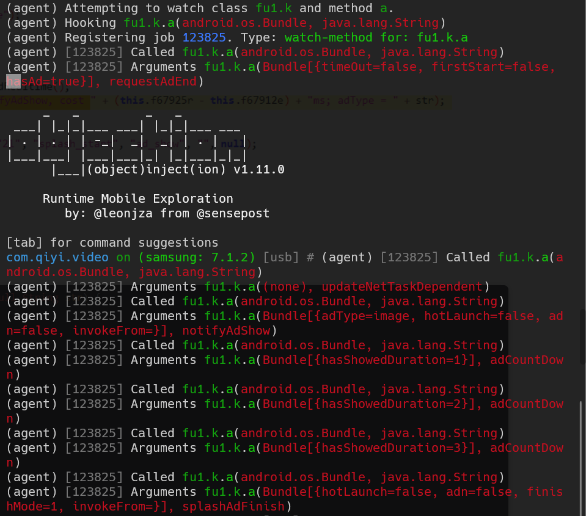

继续往上找，来到`sy1.n.d`：

```java
public static void d(@Nullable Bundle bundle, @NonNull String str) {
    c cVar = f119641a;
    if (cVar != null) {
        ((fu1.k) cVar).a(bundle, str);
    }
}
```

继续往上找调用，有很多，一个个看一下：

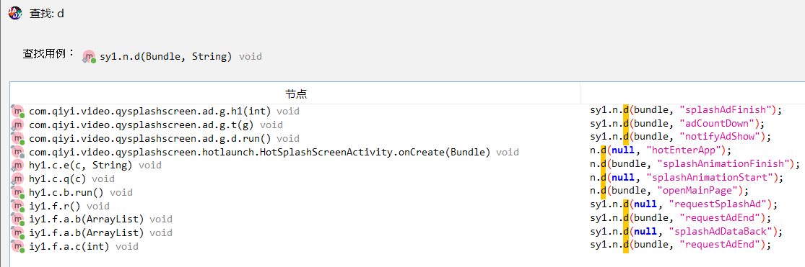

其中`sy1.n.d(null, "requestSplashAd");`看意思像请求广告。

然后查看代码，包含`isIgnoreAdReqWhenAppLaunchForPlayer`，好像程序中包含跳过广告的逻辑。

让`z14`为`true`，从而跳过`sy1.n.d(null, "requestSplashAd");`的执行。

```java
public final void r() {
    boolean z14;
    String str;
    if ((MixUIUtils.isTabletDevice() && GPadSpecialLogic.hideSplashAd()) || q()) {
        return;
    }
    String str2 = "0";
    boolean z15 = true;
    if (StringUtils.equals("0", SpToMmkv.get(QyContext.getAppContext(), "isIgnoreAdReqWhenAppLaunchForPlayer", "0", SharedPreferencesConstants.LAUNCH_SHAREPREFERENCE_NAME)) && f42.a.b() && !f42.a.d()) {
        z14 = true;
    } else {
        z14 = false;
    }
    if (z14) {
        return;
    }
    sy1.n.d(null, "requestSplashAd");
    if (TimeUtils.isToday(System.currentTimeMillis(), SpToMmkv.get(QyContext.getAppContext(), "CUPID_LAST_REQUEST_DAY_KEY", 0L))) {
        sy1.e.b("{CupidAdRequest}", "not first time");
        z15 = false;
    } else {
        sy1.e.b("{CupidAdRequest}", "is first time");
        SpToMmkv.set(QyContext.getAppContext(), "CUPID_LAST_REQUEST_DAY_KEY", System.currentTimeMillis());
    }
    this.f76443a = z15;
    iy1.b.e().P(this.f76443a, new a());
    if (!this.f76443a) {
        str = "0";
    } else {
        str = "1";
    }
    if (this.f76449h) {
        str2 = "1";
    }
    sy1.f.g(str, str2);
    this.f76444c = System.currentTimeMillis();
}
```

frida把`if (StringUtils.equals("0", SpToMmkv.get(QyContext.getAppContext(), "isIgnoreAdReqWhenAppLaunchForPlayer", "0", SharedPreferencesConstants.LAUNCH_SHAREPREFERENCE_NAME)) && f42.a.b() && !f42.a.d())`三个方法都hook了，看看返回值。

```javascript
Java.perform(function() {
    var SpToMmkvClass = Java.use('org.qiyi.basecore.utils.SpToMmkv');
    SpToMmkvClass.get.overload('android.content.Context', 'java.lang.String', 'java.lang.String', 'java.lang.String').implementation = function(context, str, str2, str3) {
        if (str === "isIgnoreAdReqWhenAppLaunchForPlayer") {
            console.log('org.qiyi.basecore.utils.SpToMmkv.get() is called');
            console.log('\tContext:', context);
            console.log('\tString:', str);
            console.log('\tString:', str2);
            console.log('\tString:', str3);
            var result =  this.get(context, str, str2, str3);
            console.log('\tResult:', result);
            return result;
        } else {
            return this.get(context, str, str2, str3);
        }
    };

    var f42_a_Class = Java.use('f42.a');
    f42_a_Class.b.implementation = function() {
        console.log('f42.a.b() is called');
        var result = this.b();
        console.log('\tResult:', result);
        return result;
    };
    
    f42_a_Class.d.implementation = function() {
        console.log('f42.a.d() is called');
        var result = this.d();
        console.log('\tResult:', result);
        return result;
    };
});
```

从结果看，只有`f42.a.b`不符合条件：

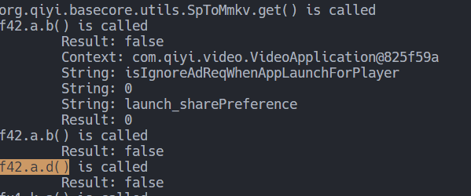

尝试强制返回true。

```javascript
var f42_a_Class = Java.use('f42.a');
f42_a_Class.b.implementation = function() {
    console.log('f42.a.b() is called');
    var result = this.b();
    console.log('\tResult:', result);
    return true;
};
```

然后结果就是开启app没有广告了。

### 更改smali代码

```shell
// 反编译
apktool.bat d .\iqiyi.apk
// 回编译
apktool.bat b .\iqiyi\
```

将以下smali代码删除，即相当于不管`f42.a.b`执行结果了，只看另外两个条件的判断。

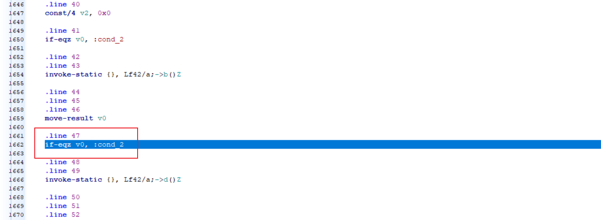

回编译完的apk需要进行签名，即可不需要frida实现跳过开屏广告。

# 演示

hook返回值，让app跳过广告的方法：左侧为有广告，右侧为无广告。

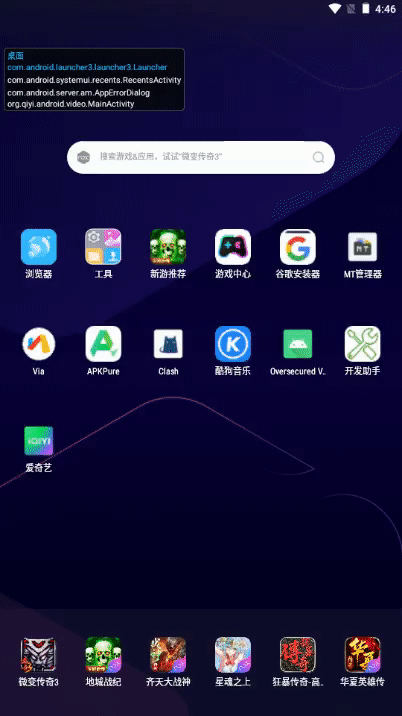


