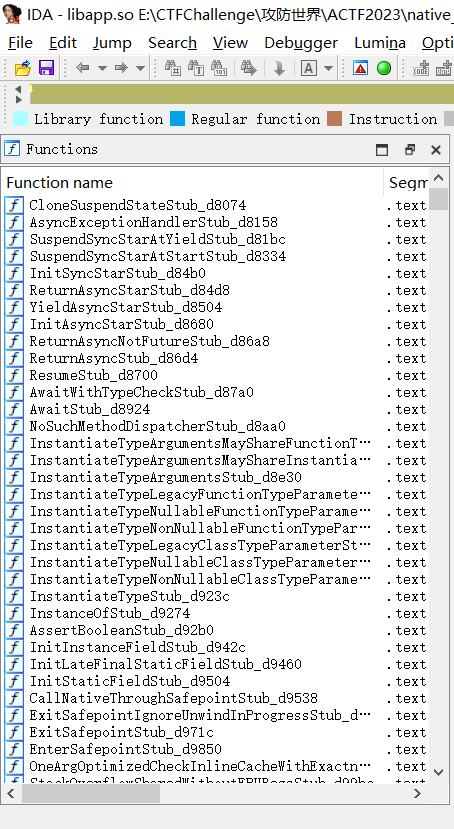

## native-app

👉[flutter逆向 ACTF native app](https://bbs.kanxue.com/thread-279403.htm)

👉[blutter使用+ACTF习题](https://zhuanlan.zhihu.com/p/671753808)

### blutter

```shell
git clone https://github.com/worawit/blutter --depth=1
cd blutter/
python .\scripts\init_env_win.py
```

在`x64 Native Tools Command Prompt for VS 2022`中：

```shell
python ./blutter.py E:\CTFChallenge\攻防世界\ACTF2023\native_app\chall\lib\arm64-v8a ./out
```

`out`目录下：

```shell
│  blutter_frida.js
│  objs.txt
│  pp.txt
│
├─asm
│  ├─characters
│  │  └─src
│  │      │  characters.dart
│  │      │  characters_impl.dart
│  │      │
│  │      └─grapheme_clusters
│  │              breaks.dart
│  │
│  ├─collection
│  │  └─src
│  │          priority_queue.dart
│  │
│  ├─flutter
│  │  └─src
│  │      ......
│  │
│  └─flutter_application_1
│          main.dart
│
└─ida_script
        addNames.py
        ida_dart_struct.h
```

`IDA`打开`libapp.so`，使用`addNames.py`恢复符号。

