# careful

直接上传微步云沙箱

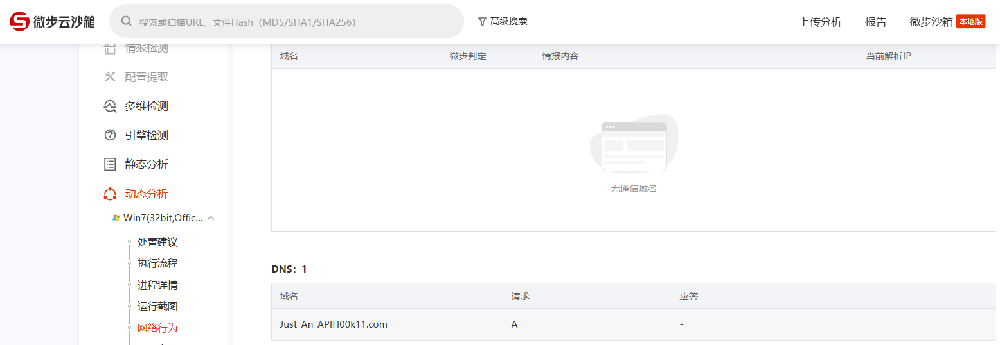

# babyRe

调试一下了解主要逻辑：

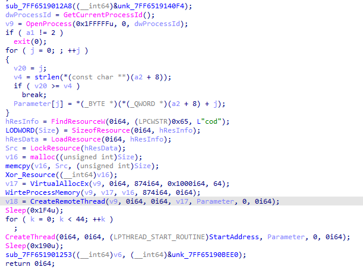

v17的位置是处理输入字符串的；

StartAddress是最后进行比较的；

v17的位置的数据是经过前面有个函数异或解开的，带有一点混淆，处理后可以得到：

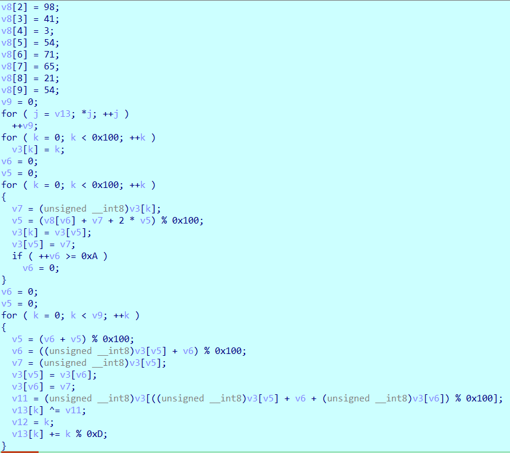

## exp

```python
key = [
    93, 66, 98, 41, 3, 54, 71, 65, 21, 54
]
data = [
    0xF7, 0x2E, 0x34, 0xF0, 0x72, 0xCF, 0x5E, 0x0A, 0xBB, 0xEC,
    0xB1, 0x2B, 0x70, 0x88, 0x88, 0xED, 0x46, 0x38, 0xDB, 0xDA,
    0x6C, 0xBD, 0xD4, 0x06, 0x77, 0xF2, 0xCF, 0x56, 0x88, 0xC6,
    0x31, 0xD2, 0xB7, 0x5A, 0xC1, 0x42, 0xB0, 0xF4, 0x48, 0x37,
    0xF5, 0x2C, 0xF5, 0x58
]
v4 = [i for i in range(0x100)]

v7 = 0
v6 = 0
for i in range(0x100):
    v6 = (key[v7 % 10] + v4[i] + 2 * v6) % 0x100
    v7 += 1
    v4[i], v4[v6] = v4[v6], v4[i]

v7, v6 = 0, 0
for i in range(len(data)):
    v6 = (v7 + v6) % 0x100
    v7 = (v4[v6] + v7) % 0x100
    v4[v6], v4[v7] = v4[v7], v4[v6]
    v12 = v4[(v4[v6] + v7 + v4[v7]) % 0x100]
    data[i] -= i % 0xD
    data[i] %= 0x100
    data[i] ^= v12

print("".join(chr(i) for i in data))
```

# ez_exe

## 获取bin2

用pyinstxtractor生成pyc，再用pycdc反编译一下：

```python
import ctypes
from time import *
from ctypes import *
from ctypes import wintypes
from hashlib import md5
 
class _STARTUPINFO(Structure):
    _fields_ = [
        ('cb', c_ulong),
        ('lpReserved', c_char_p),
        ('lpDesktop', c_char_p),
        ('lpTitle', c_char_p),
        ('dwX', c_ulong),
        ('dwY', c_ulong),
        ('dwXSize', c_ulong),
        ('dwYSize', c_ulong),
        ('dwXCountChars', c_ulong),
        ('dwYCountChars', c_ulong),
        ('dwFillAttribute', c_ulong),
        ('dwFlags', c_ulong),
        ('wShowWindow', c_ushort),
        ('cbReserved2', c_ushort),
        ('lpReserved2', c_char_p),
        ('hStdInput', c_ulong),
        ('hStdOutput', c_ulong),
        ('hStdError', c_ulong)]
 
 
class _PROCESS_INFORMATION(Structure):
    _fields_ = [
        ('hProcess', c_void_p),
        ('hThread', c_void_p),
        ('dwProcessId', c_ulong),
        ('dwThreadId', c_ulong)]
 
StartupInfo = _STARTUPINFO()
ProcessInfo = _PROCESS_INFORMATION()
key1 = bytes(md5(b'bin1bin1bin1').hexdigest().encode())
file = open('bin1', 'rb').read()
arr = range(len(file))()
open('bin1', 'wb').write(bytes(arr))
sleep(0)
bet = ctypes.windll.kernel32.CreateProcessA(b'bin1', ctypes.c_int(0), ctypes.c_int(0), ctypes.c_int(0), ctypes.c_int(0), ctypes.c_int(0), ctypes.c_int(0), ctypes.c_int(0), byref(StartupInfo), byref(ProcessInfo))
ctypes.windll.kernel32.WaitForSingleObject(ctypes.c_int(ProcessInfo.hProcess), ctypes.c_int(-1))
open('bin1', 'wb').write(file)
```

很明显，`arr = range(len(file))() 和 open('bin1', 'wb').write(bytes(arr))`是有些奇怪的，可能是无法彻底地反编译，于是用pycdas得到python字节码：

```
        b'bin1bin1bin1'
        'bin1'
        'rb'
        [Code]
            File Name: ez_py.py
            Object Name: <listcomp>
            Qualified Name: <listcomp>
            Arg Count: 1
            Pos Only Arg Count: 0
            KW Only Arg Count: 0
            Stack Size: 7
            Flags: 0x00000003 (CO_OPTIMIZED | CO_NEWLOCALS)
            [Names]
                'key1'
                'len'
                'file'
            [Constants]
            [Disassembly]
                0       RESUME                        0
                2       BUILD_LIST                    0
                4       LOAD_FAST                     0: .0
                6       FOR_ITER                      50 (to 108)
                8       STORE_FAST                    1: i
                10      LOAD_GLOBAL                   0: key1
                22      LOAD_FAST                     1: i
                24      LOAD_GLOBAL                   3: NULL + len
                36      LOAD_GLOBAL                   0: key1
                48      PRECALL                       1
                52      CALL                          1
                62      BINARY_OP                     6
                66      BINARY_SUBSCR                 
                76      LOAD_GLOBAL                   4: file
                88      LOAD_FAST                     1: i
                90      BINARY_SUBSCR                 
                100     BINARY_OP                     12
                104     LIST_APPEND                   2
                106     JUMP_BACKWARD                 51
                108     RETURN_VALUE                  
        'wb'
        b'bin1'
        -1
```

可以使用dis来获取python字节码，但得使用python3.11版本：

```
Disassembly of <code object <listcomp> at 0x00000160F71B8FA0, file "ez_py.py", line 59>:
 59           0 RESUME                   0
              2 BUILD_LIST               0
              4 LOAD_FAST                0 (.0)
        >>    6 FOR_ITER                50 (to 108)
              8 STORE_FAST               1 (i)
             10 LOAD_GLOBAL              0 (key1)
             22 LOAD_FAST                1 (i)
             24 LOAD_GLOBAL              3 (NULL + len)
             36 LOAD_GLOBAL              0 (key1)
             48 PRECALL                  1
             52 CALL                     1
             62 BINARY_OP                6 (%)
             66 BINARY_SUBSCR
             76 LOAD_GLOBAL              4 (file)
             88 LOAD_FAST                1 (i)
             90 BINARY_SUBSCR
            100 BINARY_OP               12 (^)
            104 LIST_APPEND              2
            106 JUMP_BACKWARD           51 (to 6)
        >>  108 RETURN_VALUE
```

逆出逻辑，并将其改为bin2来解密bin2文件：

```python
from hashlib import md5
key1 = bytes(md5(b"bin2bin2bin2").hexdigest().encode())
file = open("bin2", "rb").read()
arr = [key1[i % len(key1)] ^ file[i] for i in range(len(file))]
open("bin_dump", "wb").write(bytes(arr))
```

## 解密bin2

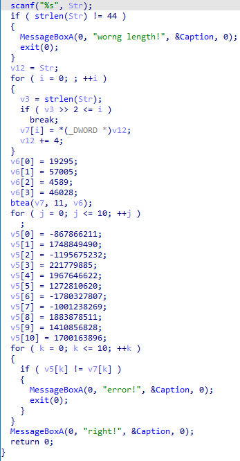

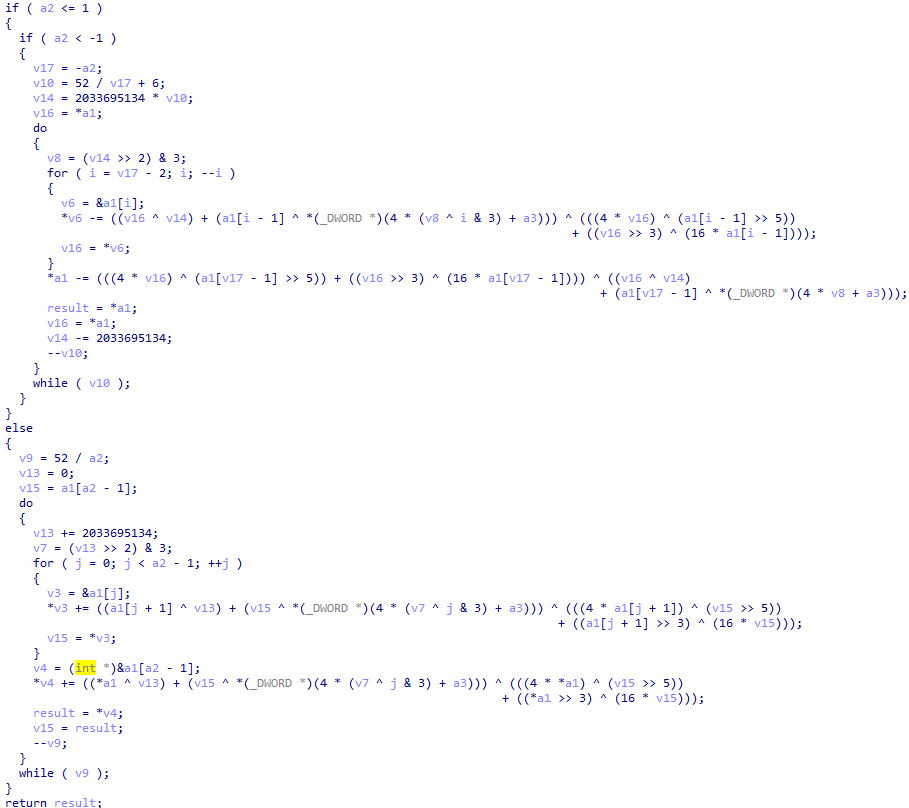

可以直接写脚本了：

```c++
#include <iostream>
#include <stdio.h>
using namespace std;
#include <stdint.h>
#define DELTA 0x7937B99E
#define MX (((z>>5^y<<2) + (y>>3^z<<4)) ^ ((sum^y) + (key[(p&3)^e] ^ z)))
void btea(uint32_t* v, int n, uint32_t const key[4]) {
    uint32_t y, z, sum;
    unsigned p, rounds, e;
    rounds = 52 / n;
    sum = rounds * DELTA;
    y = v[0];
    do {
        e = (sum >> 2) & 3;
        for (p = n - 1; p > 0; p--) {
            z = v[p - 1];
            y = v[p] -= MX;
        }
        z = v[n - 1];
        y = v[0] -= MX;
    } while ((sum -= DELTA) != 0);
}
 
int main()
{
    uint32_t const key[4] = { 0x4B5F, 0xDEAD, 0x11ED, 0xB3CC };
    uint32_t data[11] = { 0xCC45699D, 0x683D5352,0xB8BB71A0,0xD3817AD,0x7547E79E,0x4BDD8C7C,0x95E25A81,0xC4525103,0x7049B46F,0x5417F77C,0x65567138 };
    uint32_t* sent = data;
    btea(sent, 11, key);
    for (int i = 0; i < 11; i++) {
        for (int j = 0; j < 4; j++)
        {
            printf("%c", sent[i] & 0xff);
            sent[i] >>= 8;
        }
    }
    return 0;
}
```

# cap

主逻辑：程序截图并进行处理保存为cap.bin。

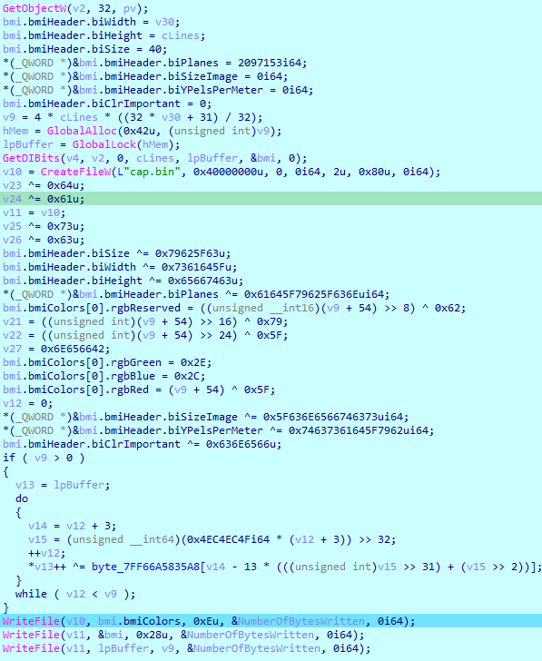

动态调试可得，

这部分处理bin文件的1-14个字节：

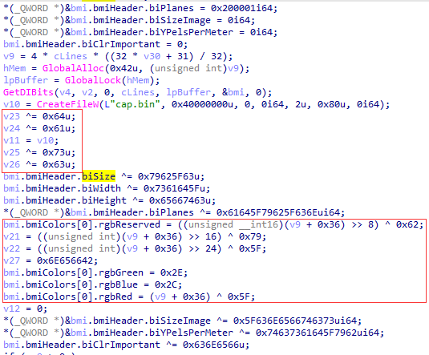

这部分处理bin文件的15-40个字节：

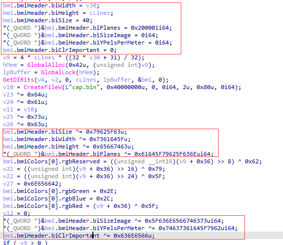

这部分处理bin文件的剩余字节，且下标起始于3：

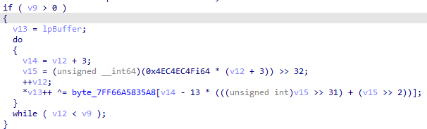

## exp

```python
def handle(a, b):
    for i in range(len(a)):
        a[i] ^= ((b >> i * 8) & 0xFF)
    return a


key = [0x65, 0x6E, 0x63, 0x5F, 0x62, 0x79, 0x5F, 0x64, 0x61, 0x73, 0x63, 0x74, 0x66]
with open('DASCTF2023二进制/cap.bin', 'rb') as f:
    data1 = bytearray(f.read(14))
    data2 = bytearray(f.read(40))
    data3 = bytearray(f.read())
# data1[0] ^= 0x6E
# data1[1] ^= 0x63
# data1[2] ^= 0x5f
# data1[3] ^= 0x62
# data1[4] ^= 0x79
# data1[5] ^= 0x5f
# data1[6] ^= 0x64
# data1[7] ^= 0x61
# data1[8] ^= 0x73
# data1[9] ^= 0x63
for i in range(len(data1)):
    data1[i] ^= key[(i + 1) % 13]
data2[:4] = handle(data2[:4], 0x79625f63)
data2[4:8] = handle(data2[4:8], 0x7361645f)
data2[8:12] = handle(data2[8:12], 0x65667463)
data2[12:20] = handle(data2[12:20], 0x61645f79625f636e)
data2[20:28] = handle(data2[20:28], 0x5f636e6566746373)
data2[28:36] = handle(data2[28:36], 0x74637361645f7962)
data2[36:40] = handle(data2[36:40], 0x636e6566)

for i in range(len(data3)):
    data3[i] ^= key[(i + 3) % 13]
print(data1[2])
with open('flag.bmp', 'wb') as f:
    f.write(bytes(data1 + data2 + data3))
```

# unsym

这题还是我有点迷，看wp知晓流程:

1. 输入密钥
2. 用RSA解密，n=0x1d884d54d21694ccd120f145c8344b729b301e782c69a8f3073325b9c5，e=0x10001，分解n，求出d
3. 结果应该是0xfad53ce897d2c26f8cad910417fbdd1f0f9a18f6c1748faca10299dc8
4. 将结果当作密钥和IV进行AES CBC模式解密解encrypted.bin

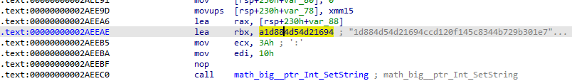

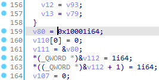

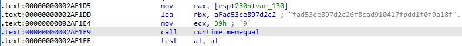
