# babyLoginPlus

该题主要是参照其他大佬writeup的思路，即找到输入，下断点，根据最后所得到的比较等式来一步步调试得到的。

## VM

该函数应该是使用vm函数的地方

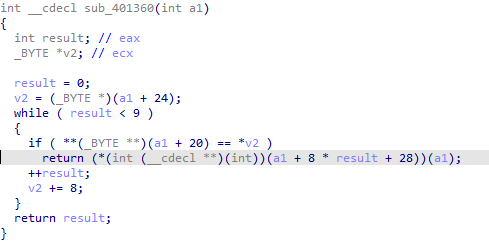

因此在这个地方下了断点之后，一步步开始调试，看看程序的执行流程

首先，程序的执行到这个地方，会不断重复执行，然后根据调用的函数来获取输入、进行比较、执行输出。

在前几次的执行中，包含了获取输入的函数，得到我们的输入。

## 比较过程

获取输入后，程序开始执行比较，其中我也不太清楚部分操作的流程，可能是获取数据或者解析数据什么的，因此省略了。

获取input[i]的字符更新为input[i]-9。

```sub dex,ecx```

![input[i]-9](Others/image-20221003115001724.png)

获取操作数 0x26。

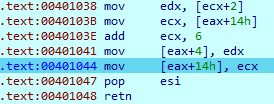

将input[i]与上一个函数获取的0x26异或，即input[i] = input[i] ^ 0x26。

```xor edx,ecx```

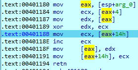

获取程序之前生成的Welcome字符串的第i个字符。

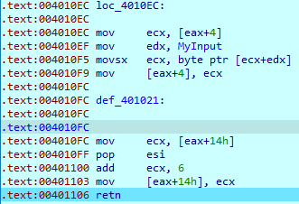

将获取Welcome字符串的字符和之前变化后的input[i]进行异或。

```xor edx,ecx```

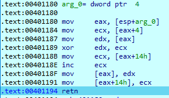

执行add [eax], esi, 将上一步异或得到的的字符加上6。

```add [eax], esi```

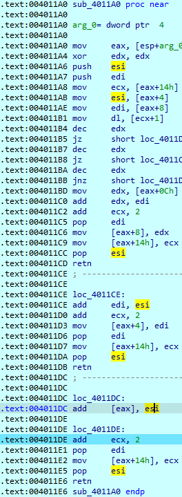

获取最后结果比较所需的数组。

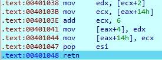

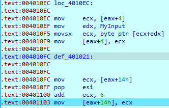

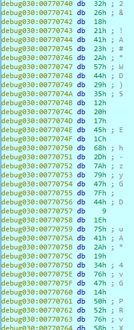

进行结果比较。

```cmp edi,ecx```

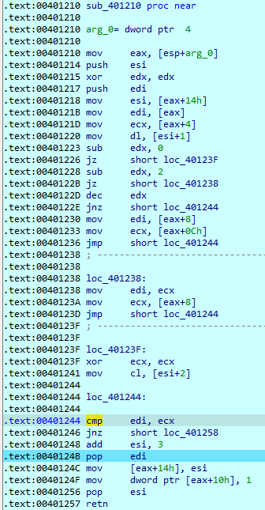

## 解题脚本

```python
result = [0x32, 0x26, 0x18, 0x21, 0x41, 0x23, 0x2A, 0x57, 0x44, 0x29, 0x35, 0x12, 0x20, 0x17, 0x45, 0x1C,
       0x68, 0x2D, 0x7A, 0x79, 0x47, 0x7F, 0x44, 0x09, 0x1E, 0x75, 0x41, 0x2A, 0x19, 0x34, 0x76, 0x47,
       0x14, 0x50, 0x52, 0x76, 0x58]
key = [0x57, 0x65, 0x6C, 0x63, 0x6F, 0x6D, 0x65, 0x5F, 0x74, 0x6F, 0x5F, 0x73, 0x64, 0x6E, 0x69, 0x73,
       0x63, 0x5F, 0x32, 0x30, 0x31, 0x38, 0x5F, 0x42, 0x79, 0x2E, 0x5A, 0x65, 0x72, 0x6F, 0x00, 0x00,
       0x00, 0x00, 0x00, 0x00, 0x00]
flag = ''
for i in range(len(result)):
    flag += chr(((result[i]-0x6) ^ 0x26 ^ key[i])+9)
print(flag)
#flag{_p1us_babyL0gin_pPpPpPpPp_p1us_}

```

# QExtend

## 函数主逻辑

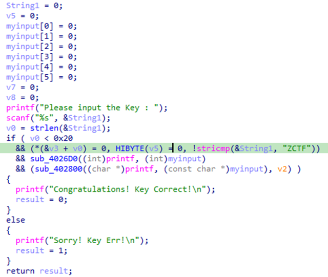

开始函数的逻辑，标记的一行为将输入的第四位和最后一位都变成0，即去掉flag中的{}，然后比较前四位是否位ZCTF，最后再使用flag中{}中的字符串。

## sub_4026D0函数

进入`loc_4026D0`可以看到，这其实应该是一个函数，但被数据断开了，但经过不更改代码的调试发现`0x4026E5`的数据在之后会被用到，因此如果要程序正常执行就不能直接使用nop将其覆盖。

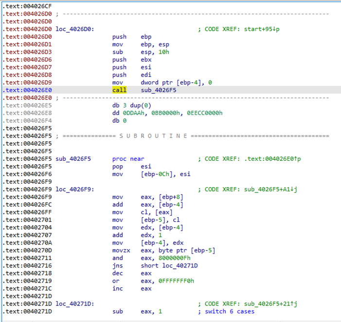

先忽略这个数据，使用nop覆盖。

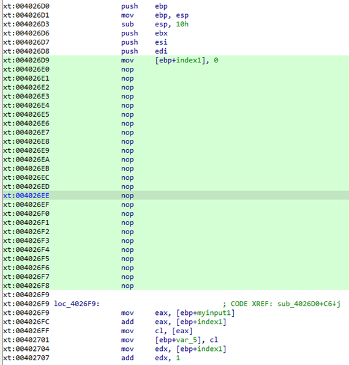

获得`sub_4026D0`函数的主要逻辑。

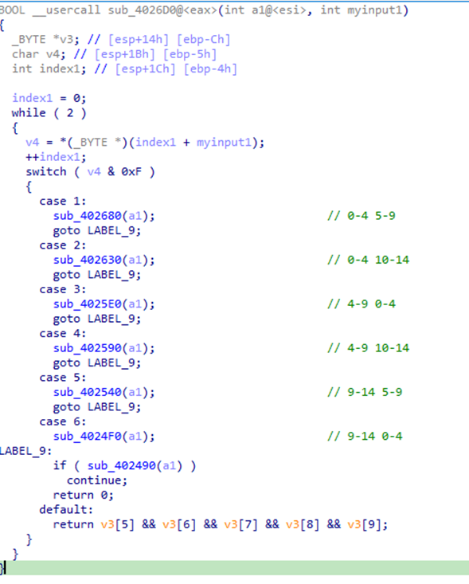

再进入switch的各个case的函数中看一下。

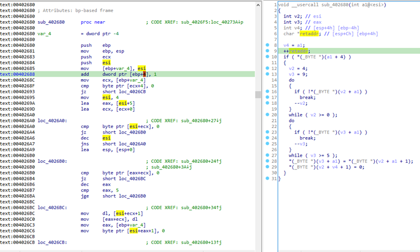

这里被标记的行有将函数返回地址进行加一的操作，可以将其nop掉，因为函数返回地址处的指令没有啥作用。

### 回看被nop的数据


此处的call会将函数返回地址压入栈中，而返回地址`0x4026E5`就是数据的地址，通过这种方法，当跳入`sub_4026F5`函数时，使用pop就可以获得数据的地址，然后继续下方的指令。

`sub_4026F5`函数没有`push ebp；mov ebp esp；`环节因此，第一个出栈的就是函数返回地址。

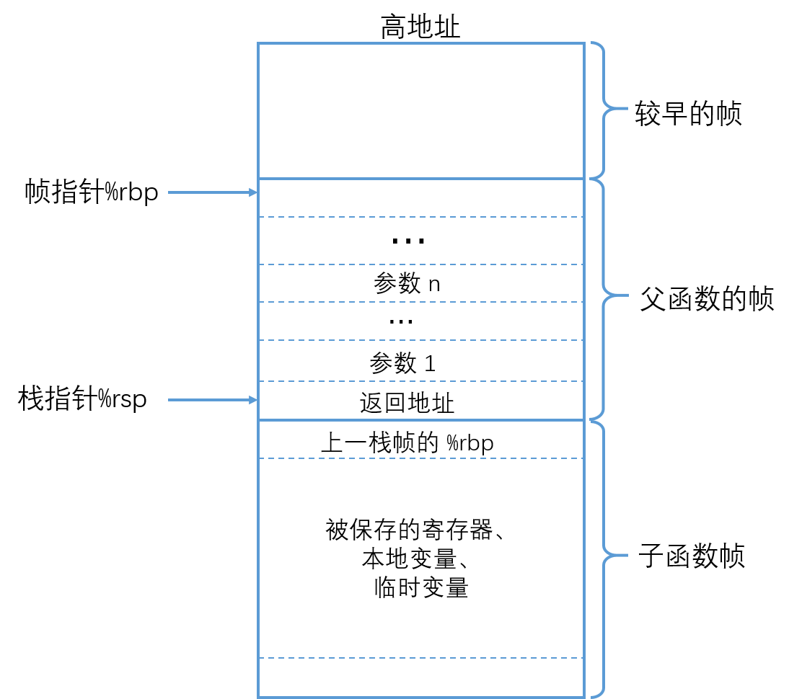

此处将数据的地址pop到esi中，而且还使用`mov [ebp-0Ch]，esi;`将数据地址复制到一个参数上。esi到switch的各case的函数中之前都没有更改，因此各case中的函数直接使用esi来获取数据。

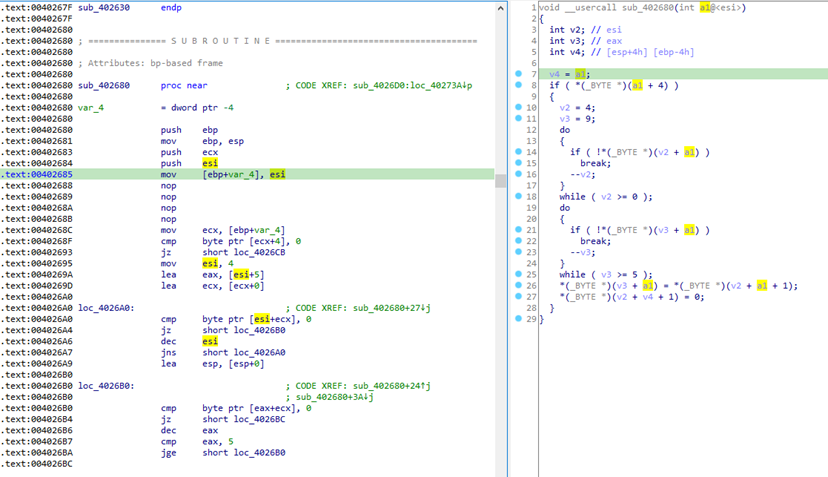

图中esi的位置就是指向数据的地址，函数直接使用。

### switch各case中的函数的逻辑。

因为这里看了别的师傅的wp，因此知道这是一个hanoi游戏。

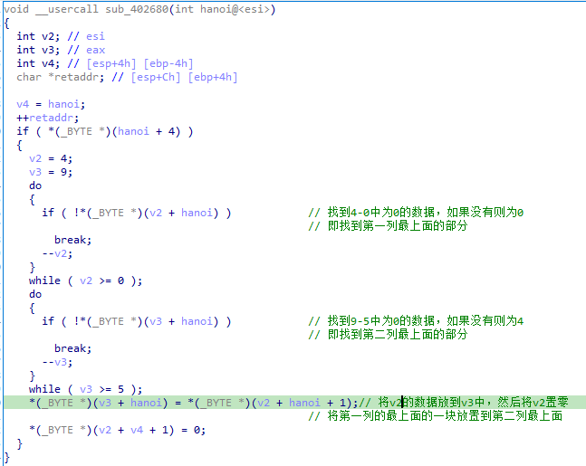

其他case中的函数，大差不差。

6个case分别对应这hanoi游戏中三列的互相移动。

switch存在与0xF相与再减一的操作（看汇编或者未nop的程序逻辑）。

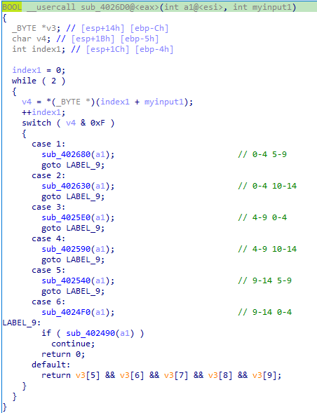

看if中的函数sub_402490，这是检查每一步操作是否符合hanoi规则的。

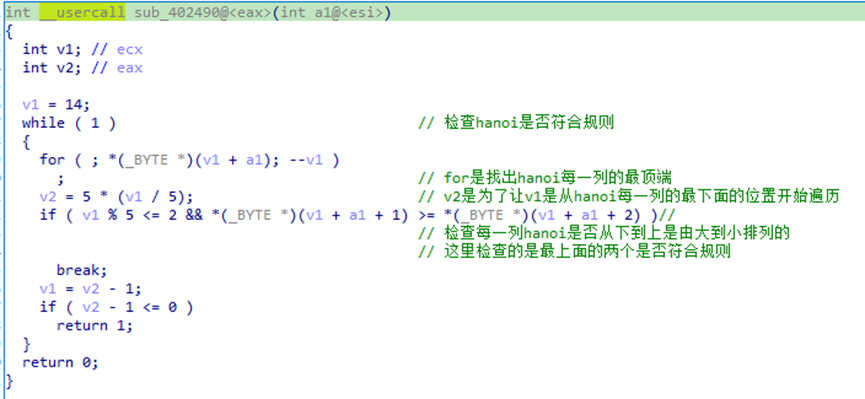

### sub_4026F5的返回值。

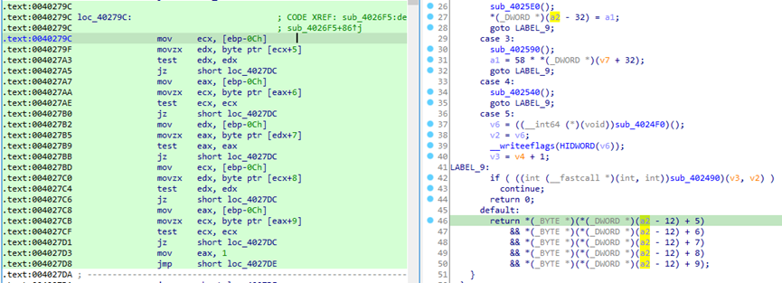

对比汇编和伪代码。可以看出a2就是[ebp-0Ch]，上面说过这是某数据的地址，这里获取了数据的第5、6、7、8、9位，再将它们进行&&运算，将结果作为返回值。

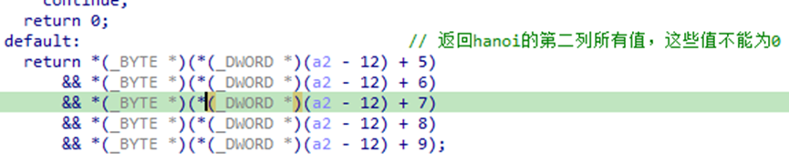

## sub_402800函数。

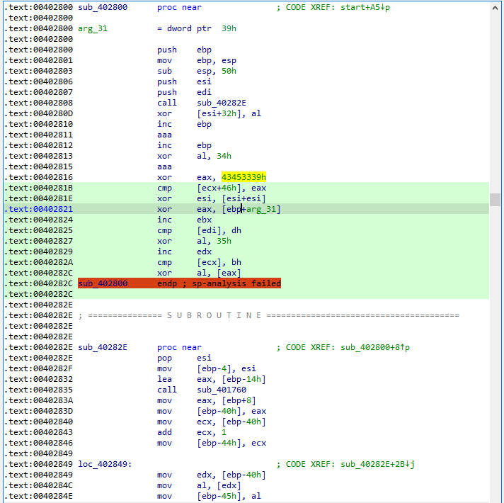

可以看出它与下方的`sub_40282E`其实应该是连在一起的。

现在看着汇编进行分析。

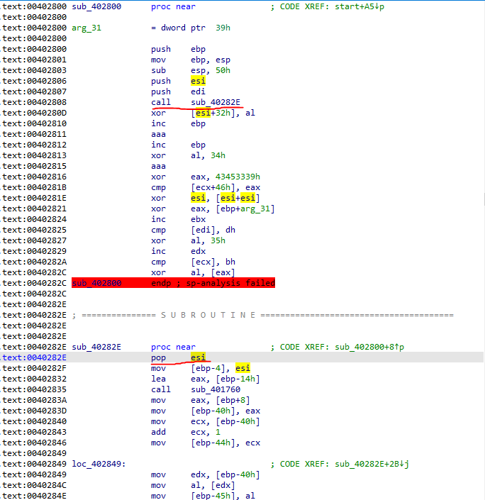

当程序执行`sub_40282E`时，`sub_40282E`函数没有进行正常的调节栈顶栈底操作，而是`pop esi;`，这将函数返回地址给pop出来了，程序将其放置在`[ebp-4]`中，这在程序之后会用到。

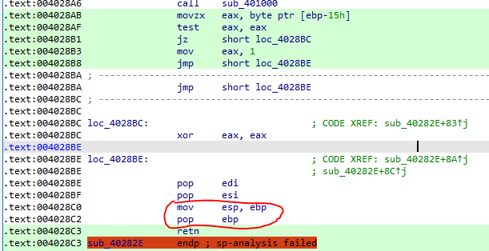

在看到`sub_40282E`的最后，它进行了调节栈顶栈底的操作，但函数开始时并没有其对应的操作，因此在这里它调节的是`sub_40282E`的上一级函数`sub_402800`函数的堆栈，它将堆栈还原成`start`函数（即程序主逻辑函数）调用`sub_402800`函数时的堆栈，而此时栈顶的值是`sub_402800`函数的返回地址。

程序通过这样子的逻辑跳过了调用`sub_40282E`函数需要再返回调用处的流程。

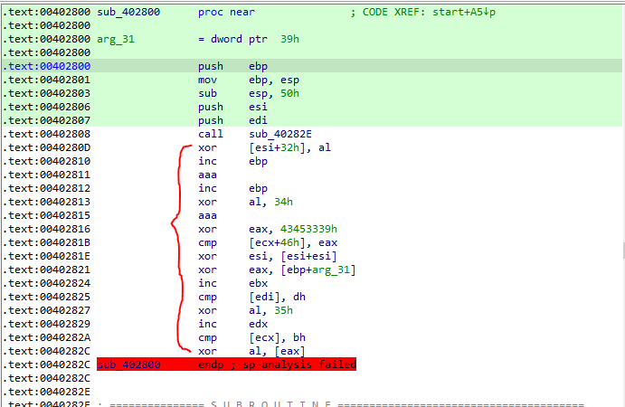

上面说了这一部分是程序之后流程需要的数据，所以如果要想不干扰程序正常流程就不能改变它，但在这里为了获取伪代码，先将他nop掉，将`sub_402800`和`sub_40282E`连起来。

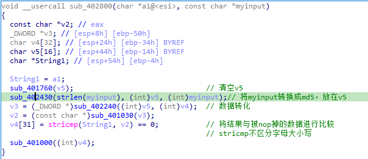

观察未nop的程序汇编就可以发现比较的字符串string1就是之前`sub_40282E`返回地址的那部分数据。

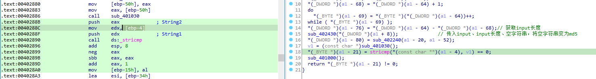

## 编写脚本

### 程序逻辑

获取用户输入，将{}中的内容提取出来；

根据输入，进行hanoi游戏，将每一块从大到小放置在第二列上；

将输入生成md5，进行比较；

hanoi初始状态和需要达到的状态：

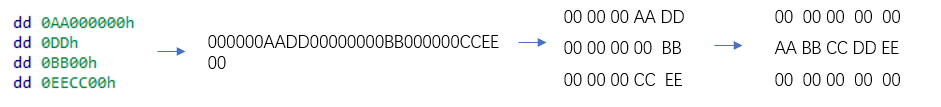

手动玩一下，得到流程：053254104123104524104，也可以找个脚本跑一下。

因为程序在switch时进行了与0xF相与再减一的操作，因此满足条件的字符串有很多，但最后需要字符串的md5与上面数据相同，即：`0x30, 0x46, 0x32, 0x45, 0x37, 0x45, 0x34, 0x34, 0x37, 0x35,0x39, 0x33, 0x45, 0x43, 0x39, 0x41, 0x46, 0x33, 0x34, 0x36, 0x33, 0x45, 0x39, 0x43, 0x38, 0x37, 0x34, 0x35, 0x42, 0x38, 0x39 , 0x32`。

### 脚本

### 

```python
import hashlib
oper = "053254104123104524104"
oper = [int(i) + 1 for i in oper]
# 六种输入char对应六种case方法
# oper是符合条件输入的低位
# 符合条件的输入 为 oper 补足 它的高位
high_bit = [0x20, 0x30, 0x40, 0x50, 0x60, 0x70]
final = [
    0x30, 0x46, 0x32, 0x45, 0x37, 0x45, 0x34, 0x34, 0x37, 0x35,
    0x39, 0x33, 0x45, 0x43, 0x39, 0x41, 0x46, 0x33, 0x34, 0x36,
    0x33, 0x45, 0x39, 0x43, 0x38, 0x37, 0x34, 0x35, 0x42, 0x38,
    0x39, 0x32
]
final_s = "".join(chr(i) for i in final)
final_s = final_s.lower()
print(final_s)
for a in high_bit:
    for b in high_bit:
        for c in high_bit:
            for d in high_bit:
                for e in high_bit:
                    for f in high_bit:
                        now_oper = []
                        for i in oper:
                            match i:
                                case 1:
                                    now_oper.append(i + a)
                                case 2:
                                    now_oper.append(i + b)
                                case 3:
                                    now_oper.append(i + c)
                                case 4:
                                    now_oper.append(i + d)
                                case 5:
                                    now_oper.append(i + e)
                                case 6:
                                    now_oper.append(i + f)
                        now_str = "".join(chr(i) for i in now_oper)
                        md5 = hashlib.md5(now_str.encode())
                        result = md5.hexdigest()
                        if result == final_s:
                            print(now_str)
```

# 杰瑞的影分身

## 解题思路

简单浏览下程序思路，可以发现程序的输入，但程序的结果比较过程则没有发现。

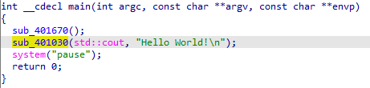

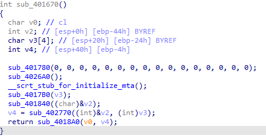

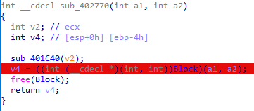

通过网上搜索，在sub_402770的函数中Block部分应该也是一个函数，我猜测具体过程是由前一句sub_401C40函数生成的，因此直接在这下断点，直接动态调试。

程序的比较过程还是比较明显的，但还是调试了我半天，具体过程就不贴图了。

### 第一个过程

对input[i]进行异或4，然后当 i % 3 == 1时，还将input[i]与一串字符串第（3 * i）位异或（但根据该字符串来进行解题时，出现的结果不太对，因此我直接记录进行异或的字符，直接异或了）

### 第二个过程

对sub_4017B0函数生成的字符串进行处理。

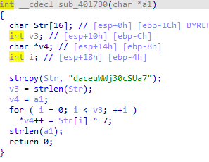

由于程序的进行，处理后的字符串可以直接读取，因此不用管过程，直接得到结果。

`str1 = "e4bdtRV02"`

后面的字符被第十位的 0 截断了，因此只有9位了。

### 第三个过程

将变化后的input[i]与sub_401BD0（i）所得到的返回值 + 2 进行异或。

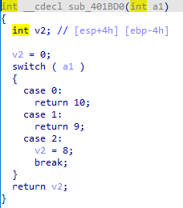

同时如果input的前九位与str1的前九位相加。

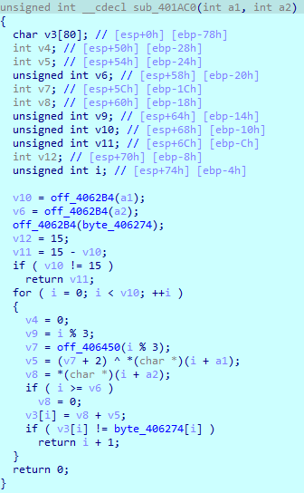

## 解题脚本

```python
def getnum(a1):
    if a1 == 0:
        return 12
    elif a1 == 1:
        return 11
    else:
        return 10


str1 = "e4bdtRV02"
str = "flag{where is tom}flag{My cheese}flag{i miss tom}"
str2 = "gsleg"
strrrr = [0xD3, 0x38, 0xD1, 0xD3, 0x7B, 0xAD, 0xB3, 0x66, 0x71, 0x3A,
          0x59, 0x5F, 0x5F, 0x2D, 0x73]
flag = []
for i in range(15):
    if i < 9:
        flag.append((strrrr[i] - ord(str1[i])) ^ getnum(i % 3))
    else:
        flag.append((strrrr[i] ^ getnum(i % 3)))
t = 0
for i in range(15):
    if i % 3 == 1:
        flag[i] ^= ord(str2[t])
        t += 1
    flag[i] ^= 4
for i in flag:
    print(chr(i), end="")
```

# Bingo

## 解题思路

思路主要参考网上writeup，一步步做出来的。

png中隐藏着exe文件

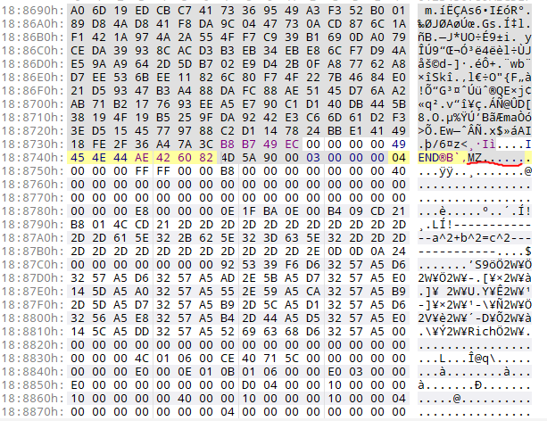

MZ文件头，即（4D5A9000...)，从这开始到最后的字节都提取出来，为一个exe文件。此时的exe文件因为缺少PE头无法被ida识别，因此加一个PE头 50 45 00 00

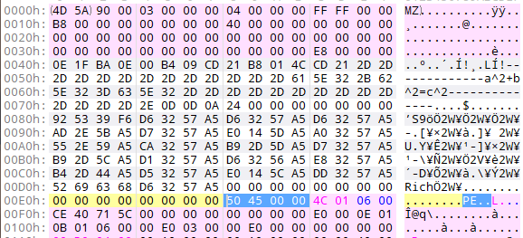

也可以通过010editor在模板中修改

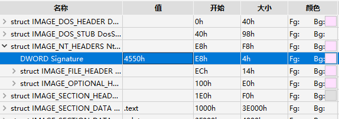

用ida打开该exe文件

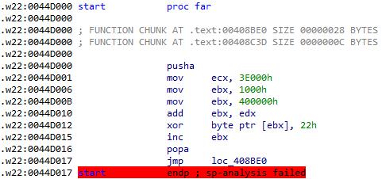

判断这是一个解密过程，即 为部分字节数据进行异或解密，用脚本进行解密。

```python
with open(r"C:\Users\hahbiubiubiu\Downloads\file\bingo.exe", 'rb') as f:    
    data = f.read() 
data = list(data) 
text_segment_size = 0x3E000 - 0x1000 
# 0x3E000是大小 
# 0x1000是偏移 
key = 0x22  
for i in range(0x1000, 0x1000 + text_segment_size):
    data[i] ^= key  
with open(r"C:\Users\hahbiubiubiu\Downloads\file\bing0_xor.exe", 'wb') as f: 
    f.write(bytes(data))
```

执行脚本后得到新的exe文件，ida打开它

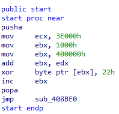

除了前面的异或，它跳到了0x408BE0的位置

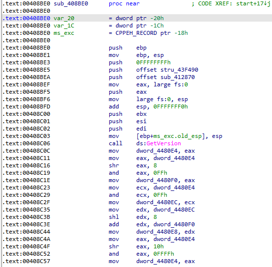

 Edit->Segments->Rebase Progarm...->修改value为0

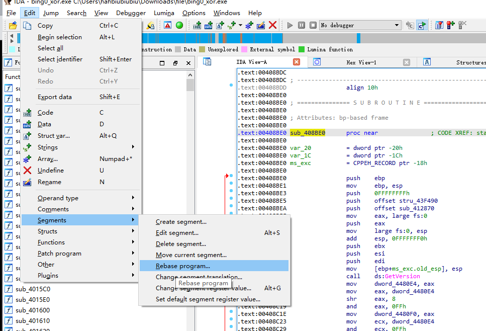

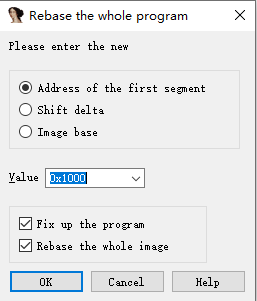

该函数地址修改为0x8BE0

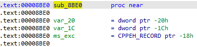

在010editor中修改程序入口点为0x8BE0

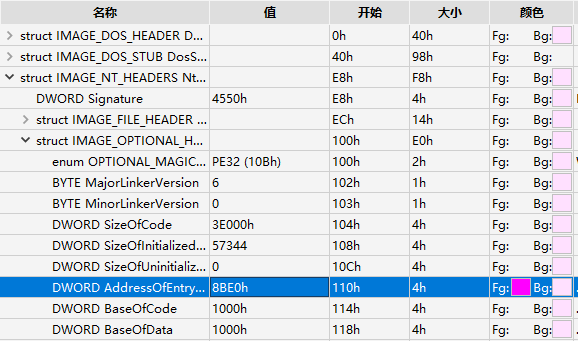

再次用ida打开exe文件发现程序多了两个main函数，main_0函数就是程序主逻辑

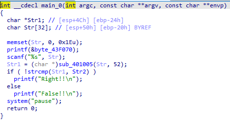

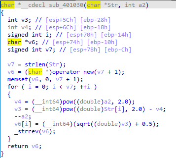

_strrev是对字符串进行倒转的函数，根据逻辑，写出脚本


```python
a = "zaciWjV!Xm[_XSqeThmegndq" 
b = 29 flag = "" 
for i in range(len(a)):
    t = math.sqrt(pow(ord(a[int(i/2)]), 2.0) + pow(b, 2.0)) + 0.5    
    k = int(t)    
    b += 1    
    flag += chr(k)    
    a = a[::-1] print(flag[::-1]) 
# flag{woc_6p_tql_moshifu}
```

# 汤姆的苹果

## 解题过程

首先，看**MainActivity**，猜测b中**handleMessage**是判断最终条件，**onClick**是检验flag方法

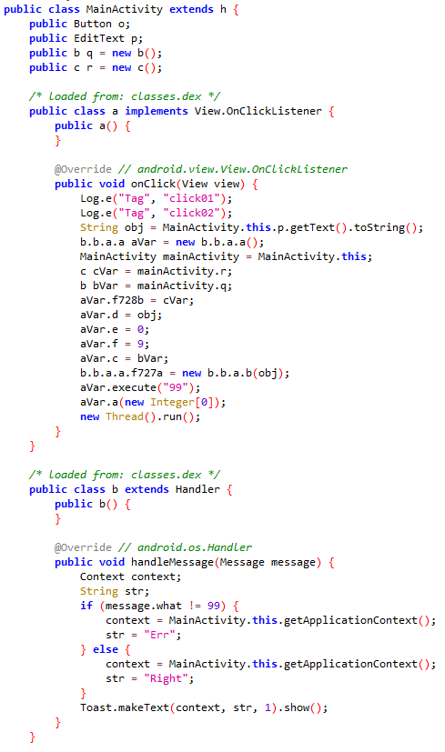

然后查看引用输入字符串obj的a类中，**doInBackground**应该是对输入字符串进行解密

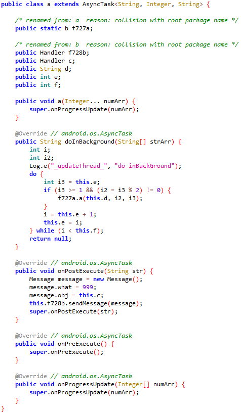

查看**doInBackground**引用的b类

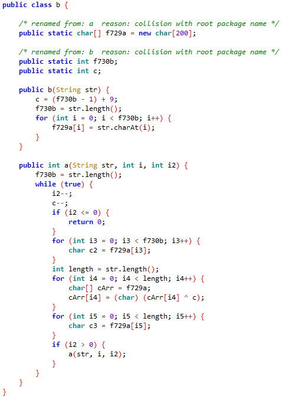

可以看出这是对字符串的一个异或

再去看a类中的**onPostExcute**方法，以及除了a、b类以外的c类，猜测这是一起为最后为检测结果进行判定的方法

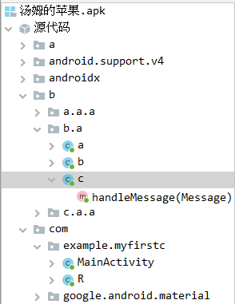

c类，可以看出这是一个比较结果的方法

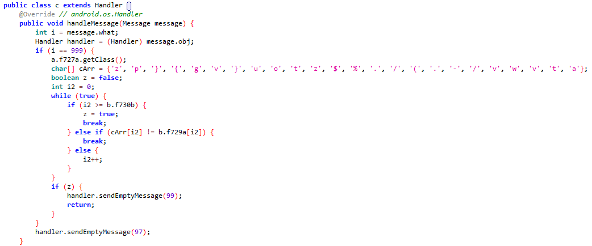

## 程序逻辑

输入flag-->进入a类不断进入b类进行循环-->进入c类进行结果比较

## 解题脚本

由于按照程序原本的逻辑，我写出的脚本无法生成flag，且网上暂时没有该题的writeup，我只好使用另一种方法。

程序的逻辑是将字符串不断地进行异或，最后的结果其实相当于进行一次异或，而这一次异或的数字是未知，因此可以写一个循环去爆破它。

```python
final = ['z', 'p', '}', '{', 'g', 'v', '}', 'u', 'o', 't', 'z', '$', '%', '.', '/', '(', '.', '-', '/', 'v', 'w', 'v',
         't', 'a']

for i in range(100):
    num = [0] * 24
    f = 0
    for q in range(len(final)):
        num[q] = (ord(final[q]) ^ i)
        if num[q] >= 128:
            f = 1
            break
        if num[q] <= 31:
            f = 1
            break
    if f == 1:
        break
    else:
        print("the i is: ", i)
        for t in num:
            print(chr(t), end="")
    print()
# 结果
# the i is:  27
# akf`|mfntoa?>543564mlmoz
# the i is:  28
# flag{jaishf89234213jkjh}
# the i is:  29
# gm`fzk`hrig98325302kjki|
# the i is:  30
# dnceyhckqjd:;016031hihj
# the i is:  31
# eobdxibjpke;:107120ihik~
```
