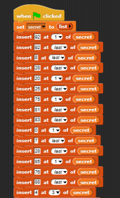
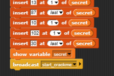
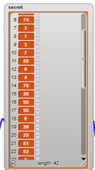
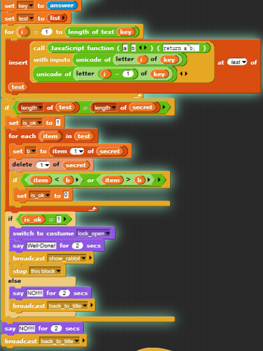
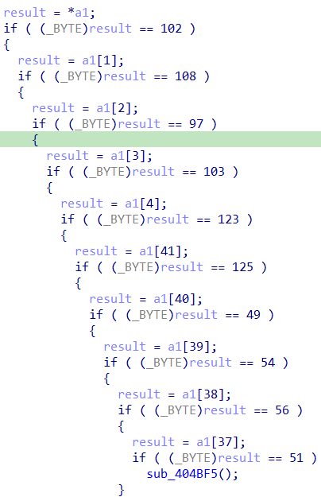
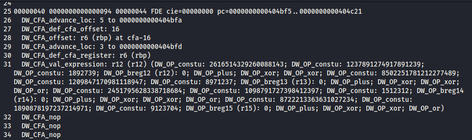
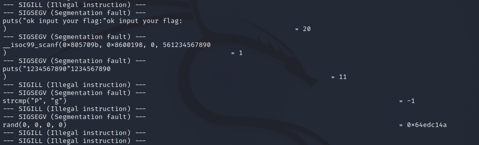
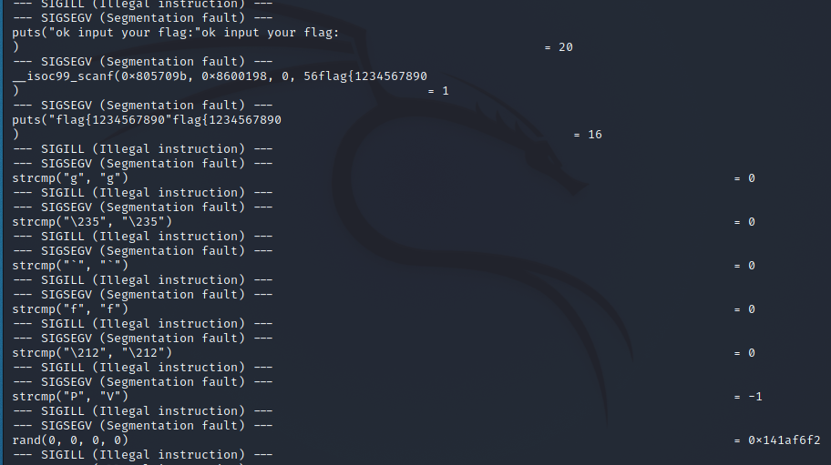
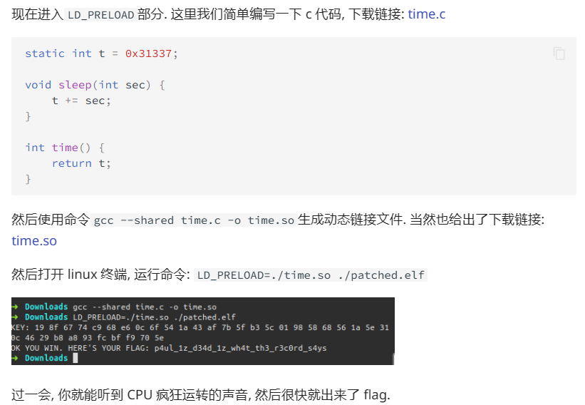

# babyre

snap.berkeley.edu打开xml文件。

修改设置`secret`变量的流程：



在其设置完`secret`后展示：



得到`secret`：



逆向如图所示的算法：



具体流程就是将输入的每两个字符进行异或，放置到`test`中，然后将`test[1:-1]`与`secret`比对

## exp

```python
data=[102,10,13,6,28,74,3,1,3,7,85,0,4,75,20,92,92,8,28,25,81,83,7,28,76,88,9,0,29,73,0,86,4,87,87,82,84,85,4,85,87,30]
for i in range(1,len(data)):
    data[i]^=data[i-1]
print(bytes(data))
```

# ezbyte



查看程序可以知道flag的前五位和后五位，然后将中间的分别放入r12、r13、r14、r15中，但之后的程序没有对r12有处理。

使用`readelf --debug-dump=frame ezbyte`或`readelf -Wwr ezbyte`获取Dwarf调试信息。



逻辑：

```
r12, r13, r14, r15 = 0, 0, 0, 0
r12 = (r12 + 1892739) ^ 1237891274917891239 ^ 2616514329260088143
r13 = (r13 + 8971237) ^ 1209847170981118947 ^ 8502251781212277489
r14 = (r14 + 1512312) ^ 1098791727398412397 ^ 2451795628338718684
r15 = (r15 + 9123704) ^ 1890878197237214971 ^ 8722213363631027234
r12 = r12 | r13 | r14 | r15
```

最后结果应该是0。

# moveAside

## 方法一

mov混淆，我不会。

但看wp和调试可以发现，程序应该是一个个字符变换，且用strcmp比较，在strcmp下断点，可以在栈中找到要比较的两个字符。

也可以使用`ltrace`获取程序的系统调用：

执行了一次`strcmp`就结束了：



执行了六次`strcmp`才结束：



### 构造输入输出表

可以输入`0123456789abcdefghijklmnopqrstuvwxyz{}-111`尝试获取输入输出表，且记录要比较的字符，并且每次比较时将更改变换后的字符使其比较成功。

```
print("table:",Byte(0x8600154),Byte(0x860014C))
PatchByte(0x8600154,Byte(0x860014C))
```

### exp

```python
table = []
final = []
input = "0123456789abcdefghijklmnopqrstuvwxyz{}-"
with open('ciscn2023/out.txt', 'r') as f:
    while True:
        line = f.readline()
        if not line:
            break
        if line.startswith("table"):
            lines = line.split()
            table.append(int(lines[1]))
            final.append(int(lines[2]))
print(table)
print(final)
flag = ""
for i in range(len(final)):
    for j in range(len(table) - 3):
        if final[i] == table[j]:
            flag += input[j]
print(flag)
# flag{781dda4e-d910-4f06-8f5b-5c3755182337}
```

## 方法二

[[CTF\][Reverse] 使用LD_PRELOAD进行hook，逐位爆破_哔哩哔哩_bilibili](https://www.bilibili.com/video/BV198411v7tg/?spm_id_from=333.1007.0.0&vd_source=1e92ba19a2288fc56c35e0d3dcf15345)

使用LD_PRELOAD hook掉strcmp。



```C
#include <stdio.h>
int strcmp(const char* s1, const char* s2){
    printf("strcmp called!\n");
    while(*s1 && (*s1 == *s2)){
        s1++;
        s2++;
    }
    return *s1 - *s2;
}
```

之后编译使用：

```
gcc -m32 -shared -02 mystrcmp.c -o mystrcmp.so
LD_PRELOAD=ciscn2023/mystrcmp.so ciscn2023/moveAside
```

这样就会使程序每次使用strcmp的时候都会打印“strcmp called!” ，可利用这个来爆破。

```python
from pwn import *
import string
ans = ''
for i in range(42):
    for ch in string.printable:
        current_flag = ans + ch
        print(current_flag)
        p = process("ciscn2023/moveAside", enc={'LD_PRELOAD': 'ciscn2023/mystrcmp.so'})
        p.recvline()
        p.sendline(current_flag.encode())
        recv = p.recvall(timeout=0.01)
        recvs = recv.splitlines()
        if len(revcs) > len(ans) + 2:
            ans += ch
            break
```

# ezAndroid

不会，做的时候完全不知道要干嘛，看了wp才稍微懂些。

贴个其他师傅的wp👉[CISCN2023 wp | 心流 (natro92.github.io)](https://natro92.github.io/2023/05/29/CISCN2023 wp/index.html)

# flutterror

不会，再贴个其他师傅比较取巧的思路👉[CISCN 2023 RE WP](https://www.cnblogs.com/lordtianqiyi/articles/17438974.html)
