各位✌的writeup：

👉[2023 AntCTF x D^3CTF 亚军 Writeup By S1uM4in)](https://fq6p9pyo5tt.feishu.cn/docx/InUFdQUKdozf8yx5IhGcf5zInSe)

👉[2023 D^3CTF writeup by 万年三等奖](https://mp.weixin.qq.com/s?__biz=Mzg4MjcxMTAwMQ==&mid=2247486967&idx=1&sn=ad55ddd11c6bfa17843270625f5f92fc&chksm=cf53cd41f8244457c2db68626c91f2e4564d756b903222f3a913e89f211d475418864c5041bc&mpshare=1&scene=23&srcid=0501bEUrW8ydbpm175TL5FFn&sharer_sharetime=1682949687637&sharer_shareid=6eea79ff6da57fc6752ab0bc570bf392#rd)

👉还有个官方的wp，就不放了

# d3syscall

首先看main，大概逻辑就是输入flag，检测。

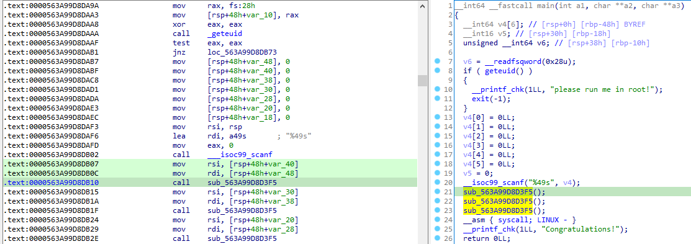

sub_D3F5就是检测函数。

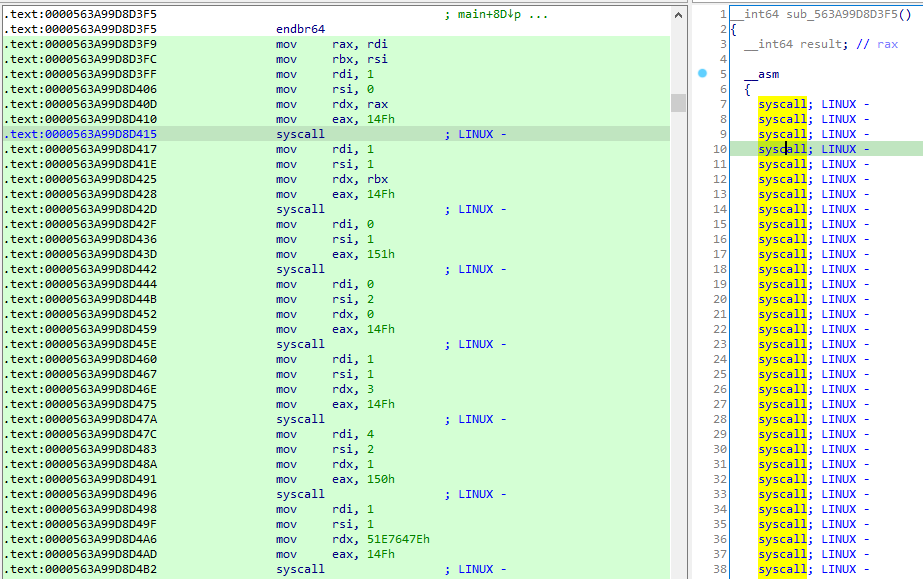

是syscall进行的系统调用，调用的操作由eax的值决定。

因此需要看syscall的调用有什么。

来到sub_1830，这里有对数据段取非，并写文件的操作，还有对字符串异或的操作。

但其实我并不知道为什么程序会来到这里，还是需要系统地学习一下程序执行的流程等知识啊。

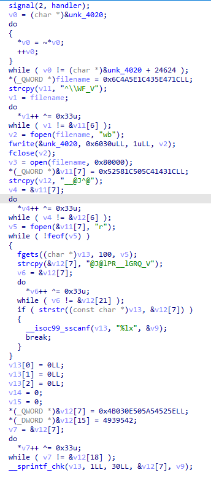

对unk_4020数据段的取非操作，可以在动态调试下直接把结果dump出来，看文件头可以知道是一个新的ELF文件。

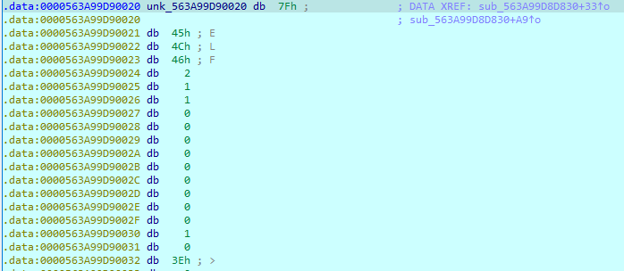

也可以使用生成的文件，路径为`/tmp/my_module`。

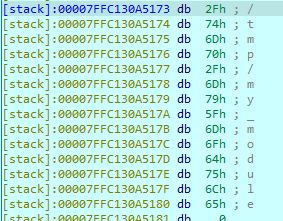

在dump文件的init_module函数中，猜测就是更改系统调用表的过程。

v4的下表对应检测函数每一个syscall的eax取值。

> 程序首先从`/proc/kallsyms`中获取了系统调用表的地址，通过参数传递到内核模块中，内核模块里注册了`Linux`保留的系统调用，分别为：335：MOV，336：ALU，337：PUSH，338：POP，339：resetreg，340：checkflag。

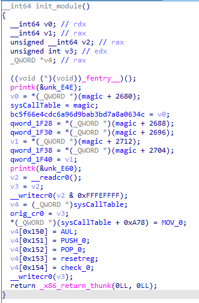

一共更改了五个系统调用。

MOV调用：

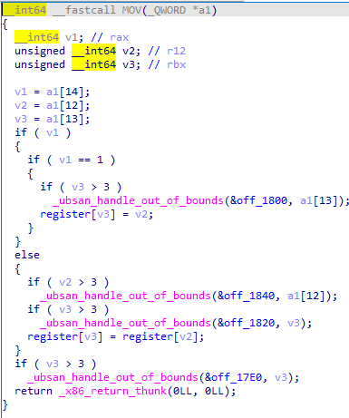

PUSH调用：

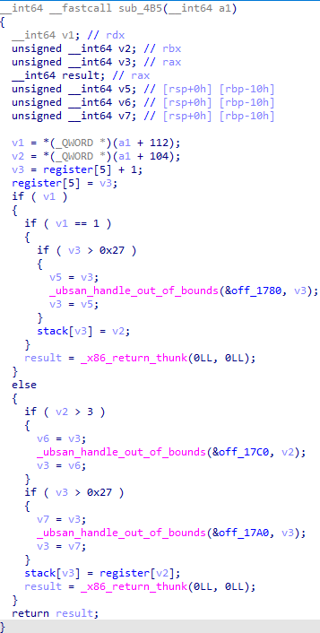

POP调用：

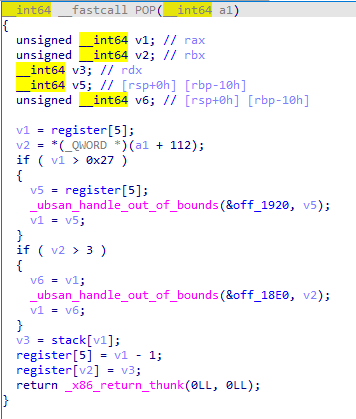

resetreg调用：

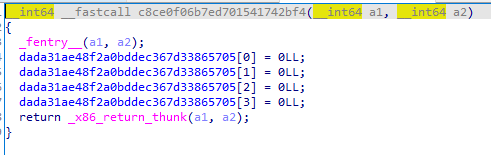

checkflag调用：

将v4与处理过后的输入作比较，进行检测。

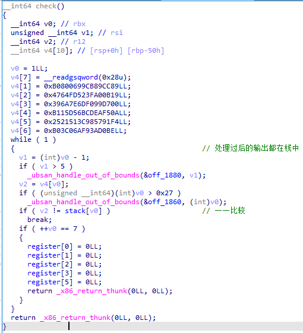

运算操作：

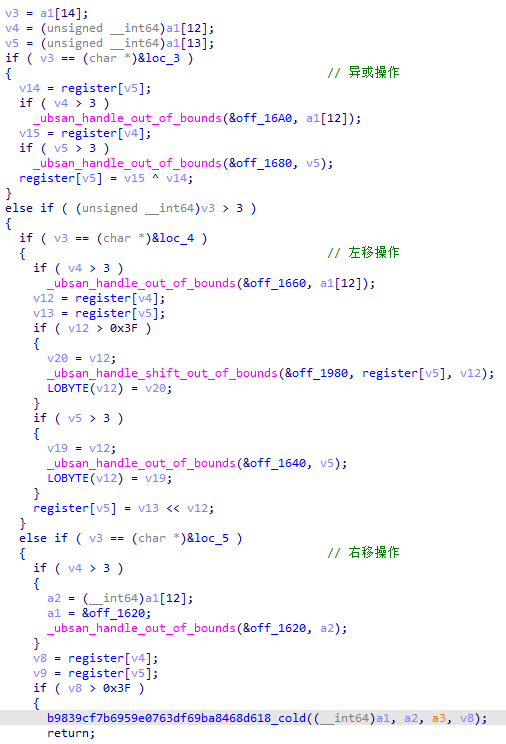

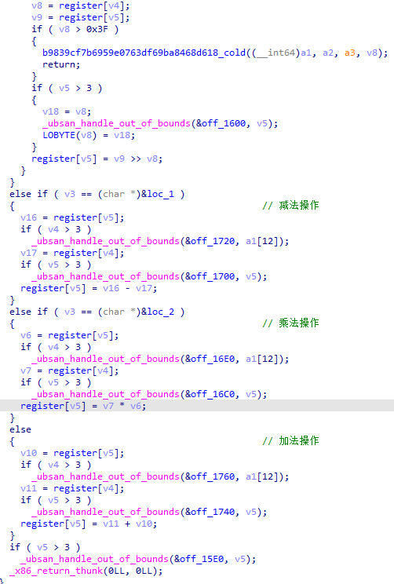

知道了调用，现在只需要知道调用的流程就可以了。

wp里给出了一个十分方便的方法：使用strace。(但其实根据汇编来看也行，但很麻烦)

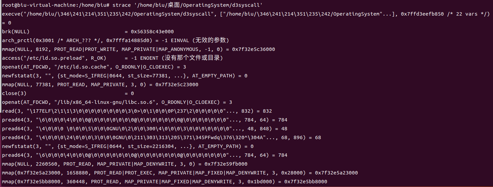

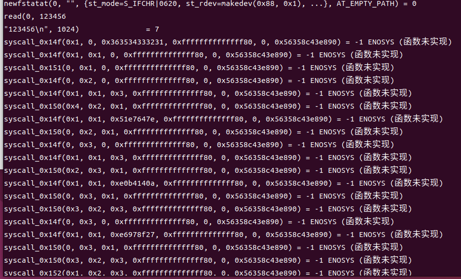

将结果部分进行修改，再代入wp中的脚本中可以清楚地看到检测的逻辑：

```Python
bytecode = [
    [0x14f, 0x1, 0, 0x3837363534333231, 0, 0x5564c32f4027, 0x7fd40816fa80],
    [0x14f, 0x1, 0x1, 0x6665646362613039, 0, 0x5564c32f4027, 0x7fd40816fa80],
    [0x151, 0, 0x1, 0x6665646362613039, 0, 0x5564c32f4027, 0x7fd40816fa80],
    ...
]


def mov(code):
    match code[1]:
        case 0:
            print(f"mov reg[{code[2]}],reg[{code[3]}]")
        case 1:
            print(f"mov reg[{code[2]}],{hex(code[3])}")


def alu(code):
    match code[1]:
        case 0:
            print(f"add reg[{code[2]}],reg[{code[3]}]")
        case 1:
            print(f"sub reg[{code[2]}],reg[{code[3]}]")
        case 2:
            print(f"mul reg[{code[2]}],reg[{code[3]}]")
        case 3:
            print(f"xor reg[{code[2]}],reg[{code[3]}]")
        case 4:
            print(f"shl reg[{code[2]}],reg[{code[3]}]")
        case 5:
            print(f"shr reg[{code[2]}],reg[{code[3]}]")


def push(code):
    match code[1]:
        case 0:
            print(f"push reg[{code[2]}]")
        case 1:
            print(f"push {hex(code[2])}")


def pop(code):
    print(f"pop reg[{code[1]}]")


for i in bytecode:
    match i[0]:
        case 335:
            mov(i)
        case 336:
            alu(i)
        case 337:
            push(i)
        case 338:
            pop(i)
        case 339:
            print("resetreg")
        case 340:
            print("checkflag")
```

在对逻辑的代码重新整理得到：

```
input = [32bit] * 6
stack = []
r0 = input[0]
r1 = input[1]
stack.append(r1)
r2 = r0 << 3 + 0x51e7647e
r3 = r0 * 3 + 0xe0b4140a
r2 = r2 ^ r3
r2 ^= (r0 + 0xe6978f27)
stack.pop()
r1 = r1 + r2
stack.append(r1)
stack.append(r0)
r2 = r1 << 6 + 0x53a35337
r3 = r1 * 5 + 0x9840294d
r2 = r2 ^ r3
r3 = r1 - 0x5eae4751
r2 = r2 ^ r3
stack.pop(r0)
stack.append(r0 + r2)

r0 = input[2]
r1 = input[3]
stack.append(0)
r2 = r0 << 3 + 0x51e7647e
r3 = r0 * 3 + 0xe0b4140a
r2 = r2 ^ r3
r2 ^= (r0 + 0xe6978f27)
stack.pop(r1)
r1 += r2
stack.append(r1)
stack.append(r0)
r2 = r1 << 6 + 0x53a35337
r3 = r1 * 5 + 0x9840294d
r2 = r2 ^ r3
r2 ^= r1 - 0x5eae4751
stack.pop(r0)
r0 += r2
stack.append(r0)

r0 = input[4]
r1 = input[5]
stack.append(r1)
r2 = r0 << 3 + 0x51e7647e
r3 = r0 * 3 + 0xe0b4140a
r2 = r2 ^ r3
r2 ^= r0 + 0xe6978f27
stack.pop(r1)
r1 += r2
stack.append(r1)
stack.append(r0)
r2 = r1 << 6 + 0x53a35337
r3 = r1 * 5 + 0x9840294d
r2 = r2 ^ r3
r2 ^= r1 - 0x5eae4751
stack.pop(r0)
r0 += r2
stack.append(r0)
```

然后就可以写脚本得到flag了。👈官方的wp  (ㄒoㄒ)

```python
v4 = [0]*7
v4[1] = 0xB0800699CB89CC89
v4[2] = 0x4764FD523FA00B19
v4[3] = 0x396A7E6DF099D700
v4[4] = 0xB115D56BCDEAF50A
v4[5] = 0x2521513C985791F4
v4[6] = 0xB03C06AF93AD0BE
for i in range(1, 7, 2):
enc_result = v4[i]
half_1 = v4[i+1] - (((enc_result << 6) + 0x53A35337) ^ (enc_result * 5 +
0x9840294D) ^ (enc_result - 0x5EAE4751))
half_1 &= 0xffffffffffffffff
print(half_1.to_bytes(8, 'little').decode(), end='')
half_2 = enc_result - ((((half_1 << 3) + 0x51E7647E) ^ ((half_1 * 3) +
0x0E0B4140A)) ^ (half_1 + 0xE6978F27))
half_2 &= 0xffffffffffffffff
print(half_2.to_bytes(8, 'little').decode(), end='')
print()
# d3ctf{cef9b994-2547-4844-ac0d-a097b75806a0}
```

# d3Hell

## 分析dll

其实，程序与dll的具体关系我还没搞懂，程序在哪里调用的dll我还不清楚，因此跟着wp提示走。

首先，看DllMain：

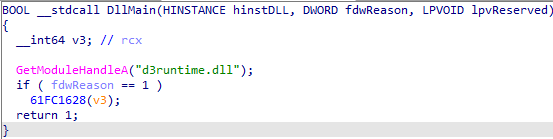

无论程序如何调用，64FC1628函数一定被调用了，因此查看64FC1628：

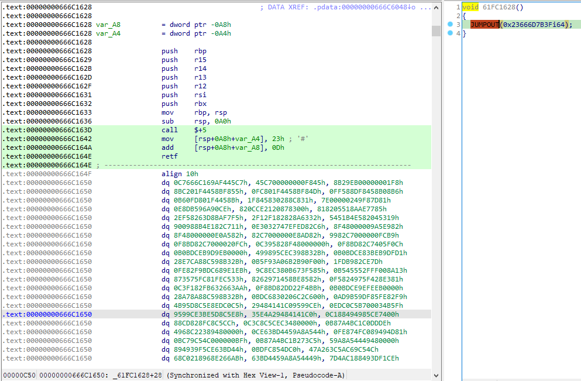

经wp提示，这里使用了天堂之门（可以从`call $+5;`,`mov [ ], 23`,`retf`观察出），即：

- `call $+5`：跳到下一条指令，call指令大小为5，同时将0x666C1642地址入栈；

- `mov [rsp+0xA8-0xA4], 23h`：将栈顶16位数据的前八位变成0x23
- `add [rsp+0xA8-0xA8], 0Dh`：将栈顶16位数据 += 0x0D，使其retf返回地址指向0x666C164E
- `retf`：远返回，该指令会从栈顶取出一个返回地址，再取出一个cs段选择子，这里的CS段变成了0x23，返回地址为0x666C164E，然后开始以32位模式开始0x666C164E处的指令

具体了解天堂之门，看这位✌ [天堂之门 (Heaven's Gate) C语言实现

这段32位的指令具体多长目前还不确定，所以先都dump下来，让capstone翻译成32位指令。

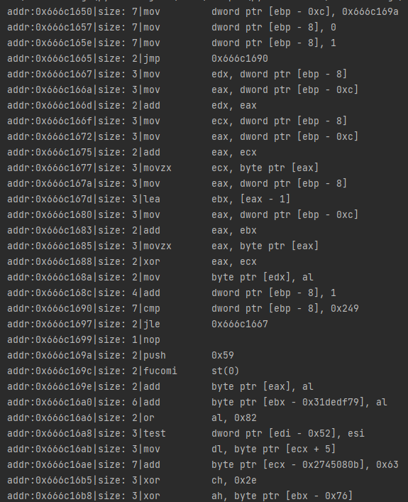

很明显，前一部分的代码是在异或`0x666c169a - 0x666c18ea`这部分，

因此，手动异或后再翻译：

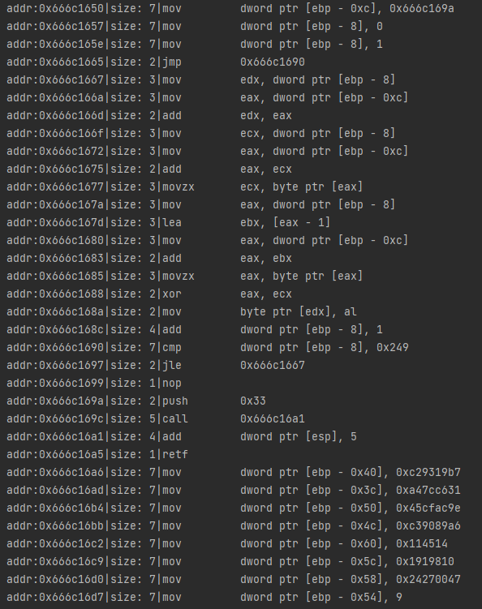

`0x666c169a - 0x666c16a5`的代码是回到64位模式，因此将之后的部分用64位解释。

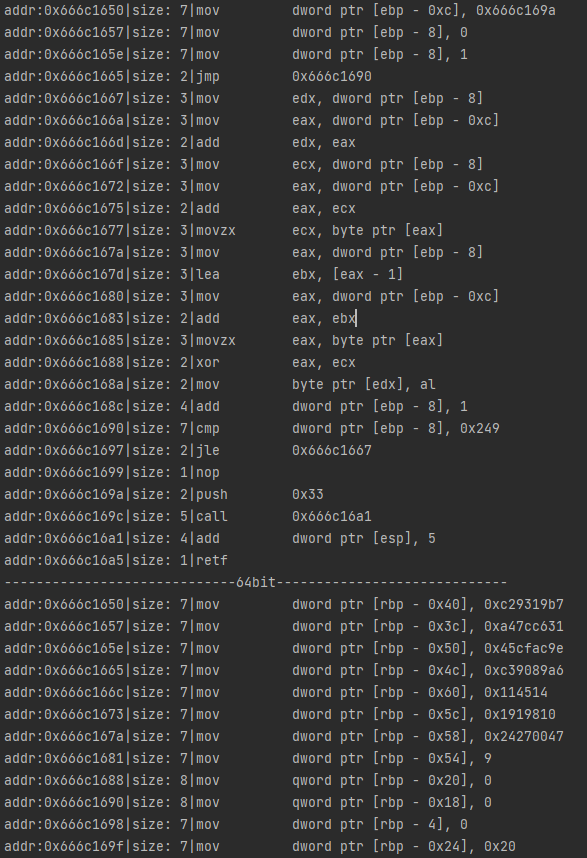

为了方便分析，将以上的处理在ida写脚本处理，然后nop掉异或数据以及模式转换部分的代码。

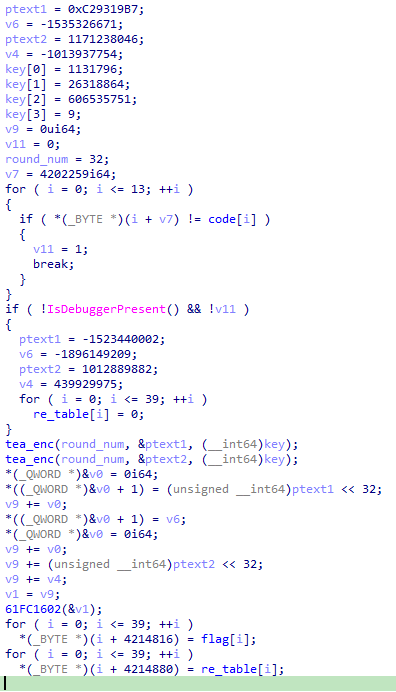

彻底得到函数逻辑了，但`61FC1602()`这个函数分析起来好麻烦（感觉是一个将数转化为十进制字符串的过程），所以动态获取flag结果：698740305822331500978964939673142241。

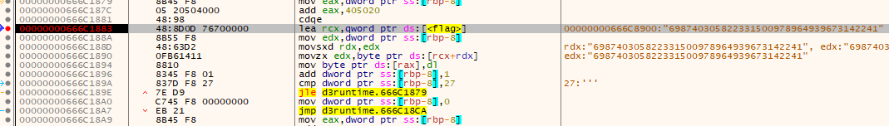

注意：

1. 这个flag结果将放在exe的`0x405020`。

2. `61FC1628()`有检查4,202,264 = 0x401f18 地址部分的数据，因此如果要修改Sleep代码，则需要修改下dll。

   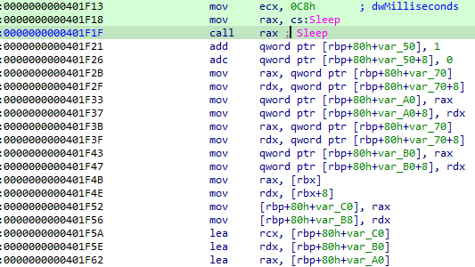

## 分析exe

这个程序光是看着就头大，所以就从dll获取的flag调小，去看看每个函数的大概作用。

这里将flag调为 0x1ED = 17 * 29，然后一个个函数大概看看结果啥的。

因此，大概逻辑就是将flag分解为两个约数，然后都输出十进制数出来。👈这些是wp中说的，我还没分析出来呢

（具体分析看看有没时间吧  (ㄒoㄒ））

根据wp，可以跳过最耗费时间的`401E64`（应该是求约数的函数）然后将xmm0寄存器改为flag的两个约数之一。

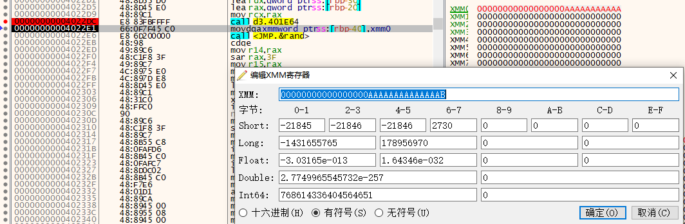

得到flag：

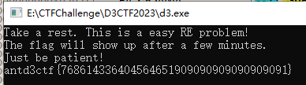
