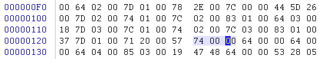

## re2

`v3`解密数据，数据以`ELF`开头，后面程序会自动dump出来的。

```C
__int64 __fastcall main(int a1, char **a2, char **a3)
{
    void *v3; // rdi
    sub_400A26("\x1B[31mUse emergency communication password: help me!", a2, a3);
    v3 = mmap(0LL, 0x10000uLL, 7, 34, 0, 0LL);
    memcpy(v3, sub_400EF0, 0xE9uLL);
    ((void (*)(void))v3)();
    sub_400CFC();
    sub_400BAE();
    return 0LL;
}
```

开启子进程执行`ELF`，同时给父进程调式，父进程将`0x6020AC`的数据改为`7`，即子进程的密钥位置。

```C
__int64 sub_400BAE()
{
    v5 = __readfsqword(0x28u);
    memset(&v3[224], 0, 0x58uLL);
    v4 = 0;
    pid__ = fork();
    pid = pid__;
    if ( pid__ == -1 )
        exit(1);
    if ( pid__ )
    {
        wait(0LL);
        if ( ptrace(PTRACE_GETREGS, pid, 0LL, v3) < 0 )
        {
            perror("ptrace(GETREGS):");
            exit(1);
        }
        ptrace(PTRACE_POKEDATA, pid, &unk_6020AC, 7LL); // 写入数据
        ptrace(PTRACE_CONT, pid, 0LL, 0LL); // 子进程恢复执行
        wait(0LL);
    }
    else
    {
        ptrace(PTRACE_TRACEME, 0LL, 0LL, 0LL);
        execl("./core", "./core", 0LL);
    }
    return 0LL;
}
```

子进程解flag逻辑，是个TEA解密，只是密钥需要父进程写入一下。

```C
__int64 sub_400914()
{
    v2 = (unsigned int *)byte_6020C0;
    for ( i = 0; i <= 3; ++i )
    {
        TEA(v2, dword_6020A0);
        result = 8LL;
        v2 += 2;
    }
    return result;
}
```

### exp

```Python
def tea_dec(cipher, key):
    num = 0xE3779B90
    for i in range(16):
        cipher[1] -= ((num + cipher[0]) ^ ((cipher[0] << 4) + key[2]) ^ ((cipher[0] >> 5) + key[3])) & 0xFFFFFFFF
        cipher[1] &= 0xFFFFFFFF
        cipher[0] -= ((num + cipher[1]) ^ ((cipher[1] << 4) + key[0]) ^ ((cipher[1] >> 5) + key[1])) & 0xFFFFFFFF
        cipher[0] &= 0xFFFFFFFF
        num = (num + 0x61C88647) & 0xFFFFFFFF
    return cipher


cipher = [
    0xF7, 0xBE, 0x1D, 0xC1, 0x95, 0xB3, 0xC2, 0x62, 0x16, 0x33,
    0x9B, 0x3B, 0xBB, 0x54, 0xE2, 0x69, 0xA6, 0xCC, 0x20, 0xC1,
    0x4E, 0x44, 0x79, 0x37, 0x6B, 0x6E, 0x93, 0x6B, 0xB5, 0x77,
    0xC2, 0x35
]
key = [6, 9, 0, 7, 0, 0, 0, 0]
import struct 
cipher = list(struct.unpack('<8I', bytes(cipher)))
for i in range(len(cipher) // 2):
    cipher[i * 2:i * 2 + 2] = tea_dec(cipher[i * 2:i * 2 + 2], key)
print(struct.pack('<8I', *cipher))
```

## re3

`pyc`文件反编译出字节码让GPT去生成代码：

```Python
#!/usr/bin/env python
# visit https://tool.lu/pyc/ for more information
# Version: Python 2.7
import base64

def flag1():
    code = str[::-3]
    result = ''
    for i in code:
        ss = ord(i) - 1
        result += chr(ss)
    print result[::-1]


def flag2():
    code = str[::-2]
    result = ''
    for i in code:
        ss = ord(i) - 1
        result += chr(ss)
    
    print result[::-2]


def flag3():
    code = base64.b64decode(str[::-1])
    result = ''
    for i in code:
        ss = ord(i) - 1
        result += chr(ss)
    print result[::-1]


str = '=cWbihGfyMzNllzZ' + '0cjZzMW'+'N5cTM4Y'+'jYygTOy'+'cmNycWNyYmM1Ujf'
flag = '0cjZzMW'+'N5cTM4Y'+'jYygTOy'+'cmNycWNyYmM1Ujf'
flag1()
```

有点不太对劲的，改改字节码，尝试执行：

```shell
┌──(biu㉿Biu)-[~/Desktop]
└─$ python2 op.py | grep CALL_FUNCTION
0x83 CALL_FUNCTION
0x8d CALL_FUNCTION_KW
0x8c CALL_FUNCTION_VAR
0x8e CALL_FUNCTION_VAR_KW
                                                        
┌──(biu㉿Biu)-[~/Desktop]
└─$ python2 op.py | grep LOAD_NAME    
0x65 LOAD_NAME

# 65 02 就是CALL flag1
# 把 02 修改成 03 即可执行 CALL flag2
```


```Python
flag1输出：ifxMVX0e
flag2输出：XNMMLe
flag3报错，输出不出来...
```

更改字节码，把`flag1`的`LOAD_FAST 1: result`改为`LOAD_GLOBAL 0: str`，输出str的逆序：`fjU1MmYyNWcyNmcyOTgyYj`



然后，就看不懂了......

```Python
# str = '=cWbi' + 'hGfyM' + 'zNllzZ' + '0cjZzMW' + 'N5cTM4Y' + 'jYygTOy' + 'cmNycWNyYmM1Ujf'
# print(base64.b64decode(str[::-1]))
# b'~552f25g26g2982b681795c3f74g9e732|hbmg'
# 552f25g26g2982b681795c3f74g9e732

import base64

def flag1():
    code = str[::-3]
    result = ''
    for i in code:
        ss = ord(i) - 1
        result += chr(ss)
    return result[::-1]


def flag2():
    code = str[::-2]
    result = ''
    for i in code:
        ss = ord(i) - 1
        result += chr(ss)
    return result[::-2]


def flag3():
    code = base64.b64decode(str[::-1])
    result = ''
    for i in code:
        ss = ord(i) - 1
        result += chr(ss)
    return result[::-1]

str = "jYygTOycmNycWNyYmM1Ujf"
print(flag1()) #  ifxMVX0e
print(flag2()) #  XNMMLe
print(flag3()) #  
```
