# ez_cpp

## 正向逻辑：

```python
def reverse_bit(num, bit):
    result = 0
    for i in range(bit):
        result |= ((num >> i) & 1) << (bit - i - 1)
    return result
b = "SYC{xxxxxxxxxxxxxxxxxxxxxxxx}"
d = []
c = 0x1EF035
for i in range(len(b)):
    eax = (c & 0xFFFF00) + ord(b[i]) - 0x3D
    if eax & 0xFF < 0x3E:
        v7 = ord(b[i]) + 13
        if ord(b[i]) > 0x5A:
            if ord(b[i]) + 13 <= 0x7A:
                d.append(ord(b[i]) + 13)
            else:
                d.append(ord(b[i]) - 13)
        else:
            if ord(b[i]) + 13 <= 0x5A:
                d.append(ord(b[i]) + 13)
            else:
                d.append(ord(b[i]) - 13)
    else:
        d.append(ord(b[i]))
str2 = []
v6 = [0, 1, 0, 1, 0, 0, 1, 0, 1, 0, 1, 1, 1, 1, 1, 1, 0, 0, 0, 0, 0, 0, 1, 1, 0, 1, 0, 0, 1, 1, 1, 0]
for i in range(32):
    if i == 16:
        str2.append(d[i] ^ 4)
    elif i < 16:
        if v6[i] == 1:
            str2.append(d[i] ^ 9)
        else:
            str2.append(d[i] - 2)
    elif i > 16:
        if v6[i] == 1:
            str2.append(d[i] ^ 6)
        else:
            str2.append(d[i] - 5)
for i in range(32):
    str2[i] = 1 ^ (reverse_bit(str2[i], 8) + 1)
print("".join(hex(i)[2:] + " " for i in str2))
```

## 逆向逻辑

其中第一个加密用可见字符输入得到可见字符输出来逆，因此可能产生一个字符对应多个，所以筛掉看上去不像的就好了。

```python
def reverse_bit(num, bit):
    result = 0
    for i in range(bit):
        result |= ((num >> i) & 1) << (bit - i - 1)
    return result
v6 = [0, 1, 0, 1, 0, 0, 1, 0, 1, 0, 1, 1, 1, 1, 1, 1, 0, 0, 0, 0, 0, 0, 1, 1, 0, 1, 0, 0, 1, 1, 1, 0]
result = [0x00000022, 0xFFFFFFA2, 0x00000072, 0xFFFFFFE6, 0x00000052, 0xFFFFFF8C, 0xFFFFFFF2, 0xFFFFFFD4, 0xFFFFFFA6,
          0x0000000A, 0x0000003C, 0x00000024, 0xFFFFFFA6, 0xFFFFFF9C, 0xFFFFFF86, 0x00000024, 0x00000042, 0xFFFFFFD4,
          0x00000022, 0xFFFFFFB6, 0x00000014, 0x00000042, 0xFFFFFFCE, 0xFFFFFFAC, 0x00000014, 0x0000006A, 0x0000002C,
          0x0000007C, 0xFFFFFFE4, 0xFFFFFFE4, 0xFFFFFFE4, 0x0000001E]
for i in range(32):
    result[i] = result[i] & 0xFF
for i in range(32):
    result[i] = reverse_bit((result[i] ^ 1) - 1, 8)
for i in range(32):
    if i == 16:
        result[i] ^= 4
    elif i < 16:
        if v6[i] == 1:
            result[i] ^= 9
        else:
            result[i] += 2
    else:
        if v6[i] == 1:
            result[i] ^= 6
        else:
            result[i] += 5
flag = []
c1 = [i for i in range(32, 128)]
c2 = [32, 33, 34, 35, 36, 37, 38, 39, 40, 41, 42, 43, 44, 45, 46, 47, 48, 49, 50, 51, 52, 53, 54, 55, 56, 57, 58, 59,
      60, 74, 75, 76, 77, 78, 79, 80, 81, 82, 83, 84, 85, 86, 87, 88, 89, 90, 65, 66, 67, 68, 69, 70, 71, 72, 73, 74,
      75, 76, 77, 104, 105, 106, 107, 108, 109, 110, 111, 112, 113, 114, 115, 116, 117, 118, 119, 120, 121, 122, 97,
      98, 99, 100, 101, 102, 103, 104, 105, 106, 107, 108, 109, 123, 124, 125, 126, 127]
for i in range(32):
    for j in range(len(c2)):
        if result[i] == c2[j]:
            flag.append(c1[j])
    flag.append(ord("\n"))
print("".join(chr(i) for i in flag))
# SYC{Y3S-yE5-y0u-S0Ve-Th3-C9P!!!}
```

## 其他师傅WP的思路

具体可看 👉 [2023 安洵杯SYCTF writeup by Arr3stY0u](https://mp.weixin.qq.com/s?__biz=Mzg4MjcxMTAwMQ==&mid=2247487028&idx=1&sn=4a73d839a64b6c1071c519ed2195aa25&chksm=cf53ce82f8244794da9dd9b9034709ee5e71d8b3931a75fd87ac31d450869f87411054ea3ed9&mpshare=1&scene=23&srcid=0611rfRKf6I8RnGhn24J0TzY&sharer_sharetime=1686452556948&sharer_shareid=6eea79ff6da57fc6752ab0bc570bf392#rd)

由于整体的加密过程是单个字符的加密，因此可以通过爆破一个个字符来得到flag。

方法：patch掉部分代码，使`exitcode`为符合条件的字符数。

原代码：

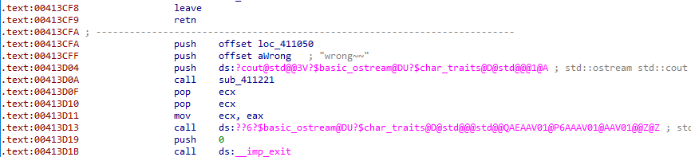

patch后的代码：

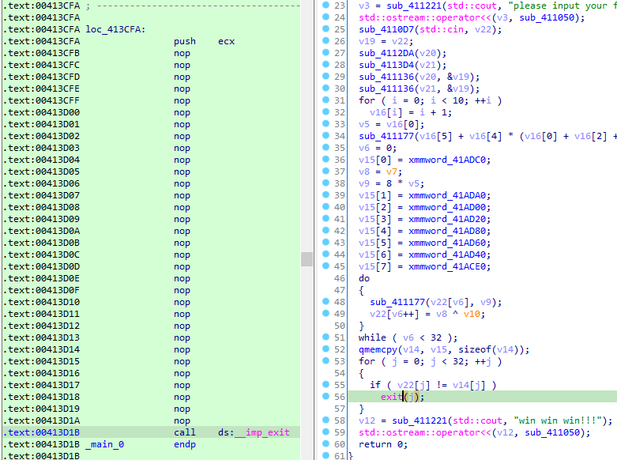

爆破脚本：

```python
import string
import os
import time
table = string.ascii_letters+string.digits+'!-{}'
theflag = ''
while len(theflag) < 32:
    for ch in table:
        flag = (theflag+ch).ljust(32, '#')
        exitcode = os.system(f"echo {flag} | ez_cpp.exe 1>&0")
        print("try: " + theflag + ch + " exitcode:" + hex(exitcode))
        if exitcode >= len(theflag) + 1:
            theflag += ch
            print(theflag, exitcode)
            break
    else:
        print(theflag + 'not found')
    time.sleep(0.1)
```

# 3D_Maze

了解逻辑，获取迷宫后手动走走（注意：z的顺序是有要求的）：

```python
maze = [
    0, 0, 1, 0, 0, 0, 0, 0, 0, 0, 0, 0, 1, 0, 0, 0, 0, 1, 0, 0, 0, 0, 1, 0, 1, 1, 1, 1, 0, 0, 0, 0, 1, 0, 1, 0, 0, 0, 0,
    0, 0, 0, 1, 0, 1, 1, 1, 1, 1, 1, 0, 0, 1, 0, 1, 0, 0, 0, 0, 0, 0, 0, 1, 1, 1, 1, 1, 1, 1, 1, 0, 0, 5, 0, 1, 0, 0, 0,
    0, 0, 0, 0, 0, 3, 0, 0, 0, 0, 0, 0, 0, 0, 0, 1, 0, 0, 0, 0, 0, 0, 0, 0, 0, 0, 0, 0, 0, 0, 0, 0, 0, 1, 1, 1, 1, 0, 0,
    0, 0, 0, 0, 1, 0, 0, 1, 1, 1, 1, 1, 1, 0, 1, 0, 0, 0, 0, 0, 0, 0, 0, 1, 1, 0, 0, 0, 0, 0, 0, 0, 0, 0, 0, 0, 0, 0, 0,
    0, 0, 0, 0, 1, 1, 1, 1, 1, 0, 0, 0, 0, 0, 0, 0, 0, 0, 0, 0, 0, 0, 0, 0, 0, 0, 0, 0, 0, 0, 0, 0, 0, 0, 0, 0, 0, 0, 0,
    0, 0, 0, 0, 0, 1, 0, 0, 0, 0, 0, 0, 0, 0, 0, 1, 0, 0, 0, 0, 0, 0, 0, 0, 0, 1, 0, 0, 1, 0, 1, 0, 0, 0, 1, 0, 0, 1, 0,
    1, 0, 1, 0, 1, 0, 0, 0, 1, 0, 0, 0, 0, 1, 0, 0, 0, 0, 0, 1, 0, 0, 0, 1, 0, 0, 0, 0, 0, 0, 1, 0, 0, 1, 0, 0, 0, 0, 1,
    0, 1, 0, 0, 1, 0, 0, 0, 0, 0, 1, 0, 0, 0, 1, 0, 0, 0, 0, 0, 0, 0, 0, 0, 0, 0, 0, 0, 0, 1, 0, 0, 0, 0, 0, 0, 0, 0, 0,
    1, 0, 0, 0, 0, 0, 0, 0, 0, 0, 1, 0, 1, 1, 0, 0, 0, 0, 0, 0, 1, 1, 0, 0, 1, 0, 0, 0, 0, 0, 1, 1, 0, 0, 0, 0, 0, 0, 0,
    0, 1, 1, 0, 0, 0, 0, 0, 0, 0, 0, 1, 1, 0, 0, 1, 0, 0, 0, 0, 0, 1, 0, 1, 1, 0, 0, 0, 0, 0, 0, 1, 0, 0, 0, 0, 0, 0, 0,
    0, 0, 1, 0, 0, 0, 0, 0, 0, 0, 0, 0, 0, 0, 0, 0, 0, 0, 1, 1, 0, 0, 0, 0, 0, 0, 0, 0, 1, 0, 1, 1, 1, 1, 1, 1, 1, 1, 1,
    0, 0, 0, 0, 0, 0, 0, 0, 0, 0, 0, 0, 0, 0, 0, 0, 0, 0, 0, 0, 0, 0, 0, 0, 0, 0, 0, 0, 0, 0, 0, 0, 0, 0, 0, 0, 0, 0, 0,
    0, 0, 0, 0, 0, 0, 0, 0, 0, 0, 0, 0, 0, 0, 0, 0, 0, 0, 0, 0, 0, 0, 0, 0, 0, 0, 0, 0, 0, 0, 0, 0, 0, 0, 0, 1, 0, 0, 0,
    0, 0, 0, 0, 0, 0, 1, 0, 0, 0, 0, 0, 0, 0, 0, 0, 1, 0, 0, 0, 0, 0, 0, 0, 0, 0, 1, 0, 0, 0, 0, 0, 0, 0, 0, 0, 1, 0, 0,
    0, 0, 0, 0, 0, 0, 1, 1, 0, 0, 0, 0, 0, 0, 0, 0, 1, 0, 0, 0, 0, 0, 0, 0, 1, 1, 1, 0, 0, 0, 0, 0, 0, 0, 0, 0, 0, 0, 0,
    0, 0, 0, 0, 0, 0, 0, 0, 0, 0, 0, 0, 0, 0, 0,
]

for i in range(len(maze)):
    if i % 10 == 0:
        print()
    if i % 100 == 0:
        print("\nz="+ str(i//100))
    match maze[i]:
        case 0:
            print("=", end="")
        case 3:
            print("*", end="")
        case _:
            print(maze[i], end="")
# z=0
# ==1=======
# ==1====1==
# ==1=1111==
# ==1=1=====
# ==1=111111
# ==1=1=====
# ==11111111
# ==5=1=====
# ===*======
# ===1======
#
# wddwwdddddD
#
# z=1
# ==========
# =1111=====
# =1==111111
# =1========
# 11========
# ==========
# 11111=====
# ==========
# ==========
# ==========
#
# dwwwdddsdddddD
#
# z=2
# 1=========
# 1=========
# 1==1=1===1
# ==1=1=1=1=
# ==1====1==
# ===1===1==
# ====1==1==
# ==1=1==1==
# ===1===1==
# ==========
#
# wwW
#
# z=4
# ========11
# ========1=
# 111111111=
# ==========
# ==========
# ==========
# ==========
# ==========
# ==========
# ==========
#
# assaaaaaaaaA
#
# z=3
# ==1=======
# ==1=======
# ==1=11====
# ==11==1===
# ==11======
# ==11======
# ==11==1===
# ==1=11====
# ==1=======
# ==1=======
#
# sssssssssS
#
# z=5
# ===1======
# ===1======
# ===1======
# ===1======
# ===1======
# ==11======
# ==1=======
# 111=======
# ==========
# ==========
#
# dddwwdwwwwwW
# w
# wddwwdddddDdwwwdddsdddddDwwWassaaaaaaaaAsssssssssSddwwdwwwwwWw
```

# ezr3

## 脱壳

加了壳，但是特征码被覆盖了，改回UPX，然后脱壳：

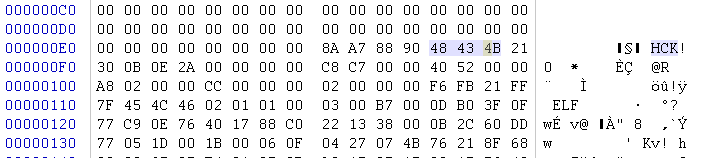

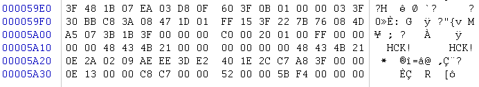

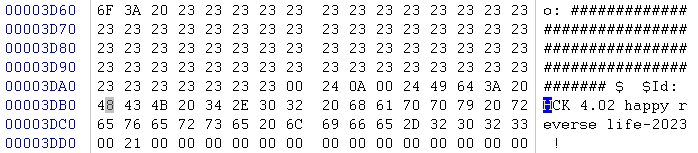

其中 ‘#’ 的数据：

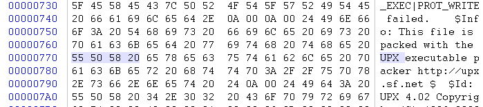

## 程序逻辑

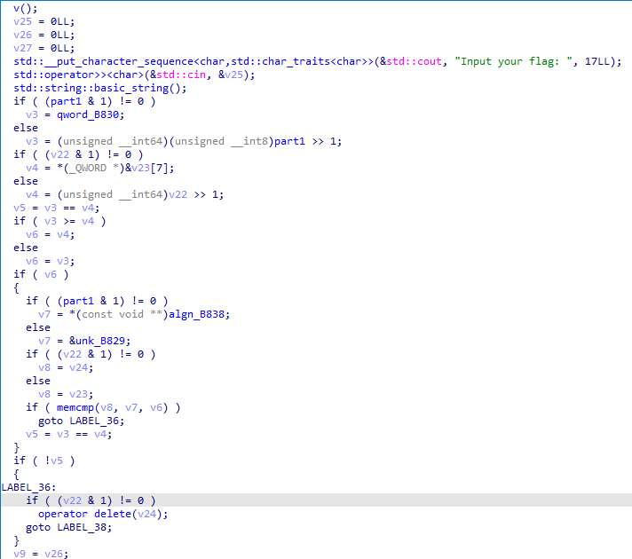

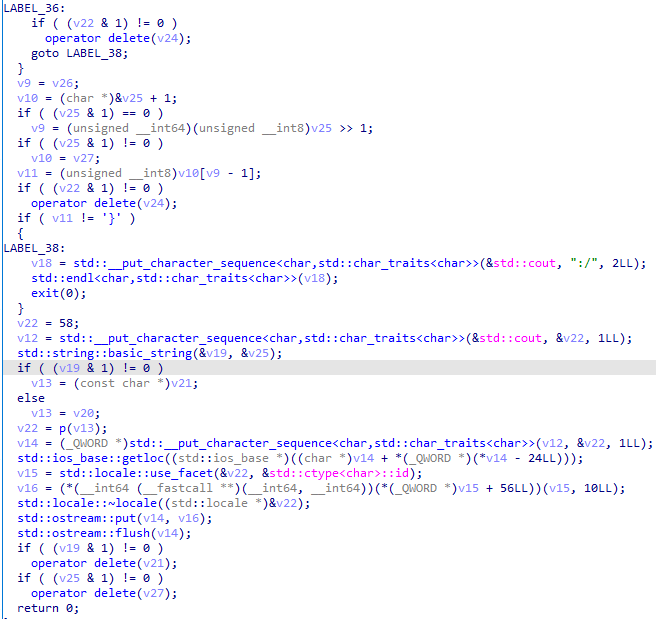

主要函数为`v(), p()`。

`v()`：更改一些数据。

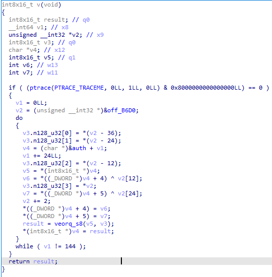

`p()`：处理输入然后比对。

* 处理输入：
  * `input[i] = (input[i] >> 4) || (input[i] << 4)`
  * `input[i] = input[i] ^ input[len(input) - i]`

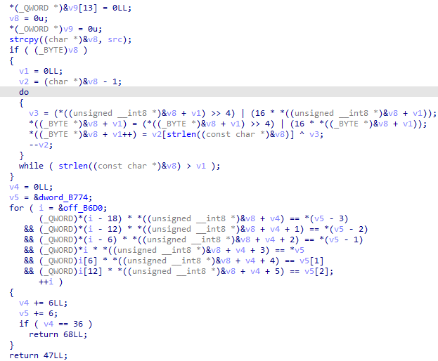

## 脚本

```python
auth32 = [
    0x0003BC69, 0x000D3FA0, 0x0003A94A, 0x00044AFF, 0x00045254, 0x0000CDD1,
    0x00001815, 0x00003B08, 0x00070868, 0x000C6560, 0x00065662, 0x000855C8,
    0x0000DCF6, 0x00004CE6, 0x0014EEC2, 0x0002CFD6, 0x00032766, 0x0014F6BA,
    0x00025E69, 0x0006A9A3, 0x00121EBD, 0x0005991C, 0x00050016, 0x00004A3D,
    0x00097485, 0x0008D0A0, 0x0003B916, 0x00054C58, 0x00096F94, 0x00010334,
    0x000DAD22, 0x0004B234, 0x0002FE96, 0x000F33CC, 0x0012C1E8, 0x00148F9E
]
data32 = [
    0x00000D21, 0x00000000, 0x0000009D, 0x00000000, 0x0000094B, 0x00000000, 0x000003C9, 0x00000000, 0x00000C3F,
    0x00000000, 0x000017E9, 0x00000000, 0x0000130E, 0x00000000, 0x00000088, 0x00000000, 0x00000486, 0x00000000,
    0x0000202F, 0x00000000, 0x00002230, 0x00000000, 0x000024B4, 0x00000000, 0x000008B1, 0x00000000, 0x00000A9F,
    0x00000000, 0x00001AD2, 0x00000000, 0x000023EB, 0x00000000, 0x00000C7E, 0x00000000, 0x0000042B, 0x00000000,
    0x000005BF, 0x00000000, 0x0000113C, 0x00000000, 0x00000449, 0x00000000, 0x00001751, 0x00000000, 0x00000ACE,
    0x00000000, 0x00001894, 0x00000000, 0x0000208A, 0x00000000, 0x00000E82, 0x00000000, 0x000006BD, 0x00000000,
    0x00000CEE, 0x00000000, 0x00002386, 0x00000000, 0x000013D4, 0x00000000, 0x00000111, 0x00000000, 0x00000D1C,
    0x00000000, 0x0000238E, 0x00000000, 0x00001759, 0x00000000, 0x0000012B, 0x00000000, 0x0000214D, 0x00000000
]
v2 = 0
for i in range(6):
    for j in range(6):
        auth32[i * 6 + j] ^= data32[v2 + 12 * j]
    v2 += 2
v2 = 0
flag = []
for i in range(6):
    for j in range(6):
        flag.append(auth32[i * 6 + j] // data32[v2 + j * 12])
    v2 += 2
for i in range(len(flag)):
    flag[len(flag) - 1 - i] ^= flag[i]
    flag[len(flag) - 1 - i] = (flag[len(flag) - 1 - i] >> 4) | (flag[len(flag) - 1 - i] << 4) & 0xFF
print(bytes(flag))
```


# snake

一个贪吃蛇游戏，死后会生成一个flag，只有蛇到361长度生成的flag才是真的flag（比赛的时候一直不知道这题要干嘛），看了其他师傅的wp才知道。

## 程序主逻辑

由于获取flag的过程与游戏关系不大，所以游戏部分逻辑不阐述。

main函数中，初始化蛇，身子用链表来实现，每节身子有它的位置x、y以及其他信息。

蛇的身子长度一开始为3，可通过动调得到。

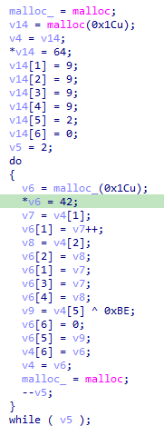

获取随机数序列，在之后的果实生成以及加密会用到：

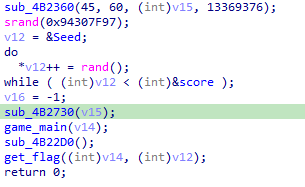

在程序游戏每轮的进行中，都会更新分数以及其它细节：

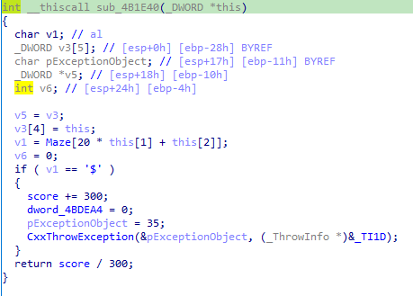

当蛇吃到果实时，就会进入if语句，最后`CxxThrowException`抛出一个异常，具体处理在汇编代码处可以看出：

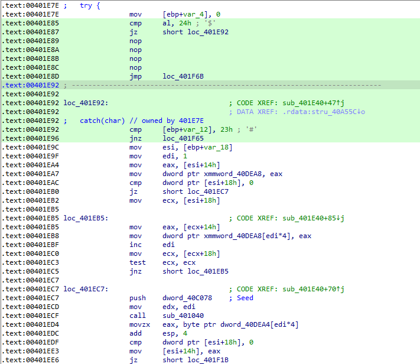

抛出异常执行的地方应该是`0x401E92`处，将前面跳到`0x401F92`的跳转指令改成跳转至`0x401E92`处，可以获取反汇编代码：

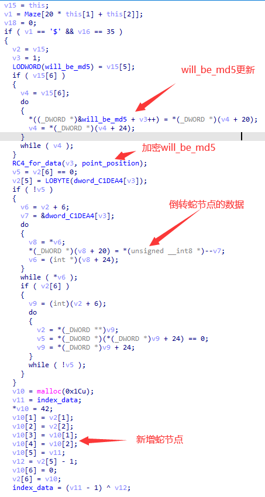

1. 程序更新最后将会被生成md5的数据为目前的蛇的各节点的第五个数据。

2. 对数据进行一次RC4加密。

3. 倒转蛇节点的数据，即将加密后的`will_be_md5`反转放入蛇的节点。（`dword_C1DEA4`的下一个地址就是`will_be_md5`）

4. 新增一个蛇节点`node`，其`node[5]`为`index_data`，同时更新`index_data`（最开始为0x92）为`(index_data - 1) ^ (final_node[5] - 1)`，其中final_node为蛇最后一个节点（不包括新增的）。

新的果实的生成：

由于`dowrd_4BDEA4`当蛇吃到果实时为0，因此当走果实生成的条件分支时，蛇的位置和果实的位置一定相同，因此会走第一个条件分支：由随机数序列的一个数作为种子来生成果实位置。

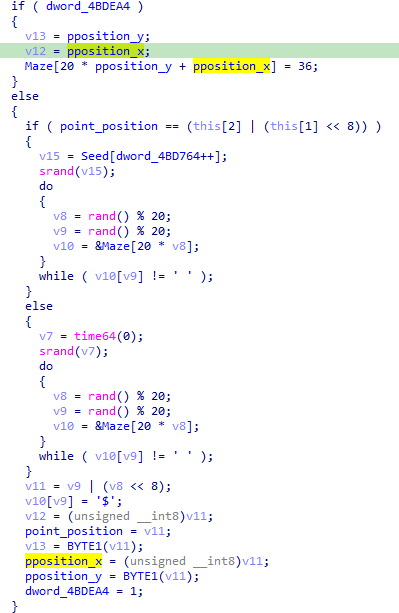

## RC4_for_data的逻辑

整体流程就是RC4。

RC4的key是以蛇的位置作为种子，连续生成的随机数，而由于只有蛇吃到果实才能进入这个函数，因此也是果实的位置。

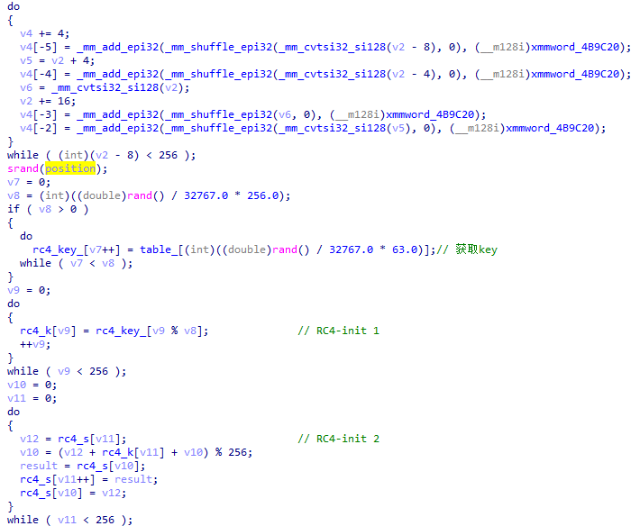

先将RC4加密异或的值存储下来，然后在下面异或数据，异或的处理无论走哪个条件分支都将数据与上面保存的异或数据进行异或。

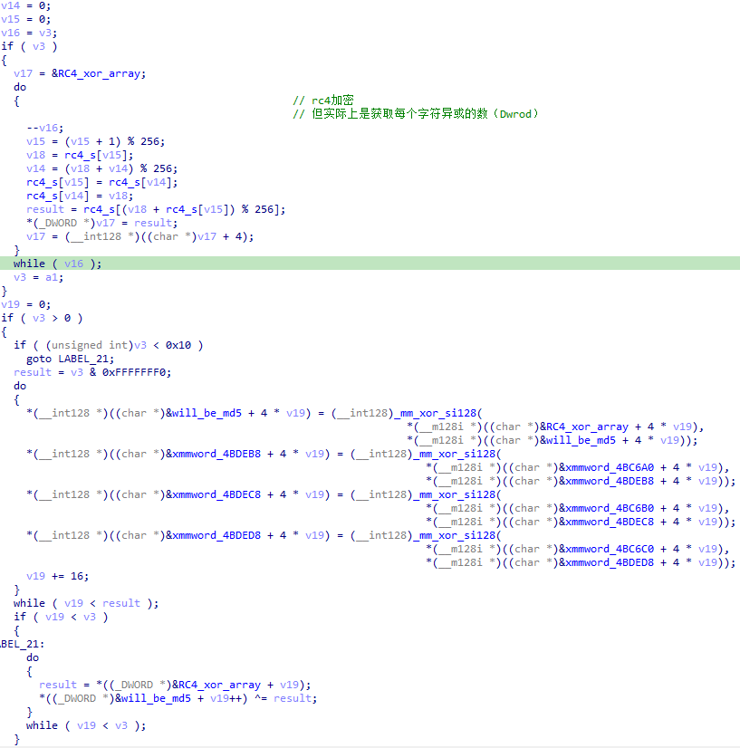

## flag生成

获取数据，生成md5：

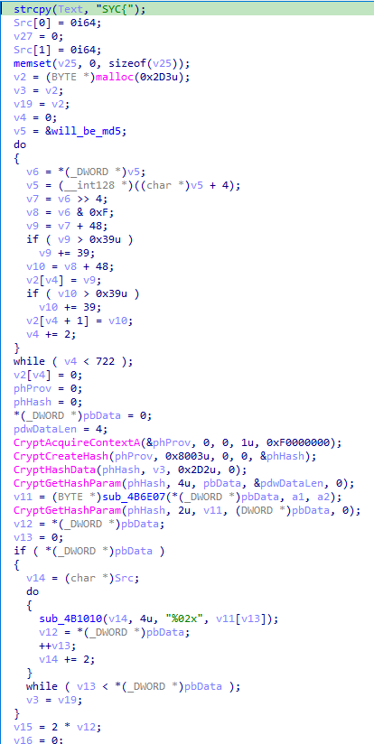

## 脚本

贴一个其他师傅的脚本：

```python

import ctypes
from Crypto.Cipher import ARC4
from hashlib import md5

libc = ctypes.CDLL("ucrtbase.dll")
libc.srand.argtypes = [ctypes.c_uint]
libc.rand.restype = ctypes.c_int

srand = libc.srand
rand = libc.rand

srand(0x94307F97)
seed_list = []
for i in range(361):
    seed_list.append(rand())


def enc(buf, size, seed):
    srand(seed)
    keysize = int(rand()*1.0/32767.0 * 256.0)
    table = 'ABCDEFGHIJKLMNOPQRSTUVWXYZabcdefghijklmnopqrstuvwxyz0123456789\x00'
    pwd = ''
    for i in range(keysize):
        idx = int(rand()*1.0 / 32767.0 * 63.0)
        pwd += table[idx]

    cipher = ARC4.ARC4Cipher(pwd.encode())
    xorstream = b'\x00'*size
    xorstream = cipher.encrypt(xorstream)
    outbuf = bytearray(buf)
    for i in range(size):
        outbuf[i] ^= xorstream[i]
    return bytes(outbuf)


foods = []
for i in range(361):
    srand(seed_list[i])
    while 1:
        y = rand() % 20
        x = rand() % 20
        if not (x == 0 or x == 19 or y == 0 or y == 19):
            # print(i, y, x)
            foods.append((y, x))
            break


tmp = 0x92

data = b'\x02'
for i in range(2):
    data += bytes([data[-1] ^ 0xBE])
# print(data.hex())

flag_data = data[:]
eat_count = 361 # 初始长度就是3, 但是要求吃361个 ???
for i in range(eat_count):
    y, x = foods[i]
    pos = y << 8 | x
    data = enc(data, 3+i, pos)
    # print(data.hex())

    _tmp = tmp
    # print(hex(tmp-1), hex(data[0]-1))
    tmp = ((tmp-1) ^ (data[0]-1)) & 0xFF
    flag_data = data[:]
    data = data[::-1]
    data += bytes([_tmp])
    # print(hex(tmp))

s = flag_data.ljust(361, b'\x00').hex().encode()
print('flag_data', len(flag_data))
print('SYC{'+md5(s[:722]).hexdigest()+'}')
```

# babyThread

## 逻辑

流程很明显，就是加密和比对，主要是判断生成密钥的字符串是哪一个。

加密过程：

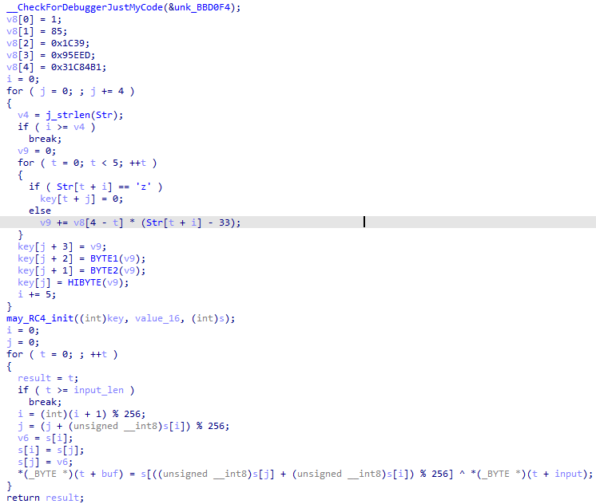

主过程：

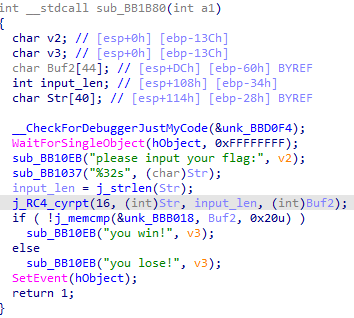

三个密钥（三个只有一个是被用到的）：

1. 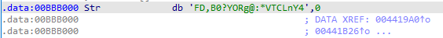
2. 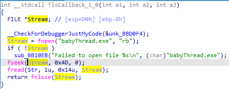
3. 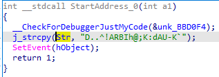

所以直接三个都试一下。

## 脚本

```c
#include <stdio.h>
#include <string.h>
void rc4_init(unsigned char*key, unsigned long Len, unsigned char*s)
{
	int i = 0, j = 0;
	unsigned char k[256] = { 0 };
	unsigned char tmp = 0;
	for (i = 0; i<256; i++)
	{
		s[i] = i;
		k[i] = (unsigned char)key[i%Len];
	}
	for (i = 0; i<256; i++)
	{
        j = (j + s[i] + k[i]) % 256;
		tmp = s[i];
		s[i] = s[j];
		s[j] = tmp;
	}
}
void rc4_crypt(unsigned char*s, unsigned char*Data, unsigned long Len)
{
	int i = 0, j = 0, t = 0;
	unsigned long k = 0;
	unsigned char tmp;
	for (k = 0; k<Len; k++)
	{
		i = (i + 1) % 256;
		j = (j + s[i]) % 256;
		tmp = s[i];
		s[i] = s[j];
		s[j] = tmp;
		t = (s[i] + s[j]) % 256;
		Data[k] ^= s[t];
	}
}
int main()
{
    int v8[7];
    int i = 0, i_ = 0, j = 0, j_, t;
    int v4, v9;
    // char Str[100] = "FD,B0?YORg@:*VTCLnY4";
    // char Str[100] = "D..^!ARBIh@;K:dAU-K`";
    // char Str[100] = "!This_program_cannot";
    char Str[21];
    FILE * f = fopen("安洵杯2023/babyThread.exe", "rb");
    fseek(f, 0x4D, 0);
    fread(Str, 1, 0x14, f);
    fclose(f);
    
    unsigned char key[24];
    v8[0] = 1;
    v8[1] = 85;
    v8[2] = 0x1C39;
    v8[3] = 0x95EED;
    v8[4] = 0x31C84B1;
    for (j = 0, i = 0; i < strlen(Str); j += 4, i += 5)
    {
        v9 = 0;
        for (t = 0; t < 5; ++t)
        {
            if (Str[t + i] == 'z')
                key[t + j] = 0;
            else
                v9 += v8[4 - t] * (Str[t + i] - 33);
        }
        key[j + 3] = (*((char *)&v9));
        key[j + 2] = (*((char *)&v9 + 1));
        key[j + 1] = (*((char *)&v9 + 2));
        key[j] = (*((char *)&v9 + 3));
    }
    unsigned char data[32] = {
        0xDE, 0x1C, 0x22, 0x27, 0x1D, 0xAE, 0xAD, 0x65, 0xAD, 0xEF, 
        0x6E, 0x41, 0x4C, 0x34, 0x75, 0xF1, 0x16, 0x50, 0x50, 0xD4, 
        0x48, 0x69, 0x6D, 0x93, 0x36, 0x1C, 0x86, 0x3B, 0xBB, 0xD0, 
        0x4C, 0x91
    };
    char s[264];
    rc4_init(key, 16, s);
    rc4_crypt(s, data, 32);
    for(i = 0; i<32 ; i++){
        printf("%c", data[i]);
    }
    return 0;
}
```

# gowhere

用IDAGolang脚本还原符号、函数名称。

大概的逻辑是输入30个字符的字符串，进行三轮三个函数加密然后与密文比对。

## 函数一逻辑

逻辑：`input = (input + enc1_key) ^ 0x17`

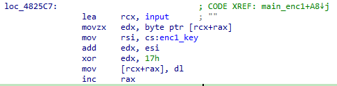

主要是寻找`enc1_key`的变化。

`enc_key1`初始为9。

每次进入`main_enc1()`时，`enc_key1`会加一：

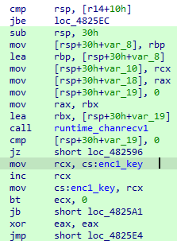

每次进入`main_enc2()`时，`enc_key1`也会加一：

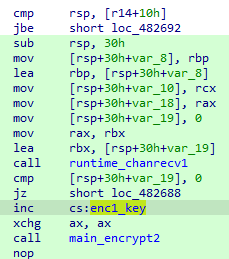

每次进入`main_enc3()`时，`enc_key1`也会加一：

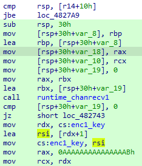

## 函数二逻辑

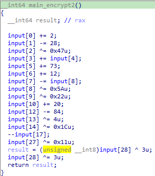

## 函数三逻辑

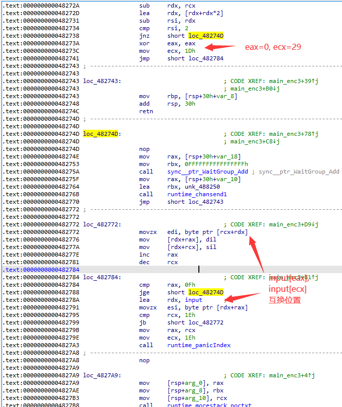

## 主逻辑

三个加密的代码片段都弄懂了，但调用的顺序却没有，程序的具体逻辑我还没有弄懂。

分别为三个加密的代码片段走过且每次加密只走一次的代码下条件断点，打印一些信息：

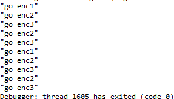

可以知晓加密流程：enc1-2-3-2-3-1-2-3-2-3

## 脚本

```python
def dec1(data, key):
    for i in range(len(data)):
        data[i] = (data[i] ^ 0x17) - key
    return data


def dec2(input):
    input[0] -= 2
    input[1] += 28
    input[2] ^= 0x47
    input[3] -= input[4]
    input[5] -= 73
    input[6] -= 12
    input[8] ^= 0x5A
    input[7] += input[8]
    input[9] ^= 0x22
    input[10] -= 20
    input[12] += 84
    input[13] ^= 4
    input[14] ^= 0x1C
    input[17] += 1
    input[27] ^= 0x11
    input[28] ^= 3
    for i in range(len(input)):
        input[i] &= 0xff
    return input


def dec3(data):
    for i in range(len(data) // 2):
        data[i], data[29-i] = data[29-i], data[i]
    return data


flag = [
    0x4D, 0x63, 0x5D, 0x34, 0x43, 0x09, 0xA2, 0x77, 0x0A, 0xBF,
    0xC9, 0xB3, 0xE9, 0x6F, 0x79, 0x7D, 0x7B, 0xE8, 0x99, 0x90,
    0x43, 0x08, 0xBB, 0x99, 0x0E, 0x2E, 0xD4, 0x7B, 0x27, 0xB7,
]

flag = dec3(flag)
flag = dec2(flag)
flag = dec3(flag)
flag = dec2(flag)
flag = dec1(flag, 16)
flag = dec3(flag)
flag = dec2(flag)
flag = dec3(flag)
flag = dec2(flag)
flag = dec1(flag, 10)
print(flag)
print("".join(chr(i) for i in flag))
```


