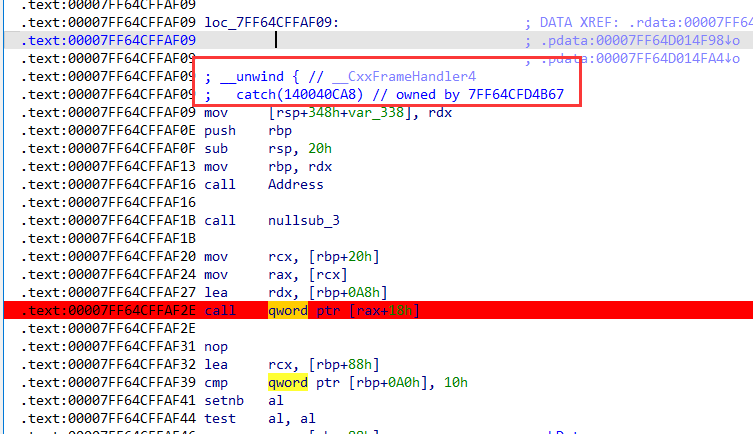
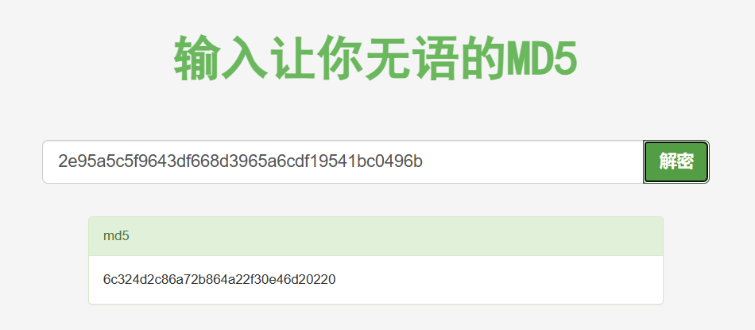

## isher

### 逻辑

有异常，所有的逻辑基本都在catch那里。



处理输入的逻辑都在图中断点call的函数中。

这个函数具体可以分为三段：

1. 第一段感觉就是把输入从一个地方换到另一个地方

   ```C
     if ( *(_DWORD *)(a1 + 56) )
     {
       v6 = 0i64;
       v7 = (_QWORD *)(a1 + 40);
       v8 = *(_DWORD *)(a1 + 56);
       do
       {
         v9 = v7;
         v10 = v7[3];
         if ( v10 >= 0x10 )
           v9 = (_QWORD *)*v7;
         if ( *((_BYTE *)v9 + v6) == 10 )
           break;
         v11 = v7;
         if ( v10 >= 0x10 )
           v11 = (_QWORD *)*v7;
         if ( *((_BYTE *)v11 + v6) != 32 )
         {
           v12 = (const __m128i *)(a1 + 8);
           v13 = v7;
           if ( v10 >= 0x10 )
             v13 = (_QWORD *)*v7;
           v14 = *(_QWORD *)(a1 + 24);
           if ( *(_QWORD *)(a1 + 32) >= 0x10ui64 )
             v12 = (const __m128i *)v12->m128i_i64[0];
           if ( v14 )
           {
             input_index_on_table = sub_7FF64CFDF630(v12, *((_BYTE *)v13 + v6), v14);
             if ( input_index_on_table && input_index_on_table - (_QWORD)v12 != -1 )
             {
               v16 = v7;
               if ( v10 >= 0x10 )
                 v16 = (_QWORD *)*v7;
               v17 = (char *)v16 + v6;
               if ( v4 == v50 )
               {
                 sub_7FF64CFD9B10((const void **)&v49, v4, v17);
                 v4 = (_BYTE *)*((_QWORD *)&v49 + 1);
               }
               else
               {
                 *v4 = *v17;
                 v4 = (_BYTE *)++*((_QWORD *)&v49 + 1);
               }
             }
             a1 = v42;
           }
         }
         ++v5;
         ++v6;
       }
       while ( v5 < v8 );
       v3 = (_BYTE *)v49;
       v2 = v43;
     }
   ```

2. 第二段是将输入分为两个字符一组，每一组两个字符相同的在中间插入一个X

   ```C
     if ( v4 != v3 )
     {
       while ( 1 )
       {
         v21 = &v3[(unsigned int)index];
         if ( v20 == v48 )
         {
           sub_7FF64CFD9B10((const void **)Src, v20, v21);
           v22 = Src[1];
         }
         else
         {
           *v20 = *v21;
           v22 = ++Src[1];
         }
         index = (unsigned int)(index + 1);
         a1 = v49;
         if ( (unsigned int)index == *((_QWORD *)&v49 + 1) - (_QWORD)v49 )
           break;
         v23 = *(_BYTE *)(v49 + index);
         if ( v23 == *((_BYTE *)Src[0] + v19) )
         {
           v41[0] = 'X';
           if ( v22 == v48 )
           {
             sub_7FF64CFD9B10((const void **)Src, v22, v41);
             v20 = Src[1];
           }
           else
           {
             *v22 = 88;
             v20 = ++Src[1];
           }
         }
         else
         {
           if ( v22 == v48 )
           {
             sub_7FF64CFD9B10((const void **)Src, v22, (_BYTE *)(v49 + index));
             v20 = Src[1];
           }
           else
           {
             *v22 = v23;
             v20 = ++Src[1];
           }
           LODWORD(index) = index + 1;
         }
         v19 += 2;
         v3 = (_BYTE *)v49;
         a1 = *((_QWORD *)&v49 + 1) - v49;
         if ( (unsigned __int64)(unsigned int)index >= *((_QWORD *)&v49 + 1) - (_QWORD)v49 )
           goto LABEL_42;
       }
       v41[0] = 88;
       if ( v22 == v48 )
       {
         sub_7FF64CFD9B10((const void **)Src, v22, v41);
         v20 = Src[1];
       }
       else
       {
         *v22 = 88;
         v20 = ++Src[1];
       }
     }
   ```

3. 第三段就是利用一个表加密

   

   ```C
   void __fastcall sub_7FF64CFD3CA0(__int64 *a1, _QWORD *a2, __int64 a3)
   {
     _QWORD *str; // r15
     unsigned int v6; // esi
     unsigned int char1_mod_8; // ebp
     int char2_div_8; // r12d
     int char2_mod_8; // r13d
     char v10; // bl
     unsigned int v11; // r9d
     __int64 v12; // r8
     __int64 *v13; // rdx
     unsigned int v14; // ecx
     __int64 i; // rax
     unsigned int v16; // esi
     char v17; // bl
     int v18; // r9d
     __int64 v19; // r8
     __int64 *v20; // rdx
     int v21; // ecx
     __int64 j; // rax
     __int64 v23; // rbx
     _BYTE *v24; // r8
     _BYTE *v25; // rdx
     _BYTE *v26; // r8
     __int64 v27; // rax
     _QWORD *v28; // rcx
     unsigned int char1_div_8; // [rsp+30h] [rbp-68h]
     __int64 char1_div_8__; // [rsp+38h] [rbp-60h]
     __int64 v31; // [rsp+40h] [rbp-58h]
   
     str = a2;
     v31 = a2[1] - *a2;
     v6 = 0;
     char1_div_8 = 0;
     char1_mod_8 = 0;
     char2_div_8 = 0;
     char2_mod_8 = 0;
     if ( (_DWORD)v31 )
     {
       char1_div_8__ = 0i64;
       do
       {
         v10 = *(_BYTE *)(*str + v6);
         sub_7FF64CFDA6D3(2i64, (__int64)a2);
         v11 = 0;
         v12 = 0i64;
         v13 = a1 + 9;
         while ( 2 )
         {
           v14 = 0;
           for ( i = 0i64; i < 8; ++i )
           {
             if ( v10 == *((_BYTE *)v13 + i) )
             {
               char1_div_8 = v11;
               char1_div_8__ = v12;
               char1_mod_8 = v14;
               goto LABEL_10;
             }
             ++v14;
           }
           ++v11;
           ++v12;
           ++v13;
           if ( v12 < 8 )
             continue;
           break;
         }
   LABEL_10:
         v16 = v6 + 1;
         v17 = *(_BYTE *)(*str + v16);
         sub_7FF64CFDA6D3(2i64, (__int64)v13);
         v18 = 0;
         v19 = 0i64;
         v20 = a1 + 9;
         while ( 2 )
         {
           v21 = 0;
           for ( j = 0i64; j < 8; ++j )
           {
             if ( v17 == *((_BYTE *)v20 + j) )
             {
               char2_div_8 = v18;
               char2_mod_8 = v21;
               goto LABEL_17;
             }
             ++v21;
           }
           ++v18;
           ++v19;
           ++v20;
           if ( v19 < 8 )
             continue;
           break;
         }
   LABEL_17:
         if ( char1_div_8 == char2_div_8 )
         {
           v23 = 8 * char1_div_8__ + 72;
           v24 = (char *)a1 + v23 + (int)(char1_mod_8 + 1) % 8;
           v25 = *(_BYTE **)(a3 + 8);
           if ( v25 == *(_BYTE **)(a3 + 16) )
           {
             sub_7FF64CFD9B10((const void **)a3, v25, v24);
           }
           else
           {
             *v25 = *v24;
             ++*(_QWORD *)(a3 + 8);
           }
           sub_7FF64CFDA6D3(2i64, (__int64)v25);
           v26 = (char *)a1 + v23 + (char2_mod_8 + 1) % 8;
           a2 = *(_QWORD **)(a3 + 8);
           if ( a2 == *(_QWORD **)(a3 + 16) )
           {
             sub_7FF64CFD9B10((const void **)a3, a2, v26);
           }
           else
           {
             *(_BYTE *)a2 = *v26;
             ++*(_QWORD *)(a3 + 8);
           }
         }
         else
         {
           v27 = *a1;
           if ( char1_mod_8 == char2_mod_8 )
             (*(void (__fastcall **)(__int64 *, _QWORD, __int64, _QWORD, int))v27)(
               a1,
               char1_mod_8,
               a3,
               char1_div_8,
               char2_div_8);
           else
             (*(void (__fastcall **)(__int64 *, _QWORD, _QWORD, __int64, int, int))(v27 + 8))(
               a1,
               char1_div_8,
               char1_mod_8,
               a3,
               char2_div_8,
               char2_mod_8);
         }
         v6 = v16 + 1;
       }
       while ( v6 < (unsigned int)v31 );
     }
     v28 = (_QWORD *)*str;
     if ( *str )
     {
       if ( str[2] - (_QWORD)v28 >= 0x1000ui64 )
       {
         if ( (unsigned __int64)v28 - *(v28 - 1) - 8 > 0x1F )
           invalid_parameter_noinfo_noreturn();
         v28 = (_QWORD *)*(v28 - 1);
       }
       j_j_free(v28);
       *str = 0i64;
       str[1] = 0i64;
       str[2] = 0i64;
     }
   }
   
   // char1_mod_8 == char2_mod_8的分支
   __int64 __fastcall sub_7FF64CFD3B40(__int64 a1, int char1_mod_8, __int64 a3, int char1_div_8, int char2_div_8)
   {
     __int64 char1_mod_8_; // rsi
     _BYTE *v8; // rdx
     _BYTE *v9; // r8
     _BYTE *v10; // rdx
     _BYTE *v11; // r8
     __int64 result; // rax
   
     char1_mod_8_ = char1_mod_8;
     v8 = *(_BYTE **)(a3 + 8);
     v9 = (_BYTE *)(a1 + char1_mod_8_ + 8 * ((char1_div_8 + 1) % 8 + 9i64));
     if ( v8 == *(_BYTE **)(a3 + 16) )
     {
       sub_7FF64CFD9B10((const void **)a3, v8, v9);
     }
     else
     {
       *v8 = *v9;
       ++*(_QWORD *)(a3 + 8);
     }
     v10 = *(_BYTE **)(a3 + 8);
     v11 = (_BYTE *)(a1 + char1_mod_8_ + 8 * ((char2_div_8 + 1) % 8 + 9i64));
     if ( v10 == *(_BYTE **)(a3 + 16) )
       return (__int64)sub_7FF64CFD9B10((const void **)a3, v10, v11);
     result = (unsigned __int8)*v11;
     *v10 = result;
     ++*(_QWORD *)(a3 + 8);
     return result;
   }
   
   // else的分支
   unsigned __int64 __fastcall sub_7FF64CFD3C00(
           __int64 a1,
           int div_num1,
           int mod_num1,
           __int64 a4,
           int div_num2,
           int mod_num2)
   {
     __int64 v6; // rsi
     _BYTE *v9; // r8
     _BYTE *v10; // rdx
     _BYTE *v11; // r8
     _BYTE *v12; // rdx
     unsigned __int64 result; // rax
   
     v6 = mod_num1;
     v9 = (_BYTE *)(a1 + mod_num2 + 72i64 + 8i64 * div_num1);
     v10 = *(_BYTE **)(a4 + 8);
     if ( v10 == *(_BYTE **)(a4 + 16) )
     {
       sub_7FF64CFD9B10((const void **)a4, v10, v9);
     }
     else
     {
       *v10 = *v9;
       ++*(_QWORD *)(a4 + 8);
     }
     v11 = (_BYTE *)(a1 + v6 + 8 * (div_num2 + 9i64));
     v12 = *(_BYTE **)(a4 + 8);
     if ( v12 == *(_BYTE **)(a4 + 16) )
       return (unsigned __int64)sub_7FF64CFD9B10((const void **)a4, v12, v11);
     result = (unsigned __int8)*v11;
     *v12 = result;
     ++*(_QWORD *)(a4 + 8);
     return result;
   }
   ```

最后将结果与`N17EHf1DWHD40DWH/f79E05EfIH1E179E1`比较。

### exp

```python
table = "ghijklpqrstuvwxyzABCabcDEFdef0123GHI4567JKL+/MNOmnoPQRSXYZ8TUVW9"
stand_num = 0x2E8 - 0x2A0
r = "N17EHf1DWHD40DWH/f79E05EfIH1E179E1"
flag_hash = "2e95a5c5f9643df668d3965a6cdf19541bc0496b"
# 加密逻辑
# a = "1a3rGs"
# flag = ""
# for i in range(len(a) // 2):
#     num1 = table.index(a[i * 2])
#     div_num1 = num1 // 8
#     mod_num1 = num1 % 8
#     num2 = table.index(a[i * 2 + 1])
#     div_num2 = num2 // 8
#     mod_num2 = num2 % 8
#     if div_num1 == div_num2:
#         char1 = 8 * div_num1 + 72 + (mod_num1 + 1) % 8
#         char2 = 8 * div_num2 + 72 + (mod_num2 + 1) % 8
#     elif mod_num1 == mod_num2:
#         char1 = mod_num1 + 8 * ((div_num1 + 1) % 8 + 9)
#         char2 = mod_num2 + 8 * ((div_num2 + 1) % 8 + 9)
#     else:
#         char1 = mod_num2 + 72 + 8 * div_num1
#         char2 = mod_num1 + 72 + 8 * div_num2
#     flag += table[char1 - stand_num] + table[char2 - stand_num]
# print(flag)

# 解密逻辑
for i in range(len(r) // 2):
    char1 = r[i * 2]
    char2 = r[i * 2 + 1]
    num1 = table.index(char1) + stand_num
    num2 = table.index(char2) + stand_num

    for x in range(64):
        for y in range(64):
            div_x, mod_x = x // 8, x % 8
            div_y, mod_y = y // 8, y % 8
            if div_x == div_y:
                if (mod_x + 1) % 8 + 72 + 8 * div_x == num1 and (mod_y + 1) % 8 + 72 + 8 * div_y == num2:
                    print(table[x] + table[y], end="")
            elif mod_x == mod_y:
                if mod_x + 8 * ((div_x + 1) % 8 + 9) == num1 and mod_y + 8 * ((div_y + 1) % 8 + 9) == num2:
                    print(table[x] + table[y], end="")
            else:
                if mod_y + 72 + 8 * div_x == num1 and mod_x + 72 + 8 * div_y == num2:
                    print(table[x] + table[y], end="")
# 6c324d2c86a72b864a22f30e46d20220
```

最后解密的flag有两个X，根据处理输入第二段的逻辑，试一试，然后由前面有一段SHA1的哈希值`2e95a5c5f9643df668d3965a6cdf19541bc0496b`来确定flag。

看网上其他师傅的WP，可以直接解，无语了：[SOMD5](https://www.somd5.com/)

