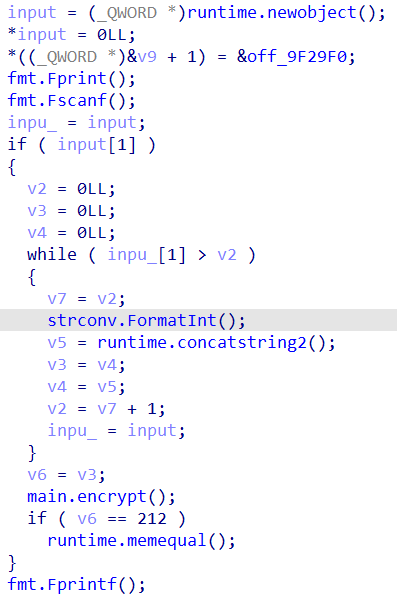
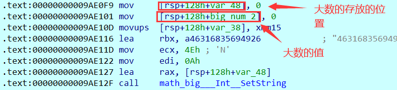
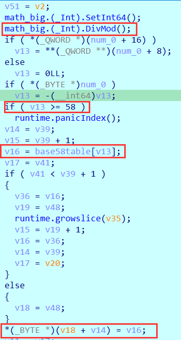
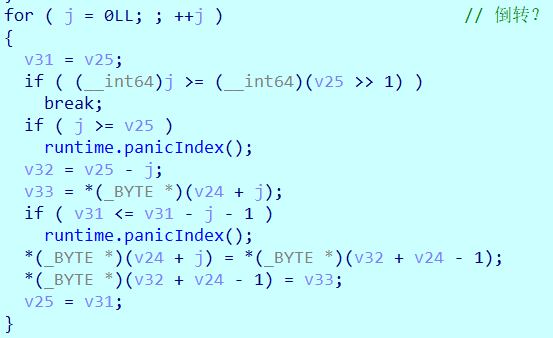

## big number

### main_main

主逻辑只是获取输入，并调用`main.encyrpt`，最后进行比较：



### main.encrypt

`main.encrypt`逻辑：

两个大数相乘`115792089237316195423570985008687907853269984665640564039457584007913129640233`和`463168356949264781694283940034751631413079938662562256157830336031652518559817`，然后将输入由二进制数据转化为大数，并进行指数为`131101`，模为两个大数的乘积的运算，即一个RSA加密。

这其中的大数的结构大概这样子：



这里将输入转化为大数，然后将输入作为底，`num_131101`作为幂，大数乘积作为模，进行运算，结果放在`rax`上。

然后调用`main_encrypt2`。

### main_encrypt2

这个函数其实就是一个换表的`base58`。

表为：`rUzoi1mGW6u8TFH3RCbeKYZSJ2DsAXwgfhdQj5cvLNMaxV97kq4ynEBPpt`

将输入的大数不断除以58，将余数进表得到字符加到结果中。



最后倒转字符串：



### exp

```python
import math
import gmpy2


table = "rUzoi1mGW6u8TFH3RCbeKYZSJ2DsAXwgfhdQj5cvLNMaxV97kq4ynEBPpt"
num1 = 115792089237316195423570985008687907853269984665640564039457584007913129640233
num2 = 463168356949264781694283940034751631413079938662562256157830336031652518559817
e = 131101
d = gmpy2.invert(e, (num1-1)*(num2-1))


def base58encoder(x):
    big_num = int(x, 16)
    result = ""
    quotient = big_num
    while quotient != 0:
        quotient, remainder = divmod(quotient, 0x3A)
        result += table[remainder]
    result = result[::-1]
    return result


def base58decoder(x):
    remainder = [table.index(i) for i in x]
    big_num = 0
    for i in remainder:
        big_num = big_num * 58 + i
    big_num = hex(big_num)[2:]
    if len(big_num) % 2 == 1:
        big_num = "0" + big_num
    flag_num = bytes.fromhex(big_num).decode("utf-8")
    return flag_num

def enc(flag):
    flag_num = ""
    for i in flag:
        flag_num += hex(ord(i))[2:]
    flag_num = int(flag_num, 16)
    num = pow(flag_num, e, num1 * num2)
    big_num = ""
    for i in str(num):
        big_num += hex(ord(i))[2:]
    return base58encoder(big_num)


def dec(flag):
    flag_num = base58decoder(flag)
    flag_num = int(flag_num, 10)
    flag_num = pow(flag_num, d, num1*num2)
    flag_num = hex(flag_num)[2:]
    result = ""
    for i in range(0, len(flag_num), 2):
        result += chr(int(flag_num[i:i+2], 16))
    return result


result = "orHcGB9zRxciwQYPNhP3xgBAES9PLY1zb8hBPBmxvv83awPeZLfioAvLFA4QAGPr7WXaf" \
         "AAwCdoTKNqSaca57wUFVAxbq9fptnaRaA4d1Gm6K3eYBCWzF19hfkEjy6wEEeRdx8FztT" \
         "heVCiosWaJ8QsdRhiUysLpRBMU22HMK2DNA1Kpminxt4g2qA5hweWf1xLyuiosb4nR3Rn" \
         "csTWs"

print(enc("123"))
print(dec(result))
```

## SDK

数独游戏。

网上的脚本：

```C
#include <iostream>
#include <algorithm>
#include <cstring>

using namespace std;

const int N = 16, M = N * N;

// 存放原矩阵
// 读入时每行后面会自动加一个 '\0'，所以每个串要开到 N + 1
char str[N][N + 1];
// 存放每一层的原始矩阵状态，方便恢复现场
char str2[M + 1][N][N + 1];
// ones 表示二进制数中几个1  map 表示二进制数中最后一个 1 的位置   
int ones[1 << N], map[1 << N];
// 存放每个点可以放置的数
int state[N][N];
// 存放每一层的每一个点可以放置数的状态，方便恢复现场
int state2[M + 1][N][N], state3[M + 1][N][N];

inline int lowbit(int x) {
    return x & -x;
}

// 改变格子填放后，行、列、4*4 宫格的状态
void draw(int x, int y, int c) {
    str[x][y] = c + 'A';
    
    for (int i = 0; i < N; i ++) {
        // 将 x 行对应的每一个空位的可选项中去除 c
        // ~(1 << c) 表示将 二进制数的倒数第 c 位变为1，其余位取反
        // state[x][i] & ~(1 << c) 只将倒数第 c 位变为 1，其余位不变
        state[x][i] &= ~(1 << c);
        state[i][y] &= ~(1 << c);
    }
    
    // 找到该矩阵中左上角点在整个矩阵中对应的坐标
    int sx = x / 4 * 4, sy = y / 4 * 4;
    
    for (int i = 0; i < 4; i ++) {
        for (int j = 0; j < 4; j ++) {
            state[sx + i][sy + j] &= ~(1 << c);
        }
    }
    
    // 将 (x, y) 的状态标记为以放置 c
    state[x][y] = 1 << c;
}

bool dfs(int cnt) {
    // 如果所有格子都填放完成，则直接返回即可
    if (!cnt) return true;
    
    // 保存原来的状态，方便回溯
    int kcnt = cnt;
    memcpy(str2[kcnt], str, sizeof str);
    memcpy(state2[kcnt], state, sizeof state);
    
    // 枚举所有空白格，若只能填一个数，则直接填
    // 若不能填，则直接返回
    for (int i = 0; i < N; i ++) {
        for (int j = 0; j < N; j ++) {
            if (str[i][j] == '-') {
                // state[i][j] 表示该位置可以放置的数
                int s = state[i][j];
                // 若一个数都不能放
                if (!s) {
                    // 恢复现场
                    memcpy(str, str2[kcnt], sizeof str);
                    memcpy(state, state2[kcnt], sizeof state);
                    return false;
                }
                
                // 若改格只能放置一个数
                if (ones[s] == 1) {
                    draw(i, j, map[s]);
                    cnt --;
                }
            }
        }
    }
    
    // 枚举每一行，若某个字母不能填在任何一个空位，直接返回
    // 若某个空格只能填一个字母，则直接填
    for (int i = 0; i < N; i ++) {
        // sor  表示该行可填放的数字
        // sand 表示该行每个空位可以填放的字符
        int sor = 0, sand = (1 << N) - 1;
        // 表示该行已填放的数字
        int drawn = 0;
        for (int j = 0; j < N; j ++) {
            int s = state[i][j];
            sand &= ~(s & sor);
            sor |= s;
            // s & sor 表示该格子可以填放同时前面有格子也可以填的数
            // sand & ~(s & sor) 二进制数中 1 所在的位置，就是只可以填那个数
            
            
            if (str[i][j] != '-') drawn |= s;
        }
        
        // 若某个字母不能填放在该行的任意一个位置
        if (sor != (1 << N) - 1) {
            memcpy(str, str2[kcnt], sizeof str);
            memcpy(state, state2[kcnt], sizeof state);
            return false;
        }
        
        for (int j = sand; j; j -= lowbit(j)) {
            int t = lowbit(j);
            // 若改行没有填放过 t
            if (!(drawn & t)) {
                for (int k = 0; k < N; k ++) {
                    // 找出填放 t 的那个格子
                    if (state[i][k] & t) {
                        draw(i, k, map[t]);
                        cnt --;
                        break;
                    }
                }
            }
        }
    }
    
    // 枚举每一列，若某个字母不能填在任何一个空位，直接返回
    // 若某个空格只能填一个字母，则直接填
    for (int i = 0; i < N; i ++) {
        int sor = 0, sand = (1 << N) - 1;
        int drawn = 0;
        for (int j = 0; j < N; j ++) {
            int s = state[j][i];
            sand &= ~(s & sor);
            sor |= s;
            
            if (str[j][i] != '-') drawn |= s;
        }
        
        if (sor != (1 << N) - 1) {
            memcpy(str, str2[kcnt], sizeof str);
            memcpy(state, state2[kcnt], sizeof state);
            return false;
        }
        
        for (int j = sand; j; j -= lowbit(j)) {
            int t = lowbit(j);
            if (!(drawn & t)) {
                for (int k = 0; k < N; k ++) {
                    if (state[k][i] & t) {
                        draw(k, i, map[t]);
                        cnt --;
                        break;
                    }
                }
            }
        }
    }
    
    // 枚举每一个 4*4 宫格，若某个字母不能填在任何一个空位，直接返回
    // 若某个空格只能填一个字母，指直接填
    for (int i = 0; i < N; i ++) {
        int sor = 0, sand = (1 << N) - 1;
        int drawn = 0;
        for (int j = 0; j < N; j ++) {
            int sx = i / 4 * 4, sy = i % 4 * 4;
            // 找到该点在该矩阵中偏移量
            int dx = j / 4, dy = j % 4;
            int s = state[sx + dx][sy + dy];
            sand &= ~(s & sor);
            sor |= s;
            
            if (str[sx + dx][sy + dy] != '-') drawn |= s;
        }
        
        if (sor != (1 << N) - 1) {
            memcpy(str, str2[kcnt], sizeof str);
            memcpy(state, state2[kcnt], sizeof state);
            return false;
        }
        
        for (int j = sand; j; j -= lowbit(j)) {
            int t = lowbit(j);
            if (!(drawn & t)) {
                for (int k = 0; k < N; k ++) {
                    int sx = i / 4 * 4, sy = i % 4 * 4;
                    int dx = k / 4, dy = k % 4;
                    if (state[sx + dx][sy + dy] & t) {
                        draw(sx + dx, sy + dy, map[t]);
                        cnt --;
                        break;
                    }
                }
            }
        }
    }
    
    // 如果经过上面的步骤，已经填放完毕，则不用进行下面的步骤
    if (!cnt) return true;
    
    // 找可以填放数最少的空格
    // 记住填放数最少的空格的坐标，以及可以填放的数
    int x, y, s = 20;
    for (int i = 0; i < N; i ++) {
        for (int j = 0; j < N; j ++) {
            if (str[i][j] == '-' && ones[state[i][j]] < s) {
                s = ones[state[i][j]];
                x = i, y = j;
            }
        }
    }
    
    memcpy(state3[kcnt], state, sizeof state);
    
    // 枚举每一个可以填放的数
    for (int i = state[x][y]; i; i -= lowbit(i)) {
        memcpy(state, state3[kcnt], sizeof state);
        draw(x, y, map[lowbit(i)]);
        if (dfs(cnt - 1)) return true;
    }
    
    // 恢复现场
    memcpy(state, state2[kcnt], sizeof state);
    memcpy(str, str2[kcnt], sizeof str);
    
    return false;
}

int main() {
    // 初始化 map 和 ones 数组
    for (int i = 0; i < N; i ++ ) map[1 << i] = i;
    for (int i = 0; i < 1 << N; i ++ )
    {
        for (int j = i; j; j -= lowbit(j))
            ones[i] ++ ;
    }
    
    // 当扫描到数据时，才继续读入后续数据
    while (~scanf("%s", *str))
    {
        for (int i = 1; i < N; i ++ ) cin >> str[i];
        
        // 初始化每个格子的状态，是能够放置任意字符
        for (int i = 0; i < N; i ++ )
            for (int j = 0; j < N; j ++ )
                state[i][j] = (1 << N) - 1;
        
        // 存放空白格子数
        int cnt = 0;
        
        // 将已经放置字符的格子对应的状态进行更新
        for (int i = 0; i < N; i ++ )
            for (int j = 0; j < N; j ++ )
                if (str[i][j] != '-')
                    draw(i, j, str[i][j] - 'A');
                else cnt ++ ;

        dfs(cnt);

        for (int i = 0; i < N; i ++ ) cout << str[i] << endl;
        cout << endl;
    }

    return 0;
}
/*
ALMDCJEPBFIKOGNH
BCEFADGHJLNOIKMP
GHIJBKNOACMPDEFL
KNOPFILMDEGHABCJ
CABEDFHGIJKLMNPO
DFGHEABCMOPNJILK
IJKLMOPNCABDEFHG
MOPNILJKEGHFBADC
EBACGHDFKIJMLPON
FDHGJBALNPOCKMEI
JINKOPMEFBLACHGD
OPLMKNCIGHDEFJAB
HECALGIBONFJPDKM
LGDBHCKAPMEINOJF
NKFIPMOJLDAGHCBE
PMJONEFDHKCBGLIA
*/
```

然后将输出按程序的规范提取一下：

```python
a = "010c000400000510000609000f070e0802030506010407080a0c0e0f000b0d1007080900020b0e0f01030d100400060c000e0f100609000d00000708010203000301020504060007090a0b0c000e100f00000700050100030d0f100e0a09000b09000b000d0f100003010200050008070d0f0000090c0a00000008060201000300020003000804060b090a0d0010000e060408070a02000c0e100f030b0d050000090e0b0f10000006000c010300070400100c0d0b0e030007080005060a01000805000000000902000e000a10000b0d0c00040208030b00100d0500000f0a000e0b0009100d0f0a0c00000708030005100d0a0f0e050604080b0302000c0900"
for i in range(0, len(a), 2):
    if i % 32 == 0:
        print()
    num = int(a[i:i+2], 16)
    if num == 0:
        print('-', end="")
    else:
        print(chr(num + ord('A') - 1), end="")
print()

b = "ALMDCJEPBFIKOGNHBCEFADGHJLNOIKMPGHIJBKNOACMPDEFLKNOPFILMDEGHABCJCABEDFHGIJKLMNPODFGHEABCMOPNJILKIJKLMOPNCABDEFHGMOPNILJKEGHFBADCEBACGHDFKIJMLPONFDHGJBALNPOCKMEIJINKOPMEFBLACHGDOPLMKNCIGHDEFJABHECALGIBONFJPDKMLGDBHCKAPMEINOJFNKFIPMOJLDAGHCBEPMJONEFDHKCBGLIA"
c = "AL-D--EP-FI-OGNHBCEFADGHJLNO-KMPGHI-BKNOACMPD-FL-NOPFI-M--GHABC-CABEDF-GIJKL-NPO--G-EA-CMOPNJI-KI-K-MOP-CAB-E-HGMO--ILJ---HFBA-C-B-C-HDFKIJM-P-NFDHGJB-LNPOCKME--INKOP--F-LAC-GD-PLMKNC-GH-EFJA-HE----IB-N-JP-KML-DBHCK-PME--OJ-NK-IPMOJL--GHC-EPMJONEFDHKCB-LI-"
result = ""
for i in range(len(b)):
    if c[i] != '-':
        continue
    result += hex(ord(b[i]) - ord('A') + 1)[2:].upper()
print(result)
# D3A2B9A5BC45A8D4682CACE4610EB574517CF19AD528F94231C7F64719E6641271
```
