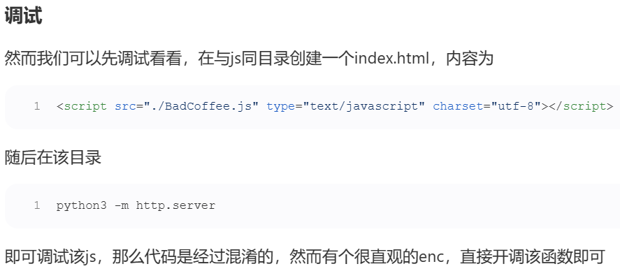
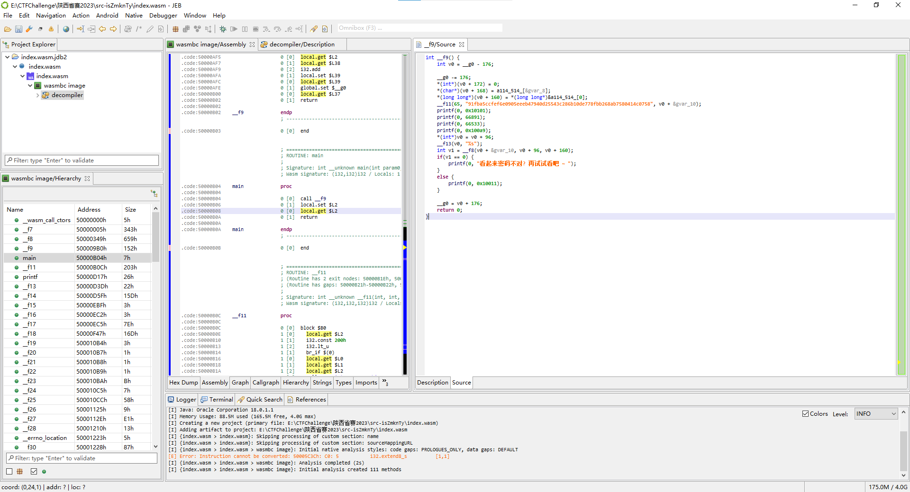
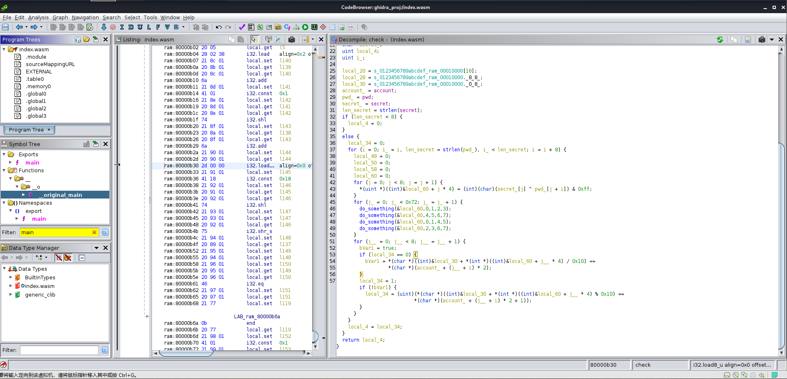
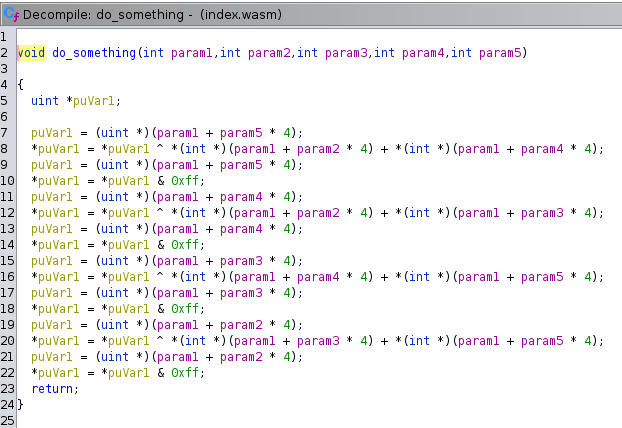
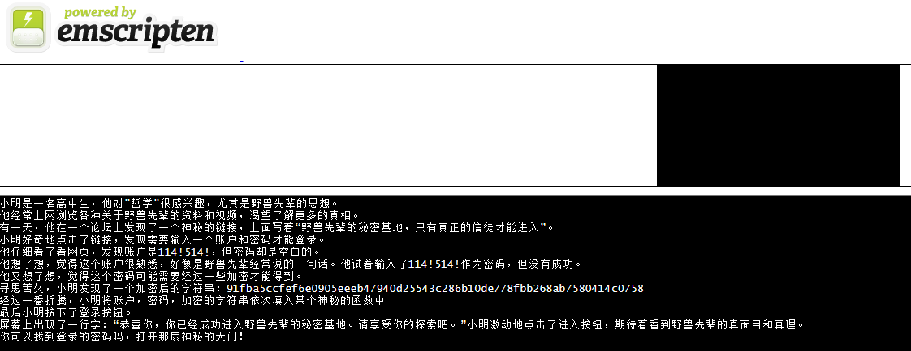

# BadCoffee

js混淆逆向

反混淆后的代码：

```javascript
function table() {
    var _0x293934 = ['8QWULJr', '414933buASiW', 'log', 'uuIPk', '2hWBkZw', 
            '50830UgfzNJ', 'search', 'toString', 'nPakj', '118810yaFCRd', 
            'apply', 'YES', '3279144wTrqht', 'FRwAT', '204nSqkLC', 
            'kGYrv', 'XmyuE', '2810463LgnfkD', 'qGnaj', '1665531censkz', 
            'flag{xxxxxxxxxxxxxxxxxxxxxxxxxxxxxxxxx}', '1166JQjGyF', 
            '(((.+)+)+)+$', 'TKKGW', 'charAt', 'constructor', '5882863UAzTOx'];
    table = function() {
        return _0x293934;
    }
    ;
    return table();
}
function table_arg_sub_307(_0x21da69, _0x31c369) {
    var _0x1d6e59 = table();
    return table_arg_sub_307 = function(_0x52956b, _0x1581c3) {
        _0x52956b = _0x52956b - (307);
        var _0x62d41 = _0x1d6e59[_0x52956b];
        return _0x62d41;
    }
    ,
    table_arg_sub_307(_0x21da69, _0x31c369);
}

...

function xorFunction(_0x53b7bb, _0x590286) {
    var _0xafde9a = table_arg_sub_307
      , _0x324e3a = {};
    _0x324e3a['toString'] = function(_0x318579, _0x2c8042) {
        return _0x318579 ^ _0x2c8042;
    }
    ;
    var _0x3ba534 = _0x324e3a;
    return _0x3ba534['nPakj'](_0x53b7bb, _0x590286);
}
function enc(flag) {
    var _0x137834 = table_arg_sub_307
      , _0x3aaed1 = {
        'XmyuE': function(_0x57b977, _0x20fa18, _0x570bf6) {
            return _0x57b977(_0x20fa18, _0x570bf6);
        }
    }
      , xor_array = []
      , array1 = [233, 129, 127, 238, 145, 144, 11, 43, 87, 134, 243, 158, 197, 216, 111, 136, 152, 29, 204, 31, 26, 228, 39, 148, 215, 220, 90, 76, 251, 57, 183, 184, 150, 157, 156, 176, 13, 41, 30, 86, 244, 8];
    for (let i = 0; i < 42; i++) {
        // xor_array[i] = _0x3aaed1[_0x137834(0x142)](xorFunction, array1['at'](i), flag[_0x137834(0x14a)](i)['charCodeAt']());
        xor_array[i] = XmyuE(xorFunction, array1['at'](i), flag['charAt'](i)['charCodeAt']());
    }
    for (let i = 0; i < 42; i++) {
        xor_array[i] = xorFunction(xor_array['at'](i), array1['at'](41 - i));
    }
    console.log(xor_array);
    return xor_array;
}
function fff() {
    var table_arg_sub_307_ = table_arg_sub_307
      , functionTable = {
        'uuIPk': table_arg_sub_307_(0x148),
        'qGnaj': function(_0x5bc07b, _0x400faa, _0x441f85) {
            return _0x5bc07b(_0x400faa, _0x441f85);
        },
        'BnVXl': function(_0x189883) {
            return _0x189883();
        },
        'dhkyF': table_arg_sub_307_(0x146),
        'FRwAT': function(_0x3ab36f, _0x124b7f) {
            return _0x3ab36f(_0x124b7f);
        },
        'kGYrv': function(_0x127f5c, _0x4a909c) {
            return _0x127f5c < _0x4a909c;
        },
        'MrEod': function(_0x3d6620, _0x297ded) {
            return _0x3d6620 != _0x297ded;
        },
        'arYUV': 'Error',
        'TKKGW': table_arg_sub_307_(0x13d)
    }
      , _0x5a5ca7 = (function() {
        var _0x201045 = !![];
        return function(_0x69fca7, _0x2b8ad0) {
            var _0x5c3c95 = _0x201045 ? function() {
                var _0x579f2d = table_arg_sub_307;
                if (_0x2b8ad0) {
                    var _0xd4d9a8 = _0x2b8ad0[_0x579f2d(0x13c)](_0x69fca7, arguments);
                    return _0x2b8ad0 = null,
                    _0xd4d9a8;
                }
            }
            : function() {}
            ;
            return _0x201045 = ![],
            _0x5c3c95;
        }
        ;
    }())
      , _0x59c26e = functionTable[table_arg_sub_307_(0x144)](_0x5a5ca7, this, function() {
        var _0x25f3ae = table_arg_sub_307_;
        return _0x59c26e['toString']()[_0x25f3ae(0x138)](functionTable['uuIPk'])[_0x25f3ae(0x139)]()[_0x25f3ae(0x14b)](_0x59c26e)[_0x25f3ae(0x138)](functionTable[_0x25f3ae(0x135)]);
    });
    functionTable['BnVXl'](_0x59c26e);
    // var _0xe4960c = functionTable['dhkyF']
     var _0xe4960c = "flag{xxxxxxxxxxxxxxxxxxxxxxxxxxxxxxxxx}"
      // , _0x55dae6 = functionTable[table_arg_sub_307_(0x13f)](enc, _0xe4960c)
      , _0x55dae6 = enc(_0xe4960c)
      , _0xbb5ecd = [ 135, 25, 72, 151, 195, 212, 228, 212, 250, 101, 39, 77, 163, 77, 70, 167, 119, 184, 7, 77, 144, 154, 93, 10, 185, 48, 179, 77, 71, 163, 67, 61, 113, 156, 196, 136, 239, 241, 128, 93, 84, 156];
    // for (let i = -0x15a * -0x4 + -0x709 * 0x2 + 0x8aa * 0x1; functionTable[table_arg_sub_307_(0x141)](i, -0x2351 * 0x1 + 0x67f + 0x1cfc); i++) {
        for (let i = 0; i < 42 ; i++) {
        // if (functionTable['MrEod'](_0x55dae6['at'](i), _0xbb5ecd['at'](i))) {
           if (_0x55dae6['at'](i) != _0xbb5ecd['at'](i)) { 
            console[table_arg_sub_307_(0x134)](functionTable['arYUV']);
            return;
        }
    }
    console[table_arg_sub_307_(0x134)](functionTable[table_arg_sub_307_(0x149)]);
    return;
}
fff();
```

函数表：(部分函数的调用通过这个函数表获取)

```javascript
function table() {
    var _0x293934 = ['8QWULJr', '414933buASiW', 'log', 'uuIPk', '2hWBkZw', 
            '50830UgfzNJ', 'search', 'toString', 'nPakj', '118810yaFCRd', 
            'apply', 'YES', '3279144wTrqht', 'FRwAT', '204nSqkLC', 
            'kGYrv', 'XmyuE', '2810463LgnfkD', 'qGnaj', '1665531censkz', 
            'flag{xxxxxxxxxxxxxxxxxxxxxxxxxxxxxxxxx}', '1166JQjGyF', 
            '(((.+)+)+)+$', 'TKKGW', 'charAt', 'constructor', '5882863UAzTOx'];
    table = function() {
        return _0x293934;
    }
    ;
    return table();
}
function table_arg_sub_307(_0x21da69, _0x31c369) {
    var _0x1d6e59 = table();
    return table_arg_sub_307 = function(_0x52956b, _0x1581c3) {
        _0x52956b = _0x52956b - (307);
        var _0x62d41 = _0x1d6e59[_0x52956b];
        return _0x62d41;
    }
    ,
    table_arg_sub_307(_0x21da69, _0x31c369);
}
```

主逻辑函数：

同样也有一个局部变量的函数表。

主逻辑为先enc函数加密`_0xe4960c`，即flag，然后与结果比对。

```javascript
function fff() {
    var table_arg_sub_307_ = table_arg_sub_307
      , functionTable = {
        'uuIPk': table_arg_sub_307_(0x148),
        'qGnaj': function(_0x5bc07b, _0x400faa, _0x441f85) {
            return _0x5bc07b(_0x400faa, _0x441f85);
        },
        'BnVXl': function(_0x189883) {
            return _0x189883();
        },
        'dhkyF': table_arg_sub_307_(0x146),
        'FRwAT': function(_0x3ab36f, _0x124b7f) {
            return _0x3ab36f(_0x124b7f);
        },
        'kGYrv': function(_0x127f5c, _0x4a909c) {
            return _0x127f5c < _0x4a909c;
        },
        'MrEod': function(_0x3d6620, _0x297ded) {
            return _0x3d6620 != _0x297ded;
        },
        'arYUV': 'Error',
        'TKKGW': table_arg_sub_307_(0x13d)
    }

    ...

    // var _0xe4960c = functionTable['dhkyF']
     var _0xe4960c = "flag{xxxxxxxxxxxxxxxxxxxxxxxxxxxxxxxxx}"
      // , _0x55dae6 = functionTable[table_arg_sub_307_(0x13f)](enc, _0xe4960c)
      , _0x55dae6 = enc(_0xe4960c)
      , _0xbb5ecd = [ 135, 25, 72, 151, 195, 212, 228, 212, 250, 101, 39, 77, 163, 77, 70, 167, 119, 184, 7, 77, 144, 154, 93, 10, 185, 48, 179, 77, 71, 163, 67, 61, 113, 156, 196, 136, 239, 241, 128, 93, 84, 156];
    // for (let i = -0x15a * -0x4 + -0x709 * 0x2 + 0x8aa * 0x1; functionTable[table_arg_sub_307_(0x141)](i, -0x2351 * 0x1 + 0x67f + 0x1cfc); i++) {
        for (let i = 0; i < 42 ; i++) {
        // if (functionTable['MrEod'](_0x55dae6['at'](i), _0xbb5ecd['at'](i))) {
           if (_0x55dae6['at'](i) != _0xbb5ecd['at'](i)) { 
            console[table_arg_sub_307_(0x134)](functionTable['arYUV']);
            return;
        }
    }
    console[table_arg_sub_307_(0x134)](functionTable[table_arg_sub_307_(0x149)]);
    return;
}
```

enc函数：

```javascript
function xorFunction(_0x53b7bb, _0x590286) {
    var _0xafde9a = table_arg_sub_307
      , _0x324e3a = {};
    _0x324e3a['toString'] = function(_0x318579, _0x2c8042) {
        return _0x318579 ^ _0x2c8042;
    }
    ;
    var _0x3ba534 = _0x324e3a;
    return _0x3ba534['nPakj'](_0x53b7bb, _0x590286);
}
function enc(flag) {
    var _0x137834 = table_arg_sub_307
      , _0x3aaed1 = {
        'XmyuE': function(_0x57b977, _0x20fa18, _0x570bf6) {
            return _0x57b977(_0x20fa18, _0x570bf6);
        }
    }
      , xor_array = []
      , array1 = [233, 129, 127, 238, 145, 144, 11, 43, 87, 134, 243, 158, 197, 216, 111, 136, 152, 29, 204, 31, 26, 228, 39, 148, 215, 220, 90, 76, 251, 57, 183, 184, 150, 157, 156, 176, 13, 41, 30, 86, 244, 8];
    for (let i = 0; i < 42; i++) {
        // xor_array[i] = _0x3aaed1[_0x137834(0x142)](xorFunction, array1['at'](i), flag[_0x137834(0x14a)](i)['charCodeAt']());
        xor_array[i] = XmyuE(xorFunction, array1['at'](i), flag['charAt'](i)['charCodeAt']());
    }
    for (let i = 0; i < 42; i++) {
        xor_array[i] = xorFunction(xor_array['at'](i), array1['at'](41 - i));
    }
    console.log(xor_array);
    return xor_array;
}
```

## exp

```javascript
array1 = [233, 129, 127, 238, 145, 144, 11, 43, 87, 134, 243, 158, 197, 216, 111, 136, 152, 29, 204, 31, 26, 228, 39, 148, 215, 220, 90, 76, 251, 57, 183, 184, 150, 157, 156, 176, 13, 41, 30, 86, 244, 8]
result = [135, 25, 72, 151, 195, 212, 228, 212, 250, 101, 39, 77, 163, 77, 70, 167, 119, 184, 7, 77, 144, 154, 93, 10, 185, 48, 179, 77, 71, 163, 67, 61, 113, 156, 196, 136, 239, 241, 128, 93, 84, 156]
let flag = []
for (let i = 0; i < 42; i++) { 
    flag.push(result[i] ^ array1[i] ^ array1[41 - i])
}
console.log(String.fromCharCode(...flag))
```

## 其他师傅的思路技巧



# Web&Assembly

## 两种逆向方法

### wabt

`陕西省赛2023/wasm2c index.wasm -o index.c`

`gcc -c index.c -o index.o`

将.wasm文件转为.o文件，进入IDA分析。

### JEB + Ghidra



Ghidra需要安装[ghidra-wasm-plugin](https://github.com/nneonneo/ghidra-wasm-plugin)插件。





## 分析

由提示可知，check函数的输入：



先看`do_something`，逻辑为：

```python
def do_something(par, a, b, c, d):
	par[d] = (par[d] ^ par[a] + par[c]) & 0xFF
	par[c] = (par[c] ^ par[a] + par[b]) & 0xFF
	par[b] = (par[b] ^ par[c] + par[d]) & 0xFF
	par[a] = (par[a] ^ par[b] + par[d]) & 0xFF
```

再看`main`，逻辑为：

```python
def check(secret, pwd, account):
    s = "0123456789abcdef"
    var = 0
    for i in range(0, len(pwd), 8):
        array = []
        for j in range(8):
            array.append((secret[j] ^ pwd[j + i]) & 0xFF)
        for j in range(0x72):
        	do_something(array, 0, 1, 2, 3)
        	do_something(array, 4, 5, 6, 7)
        	do_something(array, 0, 1, 4, 5)
        	do_something(array, 2, 3, 6, 7)
        for j in range(8):
            num = array[j]
            var = var | s[num/16] == account[(j + i) * 2] | s[num%16] == account[(j + i) * 2 + 1]
    return var
```

## exp

```python
def re_do(par, a, b, c, d):
    par[a] = (par[a] ^ par[b] + par[d]) & 0xFF
    par[b] = (par[b] ^ par[c] + par[d]) & 0xFF
    par[c] = (par[c] ^ par[a] + par[b]) & 0xFF
    par[d] = (par[d] ^ par[a] + par[c]) & 0xFF

s = "0123456789abcdef"
key = "114!514!"
result = "91fba5ccfef6e0905eeeb47940d25543c286b10de778fbb268ab7580414c0758"
flag = ""
array = []
for i in range(len(result) // 2):
    array.append(s.index(result[i * 2]) * 16 + s.index((result[i * 2 + 1])))
for i in range(0, len(array), 8):
    a = array[i:i+8]
    for j in range(0x72):
        re_do(a, 2, 3, 6, 7)
        re_do(a, 0, 1, 4, 5)
        re_do(a, 4, 5, 6, 7)
        re_do(a, 0, 1, 2, 3)
    for j in range(len(key)):
        a[j] = (a[j] ^ ord(key[j])) & 0xFF
    flag += "".join(chr(j) for j in a)
print(flag)
```

